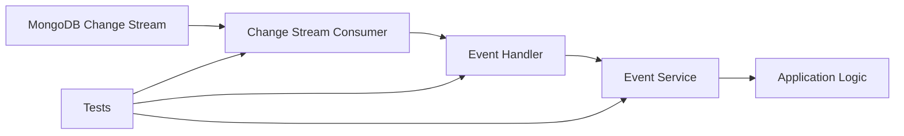
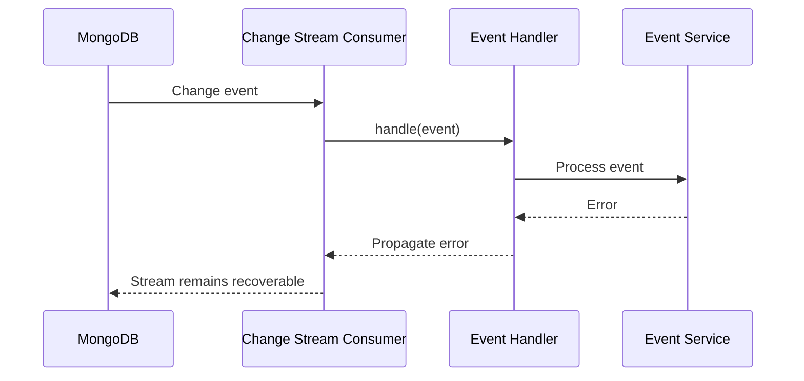
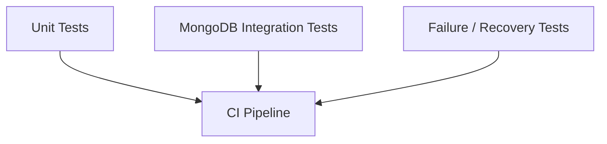

# README

## Overview

This directory contains automated tests for the MongoDB Change Streams application.

The tests focus on the two primary responsibilities of the change-stream processing layer:

- Consuming MongoDB change stream events correctly.
- Dispatching change events to the appropriate application-level handler.

The test suite is intentionally separated from MongoDB infrastructure concerns. Unit tests should validate event-processing behavior deterministically, while integration tests should be used when validating actual MongoDB change stream behavior, replica-set requirements, resume tokens, and database lifecycle behavior.

## Test Scope

The test suite covers the event-processing boundary between MongoDB and the application.



### Change Stream Consumer Tests

The consumer tests validate responsibilities such as:

- Creating a change stream with the expected configuration.
- Filtering supported operation types.
- Processing events in stream order.
- Forwarding events to the event handler.
- Supporting resume tokens.
- Propagating handler failures.
- Propagating MongoDB errors.
- Stopping processing when an event cannot be handled successfully.

### Event Handler Tests

The event handler tests validate dispatching based on `operationType`.

| MongoDB Event | Application Action |
|---|---|
| `insert` | Process the inserted document |
| `update` | Process the update event and its update description |
| `replace` | Process the replacement document |
| `delete` | Process the deleted document key |
| Unsupported event | Ignore or reject according to application policy |

The handler should not silently convert processing failures into successful event consumption. A failure must remain observable to the change stream consumer so that retry or recovery behavior can occur.

## Test Structure

Expected test files:

```text
tests/
    __init__.py
    .env.example
    .gitignore
    README.md
    requirements.txt
    test_change_stream.py
    test_event_handler.py
```

Responsibilities:

| File | Responsibility |
|---|---|
| `test_change_stream.py` | Change stream consumer behavior |
| `test_event_handler.py` | Event dispatch and validation |
| `requirements.txt` | Test dependencies |
| `.env.example` | Example test configuration |
| `.gitignore` | Test-local generated files |
| `README.md` | Test documentation |

## Running the Tests

From the project root:

```bash
pytest
```

Run the complete test suite with verbose output:

```bash
pytest -v
```

Run only the change stream tests:

```bash
pytest tests/test_change_stream.py -v
```

Run only event handler tests:

```bash
pytest tests/test_event_handler.py -v
```

Run a specific test:

```bash
pytest tests/test_event_handler.py::test_handles_insert_event -v
```

Run with coverage when the coverage tool is installed:

```bash
pytest --cov=src --cov-report=term-missing
```

## Test Design Principles

### Test Behavior, Not Implementation Details

Tests should validate externally observable behavior rather than private implementation details.

Prefer:

```python
handler.handle(event)

processor.process_insert.assert_called_once_with(
    event["fullDocument"]
)
```

over asserting internal variables or private helper calls.

This keeps tests stable when the implementation is refactored without changing application behavior.

### Test Each Change Event Type

Each supported MongoDB operation should have explicit coverage.

At minimum:

- `insert`
- `update`
- `replace`
- `delete`

Update events deserve particular attention because their payload can contain both:

- `documentKey`
- `updateDescription`

and may optionally contain `fullDocument` when the change stream is configured for document lookup.

### Preserve Failure Semantics

A failed event handler must not be interpreted as a successfully processed event.



This is important for reliable event processing. Swallowing exceptions can result in an event being lost from the application's perspective even though MongoDB has already advanced the stream.

## Mocking Strategy

Unit tests should mock external MongoDB dependencies when testing application logic.

Typical dependencies include:

- `Collection`
- `ChangeStream`
- Event processors
- Event services

Example:

```python
from unittest.mock import MagicMock

collection = MagicMock()
handler = MagicMock()
```

Mocking is appropriate for deterministic unit tests, but it cannot validate actual MongoDB behavior.

For example, a mock cannot prove that:

- A replica set is configured correctly.
- A resume token is valid.
- `fullDocument="updateLookup"` behaves correctly against the configured MongoDB version.
- A change stream survives a primary election.
- MongoDB reconnect behavior works as expected.

Those behaviors require integration testing.

## Unit Tests vs Integration Tests

| Concern | Unit Test | Integration Test |
|---|---:|---:|
| Event dispatch | Yes | Optional |
| Handler failure propagation | Yes | Optional |
| Event validation | Yes | Optional |
| MongoDB `watch()` configuration | Mocked | Yes |
| Real change stream events | No | Yes |
| Resume tokens | Limited | Yes |
| Replica-set behavior | No | Yes |
| Failover behavior | No | Yes |
| MongoDB permissions | No | Yes |
| Network failures | No | Yes |

A production-grade change stream application should use both levels.

## Integration Test Environment

MongoDB Change Streams require a deployment configuration that supports them, typically a replica set or a sharded cluster.

For local integration testing, a replica-set-enabled MongoDB instance should be used rather than assuming a standalone MongoDB server is sufficient.

The integration flow should resemble:

```text
Application
    ↓
MongoClient
    ↓
MongoDB Replica Set
    ↓
Collection
    ↓
Change Stream
    ↓
Application Consumer
```

Integration tests should create test data, wait for the corresponding change event, validate processing, and clean up test data.

Avoid making unit tests depend on a developer's locally running MongoDB instance.

## Environment Configuration

Test configuration should be supplied through environment variables rather than hard-coded credentials or connection strings.

Example:

```dotenv
MONGODB_URI=mongodb://localhost:27017/?replicaSet=rs0
MONGODB_DATABASE=mongodb_change_streams
MONGODB_COLLECTION=events

MONGODB_SERVER_SELECTION_TIMEOUT_MS=5000
MONGODB_CONNECT_TIMEOUT_MS=5000
MONGODB_SOCKET_TIMEOUT_MS=30000

MONGODB_MAX_POOL_SIZE=100
MONGODB_MIN_POOL_SIZE=5

MONGODB_RETRY_READS=true
MONGODB_RETRY_WRITES=true

CHANGE_STREAM_BATCH_SIZE=100
CHANGE_STREAM_MAX_AWAIT_TIME_MS=1000
CHANGE_STREAM_RESUME_ON_ERROR=true

EVENT_PROCESSING_MAX_RETRIES=3
EVENT_PROCESSING_RETRY_DELAY_SECONDS=1

LOG_LEVEL=INFO
```

Do not commit real credentials or environment-specific secrets.

## Important Change Stream Test Cases

A production-oriented suite should cover the following scenarios.

### Normal Processing

- Insert event is processed.
- Update event is processed.
- Replace event is processed.
- Delete event is processed.
- Multiple events are processed in order.

### Invalid Events

- Missing `operationType`.
- Missing required event fields.
- Unsupported operation type.
- Malformed document payload.
- Malformed update description.

### Failure Handling

- Handler raises an exception.
- MongoDB fails while creating the stream.
- MongoDB connection is interrupted.
- Event processing fails after previous events succeeded.
- Processing stops at the failed event when sequential processing is required.

### Resume Behavior

- Consumer starts without a resume token.
- Consumer starts from a stored resume token.
- Resume token is persisted only after successful processing.
- Invalid or stale resume tokens are handled appropriately.

### Operational Behavior

- Consumer can be stopped cleanly.
- Stream resources are released.
- Shutdown does not leave processing state inconsistent.
- Errors are logged with sufficient event context.
- Long-running consumers do not leak resources.

## Idempotency Testing

Change stream consumers should be designed so that processing the same event more than once does not corrupt application state.

A useful test strategy is to process the same event repeatedly:

```python
event = {
    "_id": {"_data": "resume-token-001"},
    "operationType": "insert",
    "fullDocument": {
        "_id": "document-001",
        "status": "created",
    },
}

handler.handle(event)
handler.handle(event)
```

The expected result depends on the application architecture, but a production system should define explicitly whether duplicate delivery is:

- Naturally idempotent.
- Deduplicated using the resume token or event identifier.
- Protected by a unique database constraint.
- Handled through an idempotency store.

Do not assume that a change stream consumer provides exactly-once application processing.

## Resume Token Testing

Resume tokens are part of the reliability model of change streams.

A typical lifecycle is:

```text
Receive event
    ↓
Process event
    ↓
Processing succeeds
    ↓
Persist processing state / resume token
    ↓
Continue consuming
```

Persisting progress before successful processing can cause events to be skipped after a crash.

Tests should therefore distinguish between:

- Event received.
- Event processing started.
- Event processing succeeded.
- Event processing failed.
- Resume position persisted.

The exact persistence strategy depends on the application architecture.

## Common Testing Mistakes

### Testing Only With Mocks

Mocks can verify that application code calls expected methods, but they cannot prove that MongoDB behaves as expected.

Use integration tests for database-specific behavior.

### Swallowing Handler Exceptions

This pattern is dangerous:

```python
try:
    handler.handle(event)
except Exception:
    logger.exception("Event processing failed")
```

If the exception is swallowed without a recovery strategy, the consumer may continue and the failed event can become effectively lost.

### Assuming Exactly-Once Processing

Change streams provide ordered change events and resume capabilities, but application-level exactly-once side effects require additional design.

Use idempotent handlers and durable processing state where necessary.

### Testing Only Insert Events

Real applications receive multiple operation types. Update and delete events have materially different payload structures and should have dedicated tests.

### Hard-Coding MongoDB Credentials

Never place production credentials in test source code or committed environment files.

Use environment variables or a secret-management mechanism.

### Depending on Local MongoDB State

Tests should create the data they need and clean up after themselves. They should not depend on documents left behind by previous manual testing.

## Production Test Strategy

A mature test strategy should separate test levels.



### Unit Tests

Fast and deterministic.

Use them for:

- Event validation.
- Event routing.
- Service logic.
- Error propagation.
- Idempotency logic.
- Transformation logic.

### Integration Tests

Run against an actual MongoDB deployment.

Use them for:

- `watch()` behavior.
- Change event payloads.
- Resume tokens.
- `fullDocument` lookup.
- Replica-set behavior.
- Index and database interactions.
- Connection failures.

### Failure and Recovery Tests

Validate production resilience.

Examples:

- Kill the MongoDB primary.
- Restart the consumer.
- Interrupt the network connection.
- Resume from a persisted token.
- Replay an event.
- Verify duplicate processing behavior.
- Verify graceful shutdown.

## CI/CD Considerations

Tests that require only mocks should run on every pull request.

Integration tests should run in CI against an isolated MongoDB environment, such as a disposable Docker-based replica set or dedicated test service.

A typical pipeline is:

```text
Checkout
   ↓
Install dependencies
   ↓
Lint / Type Check
   ↓
Unit Tests
   ↓
Start MongoDB Test Environment
   ↓
Integration Tests
   ↓
Coverage / Test Reports
   ↓
Build / Deploy
```

Tests should never connect to production MongoDB from CI.

## Test Isolation

Each test should control its own state.

Recommended practices:

- Use unique test identifiers.
- Use dedicated test databases.
- Clean up created documents.
- Avoid shared mutable fixtures.
- Avoid ordering dependencies between tests.
- Keep unit tests independent from MongoDB.
- Use integration fixtures for database lifecycle management.

For parallel test execution, avoid using the same collection and identifiers unless the fixture strategy explicitly isolates them.

## Performance Considerations

Change stream tests can become slow if every test waits for real-time events against MongoDB.

Keep the majority of tests as unit tests and reserve integration tests for behavior that cannot be validated with mocks.

For integration tests:

- Use bounded timeouts.
- Avoid arbitrary `sleep()` calls.
- Poll for expected events when appropriate.
- Clean up resources deterministically.
- Avoid creating unnecessary indexes or large datasets.
- Run expensive resilience tests separately when appropriate.

Prefer deterministic synchronization over:

```python
import time

time.sleep(5)
```

A fixed sleep makes tests slower and still does not guarantee that the event has arrived.

## Troubleshooting Test Failures

Use a structured debugging process:

```text
Symptom
↓
Identify failing test layer
↓
Check MongoDB availability
↓
Verify replica-set configuration
↓
Inspect connection string
↓
Inspect change stream configuration
↓
Check event payload
↓
Check handler failure
↓
Reproduce with a focused test
↓
Correct the root cause
```

### Test Fails Before Connecting to MongoDB

Check:

```bash
mongosh "$MONGODB_URI"
```

Verify:

- MongoDB is reachable.
- Credentials are valid.
- The replica set is configured.
- The configured database exists or can be created.
- Network access is available.

### Change Stream Test Hangs

Possible causes include:

- No MongoDB change was generated.
- Change stream is waiting for an event.
- Replica-set configuration is incorrect.
- Consumer shutdown logic is incomplete.
- Test timeout is missing.

Use explicit test timeouts and inspect MongoDB connectivity before debugging application code.

### Resume Test Fails

Check:

- The resume token was obtained from a valid change event.
- The token belongs to the expected stream.
- The underlying oplog still contains the required history.
- The consumer uses `resume_after` or another resume mechanism correctly.

Do not treat resume tokens as permanent database identifiers.

## Key Takeaways

- Keep event-processing logic heavily covered by fast unit tests and validate MongoDB-specific behavior with integration tests.
- Test every supported change event type, especially update and delete events whose payloads differ from inserts.
- Preserve failure semantics so an unsuccessfully processed event is not treated as successfully consumed.
- Design tests around idempotency, resume behavior, deterministic synchronization, and recovery rather than assuming exactly-once processing.
- Keep CI tests isolated from production MongoDB and use replica-set-enabled environments for real change stream integration tests.