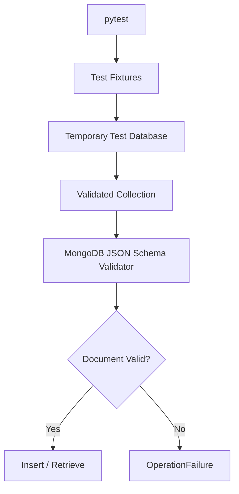
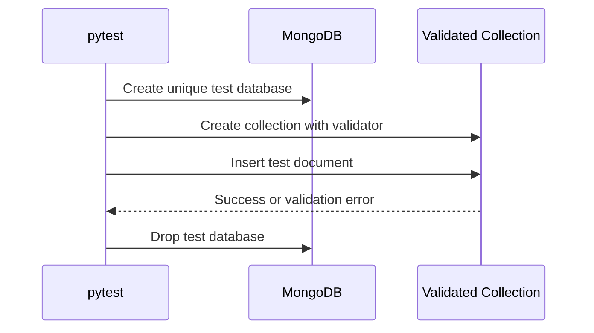
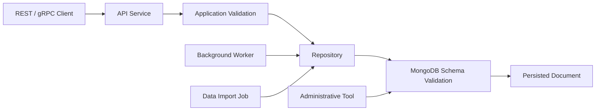
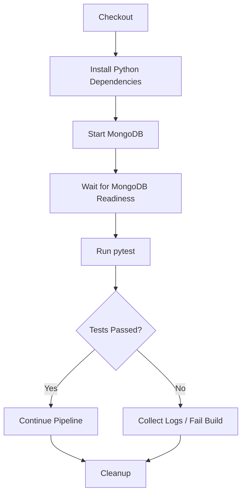

# README

## Overview

This directory contains the automated tests for the MongoDB Schema Validation Application.

The test suite verifies that MongoDB collection validators enforce the intended document contracts at the database boundary. Tests cover valid documents, invalid documents, BSON type enforcement, required fields, nested structures, arrays, validation configuration, and persistence behavior.

The tests use `pytest` with a real MongoDB instance rather than mocking MongoDB validation behavior. This is important because schema validation is executed by the MongoDB server, so unit tests based only on mocked collections cannot verify the actual validator semantics.

## Test Scope

The test suite focuses on the following areas:

| Test Area | Purpose |
|---|---|
| Valid documents | Verify documents satisfying the schema are accepted |
| Invalid documents | Verify malformed documents are rejected |
| Required fields | Verify mandatory fields cannot be omitted |
| BSON types | Verify fields use the expected MongoDB types |
| Nested validation | Verify embedded documents follow their schema |
| Array validation | Verify array and element types |
| Enum validation | Verify only supported status/currency values are accepted |
| Numeric constraints | Verify price, stock, and dimension boundaries |
| Additional properties | Verify schema-specific flexibility or restrictions |
| Validation configuration | Verify validation level and action |
| Persistence | Verify rejected documents are not stored |
| Collection isolation | Prevent tests from modifying application databases |

## Test Architecture

The tests interact with MongoDB through the schema validation layer:



The important boundary is MongoDB itself. The application creates a collection with a validator, then the test inserts documents through the normal PyMongo API.

## Test Files

| File | Responsibility |
|---|---|
| `test_schema_validation.py` | Core schema validation and validator configuration tests |
| `test_valid_documents.py` | Documents expected to pass MongoDB validation |
| `test_invalid_documents.py` | Documents expected to fail MongoDB validation |
| `.env.example` | Example test/application configuration |
| `.gitignore` | Test-specific generated-file exclusions |
| `requirements.txt` | Test dependencies |

## Test Environment

The integration tests expect MongoDB to be available at:

```text
mongodb://localhost:27017
```

The tests first execute a MongoDB `ping`. If MongoDB is unavailable, the integration fixtures skip the tests rather than producing misleading application failures.

A local MongoDB deployment can be started with Docker:

```bash
docker run -d \
  --name mongodb-schema-validation \
  -p 27017:27017 \
  mongo
```

Verify connectivity with `mongosh`:

```bash
mongosh "mongodb://localhost:27017"
```

Or:

```javascript
db.adminCommand({ ping: 1 })
```

## Running the Tests

Install the test dependencies:

```bash
python -m pip install -r requirements.txt
```

Run the complete suite:

```bash
pytest
```

Run with more detailed output:

```bash
pytest -v
```

Run a specific test module:

```bash
pytest tests/test_valid_documents.py -v
```

Run only invalid-document tests:

```bash
pytest tests/test_invalid_documents.py -v
```

Run a specific test:

```bash
pytest tests/test_valid_documents.py::test_valid_customer_is_accepted -v
```

Run with short tracebacks:

```bash
pytest -q
```

## Database Isolation

Each test database receives a unique name:

```text
valid_documents_test_<uuid>
```

This prevents tests from modifying application data or interfering with other test executions.

The lifecycle is:



This isolation strategy is preferable to reusing a shared database such as `mongodb_schema_validation`, especially when tests execute concurrently in CI/CD.

## Fixtures

The primary fixtures provide MongoDB resources at the appropriate scope.

### MongoDB Client

The session-scoped client creates one `MongoClient` for the complete test session.

```python
@pytest.fixture(scope="session")
def mongodb_client() -> MongoClient[dict[str, Any]]:
    client = MongoClient(
        "mongodb://localhost:27017",
        serverSelectionTimeoutMS=1000,
    )

    client.admin.command("ping")

    yield client
    client.close()
```

Using one client per test process is consistent with normal PyMongo usage. `MongoClient` manages its own connection pool and should generally be reused rather than recreated for every request or test.

### Test Database

Each test receives an isolated database:

```python
@pytest.fixture
def database(
    mongodb_client: MongoClient[dict[str, Any]],
) -> Database[dict[str, Any]]:
    database_name = f"valid_documents_test_{uuid4().hex}"
    database = mongodb_client[database_name]

    yield database

    mongodb_client.drop_database(database_name)
```

This also ensures cleanup happens after the test completes.

### Validated Collections

Customer tests create a collection using `CUSTOMER_SCHEMA`:

```python
return create_validated_collection(
    database,
    "customers",
    CUSTOMER_SCHEMA,
)
```

Product tests similarly use `PRODUCT_SCHEMA`.

This keeps the tests aligned with the application's actual schema definitions rather than duplicating the validator inside every test.

## Valid Document Tests

`test_valid_documents.py` verifies the positive side of the contract.

Typical cases include:

- Complete customer documents
- Minimal customer documents
- Supported customer statuses
- Valid phone values
- Nested customer addresses
- Customer tag arrays
- Complete product documents
- Minimal product documents
- Supported currencies
- Supported product statuses
- Valid prices
- Valid stock quantities
- Valid descriptions
- Valid product dimensions
- Additional product properties where permitted

A successful test normally verifies that MongoDB accepts the insert:

```python
result = customer_collection.insert_one(document)

assert result.inserted_id is not None
```

For important cases, the test also retrieves the document to verify that the accepted document is actually persisted.

## Invalid Document Tests

`test_invalid_documents.py` verifies the negative side of the contract.

Important failure categories include:

- Incorrect BSON types
- Empty required strings
- Invalid email values
- Unsupported enum values
- Invalid phone types
- Invalid nested addresses
- Missing nested required fields
- Unknown address properties
- Invalid array elements
- Invalid top-level properties
- Negative prices
- Invalid currencies
- Invalid product statuses
- Negative stock quantities
- Non-integer stock quantities
- Excessively long descriptions
- Invalid dimensions
- Missing required product fields

MongoDB validation failures are expected to raise `OperationFailure`:

```python
with pytest.raises(OperationFailure):
    customer_collection.insert_one(document)
```

The test should validate the database behavior rather than catching the exception and ignoring it.

## Schema Validation Coverage

The current schemas exercise several MongoDB JSON Schema features.

### Required Fields

Customer documents require fields such as:

```text
customer_id
first_name
last_name
email
status
```

Product documents require fields such as:

```text
product_id
name
sku
price
currency
category
status
```

Tests should cover both valid presence and invalid omission.

### BSON Types

MongoDB validates BSON types at the server boundary.

For example, a field defined as a string should reject:

```python
document["customer_id"] = 123
```

Similarly, `stock_quantity` is expected to be a BSON integer rather than a floating-point value.

### Nested Documents

The customer address demonstrates nested schema validation:

```text
customer
└── address
    ├── line1
    ├── line2
    ├── city
    ├── state
    ├── postal_code
    └── country
```

Tests verify both the BSON object type and required nested fields.

### Arrays

The customer and product schemas contain string arrays such as:

```python
["premium", "verified"]
```

Tests verify that array elements have the expected BSON type.

## Validation Configuration

The application uses explicit MongoDB validation configuration.

| Setting | Expected Value | Meaning |
|---|---|---|
| `validationLevel` | `strict` | Validate all inserts and updates against the validator |
| `validationAction` | `error` | Reject documents that fail validation |

Tests should verify these settings using MongoDB metadata rather than assuming that collection creation succeeded.

The validator can be inspected through the database metadata:

```python
options = get_validator_options(collection)

assert options["validationLevel"] == "strict"
assert options["validationAction"] == "error"
```

## Application Validation vs Database Validation

The application can validate data before persistence, but application validation should not be treated as the only protection.

A production request may flow through multiple services:



Application-level validation provides better API errors and business-rule handling.

MongoDB validation provides a database-level integrity boundary that protects against invalid writes from other application paths.

The two layers solve different problems and should not be treated as interchangeable.

## Error Assertions

Tests should distinguish expected validation failures from infrastructure failures.

Expected schema violations:

```python
with pytest.raises(OperationFailure):
    collection.insert_one(document)
```

Infrastructure problems such as unavailable MongoDB should not be interpreted as validation failures.

For debugging, inspect the exception details:

```python
try:
    collection.insert_one(document)
except OperationFailure as exc:
    print(exc)
```

In production test suites, avoid asserting the entire MongoDB error message unless the exact message is part of the contract. MongoDB error details can vary across server versions.

## Test Data Design

Test documents should be realistic enough to exercise the schema without coupling the tests to unnecessary business data.

Good test data:

- Uses representative field names
- Covers realistic BSON types
- Exercises boundary values
- Uses unique identifiers when necessary
- Keeps unrelated fields minimal
- Explicitly targets the behavior under test

Avoid creating a single enormous fixture containing every possible field and using it for every test. Such fixtures make failures harder to isolate.

## Boundary Testing

Schema validation tests should explicitly cover boundaries.

Examples include:

| Field | Boundary |
|---|---|
| `phone` | Minimum and maximum configured lengths |
| `description` | Maximum allowed length |
| `price` | `0` and positive values |
| `stock_quantity` | `0` and positive integers |
| `dimensions` | `0` and positive values |
| Required strings | Empty vs non-empty |
| Enum fields | Every supported value and representative invalid values |

Boundary tests are especially valuable when schema changes because they detect accidental relaxation or tightening of validation rules.

## Test Independence

Tests should not depend on execution order.

Avoid patterns such as:

```python
def test_create_document():
    ...

def test_read_document():
    # Assumes test_create_document ran first.
    ...
```

Instead, each test should create the data it requires.

This allows:

- Parallel execution
- Individual test execution
- Reliable CI runs
- Easier failure diagnosis
- Safer test retries

## Performance Considerations

These are integration tests, so they intentionally exercise the MongoDB server.

However, test execution should still avoid unnecessary database operations.

Prefer:

```python
collection.insert_one(document)
```

over inserting a large dataset when validating one schema rule.

For larger test scenarios:

- Use bulk writes where bulk behavior is the subject under test.
- Reuse the session-scoped `MongoClient`.
- Avoid repeatedly creating MongoDB clients.
- Use isolated databases rather than rebuilding the entire MongoDB deployment.
- Keep documents focused on the behavior being tested.

## CI/CD Considerations

The test suite requires a reachable MongoDB server.

A CI pipeline should provision MongoDB as a service or use a dedicated MongoDB test environment.

A typical CI flow is:



The readiness check is important. Starting a MongoDB container does not necessarily mean the database is immediately ready to accept connections.

## Environment Configuration

The test directory contains `.env.example` for documenting expected environment variables.

Typical configuration includes:

```dotenv
MONGODB_URI=mongodb://localhost:27017
MONGODB_DATABASE=mongodb_schema_validation
MONGODB_SERVER_SELECTION_TIMEOUT_MS=5000
MONGODB_CONNECT_TIMEOUT_MS=5000
MONGODB_SOCKET_TIMEOUT_MS=30000
```

Do not commit real credentials or production connection strings.

For CI/CD:

- Store credentials in the CI secret manager.
- Prefer short-lived credentials where supported.
- Restrict MongoDB users to the required test database.
- Never reuse production credentials for integration tests.
- Use network restrictions appropriate to the CI environment.

## Common Mistakes

### Using Mocked MongoDB for Schema Validation

Mocks can verify repository interactions but cannot verify MongoDB's JSON Schema behavior.

**Problem:** The test passes even if the actual MongoDB validator is invalid.

**Better approach:** Use real MongoDB integration tests for database-level validation and mocks only for application-layer unit tests.

### Reusing a Shared Test Database

**Problem:** Tests can interfere with each other and leave stale documents behind.

**Better approach:** Generate isolated database names and drop them after each test.

### Testing Only Valid Documents

**Problem:** A schema can accidentally become too permissive.

**Better approach:** Test both positive and negative cases, especially type, enum, required-field, nested, and boundary constraints.

### Asserting Exact MongoDB Error Messages

**Problem:** Error text can change between MongoDB server versions.

**Better approach:** Assert the exception type and, when necessary, stable error properties rather than the entire message.

### Recreating `MongoClient` for Every Test

**Problem:** Excessive connection creation adds latency and unnecessary connection-pool overhead.

**Better approach:** Reuse a session-scoped client.

### Treating Schema Validation as Business Validation

**Problem:** JSON Schema is not a replacement for domain rules.

For example, a schema can enforce that:

```text
price >= 0
```

but a business rule such as:

```text
discounted_price <= price
```

may belong in application/service logic unless it is intentionally modeled as a database constraint.

### Forgetting Update Validation

MongoDB validation applies to writes beyond initial inserts. Tests should include update scenarios when the application relies on updates being constrained by the validator.

## Troubleshooting

Use a structured diagnostic flow when tests fail:

```text
Symptom
↓
Possible causes
↓
Isolation strategy
↓
Diagnostic commands
↓
Root cause
↓
Corrective action
↓
Prevention
```

### MongoDB Connection Failure

```text
Symptom
↓
pytest skips or cannot connect
↓
MongoDB is stopped, port is incorrect, or networking is unavailable
↓
mongosh "mongodb://localhost:27017"
↓
Verify MongoDB process/container and port 27017
↓
Start or reconfigure MongoDB
↓
Add CI readiness checks
```

### Expected Invalid Document Is Accepted

```text
Symptom
↓
A test expected OperationFailure but insert succeeded
↓
Validator is missing, incorrect, or validationAction is not "error"
↓
Inspect collection validator and validationAction
↓
get_validator_options(collection)
↓
Correct collection creation/configuration
↓
Add validator configuration tests
```

### Valid Document Is Rejected

```text
Symptom
↓
A known-valid document raises OperationFailure
↓
Schema and test fixture disagree
↓
Inspect required fields, BSON types, nested fields, and enum values
↓
Compare the fixture with the active validator
↓
Correct either the schema or test data
↓
Keep representative positive test fixtures
```

### Tests Pass Locally but Fail in CI

```text
Symptom
↓
Integration tests pass locally but fail in CI
↓
MongoDB service is unavailable, not ready, or using different configuration
↓
Check CI service logs and connection settings
↓
Verify MongoDB readiness before pytest
↓
Correct CI service configuration
↓
Pin compatible MongoDB/PyMongo versions where appropriate
```

## Security Considerations

Test environments should be isolated from production systems.

Follow these rules:

- Never point integration tests at production MongoDB.
- Never commit `.env` files containing credentials.
- Use dedicated MongoDB users for CI.
- Grant only the permissions required by the test database.
- Avoid production data in test fixtures.
- Sanitize database logs before publishing CI artifacts.
- Keep test connection strings configurable through environment variables.
- Treat MongoDB connection credentials as secrets.

## Maintenance Guidelines

When a schema changes:

1. Update the schema definition.
2. Identify affected valid-document tests.
3. Add or update invalid-document tests.
4. Verify required fields and BSON types.
5. Review nested and array validation.
6. Review boundary conditions.
7. Run the complete integration suite.
8. Update fixtures and documentation when the contract changes.

Schema validation tests should evolve with the database contract. A schema change without corresponding test changes creates a false sense of database integrity.

## Key Takeaways

- MongoDB schema validation should be tested against a real MongoDB server because validation is enforced by the database engine.
- Positive and negative tests together define the effective document contract and should cover BSON types, required fields, nested documents, arrays, enums, and boundaries.
- Isolate each test database and reuse `MongoClient` to keep integration tests reliable, independent, and efficient.
- Application-level validation and MongoDB validation serve different purposes; production systems commonly benefit from both layers.
- CI should provision MongoDB, verify readiness, run the integration suite, and keep test credentials and data isolated from production.