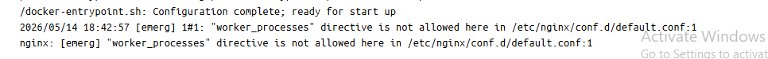

# Nginx Troubleshooting

Created by: aranya majumdar

## Worker_processes directive is not allowed here

### Reason:

When containerizing Nginx with Docker, you cannot put the `worker_processes` directive inside a custom `default.conf` file. Nginx will crash on startup because the directive is automatically injected into the wrong configuration "context."

Nginx configuration files are strictly hierarchical.

- **The Main Context:** Global settings like `worker_processes` must sit at the absolute top of the master `nginx.conf` file, completely outside of any curly braces.
- **The Docker Trap:** When using the official Nginx Docker image, any file you place into the `/etc/nginx/conf.d/` folder (like your `default.conf`) is automatically injected *inside* the `http { ... }` block of the container's hidden master file.
- **The Result:** Nginx reads your `worker_processes` line from inside the `http` block, realizes it violates the strict hierarchy rules, and immediately throws a fatal `[emerg]` error.

### Solution

Delete the `worker_processes` line entirely from your `default.conf` file.

- *Why:* The official Nginx Docker image already handles this perfectly. Its hidden master file sets `worker_processes auto;` by default, which automatically scales the workers to match the available CPU cores on the host machine. You only need your `default.conf` to handle the routing (`server { ... }`).