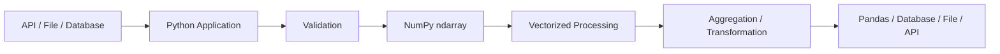

# 01- NumPy Overview

## Overview

NumPy is Python's foundational library for efficient numerical and array-based computation. Its central abstraction is the `ndarray`, a homogeneous, multidimensional array designed to store and operate on large collections of values efficiently.

For backend and data engineers, NumPy is most useful when a workload contains substantial numerical processing: transforming batches of measurements, calculating statistics, validating numeric datasets, applying vectorized business rules, or preprocessing data before passing it to Pandas or another system.

NumPy is not a replacement for Python's built-in collections or for Pandas. It occupies a specific layer in a data-processing stack:



The important engineering idea is that NumPy moves numerical work from repeated Python-level operations toward optimized array operations over contiguous or otherwise efficiently organized memory.

## Why NumPy Matters in Backend Engineering

Many backend systems eventually encounter workloads such as:

- Processing large batches of numeric records.
- Calculating totals, averages, percentiles, or other statistics.
- Normalizing or transforming numerical fields.
- Validating numeric ranges.
- Applying the same transformation to thousands or millions of values.
- Preparing numerical data for Pandas-based ETL pipelines.
- Processing files containing large numeric datasets.
- Running CPU-intensive batch jobs in Celery or other worker systems.
- Reducing Python loop overhead in performance-sensitive code.

Consider a batch containing one million sensor readings. A Python loop can process those values, but every iteration executes Python-level operations. NumPy instead represents the values as an array and applies optimized operations across the array.

This difference becomes increasingly important as dataset size grows.

```python
import numpy as np

readings = np.array([21.4, 22.1, 21.9, 23.2, 22.7])

adjusted = readings * 1.05
average = readings.mean()

print(adjusted)
print(average)
```

The operation:

```python
adjusted = readings * 1.05
```

expresses the transformation at the array level rather than explicitly iterating over each element.

NumPy should not, however, be described as "always faster." Performance depends on workload size, operation type, dtype, memory behavior, allocation patterns, and whether the computation can actually benefit from vectorization.

## NumPy's Array-Based Data Model

The fundamental NumPy object is the `ndarray`.

An `ndarray` represents a multidimensional, homogeneous collection of values with metadata describing how those values are organized in memory.

A useful conceptual model is:

```text
ndarray
├── Data buffer
├── Shape
├── Dtype
├── Strides
└── Memory layout / ownership information
```

The most important attributes are:

| Attribute | Meaning | Example |
|---|---|---|
| `shape` | Size of each dimension | `(1000, 10)` |
| `ndim` | Number of dimensions | `2` |
| `size` | Total number of elements | `10000` |
| `dtype` | Type of each element | `float64` |
| `itemsize` | Bytes used by one element | `8` |
| `nbytes` | Total bytes occupied by array data | `80000` |

Example:

```python
import numpy as np

values = np.array(
    [
        [10, 20, 30],
        [40, 50, 60],
    ],
    dtype=np.int32,
)

print(values.shape)    # (2, 3)
print(values.ndim)     # 2
print(values.size)     # 6
print(values.dtype)    # int32
print(values.itemsize) # 4
print(values.nbytes)   # 24
```

The distinction between `shape`, `size`, and `nbytes` is especially important when diagnosing memory usage.

## Dimensions, Shape, and Axes

A NumPy array can contain one or more dimensions.

```python
import numpy as np

one_dimensional = np.array([10, 20, 30])

two_dimensional = np.array(
    [
        [10, 20, 30],
        [40, 50, 60],
    ]
)

three_dimensional = np.zeros((2, 3, 4))
```

Their dimensionality is:

```text
1D → vector-like structure
2D → matrix/table-like structure
3D+ → multiple dimensions of structured numerical data
```

The `shape` describes the length of each dimension.

For:

```python
values = np.zeros((2, 3, 4))
```

the shape is:

```text
(2, 3, 4)
```

and the total number of elements is:

```text
2 × 3 × 4 = 24
```

### Axes

An axis identifies a dimension along which an operation can be performed.

For a two-dimensional array:

```python
values = np.array(
    [
        [10, 20, 30],
        [40, 50, 60],
    ]
)
```

the conceptual layout is:

```text
        axis=1
      0   1   2
    ┌─────────────
axis=0 10  20  30
      40  50  60
```

For example:

```python
values.sum(axis=0)
```

produces column-wise aggregation:

```text
[50, 70, 90]
```

while:

```python
values.sum(axis=1)
```

produces row-wise aggregation:

```text
[60, 150]
```

Understanding axes is essential for aggregation, broadcasting, reshaping, and multidimensional transformations.

## Creating Arrays

NumPy arrays can be created from existing Python data or directly from NumPy constructors.

Common patterns include:

```python
import numpy as np

from_list = np.array([1, 2, 3, 4])

zeros = np.zeros((100, 10))

ones = np.ones((3, 3))

sequence = np.arange(0, 100, 5)

evenly_spaced = np.linspace(0, 1, 11)
```

The choice of constructor depends on the workload.

| Constructor | Typical Use |
|---|---|
| `np.array()` | Convert existing data into an array |
| `np.zeros()` | Allocate initialized numeric storage |
| `np.ones()` | Allocate storage initialized to one |
| `np.empty()` | Allocate without initializing values |
| `np.arange()` | Generate numeric sequences by step |
| `np.linspace()` | Generate a fixed number of evenly spaced values |

For production code, explicitly choosing the dtype can prevent unnecessary memory usage.

```python
values = np.zeros(1_000_000, dtype=np.float32)
```

A `float32` element requires 4 bytes, compared with 8 bytes for a typical `float64` element.

That difference becomes material for large datasets.

## Dtype and Homogeneous Data

NumPy arrays are generally homogeneous: elements in an array share a common dtype.

```python
values = np.array([1, 2, 3], dtype=np.int32)
```

This differs significantly from a Python list, where each element is a Python object and values can have unrelated types.

Dtypes determine:

- Numeric representation.
- Element size.
- Supported operations.
- Precision.
- Memory consumption.
- Sometimes computational performance.

Common dtypes include:

```text
int8
int16
int32
int64
float16
float32
float64
bool
complex64
complex128
```

Inspecting the dtype should be part of debugging memory-sensitive numerical workloads:

```python
print(values.dtype)
print(values.itemsize)
print(values.nbytes)
```

### Dtype Selection

Do not blindly use the largest available numeric type.

For example:

```python
values = np.array([1, 2, 3], dtype=np.int8)
```

may be appropriate when the domain guarantees that values fit within the dtype's range.

However, using a smaller dtype introduces trade-offs involving representable ranges, precision, overflow behavior, and compatibility with downstream systems.

The correct dtype should be driven by domain requirements rather than by memory reduction alone.

## Python Lists vs NumPy Arrays

Python lists and NumPy arrays solve different problems.

| Concern | Python List | NumPy `ndarray` |
|---|---|---|
| Data types | Heterogeneous | Typically homogeneous |
| Numerical operations | Python-level loops or comprehensions | Vectorized operations |
| Memory organization | Collection of Python object references | Dense numerical buffer plus metadata |
| Multidimensional operations | Manual nesting | Native multidimensional model |
| Broadcasting | Not supported natively | Supported |
| Numerical aggregation | Python functions / loops | Optimized array operations |
| General application data | Excellent | Usually unnecessary |
| Large numerical datasets | Often inefficient | Well suited |

Example using a Python list:

```python
values = [10, 20, 30, 40]

doubled = [value * 2 for value in values]
```

Equivalent NumPy operation:

```python
import numpy as np

values = np.array([10, 20, 30, 40])

doubled = values * 2
```

The second approach becomes especially useful when the same operation needs to be applied to large numerical arrays.

NumPy should not replace ordinary Python collections for:

- General application state.
- Heterogeneous records.
- Configuration structures.
- Request payloads.
- Small collections where numerical optimization is irrelevant.

## Vectorization

Vectorization is the practice of expressing operations over an entire array rather than manually iterating through elements in Python.

A loop-based implementation might look like:

```python
import numpy as np

values = np.array([10.0, 20.0, 30.0, 40.0])

result = np.empty_like(values)

for index, value in enumerate(values):
    result[index] = value * 1.2 + 5
```

A vectorized version is:

```python
result = values * 1.2 + 5
```

The vectorized expression is not merely shorter. It allows NumPy to execute the underlying numerical operation through optimized low-level routines.

This reduces Python interpreter overhead and often improves throughput for sufficiently large workloads.

### Why Vectorization Helps

A Python loop repeatedly performs work at the interpreter level:

```text
Python loop
    ↓
Fetch element
    ↓
Execute Python operation
    ↓
Store result
    ↓
Repeat
```

A vectorized operation moves much of the repeated numerical work into optimized compiled code:

```text
Python call
    ↓
NumPy operation
    ↓
Optimized low-level loop
    ↓
Result array
```

The resulting performance advantage depends on the operation and dataset size.

Vectorization is therefore a performance technique, not simply a style preference.

## Broadcasting

Broadcasting allows NumPy to perform operations between arrays with compatible shapes without manually replicating smaller arrays.

Example:

```python
import numpy as np

prices = np.array(
    [
        [100.0, 120.0, 80.0],
        [90.0, 110.0, 75.0],
    ]
)

tax_rates = np.array([0.05, 0.08, 0.10])

tax = prices * tax_rates
```

The shapes are:

```text
prices     → (2, 3)
tax_rates  → (3,)
```

NumPy conceptually aligns the one-dimensional array across the last dimension:

```text
prices
┌───────────────┐
│ 100  120   80 │
│  90  110   75 │
└───────────────┘

tax_rates
┌───────────────┐
│ .05 .08  .10  │
└───────────────┘

result
┌────────────────────┐
│  5.0  9.6  8.0    │
│  4.5  8.8  7.5    │
└────────────────────┘
```

Broadcasting is powerful, but incompatible shapes produce errors.

Understanding shape compatibility is more important than memorizing individual broadcasting examples.

## Indexing, Slicing, and Masking

NumPy provides several ways to select data.

### Positional Indexing

```python
import numpy as np

values = np.array([10, 20, 30, 40])

first = values[0]
last = values[-1]
```

For two-dimensional arrays:

```python
matrix = np.array(
    [
        [10, 20, 30],
        [40, 50, 60],
    ]
)

value = matrix[1, 2]
```

### Slicing

```python
subset = values[1:3]
```

Slicing is particularly important because slicing often produces a **view** rather than an independent copy.

That means modifying the result may also modify the original array.

```python
values = np.array([10, 20, 30, 40])

subset = values[1:3]
subset[0] = 999

print(values)
# [10, 999, 30, 40]
```

This behavior is important in production systems because accidental mutation can cause difficult-to-debug data corruption.

### Boolean Masking

Boolean masks allow conditions to be applied to arrays.

```python
values = np.array([10, 25, 40, 55, 70])

mask = values >= 50

filtered = values[mask]
```

Result:

```text
[55, 70]
```

A common production pattern is to validate or filter numeric records using masks without writing explicit Python loops.

## Views and Copies

Understanding views versus copies is one of the most important NumPy memory concepts.

A view references existing array data:

```python
values = np.array([10, 20, 30, 40])

subset = values[1:3]
```

An independent copy owns separate data:

```python
subset = values[1:3].copy()
```

With a copy:

```python
values = np.array([10, 20, 30, 40])

subset = values[1:3].copy()
subset[0] = 999

print(values)
# [10, 20, 30, 40]
```

With a view:

```python
values = np.array([10, 20, 30, 40])

subset = values[1:3]
subset[0] = 999

print(values)
# [10, 999, 30, 40]
```

The engineering trade-off is:

```text
View
    ↓
Lower memory overhead
    ↓
Potential shared-state mutation

Copy
    ↓
Independent ownership
    ↓
Additional memory + allocation cost
```

Do not assume that every NumPy selection either always copies or always shares memory. The behavior depends on the operation. Slicing commonly produces views, while advanced indexing commonly produces copies.

## Memory Layout

NumPy arrays are backed by memory containing the actual element data. Metadata such as shape and strides determines how NumPy interprets that memory.

A simplified model is:

```text
ndarray
┌─────────────────────────────┐
│ Shape                       │
│ Dtype                       │
│ Strides                     │
│ Data pointer                │
└──────────────┬──────────────┘
               │
               ▼
        Numeric data buffer
        ┌───┬───┬───┬───┬───┐
        │ 1 │ 2 │ 3 │ 4 │ 5 │
        └───┴───┴───┴───┴───┘
```

This representation allows NumPy to create views without necessarily copying the underlying data.

### Contiguous Arrays

An array is contiguous when its data follows a memory layout compatible with the corresponding contiguous ordering.

You can inspect this using:

```python
values.flags.c_contiguous
```

Contiguity can matter when:

- Passing arrays to native extensions.
- Interoperating with lower-level libraries.
- Performing repeated numerical operations.
- Avoiding unexpected copies.
- Optimizing memory access.

Do not assume that every array produced by reshaping, slicing, or transposing remains contiguous.

## Reshaping

Reshaping changes how an array is interpreted without changing its total number of elements.

```python
import numpy as np

values = np.arange(12)

matrix = values.reshape(3, 4)
```

The number of elements must remain consistent:

```text
12 elements
→ (3, 4)
→ (2, 6)
→ (1, 12)
```

but not:

```text
→ (5, 3)
```

because 15 elements would be required.

Reshaping is frequently used when processing batched numerical records.

The important production consideration is whether the reshape can be performed as a view or requires a copy. The answer depends on the array's memory layout and requested shape.

## Aggregation

NumPy provides optimized aggregation operations:

```python
values = np.array([10, 20, 30, 40, 50])

total = values.sum()
average = values.mean()
minimum = values.min()
maximum = values.max()
median = np.median(values)
```

For multidimensional arrays:

```python
matrix = np.array(
    [
        [10, 20, 30],
        [40, 50, 60],
    ]
)

column_totals = matrix.sum(axis=0)
row_totals = matrix.sum(axis=1)
```

These operations are common in:

- Batch reporting.
- Metrics processing.
- Data validation.
- ETL pipelines.
- Usage analytics.
- Financial calculations.
- Resource measurement.

## Missing and Non-Finite Values

Numerical datasets may contain:

- `NaN`
- Positive infinity
- Negative infinity
- Invalid numeric values

For example:

```python
values = np.array([10.0, 20.0, np.nan, np.inf])
```

Detection should be explicit:

```python
nan_mask = np.isnan(values)
finite_mask = np.isfinite(values)
```

For example:

```python
valid_values = values[np.isfinite(values)]
```

A major production mistake is treating `NaN` as equivalent to zero.

Those values often represent missing, invalid, or undefined measurements rather than actual numeric zero.

When numerical data crosses system boundaries, define how non-finite values are handled before serialization.

Some external formats and APIs do not represent `NaN` and infinity in the same way as NumPy, so boundary conversion must be deliberate.

## NumPy in Data Processing Pipelines

A common backend/data-processing workflow looks like:


For example, a worker processing a batch of transaction values might:

1. Load numeric values.
2. Validate the expected dtype and range.
3. Remove or quarantine invalid values.
4. Apply a vectorized transformation.
5. Calculate aggregates.
6. Persist the resulting metrics.

This is particularly useful for CPU-oriented batch workloads where the same numerical operation is applied to many records.

It is less appropriate for highly irregular business logic involving heterogeneous records and frequent object-level branching.

## Interaction with Pandas

Pandas provides higher-level tabular abstractions such as `Series` and `DataFrame`. NumPy provides the lower-level numerical array model that is useful inside many data-processing operations.

A simple relationship is:

```text
Raw Data
   ↓
Pandas DataFrame
   ↓
Numerical Column / Array
   ↓
NumPy Processing
   ↓
NumPy Result
   ↓
Pandas / Storage / API
```

Example:

```python
import numpy as np
import pandas as pd

df = pd.DataFrame(
    {
        "price": [100.0, 150.0, 200.0],
        "quantity": [2, 3, 1],
    }
)

price = df["price"].to_numpy()
quantity = df["quantity"].to_numpy()

total = price * quantity

df["total"] = total
```

NumPy is often the better abstraction when the problem is primarily numerical.

Pandas is generally more appropriate when the problem involves:

- Labeled tabular data.
- Columns with different semantic types.
- Joins.
- Grouping by business dimensions.
- Missing-data workflows.
- CSV, JSON, and Parquet tabular ingestion.
- Time-series indexing.
- Dataframe-oriented ETL.

The two technologies are complementary rather than mutually exclusive.

## NumPy in Backend Services

NumPy can be used inside backend systems, but it should be introduced deliberately.

A typical FastAPI service might receive a batch of numeric data and delegate CPU-heavy numerical processing to a dedicated function or worker.

```python
from fastapi import FastAPI
import numpy as np

app = FastAPI()


@app.post("/metrics/aggregate")
def aggregate(values: list[float]) -> dict[str, float]:
    data = np.asarray(values, dtype=np.float64)

    if not np.isfinite(data).all():
        raise ValueError("Values must be finite numbers")

    return {
        "count": int(data.size),
        "sum": float(data.sum()),
        "mean": float(data.mean()),
        "min": float(data.min()),
        "max": float(data.max()),
    }
```

The important design consideration is not simply whether NumPy can perform the calculation. It is whether numerical processing belongs inside the request path.

For small datasets, synchronous processing may be perfectly reasonable.

For large or CPU-intensive batches, consider:

```text
HTTP Request
    ↓
Validation
    ↓
Queue
    ↓
Celery / Worker
    ↓
NumPy Processing
    ↓
Persist Result
    ↓
Client Polls / Receives Status
```

This prevents large CPU-bound workloads from unnecessarily blocking web workers.

## Production Considerations

### Input Validation

Never assume external numeric input is valid.

Validate:

- Expected shape.
- Dtype or coercion behavior.
- Numeric ranges.
- Missing values.
- Non-finite values.
- Maximum batch size.

For APIs, validation should happen before allocating unnecessarily large arrays.

### Memory Usage

For an array containing `N` elements:

```text
Approximate data memory = N × itemsize
```

For example:

```python
values = np.zeros(10_000_000, dtype=np.float64)

print(values.nbytes)
```

This array requires roughly 80 MB for its data buffer.

A transformation may allocate another array:

```python
result = values * 1.05
```

The process may therefore temporarily require substantially more memory than the input alone.

For large workloads, reason about the complete memory lifecycle rather than just the original dataset size.

### Temporary Arrays

Expressions such as:

```python
result = (values * 1.05) + 10
```

may involve intermediate allocations.

For large arrays, these allocations can affect:

- Peak memory.
- Cache behavior.
- Garbage collection pressure at the Python-object level.
- Overall throughput.

Do not optimize every expression prematurely, but inspect allocations when memory or latency becomes a real bottleneck.

### Batch Processing

Large datasets should often be processed in batches rather than loaded entirely into memory.

Conceptually:

```text
Large Dataset
     ↓
┌───────────┐
│ Batch 1   │ → Process
├───────────┤
│ Batch 2   │ → Process
├───────────┤
│ Batch 3   │ → Process
└───────────┘
     ↓
Persist Aggregates / Results
```

This reduces peak memory requirements and can improve operational reliability.

### Serialization Boundaries

NumPy arrays are not automatically suitable for every API or storage boundary.

For example:

```python
data = np.array([10, 20, 30])

payload = data.tolist()
```

may be appropriate for a small API response, but converting a very large array into a Python list creates Python objects and additional memory overhead.

For large data transfers, use an appropriate binary or columnar format rather than unnecessarily materializing large Python lists.

## File-Based Processing

NumPy can work with numerical files directly, depending on the format and workload.

For example:

```python
import numpy as np

values = np.load("values.npy")
```

For binary NumPy data, `.npy` is useful when preserving NumPy-specific structure and dtype is important.

For larger pipelines, other formats such as Parquet may be more appropriate, especially when data needs to interoperate with Pandas, databases, analytics engines, or distributed systems.

The format should be selected based on:

- Interoperability.
- Storage efficiency.
- Compression.
- Schema requirements.
- Read/write performance.
- Downstream consumers.

## Memory-Mapped Arrays

Memory mapping allows large array data to be accessed from disk without eagerly loading the complete dataset into process memory.

Conceptually:

```text
Disk File
   ↓
Memory Mapping
   ↓
NumPy ndarray
   ↓
Read Required Regions
```

Example:

```python
import numpy as np

values = np.memmap(
    "large-array.dat",
    dtype=np.float32,
    mode="r",
    shape=(10_000_000,),
)
```

This can be useful when:

- The dataset is larger than available RAM.
- Access is region-oriented.
- Multiple processing steps operate on subsets of the data.

Memory mapping does not make disk access free. Poor access patterns can still cause significant I/O overhead.

## Reproducible Random Data

Random generation is frequently used for:

- Synthetic test data.
- Performance benchmarks.
- Load testing.
- Development fixtures.
- Simulation of realistic numeric distributions.

Use NumPy's modern random generator API:

```python
import numpy as np

rng = np.random.default_rng(42)

values = rng.normal(
    loc=100.0,
    scale=15.0,
    size=10_000,
)
```

Using an explicit generator makes the random state easier to control and improves reproducibility in tests and benchmarks.

Avoid relying on uncontrolled global random state when deterministic test behavior matters.

## Benchmarking NumPy Correctly

Performance comparisons should use realistic data sizes and repeat measurements.

A simplistic comparison such as "NumPy is faster" is not enough.

Measure:

- Input size.
- Execution time.
- Peak memory where relevant.
- Warm-up effects.
- Allocation behavior.
- Number of repetitions.
- Same algorithmic workload.

For example:

```python
import time

start = time.perf_counter()

result = values * 1.05 + 10

elapsed = time.perf_counter() - start

print(f"elapsed={elapsed:.6f}s")
```

For serious benchmarking, use `timeit` or a dedicated benchmarking framework rather than relying on one timing measurement.

The benchmark should compare equivalent work.

A poor benchmark might compare a Python loop against NumPy while one implementation performs additional validation or conversion. That produces misleading conclusions.

## Common Mistakes and Production Pitfalls

### Assuming NumPy Always Improves Performance

Small workloads may not benefit significantly from NumPy because array construction and conversion introduce overhead.

**Avoid it:** benchmark realistic workloads.

### Accidentally Creating Copies

Operations involving advanced indexing, conversions, or incompatible memory layouts may create additional arrays.

**Avoid it:** inspect memory behavior and understand which operations return views versus copies.

### Ignoring Dtype Size

Using `float64` for data that safely fits into `float32` can unnecessarily increase memory usage.

**Avoid it:** choose dtypes based on precision and range requirements.

### Treating `NaN` as Zero

Missing and invalid values have different semantics from zero.

**Avoid it:** explicitly define missing-value handling.

### Creating Huge Temporary Arrays

Chained expressions can increase peak memory consumption.

**Avoid it:** inspect allocation patterns for large arrays and optimize only when measurements show a real bottleneck.

### Sending Huge NumPy Arrays Through HTTP

Converting millions of elements to Python lists for JSON serialization can dramatically increase memory usage and payload size.

**Avoid it:** use appropriate batch sizes and data formats.

### Mutating a View Unexpectedly

A view may share memory with the original array.

**Avoid it:** use `.copy()` when independent ownership is required.

### Using NumPy for Object-Oriented Business Logic

NumPy is designed for array-oriented numerical computation, not arbitrary domain modeling.

**Avoid it:** keep domain entities, request models, and business workflows in appropriate Python abstractions.

### Loading More Data Than the Worker Can Safely Handle

A single large array can consume substantial process memory and cause worker instability.

**Avoid it:** use bounded batch sizes, memory-aware dtypes, streaming, or memory mapping where appropriate.

## Security and Reliability Considerations

NumPy itself is not a security boundary. External input still needs validation before it becomes an array.

For services that accept numeric batches:

- Enforce maximum payload sizes.
- Validate shapes and element counts.
- Reject unsupported or unexpected numeric values.
- Define handling for `NaN` and infinity.
- Avoid unbounded in-memory allocations.
- Apply request and job timeouts.
- Isolate expensive processing in workers when appropriate.
- Monitor process memory and CPU usage.
- Avoid trusting client-provided dimensions for allocations without limits.

A particularly important failure mode is memory exhaustion:

```text
Untrusted Request
      ↓
Huge Declared Batch
      ↓
Large NumPy Allocation
      ↓
Process Memory Exhaustion
      ↓
Worker Restart / OOM Kill
```

This matters in Kubernetes environments because excessive memory use can result in container termination and reduced service availability.

## Monitoring and Operations

For production numerical workloads, monitor more than request latency.

Useful metrics include:

| Metric | Why It Matters |
|---|---|
| Processing latency | Detect performance degradation |
| Batch size | Explain workload variation |
| CPU usage | Detect CPU saturation |
| Process RSS | Detect memory growth |
| Allocation failures | Detect memory pressure |
| Queue depth | Detect worker backlog |
| Error rate | Detect invalid or unexpected data |
| Throughput | Measure processing capacity |

For asynchronous processing with Celery or similar systems, monitor both worker health and queue latency.

For Kubernetes deployments, configure memory requests and limits based on observed workloads rather than guesses.

## A Practical Processing Pattern

A production-oriented numerical processing function should separate validation, transformation, and aggregation.

```python
from __future__ import annotations

import numpy as np
import numpy.typing as npt


FloatArray = npt.NDArray[np.float64]


def process_values(values: npt.ArrayLike) -> dict[str, float | int]:
    data: FloatArray = np.asarray(values, dtype=np.float64)

    if data.ndim != 1:
        raise ValueError("Expected a one-dimensional numeric array")

    if data.size == 0:
        raise ValueError("Input cannot be empty")

    if not np.isfinite(data).all():
        raise ValueError("Input contains non-finite values")

    transformed = data * 1.05

    return {
        "count": int(transformed.size),
        "sum": float(transformed.sum()),
        "mean": float(transformed.mean()),
        "minimum": float(transformed.min()),
        "maximum": float(transformed.max()),
    }
```

The important engineering characteristics are:

- Input normalization through `np.asarray`.
- Explicit shape validation.
- Explicit non-finite value handling.
- Vectorized transformation.
- Aggregation using NumPy operations.
- Conversion to ordinary Python scalar types at the API boundary.

This pattern keeps NumPy inside the numerical-processing layer rather than leaking array-specific behavior throughout the application.

## Choosing NumPy vs Other Python Structures

A practical decision guide:

| Requirement | Preferred Tool |
|---|---|
| General heterogeneous application data | Python collections / domain models |
| Large homogeneous numerical arrays | NumPy |
| Tabular ETL with labeled columns | Pandas |
| Relational filtering and joins | PostgreSQL / SQL |
| Distributed event processing | Kafka / stream-processing stack |
| Small JSON payloads | Python dictionaries / lists |
| CPU-intensive numerical batch job | NumPy in a worker |
| Large columnar analytics datasets | Pandas / NumPy / Parquet depending on workload |

The right abstraction depends on the shape of the workload, not simply on which library is available.

## Interview-Relevant Questions

### Why is NumPy generally efficient for numerical workloads?

Because NumPy stores homogeneous numerical data in a compact array representation and performs many operations using optimized low-level implementations rather than repeatedly executing Python-level loops.

### Why is homogeneous data important?

A common dtype allows NumPy to use predictable element sizes and efficient numerical operations without the per-element type variability associated with general Python objects.

### What is vectorization?

Vectorization expresses a computation as an operation over an array instead of manually iterating over individual elements in Python.

### What is broadcasting?

Broadcasting is NumPy's mechanism for applying operations to arrays with compatible but different shapes without explicitly replicating the smaller operand.

### What is the difference between a view and a copy?

A view references existing data, while a copy owns independent data. Views can reduce memory usage but introduce shared-state mutation risks.

### Why does dtype matter?

Dtype determines numeric representation, precision, range, and element size, which directly affect memory consumption and sometimes computational behavior.

### Why can NumPy still be slow?

Potential causes include:

- Very small workloads where conversion overhead dominates.
- Excessive temporary allocations.
- Non-contiguous memory access.
- Repeated Python-level loops around NumPy operations.
- Inefficient algorithms.
- Unnecessary conversions between Python, Pandas, and NumPy objects.
- Memory bandwidth limitations.

### When should Pandas be preferred?

When the workload is fundamentally tabular and requires labeled columns, joins, grouping, missing-data workflows, or rich file/database integration.

## Key Takeaways

- `ndarray` is NumPy's core data structure: a homogeneous, multidimensional array with metadata describing shape, dtype, and memory layout.
- Vectorization and broadcasting reduce Python-level iteration overhead, but performance gains depend on workload size, operations, and memory behavior.
- Dtypes, views, copies, contiguity, and temporary allocations are critical to understanding NumPy's memory and performance characteristics.
- NumPy complements Python and Pandas: use it for efficient numerical processing rather than replacing general-purpose Python collections or dataframe-oriented workflows.
- Production NumPy code should treat validation, bounded memory usage, batching, serialization, benchmarking, and operational monitoring as part of the design.