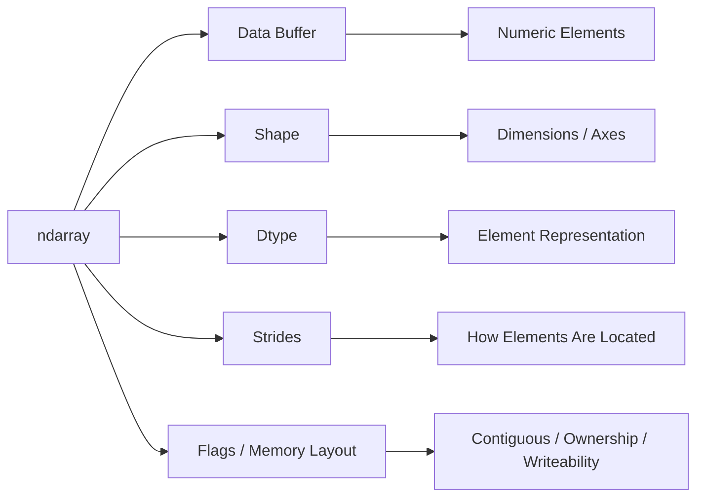
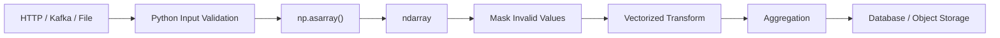

# 02- ndarray

## Overview

`ndarray` is NumPy's core data structure for representing homogeneous, multidimensional numerical data. Almost every important NumPy capability—indexing, slicing, broadcasting, vectorization, reshaping, aggregation, and memory optimization—depends on understanding how an `ndarray` stores and interprets data.

For backend and data engineering, the important distinction is that an `ndarray` is not simply a Python list with extra methods. It combines a data buffer with metadata describing the element type, dimensions, strides, and memory layout. That design enables efficient numerical operations while also introducing important considerations around dtype selection, views, copies, contiguity, and temporary allocations.

A useful mental model is:



Understanding these pieces makes NumPy behavior much easier to reason about in production.

## What an ndarray Represents

An `ndarray` can be thought of as:

```text
ndarray
├── Data buffer
├── Shape
├── Dtype
├── Strides
├── Dimension count
└── Memory ownership / layout metadata
```

Example:

```python
import numpy as np

values = np.array(
    [
        [10, 20, 30],
        [40, 50, 60],
    ],
    dtype=np.int32,
)

print(type(values))
print(values.shape)
print(values.ndim)
print(values.dtype)
print(values.size)
print(values.itemsize)
print(values.nbytes)
```

Typical output:

```text
<class 'numpy.ndarray'>
(2, 3)
2
int32
6
4
24
```

The array contains six `int32` elements. Because each element occupies four bytes, the underlying data requires 24 bytes.

The metadata is separate from the numeric values themselves. That separation is fundamental to how NumPy can create different views over the same underlying memory.

## Why ndarray Exists

Python's built-in list is a general-purpose container. It must support heterogeneous Python objects and arbitrary application-level behavior.

A numerical workload has different requirements:

```text
General Python list
    ↓
References to Python objects
    ↓
Flexible but relatively high per-element overhead

NumPy ndarray
    ↓
Homogeneous typed buffer
    ↓
Compact representation + array operations
```

This makes `ndarray` well suited for:

- Large homogeneous numeric datasets.
- Vectorized transformations.
- Aggregations.
- Batch validation.
- Numerical ETL.
- Memory-sensitive processing.
- CPU-oriented numerical workloads.

It is not intended to replace all Python collections.

Use ordinary Python structures when your data is primarily:

- Heterogeneous.
- Object-oriented.
- Configuration-oriented.
- Request/response-oriented.
- Small enough that numerical optimization is irrelevant.

## Creating an ndarray

### From Python Data

```python
import numpy as np

values = np.array([10, 20, 30, 40])
```

NumPy infers a dtype when one is not explicitly specified:

```python
print(values.dtype)
```

For production code, explicit dtype selection is useful when precision, range, memory usage, or interoperability matters.

```python
values = np.array(
    [10, 20, 30, 40],
    dtype=np.int32,
)
```

### From Existing Arrays

```python
source = np.array([1, 2, 3], dtype=np.int32)

same_reference = np.asarray(source)
```

`np.asarray()` is useful when an API should accept array-like inputs while avoiding an unnecessary copy when the input is already a suitable `ndarray`.

By contrast:

```python
copied = np.array(source, copy=True)
```

explicitly requests independent storage.

### Preallocating Arrays

For known output sizes, preallocation can avoid repeated resizing or append-style allocation patterns:

```python
result = np.empty(1_000_000, dtype=np.float64)
```

`np.empty()` does not initialize its values. Every element must be written before it is read.

That makes it useful for controlled internal processing, but dangerous if code assumes newly allocated elements contain zero.

## ndarray Core Attributes

Several attributes should become standard debugging tools.

| Attribute | Meaning | Example |
|---|---|---|
| `shape` | Length of each dimension | `(1000, 4)` |
| `ndim` | Number of dimensions | `2` |
| `size` | Total element count | `4000` |
| `dtype` | Element data type | `float32` |
| `itemsize` | Bytes per element | `4` |
| `nbytes` | Bytes occupied by data | `16000` |
| `strides` | Bytes to move along each axis | `(16, 4)` |
| `flags` | Memory/layout properties | `C_CONTIGUOUS=True` |

Example:

```python
values = np.zeros((1000, 4), dtype=np.float32)

print(values.shape)
print(values.ndim)
print(values.size)
print(values.dtype)
print(values.itemsize)
print(values.nbytes)
print(values.strides)
print(values.flags)
```

These attributes provide different dimensions of the same array.

## Shape

`shape` describes the size of every dimension.

```python
values = np.zeros((1000, 4))
```

The shape is:

```text
(1000, 4)
```

This means:

```text
1000 rows
4 values per row
```

The total element count is:

```python
values.size
```

which returns:

```text
4000
```

A critical invariant is:

```text
product(shape) == size
```

For example:

```text
(1000, 4) → 4000
(500, 8)  → 4000
(100, 40) → 4000
```

This relationship is essential when reshaping arrays.

## Dimensions and ndim

`ndim` is the number of dimensions represented by the array.

```python
one_dimensional = np.zeros(10)
two_dimensional = np.zeros((10, 5))
three_dimensional = np.zeros((10, 5, 2))
```

Their dimensions are:

```text
1D → ndim = 1
2D → ndim = 2
3D → ndim = 3
```

A useful backend analogy is:

```text
1D → sequence of values
2D → rows × columns
3D → batches × rows × columns
```

The analogy is useful, but the semantics remain numerical rather than database-oriented. NumPy does not attach column names, row labels, or schema semantics to an `ndarray`.

## Dtype

`dtype` defines how every element is represented.

```python
values = np.array(
    [10, 20, 30],
    dtype=np.int32,
)

print(values.dtype)
print(values.itemsize)
```

The dtype affects:

- Memory consumption.
- Numerical range.
- Precision.
- Overflow behavior.
- Compatibility with external systems.
- Some computation characteristics.

For example:

```python
int32 → 4 bytes
int64 → 8 bytes
float32 → 4 bytes
float64 → 8 bytes
```

For one million elements:

```text
float32 → approximately 4 MB
float64 → approximately 8 MB
```

This becomes significant when multiple arrays coexist in memory.

### Choosing a Dtype

The smallest dtype is not automatically the best dtype.

For example:

```python
values = np.array(
    [0, 10, 20, 30],
    dtype=np.int8,
)
```

may be reasonable only when the domain guarantees the values remain within the `int8` range.

Potential problems with an unnecessarily small dtype include:

- Overflow.
- Loss of precision.
- Unexpected promotion.
- Incompatibility with downstream libraries.

Dtype selection should therefore start with domain correctness and then consider memory efficiency.

## itemsize and nbytes

`itemsize` reports the number of bytes used by one element.

```python
values = np.zeros(1_000_000, dtype=np.float32)

print(values.itemsize)
```

Result:

```text
4
```

`nbytes` reports the bytes occupied by the array's data:

```python
print(values.nbytes)
```

Result:

```text
4000000
```

The basic relationship is:

```text
nbytes = size × itemsize
```

This is an important first approximation when estimating memory requirements.

### Memory Estimation

Suppose a batch contains:

```text
20,000,000 float64 values
```

Then:

```text
20,000,000 × 8 bytes
= 160,000,000 bytes
≈ 152.6 MiB
```

That is only the data buffer. A processing pipeline may also create masks, intermediate arrays, output arrays, and Python-side objects.

Therefore:

> The input array's `nbytes` is not the same as the process's total memory requirement.

## Strides

Strides describe how many bytes NumPy moves through memory when advancing by one element along each axis.

Consider:

```python
values = np.array(
    [
        [10, 20, 30],
        [40, 50, 60],
    ],
    dtype=np.int32,
)

print(values.strides)
```

A typical C-contiguous array will have strides equivalent to:

```text
(12, 4)
```

because:

```text
3 columns × 4 bytes = 12 bytes
1 element × 4 bytes = 4 bytes
```

Conceptually:

```text
values[0, 0] → address A
values[0, 1] → A + 4
values[0, 2] → A + 8
values[1, 0] → A + 12
```

Strides explain how a multidimensional array can be represented without necessarily copying its data.

They also help explain why some views are efficient and why some memory-access patterns are slower.

## Memory Layout

For a standard two-dimensional C-contiguous array, elements are stored row by row.

```text
Logical:

[ 10  20  30 ]
[ 40  50  60 ]

Physical:

10 → 20 → 30 → 40 → 50 → 60
```

This is typically called row-major or C-order storage.

Fortran-order storage uses a different traversal pattern:

```text
10 → 40 → 20 → 50 → 30 → 60
```

The distinction matters for:

- Cache locality.
- Interoperability with native libraries.
- Reshaping.
- Transposition.
- Large numerical workloads.

Inspect the layout:

```python
print(values.flags.c_contiguous)
print(values.flags.f_contiguous)
```

For many backend workloads, C-contiguous arrays are the most familiar default, but the correct layout depends on downstream operations.

## ndarray Flags

`flags` expose useful memory properties.

```python
values = np.zeros((100, 10), dtype=np.float32)

print(values.flags.c_contiguous)
print(values.flags.f_contiguous)
print(values.flags.owndata)
print(values.flags.writeable)
```

Important flags include:

| Flag | Meaning |
|---|---|
| `C_CONTIGUOUS` | Data follows C-style contiguous layout |
| `F_CONTIGUOUS` | Data follows Fortran-style contiguous layout |
| `OWNDATA` | Array owns its data buffer |
| `WRITEABLE` | Array can be modified |

These properties become particularly useful when debugging performance and shared-memory behavior.

## Ownership

An array may own its memory or may reference memory owned by another array.

```python
values = np.arange(10)

view = values[2:6]

print(values.flags.owndata)
print(view.flags.owndata)
```

The view typically does not own the data because it references the original array's buffer.

This distinction matters because memory ownership and data lifetime are related.

A view can keep the underlying storage alive even when the original variable is no longer directly referenced.

## Indexing and Data Access

`ndarray` supports standard positional indexing.

```python
values = np.array([10, 20, 30, 40])

print(values[0])
print(values[-1])
```

For multidimensional arrays:

```python
matrix = np.array(
    [
        [10, 20, 30],
        [40, 50, 60],
    ]
)

print(matrix[0, 1])
print(matrix[1, 2])
```

Indexing does not inherently mean copying. A scalar lookup generally returns a scalar, while a slice can return a view.

This distinction becomes important when manipulating data in place.

## Slicing and Views

Consider:

```python
values = np.array([10, 20, 30, 40])

subset = values[1:3]

subset[0] = 999
```

The original changes:

```python
print(values)
```

Output:

```text
[ 10 999  30  40]
```

This happens because `subset` can be a view over the same data buffer.

Use `.copy()` when independent ownership is required:

```python
subset = values[1:3].copy()
```

Now:

```python
subset[0] = 999

print(values)
```

Output:

```text
[10 20 30 40]
```

### Why Views Exist

Views reduce unnecessary memory allocation.

For a large array:

```text
Original array
    ↓
Small view
    ↓
No duplicate data buffer
```

This can be a major memory optimization.

The trade-off is shared state.

## Advanced Indexing and Copies

Advanced indexing commonly creates a new array.

For example:

```python
values = np.array([10, 20, 30, 40, 50])

selected = values[[0, 2, 4]]
```

`selected` generally contains independent data.

```python
selected[0] = 999

print(values)
```

The original remains unchanged.

This gives an important rule of thumb:

| Selection Style | Typical Behavior |
|---|---|
| Basic slicing | View |
| Scalar indexing | Scalar result |
| Integer/boolean advanced indexing | Copy |
| Explicit `.copy()` | Copy |

Treat this as a practical rule rather than an absolute explanation for every NumPy operation. Specific operations can have additional behavior.

## Boolean Masking

A boolean mask has the same shape as the indexed selection and identifies which elements to keep.

```python
values = np.array([10, 25, 40, 55, 70])

mask = values >= 50

filtered = values[mask]
```

Conceptually:

```text
values → [10, 25, 40, 55, 70]
mask   → [ F,  F,  F,  T,  T]
result → [55, 70]
```

Boolean selection is useful for:

- Range validation.
- Filtering measurements.
- Selecting valid records.
- Removing invalid values.
- Applying business thresholds.

Example:

```python
values = np.array([10.5, 21.2, np.nan, 18.4, np.inf])

valid = np.isfinite(values)
clean = values[valid]
```

The resulting array contains only finite values.

## Vectorized ndarray Operations

The `ndarray` is designed for operations over entire arrays.

```python
values = np.array([100.0, 200.0, 300.0])

adjusted = values * 1.05
```

No explicit loop is required.

Arithmetic operators are overloaded to perform element-wise array operations:

```python
result = (values * 1.05) + 10
```

Comparison operators also operate element-wise:

```python
mask = values >= 200
```

This is a fundamental difference from ordinary Python containers.

## Broadcasting and ndarray Shapes

Broadcasting allows arrays with compatible shapes to participate in the same operation.

```python
values = np.array(
    [
        [100.0, 200.0, 300.0],
        [150.0, 250.0, 350.0],
    ]
)

adjustments = np.array([1.10, 1.20, 1.30])

adjusted = values * adjustments
```

The shapes are:

```text
values       → (2, 3)
adjustments  → (3,)
```

NumPy aligns dimensions from the right.

A dimension is compatible when:

- The dimensions are equal, or
- One of them is `1`, or
- One array has no dimension remaining at that position.

Broadcasting is powerful because it avoids explicitly constructing repeated data.

That can save memory compared with manually tiling an array.

## Reshaping and ndarray Identity

Reshaping changes the array's dimensional interpretation.

```python
values = np.arange(12)

matrix = values.reshape(3, 4)
```

The total number of elements remains unchanged:

```python
assert matrix.size == values.size
```

Whether the result is a view or a copy depends on the original layout and requested shape.

This is an important production consideration because code that looks allocation-free can sometimes allocate.

## Flattening and Raveling

Two common ways of converting an array to one dimension are `flatten()` and `ravel()`.

```python
values = np.array(
    [
        [10, 20],
        [30, 40],
    ]
)

flattened = values.flatten()
raveled = values.ravel()
```

The practical difference is:

| Operation | Typical Behavior |
|---|---|
| `flatten()` | Returns a copy |
| `ravel()` | Returns a view when possible, otherwise a copy |

For large arrays, `ravel()` can reduce unnecessary allocation when sharing memory is acceptable.

Use `flatten()` when independent ownership is explicitly desirable.

## Aggregation Across Axes

`ndarray` supports reductions such as:

```python
values = np.array(
    [
        [10, 20, 30],
        [40, 50, 60],
    ]
)

total = values.sum()
columns = values.sum(axis=0)
rows = values.sum(axis=1)
```

The results are:

```text
total   → 210
columns → [50, 70, 90]
rows    → [60, 150]
```

The `axis` parameter defines which dimension is reduced.

For backend engineers, this is important for batch processing because the same data structure may represent multiple dimensions:

```text
(batch, feature)
(batch, timestamp, metric)
(region, server, metric)
```

Choosing the wrong axis can produce syntactically valid but semantically incorrect results.

## Mutation and Writeability

An `ndarray` is usually mutable.

```python
values = np.array([10, 20, 30])

values[0] = 999
```

Code can also make an array read-only:

```python
values.flags.writeable = False
```

Attempting to modify it afterward raises an error.

Read-only arrays can be useful when the same data is shared between components and accidental mutation should be prevented.

However, writeability should not be treated as a complete application-level immutability guarantee. System design should still control ownership and data flow explicitly.

## Copy-on-Conversion Considerations

Array creation and conversion can unexpectedly allocate.

For example:

```python
values = np.asarray(existing_values)
```

may avoid copying an existing compatible NumPy array.

But:

```python
values = np.asarray(existing_values, dtype=np.float64)
```

may require a conversion if the source dtype differs.

Similarly:

```python
values = np.array(existing_values, copy=True)
```

explicitly creates a separate array.

When processing large batches, distinguish:

```text
Reference
    ↓
View
    ↓
Copy
    ↓
Converted Copy
```

because each has different memory and performance implications.

## ndarray and Python Lists

A Python list is a general container:

```python
values = [10, 20, 30]
```

An `ndarray` is a numerical data structure:

```python
values = np.array([10, 20, 30], dtype=np.int32)
```

The architectural differences are important.

```text
Python list
┌────────────────────┐
│ pointer │ pointer │
└────┬─────────┬─────┘
     ↓         ↓
   Python    Python
   object    object

ndarray
┌─────────────────────┐
│ typed numeric data  │
└─────────────────────┘
```

The NumPy model enables compact storage and array-level computation.

The Python list model enables flexibility.

Neither is universally better.

## ndarray and Pandas

Pandas provides higher-level data structures that are oriented around labeled tabular data.

A Pandas column can expose its underlying array-oriented representation:

```python
import pandas as pd

df = pd.DataFrame(
    {
        "price": [100.0, 200.0, 300.0],
        "quantity": [2, 3, 1],
    }
)

price = df["price"].to_numpy()
```

You can then use NumPy operations:

```python
total = price * df["quantity"].to_numpy()
```

The division of responsibilities is often:

```text
Pandas
    ↓
Tabular organization / labels / joins / grouping
    ↓
NumPy
    ↓
Dense numerical operations
```

The exact internal representation of modern Pandas is more flexible than simply "Pandas equals NumPy," so avoid assuming every Pandas object is backed by one NumPy array.

The practical point is that NumPy remains an important numerical interoperability layer.

## ndarray in a Backend Batch Pipeline

Consider a service that receives batches of numeric measurements.



A production implementation might expose the numerical stage as a pure function:

```python
from __future__ import annotations

import numpy as np
import numpy.typing as npt


FloatArray = npt.NDArray[np.float64]


def calculate_metrics(values: npt.ArrayLike) -> dict[str, float | int]:
    data: FloatArray = np.asarray(values, dtype=np.float64)

    if data.ndim != 1:
        raise ValueError("Expected a one-dimensional array")

    if data.size == 0:
        raise ValueError("Input cannot be empty")

    if not np.isfinite(data).all():
        raise ValueError("Input contains non-finite values")

    return {
        "count": int(data.size),
        "sum": float(data.sum()),
        "mean": float(data.mean()),
        "minimum": float(data.min()),
        "maximum": float(data.max()),
    }
```

The function keeps NumPy-specific processing localized while converting results to ordinary Python scalar types at the application boundary.

That is often easier to serialize, test, and integrate with frameworks.

## Memory Efficiency

`ndarray` efficiency comes primarily from its representation.

Suppose:

```python
values = np.zeros(
    10_000_000,
    dtype=np.float32,
)
```

Then:

```python
print(values.nbytes)
```

produces roughly:

```text
40000000
```

A second transformed array:

```python
scaled = values * 1.05
```

can require another roughly 40 MB.

Additional masks and intermediate values can increase peak memory further.

A rough pipeline model is:

```text
Input Array
   +
Temporary Arrays
   +
Mask Arrays
   +
Output Array
   +
Application / Runtime Memory
   =
Process Memory
```

For production services, the peak is more important than the size of any single object.

## Large ndarray Workloads

For large datasets, ask:

1. How many elements are processed?
2. What dtype is required?
3. How many arrays coexist?
4. Which operations allocate?
5. Are views possible?
6. Is the array contiguous?
7. Can the job be processed in batches?
8. Would memory mapping help?
9. Does the workload belong in an HTTP request or background worker?

### Batch Processing

Instead of:

```python
values = load_everything()
result = process(values)
```

consider:

```text
Input Dataset
    ↓
Batch 1 → Process → Persist
Batch 2 → Process → Persist
Batch 3 → Process → Persist
...
```

This limits peak memory and provides a natural operational unit for retries.

For Celery-based workloads, a task can process bounded chunks rather than attempting to hold an entire dataset in one worker process.

## Memory-Mapped ndarray

For datasets larger than available RAM, memory mapping can expose disk-backed data through an array interface.

```python
import numpy as np

values = np.memmap(
    "measurements.dat",
    dtype=np.float32,
    mode="r",
    shape=(20_000_000,),
)
```

This does not mean the operating system has magically eliminated I/O. Access still depends on the underlying storage and access pattern.

Memory mapping is most useful when:

- Data is too large for comfortable in-memory processing.
- Processing can be performed over selected regions.
- Repeated loading of the complete file would be expensive.

## Performance Characteristics

The main performance advantage of `ndarray` is not simply that it uses "C underneath."

A more useful explanation is:

```text
Python-level loop
    ↓
Per-element interpreter overhead
    ↓
Repeated dispatch / object handling

ndarray operation
    ↓
Single Python-level operation
    ↓
Optimized low-level traversal
    ↓
Dense numerical data access
```

Performance can still be limited by:

- Memory bandwidth.
- Cache locality.
- Non-contiguous access.
- Temporary allocations.
- Expensive dtype conversions.
- Poor algorithms.
- Small input sizes.
- Python loops surrounding NumPy operations.

Therefore:

> NumPy improves the execution model for many numerical workloads, but it does not eliminate algorithmic or memory bottlenecks.

## Contiguous vs Non-Contiguous Arrays

A slice or transpose can produce a view whose elements are no longer laid out contiguously.

Example:

```python
values = np.arange(12).reshape(3, 4)

transposed = values.T

print(values.flags.c_contiguous)
print(transposed.flags.c_contiguous)
```

The transpose may be a view while using non-contiguous strides.

That is valuable because it can avoid a full data copy.

The trade-off is that some downstream operations may run less efficiently or may create a contiguous copy automatically.

When integrating with native libraries or performance-sensitive routines, explicitly checking contiguity can help diagnose unexpected behavior.

## Common ndarray Mistakes

### Assuming Every Operation Copies Data

Some operations return views.

**Why it causes problems:** modifying the result can mutate the original array.

**Avoid it:** understand view-producing operations and call `.copy()` when ownership needs to be independent.

### Assuming Every Operation Is a View

Other operations create copies.

**Why it causes problems:** large unintended allocations can increase memory usage.

**Avoid it:** verify memory behavior for large or performance-critical operations.

### Ignoring Dtype

An array may consume twice as much memory simply because a larger dtype was selected.

**Avoid it:** inspect `dtype`, `itemsize`, and `nbytes`.

### Confusing Shape and Size

For:

```python
values = np.zeros((1000, 10))
```

`shape` is:

```text
(1000, 10)
```

while `size` is:

```text
10000
```

**Avoid it:** remember that `shape` describes dimensions while `size` describes total elements.

### Ignoring Axis Semantics

An aggregation along the wrong axis can silently produce incorrect business metrics.

**Avoid it:** document the meaning of dimensions and verify expected output shapes.

### Treating `ndarray` as a General Replacement for Lists

This introduces unnecessary complexity into ordinary application code.

**Avoid it:** use NumPy where dense numerical processing provides a meaningful benefit.

### Creating Large Copies for Convenience

Code such as:

```python
copy = values.copy()
```

is safe but potentially expensive for large arrays.

**Avoid it:** copy deliberately when ownership or mutation isolation requires it.

### Exposing Huge Arrays Directly Through JSON APIs

JSON serialization often requires conversion to Python-native structures.

**Avoid it:** keep HTTP payloads bounded and choose formats appropriate for large numerical datasets.

## Production Design Guidelines

### Keep Array Boundaries Explicit

Do not allow NumPy arrays to spread indiscriminately through a domain model.

A cleaner architecture is:

```text
API / Event
    ↓
Validation
    ↓
Array Conversion
    ↓
Numerical Processing
    ↓
Scalar / Tabular Result
    ↓
Persistence / Response
```

This keeps NumPy-specific behavior within the numerical processing layer.

### Validate Before Allocating

When external input contains a declared batch size or shape, enforce limits before allocating large arrays.

For example:

```python
MAX_VALUES = 1_000_000

if len(values) > MAX_VALUES:
    raise ValueError("Batch is too large")
```

This is both a reliability and security concern.

### Prefer Bounded Work Units

For very large datasets:

```text
unbounded input
    ↓
bad operational characteristics

bounded batches
    ↓
predictable memory
    ↓
predictable retries
    ↓
better observability
```

### Measure Peak Memory

When diagnosing production issues, inspect process memory rather than relying only on `array.nbytes`.

The process may contain:

- Multiple arrays.
- Framework objects.
- Database buffers.
- Serialization buffers.
- Python objects.
- Native-library allocations.

## Testing ndarray Behavior

Test both values and structural properties.

```python
import numpy as np


def test_processing_shape_and_dtype() -> None:
    values = np.array([10, 20, 30], dtype=np.int32)

    result = values * 2

    np.testing.assert_array_equal(
        result,
        np.array([20, 40, 60]),
    )
```

For production numerical code, also test:

- Shape.
- Dtype.
- Empty arrays.
- Invalid values.
- Boundary values.
- Large inputs where practical.
- Expected mutation behavior.
- View versus copy assumptions where they matter.

`np.testing` is generally preferable to comparing arrays with ordinary Python `==` because NumPy arrays require element-wise comparison semantics.

## Debugging ndarray Problems

When an array produces an unexpected result, inspect:

```python
print("shape:", values.shape)
print("dtype:", values.dtype)
print("ndim:", values.ndim)
print("size:", values.size)
print("itemsize:", values.itemsize)
print("nbytes:", values.nbytes)
print("strides:", values.strides)
print("flags:", values.flags)
```

For suspicious memory sharing:

```python
np.shares_memory(values, other)
```

or:

```python
np.may_share_memory(values, other)
```

These checks are useful when tracking mutations or unexpected copies.

## Interview-Relevant Questions

### What is an ndarray?

`ndarray` is NumPy's multidimensional array structure for homogeneous data. It combines a data buffer with metadata such as dtype, shape, strides, and memory-layout information.

### Why is ndarray different from a Python list?

A Python list is a general-purpose container of object references. An `ndarray` stores homogeneous typed data in a numerical array representation designed for vectorized operations.

### What is the difference between `shape` and `size`?

`shape` describes the length of each dimension. `size` is the total number of elements.

### What does `dtype` control?

It controls how elements are represented, including size, precision, range, and supported numerical behavior.

### What is `itemsize`?

`itemsize` is the number of bytes used to represent one element.

### What is `nbytes`?

`nbytes` is the number of bytes occupied by the array's data buffer.

### What are strides?

Strides describe how many bytes NumPy advances in memory when moving one element along each dimension.

### Why do views matter?

Views can avoid copying large datasets, reducing memory usage, but they can also create shared-memory mutation risks.

### Why can a transpose be a view?

Because NumPy can often change the interpretation of existing memory through metadata and strides rather than physically rearranging all elements.

### Why does contiguity matter?

Contiguous memory often enables more efficient sequential access and improves interoperability with code expecting a specific memory layout. Non-contiguous arrays can still be valid and useful, but some operations may require additional work or copying.

### What happens when a NumPy array is sent through a JSON API?

The array generally needs conversion to a serializable Python representation, which can create substantial overhead for large arrays. Large numerical payloads should use bounded responses or more suitable serialization formats.

### When should ndarray not be used?

Avoid it when the data is primarily heterogeneous, object-oriented, configuration-oriented, or too small for numerical array processing to provide a meaningful advantage.

## Key Takeaways

- `ndarray` combines a typed data buffer with metadata such as `shape`, `dtype`, `strides`, and memory-layout flags; understanding these properties explains most NumPy behavior.
- Views can reuse existing memory and reduce allocations, while copies provide independent ownership; knowing the difference is essential for correctness and memory efficiency.
- `dtype`, `itemsize`, `nbytes`, contiguity, and temporary arrays determine much of the real memory cost of numerical processing.
- Shape, axes, broadcasting, and vectorized operations make `ndarray` effective for batch-oriented numerical workloads without requiring Python-level iteration.
- Production NumPy code should treat array ownership, input bounds, memory usage, serialization, batching, and performance measurement as explicit engineering concerns.