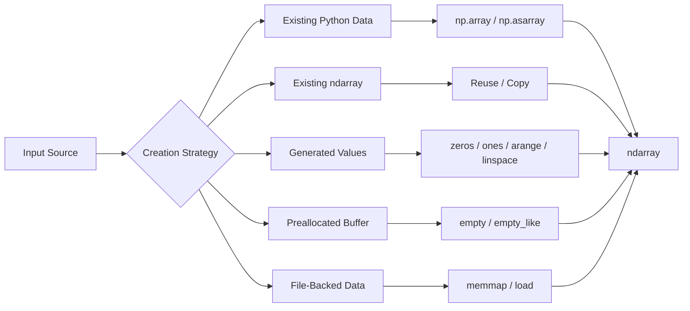

# 03- Array Creation

## Overview

Creating an `ndarray` is the first step in building a NumPy processing pipeline. The creation method determines the array's shape, dtype, initialization state, memory allocation pattern, and sometimes its suitability for later operations.

For backend and data engineering workloads, array creation is not merely a syntax concern. The wrong construction strategy can introduce unnecessary copies, excessive memory consumption, implicit dtype conversions, or expensive initialization. The right strategy produces predictable memory usage and clear numerical semantics.

A useful mental model is:



The key engineering questions are:

- What data source are you starting from?
- What shape should the array have?
- What dtype is required?
- Does the initial content matter?
- Should memory be copied or reused?
- How large can the allocation become?
- Will the array be processed in memory or from disk?

## Choosing an Array Creation Strategy

Common creation methods serve different purposes.

| Method | Primary Use | Initialization | Copy Behavior | Typical Use |
|---|---|---|---|---|
| `np.array()` | Create from array-like data | Yes | Usually creates an array from input | Data conversion |
| `np.asarray()` | Normalize array-like input | Depends on input | Avoids copy when possible | Function boundaries |
| `np.zeros()` | Allocate zero-filled array | Zero-filled | New allocation | Buffers / defaults |
| `np.ones()` | Allocate one-filled array | One-filled | New allocation | Numeric initialization |
| `np.empty()` | Allocate uninitialized array | No | New allocation | Output buffers |
| `np.full()` | Fill with a constant | Constant | New allocation | Sentinels / defaults |
| `np.arange()` | Generate arithmetic sequence | Generated | New allocation | Numeric ranges |
| `np.linspace()` | Generate evenly spaced values | Generated | New allocation | Controlled intervals |
| `np.zeros_like()` | Match another array | Zero-filled | New allocation | Same-shape output |
| `np.empty_like()` | Match another array | Uninitialized | New allocation | Same-shape output |
| `np.memmap()` | Disk-backed array | File-backed | Disk-backed | Very large datasets |

Choosing intentionally is more important than memorizing the API.

## Creating from Python Data

The most common creation pattern is converting an existing Python collection into an `ndarray`.

```python
import numpy as np

values = np.array([10, 20, 30, 40], dtype=np.int32)

print(values)
print(values.dtype)
print(values.shape)
```

This is appropriate when data already exists in Python-native form and needs numerical array semantics.

Typical sources include:

- Parsed CSV values.
- API payloads.
- Database query results.
- Test fixtures.
- Existing Python lists.
- Intermediate application data.

For large datasets, remember that the Python source data already occupies memory before NumPy creates the array.

```text
Python list
    +
NumPy array
    =
Potentially two representations in memory
```

This matters when converting millions of values.

## np.array()

`np.array()` is the general-purpose constructor.

```python
values = np.array(
    [10, 20, 30, 40],
    dtype=np.int32,
)
```

It is useful when explicit array creation semantics matter.

You can also create multidimensional arrays:

```python
matrix = np.array(
    [
        [10, 20, 30],
        [40, 50, 60],
    ],
    dtype=np.int32,
)
```

The resulting shape is:

```text
(2, 3)
```

### When to Use np.array()

Use `np.array()` when:

- You are intentionally constructing a new array.
- You need a specific dtype.
- You are converting nested Python data into a numerical structure.
- You want an independent array representation.

### Production Consideration

When converting very large inputs, inspect whether an additional copy is necessary. A safe-looking conversion can still create significant memory pressure.

## np.asarray()

`np.asarray()` is especially useful at function boundaries.

```python
import numpy as np
import numpy.typing as npt


def process(values: npt.ArrayLike) -> np.ndarray:
    data = np.asarray(values, dtype=np.float64)
    return data * 1.05
```

The important property is that `np.asarray()` avoids copying when the input is already an appropriate `ndarray`.

For example:

```python
values = np.array([1, 2, 3], dtype=np.float64)

normalized = np.asarray(values)
```

`normalized` can reference the same array rather than forcing a new data buffer.

That makes `np.asarray()` a good normalization mechanism for reusable numerical functions.

### Why This Matters

Consider a pipeline:

```text
API / File / Pandas
       ↓
Array-like input
       ↓
np.asarray()
       ↓
Numerical processing
```

The processing function can accept lists, tuples, NumPy arrays, or other array-like structures while centralizing conversion behavior.

### dtype Conversion

A dtype change can require a new array:

```python
values = np.array([1, 2, 3], dtype=np.int32)

converted = np.asarray(values, dtype=np.float64)
```

The conversion from `int32` to `float64` cannot be achieved merely by changing metadata because the underlying element representation changes.

For large datasets, this can temporarily require memory for both arrays.

## Explicit Dtype Selection

Dtype should be selected intentionally when it affects correctness or memory.

```python
values = np.array(
    [10, 20, 30],
    dtype=np.int32,
)
```

For floating-point data:

```python
measurements = np.array(
    [10.5, 11.2, 9.8],
    dtype=np.float32,
)
```

A smaller dtype can significantly reduce memory usage:

```text
1,000,000 elements

float32 → ~4 MB
float64 → ~8 MB
```

However, smaller is not always better.

Consider:

- Numeric range.
- Required precision.
- Overflow behavior.
- Downstream library requirements.
- Database representation.
- Serialization format.

Dtype selection is a data-contract decision, not merely a performance trick.

## Shape During Creation

Array shape can be established during creation.

```python
values = np.zeros((1000, 10), dtype=np.float32)
```

This creates:

```text
1000 rows
10 columns
10000 elements
```

For backend workloads, shape often represents a processing contract:

```text
(batch_size, features)
(batch_size, timestamps)
(region_count, metric_count)
```

Explicitly validating shape at boundaries prevents downstream broadcasting and indexing errors.

```python
if values.ndim != 2:
    raise ValueError("Expected a two-dimensional array")
```

## zeros()

`np.zeros()` allocates a new array initialized to zero.

```python
import numpy as np

buffer = np.zeros(
    1_000_000,
    dtype=np.float32,
)
```

For two dimensions:

```python
matrix = np.zeros(
    (1000, 100),
    dtype=np.float32,
)
```

### Why Use zeros()?

It is appropriate when every element should initially contain zero.

Examples:

- Accumulator arrays.
- Numeric output buffers.
- Default metric values.
- Preallocated result structures.

Example:

```python
totals = np.zeros(
    10_000,
    dtype=np.float64,
)

totals += 5.0
```

### Production Consideration

`zeros()` initializes the allocated data. That has a cost.

If the application is going to overwrite every element before reading it, zero initialization may be unnecessary.

In that case, `np.empty()` may be more appropriate.

## ones()

`np.ones()` behaves similarly but initializes values to one.

```python
weights = np.ones(
    100_000,
    dtype=np.float32,
)
```

It is useful when one is a meaningful starting value.

Examples include:

- Multiplicative masks.
- Default weighting factors.
- Initialization for repeated multiplication.

It should not be used merely because it is convenient. Initialization should represent a meaningful state.

## full()

`np.full()` fills an array with an arbitrary constant.

```python
import numpy as np

values = np.full(
    1_000,
    fill_value=-1,
    dtype=np.int32,
)
```

This is useful when a sentinel value has explicit semantics.

For example:

```text
-1 → unavailable
0  → valid zero
```

These meanings should not be confused.

For floating-point data:

```python
values = np.full(
    1_000,
    np.nan,
    dtype=np.float64,
)
```

This can be useful for tracking uninitialized business metrics, but downstream processing must explicitly handle `NaN`.

## empty()

`np.empty()` allocates the requested memory without initializing each element.

```python
result = np.empty(
    1_000_000,
    dtype=np.float64,
)
```

The values are unspecified until the program writes to them.

This makes `empty()` useful for output buffers:

```python
import numpy as np


def scale(values: np.ndarray) -> np.ndarray:
    result = np.empty_like(values)
    np.multiply(values, 1.05, out=result)
    return result
```

The `out` parameter writes directly into the preallocated result.

### Why empty() Can Be Faster

If every output element will be overwritten, initializing the array first is unnecessary.

Compare:

```python
result = np.zeros_like(values)
result[:] = values * 1.05
```

with:

```python
result = np.empty_like(values)
np.multiply(values, 1.05, out=result)
```

The second approach avoids the separate zero-initialization step.

The exact performance difference depends on workload and hardware, so benchmark before optimizing.

### Critical Safety Rule

Never read from an `empty()` array before writing the intended values.

```python
result = np.empty(10)

print(result)  # Undefined / uninitialized values
```

Uninitialized data is not automatically zero.

## zeros_like(), ones_like(), and full_like()

These functions derive shape and often dtype characteristics from an existing array.

```python
values = np.array(
    [10, 20, 30],
    dtype=np.float32,
)

zeros = np.zeros_like(values)
ones = np.ones_like(values)
filled = np.full_like(values, 7)
```

This is useful in transformation pipelines because it avoids manually repeating the source shape.

For example:

```python
result = np.empty_like(values)
```

produces an output buffer suitable for an operation over the same array shape.

### dtype Consideration

The `like` functions generally inherit dtype from the input unless overridden.

```python
result = np.zeros_like(
    values,
    dtype=np.float64,
)
```

This is useful when a transformation changes the numeric representation.

## arange()

`np.arange()` generates values with a specified step.

```python
values = np.arange(
    0,
    100,
    10,
)
```

Result:

```text
[0, 10, 20, 30, 40, 50, 60, 70, 80, 90]
```

It is particularly useful for:

- Integer ranges.
- Batch identifiers.
- Synthetic indices.
- Test data.
- Window boundaries.

### Floating-Point Caveat

Using floating-point steps can produce results that are surprising due to floating-point representation.

Prefer integer-based ranges when possible:

```python
indices = np.arange(0, 1_000_000)
```

If you need a fixed number of evenly spaced floating-point values, `np.linspace()` is usually the clearer choice.

## linspace()

`np.linspace()` creates a specified number of evenly spaced values between two endpoints.

```python
values = np.linspace(
    0.0,
    1.0,
    num=11,
)
```

This generates eleven values including both endpoints by default:

```text
0.0
0.1
0.2
...
0.9
1.0
```

The distinction from `arange()` is important:

| Function | Controls | Typical Use |
|---|---|---|
| `arange()` | Step size | Integer or discrete sequences |
| `linspace()` | Number of values | Fixed-size evenly spaced samples |

For numerical test datasets, `linspace()` can be useful when exact sample count matters.

## Mesh-Like Construction and Why It Is Usually Out of Scope

NumPy provides additional constructors for coordinate grids and specialized numerical workloads.

These can be useful in scientific computing, but they should not be introduced into ordinary backend processing without a concrete requirement.

For backend/data engineering, the primary creation APIs are usually:

```text
array
asarray
zeros
ones
full
empty
*_like
arange
linspace
memmap
```

This keeps array construction understandable and avoids turning an engineering playbook into an exhaustive NumPy API catalog.

## Creating Arrays from Backend Data

NumPy often sits behind an application or ETL boundary.


Suppose a database query returns numeric values:

```python
rows = [
    (100.5,),
    (120.0,),
    (115.25,),
]
```

A numerical stage can normalize them:

```python
import numpy as np

values = np.asarray(
    [row[0] for row in rows],
    dtype=np.float64,
)
```

The important design principle is to convert at a clear processing boundary rather than repeatedly converting representations throughout the pipeline.

## API Input and Array Creation

A FastAPI endpoint may receive a list of numeric values:

```python
from fastapi import FastAPI
import numpy as np

app = FastAPI()


@app.post("/metrics/normalize")
def normalize(values: list[float]) -> dict[str, list[float]]:
    data = np.asarray(values, dtype=np.float64)

    if data.size == 0:
        raise ValueError("values cannot be empty")

    if not np.isfinite(data).all():
        raise ValueError("values must be finite")

    maximum = data.max()

    if maximum == 0:
        raise ValueError("maximum value cannot be zero")

    normalized = data / maximum

    return {
        "values": normalized.tolist(),
    }
```

There are several production concerns here:

- Bound maximum request size.
- Validate numeric input before allocating excessive memory.
- Reject non-finite values when the business operation cannot support them.
- Convert back to Python-native values only at the serialization boundary.

For very large batches, this processing may belong in a worker rather than inside the HTTP request path.

## Creating Arrays from Pandas

A Pandas column can be converted into an array:

```python
import pandas as pd
import numpy as np

df = pd.DataFrame(
    {
        "amount": [100.0, 200.0, 350.0],
    }
)

amounts = df["amount"].to_numpy(dtype=np.float64)
```

This is useful when a dataframe pipeline reaches a computation that benefits from direct array operations.

Do not repeatedly convert large columns between Pandas and NumPy without a reason. Conversion boundaries can introduce copies and additional memory pressure.

## Copying During Array Creation

Understanding copy semantics is critical.

Consider:

```python
source = np.array(
    [1, 2, 3],
    dtype=np.int32,
)

a = np.asarray(source)
b = np.array(source, copy=True)
```

Conceptually:

```text
source ───────┐
              ├── a
              │
              └── same underlying data when compatible

source ─────────── b
                   ↓
              separate data
```

You can inspect memory sharing:

```python
print(np.shares_memory(source, a))
print(np.shares_memory(source, b))
```

Typical result:

```text
True
False
```

The distinction matters when large arrays are involved.

## Data Conversion and Dtype Promotion

Creating an array from mixed numeric values may cause NumPy to choose a dtype capable of representing them.

```python
values = np.array([1, 2.5, 3])
```

The resulting dtype will generally be floating-point because the values do not all fit naturally into an integer representation without conversion.

For production systems, do not blindly rely on inference when dtype is part of the data contract.

Explicitness is usually better:

```python
values = np.array(
    [1, 2.5, 3],
    dtype=np.float64,
)
```

This makes the intended numerical representation visible to reviewers and maintainers.

## Structured Data vs ndarray

An `ndarray` is most effective when the data is naturally homogeneous.

Consider transaction records:

```text
transaction_id
customer_id
amount
currency
created_at
```

A single numerical ndarray is not a natural representation of this entire record because the fields have different types and semantics.

A better design is often:

```text
Structured application records
        ↓
Python models / Pandas DataFrame
        ↓
Numeric column extraction
        ↓
NumPy ndarray
        ↓
Numerical processing
```

Forcing heterogeneous business entities into an `ndarray` usually makes application logic harder to maintain.

## Preallocation for Output

Preallocation is useful when output size is known.

For example:

```python
import numpy as np


def transform(values: np.ndarray) -> np.ndarray:
    result = np.empty_like(values)

    np.multiply(
        values,
        1.05,
        out=result,
    )

    return result
```

This pattern is particularly useful for large batches.

The engineering benefit is predictability:

```text
Allocate once
     ↓
Write output
     ↓
Return result
```

rather than growing a Python list or repeatedly reallocating an array.

## Allocation Costs

Array creation has at least two important costs:

1. Memory allocation.
2. Data initialization or population.

For example:

```python
np.zeros(10_000_000, dtype=np.float64)
```

allocates memory and initializes the data.

While:

```python
np.empty(10_000_000, dtype=np.float64)
```

allocates storage without initializing each element at the NumPy level.

This difference can matter in tight loops or large batch workloads.

However, do not optimize allocation costs before profiling. A clear implementation using `zeros()` is often preferable when the zero-initialized state is meaningful.

## Batch Processing and Allocation Strategy

Suppose a worker processes 100 million numeric values.

An inefficient design might repeatedly construct large temporary arrays:

```text
Read batch
    ↓
Convert to array
    ↓
Create intermediate array
    ↓
Create another intermediate array
    ↓
Create final array
    ↓
Discard
```

A more controlled design can use bounded batches:

```text
Input
 ↓
Batch 1 → Reuse / preallocate → Process → Persist
Batch 2 → Reuse / preallocate → Process → Persist
Batch 3 → Reuse / preallocate → Process → Persist
```

This reduces peak memory and makes worker behavior more predictable.

For Celery jobs or Kubernetes workers, predictable memory consumption improves reliability and reduces the risk of OOM termination.

## Large Arrays and Memory Mapping

When the dataset itself is too large for comfortable in-memory processing, array creation can be backed by a file.

```python
import numpy as np

values = np.memmap(
    "measurements.dat",
    dtype=np.float32,
    mode="r+",
    shape=(50_000_000,),
)
```

This provides array-like access to file-backed data.

Use this when:

- The dataset is larger than available RAM.
- Access is reasonably locality-friendly.
- The storage system can provide the required throughput.

Do not use memory mapping merely because the dataset is large. Sequential or unsuitable access patterns can make the workload I/O-bound.

## Reproducible Synthetic Data

Array constructors are also useful for tests and benchmarks.

Prefer an explicit random generator:

```python
import numpy as np

rng = np.random.default_rng(42)

values = rng.normal(
    loc=100.0,
    scale=15.0,
    size=1_000_000,
)
```

The explicit seed makes benchmark and test inputs reproducible.

For unit tests, deterministic data is especially important because failures should be reproducible.

For performance tests, control the generated shape, dtype, and distribution so that benchmark comparisons remain meaningful.

## Choosing the Right Constructor

A practical decision table:

| Requirement | Recommended API |
|---|---|
| Convert a Python list | `np.array()` |
| Normalize array-like input | `np.asarray()` |
| Zero-filled output | `np.zeros()` |
| One-filled output | `np.ones()` |
| Constant-filled output | `np.full()` |
| Uninitialized output buffer | `np.empty()` |
| Same shape as another array | `*_like()` |
| Integer/discrete sequence | `np.arange()` |
| Fixed number of evenly spaced values | `np.linspace()` |
| Very large disk-backed data | `np.memmap()` |

## Production Pitfalls

### Using np.empty() and Reading Before Writing

This is one of the most dangerous array-creation mistakes.

```python
result = np.empty(1000)

# Incorrect: result contains unspecified values.
total = result.sum()
```

**Avoid it:** guarantee that every element is initialized before it is consumed.

### Automatically Using float64 Everywhere

This can double memory consumption compared with `float32`.

**Avoid it:** choose dtype based on required precision and range.

### Copying Large Arrays Unnecessarily

This pattern:

```python
copy = np.array(existing_array)
```

may allocate another full data buffer.

**Avoid it:** use `np.asarray()` when a compatible existing array can be reused and an independent copy is not required.

### Building Huge Arrays from Python Lists

If a pipeline already has millions of values in a Python list, converting them to NumPy may temporarily require both representations.

**Avoid it:** use streaming, chunking, or direct file-based ingestion when memory pressure matters.

### Relying Entirely on Dtype Inference

Implicit dtype inference is convenient but may not match production requirements.

**Avoid it:** specify dtypes when precision, range, interoperability, or memory consumption matters.

### Allocating Entire Datasets in HTTP Requests

Large request payloads can cause high memory consumption before the numerical work even begins.

**Avoid it:** impose payload limits and move large jobs to asynchronous processing.

### Recreating Constant Arrays

A developer may write:

```python
rates = np.array([0.05, 0.05, 0.05, 0.05])
```

when a scalar would broadcast:

```python
rates = 0.05
```

The scalar avoids unnecessary storage and can simplify the operation.

## Security and Reliability Considerations

Array creation can become a resource-exhaustion vector when shapes or batch sizes originate from untrusted input.

For example, an API accepting a requested shape should not blindly do this:

```python
shape = (requested_rows, requested_columns)
values = np.empty(shape, dtype=np.float64)
```

A malicious or accidental request can trigger an enormous allocation.

Instead, validate dimensions before allocation:

```python
MAX_ELEMENTS = 1_000_000

rows = 500
columns = 1_000

if rows <= 0 or columns <= 0:
    raise ValueError("Dimensions must be positive")

if rows * columns > MAX_ELEMENTS:
    raise ValueError("Requested array is too large")

values = np.empty(
    (rows, columns),
    dtype=np.float64,
)
```

This is particularly important for:

- Public APIs.
- Multi-tenant services.
- Kubernetes workloads.
- Background workers processing user-controlled jobs.

## Benchmarking Array Creation

Creation itself can be benchmarked when allocation is part of a performance-critical workflow.

```python
import time
import numpy as np


def benchmark_creation() -> None:
    size = 10_000_000

    start = time.perf_counter()
    np.zeros(size, dtype=np.float64)
    zeros_elapsed = time.perf_counter() - start

    start = time.perf_counter()
    np.empty(size, dtype=np.float64)
    empty_elapsed = time.perf_counter() - start

    print(f"zeros: {zeros_elapsed:.6f}s")
    print(f"empty: {empty_elapsed:.6f}s")
```

A single run is not a reliable benchmark.

For meaningful results:

- Repeat operations.
- Control input sizes.
- Run in a stable environment.
- Measure similar workloads.
- Separate allocation time from subsequent computation.
- Inspect peak memory when relevant.

Use `timeit` or a dedicated benchmarking framework for repeatable measurements.

## Testing Array Creation

Tests should verify the array properties that matter to the application.

```python
import numpy as np


def test_metric_buffer() -> None:
    values = np.zeros(
        1_000,
        dtype=np.float32,
    )

    assert values.shape == (1_000,)
    assert values.dtype == np.float32
    assert values.size == 1_000
    assert np.all(values == 0)
```

For conversion functions, test:

- Accepted input types.
- Expected dtype.
- Shape.
- Empty input.
- Large input limits.
- Invalid values.
- Copy behavior where ownership matters.

Example:

```python
def test_array_normalization() -> None:
    source = np.array([1, 2, 3], dtype=np.float64)

    result = np.asarray(source)

    assert np.shares_memory(source, result)
```

Such tests document an intentional memory-sharing contract.

## Interview-Relevant Questions

### What is the difference between `np.array()` and `np.asarray()`?

`np.array()` is commonly used to construct an array and can create a new array, while `np.asarray()` is intended to normalize array-like input and can reuse an existing compatible `ndarray` without copying.

### When would you use `np.empty()` instead of `np.zeros()`?

Use `np.empty()` when every output element will be written before being read. It avoids unnecessary initialization. Use `np.zeros()` when zero is a required initial state.

### Why can `float32` reduce memory usage?

A `float32` value occupies 4 bytes, while a `float64` value typically occupies 8 bytes. For large arrays, this can substantially reduce the data-buffer size, provided the lower precision is acceptable.

### When should `np.arange()` be preferred over `np.linspace()`?

Use `arange()` when the step size is the primary requirement. Use `linspace()` when the number of generated values is the primary requirement.

### Why is dtype selection important during array creation?

Because dtype affects memory consumption, representable range, precision, overflow behavior, and compatibility with downstream computations.

### How can array creation cause memory problems?

A large constructor can allocate a large buffer, and conversion from Python data may temporarily require both the original representation and the new NumPy array. Additional transformations can create more arrays.

### How would you safely allocate an array based on API input?

Validate shape and maximum element count before allocating, enforce request-size limits, and choose an appropriate dtype.

### Why is `np.asarray()` useful inside reusable library functions?

It creates a consistent ndarray boundary while avoiding unnecessary copying when the caller already supplies a compatible NumPy array.

### How would you reduce memory pressure in a large processing pipeline?

Use appropriate dtypes, bounded batch sizes, preallocation where useful, views where safe, minimized temporary arrays, and memory mapping when disk-backed access is appropriate.

## Key Takeaways

- Choose an array constructor based on the source data, required initialization, dtype, shape, and memory behavior rather than convenience alone.
- `np.asarray()` is valuable at processing boundaries because it can normalize array-like input without unnecessary copies, while explicit copies should be used when ownership isolation is required.
- `zeros`, `ones`, `full`, and `empty` have different initialization semantics; `empty()` is efficient for fully overwritten output buffers but must never be read before initialization.
- Dtype, allocation size, temporary arrays, and batch boundaries determine much of the real memory cost of array creation in production workloads.
- Validate externally supplied shapes and sizes before allocation, especially in APIs and background workers, to prevent accidental or malicious memory exhaustion.