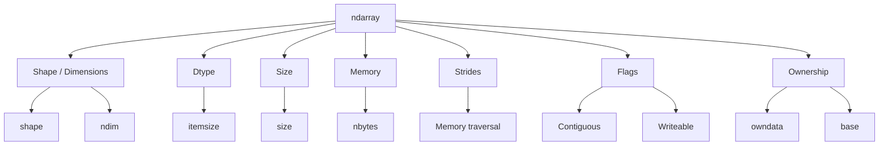
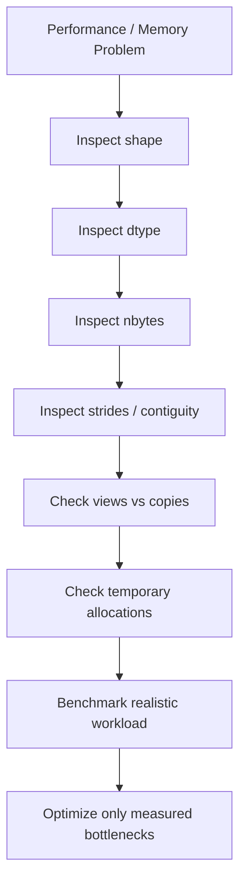

# 04- Array Attributes

## Overview

NumPy array attributes expose the structural and memory characteristics of an `ndarray`. They are not merely convenience properties; they describe how NumPy interprets the underlying data and are essential for writing correct, memory-efficient numerical processing code.

For backend and data engineering workloads, the most important attributes are:

- `shape`
- `ndim`
- `size`
- `dtype`
- `itemsize`
- `nbytes`
- `strides`
- `flags`
- `data`
- `base`

Together, these attributes answer practical questions such as:

- What dimensions does this dataset have?
- How many elements are stored?
- How much memory does the data buffer consume?
- What numeric representation is being used?
- Is the array contiguous?
- Does this array own its memory?
- Could this array share storage with another array?
- Why did an operation produce an unexpected shape or memory allocation?

A useful mental model is:



Understanding these attributes makes indexing, reshaping, broadcasting, views, copies, and performance behavior much easier to reason about.

## Inspecting an ndarray

Start with a representative array:

```python
import numpy as np

values = np.array(
    [
        [10, 20, 30],
        [40, 50, 60],
    ],
    dtype=np.int32,
)

print("shape:", values.shape)
print("ndim:", values.ndim)
print("size:", values.size)
print("dtype:", values.dtype)
print("itemsize:", values.itemsize)
print("nbytes:", values.nbytes)
print("strides:", values.strides)
print("flags:", values.flags)
```

A typical result is conceptually:

```text
shape   → (2, 3)
ndim    → 2
size    → 6
dtype   → int32
itemsize → 4
nbytes  → 24
strides → (12, 4)
```

These attributes should become part of your normal debugging workflow for unexpected numerical behavior.

## shape

`shape` is a tuple describing the length of every dimension.

```python
values = np.zeros(
    (1_000, 20),
    dtype=np.float32,
)

print(values.shape)
```

Output:

```text
(1000, 20)
```

This means:

```text
1,000 elements along axis 0
20 elements along axis 1
```

The total number of elements is:

```python
values.size
```

which is:

```text
20,000
```

### Why shape Matters

Shape is part of the data contract.

For example:

```text
(batch_size, features)
```

may represent a batch of records, while:

```text
(batch_size, timestamps, metrics)
```

may represent a time-oriented dataset.

An array can have perfectly valid numeric values while still being semantically wrong because its shape is incorrect.

### Production Validation

Validate expected dimensionality at processing boundaries:

```python
def process_batch(values: np.ndarray) -> np.ndarray:
    if values.ndim != 2:
        raise ValueError("Expected a 2D array")

    if values.shape[1] != 20:
        raise ValueError("Expected exactly 20 features")

    return values
```

This is especially important when arrays originate from:

- API payloads.
- Files.
- Database extraction.
- Message queues.
- Pandas transformations.
- Batch jobs.

## ndim

`ndim` reports the number of dimensions.

```python
vector = np.zeros(10)
matrix = np.zeros((10, 5))
tensor = np.zeros((10, 5, 2))

print(vector.ndim)
print(matrix.ndim)
print(tensor.ndim)
```

Output:

```text
1
2
3
```

A useful relationship is:

```text
len(shape) == ndim
```

For:

```python
values = np.zeros((100, 10, 5))
```

you have:

```text
shape = (100, 10, 5)
ndim  = 3
```

### When ndim Is Useful

`ndim` is often preferable to hard-coding assumptions about an input:

```python
if data.ndim != 1:
    raise ValueError("Expected a one-dimensional dataset")
```

This gives a clear failure at the boundary instead of allowing a later indexing or broadcasting error to occur.

## size

`size` is the total number of elements in the array.

```python
values = np.zeros((1_000, 20))

print(values.size)
```

Result:

```text
20000
```

The relationship is:

```text
size = product(shape)
```

For example:

```text
shape = (100, 50, 20)

size = 100 × 50 × 20
     = 100,000
```

### Why size Matters

`size` is useful for:

- Input validation.
- Capacity planning.
- Memory estimation.
- Batch limits.
- Empty-array detection.
- Benchmark sizing.

Example:

```python
MAX_ELEMENTS = 1_000_000

if values.size > MAX_ELEMENTS:
    raise ValueError("Array exceeds processing limit")
```

This is safer than checking only one dimension.

## dtype

`dtype` describes the representation used for each array element.

```python
values = np.array(
    [10, 20, 30],
    dtype=np.int32,
)

print(values.dtype)
```

Output:

```text
int32
```

Dtype affects:

- Element size.
- Numeric range.
- Precision.
- Overflow behavior.
- Memory usage.
- Interoperability.
- Some performance characteristics.

Common numeric dtypes include:

| Dtype | Typical Size |
|---|---:|
| `int8` | 1 byte |
| `int16` | 2 bytes |
| `int32` | 4 bytes |
| `int64` | 8 bytes |
| `float16` | 2 bytes |
| `float32` | 4 bytes |
| `float64` | 8 bytes |

The exact choice must be driven by the application's numerical requirements.

## itemsize

`itemsize` reports the number of bytes used by one array element.

```python
values = np.zeros(
    1_000,
    dtype=np.float32,
)

print(values.itemsize)
```

Output:

```text
4
```

For `float64`:

```python
values = np.zeros(
    1_000,
    dtype=np.float64,
)

print(values.itemsize)
```

Output:

```text
8
```

The relationship is:

```text
nbytes = size × itemsize
```

For example:

```text
10,000,000 float32 values

10,000,000 × 4
= 40,000,000 bytes
≈ 38.1 MiB
```

This is useful for estimating the data-buffer cost of a numerical workload.

## nbytes

`nbytes` reports the total number of bytes occupied by the array's data.

```python
values = np.zeros(
    10_000_000,
    dtype=np.float32,
)

print(values.nbytes)
```

Output:

```text
40000000
```

It does not mean the entire Python process consumes exactly that amount of memory.

A process may also contain:

- Other arrays.
- Python objects.
- Framework state.
- Temporary arrays.
- Serialization buffers.
- Database client buffers.
- Native-library allocations.
- Runtime overhead.

Therefore:

```text
array.nbytes
    ≠
process memory
```

`nbytes` is the data-buffer cost of that particular array.

## Memory Estimation from Attributes

The following relationship is useful:

```python
estimated_bytes = values.size * values.itemsize
```

For normal numerical arrays, this should correspond to:

```python
values.nbytes
```

Example:

```python
values = np.zeros(
    (5_000, 100),
    dtype=np.float64,
)

print(values.size)
print(values.itemsize)
print(values.nbytes)
```

Expected relationship:

```text
size     = 500,000
itemsize = 8
nbytes   = 4,000,000
```

Understanding this relationship helps when setting worker memory limits in Docker or Kubernetes.

## strides

`strides` describe how many bytes NumPy moves through memory when advancing by one element along each dimension.

Consider:

```python
values = np.array(
    [
        [10, 20, 30],
        [40, 50, 60],
    ],
    dtype=np.int32,
)

print(values.strides)
```

A typical C-contiguous array has:

```text
(12, 4)
```

because:

```text
one column step  = 4 bytes
one row step     = 3 × 4 = 12 bytes
```

Conceptually:

```text
Logical array:

[ 10  20  30 ]
[ 40  50  60 ]

Memory:

10 → 20 → 30 → 40 → 50 → 60
```

The stride information allows NumPy to interpret multidimensional structures without necessarily rearranging the underlying data.

## Why strides Matter

Strides explain several behaviors that otherwise appear surprising:

- Transposes can be views.
- Slices can share memory.
- Non-contiguous arrays can exist.
- Some operations may be slower due to access patterns.
- Some libraries may require contiguous input.
- Reshaping may or may not require a copy.

This becomes more important as arrays get larger.

## flags

The `flags` attribute provides information about memory layout and mutability.

```python
values = np.zeros(
    (100, 10),
    dtype=np.float32,
)

print(values.flags)
```

Important properties include:

| Flag | Meaning |
|---|---|
| `c_contiguous` | Memory is C-contiguous |
| `f_contiguous` | Memory is Fortran-contiguous |
| `owndata` | Array owns its data |
| `writeable` | Array can be modified |
| `aligned` | Data is aligned appropriately |
| `writebackifcopy` | Array uses special write-back semantics |

For everyday backend engineering, the most important are usually:

```python
values.flags.c_contiguous
values.flags.f_contiguous
values.flags.owndata
values.flags.writeable
```

## C-Contiguous Arrays

C-contiguous arrays use row-major ordering.

For:

```python
values = np.array(
    [
        [10, 20, 30],
        [40, 50, 60],
    ]
)
```

the logical order is:

```text
10 → 20 → 30 → 40 → 50 → 60
```

Check:

```python
print(values.flags.c_contiguous)
```

A newly created two-dimensional array is typically C-contiguous.

C-contiguous layout can provide efficient sequential memory access.

## Fortran-Contiguous Arrays

Fortran-contiguous arrays use column-major ordering.

The logical traversal is conceptually:

```text
10 → 40 → 20 → 50 → 30 → 60
```

You can create one explicitly:

```python
values = np.asfortranarray(
    np.array(
        [
            [10, 20, 30],
            [40, 50, 60],
        ]
    )
)

print(values.flags.f_contiguous)
```

Most backend/data-processing workloads do not need to manage Fortran ordering manually, but understanding it helps when interoperating with libraries that use column-major storage.

## owndata

`owndata` indicates whether an array owns the memory containing its data.

```python
values = np.array([10, 20, 30])

print(values.flags.owndata)
```

For an independently allocated array, this is commonly `True`.

Now create a slice:

```python
subset = values[1:]

print(subset.flags.owndata)
```

The subset commonly does not own the underlying buffer.

This distinction matters for:

- Memory lifetime.
- Mutation.
- Copy behavior.
- Debugging.
- Large-array memory retention.

## base

The `base` attribute can help identify whether an array references another object as its underlying storage.

```python
values = np.array([10, 20, 30, 40])

subset = values[1:3]

print(subset.base)
```

For a common slice view, `subset.base` points toward the object that owns the underlying data.

However, `base` should not be treated as a universal ownership API. Complex operations can involve intermediate objects and different memory-sharing arrangements.

When the actual question is whether two arrays overlap in memory, use:

```python
np.shares_memory(a, b)
```

or, when an approximate answer is sufficient:

```python
np.may_share_memory(a, b)
```

## shares_memory() and may_share_memory()

Suppose:

```python
values = np.arange(10)

first = values[:5]
second = values[2:7]
```

Check actual overlap:

```python
print(np.shares_memory(first, second))
```

Typical result:

```text
True
```

`np.shares_memory()` attempts to determine whether the arrays share memory.

`np.may_share_memory()` is faster in some situations but can return `True` even when actual memory overlap does not exist.

For debugging correctness-sensitive behavior, `shares_memory()` is the stronger tool.

## writeable

Arrays are normally mutable:

```python
values = np.array([10, 20, 30])

values[0] = 999
```

You can make an array read-only:

```python
values.flags.writeable = False
```

Attempting mutation afterward raises an error.

This can be useful for protecting shared numerical inputs:

```python
def prepare_input(values: np.ndarray) -> np.ndarray:
    result = np.asarray(values)
    result.flags.writeable = False
    return result
```

Read-only arrays can reduce accidental mutation, but application architecture should still make ownership explicit.

## data

The `data` attribute provides a low-level view of the array's underlying memory buffer.

```python
values = np.array(
    [10, 20, 30],
    dtype=np.int32,
)

print(values.data)
```

This is rarely needed in normal backend code.

Direct manipulation of the raw buffer is generally inappropriate unless working with specialized low-level integrations.

Prefer high-level NumPy operations unless there is a concrete systems-level requirement.

## flags and Performance

Memory layout can affect how efficiently operations access data.

Consider:

```python
values = np.arange(1_000_000).reshape(1000, 1000)
transposed = values.T
```

The transpose can often be created as a view without copying data:

```python
print(np.shares_memory(values, transposed))
```

But:

```python
print(transposed.flags.c_contiguous)
```

may be `False`.

This means the array is efficient in one sense—it avoided a full copy—but may have a less favorable access pattern for certain operations.

This is an important engineering distinction:

```text
No copy
    ≠
Always fastest
```

Avoiding allocation and achieving optimal memory access are related but separate concerns.

## Shape and Axis Semantics

Array attributes become particularly important when working with reductions.

```python
values = np.array(
    [
        [10, 20, 30],
        [40, 50, 60],
    ]
)

print(values.shape)
print(values.sum(axis=0).shape)
print(values.sum(axis=1).shape)
```

Results:

```text
values.shape             → (2, 3)
values.sum(axis=0).shape → (3,)
values.sum(axis=1).shape → (2,)
```

The output shape is a useful correctness check.

For example:

```python
column_totals = values.sum(axis=0)

assert column_totals.shape == (3,)
```

In data pipelines, shape assertions can catch accidental aggregation along the wrong axis early.

## Shape and Broadcasting

Attributes are also useful when debugging broadcasting.

```python
prices = np.zeros((100, 10))
rates = np.zeros((10,))

print(prices.shape)
print(rates.shape)
```

The shapes are compatible:

```text
(100, 10)
(10,)
```

But:

```python
rates = np.zeros((5,))
```

would not broadcast across the second dimension.

A practical debugging pattern is:

```python
print("prices:", prices.shape)
print("rates:", rates.shape)
```

before investigating the operation itself.

## dtype and Numerical Correctness

Changing dtype is not only a memory decision.

For example, integer arithmetic can overflow when the selected dtype cannot represent the result.

```python
values = np.array(
    [2_000_000_000, 2_000_000_000],
    dtype=np.int32,
)
```

Depending on the operation and NumPy version/type rules, an `int32` computation can overflow rather than producing a mathematically correct unlimited-range integer result.

The correct engineering response is not "always use int64." Instead:

- Understand expected numeric ranges.
- Choose a sufficient dtype.
- Validate boundary conditions.
- Test extreme values.
- Avoid assuming Python integer semantics apply identically to fixed-width NumPy integer dtypes.

## dtype and Backend Boundaries

Dtype becomes important when moving data between systems.

Example:

```text
PostgreSQL
    ↓
Python driver
    ↓
NumPy dtype
    ↓
Pandas
    ↓
Parquet / API
```

A database numeric type may have different precision semantics from `float32` or `float64`.

Similarly, JSON has different numeric representation rules from NumPy scalar types.

When crossing boundaries, make conversions explicit:

```python
value = np.float64(123.45)

python_value = float(value)
```

For arrays:

```python
payload = values.tolist()
```

This may be appropriate for small API responses but expensive for large arrays.

## Memory Retention Through Views

A subtle production issue occurs when a small view retains a reference to a very large original array.

Conceptually:

```text
Large Array: 800 MB
      ↓
Small View: 1 KB
      ↓
Small object remains referenced
      ↓
Large backing memory remains alive
```

Example:

```python
large = np.zeros(
    100_000_000,
    dtype=np.float64,
)

small = large[:10]
```

Even though `small` contains only ten elements, it can retain the large backing allocation through shared storage.

When a long-lived component only needs a small subset, create an independent copy:

```python
small = large[:10].copy()
```

This trades a tiny allocation for releasing the much larger backing memory once `large` is no longer needed.

This pattern matters in:

- Long-running workers.
- Caches.
- Task queues.
- Notebook processes.
- Service-level singleton objects.

## Array Attributes in Production Diagnostics

When investigating an unexpected numerical result, memory spike, or performance regression, inspect the structural attributes first.

```python
def inspect_array(name: str, values: np.ndarray) -> None:
    print(f"{name}.shape={values.shape}")
    print(f"{name}.ndim={values.ndim}")
    print(f"{name}.size={values.size}")
    print(f"{name}.dtype={values.dtype}")
    print(f"{name}.itemsize={values.itemsize}")
    print(f"{name}.nbytes={values.nbytes}")
    print(f"{name}.strides={values.strides}")
    print(f"{name}.c_contiguous={values.flags.c_contiguous}")
    print(f"{name}.f_contiguous={values.flags.f_contiguous}")
    print(f"{name}.owndata={values.flags.owndata}")
    print(f"{name}.writeable={values.flags.writeable}")
```

This can be integrated into debugging or benchmark tooling rather than scattered throughout application code.

Avoid logging enormous array contents in production. Log metadata and bounded samples instead.

## Observability Considerations

For production numerical services, useful array-level telemetry includes:

| Attribute / Metric | Operational Value |
|---|---|
| `shape` | Detect unexpected batch structure |
| `size` | Track workload volume |
| `dtype` | Detect unexpected representation |
| `nbytes` | Estimate array-level memory |
| Batch count | Track throughput |
| Processing time | Detect latency regressions |
| Process RSS | Track actual worker memory |
| Error count | Detect invalid inputs |

Do not log every array attribute for every request if traffic is high. Prefer structured diagnostic logging at debug level or sampled production telemetry.

For Kubernetes or containerized workers, process-level memory metrics remain more important than `nbytes` alone.

## Security and Reliability

Array attributes are especially useful for protecting against resource-exhaustion failures.

Suppose an external request is converted into a two-dimensional array. Before processing:

```python
MAX_ELEMENTS = 5_000_000

if values.size > MAX_ELEMENTS:
    raise ValueError("Input exceeds maximum supported size")
```

You can also validate dimensions:

```python
rows, columns = values.shape

if columns > 1_000:
    raise ValueError("Too many columns")
```

This creates explicit operational limits.

A production system should also bound:

- HTTP request size.
- Kafka message size where applicable.
- File size.
- Batch size.
- Task payload size.
- Worker concurrency.

Array validation is one layer of the overall resource-protection strategy.

## Common Mistakes

### Confusing shape with size

```python
values = np.zeros((100, 10))
```

has:

```text
shape → (100, 10)
size  → 1000
```

They describe different properties.

### Assuming nbytes Equals Process Memory

`nbytes` describes one data buffer, not the complete application process.

Use process-level metrics for actual memory usage.

### Ignoring dtype

Two arrays with identical shapes can consume very different amounts of memory:

```python
np.zeros((10_000, 10_000), dtype=np.float32)
np.zeros((10_000, 10_000), dtype=np.float64)
```

The second uses roughly twice the data-buffer memory.

### Assuming a View Is Contiguous

A view can share memory while having non-contiguous strides.

Check:

```python
values.flags.c_contiguous
```

when layout matters.

### Assuming No Copy Means No Performance Cost

A non-contiguous view may avoid allocation but still lead to inefficient memory access or force a downstream copy.

### Keeping Tiny Views of Huge Arrays

A small long-lived view can retain a large backing buffer.

Use `.copy()` when the small subset needs to outlive the original dataset.

### Relying on base for Ownership Logic

`base` is useful for inspection but should not be treated as a universal ownership abstraction.

Prefer explicit ownership decisions and `np.shares_memory()` when memory sharing is the actual concern.

### Logging Full Arrays

Dumping large arrays into application logs can produce huge I/O volume and sensitive-data exposure.

Log metadata and bounded samples instead.

## Performance Debugging Workflow

When an array-processing operation is slower or consumes more memory than expected:



A practical sequence is:

1. Confirm input shape and size.
2. Confirm dtype and item size.
3. Estimate array-level memory with `nbytes`.
4. Inspect contiguity and strides.
5. Check whether views or copies are being created.
6. Measure the actual operation.
7. Inspect process-level CPU and memory metrics.
8. Optimize the demonstrated bottleneck.

This avoids premature optimization based on assumptions.

## Practical Inspection Example

A reusable inspection function can provide a compact diagnostic snapshot:

```python
import numpy as np


def describe_array(values: np.ndarray) -> dict[str, object]:
    return {
        "shape": values.shape,
        "ndim": values.ndim,
        "size": values.size,
        "dtype": str(values.dtype),
        "itemsize": values.itemsize,
        "nbytes": values.nbytes,
        "strides": values.strides,
        "c_contiguous": values.flags.c_contiguous,
        "f_contiguous": values.flags.f_contiguous,
        "owndata": values.flags.owndata,
        "writeable": values.flags.writeable,
    }
```

This is useful for:

- Benchmark tooling.
- Debugging scripts.
- Data-quality diagnostics.
- Performance experiments.
- Test assertions.

For high-throughput services, avoid executing expensive memory-sharing checks on every request unless diagnostics require them.

## Interview-Relevant Questions

### What is the difference between `shape`, `ndim`, and `size`?

`shape` gives the length of each dimension, `ndim` gives the number of dimensions, and `size` gives the total number of elements.

### What is the relationship between `size`, `itemsize`, and `nbytes`?

For a standard numerical array:

```text
nbytes = size × itemsize
```

### What does dtype tell you?

It describes how each element is represented and therefore affects size, precision, range, memory consumption, and numerical behavior.

### What are strides?

Strides describe how many bytes NumPy moves in memory when advancing along each axis.

### Why does a transpose often avoid a copy?

NumPy can frequently represent the transposed view by changing shape and stride metadata instead of physically rearranging the underlying data.

### What is the trade-off of a non-contiguous view?

It can avoid copying large data but may have less efficient memory access and may require a copy for some downstream operations.

### What is `owndata`?

It indicates whether an array owns the underlying data buffer.

### Why can a small view cause high memory usage?

Because the view can retain the much larger backing array in memory.

### When would you inspect `flags.c_contiguous`?

When diagnosing performance, interoperability with lower-level code, or unexpected copying caused by memory-layout requirements.

### Why is `nbytes` insufficient for capacity planning?

Because process memory includes more than a single array's data buffer: multiple arrays, temporary allocations, runtime state, framework objects, and native allocations can all contribute.

## Key Takeaways

- `shape`, `ndim`, and `size` describe array structure and are essential for validating numerical data contracts.
- `dtype`, `itemsize`, and `nbytes` explain the representation and data-buffer memory cost of an `ndarray`.
- `strides` and `flags` reveal how data is traversed and whether an array is contiguous, writeable, or owns its memory.
- Views can avoid expensive copies but can retain large backing buffers or introduce shared-memory side effects, so ownership and lifetime must be considered explicitly.
- Array attributes are practical production diagnostics: inspect them to troubleshoot shape errors, memory growth, unexpected copies, and performance problems before optimizing.