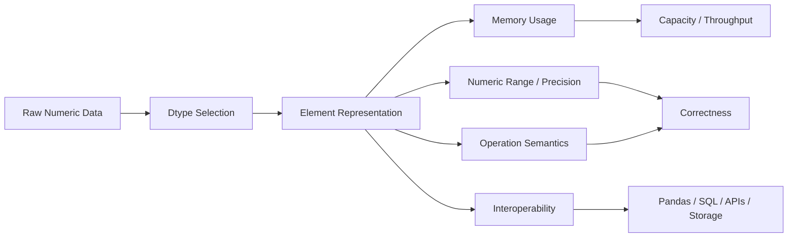
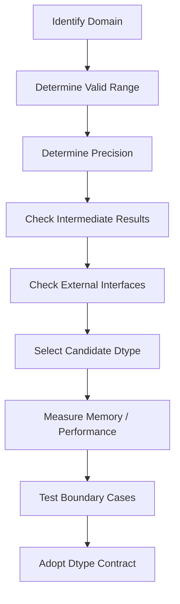

# 05- Data Types

## Overview

NumPy dtypes define how the elements of an `ndarray` are represented in memory and how numerical operations interpret those values. Dtype selection affects memory consumption, precision, numeric range, overflow behavior, interoperability, and sometimes performance.

For backend and data engineering workloads, dtype is a data-model decision rather than a minor implementation detail. A dataset containing 100 million measurements can consume materially different amounts of memory depending on whether values are stored as `float32`, `float64`, or another representation. Conversely, choosing an unnecessarily small dtype can introduce overflow or precision loss.

A useful model is:



The main engineering principle is:

> Choose a dtype that is correct for the domain first, then optimize its memory and performance characteristics.

## What a NumPy dtype Represents

A dtype describes the representation of each element in an array.

```python
import numpy as np

values = np.array(
    [10, 20, 30],
    dtype=np.int32,
)

print(values.dtype)
print(values.itemsize)
```

Output:

```text
int32
4
```

Every element uses the same dtype:

```text
10 → int32
20 → int32
30 → int32
```

This homogeneous representation is one of the reasons NumPy can store numerical arrays efficiently.

## Why Dtypes Matter

Dtype affects several properties simultaneously.

| Concern | Dtype Impact |
|---|---|
| Memory | Determines bytes per element |
| Range | Determines representable minimum and maximum |
| Precision | Determines how accurately values can be represented |
| Overflow | Fixed-width integers can overflow |
| Computation | Some operations behave differently by dtype |
| Interoperability | External systems may require compatible types |
| Serialization | Type conversion may be required |
| Storage | Smaller types can reduce file size |

For example:

```python
float32 = np.zeros(10_000_000, dtype=np.float32)
float64 = np.zeros(10_000_000, dtype=np.float64)

print(float32.nbytes)
print(float64.nbytes)
```

The data buffers are approximately:

```text
float32 → 40 MB
float64 → 80 MB
```

The difference becomes significant when multiple large arrays are alive simultaneously.

## Common NumPy Dtypes

The most important dtype families for backend/data workloads are:

| Family | Examples | Primary Use |
|---|---|---|
| Boolean | `bool` | Masks and flags |
| Signed integers | `int8`, `int16`, `int32`, `int64` | Counts, IDs, discrete values |
| Unsigned integers | `uint8`, `uint16`, `uint32`, `uint64` | Non-negative bounded values |
| Floating point | `float16`, `float32`, `float64` | Measurements and continuous values |
| Complex | `complex64`, `complex128` | Specialized numerical workloads |
| Strings / objects | Fixed-width string, `object` | Limited interoperability cases |
| Datetime | `datetime64` | Time-oriented numerical representation |
| Timedelta | `timedelta64` | Duration representation |

For this engineering playbook, integer, floating-point, boolean, datetime, and timedelta dtypes are the most relevant.

## Inspecting Dtypes

Use the array's `dtype` attribute:

```python
values = np.array(
    [10, 20, 30],
    dtype=np.int32,
)

print(values.dtype)
```

For memory analysis:

```python
print(values.itemsize)
print(values.nbytes)
```

For a broader diagnostic:

```python
print(values.dtype)
print(values.itemsize)
print(values.nbytes)
print(values.shape)
```

Dtype inspection should be part of debugging when:

- Memory usage is unexpectedly high.
- A numeric result appears inaccurate.
- Arithmetic overflows.
- A conversion is slower than expected.
- Data crosses a database or API boundary.

## Signed Integers

Signed integer dtypes represent both negative and positive whole numbers.

Common choices include:

```text
int8
int16
int32
int64
```

Their approximate ranges are:

| Dtype | Width | Approximate Range |
|---|---:|---:|
| `int8` | 8-bit | -128 to 127 |
| `int16` | 16-bit | -32,768 to 32,767 |
| `int32` | 32-bit | -2.1 billion to 2.1 billion |
| `int64` | 64-bit | approximately ±9.22 quintillion |

The actual range can be inspected rather than memorized:

```python
info = np.iinfo(np.int32)

print(info.min)
print(info.max)
```

This is preferable in production-oriented code when the numeric limits are part of validation logic.

## Unsigned Integers

Unsigned types represent non-negative integers.

```text
uint8
uint16
uint32
uint64
```

For example:

```python
values = np.array(
    [0, 10, 20],
    dtype=np.uint8,
)
```

Use unsigned types only when the domain is genuinely non-negative and the downstream system supports the semantics.

Do not assume that an unsigned dtype is automatically better simply because it doubles the positive range for the same bit width.

Potential complications include:

- Underflow behavior.
- Interactions with signed integers.
- Promotion rules.
- Database and serialization compatibility.
- APIs that expect signed numbers.

## Floating-Point Types

NumPy commonly uses:

```text
float16
float32
float64
```

For backend/data engineering, `float32` and `float64` are typically the important choices.

```python
measurements = np.array(
    [10.25, 20.5, 30.75],
    dtype=np.float32,
)
```

### float32

Advantages:

- Half the storage of `float64`.
- Lower memory bandwidth requirements.
- Often sufficient for measurements and large numerical arrays.

Limitations:

- Lower precision.
- Greater rounding error.
- Smaller representable range.

### float64

Advantages:

- Higher precision.
- Safer default for many general-purpose numerical computations.
- Widely supported by scientific and numerical Python code.

Limitations:

- Twice the storage of `float32`.
- Higher memory bandwidth requirements.

The correct choice depends on error tolerance, not on the simplistic rule that "float64 is always better."

## Precision vs Range

These are different concepts.

### Range

Range describes how large or small a value can be represented.

### Precision

Precision describes how many significant digits can be represented reliably.

A dtype can have enough range for a value while still lacking the precision needed to distinguish nearby values.

For production systems involving:

- Financial calculations.
- Scientific measurements.
- Long-running accumulations.
- High-precision ratios.
- Large magnitude values.

dtype selection should be validated against the required numerical error, not only memory requirements.

## Inspecting Floating-Point Limits

Use `np.finfo()`:

```python
float_info = np.finfo(np.float32)

print(float_info.max)
print(float_info.tiny)
print(float_info.eps)
```

Important properties include:

- `max`: maximum finite representable value.
- `tiny`: smallest positive normalized value.
- `eps`: machine epsilon near 1.

For comparing dtypes:

```python
print(np.finfo(np.float32).eps)
print(np.finfo(np.float64).eps)
```

`float64` provides substantially more precision than `float32`.

## Integer Overflow

Fixed-width integers do not behave like Python's arbitrary-precision `int`.

For example:

```python
import numpy as np

values = np.array(
    [2_000_000_000],
    dtype=np.int32,
)

result = values + 2_000_000_000

print(result)
```

The result can overflow because the mathematical result cannot be represented by `int32`.

This is a critical distinction:

```text
Python int
→ arbitrary-precision integer semantics

NumPy int32
→ fixed-width integer semantics
```

### Production Guidance

Choose a dtype capable of representing the largest expected intermediate result, not merely the original input.

This matters for:

- Counters.
- Aggregations.
- Byte counts.
- Financial quantities represented as integers.
- Batch sizes.
- Cumulative metrics.

A safe input range can still produce overflow after multiplication, summation, or accumulation.

## Integer Overflow in Aggregation

An especially important mistake is checking only the input values.

```python
values = np.array(
    [1_000_000_000, 1_000_000_000],
    dtype=np.int32,
)
```

Each value is valid for `int32`, but a sum may exceed the type's range depending on the operation's dtype behavior.

For large aggregations, explicitly validate the accumulator dtype and test boundary cases.

A wider type can be selected when necessary:

```python
values = np.array(
    [1_000_000_000, 1_000_000_000],
    dtype=np.int64,
)

total = values.sum(dtype=np.int64)
```

The general rule is:

> Validate the dtype of the computation, not just the dtype of the input.

## Boolean dtype

Boolean arrays contain `True` and `False`.

```python
mask = np.array(
    [True, False, True, True],
    dtype=bool,
)
```

They are commonly used for:

- Filtering.
- Validation.
- Conditional selection.
- Missing-value detection.
- State flags.

Example:

```python
values = np.array([10, 25, 40, 55])

mask = values >= 40

filtered = values[mask]
```

The boolean mask is an important part of NumPy's array-processing model.

For large datasets, masks are themselves arrays and therefore consume memory. A mask over millions of elements is much cheaper than a `float64` array, but it is still a real allocation.

## Dtype Promotion

NumPy may promote values to a different dtype when combining arrays or scalar values.

For example:

```python
integers = np.array(
    [1, 2, 3],
    dtype=np.int32,
)

floats = integers + 0.5

print(floats.dtype)
```

The result requires a floating-point representation.

Promotion is useful because NumPy attempts to produce a dtype capable of representing the operation's result, but developers should not assume promotion is always free.

Promotion can mean:

- A larger dtype.
- An additional allocation.
- Increased memory consumption.
- Different numerical semantics.

Inspect the result when dtype is operationally important:

```python
print(floats.dtype)
```

## Why Dtype Promotion Matters in Production

Consider a large array:

```python
values = np.zeros(
    100_000_000,
    dtype=np.float32,
)
```

An operation that promotes results to `float64` may create a substantially larger output buffer.

The difference can be:

```text
float32 → ~400 MB
float64 → ~800 MB
```

That can turn an otherwise safe worker into an OOM-prone workload.

For memory-sensitive systems, inspect the dtype of intermediate and final arrays rather than assuming the input dtype is preserved.

## Explicit Casting

Use `.astype()` when an explicit conversion is required.

```python
values = np.array(
    [10, 20, 30],
    dtype=np.int32,
)

converted = values.astype(
    np.float32,
)
```

By default, `astype()` creates an independent array.

```python
converted = values.astype(
    np.float32,
    copy=True,
)
```

For large arrays, remember that the source and converted arrays can temporarily coexist.

### Copy Avoidance

When a safe dtype conversion is already satisfied, `copy=False` may avoid unnecessary copying:

```python
converted = values.astype(
    np.float32,
    copy=False,
)
```

However, `copy=False` means "avoid a copy when possible," not "guarantee no copy."

Code should therefore not depend on `copy=False` as an ownership contract.

## Safe Casting

NumPy provides casting controls for operations where implicit conversion should be constrained.

For example:

```python
values = np.array(
    [1, 2, 3],
    dtype=np.int32,
)

converted = values.astype(
    np.int64,
    casting="safe",
)
```

The exact casting rules depend on the source and destination dtypes.

For production data validation, it is often better to:

1. Validate the input domain.
2. Select the intended dtype.
3. Convert explicitly.
4. Test boundary values.

Do not treat casting errors as a substitute for domain validation.

## Dtype and Memory Efficiency

Dtype is one of the simplest ways to reduce array memory.

Example:

```python
import numpy as np

float32_values = np.zeros(
    50_000_000,
    dtype=np.float32,
)

float64_values = np.zeros(
    50_000_000,
    dtype=np.float64,
)
```

Approximate data-buffer sizes:

```text
float32 → 200 MB
float64 → 400 MB
```

If a worker performs multiple operations:

```text
Input
  +
Temporary
  +
Output
```

the difference can become much larger at peak memory.

### Important Trade-Off

Reducing dtype size may decrease:

- Memory usage.
- Memory bandwidth.
- Cache pressure.
- Storage requirements.

But it can also reduce:

- Precision.
- Numeric range.
- Compatibility.

The optimization is valid only when the resulting numerical behavior remains correct.

## Dtype and Cache Behavior

Smaller element sizes can allow more data to fit into CPU caches.

Conceptually:

```text
Smaller dtype
    ↓
More elements per cache line
    ↓
Potentially better memory locality
```

However, this does not guarantee faster execution.

Performance may instead be limited by:

- Arithmetic cost.
- Memory bandwidth.
- Algorithmic complexity.
- Non-contiguous access.
- Temporary allocations.
- External I/O.

Benchmark representative workloads rather than assuming a smaller dtype always wins.

## Dtype and Vectorization

Vectorized operations work on the chosen dtype.

```python
values = np.array(
    [10.0, 20.0, 30.0],
    dtype=np.float32,
)

result = values * 1.05
```

The operation is performed according to NumPy's dtype rules.

A vectorized operation can still become inefficient if it repeatedly forces conversions between dtypes.

A practical goal is to maintain a consistent numerical representation through a processing stage whenever correctness permits.

## Structured Dtypes

NumPy also supports structured dtypes for records containing multiple named fields.

```python
dtype = np.dtype(
    [
        ("id", np.int64),
        ("amount", np.float64),
    ]
)

records = np.array(
    [
        (1, 100.50),
        (2, 240.75),
    ],
    dtype=dtype,
)
```

This creates fields with different dtypes in the same array.

Structured arrays can be useful for specialized numerical or binary-data workloads, but they are usually not the first choice for ordinary backend domain models.

For most tabular business data, Pandas or application-level models are generally more expressive.

## Object Dtype

An array can use `dtype=object`:

```python
values = np.array(
    [1, "customer", 3.5],
    dtype=object,
)
```

This stores Python object references rather than a compact homogeneous numeric representation.

Object arrays sacrifice much of the advantage that motivates NumPy in the first place.

Avoid `object` dtype when the workload is fundamentally numerical.

If an array unexpectedly becomes `object`, investigate why.

```python
print(values.dtype)
```

Potential causes include:

- Mixed types.
- Irregular input.
- Unsupported values.
- Accidental coercion.

An unexpected `object` dtype can significantly degrade performance and increase memory overhead.

## String and Unicode Dtypes

NumPy supports fixed-width string and Unicode representations, but string-heavy processing is generally better handled by Python-native structures or Pandas depending on the workload.

For numerical pipelines, the more important concern is avoiding accidental conversion from numeric arrays to string or object arrays.

For example, data ingestion should validate that a supposed numeric column remains numeric instead of silently producing an object-backed representation.

## Datetime and Timedelta Dtypes

NumPy provides specialized dtypes for dates and durations:

```python
timestamps = np.array(
    [
        "2026-01-01",
        "2026-01-02",
        "2026-01-03",
    ],
    dtype="datetime64[D]",
)

durations = np.array(
    [1, 2, 3],
    dtype="timedelta64[D]",
)
```

You can perform arithmetic:

```python
future = timestamps + durations
```

These types are useful for array-oriented temporal calculations, but backend systems often rely on higher-level datetime types in application code, databases, and Pandas.

Use NumPy datetime dtypes where the surrounding processing model is genuinely array-oriented.

## Native Python Types vs NumPy Scalar Types

NumPy arrays use NumPy scalar types:

```python
values = np.array(
    [10, 20, 30],
    dtype=np.int64,
)

value = values[0]

print(type(value))
```

The result is typically a NumPy scalar rather than a native Python `int`.

At application boundaries, conversion may be useful:

```python
python_value = int(value)
```

Similarly:

```python
python_float = float(np.float64(12.5))
```

This can matter for:

- JSON serialization.
- Pydantic models.
- API responses.
- Logging.
- Database adapters.

## JSON and Dtype Boundaries

NumPy scalar types are not universally accepted by standard JSON encoders.

For example:

```python
import numpy as np

value = np.int64(100)
```

A production API should convert it explicitly:

```python
payload = {
    "count": int(value),
}
```

For arrays:

```python
payload = {
    "values": values.tolist(),
}
```

However, `.tolist()` creates Python-native objects and can be expensive for very large arrays.

For large numerical payloads, use a bounded API response or a format intended for numerical data.

## SQL and Database Boundaries

Database types and NumPy dtypes do not map one-to-one.

For example:

| Database Concept | Possible NumPy Representation |
|---|---|
| 32-bit integer | `np.int32` |
| 64-bit integer | `np.int64` |
| Double precision | `np.float64` |
| Boolean | `bool` |
| Date/time | `datetime64` or Python datetime |

The correct mapping depends on:

- Database schema.
- Driver behavior.
- Precision requirements.
- Nullability.
- Application semantics.

Do not blindly downcast database values merely to save memory.

A PostgreSQL `NUMERIC` value, for example, may require decimal semantics that are not equivalent to binary floating-point.

For exact financial arithmetic, Python's `decimal.Decimal` or database-side numeric operations may be more appropriate than converting values to `float32`.

## Pandas and Dtype Decisions

When moving data between Pandas and NumPy, dtype behavior should be checked explicitly.

```python
import numpy as np
import pandas as pd

df = pd.DataFrame(
    {
        "amount": [10.0, 20.0, 30.0],
    }
)

values = df["amount"].to_numpy(dtype=np.float64)

print(values.dtype)
```

The conversion boundary should be deliberate.

A practical pipeline is often:

```text
Database / File
      ↓
Pandas DataFrame
      ↓
Select numeric columns
      ↓
NumPy ndarray
      ↓
Vectorized numerical processing
      ↓
Pandas / Storage
```

The dtype should be treated as part of the contract between these stages.

## Choosing Dtypes for Common Workloads

A practical starting point:

| Workload | Typical Choice | Reason |
|---|---|---|
| Small integer counters | `int32` or `int64` | Depends on upper bound |
| Large IDs | `int64` | Wide range |
| Measurements | `float32` or `float64` | Depends on precision |
| Financial exact values | Decimal / database numeric | Avoid binary-float assumptions |
| Boolean masks | `bool` | Compact logical representation |
| Timestamp arrays | `datetime64` | Array-oriented date handling |
| Durations | `timedelta64` | Array-oriented interval handling |
| Specialized records | Structured dtype | Fixed binary-like record layout |

These are starting points, not universal defaults.

## Dtype Selection Workflow

A production-oriented dtype decision can follow this sequence:



### Determine Domain Range

Ask:

```text
What is the smallest valid value?
What is the largest valid value?
What are the largest intermediate values?
```

### Determine Precision

Ask:

```text
How much numerical error is acceptable?
Does rounding affect business correctness?
```

### Check External Systems

Consider:

- PostgreSQL types.
- Kafka serialization.
- JSON APIs.
- Parquet schemas.
- Pandas interoperability.
- Native extensions.

### Benchmark

Measure:

- Peak memory.
- Processing latency.
- Throughput.
- Allocation behavior.

The goal is not to find the smallest dtype. It is to find the smallest **correct** dtype that meets operational requirements.

## Safe Downcasting

Downcasting can reduce memory, but it should be verified.

Suppose values are known to be integers within a bounded range:

```python
values = np.array(
    [0, 10, 100],
    dtype=np.int64,
)

smaller = values.astype(np.int32)
```

Before adopting this pattern in production, verify:

- Minimum.
- Maximum.
- Future growth expectations.
- Intermediate arithmetic.
- Downstream compatibility.

A dtype that works today may become unsafe as traffic or identifier ranges grow.

## Handling Large Datasets

Suppose a batch pipeline processes 100 million measurements.

Using `float64`:

```text
100,000,000 × 8 bytes
≈ 800 MB
```

Using `float32`:

```text
100,000,000 × 4 bytes
≈ 400 MB
```

But the worker may require more than the input array:

```text
Input            400 MB
Mask              100 MB
Temporary         400 MB
Output            400 MB
Runtime / Python  ...
-------------------------
Peak > 1 GB
```

This is why dtype optimization should be considered together with:

- Batch size.
- Temporary arrays.
- View/copy behavior.
- Worker concurrency.
- Kubernetes memory limits.

## Memory-Aware Batch Design

A large numerical worker should use bounded batches.

```python
import numpy as np


def process_batch(values: np.ndarray) -> np.ndarray:
    if values.dtype != np.float32:
        values = values.astype(np.float32)

    output = np.empty_like(values)

    np.multiply(
        values,
        1.05,
        out=output,
    )

    return output
```

The worker can then process input chunks instead of constructing one massive array.

This improves predictability and makes memory sizing easier.

## Common Mistakes

### Choosing the Smallest Possible Dtype

A developer may select `int8` or `float16` simply because it uses less memory.

**Why it fails:** the range or precision may be insufficient.

**Avoid it:** select the smallest dtype that satisfies the complete numerical contract.

### Assuming Python int and NumPy int64 Behave Identically

Python integers can grow beyond fixed-width limits.

NumPy integer dtypes are fixed-width.

**Avoid it:** reason about explicit dtype ranges and test overflow conditions.

### Ignoring Intermediate Overflow

Input values may fit within a dtype while their sum or product does not.

**Avoid it:** select computation dtypes based on intermediate results.

### Accidentally Creating object Arrays

Mixed input can produce `dtype=object`.

**Why it fails:** object arrays lose much of NumPy's efficient numerical representation.

**Avoid it:** validate and normalize input types before array creation.

### Assuming float32 Is Always Enough

Lower precision can produce meaningful numerical error.

**Avoid it:** define acceptable error and test representative values.

### Blindly Downcasting Database Data

A database may store values with greater precision or range than a chosen NumPy dtype.

**Avoid it:** verify semantic compatibility before reducing precision or range.

### Ignoring Promotion

An expression can produce a wider dtype than expected.

**Avoid it:** inspect the dtype of large intermediate results when memory is important.

### Using Floating-Point Types for Exact Financial Semantics

Binary floating-point values do not represent every decimal fraction exactly.

**Avoid it:** use decimal or database-native exact numeric semantics when exact arithmetic is required.

## Security and Reliability Considerations

Dtype decisions can become operational safety issues when they influence memory allocation.

For external data:

```python
MAX_ELEMENTS = 5_000_000

if data.size > MAX_ELEMENTS:
    raise ValueError("Batch is too large")
```

Then validate dtype and shape before expensive processing.

For worker-based systems:

```text
Input
 ↓
Size validation
 ↓
Shape validation
 ↓
Dtype normalization
 ↓
Numerical processing
 ↓
Bounded output
```

A correct dtype does not prevent an allocation attack by itself. Memory limits, payload limits, queue limits, and worker concurrency controls remain necessary.

## Monitoring Dtype Drift

In long-running ETL systems, unexpected dtype changes can indicate upstream schema problems.

Monitor or validate:

```python
expected_dtype = np.dtype(np.float32)

if data.dtype != expected_dtype:
    raise ValueError(
        f"Expected {expected_dtype}, got {data.dtype}"
    )
```

This can detect changes such as:

```text
float32 → float64
int32   → object
int32   → float64
```

before they produce unexpected memory or correctness behavior.

For production systems, schema validation is usually preferable to logging every dtype change after the fact.

## Testing Dtype Behavior

Tests should explicitly verify dtype where it is part of the contract.

```python
import numpy as np


def test_measurement_dtype() -> None:
    values = np.array(
        [10.5, 20.5, 30.5],
        dtype=np.float32,
    )

    assert values.dtype == np.float32
    assert values.itemsize == 4
```

Boundary tests should also cover:

- Maximum valid integer.
- Minimum valid integer.
- Values close to overflow.
- Floating-point tolerance.
- Large aggregations.
- Conversion behavior.
- Unexpected mixed types.

Example:

```python
def test_integer_range() -> None:
    info = np.iinfo(np.int32)

    values = np.array(
        [info.min, info.max],
        dtype=np.int32,
    )

    assert values.min() == info.min
    assert values.max() == info.max
```

## Benchmarking Dtype Choices

When deciding between dtypes, benchmark the complete workload rather than only the arithmetic operation.

```python
import time
import numpy as np


def benchmark() -> None:
    size = 10_000_000

    for dtype in (np.float32, np.float64):
        values = np.ones(size, dtype=dtype)

        start = time.perf_counter()

        result = values * 1.05

        elapsed = time.perf_counter() - start

        print(
            f"dtype={dtype.__name__} "
            f"elapsed={elapsed:.6f}s "
            f"nbytes={result.nbytes}"
        )
```

A meaningful benchmark should consider:

- Same input size.
- Same algorithm.
- Same hardware.
- Warm-up effects.
- Allocation costs.
- Peak memory.
- End-to-end processing behavior.

A smaller dtype may save memory without producing a meaningful latency improvement, or may improve throughput because memory bandwidth is the limiting resource. Measure rather than assume.

## Interview-Relevant Questions

### What is a NumPy dtype?

A dtype defines how elements of an array are represented and interpreted, including their size, numeric range, precision, and operation semantics.

### Why does dtype affect memory?

Each dtype uses a fixed number of bytes per element. Therefore:

```text
memory ≈ number_of_elements × bytes_per_element
```

### What is the difference between int64 and Python int?

NumPy `int64` is fixed-width, while Python `int` supports arbitrary precision subject to available memory.

### Why can integer arithmetic overflow in NumPy?

Because fixed-width NumPy integer dtypes have finite ranges. An operation whose result exceeds that range cannot be represented correctly within the same dtype.

### Why might float32 be preferable to float64?

It uses half the data-buffer memory and can reduce memory bandwidth requirements, provided its precision and range are sufficient for the workload.

### Why might float64 be necessary?

The workload may require greater precision or a wider numerical representation, especially when error accumulation matters.

### What is dtype promotion?

Dtype promotion is NumPy's process of selecting a compatible result dtype when operands have different types or an operation requires a wider representation.

### Why is object dtype often undesirable for numerical arrays?

It stores Python object references instead of compact homogeneous numeric values, increasing overhead and limiting the benefits of vectorized numerical processing.

### How would you choose a dtype for a large production dataset?

Determine domain range, precision requirements, intermediate-result requirements, external-system compatibility, and then benchmark memory and performance using representative data.

### How can dtype affect Kubernetes reliability?

A larger dtype increases array memory. Across multiple arrays and concurrent workers, that can increase process RSS enough to exceed container memory limits and trigger OOM kills.

## Key Takeaways

- NumPy dtype is part of the data contract: it controls representation, memory usage, range, precision, and numerical behavior.
- Choose dtypes based on the complete computation, including intermediate results and downstream system requirements, rather than only the input values.
- Smaller dtypes can substantially reduce memory and sometimes improve throughput, but downcasting is safe only when range and precision requirements remain satisfied.
- Unexpected dtype promotion or `object` arrays can cause large memory and performance regressions, so dtype should be inspected at important pipeline boundaries.
- Production dtype decisions should be validated with boundary tests and representative benchmarks, then enforced as explicit processing contracts.