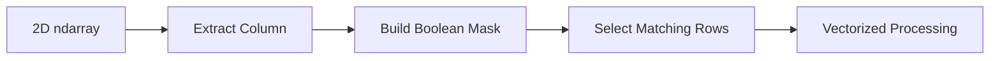
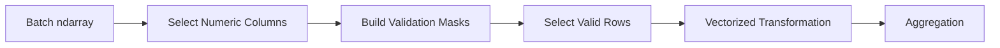

# 06- Indexing

## Overview

Indexing is the mechanism used to access specific elements, rows, columns, or regions of a NumPy `ndarray`. It is one of the most important parts of NumPy because indexing determines not only which data is selected, but also whether the result is a scalar, a view, or a newly allocated array.

For backend and data engineering workloads, indexing is foundational to:

- Selecting records from batches.
- Extracting columns from numerical matrices.
- Reading specific positions efficiently.
- Building validation masks.
- Preparing data for vectorized transformations.
- Reducing unnecessary memory allocation.
- Debugging shape and data-selection errors.

A production-oriented mental model is:

```text
ndarray
   │
   ├── Scalar indexing
   │      └── Single value
   │
   ├── Basic slicing
   │      └── Usually a view
   │
   ├── Boolean indexing
   │      └── Filtered result
   │
   └── Advanced indexing
          └── Usually a copy
```

The most important engineering question is not only:

> "Which values does this expression select?"

It is also:

> "Does this selection share memory with the source array?"

## Why Indexing Matters

Suppose a batch contains:

```text
1,000,000 records × 20 numerical fields
```

A processing pipeline may need only:

```text
field 5
rows 10,000–20,000
records where amount > threshold
```

Efficient indexing allows these selections to happen without manually iterating through every record.

At the same time, careless indexing can:

- Produce incorrect shapes.
- Select the wrong axis.
- Create large copies.
- Mutate the source array unexpectedly.
- Increase peak memory.
- Introduce subtle business-logic bugs.

Indexing therefore sits directly at the intersection of correctness and performance.

## Basic Positional Indexing

For a one-dimensional array:

```python
import numpy as np

values = np.array([10, 20, 30, 40, 50])

print(values[0])
print(values[2])
print(values[-1])
```

Output:

```text
10
30
50
```

Negative indexes count from the end:

```text
-1 → last element
-2 → second-last element
```

### When to Use It

Scalar indexing is appropriate when:

- A single known position is required.
- Processing a small control value.
- Accessing a boundary element.
- Implementing logic where one specific value matters.

For bulk numerical processing, explicit element-by-element indexing is usually less desirable than vectorized operations.

## Multidimensional Indexing

For a two-dimensional array:

```python
matrix = np.array(
    [
        [10, 20, 30],
        [40, 50, 60],
    ]
)

value = matrix[1, 2]

print(value)
```

Output:

```text
60
```

The expression:

```python
matrix[1, 2]
```

means:

```text
axis 0 → row 1
axis 1 → column 2
```

The shape is:

```text
(2, 3)
```

and valid indexes are:

```text
row:    0..1
column: 0..2
```

## Axis-Oriented Thinking

For multidimensional NumPy code, think in terms of axes rather than assuming everything is a traditional "row and column."

Consider:

```python
values = np.zeros(
    (100, 24, 5),
)
```

One possible interpretation is:

```text
axis 0 → records
axis 1 → hourly observations
axis 2 → metrics
```

Then:

```python
values[10, :, 2]
```

means:

```text
record 10
all observations
metric 2
```

A strong understanding of the array's semantic shape is essential before writing indexing expressions.

## Indexing vs Slicing

Scalar indexing selects an individual element:

```python
values[3]
```

Slicing selects a range:

```python
values[1:4]
```

For example:

```python
values = np.array([10, 20, 30, 40, 50])

subset = values[1:4]

print(subset)
```

Result:

```text
[20 30 40]
```

The common slicing form is:

```text
start:stop:step
```

where `stop` is exclusive.

```python
values[1:5:2]
```

selects:

```text
[20, 40]
```

## Slice Semantics

Basic slicing follows Python's standard half-open interval convention:

```text
[start, stop)
```

For example:

```python
values[2:5]
```

selects positions:

```text
2, 3, 4
```

not position 5.

Useful patterns include:

```python
values[:5]     # first five
values[5:]     # from index five onward
values[:]      # all elements
values[::2]    # every second element
values[::-1]   # reverse order
```

These expressions are concise and efficient, but they should still be written with explicit semantic intent in production code.

## Slicing Multidimensional Arrays

Given:

```python
matrix = np.array(
    [
        [10, 20, 30, 40],
        [50, 60, 70, 80],
        [90, 100, 110, 120],
    ]
)
```

Select the first two rows:

```python
rows = matrix[:2]
```

Select the last two columns:

```python
columns = matrix[:, -2:]
```

Select rows 1–2 and columns 0–2:

```python
subset = matrix[1:3, 0:3]
```

The colon means:

```text
all values along that axis
```

This becomes extremely useful for batch processing.

## Indexing Multiple Axes

A multidimensional indexing expression can specify a selector for every axis:

```python
values[rows, columns]
```

For example:

```python
matrix = np.array(
    [
        [10, 20, 30],
        [40, 50, 60],
        [70, 80, 90],
    ]
)

subset = matrix[1:3, :2]
```

Result:

```text
[[40 50]
 [70 80]]
```

The expression means:

```text
rows    → 1 through 2
columns → first 2
```

Keeping each axis explicit makes indexing easier to review and debug.

## Integer Indexing Arrays

NumPy supports selecting positions using an array of integer indexes.

```python
values = np.array(
    [10, 20, 30, 40, 50],
)

selected = values[
    [0, 2, 4]
]

print(selected)
```

Result:

```text
[10 30 50]
```

This is commonly called advanced indexing or fancy indexing.

It is useful when the desired positions are not one contiguous range.

## Boolean Indexing

Boolean indexing selects elements based on a condition.

```python
values = np.array(
    [10, 25, 40, 55, 70],
)

mask = values >= 50

selected = values[mask]

print(selected)
```

Result:

```text
[55 70]
```

The mask is:

```text
[False, False, False, True, True]
```

Boolean indexing is one of the most important mechanisms for data validation and filtering.

## Boolean Indexing for Validation

Suppose a batch contains temperatures:

```python
temperatures = np.array(
    [21.5, 19.8, 105.2, 22.1, -8.0],
)
```

A validity condition might be:

```python
valid = (
    (temperatures >= -50)
    & (temperatures <= 80)
)
```

Then:

```python
clean = temperatures[valid]
```

This lets the numerical layer perform bulk validation without writing a Python loop.

For production systems, remember that the valid range should come from the domain contract rather than from arbitrary technical limits.

## Combining Boolean Conditions

NumPy uses element-wise logical operators for array conditions:

```python
mask = (
    (values >= 10)
    & (values <= 100)
)
```

Common operators are:

| Operator | Meaning |
|---|---|
| `&` | Element-wise AND |
| `\|` | Element-wise OR |
| `~` | Element-wise NOT |

Do not use Python's `and` or `or` for array conditions.

Incorrect:

```python
mask = (values > 10) and (values < 100)
```

Correct:

```python
mask = (values > 10) & (values < 100)
```

Parentheses are important because Python's operator precedence does not make unparenthesized array expressions safe or clear.

## Selecting Rows with Boolean Masks

For a two-dimensional array:

```python
records = np.array(
    [
        [101, 10.5],
        [102, 35.0],
        [103, 75.0],
    ],
    dtype=np.float64,
)
```

Suppose column 1 contains an amount:

```python
mask = records[:, 1] >= 30

selected = records[mask]
```

This selects rows where the amount meets the threshold.

The processing flow is:



This pattern is common in numerical ETL pipelines.

## Selecting Columns

Selecting a column from a two-dimensional array:

```python
matrix = np.array(
    [
        [10, 20, 30],
        [40, 50, 60],
        [70, 80, 90],
    ]
)

column = matrix[:, 1]
```

Result:

```text
[20 50 80]
```

The resulting shape is:

```text
(3,)
```

This is important: selecting a single column using an integer index reduces the dimension.

## Preserving Dimensions

Sometimes the downstream operation requires the column to remain two-dimensional.

Use a slice:

```python
column = matrix[:, 1:2]
```

Now the shape is:

```text
(3, 1)
```

Compare:

```python
matrix[:, 1].shape
# (3,)

matrix[:, 1:2].shape
# (3, 1)
```

This distinction matters for:

- Broadcasting.
- Matrix-oriented APIs.
- Batch interfaces.
- Shape validation.
- Concatenation.

A surprising number of NumPy bugs are caused by accidentally dropping a dimension.

## Integer Indexing Can Change Shape

Consider:

```python
matrix = np.zeros((100, 20))

row = matrix[5]
column = matrix[:, 5]
```

Both results are one-dimensional:

```text
row.shape    → (20,)
column.shape → (100,)
```

But:

```python
row = matrix[5:6]
column = matrix[:, 5:6]
```

produce:

```text
row.shape    → (1, 20)
column.shape → (100, 1)
```

The choice should be based on the required downstream shape, not merely on whichever expression looks shorter.

## Ellipsis

The ellipsis (`...`) is useful when working with arrays with several dimensions.

For example:

```python
values = np.zeros((10, 20, 30, 40))

selected = values[..., 0]
```

This means:

```text
all preceding axes
last axis → index 0
```

It is useful when code should operate on the last dimension regardless of the number of preceding dimensions.

Example:

```python
features = batch[..., 2]
```

This can be useful when processing tensors whose leading dimensions represent different batching structures.

Do not use ellipsis merely to make code shorter. Use it when its semantics genuinely improve generality.

## None and Dimension Expansion

`None` can introduce a new axis:

```python
values = np.array([10, 20, 30])

expanded = values[:, None]

print(expanded.shape)
```

Result:

```text
(3, 1)
```

This is useful in broadcasting:

```python
values = np.array([10, 20, 30])

left = values[:, None]
right = np.array([1, 2, 3, 4])

result = left + right
```

Shapes:

```text
left  → (3, 1)
right → (4,)
result → (3, 4)
```

This pattern becomes useful in numerical transformations where dimensions represent separate semantic axes.

## Negative Indexing

Negative indexing accesses values from the end.

```python
values = np.array([10, 20, 30, 40])

print(values[-1])
print(values[-2])
```

Output:

```text
40
30
```

For multidimensional arrays:

```python
matrix[-1, -1]
```

selects the bottom-right element.

Negative indexing is useful when code naturally refers to boundaries, but avoid using it when the business meaning is clearer through explicit coordinates.

## Step Slicing

The third component of a slice controls the step:

```python
values[start:stop:step]
```

Example:

```python
values = np.arange(10)

every_other = values[::2]
```

Result:

```text
[0 2 4 6 8]
```

Reverse traversal:

```python
reversed_values = values[::-1]
```

Negative steps are particularly useful for sequence reversal without allocating another array when a view can represent the result.

The memory behavior should still be considered when the result is passed into downstream operations.

## Views from Basic Slicing

Basic slicing generally produces a view.

```python
values = np.array(
    [10, 20, 30, 40, 50],
)

subset = values[1:4]

subset[0] = 999

print(values)
```

Output:

```text
[ 10 999  30  40  50]
```

The source changed because the slice references shared memory.

This makes slicing memory-efficient but introduces mutation risk.

## Copying a Slice

Use `.copy()` when the selected data must become independent:

```python
values = np.array(
    [10, 20, 30, 40, 50],
)

subset = values[1:4].copy()

subset[0] = 999

print(values)
```

Output:

```text
[10 20 30 40 50]
```

The trade-off is:

```text
View
→ low allocation
→ shared memory
→ mutation risk

Copy
→ independent storage
→ additional memory
→ additional allocation
```

The appropriate choice depends on ownership and lifetime requirements.

## Advanced Indexing and Copies

Integer arrays and boolean arrays used for indexing generally produce new arrays.

```python
values = np.array(
    [10, 20, 30, 40, 50],
)

selected = values[[0, 2, 4]]

selected[0] = 999

print(values)
```

Output:

```text
[10 20 30 40 50]
```

The selected result is independent from the source.

This is convenient for correctness but can be expensive when selecting millions of elements.

## Memory Implications of Boolean Indexing

Suppose:

```python
values = np.zeros(
    100_000_000,
    dtype=np.float32,
)

mask = values > 0
```

The mask itself is another array.

Then:

```python
selected = values[mask]
```

typically creates another result array.

The pipeline can therefore look like:

```text
Input
  ↓
400 MB

Mask
  ↓
~100 MB

Selected Result
  ↓
Potentially up to another 400 MB
```

The actual size depends on the number of selected elements.

This is why memory-aware processing matters for large datasets.

## Slicing vs Boolean Selection

A useful comparison:

| Operation | Typical Result | Memory Behavior |
|---|---|---|
| `values[10:100]` | Contiguous range | Usually view |
| `values[:, 2]` | Axis selection | Often view |
| `values[[1, 5, 9]]` | Arbitrary positions | Copy |
| `values[mask]` | Conditional selection | Copy |
| `values[::2]` | Strided subset | Usually view |
| `values.copy()` | Independent array | Copy |

The exact behavior of complex expressions can depend on the operation, but this table is a useful production rule of thumb.

## Indexing and Broadcasting

Indexing often prepares arrays for broadcasting.

Suppose:

```python
prices = np.array(
    [
        [100.0, 200.0, 300.0],
        [110.0, 220.0, 330.0],
    ]
)

tax_rates = np.array([0.05, 0.10, 0.15])
```

Then:

```python
tax = prices * tax_rates
```

works because the shapes are compatible:

```text
prices    → (2, 3)
tax_rates → (3,)
```

You can use indexing to make a scalar or vector dimension explicit when needed:

```python
rates = tax_rates[None, :]
```

Now:

```text
rates → (1, 3)
```

This can be useful in more complex multidimensional transformations.

## Selecting Multiple Dimensions

A production transformation may need several indexing operations at once:

```python
data = np.zeros(
    (10_000, 24, 8),
    dtype=np.float32,
)

hourly_metric = data[:, :, 3]
```

The result shape is:

```text
(10_000, 24)
```

This means:

```text
all records
all hours
metric 3
```

Clear semantic names are important:

```python
cpu_usage = data[:, :, CPU_METRIC_INDEX]
```

rather than:

```python
x = data[:, :, 3]
```

The second expression may be shorter but hides the domain meaning.

## Indexing in Batch Pipelines

Consider a batch:

```text
(batch, features)
```

A transformation might:

```python
amounts = batch[:, AMOUNT_INDEX]
status_codes = batch[:, STATUS_INDEX]
```

The pipeline then becomes:



This is a common pattern for the `Numerical Data Processor` and `Vectorized Data Transformation` projects in the separate sandbox repository.

The documentation describes the technique; the actual runnable implementation belongs in the project repository.

## Combining Indexing and Validation

A common production pattern is:

```python
amounts = batch[:, 2]

valid = (
    np.isfinite(amounts)
    & (amounts >= 0)
)

clean_batch = batch[valid]
```

This combines:

1. Column selection.
2. Numerical validation.
3. Row filtering.

The result is a new array containing only valid rows.

For large batches, account for the memory cost of the mask and filtered result.

## Indexing and Missing Values

Indexing can be combined with finite-value checks:

```python
values = np.array(
    [10.0, np.nan, 30.0, np.inf],
)

valid = np.isfinite(values)

clean = values[valid]
```

Result:

```text
[10. 30.]
```

Do not treat indexing as a substitute for domain-level data quality rules. The mask should reflect what the business process considers valid.

## Index Errors

Scalar indexing can raise `IndexError` when the requested position is outside the valid range.

```python
values = np.array([10, 20, 30])

print(values[5])
```

This fails because valid indexes are:

```text
0, 1, 2
```

For backend services, unvalidated indexes derived from external input should not be trusted.

If an index is client-controlled:

```python
if index < 0 or index >= values.size:
    raise ValueError("Index out of bounds")
```

This is preferable to allowing application logic to fail unpredictably later.

## Shape Errors vs Index Errors

These are distinct classes of problems.

An index error typically means the requested position does not exist.

A shape error often means the selection is valid but incompatible with the subsequent operation.

For example:

```python
values = np.zeros((100, 10))

column = values[:, 3]
```

is valid.

But an operation expecting:

```text
(100, 1)
```

may require:

```python
column = values[:, 3:4]
```

Understanding the resulting shape immediately after indexing is therefore a useful debugging habit.

## Performance Considerations

Indexing performance depends heavily on the access pattern.

### Sequential Slicing

```python
subset = values[100_000:200_000]
```

is typically cheap because a view can describe the range through metadata.

### Strided Access

```python
subset = values[::10]
```

can avoid a copy, but downstream computation may access memory less sequentially.

### Advanced Indexing

```python
subset = values[indexes]
```

usually allocates a new array and copies selected values.

### Boolean Filtering

```python
subset = values[mask]
```

requires evaluating the mask and constructing a result.

The key principle is:

> The fact that an indexing expression looks concise does not tell you its memory cost.

## Avoiding Unnecessary Copies

Suppose only a contiguous region is required:

```python
subset = values[1000:5000]
```

Prefer this over:

```python
subset = values[np.arange(1000, 5000)]
```

The first can typically be represented as a view. The second invokes advanced indexing and generally allocates.

For large arrays, this distinction can be significant.

## In-Place Updates with Indexing

Indexing can update selected values:

```python
values = np.array(
    [10.0, 20.0, 30.0, 40.0],
)

values[values > 25] *= 1.10
```

This updates values above the threshold.

For production code, this can be memory-efficient, but mutation should be intentional.

If `values` is a shared view, the mutation may affect another component that references the same underlying data.

## Avoiding Chained Indexing

Avoid ambiguous mutation patterns such as:

```python
matrix[mask][:, 2] = 0
```

The first indexing operation may produce a copy, meaning the assignment may not update the original array as intended.

Prefer indexing the target in one expression when possible:

```python
matrix[mask, 2] = 0
```

This makes the mutation target explicit and avoids unnecessary intermediate selection.

The distinction is particularly important for production code because silent non-updates can produce incorrect results without raising an exception.

## Indexing and `np.where()`

Conditional selection can sometimes be more expressive with `np.where()`.

For example:

```python
values = np.array(
    [10, 20, 30, 40],
)

adjusted = np.where(
    values >= 30,
    values * 1.10,
    values,
)
```

This produces a new array containing transformed values where the condition is true.

Use boolean indexing when the goal is to select or filter records.

Use `np.where()` when the goal is to produce a value for each position based on a condition.

## Indexing vs Masking vs where

| Requirement | Preferred Pattern |
|---|---|
| Read one element | Scalar indexing |
| Select contiguous region | Slicing |
| Select arbitrary positions | Advanced indexing |
| Filter matching values | Boolean indexing |
| Apply conditional value transformation | `np.where()` |
| Update selected elements | Boolean indexing assignment |
| Preserve dimensionality | Slice with a range such as `1:2` |

Choosing the appropriate mechanism makes both intent and performance clearer.

## Backend API Example

Suppose a FastAPI endpoint receives a batch of numerical transaction records.

```python
from fastapi import FastAPI
import numpy as np

app = FastAPI()

AMOUNT_INDEX = 1


@app.post("/transactions/validate")
def validate_transactions(
    records: list[list[float]],
) -> dict[str, int]:
    data = np.asarray(records, dtype=np.float64)

    if data.ndim != 2:
        raise ValueError("Expected a two-dimensional batch")

    if data.shape[1] < 2:
        raise ValueError("Expected an amount column")

    amounts = data[:, AMOUNT_INDEX]

    valid = (
        np.isfinite(amounts)
        & (amounts >= 0)
    )

    return {
        "total": int(data.shape[0]),
        "valid": int(valid.sum()),
        "invalid": int((~valid).sum()),
    }
```

The indexing operation:

```python
amounts = data[:, AMOUNT_INDEX]
```

extracts the numerical column needed for validation without looping over every record in Python.

For very large batches, the request should be bounded or moved to asynchronous processing.

## Security and Reliability Considerations

Indexing becomes a reliability concern when indexes or shapes originate from external input.

Protect against:

- Out-of-range indexes.
- Excessively large slices.
- Huge boolean-selection results.
- Unbounded batch sizes.
- Unexpected dimensions.
- Memory amplification from filtering.

A safe processing boundary should validate:

```text
Payload size
     ↓
Array shape
     ↓
Element count
     ↓
Allowed indexes / columns
     ↓
Numerical validity
     ↓
Processing
```

Do not use indexing expressions as the only validation layer.

## Monitoring Indexing-Heavy Workloads

For high-volume numerical processing, monitor:

| Metric | Why It Matters |
|---|---|
| Batch size | Determines indexing workload |
| Filter ratio | Indicates how many records survive selection |
| Processing latency | Detects expensive access patterns |
| Process RSS | Detects copies and large selections |
| Error rate | Detects invalid indexes and shapes |
| Throughput | Measures processing capacity |

A sudden increase in memory may indicate that an indexing operation changed from slicing to advanced indexing or began selecting substantially more records.

## Testing Indexing Behavior

Tests should verify both values and shapes.

```python
import numpy as np


def test_column_selection() -> None:
    data = np.array(
        [
            [10, 100],
            [20, 200],
            [30, 300],
        ]
    )

    column = data[:, 1]

    np.testing.assert_array_equal(
        column,
        np.array([100, 200, 300]),
    )

    assert column.shape == (3,)
```

Test dimensional preservation separately:

```python
def test_column_preserves_dimension() -> None:
    data = np.array(
        [
            [10, 100],
            [20, 200],
            [30, 300],
        ]
    )

    column = data[:, 1:2]

    assert column.shape == (3, 1)
```

For mutation-sensitive code, explicitly test memory behavior:

```python
def test_slice_is_a_view() -> None:
    data = np.array([10, 20, 30, 40])

    subset = data[1:3]

    subset[0] = 999

    assert data[1] == 999
```

Only make such behavior part of the contract when shared-memory semantics are intentional.

## Common Mistakes and Pitfalls

### Using `and` / `or` with Arrays

Incorrect:

```python
(values > 10) and (values < 100)
```

Correct:

```python
(values > 10) & (values < 100)
```

### Forgetting Parentheses

Incorrect:

```python
values > 10 & values < 100
```

Correct:

```python
(values > 10) & (values < 100)
```

### Accidentally Dropping a Dimension

```python
matrix[:, 1]
```

returns shape:

```text
(n,)
```

while:

```python
matrix[:, 1:2]
```

returns:

```text
(n, 1)
```

Choose intentionally.

### Assuming Every Selection Is a View

Boolean and advanced indexing commonly create copies.

This can increase memory usage significantly.

### Mutating Through a View Unintentionally

A slice can modify the source array.

Use `.copy()` when independent ownership is required.

### Chained Indexing for Mutation

Avoid:

```python
data[mask][:, 2] = 0
```

Prefer:

```python
data[mask, 2] = 0
```

when modifying the original array is intended.

### Ignoring Shape After Selection

A numerically correct selection can still have the wrong dimensionality for the next operation.

Check:

```python
print(selected.shape)
```

during debugging.

### Building Huge Index Arrays

This:

```python
indexes = np.arange(0, 100_000_000)
selected = values[indexes]
```

can create unnecessary memory pressure.

Prefer slicing when the desired region is contiguous:

```python
selected = values[:100_000_000]
```

## Interview-Relevant Questions

### What is the difference between indexing and slicing?

Indexing selects a specific position, while slicing selects a range using `start:stop:step`.

### What is basic slicing?

Basic slicing uses constructs such as:

```python
values[1:5]
values[:, 2]
values[::2]
```

It commonly produces views rather than copies.

### What is advanced indexing?

Advanced indexing uses integer arrays or boolean arrays:

```python
values[[1, 3, 5]]
values[values > 10]
```

It generally produces a copy.

### Why is view vs copy important?

Views share memory and can avoid allocation but may cause unintended mutation. Copies isolate data but consume additional memory.

### Why does `matrix[:, 1]` have a different shape from `matrix[:, 1:2]`?

An integer index removes that axis, while a slice preserves it.

### How do you combine conditions in NumPy?

Use element-wise operators:

```python
(values > 10) & (values < 100)
```

rather than Python's `and` and `or`.

### Why can boolean indexing increase memory usage?

The boolean mask itself consumes memory, and the selected result is typically a newly allocated array.

### How would you select a large contiguous region efficiently?

Use basic slicing:

```python
values[start:stop]
```

because it can generally be represented as a view without copying the selected data.

### How would you safely process an externally supplied index?

Validate its type and range before using it, and reject invalid input at the application boundary.

### Why can chained indexing be dangerous?

The first indexing operation can create a temporary copy, so a subsequent assignment may update the temporary object instead of the original array.

## Key Takeaways

- NumPy indexing is both a data-selection mechanism and a memory-behavior decision; scalar indexing, slicing, boolean indexing, and advanced indexing have different semantics.
- Basic slicing commonly returns views, while boolean and advanced indexing generally create copies, making view-versus-copy reasoning essential for large datasets.
- Shape changes during indexing are significant: integer indexing can remove dimensions, while slice-based selection can preserve them.
- Boolean masks enable efficient batch validation and filtering, but masks and filtered results can create substantial additional memory allocations.
- Production indexing code should validate shapes and indexes, avoid unnecessary copies and chained indexing, and treat memory behavior as part of the design.