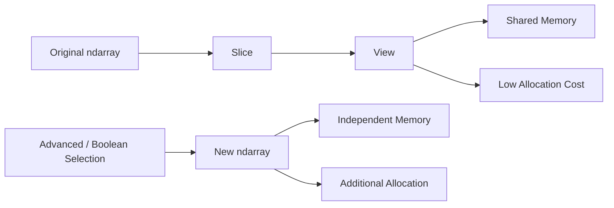
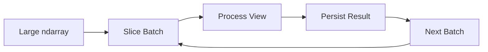
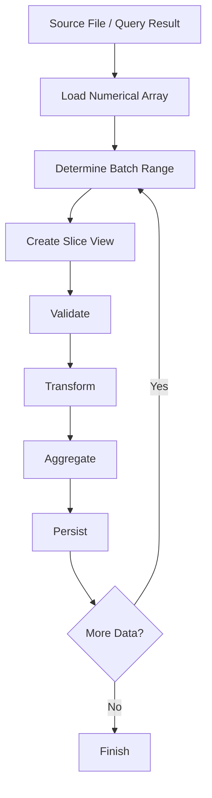

# 07- Slicing

## Overview

Slicing is one of NumPy's most important mechanisms for selecting contiguous or strided regions of an `ndarray`. It is based on Python's `start:stop:step` syntax, but its significance in NumPy goes beyond convenience: basic slicing can usually produce a **view** over existing memory instead of allocating a new array.

For backend and data engineering workloads, this makes slicing particularly useful for:

- Processing bounded batches.
- Selecting rows or columns.
- Creating windows over numerical data.
- Splitting datasets without copying them.
- Preparing data for vectorized operations.
- Reducing memory allocation.
- Implementing chunked processing.

The key production concern is that slicing often shares the original array's memory.



A strong understanding of slicing therefore requires understanding both:

```text
Selection semantics
+
Memory semantics
=
Correct NumPy code
```

## Slice Syntax

The general syntax is:

```python
array[start:stop:step]
```

where:

| Component | Meaning |
|---|---|
| `start` | First position to include |
| `stop` | First position to exclude |
| `step` | Distance between selected positions |

All components are optional.

Examples:

```python
values[:5]
values[5:]
values[:]
values[::2]
values[1:8:2]
values[::-1]
```

The `stop` boundary is exclusive, following Python's standard slicing semantics.

## Basic One-Dimensional Slicing

Consider:

```python
import numpy as np

values = np.array(
    [10, 20, 30, 40, 50, 60],
)
```

Select the first three values:

```python
first_three = values[:3]
```

Result:

```text
[10 20 30]
```

Select everything from index 3 onward:

```python
remaining = values[3:]
```

Result:

```text
[40 50 60]
```

Select a range:

```python
subset = values[1:5]
```

Result:

```text
[20 30 40 50]
```

The indexes selected are:

```text
1, 2, 3, 4
```

not index 5.

## Why Slicing Exists

Slicing provides a compact way to describe a region of an array without explicitly enumerating each selected index.

For contiguous data:

```python
values[10_000:20_000]
```

is preferable to constructing an explicit index array:

```python
values[np.arange(10_000, 20_000)]
```

The slice can generally be represented through metadata and shared storage, while advanced indexing normally creates a new array.

This difference becomes significant for large datasets.

## Slicing as a View

Basic NumPy slicing generally produces a view.

```python
values = np.array(
    [10, 20, 30, 40, 50],
)

subset = values[1:4]

subset[0] = 999

print(values)
```

Result:

```text
[ 10 999  30  40  50]
```

The modification is visible in the source because the slice references the same underlying data.

Conceptually:

```text
values
┌────┬────┬────┬────┬────┐
│ 10 │ 20 │ 30 │ 40 │ 50 │
└────┴────┴────┴────┴────┘
      ▲──────────────▲
      │     view     │
      └──────────────┘
```

This avoids copying the selected data.

## When a Slice View Is Useful

Views are particularly useful when:

- A large dataset must be processed in chunks.
- The selected region is temporary.
- The processing function does not mutate the input.
- Memory pressure matters.
- The selected region should reflect changes in the source.

Example:

```python
batch = values[start:stop]
process(batch)
```

If `process()` only reads from `batch`, this can be an efficient way to operate on a region of a large array.

## When a Copy Is Safer

If the selected data needs independent ownership:

```python
batch = values[start:stop].copy()
```

This is useful when:

- The original array will be modified.
- The selected region will outlive the original dataset.
- The selected subset is stored independently.
- Mutation must be isolated.
- A downstream library requires owned or contiguous data.

The trade-off is additional memory and allocation cost.

## Slice vs Copy

| Pattern | Typical Behavior | Memory Cost | Mutation Relationship |
|---|---|---:|---|
| `values[10:100]` | View | Low | Shared |
| `values[10:100].copy()` | Copy | Higher | Independent |
| `values[[10, 20, 30]]` | Advanced indexing | Higher | Independent |
| `values[mask]` | Boolean indexing | Higher | Independent |

For large arrays, this distinction should be part of the design rather than an accidental implementation detail.

## Start, Stop, and Step

Consider:

```python
values = np.arange(10)
```

which produces:

```text
[0 1 2 3 4 5 6 7 8 9]
```

Now:

```python
values[2:8:2]
```

selects:

```text
[2 4 6]
```

The logic is:

```text
start = 2
stop  = 8
step  = 2

indexes:
2 → 4 → 6
```

Index 8 is excluded.

## Omitting Slice Components

Python allows any slice component to be omitted.

### Omit Start

```python
values[:5]
```

means:

```text
start = beginning
stop = 5
```

### Omit Stop

```python
values[5:]
```

means:

```text
start = 5
stop = end
```

### Omit Both

```python
values[:]
```

selects the entire array.

For NumPy, however, remember that:

```python
values[:]
```

does not mean "make an independent copy."

It commonly creates a view over the same data.

To make a copy:

```python
values.copy()
```

## Negative Slicing

Negative indexes refer to positions from the end.

```python
values[-3:]
```

selects the last three values.

For:

```python
values = np.arange(10)
```

the result is:

```text
[7 8 9]
```

Similarly:

```python
values[:-3]
```

selects everything except the final three values.

Negative slicing is useful for boundary-oriented operations, such as:

- Dropping trailing records.
- Selecting the latest measurements.
- Reading recent batch entries.
- Excluding footer-like regions.

## Reversing with Slicing

A negative step reverses the traversal direction:

```python
reversed_values = values[::-1]
```

Result:

```text
[9 8 7 6 5 4 3 2 1 0]
```

This is typically represented without copying the data.

However, a reversed view has a different stride pattern, and some downstream operations may not work as efficiently on it as they would on a contiguous array.

## Strided Slicing

A step greater than one selects every nth element:

```python
values[::2]
```

selects every second element.

```python
values[::5]
```

selects every fifth element.

This is useful for:

- Downsampling.
- Periodic sampling.
- Selecting fixed intervals.
- Processing every kth record.

But strided views can result in non-contiguous memory access.

A slice being a view does not automatically mean downstream computation will be optimal.

## Multidimensional Slicing

Slicing extends naturally across multiple axes.

```python
matrix = np.array(
    [
        [10, 20, 30, 40],
        [50, 60, 70, 80],
        [90, 100, 110, 120],
    ],
)
```

Select the first two rows:

```python
rows = matrix[:2]
```

Select the last two columns:

```python
columns = matrix[:, -2:]
```

Select a rectangular region:

```python
subset = matrix[1:3, 1:3]
```

Result:

```text
[[ 60  70]
 [100 110]]
```

The structure follows:

```text
matrix[row_slice, column_slice]
```

## Slicing Along Specific Axes

For arrays with more dimensions, specify the slice for each axis.

Example:

```python
values = np.zeros(
    (100, 24, 8),
    dtype=np.float32,
)
```

Suppose the dimensions represent:

```text
axis 0 → batch
axis 1 → hour
axis 2 → metric
```

Select the first 10 batches:

```python
batch = values[:10, :, :]
```

Select all batches and the first six hours:

```python
morning = values[:, :6, :]
```

Select metric 3:

```python
metric = values[:, :, 3]
```

The semantic meaning of each axis should be documented or encoded through clear variable names.

## Ellipsis with Slicing

The ellipsis (`...`) represents all unspecified axes.

For:

```python
values = np.zeros(
    (100, 24, 8),
)
```

you can select the last metric:

```python
metric = values[..., 3]
```

This is equivalent to:

```python
metric = values[:, :, 3]
```

For higher-dimensional arrays, ellipsis can make reusable functions easier to write because the number of leading dimensions does not have to be hard-coded.

Example:

```python
latest_metric = values[..., -1]
```

Use it when the intent is genuinely "all preceding dimensions."

## Adding Dimensions During Slicing

`None` can add a new axis:

```python
values = np.array([10, 20, 30])

column = values[:, None]
```

Shape:

```text
(3, 1)
```

This is useful for broadcasting.

For example:

```python
values = np.array([10, 20, 30])
rates = np.array([0.1, 0.2, 0.3, 0.4])

result = values[:, None] * rates
```

The shapes are:

```text
values[:, None] → (3, 1)
rates           → (4,)
```

and the result shape is:

```text
(3, 4)
```

This is an example where slicing is used not simply to select data, but to control array shape.

## Preserving Dimensions with Slices

Compare:

```python
matrix[:, 2]
```

with:

```python
matrix[:, 2:3]
```

The first selects a single column and removes that dimension.

The second selects a one-column range and preserves the dimension.

```python
matrix = np.zeros((100, 10))

print(matrix[:, 2].shape)
print(matrix[:, 2:3].shape)
```

Output:

```text
(100,)
(100, 1)
```

This matters when the downstream function expects two-dimensional input.

## Slicing for Batch Processing

Slicing is particularly useful for processing large arrays in bounded batches.

```python
import numpy as np


def process_in_batches(
    values: np.ndarray,
    batch_size: int,
) -> None:
    for start in range(0, values.size, batch_size):
        stop = min(start + batch_size, values.size)
        batch = values[start:stop]

        process_batch(batch)


def process_batch(batch: np.ndarray) -> None:
    # Numerical processing occurs here.
    print(batch.shape)
```

The important property is:

```python
batch = values[start:stop]
```

This can create a view rather than copying the entire batch.

The processing pipeline becomes:



This is a practical pattern for memory-bounded numerical processing.

## Batch Size and Memory

Suppose:

```text
Input:
100,000,000 float32 values
```

The complete array is roughly:

```text
400 MB
```

A batch of:

```text
1,000,000 float32 values
```

is roughly:

```text
4 MB
```

Slicing lets the processing layer operate on small regions.

However, batch slicing alone does not guarantee low process memory. If the processing function creates multiple output arrays, those allocations still contribute to peak memory.

The correct memory model is:

```text
Input array
+
Batch intermediates
+
Output buffers
+
Runtime memory
=
Process RSS
```

## Slicing and Memory Retention

A small slice can retain a large backing array.

```python
large = np.zeros(
    100_000_000,
    dtype=np.float64,
)

small = large[:10]
```

`small` contains only 10 values logically, but it can keep the large underlying buffer alive.

This matters when:

- `small` is placed in a long-lived cache.
- A worker stores `small` after processing.
- The original large variable is released.
- The application handles many such subsets.

If the small subset must outlive the large array:

```python
small = large[:10].copy()
```

The copy costs a tiny amount of memory but allows the large backing buffer to be released.

## Negative Strides

Reversing an array:

```python
reversed_values = values[::-1]
```

typically produces a view with a negative stride.

You can inspect it:

```python
print(reversed_values.strides)
```

This is a good example of why stride metadata matters.

A view can share memory while having a traversal pattern that differs substantially from the original array.

Some operations may therefore be more efficient after creating a contiguous copy:

```python
contiguous = np.ascontiguousarray(reversed_values)
```

Only do this when required by the workload. Copying a large array solely because it is non-contiguous can waste memory.

## Slicing and Contiguity

A contiguous slice:

```python
subset = values[100:10_000]
```

may remain contiguous depending on the original layout and dimensionality.

A strided slice:

```python
subset = values[::2]
```

is generally not contiguous.

Check:

```python
print(subset.flags.c_contiguous)
```

Contiguity matters when:

- Passing arrays to native extensions.
- Interoperating with systems expecting contiguous buffers.
- Running performance-sensitive numerical operations.
- Avoiding implicit copies.

## Slicing vs Advanced Indexing

Consider these two expressions:

```python
slice_view = values[10:100]
```

and:

```python
index_copy = values[np.arange(10, 100)]
```

They select the same logical range but typically have different memory behavior.

```text
Slicing
values[10:100]
    ↓
View
    ↓
Shared memory

Advanced indexing
values[index_array]
    ↓
Copy
    ↓
Independent memory
```

For large contiguous ranges, slicing is usually the better representation.

## Slice Assignment

Slicing can also be used to update multiple elements at once.

```python
values = np.zeros(10)

values[2:6] = 5

print(values)
```

Result:

```text
[0. 0. 5. 5. 5. 5. 0. 0. 0. 0.]
```

This is a vectorized operation over the selected region.

Slice assignment is useful for:

- Initializing ranges.
- Applying batch updates.
- Resetting buffers.
- Modifying windows.

Because the target may be a view into a larger array, mutation is intentional and should be treated accordingly.

## Slice Assignment with Broadcasting

A scalar can be assigned across a slice:

```python
values[10:20] = 0
```

A compatible array can also be assigned:

```python
values[10:15] = np.array(
    [1, 2, 3, 4, 5],
)
```

Broadcasting rules determine whether the right-hand side can fill the selected region.

An incompatible shape raises an error rather than silently producing an incorrect result.

## Sliding Windows with Slicing

Simple fixed-offset windows can be expressed with slices:

```python
values = np.arange(100)

first_window = values[0:20]
second_window = values[20:40]
```

This is useful for chunk-based processing.

For overlapping rolling windows, plain slicing in a Python loop may still be too expensive or cumbersome for very large datasets. More specialized array-view techniques may be appropriate, but they should be introduced only when a real workload requires them.

The important engineering point is to distinguish:

```text
Non-overlapping batch slicing
```

from:

```text
Overlapping rolling-window computation
```

because their memory and computational characteristics differ.

## Slicing in ETL Pipelines

A numerical ETL pipeline may use slicing to process bounded chunks:



This pattern is useful when the complete dataset must remain available but processing should occur in bounded units.

For very large source data, combine slicing with streaming or memory mapping rather than first loading the entire dataset into RAM.

## Slicing and File-Backed Arrays

Memory-mapped arrays support the same slicing model:

```python
import numpy as np

values = np.memmap(
    "measurements.dat",
    dtype=np.float32,
    mode="r",
    shape=(50_000_000,),
)

batch = values[10_000_000:11_000_000]
```

The slice provides an array view over a region of file-backed data.

This can be useful when:

- The source file is larger than RAM.
- Processing occurs in bounded regions.
- Access is reasonably sequential.

The storage system still determines actual I/O performance.

Memory mapping should not be mistaken for zero-cost access.

## Slicing with Pandas and Backend Pipelines

When data is processed through Pandas and NumPy, slicing can be used after selecting a numerical representation:

```python
import numpy as np
import pandas as pd

df = pd.DataFrame(
    {
        "amount": np.arange(1_000_000, dtype=np.float32),
    }
)

values = df["amount"].to_numpy()

batch = values[:100_000]
```

This creates a clear numerical processing boundary.

For production pipelines, avoid unnecessary conversions:

```text
Database
   ↓
Pandas
   ↓
NumPy
   ↓
Repeated back-and-forth conversion
```

Instead, define where tabular processing ends and numerical processing begins.

## Common Slicing Mistakes

### Assuming `[:]` Creates a Copy

This:

```python
copy = values[:]
```

usually creates a view.

For an independent array:

```python
copy = values.copy()
```

### Keeping a Small View of a Huge Array

A tiny view can retain the complete backing buffer.

Use `.copy()` when the subset needs an independent lifetime.

### Assuming Views Are Always Faster

A view avoids copying but may introduce non-contiguous or strided access.

The absence of allocation does not guarantee faster computation.

### Using Advanced Indexing for Contiguous Ranges

Avoid:

```python
values[np.arange(1000, 2000)]
```

when:

```python
values[1000:2000]
```

expresses the same selection.

The latter can usually avoid copying.

### Ignoring Dimension Changes

These differ:

```python
matrix[:, 3]
matrix[:, 3:4]
```

One produces a one-dimensional result, while the other preserves the column dimension.

### Forgetting That Slice Assignment Mutates the Source

```python
subset = values[10:20]
subset[:] = 0
```

can modify `values`.

### Using Huge Strided Slices Without Considering Access Cost

```python
values[::1000]
```

may be memory-efficient as a view but can lead to poor locality depending on subsequent processing.

## Slicing and Security

Slicing itself is not generally a security boundary, but externally supplied ranges can still create resource-management problems.

For example, a client-controlled batch range should not allow unlimited work:

```python
MAX_BATCH_SIZE = 1_000_000

start = requested_start
stop = requested_stop

if start < 0 or stop < start:
    raise ValueError("Invalid range")

if stop - start > MAX_BATCH_SIZE:
    raise ValueError("Batch too large")

batch = values[start:stop]
```

This is especially important when the selected region triggers expensive downstream processing.

For APIs and worker systems, combine slice validation with:

- Request-size limits.
- Maximum element counts.
- Timeouts.
- Queue limits.
- Worker concurrency limits.

## Testing Slicing Behavior

Test both selected values and resulting shape.

```python
import numpy as np


def test_slice_selection() -> None:
    values = np.array([10, 20, 30, 40, 50])

    result = values[1:4]

    np.testing.assert_array_equal(
        result,
        np.array([20, 30, 40]),
    )

    assert result.shape == (3,)
```

For view behavior:

```python
def test_slice_shares_memory() -> None:
    values = np.array([10, 20, 30, 40])

    result = values[1:3]

    result[0] = 999

    assert values[1] == 999
```

For production code, only test shared-memory behavior when it is intentionally part of the design.

## Performance Benchmarking

When comparing slicing with copying:

```python
import time
import numpy as np


def benchmark() -> None:
    values = np.arange(
        10_000_000,
        dtype=np.float64,
    )

    start = time.perf_counter()
    view = values[1_000_000:5_000_000]
    view_elapsed = time.perf_counter() - start

    start = time.perf_counter()
    copied = values[1_000_000:5_000_000].copy()
    copy_elapsed = time.perf_counter() - start

    print(f"slice: {view_elapsed:.6f}s")
    print(f"copy:  {copy_elapsed:.6f}s")
    print(f"copy size: {copied.nbytes} bytes")
```

This demonstrates the allocation difference, but a proper benchmark should repeat measurements and include the actual downstream processing.

For production optimization, benchmark:

- Selection time.
- Subsequent computation.
- Peak memory.
- Access pattern.
- Batch size.
- End-to-end throughput.

## Operational Considerations

For large slicing-heavy workloads, observe:

| Metric | Why It Matters |
|---|---|
| Batch size | Determines processing volume |
| Number of batches | Indicates iteration overhead |
| Process RSS | Detects unexpected copies |
| CPU time | Detects expensive access patterns |
| Throughput | Measures total processing capacity |
| Filter ratio | Indicates result-size changes |
| Error rate | Detects invalid ranges or shapes |

For Celery or Kubernetes workers, memory limits should account for temporary arrays created after slicing.

A process can be stable with a 500 MB source array but exceed its limit when several 500 MB copies are created downstream.

## Practical Design Guidelines

For production NumPy code:

1. Prefer slices for contiguous regions.
2. Use views when shared ownership is safe.
3. Use `.copy()` when independent lifetime or mutation isolation is required.
4. Check shape after slicing when dimensionality matters.
5. Avoid unnecessary advanced indexing.
6. Consider contiguity for performance-sensitive consumers.
7. Bound externally supplied ranges.
8. Process large datasets in predictable batches.
9. Measure peak memory rather than relying only on individual array sizes.
10. Optimize after benchmarking representative workloads.

## Interview-Relevant Questions

### What is NumPy slicing?

Slicing selects a range or strided region using `start:stop:step` syntax.

### Does slicing copy an array?

Basic slicing generally creates a view rather than copying the data.

### Why are views useful?

They avoid duplicating large data buffers and can make batch processing memory-efficient.

### What is the main risk of views?

They share memory with the source array, so mutations can affect the original data. A long-lived view can also retain a large backing array.

### What is the difference between `values[:]` and `values.copy()`?

`values[:]` typically creates a view, while `values.copy()` creates independent storage.

### Why is `values[100:200]` generally preferable to `values[np.arange(100, 200)]`?

The slice can generally be represented as a view, while advanced indexing normally creates a new array.

### How does `step` affect memory access?

A non-unit step creates a strided view. It can avoid allocation but may produce less favorable memory-access patterns.

### Why would `matrix[:, 2:3]` be preferable to `matrix[:, 2]`?

The former preserves the second dimension, producing shape `(n, 1)` instead of `(n,)`.

### Can slicing be used for large batch processing?

Yes. Bounded slices can expose portions of a large array without copying them, making them useful for batch-oriented numerical processing.

### Why can a small slice keep a large dataset in memory?

Because the slice can share the original array's backing buffer. As long as the view remains alive, the underlying storage may remain reachable.

## Key Takeaways

- NumPy slicing uses `start:stop:step` and is one of the most memory-efficient ways to select contiguous regions of an array.
- Basic slicing generally creates views, so selected data can share memory with the source; use `.copy()` when independent ownership is required.
- Shape preservation matters: integer indexing can remove dimensions, while slice-based selection such as `2:3` can preserve them.
- Slicing is highly useful for bounded batch processing, but non-contiguous or strided views can still affect downstream performance and memory access patterns.
- Production slicing code should control batch sizes, avoid unnecessary copies, validate external ranges, and consider both memory sharing and downstream access performance.