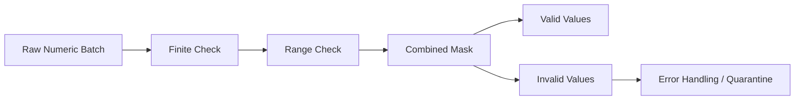

# 08- Boolean Indexing

## Overview

Boolean indexing is NumPy's array-based filtering mechanism. It uses a boolean array, commonly called a mask, to select or update elements that satisfy a condition.

For backend and data engineering workloads, boolean indexing is particularly useful for:

- Filtering invalid or out-of-range measurements.
- Selecting records that satisfy business rules.
- Separating valid and invalid batches.
- Applying conditional updates.
- Building vectorized validation pipelines.
- Removing `NaN` and infinite values.
- Implementing batch-oriented data transformations without Python-level loops.

The basic model is:

```text
ndarray
   ↓
Condition
   ↓
Boolean mask
   ↓
Selection / Update
```

For example:

```python
import numpy as np

values = np.array([10, 25, 40, 55, 70])

mask = values >= 50
selected = values[mask]
```

The mask is:

```text
[False, False, False, True, True]
```

and the selected result is:

```text
[55, 70]
```

The most important production consideration is that boolean indexing is usually **selection into a new array**, not a zero-copy view. For large datasets, both the mask and selected result can materially affect peak memory usage.

## Why Boolean Indexing Exists

A numerical processing pipeline often needs to answer questions such as:

```text
Which values are above the threshold?
Which rows contain valid measurements?
Which transactions have a non-negative amount?
Which records fall into a time or numeric range?
```

A Python implementation might use a loop:

```python
result = []

for value in values:
    if value >= 50:
        result.append(value)
```

NumPy expresses the same operation at the array level:

```python
result = values[values >= 50]
```

The NumPy form is useful because:

- The condition is evaluated across the array.
- The filtering operation is handled by NumPy.
- The code expresses the batch operation directly.
- It integrates naturally with vectorized transformations.

The performance advantage is not that NumPy makes every filter inherently faster. It comes from reducing Python-level per-element processing and operating on dense array data.

## Boolean Masks

A boolean mask is an array of boolean values corresponding to a selection condition.

```python
values = np.array([10, 25, 40, 55, 70])

mask = values >= 50

print(mask)
```

Result:

```text
[False False False  True  True]
```

A mask normally has the same shape as the object being indexed.

```python
print(values.shape)
print(mask.shape)
```

Both are:

```text
(5,)
```

This one-to-one relationship allows NumPy to decide which elements to retain.

## Basic Boolean Indexing

The simplest form is:

```python
selected = values[mask]
```

or directly:

```python
selected = values[values >= 50]
```

The two forms are equivalent.

Use a named mask when the condition is meaningful or reused:

```python
valid_amounts = values >= 50

selected = values[valid_amounts]
```

A named mask can improve readability and debugging in production processing code.

## Boolean Indexing and Shapes

For a one-dimensional array:

```python
values = np.array([10, 20, 30, 40])

mask = values > 20

selected = values[mask]

print(selected.shape)
```

The result has:

```text
(2,)
```

Unlike slicing, boolean filtering is not constrained to a fixed-length contiguous region. The output size depends on how many elements satisfy the condition.

This dynamic output size is useful for filtering but important for memory planning.

## Boolean Indexing for Range Validation

A common pattern is inclusive range validation:

```python
values = np.array(
    [10, 25, 50, 75, 120],
)

valid = (
    (values >= 0)
    & (values <= 100)
)

filtered = values[valid]
```

The result is:

```text
[10 25 50 75]
```

The condition expresses the domain rule directly.

For production systems, keep the acceptable range close to the domain specification rather than burying unexplained numeric thresholds inside array expressions.

## Combining Conditions

NumPy uses element-wise logical operators.

| Operator | Meaning |
|---|---|
| `&` | Element-wise AND |
| `\|` | Element-wise OR |
| `~` | Element-wise NOT |

Example:

```python
valid = (
    (values >= 0)
    & (values <= 100)
)
```

For an OR condition:

```python
selected = values[
    (values < 10)
    | (values > 90)
]
```

For NOT:

```python
invalid = values[~valid]
```

### Do Not Use `and` and `or`

This is incorrect:

```python
valid = (values >= 0) and (values <= 100)
```

Python's `and` and `or` expect scalar truth values and do not provide element-wise array semantics.

Use:

```python
valid = (values >= 0) & (values <= 100)
```

## Parentheses Matter

Conditions should be explicitly parenthesized:

```python
valid = (
    (values >= 0)
    & (values <= 100)
)
```

This avoids precedence-related errors and makes the expression easier to review.

Do not rely on subtle Python operator precedence when writing production numerical conditions.

## Boolean Indexing for Non-Finite Values

NumPy provides `isfinite()` to identify values that are neither `NaN` nor infinite.

```python
values = np.array(
    [10.0, np.nan, 20.0, np.inf, 30.0],
)

finite = np.isfinite(values)

clean = values[finite]
```

Result:

```text
[10. 20. 30.]
```

This is preferable to manually checking:

```python
values != np.nan
```

because `NaN` does not compare equal to itself.

For production numerical pipelines, non-finite values should have explicit domain semantics rather than being silently discarded.

## NaN-Specific Filtering

You can detect `NaN` values with:

```python
mask = np.isnan(values)
```

For valid non-NaN values:

```python
clean = values[~np.isnan(values)]
```

However, this does not remove infinity:

```python
np.isnan(np.inf)
```

returns `False`.

When the requirement is "finite numeric data," use:

```python
np.isfinite(values)
```

instead.

## Infinity Filtering

Positive and negative infinity can be detected with:

```python
positive_infinity = np.isposinf(values)
negative_infinity = np.isneginf(values)
```

More commonly, a pipeline simply filters all non-finite values:

```python
finite = values[np.isfinite(values)]
```

The appropriate behavior depends on whether infinity represents:

- Invalid input.
- Overflow.
- A valid sentinel.
- A mathematical result that must be handled separately.

Do not remove values merely because they are inconvenient for downstream operations.

## Boolean Indexing on Two-Dimensional Arrays

Boolean indexing becomes especially useful with row-oriented numerical datasets.

```python
records = np.array(
    [
        [101, 10.5],
        [102, 35.0],
        [103, 75.0],
    ],
    dtype=np.float64,
)
```

Select rows where the second column is at least 30:

```python
mask = records[:, 1] >= 30

selected = records[mask]
```

Result:

```text
[[102.  35.]
 [103.  75.]]
```

The processing pattern is:

```text
2D ndarray
    ↓
Extract relevant column
    ↓
Build boolean mask
    ↓
Select rows
```

This pattern is common in batch ETL and numerical validation.

## Row-Level Validation

For a batch with several conditions:

```python
records = np.array(
    [
        [101, 10.5],
        [102, -5.0],
        [103, 75.0],
        [104, np.nan],
    ],
    dtype=np.float64,
)

amounts = records[:, 1]

valid = (
    np.isfinite(amounts)
    & (amounts >= 0)
)

valid_records = records[valid]
invalid_records = records[~valid]
```

This separates valid and invalid records in a vectorized manner.

A production pipeline may then:

```text
Valid Records
    ↓
Transformation
    ↓
Aggregation
    ↓
Persistence

Invalid Records
    ↓
Reason / Error Classification
    ↓
Dead-Letter Storage / Reporting
```

The actual error-handling policy should be explicit rather than silently dropping invalid data.

## Building Multiple Validation Masks

For complex validation, separate conditions can improve observability.

```python
amounts = records[:, 1]

finite_mask = np.isfinite(amounts)
non_negative_mask = amounts >= 0
upper_bound_mask = amounts <= 100_000

valid = (
    finite_mask
    & non_negative_mask
    & upper_bound_mask
)
```

This makes it possible to measure which validation rule is causing failures:

```python
invalid_finite = ~finite_mask
invalid_negative = ~non_negative_mask
invalid_upper_bound = ~upper_bound_mask
```

This is useful in data-quality pipelines because the system can distinguish:

```text
Missing / non-finite
Negative
Out-of-range
```

instead of reporting only "invalid."

## Boolean Indexing for Business Rules

Suppose a batch represents transaction data:

```text
transaction_id
amount
risk_score
```

You might select high-risk transactions:

```python
high_risk = (
    (records[:, 2] >= 0.8)
    & (records[:, 1] >= 10_000)
)

selected = records[high_risk]
```

This approach is useful for analytical and batch processing.

However, do not move arbitrary business logic into complex array expressions simply because NumPy can express it. If the business rule requires extensive branching, state transitions, or domain-specific behavior, clearer Python application logic may be more appropriate.

NumPy is best when the rule is naturally array-oriented.

## Boolean Assignment

Boolean masks can also be used to update values in place.

```python
values = np.array(
    [10.0, 20.0, 30.0, 40.0],
)

values[values > 25] *= 1.10
```

Result:

```text
[10. 20. 33. 44.]
```

The assignment targets only elements matching the condition.

This can avoid allocating a separate output array when in-place mutation is acceptable.

## In-Place Mutation Considerations

Boolean assignment is memory-efficient, but it mutates the target array.

If the array is shared:

```python
subset = values[::2]
```

then the consequences of mutation depend on whether the selected object shares memory with the source.

For shared data, mutation can introduce subtle coupling between pipeline stages.

Use in-place updates when:

- Ownership is clear.
- Mutation is intentional.
- Peak memory matters.
- The transformation does not need to preserve the original.

Use a new result array when immutability or isolation is more important.

## Boolean Selection Produces a Copy

Consider:

```python
values = np.array(
    [10, 20, 30, 40],
)

selected = values[values >= 20]

selected[0] = 999

print(values)
```

The original remains:

```text
[10 20 30 40]
```

This differs from ordinary slicing.

The distinction is important:

```text
Slicing
→ usually view
→ shared memory

Boolean indexing
→ selection result
→ usually new array
→ independent data
```

For large datasets, this copy behavior directly affects memory consumption.

## Memory Cost of Boolean Masks

Suppose:

```python
values = np.zeros(
    100_000_000,
    dtype=np.float32,
)
```

The values occupy roughly:

```text
400 MB
```

A boolean mask over the entire array can require roughly:

```text
100 MB
```

Then:

```python
selected = values[mask]
```

allocates the selected result.

If most values pass the condition, the selected array can approach the size of the input.

The memory profile can therefore be:

```text
Input              ~400 MB
Mask               ~100 MB
Selected result    up to ~400 MB
Other temporaries  ...
```

This is why boolean filtering can become a major memory cost in large numerical pipelines.

## Boolean Indexing vs Slicing

For contiguous ranges:

```python
values[1000:2000]
```

is usually more memory-efficient than constructing a mask for the same region.

For condition-based filtering:

```python
values[values > threshold]
```

boolean indexing is the natural approach.

| Requirement | Better Choice |
|---|---|
| Fixed contiguous region | Slicing |
| Every kth element | Strided slicing |
| Condition-based filter | Boolean indexing |
| Specific arbitrary indexes | Advanced indexing |
| Conditional replacement | Boolean assignment / `where` |

The correct mechanism depends on the selection semantics.

## Boolean Indexing vs np.where()

Boolean indexing answers:

> Which elements should be selected?

```python
selected = values[values >= 50]
```

`np.where()` is useful when the goal is:

> What value should each position contain?

```python
result = np.where(
    values >= 50,
    values * 1.10,
    values,
)
```

Comparison:

| Goal | Recommended |
|---|---|
| Filter records | Boolean indexing |
| Select valid values | Boolean indexing |
| Update selected values in place | Boolean assignment |
| Produce conditional output | `np.where()` |

Using the right abstraction improves readability and reduces unnecessary copies.

## Boolean Indexing vs `compress()`

NumPy also provides `np.compress()`:

```python
selected = np.compress(
    mask,
    values,
)
```

For most application code, direct boolean indexing is clearer:

```python
selected = values[mask]
```

`compress()` can be useful in specialized code, but it is not necessary to introduce another API when boolean indexing communicates the operation directly.

## Masks and Broadcasting

Boolean conditions can participate in broadcasting when dimensions are compatible.

For example:

```python
values = np.array(
    [
        [10, 20, 30],
        [40, 50, 60],
    ],
)

thresholds = np.array(
    [15, 45, 25],
)

mask = values >= thresholds
```

The shapes are:

```text
values     → (2, 3)
thresholds → (3,)
mask       → (2, 3)
```

This creates a different threshold for each column.

Such patterns are useful for vectorized validation across structured numeric batches.

## Broadcasting a Mask Across Dimensions

Suppose:

```python
values = np.zeros(
    (100, 24, 8),
)
```

and you have a per-metric validity mask:

```python
metric_mask = np.array(
    [True, True, False, True, False, True, True, True],
)
```

The mask has shape:

```text
(8,)
```

It can be broadcast against the final axis:

```python
selected = values[..., metric_mask]
```

The exact output shape depends on the indexing operation and selected dimensions, but the key design principle is that masks can be aligned with the data's semantic axes.

This becomes powerful in multidimensional processing, but shape should always be inspected after complex indexing.

## Boolean Masks for Data Quality

Boolean masks are particularly effective for data-quality pipelines.

Example:

```python
values = np.array(
    [10.5, 20.0, np.nan, 150.0, 30.0],
)

valid = (
    np.isfinite(values)
    & (values >= 0)
    & (values <= 100)
)

valid_values = values[valid]
invalid_values = values[~valid]
```

The pipeline becomes:



This is a practical pattern for ingestion and ETL systems.

## Avoiding Silent Data Loss

Filtering invalid records can be dangerous if the system simply discards them:

```python
clean = values[valid]
```

That produces a technically clean dataset but may hide upstream data-quality problems.

Production pipelines often need:

```text
Valid
Invalid
Reason
Source
Timestamp
Batch ID
```

For example, instead of silently dropping invalid values:

```python
invalid = values[~valid]
```

the application can count and report them.

A senior engineering approach treats filtering as part of a data-quality strategy, not merely a numerical operation.

## Counting Mask Results

A boolean mask can be aggregated directly:

```python
valid_count = int(valid.sum())
invalid_count = int((~valid).sum())
```

Because `True` behaves numerically like one and `False` like zero in NumPy's aggregation context, this provides a simple way to count records.

For example:

```python
total = valid.size

print(valid_count)
print(invalid_count)
print(total)
```

You can also compute the validity ratio:

```python
valid_ratio = valid.mean()
```

This can be useful as a quality metric.

## Data Quality Monitoring

A production ETL service can expose metrics such as:

```text
records_processed
records_valid
records_invalid
invalid_ratio
```

For example:

```python
metrics = {
    "processed": int(values.size),
    "valid": int(valid.sum()),
    "invalid": int((~valid).sum()),
    "valid_ratio": float(valid.mean()),
}
```

These metrics can feed application monitoring systems.

A sudden increase in invalid records may indicate:

- Upstream schema changes.
- Bad source data.
- Broken transformations.
- API contract changes.
- Deployment regressions.

## Large-Scale Boolean Filtering

For large arrays, memory is often the limiting factor.

Instead of:

```python
mask = complex_condition(values)
selected = values[mask]
```

you may need to process data in batches:

```python
def filter_in_batches(
    values: np.ndarray,
    batch_size: int,
) -> list[np.ndarray]:
    results: list[np.ndarray] = []

    for start in range(0, values.size, batch_size):
        batch = values[
            start : start + batch_size
        ]

        mask = np.isfinite(batch) & (batch >= 0)

        results.append(batch[mask])

    return results
```

This controls the temporary mask size and selected result size per batch.

The example returns a list of arrays for simplicity. A production system processing very large datasets should usually persist or consume each batch incrementally rather than accumulating all results in memory again.

## Streaming Considerations

If the source is a large file, Kafka stream, or database query, loading everything into memory before boolean filtering defeats the purpose of bounded processing.

Prefer an architecture such as:

```text
Source
  ↓
Read bounded batch
  ↓
Create mask
  ↓
Process valid records
  ↓
Persist / emit
  ↓
Read next batch
```

For Kafka, the batch boundary may correspond to consumer records.

For files, it may correspond to chunks.

For PostgreSQL, it may correspond to server-side cursors or bounded queries.

The numerical filtering logic remains NumPy-based while the ingestion strategy controls memory.

## Boolean Indexing in a Celery Worker

For CPU-oriented batch processing:

```text
API / Scheduler
      ↓
Celery Task
      ↓
Load bounded numerical batch
      ↓
NumPy mask
      ↓
Vectorized transformation
      ↓
Persist results
```

This keeps heavy processing out of the synchronous API path when jobs can become large.

Worker concurrency must be sized with memory in mind.

For example:

```text
Worker memory
    ↓
4 concurrent tasks
    ↓
each task creates large masks + results
    ↓
peak RSS can multiply
```

A boolean operation that is safe for one worker can cause OOM conditions when many workers process large batches concurrently.

## Boolean Indexing and APIs

A FastAPI endpoint might validate a bounded batch:

```python
from fastapi import FastAPI
import numpy as np

app = FastAPI()

MAX_VALUES = 1_000_000


@app.post("/metrics/validate")
def validate(values: list[float]) -> dict[str, int | float]:
    if len(values) > MAX_VALUES:
        raise ValueError("Batch exceeds maximum size")

    data = np.asarray(values, dtype=np.float64)

    finite = np.isfinite(data)

    valid = (
        finite
        & (data >= 0)
        & (data <= 100)
    )

    return {
        "processed": int(data.size),
        "valid": int(valid.sum()),
        "invalid": int((~valid).sum()),
        "valid_ratio": float(valid.mean()),
    }
```

Important production considerations include:

- Enforce request size limits.
- Validate element count.
- Reject unexpected dimensions.
- Define handling for `NaN` and infinity.
- Avoid returning enormous filtered arrays synchronously.
- Move expensive processing to workers when required.

## Index Alignment and Shape Validation

A boolean mask must be compatible with the array being indexed.

For example:

```python
values = np.array([10, 20, 30, 40])
mask = np.array([True, False])

values[mask]
```

does not represent a valid one-to-one boolean selection because the mask length does not match the array.

For predictable processing:

```python
assert mask.shape == values.shape
```

for same-shape masking.

For multidimensional data, ensure the mask matches the intended indexing semantics.

## Common Mistakes

### Using `and` Instead of `&`

Incorrect:

```python
(values > 10) and (values < 100)
```

Correct:

```python
(values > 10) & (values < 100)
```

### Forgetting Parentheses

Incorrect:

```python
values > 10 & values < 100
```

Correct:

```python
(values > 10) & (values < 100)
```

### Assuming Boolean Selection Is a View

Boolean indexing generally creates a new array.

**Why it matters:** filtering a large array can create substantial additional memory usage.

**Avoid it:** account for mask and output allocations.

### Filtering Without Measuring Invalid Data

Silently doing:

```python
values = values[valid]
```

can hide upstream data-quality problems.

**Avoid it:** count, classify, and monitor rejected records when data quality matters.

### Creating Multiple Large Masks Unnecessarily

This:

```python
mask_a = values > 0
mask_b = values < 100
mask_c = np.isfinite(values)

valid = mask_a & mask_b & mask_c
```

can require several temporary boolean arrays.

For modest inputs this is often fine. For very large arrays, measure the peak memory and consider a more memory-conscious design where appropriate.

### Mixing Business Logic into Giant Boolean Expressions

A very large expression may be technically vectorized but difficult to validate or maintain.

**Avoid it:** break complex rules into named conditions with meaningful domain names.

### Ignoring Shape Compatibility

A mask with the wrong shape can fail or produce behavior different from what the developer intended.

**Avoid it:** inspect and validate shapes at processing boundaries.

## Performance Considerations

Boolean indexing has several distinct costs:

```text
Condition evaluation
        +
Mask allocation
        +
Selection
        +
Result allocation
        =
Total filtering cost
```

For example:

```python
mask = values > threshold
selected = values[mask]
```

does more work than simply creating the mask.

If the mask is also reused:

```python
selected = values[mask]
invalid = values[~mask]
```

the same mask can be useful for both branches.

However, both result arrays can consume additional memory.

### CPU vs Memory Trade-Off

A vectorized filter may reduce Python overhead while increasing temporary memory usage.

This is an important distinction:

```text
Better CPU behavior
    ≠
Lower memory usage
```

Production optimization should measure both.

## Avoiding Unnecessary Full-Array Materialization

If a pipeline only needs an aggregate of matching values, it may be possible to reduce intermediate data movement.

For example:

```python
total = values[values >= 50].sum()
```

This is concise but still typically constructs the filtered result.

For very large workloads, the memory implications should be considered.

A batch-oriented design may be more appropriate:

```text
Read batch
  ↓
Build mask
  ↓
Aggregate valid values
  ↓
Discard batch
  ↓
Next batch
```

The correct optimization depends on the workload and should be benchmarked rather than assumed.

## Testing Boolean Indexing

Test the actual values and the mask semantics.

```python
import numpy as np


def test_filters_non_negative_values() -> None:
    values = np.array(
        [-10, 0, 10, 20],
    )

    mask = values >= 0
    selected = values[mask]

    np.testing.assert_array_equal(
        selected,
        np.array([0, 10, 20]),
    )
```

Test non-finite values:

```python
def test_filters_non_finite_values() -> None:
    values = np.array(
        [10.0, np.nan, np.inf, 20.0],
    )

    selected = values[np.isfinite(values)]

    np.testing.assert_array_equal(
        selected,
        np.array([10.0, 20.0]),
    )
```

For production validation logic, also test:

- Empty arrays.
- All-valid inputs.
- All-invalid inputs.
- Boundary values.
- Mixed invalidity reasons.
- Large batches.
- Expected mask shape.

## Testing Conditional Updates

For in-place boolean assignment:

```python
def test_updates_values_above_threshold() -> None:
    values = np.array(
        [10.0, 20.0, 30.0],
    )

    values[values >= 20] *= 2

    np.testing.assert_array_equal(
        values,
        np.array([10.0, 40.0, 60.0]),
    )
```

This verifies mutation behavior explicitly.

## Debugging Boolean Masks

When filtering produces unexpected results, inspect:

```python
print("shape:", values.shape)
print("dtype:", values.dtype)
print("mask shape:", mask.shape)
print("valid count:", int(mask.sum()))
print("invalid count:", int((~mask).sum()))
```

For complex rules, inspect each named condition separately:

```python
print("finite:", int(finite_mask.sum()))
print("non_negative:", int(non_negative_mask.sum()))
print("within_limit:", int(within_limit_mask.sum()))
```

This is substantially easier to debug than one large unnamed expression.

## Interview-Relevant Questions

### What is boolean indexing?

Boolean indexing selects or updates array elements according to a boolean mask.

### Why is boolean indexing useful?

It provides vectorized filtering and conditional updates over arrays without requiring explicit Python-level iteration.

### What is a boolean mask?

A boolean array containing `True` or `False` values indicating which elements satisfy a condition.

### Why do we use `&` instead of `and`?

`&` performs element-wise logical AND on NumPy arrays. Python's `and` operates on scalar truth values and is not appropriate for array-wide element-wise conditions.

### Why are parentheses required around conditions?

They make the intended comparisons and element-wise logical operations explicit and prevent Python operator precedence from producing incorrect expressions.

### Does boolean indexing return a view?

Boolean indexing generally creates a new array containing the selected values rather than returning a view.

### Why can boolean indexing consume substantial memory?

The mask itself is an array, and the selected values are typically copied into a new array. Large filters can therefore require multiple buffers.

### How do you remove `NaN` and infinity?

Use:

```python
values[np.isfinite(values)]
```

### How do you count matching elements?

```python
count = int(mask.sum())
```

### How would you process a very large dataset using boolean filtering?

Process the data in bounded batches, create the mask per batch, handle or persist results incrementally, and avoid accumulating the entire filtered dataset in memory.

### When should `np.where()` be used instead?

Use `np.where()` when you need a value for every position based on a condition. Use boolean indexing when the primary goal is filtering or selecting records.

## Key Takeaways

- Boolean indexing uses masks to perform vectorized filtering and conditional updates, making it a core tool for numerical validation and batch data processing.
- Combine conditions with `&`, `|`, and `~`, and parenthesize each comparison explicitly; do not use Python's `and` or `or` for array conditions.
- Boolean selection generally creates a new array, so large filters can require significant additional memory for both masks and selected results.
- Production pipelines should treat invalid data as observable information: count, classify, and monitor rejected records rather than silently discarding them.
- For large workloads, combine boolean indexing with bounded batches, explicit shape validation, and memory-aware processing to control CPU and memory behavior.