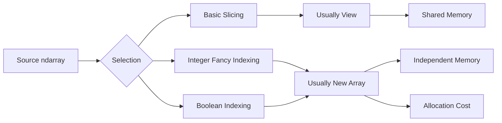

# 09- Fancy Indexing

## Overview

Fancy indexing, also called advanced indexing, allows a NumPy `ndarray` to select elements using integer index arrays or boolean arrays. Unlike basic slicing, fancy indexing is designed for selecting arbitrary positions rather than contiguous ranges.

For backend and data engineering workloads, fancy indexing is useful when the required records are known by position but are not contiguous:

- Selecting specific batch records.
- Reordering rows.
- Selecting arbitrary columns.
- Applying externally computed index positions.
- Joining numerical selection logic with ranking or lookup results.
- Extracting records identified by another numerical process.

Its most important engineering characteristic is memory behavior:

> Fancy indexing generally creates a new array containing the selected values rather than returning a view over the original data.

That makes fancy indexing flexible but potentially more expensive than slicing.



A practical rule is:

```text
Contiguous selection      → slicing
Arbitrary position list   → fancy indexing
Condition-based selection → boolean indexing
```

## What Fancy Indexing Is

Fancy indexing uses arrays or array-like objects containing indexes rather than a single scalar or a contiguous slice.

For example:

```python
import numpy as np

values = np.array(
    [10, 20, 30, 40, 50],
)

selected = values[[0, 2, 4]]

print(selected)
```

Output:

```text
[10 30 50]
```

The index array:

```text
[0, 2, 4]
```

means:

```text
take element 0
take element 2
take element 4
```

The selected positions do not have to be contiguous or ordered.

## Why Fancy Indexing Exists

Basic slicing is ideal for ranges:

```python
values[10:20]
```

But suppose a downstream operation identifies these records:

```text
17
42
103
150
```

There is no single contiguous slice that represents them.

Fancy indexing expresses the requirement directly:

```python
values[[17, 42, 103, 150]]
```

This is useful when index positions come from another computation.

Typical sources include:

- Ranking results.
- Search results.
- Sampling operations.
- Deduplication logic.
- Lookup tables.
- Batch identifiers.
- External index mappings.
- Numerical algorithms.

## Integer Fancy Indexing

The simplest form uses an integer array.

```python
values = np.array(
    [100, 200, 300, 400, 500],
)

indexes = np.array(
    [0, 3, 4],
)

selected = values[indexes]

print(selected)
```

Result:

```text
[100 400 500]
```

The output follows the order of the index array.

This means:

```python
values[[4, 0, 2]]
```

returns:

```text
[500 100 300]
```

Fancy indexing therefore supports both **selection** and **reordering**.

## Fancy Indexing Preserves Selection Order

The order of the index array controls the result.

```python
values = np.array(
    [10, 20, 30, 40, 50],
)

selected = values[[3, 1, 4]]
```

Result:

```text
[40 20 50]
```

This is different from filtering with a boolean mask, where the original array's order is normally preserved.

Fancy indexing is therefore useful when the order itself is part of the computation.

## Reordering Data

For example:

```python
priorities = np.array(
    [3, 1, 2],
)

tasks = np.array(
    ["task-a", "task-b", "task-c"],
)

ordered = tasks[
    priorities.argsort()
]
```

The index array produced by `argsort()` can then be used to reorder another array.

For numerical data:

```python
scores = np.array(
    [0.4, 0.9, 0.7, 0.2],
)

order = scores.argsort()[::-1]

ranked_scores = scores[order]
```

This pattern is useful when one computation generates an ordering that must be applied to another array.

## Fancy Indexing vs Slicing

Consider:

```python
values[10:20]
```

versus:

```python
values[np.arange(10, 20)]
```

Both select the same logical positions, but they have different semantics.

```text
Slicing
values[10:20]
    ↓
Usually view
    ↓
No full copy of selected data

Fancy indexing
values[index_array]
    ↓
Usually new array
    ↓
Copies selected data
```

For contiguous regions, prefer slicing.

For arbitrary positions, use fancy indexing.

## Memory Semantics

Fancy indexing generally creates an independent result.

```python
values = np.array(
    [10, 20, 30, 40],
)

selected = values[[1, 3]]

selected[0] = 999

print(values)
```

The original remains:

```text
[10 20 30 40]
```

This differs from basic slicing:

```python
selected = values[1:4]
```

where the result can share memory.

### Practical Implication

Fancy indexing is safer when independent ownership is desirable, but the copy consumes memory.

For a large selection:

```text
Input array
    +
Selected result
    =
Higher peak memory
```

Do not assume fancy indexing is "cheap" simply because the index array itself is small.

## Memory Cost of the Index Array

Fancy indexing has at least two relevant memory costs:

1. The index array.
2. The selected result array.

For example:

```python
indexes = np.array(
    [10_000, 20_000, 30_000],
    dtype=np.int64,
)
```

The indexes themselves consume memory.

For large selections:

```text
N indexes × index dtype size
```

For `int64` indexes:

```text
10,000,000 indexes × 8 bytes
≈ 80 MB
```

The selected result can require additional memory based on the source dtype.

This matters in memory-sensitive workers.

## Selecting Rows from a 2D Array

Fancy indexing becomes particularly useful with tabular numerical data.

```python
records = np.array(
    [
        [101, 500.0],
        [102, 750.0],
        [103, 250.0],
        [104, 900.0],
        [105, 300.0],
    ],
    dtype=np.float64,
)

indexes = np.array(
    [3, 0, 4],
)

selected = records[indexes]
```

Result:

```text
[
    [104, 900.0],
    [101, 500.0],
    [105, 300.0],
]
```

The selected rows retain the order of the index array.

This is useful when another stage of a pipeline determines the processing order.

## Selecting Columns

You can use an index array for columns as well:

```python
records = np.array(
    [
        [101, 500.0, 1],
        [102, 750.0, 2],
        [103, 250.0, 3],
    ],
)

selected = records[:, [0, 2]]
```

This selects:

```text
column 0
column 2
```

Result:

```text
[
    [101, 1],
    [102, 2],
    [103, 3],
]
```

The column order follows the index array.

For example:

```python
records[:, [2, 0]]
```

returns the selected columns in reversed order.

## Selecting Rows and Columns Together

NumPy allows multiple advanced-indexing arrays, but the resulting shape rules are more complex.

Consider:

```python
matrix = np.array(
    [
        [10, 20, 30],
        [40, 50, 60],
        [70, 80, 90],
    ]
)

rows = np.array([0, 2])
columns = np.array([1, 0])

selected = matrix[rows, columns]
```

The result is:

```text
[20 70]
```

This means:

```text
matrix[0, 1] → 20
matrix[2, 0] → 70
```

The two index arrays are paired element-by-element.

This is fundamentally different from selecting a rectangular subset.

## Pairwise Selection vs Cartesian Selection

Suppose:

```python
rows = np.array([0, 2])
columns = np.array([0, 2])
```

Then:

```python
matrix[rows, columns]
```

selects:

```text
matrix[0, 0]
matrix[2, 2]
```

It does **not** select all combinations:

```text
(0, 0)
(0, 2)
(2, 0)
(2, 2)
```

This distinction is a common interview and production trap.

When the desired result is a Cartesian combination rather than pairwise selection, use an explicit construction such as `np.ix_()`.

## Selecting a Rectangular Subset

For a rectangular subset, slicing is often clearer:

```python
subset = matrix[
    rows_start:rows_stop,
    columns_start:columns_stop,
]
```

If arbitrary row and column sets are required:

```python
rows = np.array([0, 2])
columns = np.array([0, 2])

subset = matrix[np.ix_(rows, columns)]
```

This produces the Cartesian product of the selected rows and columns.

Conceptually:

```text
rows    → [0, 2]
columns → [0, 2]

result positions:

(0, 0)
(0, 2)
(2, 0)
(2, 2)
```

This distinction is important when working with sparse selections from large matrices.

## np.ix_()

`np.ix_()` constructs index arrays suitable for selecting combinations across multiple dimensions.

```python
rows = np.array([0, 2])
columns = np.array([1, 2])

selected = matrix[
    np.ix_(rows, columns)
]
```

Result:

```text
[
    [20, 30],
    [80, 90],
]
```

Use `np.ix_()` when the business meaning is:

> Select these rows crossed with these columns.

It is more explicit than relying on complicated advanced-indexing broadcasting rules.

## Boolean Indexing vs Fancy Indexing

Both are forms of advanced indexing, but they answer different questions.

| Requirement | Technique |
|---|---|
| Select positions `[2, 7, 11]` | Integer fancy indexing |
| Reorder based on an index array | Integer fancy indexing |
| Select values matching a condition | Boolean indexing |
| Select rows based on validation | Boolean indexing |
| Select arbitrary rows and columns | Fancy indexing |
| Select contiguous range | Slicing |

Example:

```python
# Integer fancy indexing
selected = values[[2, 7, 11]]

# Boolean indexing
selected = values[values > 100]
```

The distinction is based on how the selection is defined.

## Fancy Indexing with `argsort()`

`argsort()` is a common source of useful index arrays.

```python
scores = np.array(
    [0.72, 0.95, 0.61, 0.88],
)

order = scores.argsort()

sorted_scores = scores[order]
```

Result:

```text
[0.61 0.72 0.88 0.95]
```

Reverse order:

```python
descending = scores[order[::-1]]
```

This is useful for:

- Ranking.
- Top-N selection.
- Prioritization.
- Scheduling.
- Sorting one array according to another.

## Top-N Selection

For large arrays, fully sorting all elements can be unnecessary when only the top records are required.

A typical pattern can use partitioning:

```python
scores = np.array(
    [0.72, 0.95, 0.61, 0.88, 0.99],
)

top_indexes = np.argpartition(
    scores,
    -2,
)[-2:]

top_scores = scores[top_indexes]
```

`argpartition()` returns indexes that identify partition positions without fully sorting the entire array.

This can be useful for top-N workloads where full ordering is unnecessary.

After selecting the candidate indexes, sort only the selected subset if exact ordering is required.

```python
top_indexes = top_indexes[
    np.argsort(scores[top_indexes])[::-1]
]

top_scores = scores[top_indexes]
```

The exact performance benefit depends on data size and workload, so benchmark representative inputs.

## Fancy Indexing with Lookup Results

Suppose one numerical process produces record IDs:

```python
record_positions = np.array(
    [4, 1, 3],
)

records = np.array(
    [
        [101, 20.0],
        [102, 30.0],
        [103, 40.0],
        [104, 50.0],
        [105, 60.0],
    ]
)

selected = records[record_positions]
```

This pattern is useful when a previous stage has determined exactly which records should be processed.

For example:

```text
Search / ranking
      ↓
Position indexes
      ↓
Fancy indexing
      ↓
Selected records
```

This can be useful in in-memory batch processing.

For persistent relational data, database-side joins or indexed queries are often more appropriate than loading a huge dataset only to perform positional selection in Python.

## Fancy Indexing and Database Workloads

Consider a system that loads a bounded numerical dataset from PostgreSQL and then needs to process a selected subset.

The flow might be:


Fancy indexing is appropriate when the selection is already in memory and position-based processing is efficient.

It is often **not** the best choice when the source data resides in a database and only a small subset is needed. In that case, filtering at the database layer can avoid transferring unnecessary data.

The engineering principle is:

> Push selection toward the system that can perform it most efficiently when doing so reduces data movement.

## Fancy Indexing and Pandas

Pandas often handles labeled row/column selection more naturally.

For example:

```python
selected = df.iloc[[3, 0, 4]]
```

This is conceptually similar to NumPy integer fancy indexing.

NumPy becomes more useful when:

- The data has already been converted into dense numerical arrays.
- Labels are no longer required.
- Numerical computation dominates.
- Memory-efficient numerical processing is the primary goal.

Do not convert between Pandas and NumPy simply to perform an operation that Pandas already handles clearly and efficiently.

## Combining Fancy Indexing with Vectorization

Fancy indexing can identify records, after which NumPy vectorization can process them.

```python
indexes = np.array([10, 20, 25, 90])

selected = values[indexes]

processed = selected * 1.05 + 10
```

The processing pipeline is:

```text
Index Selection
      ↓
Array Copy
      ↓
Vectorized Transformation
      ↓
Result
```

For large datasets, account for the intermediate selected array.

## In-Place Assignment with Fancy Indexing

Fancy indexing can also be used on the left side of an assignment:

```python
values = np.array(
    [10, 20, 30, 40, 50],
)

indexes = np.array(
    [1, 3],
)

values[indexes] = 0
```

Result:

```text
[10  0 30  0 50]
```

This modifies the original array.

The important distinction is:

```text
Reading with fancy indexing
→ selected result is generally a new array

Writing through fancy indexing
→ assignment targets the original array
```

The semantics of duplicate indexes require special attention.

## Repeated Indexes and Assignment

Consider:

```python
values = np.zeros(5, dtype=np.int32)

indexes = np.array(
    [1, 1, 1],
)

values[indexes] += 1
```

A common misconception is that this guarantees:

```text
values[1] == 3
```

It does not. Repeated fancy indexes in compound assignment do not behave like a Python loop that independently accumulates each occurrence.

When repeated indexed accumulation is required, use the appropriate reduction primitive such as `np.add.at()`:

```python
values = np.zeros(
    5,
    dtype=np.int32,
)

indexes = np.array(
    [1, 1, 1],
)

np.add.at(values, indexes, 1)

print(values)
```

Result:

```text
[0 3 0 0 0]
```

This is an important advanced indexing behavior and an excellent interview trap.

## Duplicate Indexes in Reads

Reading repeated indexes is straightforward:

```python
values = np.array(
    [10, 20, 30],
)

selected = values[
    [1, 1, 2]
]
```

Result:

```text
[20 20 30]
```

The same source element can therefore appear multiple times in the result.

The memory cost depends on the output size, not on the number of unique source positions.

## Integer Index Validation

Fancy indexing requires valid integer positions.

An invalid index raises an error:

```python
values = np.array(
    [10, 20, 30],
)

indexes = np.array(
    [0, 5],
)

values[indexes]
```

This fails because position 5 does not exist.

When indexes originate from external input or another service, validate them before executing expensive downstream processing.

For example:

```python
if indexes.size and (
    indexes.min() < 0
    or indexes.max() >= values.shape[0]
):
    raise ValueError("Index out of bounds")
```

This is especially important in reusable backend services.

## Index Dtype

Index arrays should use an integer-compatible dtype.

```python
indexes = np.array(
    [0, 2, 4],
    dtype=np.int64,
)
```

Using an inappropriate dtype can result in errors or unintended interpretation.

For large index arrays, dtype itself contributes to memory consumption.

A valid indexing dtype should be selected according to platform and application requirements rather than simply assuming the largest integer type is always necessary.

## Boolean and Integer Fancy Indexing Together

Advanced indexing can combine different selection mechanisms, but the resulting shape can become difficult to reason about.

For example:

```python
rows = np.array([True, False, True])

columns = np.array([0, 2])

selected = matrix[rows][:, columns]
```

This two-step form is often clearer than attempting to construct a single complex advanced-indexing expression.

For production code:

> Prefer explicit intermediate selections when they make shape and semantics easier to verify.

A shorter expression is not automatically better.

## Fancy Indexing and Shape Reasoning

Suppose:

```python
matrix = np.zeros((100, 20))
rows = np.array([1, 5, 9])
```

Then:

```python
selected = matrix[rows]
```

has shape:

```text
(3, 20)
```

because three rows were selected and all columns were retained.

For columns:

```python
selected = matrix[:, [1, 5, 9]]
```

the shape is:

```text
(100, 3)
```

The resulting shape should always be understood before passing the data to another transformation.

## Common Production Pattern

A batch-processing function may receive a selected set of positions:

```python
import numpy as np
import numpy.typing as npt


def process_selected_rows(
    data: npt.NDArray[np.float64],
    positions: npt.NDArray[np.int64],
) -> np.ndarray:
    if data.ndim != 2:
        raise ValueError("Expected two-dimensional data")

    if positions.ndim != 1:
        raise ValueError("Expected one-dimensional positions")

    if positions.size:
        if positions.min() < 0:
            raise ValueError("Positions cannot be negative")

        if positions.max() >= data.shape[0]:
            raise ValueError("Position exceeds row count")

    selected = data[positions]

    return selected * 1.05
```

This pattern explicitly validates:

- Input dimensionality.
- Index dimensionality.
- Lower bounds.
- Upper bounds.

The actual fancy-indexing step is simple; the production value comes from making its input contract explicit.

## Performance Considerations

Fancy indexing has several costs:

```text
Index array creation
        +
Index traversal
        +
Selected result allocation
        +
Data copy
        =
Selection cost
```

For large arrays, consider whether another mechanism can avoid materialization.

### Prefer Slicing for Contiguous Positions

Use:

```python
values[1000:2000]
```

instead of:

```python
values[np.arange(1000, 2000)]
```

when the selection is contiguous.

### Prefer Database Filtering Before Large Transfers

If only 1% of PostgreSQL rows are needed, it is often more efficient to filter in SQL than to transfer all rows into Python and then fancy-index them.

### Prefer Batches

For very large selections:

```text
Source
 ↓
Bounded batch
 ↓
Compute indexes
 ↓
Fancy index
 ↓
Process
 ↓
Persist
 ↓
Next batch
```

This controls memory growth.

## Memory-Aware Top-N Processing

A common production workload is selecting the top records from a large numerical batch.

Instead of sorting everything and storing another complete ordered array, use a selection strategy that reduces unnecessary work:

```python
scores = np.asarray(
    scores,
    dtype=np.float32,
)

top_k = 100

indexes = np.argpartition(
    scores,
    -top_k,
)[-top_k:]

top_scores = scores[indexes]
```

If exact ordering matters:

```python
order = np.argsort(
    top_scores,
)[::-1]

indexes = indexes[order]
top_scores = top_scores[order]
```

This can reduce unnecessary sorting work for large arrays, though the best approach depends on the workload and should be benchmarked.

## Security and Reliability Considerations

Fancy indexing can become a resource-exhaustion concern when index lists are externally controlled.

For example, an API should not blindly accept millions of indexes without a limit.

Validate:

```python
MAX_INDEX_COUNT = 1_000_000

if positions.size > MAX_INDEX_COUNT:
    raise ValueError("Too many positions requested")
```

Also validate:

- Index bounds.
- Shape.
- Integer dtype.
- Maximum output size.
- Request payload size.

Remember that a small source array can still produce a large output if an index list contains repeated positions.

For example:

```python
values = np.array([10, 20])

indexes = np.zeros(
    10_000_000,
    dtype=np.int64,
)

result = values[indexes]
```

The result contains ten million values even though the source contains only two.

This is a useful example of memory amplification.

## Monitoring Fancy-Indexing Workloads

Useful operational metrics include:

| Metric | Why It Matters |
|---|---|
| Index count | Predicts selection cost |
| Unique index count | Helps understand reuse |
| Output size | Predicts allocation |
| Batch size | Controls memory |
| Process RSS | Detects allocation pressure |
| Selection latency | Detects scaling issues |
| OOM/restarts | Indicates memory limits are too low |

A sudden increase in index count can produce a sudden increase in memory even if the underlying source dataset remains unchanged.

## Testing Fancy Indexing

Test selection order:

```python
import numpy as np


def test_fancy_indexing_preserves_index_order() -> None:
    values = np.array(
        [10, 20, 30, 40, 50],
    )

    indexes = np.array(
        [3, 0, 4],
    )

    result = values[indexes]

    np.testing.assert_array_equal(
        result,
        np.array([40, 10, 50]),
    )
```

Test independent memory:

```python
def test_fancy_indexing_returns_independent_data() -> None:
    values = np.array(
        [10, 20, 30, 40],
    )

    result = values[[1, 3]]

    result[0] = 999

    assert values[1] == 20
```

Test bounds:

```python
def test_index_bounds() -> None:
    values = np.array([10, 20, 30])
    indexes = np.array([0, 2])

    assert indexes.min() >= 0
    assert indexes.max() < values.shape[0]
```

For reusable processing functions, test empty index arrays as well.

```python
def test_empty_index_selection() -> None:
    values = np.array([10, 20, 30])

    result = values[np.array([], dtype=np.int64)]

    assert result.shape == (0,)
```

## Common Mistakes

### Using Fancy Indexing for Simple Ranges

Avoid:

```python
values[np.arange(100, 200)]
```

when:

```python
values[100:200]
```

is sufficient.

The slice is clearer and can avoid allocation.

### Assuming Fancy Indexing Produces a View

It generally produces a new array.

This can increase memory usage significantly.

### Forgetting That Index Order Matters

```python
values[[3, 1, 2]]
```

does not sort the indexes automatically.

The output follows the provided order.

### Confusing Pairwise Selection with Cartesian Selection

```python
matrix[rows, columns]
```

pairs corresponding elements of the index arrays.

Use `np.ix_()` when all combinations are required.

### Ignoring Duplicate Indexes

Repeated indexes are legal:

```python
values[[1, 1, 1]]
```

but repeated-index assignment has special semantics.

Use `np.add.at()` and similar indexed reduction operations when repeated accumulation is required.

### Accepting Unbounded Index Lists

A small source array can still produce a huge output when the index array is enormous.

Always bound externally controlled index counts.

### Creating Complex One-Line Index Expressions

Very complex advanced indexing can become difficult to reason about.

Prefer named intermediate selections when they make shape and semantics clearer.

## Interview-Relevant Questions

### What is fancy indexing?

Fancy indexing is NumPy's advanced indexing mechanism that selects elements using integer index arrays or other advanced selectors rather than simple scalar indexes or contiguous slices.

### How is fancy indexing different from slicing?

Slicing generally produces a view, while fancy indexing generally produces a new array containing the selected values.

### Can fancy indexing reorder an array?

Yes.

```python
values[[3, 1, 2]]
```

returns elements in the specified order.

### Can fancy indexing select the same element multiple times?

Yes.

```python
values[[1, 1, 2]]
```

can produce repeated values in the result.

### What happens when two index arrays are used together?

They are generally paired element-wise under NumPy's advanced-indexing rules.

```python
matrix[rows, columns]
```

selects coordinate pairs rather than a Cartesian product.

### How do you select every combination of specific rows and columns?

Use `np.ix_()`:

```python
matrix[np.ix_(rows, columns)]
```

### Why can fancy indexing consume significant memory?

It generally creates a new result array and may also require a large index array. Repeated indexes can further amplify the output size.

### How can you avoid unnecessary fancy-indexing allocations?

Use slicing for contiguous ranges and process large workloads in bounded batches.

### What happens when repeated indexes are used with `+=`?

Repeated indexed accumulation is not equivalent to looping over the indexes. Use an indexed reduction such as `np.add.at()` when every occurrence must contribute.

### When would Pandas be preferable to NumPy fancy indexing?

When selection is naturally label-based or tabular and Pandas can perform the operation more directly using dataframe semantics.

### How would you safely expose indexed selection through an API?

Validate index count, index dtype, index bounds, requested output size, and overall request size before performing fancy indexing.

## Key Takeaways

- Fancy indexing selects arbitrary positions or reordered elements using integer index arrays and generally produces a new array rather than a shared-memory view.
- Use slicing for contiguous ranges, boolean indexing for condition-based filtering, and fancy indexing when specific positions or ordering must be applied.
- Multiple advanced indexes can have non-obvious shape semantics; `matrix[rows, columns]` performs paired selection, while `np.ix_()` is appropriate for Cartesian row/column selection.
- Large index arrays, repeated positions, and copied results can create substantial memory amplification, so production workloads should bound selection sizes and process large datasets in batches.
- Repeated-index assignment has special semantics; use indexed reduction operations such as `np.add.at()` when every repeated occurrence must contribute to an accumulation.