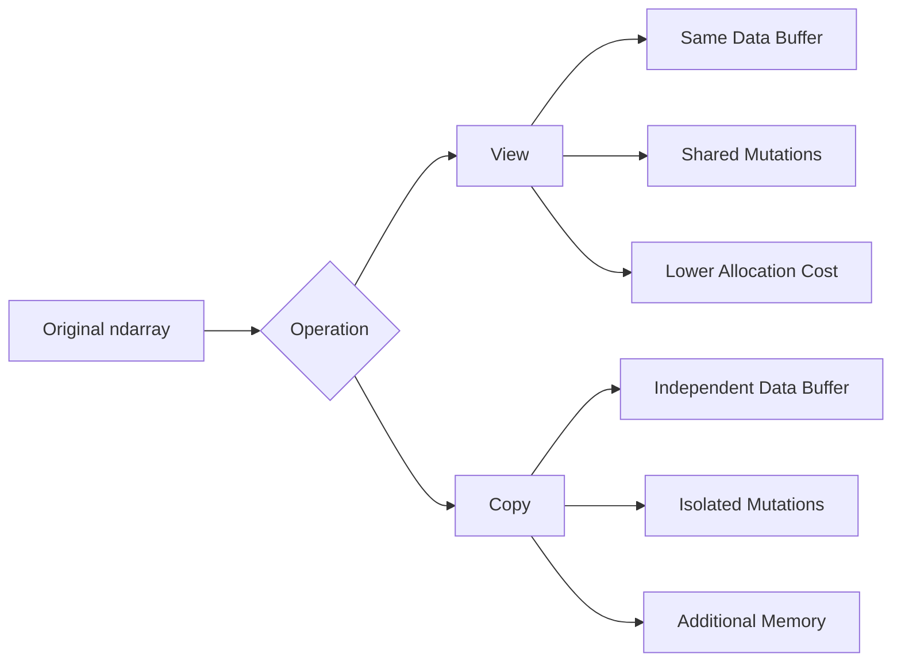
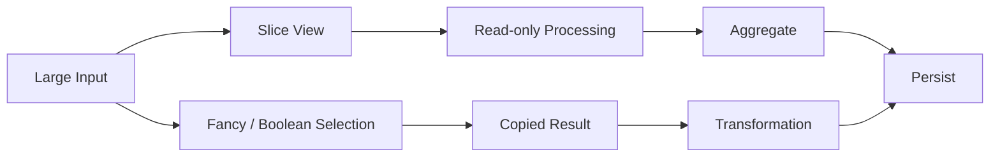

# 10- Views and Copies

## Overview

Views and copies are fundamental to understanding NumPy's memory behavior. Two arrays can expose the same logical values while having very different ownership and allocation characteristics.

A **view** provides a different way to access existing data without necessarily allocating a new data buffer. A **copy** creates independent storage containing duplicated values.

This distinction affects:

- Memory consumption.
- Mutation behavior.
- Object lifetime.
- Performance.
- Array contiguity.
- Batch-processing design.
- Debugging of unexpected data changes.

A useful mental model is:



The key engineering rule is:

> Use views when shared storage is intentional and safe; use copies when independent ownership is required.

## Why Views Exist

Large numerical arrays can contain millions of elements. Copying the entire array simply to process a subset can be expensive.

Consider:

```python
import numpy as np

values = np.arange(
    10_000_000,
    dtype=np.float64,
)

batch = values[:1_000_000]
```

A slice can represent the batch through array metadata without duplicating all one million values.

Conceptually:

```text
Original buffer
┌────┬────┬────┬────┬────┬────┬───────┐
│ 0  │ 1  │ 2  │ 3  │ ...│999999│ ... │
└────┴────┴────┴────┴────┴────┴───────┘
 ▲
 │
 └── batch view
```

This is one of the reasons NumPy can support memory-efficient processing of large datasets.

## Why Copies Exist

Copies provide independent ownership.

```python
values = np.array(
    [10, 20, 30],
)

snapshot = values.copy()

snapshot[0] = 999

print(values)
```

Result:

```text
[10 20 30]
```

The source remains unchanged because `snapshot` owns separate storage.

Copies are useful when:

- Data must be isolated.
- Mutation must not affect the source.
- A selected subset needs an independent lifetime.
- A downstream consumer requires owned memory.
- A long-lived object should not retain a large backing array.

The trade-off is additional memory and allocation cost.

## View vs Copy

The high-level difference is:

| Property | View | Copy |
|---|---|---|
| Data buffer | Shared | Independent |
| Allocation | Usually avoided | Required |
| Mutation | Can affect source | Isolated |
| Memory usage | Lower | Higher |
| Source lifetime | Can retain source buffer | Independent |
| Best use | Temporary/shared access | Ownership isolation |

This distinction should be explicit in production code.

## Creating a View with Slicing

Basic slicing commonly produces a view:

```python
values = np.array(
    [10, 20, 30, 40, 50],
)

view = values[1:4]

view[0] = 999

print(values)
```

Result:

```text
[ 10 999  30  40  50]
```

The view and source reference the same underlying data.

This is efficient but introduces shared-state semantics.

## Creating a Copy with copy()

Use `.copy()` explicitly when independence is required:

```python
values = np.array(
    [10, 20, 30, 40, 50],
)

copy = values[1:4].copy()

copy[0] = 999

print(values)
```

Result:

```text
[10 20 30 40 50]
```

The explicit `.copy()` documents an ownership decision.

That is preferable to relying on assumptions about how a complicated indexing operation behaves.

## Detecting Shared Memory

When debugging, use:

```python
np.shares_memory(a, b)
```

Example:

```python
values = np.arange(10)

view = values[2:7]
copy = values[2:7].copy()

print(np.shares_memory(values, view))
print(np.shares_memory(values, copy))
```

Typical output:

```text
True
False
```

This is a useful diagnostic when mutation or unexpected memory retention is suspected.

`np.may_share_memory()` can also be used when a conservative approximation is acceptable:

```python
np.may_share_memory(a, b)
```

Prefer `shares_memory()` when exact overlap matters.

## The base Attribute

The `base` attribute can provide clues about ownership:

```python
values = np.arange(10)

view = values[2:5]

print(view.base)
```

A view commonly references an object containing the underlying storage.

However, `base` is not a universal ownership API. Complex operations can involve intermediate arrays or other storage relationships.

When the actual question is:

> "Do these arrays overlap in memory?"

prefer:

```python
np.shares_memory(a, b)
```

## Ownership and owndata

The `owndata` flag indicates whether an array owns its data:

```python
values = np.arange(10)

view = values[2:5]

print(values.flags.owndata)
print(view.flags.owndata)
```

The original array commonly owns the buffer, while the slice does not.

Ownership matters because it affects object lifetime.

A view can keep the original data buffer alive even if the original array variable is no longer referenced directly.

## Memory Retention Through Views

This is an important production pitfall.

Suppose:

```python
large = np.zeros(
    100_000_000,
    dtype=np.float64,
)

small = large[:10]
```

The logical size of `small` is tiny, but it may still retain the entire underlying allocation.

Conceptually:

```text
Large array
~800 MB
   │
   └── small view
       ~80 bytes of logical data

small remains alive
        ↓
large backing buffer remains reachable
```

This can surprise developers working with:

- Long-lived caches.
- Background workers.
- Request-scoped objects accidentally retained.
- Global variables.
- Task queues.
- Notebook sessions.

If only the small subset needs to survive:

```python
small = large[:10].copy()
```

Now the large backing buffer can be released when no other references remain.

## Lifetime Matters

A view can have a smaller logical size but a larger memory footprint through its backing storage.

Therefore:

```text
logical size
    ≠
retained memory
```

For production systems, memory retention must be considered across object lifetimes rather than simply looking at `small.nbytes`.

## View Creation Through Reshaping

Some reshapes can return a view:

```python
values = np.arange(12)

matrix = values.reshape(3, 4)
```

Whether a reshape can be represented without copying depends on the original memory layout and requested shape.

You can inspect sharing:

```python
print(np.shares_memory(values, matrix))
```

Do not assume that every reshape copies or every reshape is free.

The safest rule is:

> Treat views and copies as operation-dependent and verify memory behavior when it matters.

## Transpose and Views

Transposing an array often produces a view by changing shape and stride metadata.

```python
matrix = np.arange(12).reshape(3, 4)

transposed = matrix.T

print(np.shares_memory(matrix, transposed))
```

Typical result:

```text
True
```

The transposed array can therefore avoid copying all values.

However, the result may no longer be C-contiguous:

```python
print(matrix.flags.c_contiguous)
print(transposed.flags.c_contiguous)
```

This creates an important trade-off:

```text
View
→ less allocation
→ shared storage
→ potentially non-contiguous access
```

Avoid assuming that zero-copy always means fastest.

## Slicing and Views

Common view-producing operations include basic slicing:

```python
values[10:100]
values[::2]
matrix[:, 1]
matrix[1:4, 2:5]
```

These operations often use existing memory with different shape/stride metadata.

This is particularly useful for batch processing:

```python
for start in range(0, values.size, batch_size):
    batch = values[start:start + batch_size]
    process(batch)
```

If `process()` is read-only, this can be a highly memory-efficient design.

## Advanced Indexing and Copies

Integer and boolean advanced indexing generally creates a copy:

```python
values = np.arange(10)

selected = values[[1, 3, 5]]
```

Check:

```python
print(np.shares_memory(values, selected))
```

Typical result:

```text
False
```

Similarly:

```python
selected = values[values > 5]
```

generally creates a new array.

This matters because selection can increase peak memory.

## View vs Copy in Pipeline Design

A numerical pipeline might look like:



The first path minimizes allocations.

The second path creates an independent subset, which may be necessary but increases memory usage.

The correct design depends on ownership and downstream requirements.

## Mutability and Shared State

Views make mutation particularly important.

```python
values = np.array(
    [10, 20, 30, 40],
)

view_a = values[:2]
view_b = values[1:3]

view_a[1] = 999
```

Now:

```python
print(view_b)
```

can reflect that mutation because the views overlap.

This is effectively shared mutable state:

```text
values
 ├── view_a
 └── view_b
      ↕
 shared buffer
```

In backend systems, shared mutable state makes debugging harder.

Use views for read-oriented processing or carefully controlled mutation. Use copies when independent ownership is more important than avoiding allocation.

## Read-Only Views

A view can be made non-writeable:

```python
view = values[:10]

view.flags.writeable = False
```

This can protect consumers from accidental mutation.

Attempting:

```python
view[0] = 999
```

will raise an error.

Read-only views are useful when several components should inspect the same data without modifying it.

However, read-only flags are one layer of protection. Application architecture should still clearly define ownership.

## Explicit Copying as an Ownership Boundary

When data crosses a component boundary, a copy can make ownership explicit.

For example:

```python
def prepare_for_storage(values: np.ndarray) -> np.ndarray:
    return values.copy()
```

This guarantees that later mutations to the caller's array cannot change the stored preparation buffer.

That can be useful when:

- Passing data to asynchronous workers.
- Storing a snapshot.
- Caching derived data.
- Keeping data after the source batch is released.

The trade-off is intentional memory duplication.

## Defensive Copies

Defensive copying can prevent unexpected mutation:

```python
def normalize_input(values: np.ndarray) -> np.ndarray:
    data = values.copy()

    data -= data.mean()

    return data
```

Without the copy:

```python
data = values
data -= data.mean()
```

the caller's array could be modified.

The right choice depends on the API's ownership contract.

A production API should document whether functions:

- Mutate input.
- Return a view.
- Return a copy.
- Require independent ownership.

## Avoiding Unnecessary Defensive Copies

Copying everything "for safety" can become expensive.

Consider:

```python
def process(values: np.ndarray) -> np.ndarray:
    values = values.copy()
    return values * 1.05
```

For a 1 GB input, that immediately consumes another 1 GB before the actual result is created.

A better design is often to keep the function read-only:

```python
def process(values: np.ndarray) -> np.ndarray:
    return values * 1.05
```

or explicitly copy only when mutation is required:

```python
def normalize_in_place(values: np.ndarray) -> np.ndarray:
    result = values.copy()
    result *= 1.05
    return result
```

The engineering principle is:

> Copy when the ownership contract requires isolation, not merely because copying feels safer.

## `np.array(..., copy=True)`

An explicit copy can also be created during conversion:

```python
copy = np.array(
    values,
    copy=True,
)
```

This is useful when converting array-like input while requiring independent storage.

For function boundaries, distinguish:

```python
np.asarray(values)
```

from:

```python
np.array(values, copy=True)
```

The first favors reuse when possible; the second explicitly requests independent storage.

## `np.asarray()` and Ownership

Consider:

```python
values = np.array(
    [10, 20, 30],
)

normalized = np.asarray(values)
```

The result can share memory with the input.

Therefore, code should not assume that `np.asarray()` creates ownership isolation.

If isolation is required:

```python
normalized = np.asarray(values).copy()
```

This makes the intent explicit.

## `astype()` and Copying

Dtype conversion often creates a new array:

```python
values = np.array(
    [1, 2, 3],
    dtype=np.int32,
)

converted = values.astype(
    np.float64,
)
```

Because the element representation changes, separate storage is commonly required.

For large arrays:

```text
int32 input
    ↓
float64 conversion
    ↓
new data buffer
```

Both arrays may temporarily coexist.

This can be important in memory-constrained workers.

## `astype(copy=False)`

You can request copy avoidance:

```python
converted = values.astype(
    np.float64,
    copy=False,
)
```

This means NumPy should avoid a copy when the existing representation is already compatible.

It does not guarantee that no copy will occur.

Do not make ownership assumptions solely from `copy=False`.

When memory sharing is part of correctness, inspect it.

## Views, Copies, and Contiguity

A view can be:

- Contiguous.
- Non-contiguous.
- Reversed.
- Strided.
- Transposed.

A copy often provides independent storage and can be made contiguous:

```python
contiguous = np.ascontiguousarray(
    values,
)
```

This is useful when a downstream native library or performance-sensitive operation expects contiguous memory.

But:

```text
contiguous
≠
always faster
```

and:

```text
copy
≠
always necessary
```

Make such decisions based on actual integration requirements and benchmarks.

## `np.ascontiguousarray()`

Suppose:

```python
matrix = np.arange(12).reshape(3, 4)

transposed = matrix.T
```

You can create a C-contiguous representation:

```python
contiguous = np.ascontiguousarray(
    transposed,
)
```

Depending on the source layout, this can create a copy.

Use it when:

- A downstream library requires contiguous storage.
- Native code expects a C-contiguous buffer.
- Benchmarks show a meaningful access benefit.

Do not add it to every pipeline indiscriminately because it can create large allocations.

## Memory Lifetime in Worker Systems

Views matter in long-running workers such as Celery processes.

Suppose a task processes a large batch:

```python
def process_batch(data: np.ndarray) -> np.ndarray:
    subset = data[:100]
    return transform(subset)
```

If `transform()` returns a view or otherwise retains the subset, the original data may remain alive longer than expected.

For a long-lived worker, repeated memory retention can produce unexpectedly high RSS.

When only a small result needs to survive:

```python
subset = data[:100].copy()
```

may actually reduce long-term memory consumption, despite the immediate copy allocation.

This is an important senior-level memory consideration:

> A copy can sometimes reduce total retained memory even though it costs memory immediately.

## Views and Caching

Caching a view can be dangerous:

```python
cache["recent"] = values[-1000:]
```

If `values` is very large, the cache entry may retain the entire underlying array.

For a cache with long-lived entries:

```python
cache["recent"] = values[-1000:].copy()
```

may be safer.

This is especially relevant for:

- Redis-backed preprocessing caches.
- In-memory LRU caches.
- Singleton service objects.
- Background worker state.

The right choice depends on whether the cached representation can be serialized independently or must continue sharing the original data.

## Views and API Boundaries

Passing a NumPy view between internal functions is usually fine when the ownership contract is clear.

Passing shared mutable views across independently managed application components is more risky.

A production-oriented approach is:

```text
Internal numerical pipeline
    ↓
Views allowed when controlled

Application / service boundary
    ↓
Explicit ownership / serialization
```

At API boundaries, data is usually serialized into independent representations anyway.

For example:

```python
payload = values.tolist()
```

creates a Python representation rather than exposing NumPy's memory-sharing semantics.

## Interaction with Pandas

Converting between Pandas and NumPy requires attention to ownership.

```python
values = df["amount"].to_numpy()
```

The returned array may reflect the underlying storage used by the Series depending on dtype and representation.

Do not assume that modifying the NumPy result can never affect the dataframe.

If independent ownership is required:

```python
values = df["amount"].to_numpy(
    copy=True,
)
```

Use explicit copying when the boundary should isolate the numerical representation from the dataframe.

This matters particularly in ETL pipelines where several stages operate on the same underlying data.

## View vs Copy Decision Matrix

| Requirement | Preferred Strategy |
|---|---|
| Read a temporary slice | View |
| Process large batches without mutation | View |
| Mutate independently | Copy |
| Retain a small subset of a huge array | Copy |
| Protect caller from mutation | Copy |
| Share read-only data | View + read-only flag |
| Native library requires contiguous memory | Contiguous copy if required |
| Avoid unnecessary allocation | View |
| Store an independent snapshot | Copy |

The decision should be driven by ownership, lifetime, and performance requirements.

## Common Production Pitfalls

### Assuming Every Indexing Operation Has the Same Behavior

Basic slicing and advanced indexing differ significantly.

**Avoid it:** know whether an operation returns a view or a copy when memory or mutation matters.

### Copying Every Input

Defensive copying can double or triple peak memory.

**Avoid it:** define ownership contracts and copy only when isolation is required.

### Mutating a View Accidentally

Changing a slice can modify the source array.

**Avoid it:** use `.copy()` or read-only views where appropriate.

### Retaining Small Views of Large Arrays

A tiny object can retain hundreds of megabytes of backing storage.

**Avoid it:** copy small subsets that need independent, long-lived lifetimes.

### Assuming a View Is Always Faster

A non-contiguous view can create poor memory-access patterns.

**Avoid it:** benchmark downstream operations, not just allocation time.

### Relying on `base` Alone

`base` provides useful diagnostic information but is not a complete ownership model.

**Avoid it:** use explicit ownership design and memory-sharing checks.

### Ignoring Dtype Conversion Copies

Conversions such as `int32 → float64` can allocate another full array.

**Avoid it:** include conversion memory in peak-memory planning.

### Treating NumPy Arrays as Immutable by Convention

NumPy arrays are mutable unless made read-only.

**Avoid it:** explicitly define mutation behavior in reusable functions.

## Security and Reliability Considerations

Views and copies primarily affect reliability and resource usage, but they can also affect data isolation.

For services processing sensitive or tenant-specific numerical data:

- Avoid unintended shared mutable buffers between processing stages.
- Copy data when ownership boundaries require isolation.
- Do not retain views in long-lived global or cache structures without understanding backing-memory retention.
- Bound batch sizes and array sizes.
- Monitor worker RSS for unexpected memory growth.

The broader failure mode is:

```text
Large shared array
      ↓
Unintended view retention
      ↓
Long-lived worker object
      ↓
Backing memory remains allocated
      ↓
RSS growth
      ↓
Kubernetes OOM / worker restart
```

Memory ownership is therefore an operational concern, not only a NumPy implementation detail.

## Performance Considerations

View creation is usually cheap because it can reuse existing storage.

Copy creation requires:

```text
Allocation
+
Memory transfer
```

For large arrays, this can dominate a pipeline.

However, eliminating a copy may create downstream costs if the resulting view is non-contiguous or poorly aligned for the next operation.

The correct performance question is therefore:

```text
What is the total cost of the pipeline?
```

rather than:

```text
Can I avoid this one copy?
```

Benchmark:

- Allocation time.
- Copy time.
- Subsequent computation.
- Memory bandwidth.
- Peak RSS.
- End-to-end throughput.

## Testing View and Copy Semantics

When memory behavior is part of the contract, test it explicitly.

```python
import numpy as np


def test_slice_shares_memory() -> None:
    values = np.array([10, 20, 30, 40])

    view = values[1:3]

    assert np.shares_memory(values, view)
```

For a copy:

```python
def test_copy_does_not_share_memory() -> None:
    values = np.array([10, 20, 30, 40])

    copy = values[1:3].copy()

    assert not np.shares_memory(values, copy)
```

Test mutation semantics separately:

```python
def test_copy_isolation() -> None:
    values = np.array([10, 20, 30, 40])

    copy = values[1:3].copy()

    copy[0] = 999

    assert values[1] == 20
```

These tests document ownership expectations and protect against accidental refactoring.

## Practical Diagnostic Helper

A small diagnostic function can make ownership behavior easier to inspect:

```python
import numpy as np


def describe_relationship(
    source: np.ndarray,
    candidate: np.ndarray,
) -> dict[str, object]:
    return {
        "shares_memory": np.shares_memory(
            source,
            candidate,
        ),
        "source_owns_data": source.flags.owndata,
        "candidate_owns_data": candidate.flags.owndata,
        "source_contiguous": source.flags.c_contiguous,
        "candidate_contiguous": candidate.flags.c_contiguous,
    }
```

This can be useful for benchmark and debugging tools.

Do not execute expensive diagnostics such as memory-sharing checks on every production request unless there is a specific operational reason.

## Interview-Relevant Questions

### What is the difference between a NumPy view and copy?

A view references existing data, while a copy owns independent storage.

### Why are views useful?

They avoid duplicating large data buffers and can significantly reduce allocation and memory usage.

### What is the primary risk of views?

Mutations can affect the source or other arrays sharing the same storage.

### How do you create an independent copy?

Use:

```python
values.copy()
```

or another explicit copy operation.

### How do you determine whether two arrays share memory?

Use:

```python
np.shares_memory(a, b)
```

### Why can a small view retain a huge array?

Because the view can keep the original backing buffer reachable even when only a small region is logically needed.

### Is a view always faster than a copy?

No. Avoiding allocation can help, but a non-contiguous view can have inefficient memory access and may cause downstream operations to copy anyway.

### Why might a copy actually reduce long-term memory usage?

A small independent copy can release a large backing buffer that would otherwise remain alive because of a retained view.

### What is the difference between `np.asarray()` and `.copy()`?

`np.asarray()` can reuse an existing compatible array, while `.copy()` explicitly creates independent storage.

### Why is `astype()` relevant to view vs copy behavior?

Changing dtype generally requires a new representation, so dtype conversion can allocate a new array and temporarily increase memory usage.

### When should you use a read-only view?

When multiple components should inspect the same data without mutating it and avoiding a full copy is valuable.

## Key Takeaways

- Views reuse existing array storage and can make large numerical pipelines memory-efficient, while copies provide independent ownership at an allocation cost.
- Shared memory is a correctness concern: mutating a view can mutate the source, so ownership and mutation contracts should be explicit.
- Small views can retain very large backing arrays, making `.copy()` an important tool for controlling long-term memory retention.
- Avoiding a copy is not automatically a performance win; non-contiguous or strided views can increase downstream access costs or trigger later implicit copies.
- Production NumPy code should make view-versus-copy decisions based on ownership, lifetime, memory usage, and measured end-to-end performance.