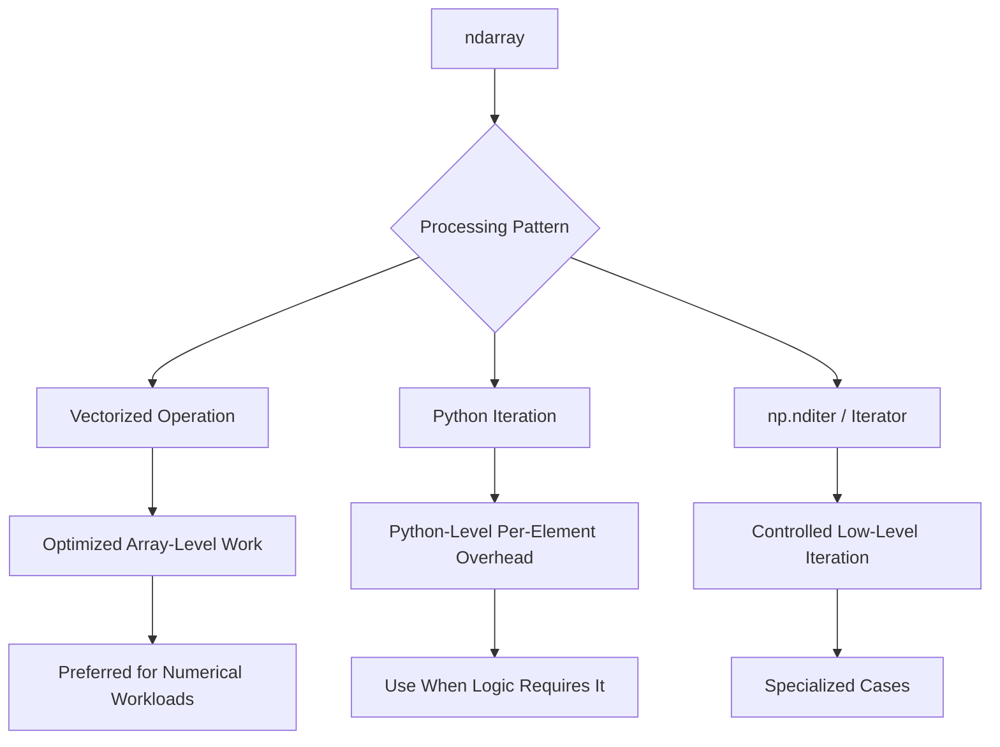
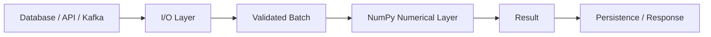
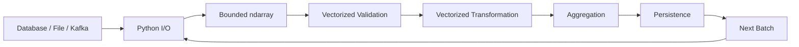

# 11- Array Iteration

## Overview

Array iteration is the process of traversing the elements of a NumPy `ndarray` to inspect, transform, validate, or process data. NumPy supports several iteration mechanisms, but they are not equivalent from a performance or memory perspective.

For backend and data engineering workloads, the most important principle is:

> Prefer array-level vectorized operations over explicit Python iteration whenever the computation can be expressed that way.

Explicit iteration is still useful when:

- The algorithm is inherently sequential.
- Each element requires complex Python-side logic.
- The operation interacts with external systems.
- Debugging or inspection is required.
- The workload is small enough that optimization is irrelevant.
- A NumPy iterator is needed for a specialized traversal pattern.

Understanding iteration helps explain why some NumPy code remains fast while other code accidentally falls back to Python-level processing.



## Why Vectorization Usually Comes First

Consider a numerical transformation:

```python
import numpy as np

values = np.array(
    [10.0, 20.0, 30.0, 40.0],
)

result = values * 1.05 + 10
```

The operation is expressed over the complete array.

The alternative is explicit iteration:

```python
result = np.empty_like(values)

for index, value in enumerate(values):
    result[index] = value * 1.05 + 10
```

Both produce the same numerical result, but the execution model differs.

```text
Python loop
    ↓
Python iteration
    ↓
Python operation per element
    ↓
Repeated interpreter overhead

Vectorized operation
    ↓
Single Python-level operation
    ↓
Optimized low-level numerical processing
```

The vectorized implementation can substantially reduce Python interpreter overhead for sufficiently large numerical workloads.

This does not mean NumPy is always faster. Very small arrays, complex branch-heavy logic, or operations that cannot be efficiently vectorized can change the trade-off.

## Iterating Over a One-Dimensional Array

A one-dimensional array can be iterated directly:

```python
import numpy as np

values = np.array(
    [10, 20, 30, 40],
)

for value in values:
    print(value)
```

Each iteration produces a NumPy scalar value.

This is useful for:

- Debugging.
- Logging small datasets.
- Integrating with APIs that require scalar processing.
- Algorithms that genuinely need sequential control flow.

It is generally not the preferred pattern for large-scale numerical transformation.

## Explicit Python Loops

A Python loop can process array elements:

```python
def transform(values: np.ndarray) -> np.ndarray:
    result = np.empty_like(values)

    for index, value in enumerate(values):
        result[index] = value * 1.05

    return result
```

This approach is readable and sometimes necessary.

However, the loop executes once per element at the Python level.

For millions of elements, that can become a significant CPU cost.

Prefer:

```python
result = values * 1.05
```

when the operation is purely element-wise numerical work.

## Why Python-Level Iteration Has Overhead

A Python loop repeatedly performs operations through the interpreter:

```text
Fetch next object
      ↓
Execute Python bytecode
      ↓
Perform operation
      ↓
Create / assign result
      ↓
Repeat
```

NumPy's vectorized operations can instead hand the bulk operation to optimized native implementations.

This reduces:

- Python dispatch.
- Per-element interpreter work.
- Repeated Python object handling.

The actual performance depends on the operation, memory layout, dtype, CPU, and array size.

## Iterating with enumerate()

When the index is required:

```python
values = np.array(
    [10, 20, 30],
)

for index, value in enumerate(values):
    print(index, value)
```

This is clearer than manually maintaining a counter:

```python
index = 0

for value in values:
    print(index, value)
    index += 1
```

Use `enumerate()` when the algorithm genuinely requires index-aware Python logic.

If the goal is simply to transform data based on index positions, a vectorized expression may be preferable.

## Iterating Over Rows

For a two-dimensional array:

```python
matrix = np.array(
    [
        [10, 20, 30],
        [40, 50, 60],
    ],
)

for row in matrix:
    print(row)
```

Each `row` represents one row.

You can process it:

```python
for row in matrix:
    total = row.sum()
    print(total)
```

This is acceptable for small matrices or row-level control flow, but looping over every row can still incur Python overhead.

If the goal is to aggregate all rows:

```python
row_totals = matrix.sum(axis=1)
```

The vectorized form is usually the better numerical abstraction.

## Iterating Over Columns

Direct column iteration is less natural:

```python
for column_index in range(matrix.shape[1]):
    column = matrix[:, column_index]
    process_column(column)
```

This can be useful when each column represents a distinct metric and processing logic is column-specific.

However, if all columns undergo the same numerical operation, prefer an array-level expression:

```python
scaled = matrix * 1.05
```

The difference is:

```text
Column-specific business logic
→ explicit iteration may be appropriate

Same numerical operation across all elements
→ vectorize
```

## Nested Iteration

A two-dimensional nested Python loop:

```python
for row in matrix:
    for value in row:
        process(value)
```

is often a performance smell for large numerical datasets.

If the operation can be represented mathematically across the complete array, NumPy should generally perform it without explicit loops.

For example:

```python
result = matrix * 1.05
```

is preferable to:

```python
result = np.empty_like(matrix)

for row_index in range(matrix.shape[0]):
    for column_index in range(matrix.shape[1]):
        result[row_index, column_index] = (
            matrix[row_index, column_index] * 1.05
        )
```

The latter should usually be reserved for algorithms that genuinely require per-element control flow.

## Vectorizing Conditional Logic

Consider:

```python
values = np.array(
    [10, 20, 30, 40],
)

result = np.where(
    values >= 30,
    values * 1.10,
    values,
)
```

This replaces a loop such as:

```python
result = np.empty_like(values, dtype=float)

for index, value in enumerate(values):
    if value >= 30:
        result[index] = value * 1.10
    else:
        result[index] = value
```

The vectorized form is generally preferable for straightforward element-wise conditions.

For more complex branching logic, readability and benchmark results should determine whether a vectorized formulation is worthwhile.

## Vectorizing Multiple Conditions

Boolean masks can replace loops for many validation rules:

```python
values = np.array(
    [10.0, -5.0, 20.0, np.nan, 150.0],
)

valid = (
    np.isfinite(values)
    & (values >= 0)
    & (values <= 100)
)

clean = values[valid]
```

This processes the complete array through vectorized operations.

The equivalent Python loop would require:

```python
valid_values = []

for value in values:
    if (
        np.isfinite(value)
        and 0 <= value <= 100
    ):
        valid_values.append(value)
```

The NumPy version is more naturally aligned with array-oriented processing.

## Iteration with `.flat`

The `.flat` iterator provides a one-dimensional iteration view over the array.

```python
values = np.array(
    [
        [10, 20],
        [30, 40],
    ],
)

for value in values.flat:
    print(value)
```

Output:

```text
10
20
30
40
```

This is useful when:

- The array is multidimensional.
- The processing is conceptually one-dimensional.
- The code needs iteration rather than a vectorized operation.

However, `.flat` still performs Python-level iteration when used in a Python `for` loop.

It should not be treated as a replacement for vectorization.

## `nditer`

`np.nditer()` provides more controlled iteration over an array.

```python
import numpy as np

values = np.array(
    [10, 20, 30],
)

for value in np.nditer(values):
    print(value)
```

It becomes useful when iteration needs additional control over:

- Traversal.
- Dtype handling.
- Multi-array iteration.
- Read/write access.
- Buffering.

For ordinary backend numerical processing, direct vectorized operations are usually easier to read and maintain.

`nditer` is more appropriate when a genuine iteration requirement exists.

## `nditer` with Read/Write Access

A writable iterator can update values:

```python
values = np.array(
    [10, 20, 30],
    dtype=np.int64,
)

with np.nditer(
    values,
    op_flags=["readwrite"],
) as iterator:
    for value in iterator:
        value[...] *= 2
```

The array becomes:

```text
[20 40 60]
```

This gives explicit iterator-level control.

However, if the operation is simply multiplication:

```python
values *= 2
```

is clearer and generally preferable.

Use `nditer` because the iteration semantics require it, not because it looks more advanced.

## Iterating Over Multiple Arrays

A common requirement is to process corresponding elements from multiple arrays.

Instead of:

```python
for index in range(values.size):
    result[index] = values[index] * rates[index]
```

prefer:

```python
result = values * rates
```

This is vectorized and naturally uses broadcasting when shapes are compatible.

If the algorithm requires explicit synchronized iteration, `np.nditer()` or Python `zip()` may be appropriate depending on the data model.

For example:

```python
for value, rate in zip(values, rates):
    process(value, rate)
```

This is readable but still runs at the Python level.

## Iterating with zip()

Python's `zip()` is useful for synchronized Python-level processing:

```python
values = np.array(
    [10, 20, 30],
)

rates = np.array(
    [1.1, 1.2, 1.3],
)

for value, rate in zip(values, rates):
    print(value * rate)
```

For numerical transformations, however:

```python
result = values * rates
```

is usually the better NumPy expression.

Use `zip()` when the loop contains logic that is not naturally representable as a vectorized operation.

## Iterating Along an Axis

For arrays with meaningful axes, iteration can follow an axis:

```python
values = np.zeros(
    (1000, 24, 8),
)

for batch in values:
    process_batch(batch)
```

This iterates across the first dimension.

That is useful for:

```text
(batch, time, metric)
```

where each outer element is a logical batch.

If the operation itself is batch-independent and vectorizable, processing the full array at once may still be more efficient.

## Chunked Iteration

Iteration becomes more useful when deliberately bounding the amount of work processed at once.

Consider a one-dimensional array:

```python
import numpy as np


def process_batches(
    values: np.ndarray,
    batch_size: int,
) -> None:
    for start in range(0, values.size, batch_size):
        batch = values[
            start : start + batch_size
        ]

        process_batch(batch)


def process_batch(batch: np.ndarray) -> None:
    result = batch * 1.05
    print(result.mean())
```

This combines:

```text
Python iteration
+
NumPy vectorization inside each batch
```

That is often a strong production pattern for datasets that are too large to process comfortably as one operation.

## Batch Iteration Architecture


This approach provides:

- Bounded working memory.
- Predictable processing units.
- Easier retry boundaries.
- Better operational observability.

For Celery workers, each batch can also serve as a natural task boundary if the dataset is large enough to justify asynchronous processing.

## Iteration and Memory Usage

Iteration itself does not guarantee low memory usage.

Consider:

```python
for batch in batches:
    result = expensive_transformation(batch)
    results.append(result)
```

Although each batch is bounded, accumulating all `result` arrays in `results` eventually recreates the memory problem.

A better design for large workloads may be:

```text
Read batch
  ↓
Process
  ↓
Persist result
  ↓
Release references
  ↓
Read next batch
```

This is important for:

- Large ETL jobs.
- Celery workers.
- Kubernetes batch jobs.
- File processing.
- Object-storage pipelines.

## Generator-Based Batch Processing

A generator can provide a clean batch boundary:

```python
import numpy as np
import numpy.typing as npt


def iter_batches(
    values: npt.NDArray[np.float64],
    batch_size: int,
):
    for start in range(0, values.size, batch_size):
        yield values[
            start : start + batch_size
        ]
```

Consumer:

```python
for batch in iter_batches(values, 100_000):
    result = batch * 1.05
    persist(result)
```

This allows the caller to process one batch at a time without creating a list of all batches.

The source array is still resident in memory, but intermediate results can remain bounded.

## Iteration and External Systems

Some loops involve work that cannot be vectorized because each iteration interacts with an external system:

```python
for record_id in record_ids:
    result = fetch_from_service(record_id)
    persist(result)
```

NumPy should not be forced into this type of workflow.

The operation is dominated by:

- Network latency.
- I/O.
- Serialization.
- Rate limits.
- Retries.

A better design may involve:

- Async I/O.
- Batching requests.
- Kafka.
- Redis.
- Celery.
- Database bulk operations.

NumPy is appropriate when the dominant workload is numerical computation, not arbitrary application orchestration.

## Separating I/O from Numerical Processing

A clean architecture separates these concerns:



This lets NumPy operate efficiently on dense numerical arrays while Python application code handles I/O and business orchestration.

## Array Iteration vs Vectorization

A practical comparison:

| Pattern | Typical Use | Performance Characteristics |
|---|---|---|
| Python `for` loop | Complex per-item logic | Python overhead |
| `enumerate()` | Index-aware processing | Python overhead |
| `zip()` | Synchronized iteration | Python overhead |
| `.flat` | Flattened traversal | Python-level iteration |
| `np.nditer()` | Controlled iteration | Specialized |
| Vectorized operation | Element-wise numerical work | Usually preferred |
| Batch loop + vectorization | Large datasets | Good balance |
| Database / I/O loop | External operations | I/O-bound |

The key distinction is not "loops are bad."

The better rule is:

> Use Python iteration for orchestration and genuinely sequential logic; use NumPy operations for dense numerical computation.

## Sequential Algorithms

Some algorithms cannot be fully vectorized because the current operation depends on previous state.

For example:

```python
running = np.empty_like(values)

total = 0.0

for index, value in enumerate(values):
    total += value
    running[index] = total
```

There may be a NumPy operation that expresses the same idea:

```python
running = np.cumsum(values)
```

The important lesson is to ask first whether an array-level primitive already exists.

Before writing a Python loop, check whether the operation can be represented through:

- Arithmetic operators.
- Reductions.
- Boolean masks.
- Broadcasting.
- Cumulative operations.
- `where`.
- Specialized NumPy functions.

## When Explicit Iteration Is Appropriate

Use explicit iteration when:

### The Algorithm Is State-Dependent

Each result depends on prior results and no suitable vectorized primitive exists.

### The Logic Is Branch-Heavy

Complex object-level decisions can become less readable when forced into array expressions.

### The Operation Is I/O-Bound

Network, file, or database calls should remain in the application/I/O layer.

### The Dataset Is Small

For a few dozen elements, optimization may not justify added complexity.

### You Need Debugging or Inspection

Interactive iteration can be useful during investigation.

### You Need Controlled Side Effects

Logging, metric emission, or external calls are inherently procedural.

## When Explicit Iteration Is a Problem

Watch for loops like:

```python
for index in range(values.size):
    values[index] = values[index] * 1.05
```

or:

```python
for index in range(values.size):
    if values[index] > 100:
        values[index] = 100
```

These often indicate a computation that NumPy can express directly:

```python
values *= 1.05
```

or:

```python
values = np.minimum(values, 100)
```

Replacing a Python loop with a vectorized operation can improve throughput and simplify the implementation.

## Iteration and Mutation

When iterating over arrays, distinguish between:

```python
for value in values:
    value = value * 2
```

and:

```python
values *= 2
```

The first reassigns the local loop variable; it does not modify the original array.

The second modifies the array in place.

This is a common mistake.

For Python-level iteration where direct mutation is intentional:

```python
for index in range(values.size):
    values[index] *= 2
```

works, but a vectorized operation is usually preferable:

```python
values *= 2
```

## Iterating Over Object Arrays

Object arrays can contain arbitrary Python objects:

```python
values = np.array(
    [1, "customer", 3.5],
    dtype=object,
)
```

Iteration over object arrays often behaves much more like Python object processing than dense numerical computation.

This reduces the performance advantage that motivates NumPy.

If the workload becomes object-heavy, reconsider whether a NumPy array is the right abstraction.

## Iteration and Dtype

The dtype affects the representation of values processed by NumPy operations.

For example:

```python
values = np.array(
    [10, 20, 30],
    dtype=np.int32,
)
```

Vectorized arithmetic operates according to NumPy's dtype rules.

Python-level iteration introduces additional object/scalar handling.

For high-throughput numerical workloads, preserving a suitable numeric dtype through the vectorized portion of the pipeline is generally preferable.

## Iteration and Memory Layout

Iteration order can matter for multidimensional arrays.

Consider:

```python
values = np.zeros(
    (1000, 1000),
)
```

A row-oriented traversal:

```python
for row in values:
    process(row)
```

aligns naturally with the default C-contiguous layout.

A column-oriented traversal:

```python
for column_index in range(values.shape[1]):
    column = values[:, column_index]
    process(column)
```

may result in more strided memory access.

The exact performance depends on the operation, but this is an important systems-level consideration:

> Memory layout influences how efficiently data can be traversed.

## Contiguous vs Strided Iteration

For a C-contiguous array:

```text
row 0 → row 1 → row 2
```

elements are laid out sequentially in memory within rows.

A column traversal may jump across memory:

```text
element 0
   ↓
next row
   ↓
next row
   ↓
next row
```

This can reduce locality.

When performance matters:

```python
print(values.flags.c_contiguous)
print(values.strides)
```

can help explain unexpected behavior.

## `nditer` and Multiple Operands

`nditer` can coordinate iteration over multiple arrays:

```python
values = np.array(
    [10, 20, 30],
)

rates = np.array(
    [1.1, 1.2, 1.3],
)

with np.nditer(
    [values, rates],
    flags=["refs_ok"],
) as iterator:
    for value, rate in iterator:
        print(value, rate)
```

This is a specialized tool.

In most numerical workloads:

```python
result = values * rates
```

is simpler and more efficient.

Use `nditer` when you genuinely need its iterator-level capabilities.

## Benchmarking Iteration vs Vectorization

A basic comparison:

```python
import time
import numpy as np


def benchmark() -> None:
    values = np.arange(
        5_000_000,
        dtype=np.float64,
    )

    result = np.empty_like(values)

    start = time.perf_counter()

    for index, value in enumerate(values):
        result[index] = value * 1.05

    loop_elapsed = time.perf_counter() - start

    start = time.perf_counter()

    vectorized = values * 1.05

    vectorized_elapsed = time.perf_counter() - start

    print(f"loop:       {loop_elapsed:.6f}s")
    print(f"vectorized: {vectorized_elapsed:.6f}s")
```

This demonstrates the difference in execution model.

A serious benchmark should:

- Repeat measurements.
- Use multiple input sizes.
- Control the environment.
- Include allocation costs consistently.
- Measure peak memory where relevant.
- Compare equivalent work.

Do not use one timing result to make universal claims about NumPy performance.

## Benchmarking Batch Processing

A useful production comparison is not just:

```text
Python loop vs NumPy
```

but:

```text
Entire dataset vectorized
vs
Batch loop + vectorized batch
```

For example:

```python
def process_all(values: np.ndarray) -> np.ndarray:
    return values * 1.05


def process_in_batches(
    values: np.ndarray,
    batch_size: int,
) -> list[np.ndarray]:
    results: list[np.ndarray] = []

    for start in range(
        0,
        values.size,
        batch_size,
    ):
        batch = values[
            start : start + batch_size
        ]

        results.append(batch * 1.05)

    return results
```

The second pattern controls per-operation memory but accumulates results in a list.

A production pipeline would usually persist or consume each result incrementally rather than storing every result.

## Array Iteration in ETL

A practical ETL pipeline may combine multiple execution models:



Python iteration is used for orchestration:

```python
for batch in source_batches:
    process_batch(batch)
```

NumPy handles the dense numerical operations within each batch.

This separation is usually more maintainable than trying to eliminate every Python loop.

## Monitoring Array-Processing Workloads

For production systems, useful metrics include:

| Metric | Why It Matters |
|---|---|
| Batch size | Determines numerical workload |
| Processing time | Detects CPU regressions |
| Throughput | Measures capacity |
| Peak RSS | Detects memory pressure |
| Queue depth | Detects worker backlog |
| Invalid record ratio | Measures data quality |
| Error rate | Detects processing failures |
| CPU utilization | Detects saturation |

For Kubernetes or Celery workers, tune concurrency based on actual memory and CPU requirements.

A batch transformation that uses one CPU core efficiently may become unstable if many workers execute large batches concurrently.

## Security and Reliability Considerations

Iteration strategy also affects resource usage.

Avoid processing unbounded client-controlled datasets synchronously:

```text
HTTP request
    ↓
Huge numeric payload
    ↓
Python loop / NumPy processing
    ↓
Long-running worker
    ↓
Timeout / high CPU / high memory
```

Instead:

```text
HTTP request
    ↓
Validate size
    ↓
Queue bounded workload
    ↓
Worker
    ↓
Process batches
    ↓
Persist
```

This is particularly important when numerical processing is CPU-intensive.

Enforce:

- Maximum request sizes.
- Maximum element counts.
- Batch limits.
- Task timeouts.
- Worker concurrency limits.

## Testing Iteration Logic

For vectorized processing, tests should validate the result rather than implementation details.

```python
import numpy as np


def transform(values: np.ndarray) -> np.ndarray:
    return values * 1.05


def test_transform() -> None:
    values = np.array(
        [10.0, 20.0, 30.0],
    )

    result = transform(values)

    np.testing.assert_allclose(
        result,
        np.array([10.5, 21.0, 31.5]),
    )
```

For batch iteration:

```python
def iter_batches(
    values: np.ndarray,
    batch_size: int,
):
    for start in range(0, values.size, batch_size):
        yield values[start : start + batch_size]


def test_batch_iteration() -> None:
    values = np.arange(10)

    batches = list(
        iter_batches(values, 4)
    )

    assert len(batches) == 3
    np.testing.assert_array_equal(
        batches[0],
        np.array([0, 1, 2, 3]),
    )
    np.testing.assert_array_equal(
        batches[-1],
        np.array([8, 9]),
    )
```

If view semantics are intentional, test memory sharing separately.

## Common Mistakes

### Iterating When Vectorization Is Available

Instead of:

```python
for index in range(values.size):
    values[index] *= 2
```

prefer:

```python
values *= 2
```

when semantics allow it.

### Assuming NumPy Eliminates Every Loop

NumPy may still use loops internally, but the important difference is that the numerical loop is executed outside the Python interpreter.

### Using `nditer()` for Simple Arithmetic

`nditer()` is powerful but often unnecessary.

Prefer:

```python
result = values * rates
```

over manually iterating corresponding elements.

### Accumulating Every Batch in Memory

Batching reduces per-step memory, but storing all results eventually recreates the memory problem.

Persist or consume batches incrementally when datasets are large.

### Mutating the Loop Variable

This does not modify the array:

```python
for value in values:
    value *= 2
```

Prefer vectorized mutation:

```python
values *= 2
```

or index-based assignment when a true Python loop is required.

### Ignoring Memory Layout

Iterating through a non-contiguous or poorly aligned access pattern may reduce performance.

Inspect `shape`, `strides`, and contiguity when diagnosing large-workload performance.

### Treating I/O Loops as Numerical Loops

A loop that performs HTTP or database requests is not the same problem as a numerical loop.

Use appropriate I/O concurrency, batching, and queueing techniques rather than forcing NumPy into the workflow.

## Interview-Relevant Questions

### Why is Python iteration often slower than NumPy vectorization?

Python iteration executes per-element logic through the Python interpreter, while many NumPy operations perform the bulk numerical work in optimized low-level routines.

### Are Python loops always bad with NumPy?

No. Loops are appropriate for orchestration, I/O, complex sequential logic, small datasets, and algorithms without useful vectorized equivalents.

### What is `np.nditer()`?

`np.nditer()` is a configurable NumPy iterator that provides controlled traversal of arrays and can support specialized read/write and multi-operand iteration.

### When should you use `nditer()`?

Use it when iterator-level control is genuinely needed. Do not use it simply because it appears more "NumPy-native" than a vectorized expression.

### How should a large dataset be processed if the entire array is too expensive to transform at once?

Use bounded batches, process each batch with vectorized NumPy operations, and persist or consume results incrementally.

### Why can batch processing still consume too much memory?

Because the application may retain every batch result, create several temporary arrays, or run multiple batches concurrently.

### How does memory layout affect iteration?

Access patterns that follow contiguous memory generally have better locality than large-stride or non-contiguous traversal patterns.

### When is a Python loop appropriate for backend data processing?

When the loop handles external I/O, complex business rules, sequential state, side effects, or orchestration rather than dense numerical computation.

### How would you optimize a slow NumPy loop?

First determine whether the loop can be replaced with a vectorized operation, aggregation, mask, broadcasting expression, or specialized NumPy function. Then benchmark the resulting implementation using realistic inputs.

### Why isn't "NumPy is faster" a sufficient explanation?

Because performance depends on input size, algorithm, memory access, dtype, allocation behavior, and whether the workload is CPU-bound or I/O-bound.

## Key Takeaways

- Prefer vectorized NumPy operations for dense numerical computation because they reduce Python-level per-element overhead.
- Python iteration remains appropriate for orchestration, I/O, complex sequential logic, side effects, and workloads that do not map naturally to array operations.
- Batch iteration combined with vectorized processing provides a practical way to control memory while retaining efficient numerical execution.
- `nditer()` provides specialized iterator control but should not replace straightforward vectorized expressions without a concrete reason.
- Production performance decisions should consider CPU time, memory allocation, data layout, batch size, concurrency, and end-to-end workload behavior rather than assuming vectorization is always faster.