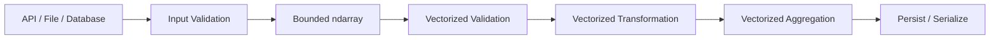

# 12- Vectorization

## Overview

Vectorization is the practice of expressing numerical computation as operations over entire NumPy arrays rather than processing individual elements through Python-level loops.

It is one of the central reasons NumPy is effective for backend and data-processing workloads. Instead of repeatedly executing Python bytecode for each value, a vectorized expression delegates the bulk operation to NumPy's optimized numerical implementation.

For example:

```python
import numpy as np

values = np.array(
    [100.0, 200.0, 300.0, 400.0],
)

result = values * 1.05 + 10
```

The alternative is an explicit Python loop:

```python
result = np.empty_like(values)

for index, value in enumerate(values):
    result[index] = value * 1.05 + 10
```

Both are correct, but the execution model is different:

```text
Python loop
    ↓
Python-level iteration
    ↓
Per-element interpreter overhead
    ↓
Numerical operation

Vectorized NumPy operation
    ↓
Single Python-level expression
    ↓
Optimized low-level computation
    ↓
Array result
```

Vectorization should therefore be understood as an execution strategy, not simply a shorter syntax.

## Why Vectorization Matters

Backend and data-processing systems frequently perform the same numerical operation across large batches:

- Apply a percentage adjustment.
- Normalize a metric.
- Validate a range.
- Calculate derived values.
- Aggregate records.
- Replace invalid values.
- Apply thresholds.
- Transform multiple columns.

When the same operation applies independently to many elements, vectorization can reduce Python interpreter overhead and make the operation easier to express.

The main benefits are:

| Benefit | Engineering Impact |
|---|---|
| Less Python-level looping | Lower interpreter overhead |
| Dense numerical operations | Better use of array-oriented processing |
| Concise expressions | Easier maintenance |
| Broadcasting support | Fewer explicit temporary structures |
| Integration with reductions | Efficient batch processing |
| Composable operations | Clear numerical pipelines |

These benefits are workload-dependent. NumPy is not automatically faster for every operation or every input size.

## Vectorization vs Python Loops

Consider calculating an adjusted price:

```python
import numpy as np

prices = np.array(
    [100.0, 150.0, 200.0, 250.0],
)
```

Python loop:

```python
adjusted = np.empty_like(prices)

for index, price in enumerate(prices):
    adjusted[index] = price * 1.05
```

Vectorized:

```python
adjusted = prices * 1.05
```

The vectorized operation allows NumPy to process the array through optimized numerical code rather than invoking the Python interpreter once per element.

The performance difference becomes more relevant as the number of elements increases, although allocation costs and memory bandwidth still matter.

## What Vectorization Actually Removes

Vectorization does **not** mean that no loop exists.

A loop still has to process the elements somewhere.

The important difference is where that loop executes:

```text
Python implementation:

for each element:
    Python interpreter
    Python object handling
    numerical operation


NumPy implementation:

Python calls NumPy
        ↓
optimized low-level loop
        ↓
numerical operation over the array
```

The loop has effectively moved below the Python interpreter boundary.

This is the more accurate explanation for why vectorized operations can be faster.

## Element-Wise Arithmetic

NumPy arithmetic operators are naturally vectorized.

```python
values = np.array(
    [10.0, 20.0, 30.0],
)

scaled = values * 1.10
shifted = values + 5
normalized = values / 100
combined = values * 1.10 + 5
```

Each expression applies the operation to every compatible element.

This is useful for:

- Unit conversions.
- Rate adjustments.
- Numerical normalization.
- Derived metrics.
- Batch transformations.

The result usually requires a new output array unless an in-place operation is explicitly used.

## In-Place Vectorization

When independent output storage is unnecessary, an operation can often be performed in place:

```python
values *= 1.05
```

This can reduce temporary allocations.

Compare:

```python
result = values * 1.05
```

with:

```python
values *= 1.05
```

The first creates a separate result array. The second modifies the existing array.

Use in-place operations only when mutation is intentional.

This is particularly important when `values` is a view:

```python
batch = values[1000:2000]
batch *= 1.05
```

The source array may also be modified because the batch can share memory with it.

## Vectorization and Broadcasting

Broadcasting extends vectorization to compatible arrays with different shapes.

```python
prices = np.array(
    [
        [100.0, 200.0, 300.0],
        [110.0, 220.0, 330.0],
    ],
)

tax_rates = np.array(
    [0.05, 0.10, 0.15],
)

tax = prices * tax_rates
```

Shapes:

```text
prices     → (2, 3)
tax_rates  → (3,)
```

NumPy applies each rate across the corresponding column.

This avoids manually constructing:

```python
tax_rates_repeated = np.array(
    [
        [0.05, 0.10, 0.15],
        [0.05, 0.10, 0.15],
    ],
)
```

Broadcasting can therefore reduce both code complexity and unnecessary explicit data replication.

## Vectorization with Scalar Parameters

A common backend transformation uses a scalar configuration value:

```python
values = np.array(
    [100, 200, 300],
    dtype=np.float64,
)

rate = 1.05

result = values * rate
```

The scalar is broadcast across every element.

This is useful for:

- Exchange-rate adjustments.
- Tax calculations.
- Unit conversion factors.
- Configuration-driven numerical transformations.

The scalar itself does not need to be expanded into an array.

## Vectorized Comparisons

Comparison operators also operate element-wise:

```python
values = np.array(
    [10, 20, 30, 40],
)

mask = values >= 25
```

Result:

```text
[False, False, True, True]
```

This creates a vectorized boolean condition.

The mask can then be used for filtering:

```python
selected = values[mask]
```

This forms a common pipeline:

```text
Array
  ↓
Vectorized comparison
  ↓
Boolean mask
  ↓
Selection
```

## Vectorized Conditional Logic

`np.where()` provides a vectorized conditional expression:

```python
values = np.array(
    [10.0, 20.0, 30.0, 40.0],
)

result = np.where(
    values >= 30,
    values * 1.10,
    values,
)
```

This is preferable to a Python loop when the rule is a simple element-wise condition.

For more complex business logic, readability should remain the deciding factor. Not every conditional algorithm benefits from forcing all branches into a single array expression.

## Vectorized Validation

Suppose a batch contains numeric measurements:

```python
values = np.array(
    [10.5, -2.0, 50.0, np.nan, 110.0],
)
```

A vectorized validation pipeline can be:

```python
valid = (
    np.isfinite(values)
    & (values >= 0)
    & (values <= 100)
)
```

This evaluates all validation rules across the batch.

Then:

```python
valid_values = values[valid]
invalid_values = values[~valid]
```

This is useful in ETL and ingestion workflows because validation can be separated from per-record Python logic.

## Vectorized Aggregation

Vectorization also includes array reductions.

```python
values = np.array(
    [10.0, 20.0, 30.0, 40.0],
)

total = values.sum()
average = values.mean()
minimum = values.min()
maximum = values.max()
```

For multidimensional data:

```python
matrix = np.array(
    [
        [10, 20, 30],
        [40, 50, 60],
    ],
)

column_totals = matrix.sum(axis=0)
row_totals = matrix.sum(axis=1)
```

The aggregation itself is implemented through array-level numerical processing rather than an explicit Python accumulation loop.

## Vectorization and ufuncs

Many NumPy operations are implemented through universal functions, commonly called **ufuncs**.

Examples include:

```python
np.add
np.subtract
np.multiply
np.divide
np.sqrt
np.exp
np.maximum
np.minimum
```

For example:

```python
result = np.multiply(
    values,
    1.05,
)
```

is equivalent in many situations to:

```python
result = values * 1.05
```

The operator syntax is usually more readable.

Ufuncs become particularly useful when:

- An explicit function form is clearer.
- An `out` parameter is needed.
- A specific dtype or operation control is required.
- You need to compose lower-level numerical operations.

## Using `out` to Reduce Allocations

Some ufuncs support `out=`:

```python
result = np.empty_like(values)

np.multiply(
    values,
    1.05,
    out=result,
)
```

This allows the output buffer to be allocated explicitly.

The pattern is:

```text
Allocate result once
        ↓
NumPy writes into result
        ↓
No separate result allocation for that operation
```

This can be useful for large arrays where temporary allocations contribute significantly to peak memory.

Do not use `out=` simply because it looks more advanced. It adds complexity and should be driven by memory or performance requirements.

## Chained Vectorized Expressions

Consider:

```python
result = values * 1.05 + 10
```

This is concise and readable.

However, depending on the operation and execution details, intermediate results can be created.

Conceptually:

```text
values
  ↓
values * 1.05
  ↓
temporary array
  ↓
+ 10
  ↓
result
```

For large arrays, the temporary allocation can matter.

A more memory-conscious implementation might use explicit output buffers:

```python
result = np.empty_like(values)

np.multiply(
    values,
    1.05,
    out=result,
)

result += 10
```

This is not automatically faster. It can simply make allocation behavior more explicit.

Optimize this pattern only when measurement demonstrates memory or performance pressure.

## Vectorization and Temporary Arrays

Vectorization often improves CPU-side execution while creating large temporary arrays.

For example:

```python
result = (
    values * 1.05
    + adjustment
) / scale
```

The expression is elegant, but the complete memory profile may include intermediate results.

For a very large array:

```text
Input
+
Temporary multiplication result
+
Temporary addition result
+
Final result
=
Potentially high peak memory
```

Therefore:

> Vectorized code can be CPU-efficient while still being memory-inefficient.

Senior-level optimization requires considering both.

## Vectorization vs Memory Efficiency

A common mistake is assuming:

```text
Vectorized
=
Fast
=
Memory efficient
```

These are separate properties.

| Property | Question |
|---|---|
| CPU efficiency | How much Python overhead exists? |
| Memory efficiency | How many arrays are allocated? |
| Locality | How efficiently is memory accessed? |
| Allocation cost | How expensive are temporary buffers? |
| Algorithmic efficiency | How much total work is performed? |

A vectorized implementation can still be slower or less efficient if it generates many large temporaries.

## Vectorization and Views

Views can be combined with vectorized processing:

```python
batch = values[start:stop]

batch *= 1.05
```

This can process the batch without copying the selected region.

But because `batch` may be a view:

```text
batch mutation
    ↓
source array mutation
```

This is useful when mutation is intentional and can reduce memory use.

If isolation is required:

```python
batch = values[start:stop].copy()
batch *= 1.05
```

Now the operation has an additional allocation cost.

## Vectorization and Dtypes

Dtype affects the cost of vectorized computation.

```python
values32 = np.ones(
    10_000_000,
    dtype=np.float32,
)

values64 = np.ones(
    10_000_000,
    dtype=np.float64,
)
```

The `float64` array requires twice the data-buffer memory of `float32`.

This can affect:

- Memory bandwidth.
- Cache pressure.
- Peak memory.
- Temporary allocation size.

But using `float32` is only correct when the precision and range are sufficient.

Do not downcast merely because vectorized processing works with the smaller dtype.

## Vectorization and Contiguous Memory

Vectorized operations can benefit from favorable memory access.

A C-contiguous array typically provides sequential access patterns for row-oriented operations.

Inspect:

```python
print(values.flags.c_contiguous)
print(values.strides)
```

A transpose or strided view can change memory layout:

```python
matrix = np.arange(12).reshape(3, 4)

transposed = matrix.T

print(transposed.flags.c_contiguous)
```

The operation may still be correct and allocation-free, but downstream performance can differ.

## Vectorization Is Not the Same as Broadcasting

These concepts are related but distinct.

### Vectorization

Describes expressing computation over arrays rather than explicit Python-level element loops.

Example:

```python
result = values * 2
```

### Broadcasting

Describes how NumPy aligns compatible arrays with different shapes.

Example:

```python
matrix * column_scale
```

You can vectorize without broadcasting:

```python
values * 2
```

and broadcasting is often used within vectorized computation.

## Vectorization vs Python List Comprehensions

A Python list comprehension:

```python
result = [
    value * 1.05
    for value in values
]
```

is still Python-level iteration.

It can be fast enough for small workloads and can be appropriate for general Python objects.

But for dense numerical arrays:

```python
result = values * 1.05
```

allows NumPy to operate on the array directly.

The engineering decision should consider:

- Dataset size.
- Operation type.
- Result representation.
- Memory requirements.
- Downstream compatibility.

NumPy should not be introduced solely to replace every list comprehension.

## Vectorization and Python Objects

Vectorization works best with homogeneous numerical data.

Consider:

```python
values = np.array(
    [1, 2, 3],
    dtype=object,
)
```

The array now stores Python objects rather than dense fixed-width numeric values.

This can significantly reduce the performance benefits of numerical vectorization.

If a dataset naturally contains heterogeneous application objects, use:

- Python collections.
- Dataclasses.
- Pydantic models.
- Pandas.
- Other domain-appropriate structures.

Use NumPy when the workload is genuinely array-oriented.

## Vectorizing a Backend Data Transformation

Suppose a worker receives order totals:

```python
import numpy as np


def transform_totals(
    totals: np.ndarray,
    tax_rate: float,
    service_fee: float,
) -> np.ndarray:
    return (
        totals * (1 + tax_rate)
        + service_fee
    )
```

The complete batch is processed at once:

```python
totals = np.array(
    [100.0, 200.0, 300.0],
)

result = transform_totals(
    totals,
    tax_rate=0.18,
    service_fee=5.0,
)
```

This is a good fit for NumPy because:

- The input is homogeneous numerical data.
- Each record uses the same transformation.
- No record depends on another.
- There is no external I/O inside the computation.

## Vectorization in a Data Pipeline

A production numerical pipeline might look like:



The Python application layer handles:

- I/O.
- Authentication.
- Request validation.
- Batch orchestration.
- Error handling.

NumPy handles:

- Numerical transformation.
- Masking.
- Aggregation.
- Array-level computation.

This separation keeps numerical code focused and testable.

## Vectorization with Pandas

Pandas and NumPy can complement each other.

Example:

```python
import numpy as np
import pandas as pd

df = pd.DataFrame(
    {
        "amount": [100.0, 200.0, 300.0],
    }
)

amounts = df["amount"].to_numpy(
    dtype=np.float64,
)

processed = amounts * 1.05

df["adjusted"] = processed
```

This can be useful when:

```text
Pandas
→ tabular organization

NumPy
→ dense numerical transformation
```

Do not convert dataframe columns to NumPy simply by default. Use NumPy when the numerical operation benefits from array semantics or performance characteristics.

## Vectorization and PostgreSQL

NumPy should not automatically replace database-side computation.

Suppose a query could calculate:

```sql
SELECT amount * 1.05
FROM transactions;
```

and the database can efficiently perform the transformation while filtering and aggregating indexed data.

Moving all rows into Python simply to run:

```python
amounts * 1.05
```

may create unnecessary network and memory costs.

A senior data-processing design asks:

```text
Where should the computation happen?
```

Consider:

- Data volume.
- Database indexes.
- Query cost.
- Network transfer.
- CPU availability.
- Reuse of numerical results.
- Downstream consumers.

NumPy is strongest when the numerical computation genuinely belongs in the Python processing layer.

## Vectorization and APIs

For a FastAPI endpoint receiving bounded numeric data:

```python
from fastapi import FastAPI
import numpy as np

app = FastAPI()


@app.post("/metrics/scale")
def scale(values: list[float]) -> dict[str, list[float]]:
    data = np.asarray(
        values,
        dtype=np.float64,
    )

    if data.size > 1_000_000:
        raise ValueError("Batch is too large")

    if not np.isfinite(data).all():
        raise ValueError("Values must be finite")

    result = data * 1.05

    return {
        "values": result.tolist(),
    }
```

The vectorized operation is appropriate here because the numerical work is homogeneous and independent across elements.

However, a one-million-element JSON payload is still a significant request. Request limits, timeouts, and possibly asynchronous processing remain important operational concerns.

## Batch Vectorization

For datasets too large to process efficiently in one operation, combine Python-level batch iteration with NumPy-level vectorization:

```python
def process_batches(
    values: np.ndarray,
    batch_size: int,
):
    for start in range(
        0,
        values.size,
        batch_size,
    ):
        batch = values[
            start : start + batch_size
        ]

        yield batch * 1.05
```

The execution model is:

```text
Python loop
    ↓
Choose bounded batch
    ↓
NumPy vectorization
    ↓
Produce batch result
    ↓
Persist / consume
    ↓
Repeat
```

This is often a good compromise between:

- Python orchestration.
- Numerical throughput.
- Memory control.

## Vectorization and Batch Size

Batch size should be selected based on the workload.

Too small:

```text
Many Python iterations
+
Many small NumPy operations
```

Too large:

```text
Large temporary arrays
+
Higher peak memory
+
Potential worker instability
```

A useful tuning process is:

```text
Start with bounded batch
       ↓
Measure latency
       ↓
Measure throughput
       ↓
Measure peak RSS
       ↓
Increase / decrease batch size
       ↓
Select stable operating point
```

There is no universal optimal batch size.

## Vectorization and Temporary Allocations

Consider:

```python
result = (
    np.maximum(values, 0)
    * scale
    + offset
)
```

This is readable and potentially efficient.

But each intermediate operation may require storage.

For memory-sensitive workloads, explicit buffers may help:

```python
result = np.empty_like(values)

np.maximum(
    values,
    0,
    out=result,
)

result *= scale
result += offset
```

This reduces some intermediate allocations.

The trade-off is greater implementation complexity.

Use this style when profiling shows that allocation or peak memory is an actual bottleneck.

## Vectorization and `out=`

`out=` allows selected ufuncs to write into a preallocated buffer:

```python
result = np.empty_like(values)

np.add(
    values,
    offset,
    out=result,
)
```

This is particularly useful when processing large arrays repeatedly.

However, the output buffer must be compatible with the operation.

The engineering benefit is control over:

- Allocation.
- Reuse.
- Peak memory.

## Vectorized Reductions

Vectorization is not limited to element-wise arithmetic.

Reductions are also array-level operations:

```python
total = values.sum()
mean = values.mean()
minimum = values.min()
maximum = values.max()
```

Cumulative operations can also avoid explicit loops:

```python
running_total = values.cumsum()
```

These operations allow common numerical patterns to remain in NumPy's array-processing model.

## Vectorizing Conditional Replacement

Suppose invalid values should be replaced:

```python
values = np.array(
    [10.0, -5.0, 20.0, -10.0],
)

cleaned = np.where(
    values >= 0,
    values,
    0,
)
```

The output is:

```text
[10.  0. 20.  0.]
```

This is often preferable to:

```python
cleaned = np.empty_like(values)

for index, value in enumerate(values):
    cleaned[index] = value if value >= 0 else 0
```

For simple element-wise branching, `np.where()` keeps the operation within NumPy's array model.

## Vectorization and Boolean Masking

Filtering can be vectorized:

```python
valid = (
    np.isfinite(values)
    & (values >= 0)
    & (values <= 100)
)

valid_values = values[valid]
```

But remember that boolean indexing generally creates a new array.

Therefore:

```text
Vectorized filtering
    ↓
CPU-efficient selection
    +
Mask allocation
    +
Result allocation
```

This illustrates why vectorization and memory efficiency must be evaluated separately.

## Vectorization Does Not Fix a Bad Algorithm

Consider a quadratic algorithm:

```text
O(n²)
```

implemented through NumPy operations.

It may still become unusable at large `n`.

Vectorization can reduce Python overhead, but it does not automatically change the underlying algorithmic complexity.

A senior engineer should ask:

```text
Is the algorithm appropriate?
     ↓
Is the data representation appropriate?
     ↓
Can the computation be vectorized?
     ↓
Is memory behavior acceptable?
```

Optimization should begin with algorithmic correctness and workload characteristics.

## When Vectorization Is Not Appropriate

Do not force vectorization when:

### The Algorithm Is Inherently Sequential

For example, if each step depends on the result of the previous step and no suitable cumulative operation exists.

### The Operation Is I/O-Bound

Database, HTTP, filesystem, or network work is not improved merely by representing request IDs as a NumPy array.

### The Logic Is Highly Branching

Complex domain logic can become less readable when converted into large nested vectorized expressions.

### Data Is Heterogeneous

Objects with different structures are usually better represented using domain models or Python collections.

### The Dataset Is Tiny

The conversion and allocation overhead may outweigh any numerical advantage.

## Common Mistakes

### Assuming Vectorization Means No Memory Allocation

A vectorized expression can create one or more temporary arrays.

**Avoid it:** inspect peak memory for large workloads.

### Vectorizing Every Piece of Business Logic

Not every business rule belongs in NumPy.

**Avoid it:** vectorize dense numerical operations and keep complex business orchestration in normal Python code.

### Assuming NumPy Is Always Faster

Small inputs, poor memory locality, allocations, or incompatible algorithms can eliminate the benefit.

**Avoid it:** benchmark representative workloads.

### Ignoring Dtype Changes

A vectorized operation can promote a dtype and increase memory consumption.

**Avoid it:** inspect result dtypes when memory matters.

### Overusing In-Place Operations

In-place operations reduce allocation but mutate the input.

**Avoid it:** use them only when ownership and mutation semantics are explicit.

### Creating Large Temporary Masks

Boolean conditions may allocate one or more full-size masks.

**Avoid it:** measure memory and use bounded batches when needed.

### Moving Database Work to Python Without Reason

Fetching millions of rows only to vectorize a simple arithmetic expression can increase network and memory costs.

**Avoid it:** evaluate whether SQL can perform filtering, aggregation, or transformation more efficiently.

### Replacing Every Loop with NumPy

Some loops are orchestration or I/O logic.

**Avoid it:** optimize the numerical portion, not the application indiscriminately.

## Security and Reliability Considerations

Vectorized numerical operations can process very large inputs quickly, which is useful but can also amplify resource consumption.

For externally supplied batches:

```python
MAX_ELEMENTS = 1_000_000

if len(values) > MAX_ELEMENTS:
    raise ValueError("Too many values")
```

Also control:

- HTTP body size.
- Batch size.
- Array dimensionality.
- Worker concurrency.
- Task duration.
- Memory limits.

The failure mode can look like:

```text
Untrusted / oversized request
       ↓
Large ndarray allocation
       ↓
Several vectorized temporaries
       ↓
High RSS
       ↓
Container OOM
```

Vectorization improves computation efficiency but does not replace resource controls.

## Monitoring Vectorized Workloads

Useful production metrics include:

| Metric | Purpose |
|---|---|
| Batch size | Explain workload variance |
| Processing latency | Detect regressions |
| Throughput | Measure capacity |
| CPU utilization | Detect CPU saturation |
| Peak RSS | Detect temporary-array pressure |
| Dtype distribution | Detect unexpected memory expansion |
| Invalid ratio | Monitor data quality |
| Queue depth | Monitor asynchronous backlog |

For Celery and Kubernetes workloads, monitor worker concurrency alongside memory because several vectorized tasks can execute concurrently.

## Benchmarking Vectorization

A useful benchmark compares equivalent algorithms.

```python
import time
import numpy as np


def loop_transform(
    values: np.ndarray,
) -> np.ndarray:
    result = np.empty_like(values)

    for index, value in enumerate(values):
        result[index] = value * 1.05 + 10

    return result


def vectorized_transform(
    values: np.ndarray,
) -> np.ndarray:
    return values * 1.05 + 10


def benchmark() -> None:
    values = np.arange(
        5_000_000,
        dtype=np.float64,
    )

    start = time.perf_counter()
    loop_result = loop_transform(values)
    loop_elapsed = time.perf_counter() - start

    start = time.perf_counter()
    vectorized_result = vectorized_transform(values)
    vectorized_elapsed = time.perf_counter() - start

    np.testing.assert_allclose(
        loop_result,
        vectorized_result,
    )

    print(f"loop={loop_elapsed:.6f}s")
    print(f"vectorized={vectorized_elapsed:.6f}s")
```

A production benchmark should be more rigorous:

- Repeat measurements.
- Test multiple input sizes.
- Compare peak memory.
- Include allocation behavior.
- Use representative dtypes.
- Keep the workload identical.
- Avoid conclusions from a single run.

The goal is to understand the workload, not to prove that one implementation is universally superior.

## Benchmarking CPU and Memory Separately

A vectorized implementation may improve CPU time while increasing peak memory.

Therefore, evaluate:

```text
Latency
+
Throughput
+
Peak RSS
+
Allocation count / size
```

For example:

```text
Implementation A
CPU:    lower
Memory: higher

Implementation B
CPU:    slightly higher
Memory: lower
```

In a Kubernetes environment with strict memory limits, implementation B may be operationally preferable despite slightly higher CPU time.

This is why production optimization must consider system constraints rather than a single benchmark number.

## Testing Vectorized Code

Tests should focus on output correctness and important numerical properties.

```python
import numpy as np


def scale(values: np.ndarray) -> np.ndarray:
    return values * 1.05


def test_scale() -> None:
    values = np.array(
        [100.0, 200.0, 300.0],
    )

    result = scale(values)

    np.testing.assert_allclose(
        result,
        np.array([105.0, 210.0, 315.0]),
    )
```

Also test:

- Empty arrays.
- Different dtypes.
- Large representative inputs.
- Non-finite values where relevant.
- Boundary values.
- Broadcasting shapes.
- Expected mutation behavior.

For floating-point results, prefer tolerance-aware assertions such as:

```python
np.testing.assert_allclose(...)
```

rather than exact equality when rounding error is expected.

## Practical Vectorization Checklist

Before writing a Python loop over a NumPy array, ask:

1. Can this be expressed with arithmetic operators?
2. Can broadcasting eliminate an explicit loop?
3. Can a boolean mask express the condition?
4. Can `np.where()` express the branching?
5. Is there a NumPy aggregation or cumulative operation?
6. Can a ufunc perform the operation?
7. Can `out=` reduce unnecessary allocations?
8. Would batching provide a better memory/CPU trade-off?
9. Is the workload actually numerical rather than I/O-bound?
10. Does benchmarking confirm that optimization matters?

This checklist helps prevent both under-optimization and unnecessary complexity.

## Interview-Relevant Questions

### What is vectorization in NumPy?

Vectorization is expressing numerical computation as operations over arrays rather than processing individual elements through explicit Python-level loops.

### Why can vectorization be faster?

Because the repeated numerical loop executes inside optimized low-level implementations rather than requiring Python interpreter work for every element.

### Does vectorization mean NumPy does not use loops?

No. NumPy still iterates over elements internally. The important difference is that the iteration occurs below the Python interpreter.

### What is the difference between vectorization and broadcasting?

Vectorization refers to array-level computation instead of Python-level element loops. Broadcasting defines how arrays with compatible shapes participate in those operations.

### Can vectorized code still be memory-inefficient?

Yes. Vectorized expressions can create large temporary arrays, masks, or outputs.

### How can you reduce temporary allocations?

Use in-place operations, preallocated output arrays, ufuncs with `out=`, batching, and appropriate data representations when profiling shows allocation pressure.

### When should you not vectorize?

Do not force vectorization for I/O-bound work, complex sequential algorithms, heterogeneous objects, tiny workloads, or business logic where the vectorized form becomes harder to understand and maintain.

### Why is dtype important for vectorized computation?

Dtype affects memory consumption, precision, range, and potentially memory bandwidth and computational behavior.

### How would you vectorize conditional logic?

Use boolean masks, `np.where()`, `np.minimum()`, `np.maximum()`, or other appropriate array-level operations.

### How would you process a dataset that is too large for one vectorized operation?

Use bounded batches, apply vectorized operations inside each batch, and persist or consume the output incrementally.

### Is a NumPy vectorized operation always faster than a Python loop?

No. Dataset size, algorithm, memory behavior, dtype, access pattern, and operation complexity all affect performance. Benchmark realistic workloads.

### When would you perform the computation in PostgreSQL instead of NumPy?

When filtering, aggregation, or transformation can be efficiently performed close to the stored data and doing so avoids unnecessary network transfer or Python-side memory usage.

## Key Takeaways

- Vectorization moves repetitive numerical processing from Python-level iteration into NumPy's optimized array operations, reducing interpreter overhead for suitable workloads.
- Vectorization, broadcasting, and memory efficiency are related but distinct concepts; vectorized code can still create large temporary arrays or use inefficient memory layouts.
- Use array arithmetic, masks, broadcasting, reductions, `where`, ufuncs, and `out=` before introducing explicit Python loops for numerical computation.
- For large datasets, combine vectorized processing with bounded batching, appropriate dtypes, and explicit memory management rather than assuming one giant vectorized expression is optimal.
- Production optimization should balance CPU time, memory usage, algorithmic complexity, I/O placement, concurrency, and operational limits instead of assuming that vectorization is always the fastest solution.