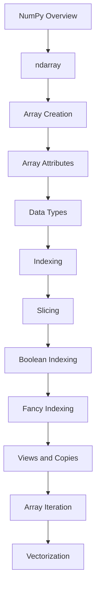

# README

## Overview

This section establishes the practical foundation for NumPy used throughout the engineering playbook.

NumPy is treated here as a numerical processing layer for Python applications, backend services, ETL pipelines, batch workloads, and performance-sensitive data processing. The emphasis is on understanding how `ndarray` works, how data is represented in memory, and how to process numerical data efficiently without turning the material into a scientific-computing curriculum.

The progression is:


The section is intentionally focused on the concepts that support practical backend and data-engineering workloads.

## Navigation

| # | File | Description |
|---|---|---|
| 01 | [01- NumPy Overview](./01-%20NumPy%20Overview.md) | NumPy's role in Python data processing and the ndarray-based mental model |
| 02 | [02- ndarray](./02-%20ndarray.md) | Internal and structural model of ndarray |
| 03 | [03- Array Creation](./03-%20Array%20Creation.md) | How arrays are created and how construction choices affect memory and dtype |
| 04 | [04- Array Attributes](./04-%20Array%20Attributes.md) | Array metadata for debugging and performance analysis |
| 05 | [05- Data Types](./05-%20Data%20Types.md) | NumPy dtype semantics and their impact on numerical correctness and memory |
| 06 | [06- Indexing](./06-%20Indexing.md) | NumPy's general indexing model |
| 07 | [07- Slicing](./07-%20Slicing.md) | start:stop:step slicing and its memory behavior |
| 08 | [08- Boolean Indexing](./08-%20Boolean%20Indexing.md) | Mask-based filtering and conditional selection |
| 09 | [09- Fancy Indexing](./09-%20Fancy%20Indexing.md) | Advanced indexing through integer index arrays |
| 10 | [10- Views and Copies](./10-%20Views%20and%20Copies.md) | NumPy's memory-sharing model |
| 11 | [11- Array Iteration](./11-%20Array%20Iteration.md) | When explicit iteration is appropriate vs array-level operations |
| 12 | [12- Vectorization](./12-%20Vectorization.md) | Array-wide numerical processing and its performance characteristics |

## What This Section Covers

| Area | Focus |
|---|---|
| `ndarray` | Core data model and array semantics |
| Array Creation | Constructing arrays with appropriate shapes and dtypes |
| Array Attributes | Inspecting shape, dimensions, size, memory, and layout |
| Data Types | Precision, range, memory usage, and dtype behavior |
| Indexing | Positional and multidimensional selection |
| Slicing | Views, ranges, strides, and batch selection |
| Boolean Indexing | Mask-based filtering and validation |
| Fancy Indexing | Arbitrary position selection and reordering |
| Views and Copies | Ownership, memory sharing, and mutation |
| Array Iteration | Python iteration vs array-level processing |
| Vectorization | Efficient array-wide numerical computation |


## Recommended Learning Flow

The material is designed to be read in order because later performance concepts depend on earlier data-model concepts.



The progression moves from:

```text
Data model
    ↓
Array construction
    ↓
Array inspection
    ↓
Data representation
    ↓
Data selection
    ↓
Memory behavior
    ↓
Execution strategy
    ↓
Performance
```

This makes it easier to understand why NumPy behaves the way it does instead of learning APIs independently.

## Core Engineering Concepts

The most important ideas in this section are not individual functions. They are the relationships between NumPy's data model, execution model, and memory model.

### Data Model

Understand:

```text
ndarray
├── shape
├── dtype
├── size
├── strides
└── memory ownership
```

These properties explain how NumPy interprets and stores numerical data.

### Selection Model

Understand the distinction between:

```text
Indexing
Slicing
Boolean indexing
Fancy indexing
```

These mechanisms differ in shape behavior and memory allocation.

### Memory Model

Understand:

```text
View
vs
Copy
```

and how those choices affect:

- Mutation.
- Lifetime.
- Peak memory.
- Performance.

### Execution Model

Understand:

```text
Python loop
vs
Vectorized operation
```

The goal is not to eliminate Python loops indiscriminately. It is to keep dense numerical work inside NumPy where array-level execution provides a meaningful benefit.

## Backend and Data-Engineering Context

NumPy is most useful when it sits inside a larger processing architecture.


Other common patterns include:

```text
PostgreSQL
    ↓
Batch extraction
    ↓
NumPy numerical processing
    ↓
Persist aggregates
```

```text
Kafka
    ↓
Consumer batches
    ↓
NumPy transformation
    ↓
Database / Object Storage
```

```text
Large File
    ↓
Chunked / Memory-Mapped Access
    ↓
NumPy Processing
    ↓
Output File
```

The objective is to use NumPy where dense numerical computation provides a meaningful advantage.

## Production Principles

### Validate Before Allocating

Do not allocate arrays based on untrusted dimensions without limits.

Validate:

- Element count.
- Shape.
- Batch size.
- Dtype expectations.
- Request size.

### Treat Memory as a First-Class Constraint

Monitor:

```text
Input arrays
+
Masks
+
Temporary arrays
+
Output arrays
+
Application runtime
```

`array.nbytes` is useful, but process-level RSS is the operational metric that matters for container and worker sizing.

### Make Ownership Explicit

Know whether a function:

- Mutates its input.
- Returns a view.
- Returns a copy.
- Requires independent storage.

This prevents subtle shared-memory bugs.

### Prefer Bounded Processing for Large Data

For large datasets:

```text
Read batch
    ↓
Process
    ↓
Persist
    ↓
Release
    ↓
Read next batch
```

This provides predictable memory usage and clearer retry boundaries.

### Benchmark Before Optimizing

Measure:

- CPU time.
- Peak memory.
- Allocation behavior.
- Throughput.
- Batch size effects.
- End-to-end latency.

Avoid absolute claims such as "NumPy is always faster."

## Relationship with Pandas

The two libraries solve different problems.

| Concern | NumPy | Pandas |
|---|---|---|
| Dense numerical arrays | Strong | Supported |
| Homogeneous numerical computation | Strong | Supported |
| Labeled tabular data | Limited | Strong |
| Joins | Not primary | Strong |
| Grouping | Basic numerical reductions | Strong |
| Dataframe-oriented ETL | Limited | Strong |
| Vectorized numerical operations | Strong | Strong |
| Memory layout control | Strong | More abstract |
| General numerical foundation | Strong | Built on higher-level abstractions |

A common processing flow is:

```text
Pandas
→ select / clean / organize tabular data
→ NumPy
→ numerical transformation
→ Pandas / storage
```

Do not treat NumPy as a replacement for Pandas or Python collections.

## Relationship with Python

NumPy complements Python rather than replacing its native structures.

Use Python collections and domain models for:

- Business entities.
- Configuration.
- Request models.
- Heterogeneous application state.
- General control flow.

Use NumPy for:

- Dense numerical arrays.
- Batch numerical transformations.
- Vectorized computation.
- Numerical validation.
- Numerical aggregation.
- Performance-sensitive array processing.

A mature backend codebase commonly uses both.

## Practical Projects

The concepts in this section directly support the practical projects in the separate `py-data-sandbox` repository.

### Numerical Data Processor

Applies:

- Array creation.
- Validation.
- Indexing.
- Boolean masks.
- Aggregation.
- Data transformation.
- Production-oriented pipeline structure.

### Vectorized Data Transformation

Applies:

- Vectorization.
- Broadcasting.
- Masking.
- Dtype decisions.
- Efficient transformations.
- Memory-aware numerical processing.

### Performance Benchmarking

Applies:

- Python vs NumPy comparisons.
- Vectorization benchmarks.
- Dtype comparisons.
- Views vs copies.
- Broadcasting behavior.
- Memory analysis.
- Benchmark methodology.

The projects are intended to demonstrate the concepts in runnable code. The engineering playbook explains the design and trade-offs; the project repository contains the implementation.

## What to Pay Special Attention To

The highest-value concepts for backend and data-engineering work are:

```text
ndarray
    ↓
shape / ndim / size
    ↓
dtype
    ↓
indexing / slicing
    ↓
boolean masking
    ↓
views vs copies
    ↓
broadcasting
    ↓
vectorization
    ↓
memory efficiency
    ↓
batch processing
    ↓
benchmarking
```

These concepts also form a strong foundation for understanding more advanced NumPy and Pandas processing patterns later.

## Interview Focus

The most important interview topics from this section are:

- Why NumPy arrays are generally efficient for numerical workloads.
- Homogeneous array storage.
- `shape`, `ndim`, `size`, `dtype`, and `nbytes`.
- View vs copy semantics.
- Boolean indexing.
- Fancy indexing.
- Broadcasting.
- Vectorization.
- Contiguous vs non-contiguous arrays.
- Dtype-driven memory usage.
- Temporary allocations.
- Batch processing of large numerical datasets.
- When to use NumPy vs Python lists.
- When to use NumPy vs Pandas.
- CPU versus memory trade-offs.
- Why vectorization does not automatically mean lower memory usage.

Interview preparation should focus on behavior and trade-offs rather than memorizing obscure NumPy APIs.

## Practical Reference

A compact diagnostic snippet:

```python
import numpy as np


def inspect_array(values: np.ndarray) -> None:
    print("shape:", values.shape)
    print("ndim:", values.ndim)
    print("size:", values.size)
    print("dtype:", values.dtype)
    print("itemsize:", values.itemsize)
    print("nbytes:", values.nbytes)
    print("strides:", values.strides)
    print("c_contiguous:", values.flags.c_contiguous)
    print("f_contiguous:", values.flags.f_contiguous)
    print("owndata:", values.flags.owndata)
    print("writeable:", values.flags.writeable)
```

A practical processing pattern:

```python
import numpy as np


def process_batch(values: np.ndarray) -> dict[str, float | int]:
    if values.ndim != 1:
        raise ValueError("Expected a one-dimensional array")

    if values.size == 0:
        raise ValueError("Input cannot be empty")

    if not np.isfinite(values).all():
        raise ValueError("Input contains non-finite values")

    transformed = values * 1.05

    return {
        "count": int(transformed.size),
        "sum": float(transformed.sum()),
        "mean": float(transformed.mean()),
    }
```

The pattern illustrates the intended engineering style:

```text
Validate
   ↓
Vectorize
   ↓
Aggregate
   ↓
Convert at the application boundary
```

## Common Mistakes Across the Section

Several mistakes repeatedly cause NumPy production problems:

| Mistake | Typical Consequence |
|---|---|
| Using Python loops for dense numerical work | Higher interpreter overhead |
| Choosing oversized dtypes | Excess memory usage |
| Choosing undersized dtypes | Overflow / precision loss |
| Assuming slices always copy | Unexpected mutation |
| Assuming advanced indexing is zero-copy | Unexpected allocations |
| Retaining small views of huge arrays | Hidden memory retention |
| Ignoring temporary arrays | High peak RSS |
| Filtering without tracking invalid data | Silent data-quality loss |
| Processing unbounded batches | Worker instability |
| Assuming vectorization is always faster | Incorrect optimization decisions |
| Ignoring shape semantics | Incorrect numerical results |
| Moving simple database work to Python | Unnecessary data transfer |

These are more important to understand than memorizing the complete NumPy API.

## Key Takeaways

- NumPy fundamentals are built around understanding `ndarray`, shape, dtype, indexing, memory ownership, and array-level computation.
- Slicing, boolean indexing, and fancy indexing are not interchangeable: they differ in selection semantics, shape behavior, and memory allocation.
- Vectorization is the preferred execution model for dense numerical transformations, but memory usage, temporary arrays, dtype, and algorithmic complexity still determine real-world performance.
- Production NumPy pipelines should use explicit validation, bounded batches, intentional ownership, appropriate dtypes, and measured performance tuning.
- NumPy complements Python and Pandas: use it as a numerical processing foundation rather than as a replacement for general-purpose application structures or dataframe-oriented workflows.