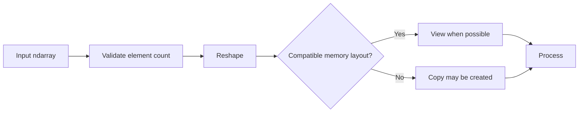

# 01- Reshape

## Overview

Reshaping changes how an `ndarray` is interpreted across its dimensions without changing the underlying values.

For backend and data-engineering workloads, reshaping is useful when the same numerical data must move between representations such as:

- Flat records and batched records
- Rows and columns
- Input batches and model-independent numerical stages
- File-oriented storage layouts and in-memory processing layouts
- One-dimensional streams and multidimensional processing buffers

The important engineering distinction is that `reshape()` primarily changes array metadata. Depending on the source array's layout and the requested shape, NumPy may return a view or create a copy.



Reshaping should therefore be understood as both a **shape operation** and a **memory-behavior decision**.

## What Reshape Means

An array has a fixed number of elements:

```python
import numpy as np

values = np.arange(12)

print(values.shape)
# (12,)
```

The same 12 elements can be interpreted as different shapes:

```python
import numpy as np

values = np.arange(12)

matrix = values.reshape(3, 4)

print(matrix)
```

```text
[[ 0  1  2  3]
 [ 4  5  6  7]
 [ 8  9 10 11]]
```

The total element count must remain compatible:

```text
12
→ (3, 4)
→ (2, 6)
→ (4, 3)
→ (1, 12)
```

But:

```text
12
→ (5, 3)
```

is invalid because `5 × 3 = 15`.

The key invariant is:

```text
new_shape product == array.size
```

unless a dimension of `-1` is used to let NumPy infer that dimension.

## Why Reshape Exists

Data frequently arrives in one physical representation while downstream processing expects another logical representation.

For example:

```text
Flat input
[1000 values]
      ↓
reshape
(250 records, 4 metrics)
```

This is common when processing:

- Fixed-width numerical records
- Batched API payloads
- Binary files
- Numerical buffers
- Preallocated processing arrays
- ETL batches

Reshaping avoids unnecessary Python-level reconstruction of the data structure.

## Basic Reshaping

The primary API is `ndarray.reshape()` or `np.reshape()`.

```python
import numpy as np

values = np.arange(12)

rows = values.reshape(3, 4)
columns = values.reshape(4, 3)

print(rows.shape)
# (3, 4)

print(columns.shape)
# (4, 3)
```

The original array remains unchanged:

```python
print(values.shape)
# (12,)
```

A useful pattern is to assign the new representation explicitly rather than relying on mutation.

## Shape Validation

Before reshaping externally supplied or dynamically sized data, validate the intended shape.

```python
import numpy as np


def reshape_batch(values: np.ndarray, batch_size: int) -> np.ndarray:
    if values.ndim != 1:
        raise ValueError("Expected a one-dimensional input")

    if batch_size <= 0:
        raise ValueError("batch_size must be positive")

    if values.size % batch_size != 0:
        raise ValueError(
            "Input size must be divisible by batch_size"
        )

    return values.reshape(-1, batch_size)
```

This is preferable to blindly trusting request parameters.

For backend services, shape inputs can originate from:

- HTTP request payloads
- Message metadata
- File headers
- Database configuration
- Job parameters

Unvalidated dimensions can lead to incorrect processing or excessive allocations when combined with later operations.

## Using `-1`

A single dimension can be inferred:

```python
import numpy as np

values = np.arange(24)

matrix = values.reshape(6, -1)

print(matrix.shape)
# (6, 4)
```

NumPy calculates:

```text
24 / 6 = 4
```

Only one dimension may be inferred.

```python
values.reshape(-1, -1)
```

is invalid because NumPy cannot infer two independent dimensions.

Using `-1` is useful when one dimension is known and the other depends on runtime batch size.

```python
def to_records(values: np.ndarray, fields_per_record: int) -> np.ndarray:
    if fields_per_record <= 0:
        raise ValueError("fields_per_record must be positive")

    if values.size % fields_per_record != 0:
        raise ValueError("Incomplete record")

    return values.reshape(-1, fields_per_record)
```

## Reshaping Multidimensional Arrays

Reshape is not limited to one-dimensional arrays.

```python
import numpy as np

values = np.arange(24).reshape(2, 3, 4)

print(values.shape)
# (2, 3, 4)

reshaped = values.reshape(6, 4)

print(reshaped.shape)
# (6, 4)
```

The total element count remains:

```text
2 × 3 × 4 = 24
6 × 4     = 24
```

This is useful for collapsing logical dimensions before applying a vectorized operation.

## Order and Element Traversal

Reshape needs an ordering convention when mapping existing elements into the new shape.

The default order is C-style, where the last axis changes fastest.

```python
import numpy as np

values = np.arange(6)

matrix = values.reshape(2, 3)

print(matrix)
```

```text
[[0 1 2]
 [3 4 5]]
```

Conceptually:

```text
Flat:
0 1 2 3 4 5

Reshape (2, 3):

0 1 2
3 4 5
```

The `order` parameter can control interpretation.

```python
matrix = values.reshape(2, 3, order="C")
```

```python
matrix = values.reshape(2, 3, order="F")
```

For most backend pipelines, the safest approach is to use the default unless the storage format or downstream algorithm explicitly requires a different layout.

Do not use `order="F"` as a performance optimization without benchmarking the complete workload.

## Reshape and Memory

A critical production detail is that `reshape()` can return a view when possible.

```python
import numpy as np

values = np.arange(12)

reshaped = values.reshape(3, 4)

print(np.shares_memory(values, reshaped))
# True
```

Mutating the reshaped array can therefore affect the original:

```python
reshaped[0, 0] = 999

print(values[0])
# 999
```

This is expected behavior when the result shares memory.

The right mental model is:

```text
reshape
   ↓
try to reinterpret existing storage
   ↓
view when possible
   ↓
otherwise copy if necessary
```

Do not build correctness logic around the assumption that every reshape is guaranteed to be zero-copy.

## When Reshape Produces a Copy

Non-contiguous arrays can make a requested reshape incompatible with the current memory layout.

```python
import numpy as np

values = np.arange(12).reshape(3, 4)

transposed = values.T

reshaped = transposed.reshape(-1)
```

The result may require a copy because the transposed view has different strides.

Inspect memory behavior when it matters:

```python
print(np.shares_memory(transposed, reshaped))
```

For complex workloads, `np.shares_memory()` is more reliable than using `.base` alone as an ownership test.

### Why This Matters

In a large worker process:

```text
Input:          500 MB
Temporary copy: 500 MB
Other buffers:  300 MB
-----------------------
Peak:         ~1.3 GB
```

A reshape that unexpectedly triggers a copy can therefore turn a healthy batch process into an out-of-memory workload.

## Reshape vs Copy

When independent storage is required, copy explicitly.

```python
reshaped = values.reshape(3, 4).copy()
```

This communicates intent:

```text
reshape only
→ preserve sharing when possible

reshape + copy
→ create independent storage
```

The copy has a memory and CPU cost, but the ownership semantics are easier to reason about.

## Reshape vs Flatten vs Ravel

These operations are related but not interchangeable.

| Operation | Purpose | Copy behavior |
|---|---|---|
| `reshape()` | Change shape | View when possible, otherwise may copy |
| `ravel()` | Return a one-dimensional representation | View when possible, otherwise copy |
| `flatten()` | Return a one-dimensional independent array | Always copies |
| `resize()` | Change array size/shape | Different semantics; can modify in place |

Example:

```python
import numpy as np

values = np.arange(12).reshape(3, 4)

reshaped = values.reshape(2, 6)
raveled = values.ravel()
flattened = values.flatten()
```

A practical rule:

```text
Need a different shape?
→ reshape()

Need a 1-D view when possible?
→ ravel()

Need an independent 1-D array?
→ flatten()
```

Use `resize()` only when its specific in-place or size-changing semantics are intended.

## `resize()` Is Not Just Another Reshape

`reshape()` preserves the number of elements.

`resize()` can change the total number of elements.

```python
import numpy as np

values = np.arange(6)

values.resize(2, 4)

print(values)
```

`resize()` fills newly created positions when growing an array.

Because this changes the underlying array and can have surprising effects when storage is shared, it is generally less predictable for reusable backend processing functions.

For transformations, prefer:

```python
new_values = values.reshape(...)
```

over mutating the caller's array with `resize()` unless in-place resizing is an intentional part of the design.

## Reshape and Batch Processing

Reshaping is especially useful when incoming numerical data is already flat.

For example, a batch may contain four measurements per record:

```text
temperature
humidity
pressure
voltage
```

A flat array can be converted into records:

```python
import numpy as np

raw = np.array(
    [
        21.5, 42.0, 1012.4, 3.3,
        22.1, 43.2, 1011.8, 3.4,
        21.8, 41.7, 1013.1, 3.2,
    ],
    dtype=np.float32,
)

records = raw.reshape(-1, 4)
```

Now:

```text
records.shape == (3, 4)
```

The processing stage can operate by column:

```python
temperature = records[:, 0]
humidity = records[:, 1]
pressure = records[:, 2]
voltage = records[:, 3]
```

This is a common pattern for batch numerical processing because the data remains compact and vectorizable.

## Reshape and Broadcasting

Reshape often prepares arrays for broadcasting.

Consider per-feature normalization:

```python
import numpy as np

values = np.array(
    [
        [10.0, 20.0, 30.0],
        [12.0, 18.0, 33.0],
        [11.0, 21.0, 29.0],
    ],
    dtype=np.float64,
)

offsets = np.array([1.0, 2.0, 3.0])

normalized = values - offsets
```

The shapes are:

```text
values  → (3, 3)
offsets → (3,)
```

If the values must be interpreted as a column vector instead:

```python
offsets = offsets.reshape(-1, 1)
```

Now:

```text
values  → (3, 3)
offsets → (3, 1)
```

Broadcasting can therefore be viewed as a downstream consumer of correct shape design.

## Shape Contracts

For production code, document expected shapes at function boundaries.

```python
import numpy as np
from numpy.typing import NDArray


def calculate_totals(
    records: NDArray[np.float64],
) -> NDArray[np.float64]:
    if records.ndim != 2:
        raise ValueError("records must be two-dimensional")

    if records.shape[1] != 4:
        raise ValueError("records must contain four fields")

    return records.sum(axis=1)
```

This is often more important than documenting the individual NumPy calls.

A useful shape contract includes:

| Property | Example |
|---|---|
| Number of dimensions | `2` |
| Shape | `(batch_size, 4)` |
| Meaning of axis 0 | Records |
| Meaning of axis 1 | Features |
| Dtype | `float64` |
| Missing values | Not allowed |

Shape bugs are often semantic bugs rather than syntax errors.

## Reshape at Service Boundaries

Consider a FastAPI endpoint receiving a batch of numeric values.

The application should separate:

```text
HTTP validation
      ↓
Domain validation
      ↓
NumPy conversion
      ↓
Shape validation
      ↓
Numerical processing
      ↓
Persistence / response
```

A simplified processing function:

```python
import numpy as np


def process_metrics(
    values: list[float],
    metrics_per_record: int,
) -> np.ndarray:
    array = np.asarray(values, dtype=np.float64)

    if metrics_per_record <= 0:
        raise ValueError("metrics_per_record must be positive")

    if array.size % metrics_per_record != 0:
        raise ValueError("Incomplete record")

    records = array.reshape(-1, metrics_per_record)

    return records.mean(axis=1)
```

The key engineering principle is that the shape should represent a known domain structure.

## Reshape and File Processing

Binary or flat numerical files frequently need shape reconstruction.

```text
File bytes
   ↓
dtype interpretation
   ↓
1-D ndarray
   ↓
shape validation
   ↓
reshape
   ↓
batch processing
```

For a large file, avoid loading and reshaping the entire dataset if the workload can be processed in bounded chunks.

A memory-mapped representation can be useful:

```python
import numpy as np

values = np.memmap(
    "metrics.dat",
    dtype=np.float32,
    mode="r",
)

records = values.reshape(-1, 8)
```

The important point is that `reshape()` does not itself make a large dataset memory efficient. The efficiency comes from controlling how the data is loaded and accessed.

## Large Dataset Considerations

For large arrays, evaluate:

- Element count.
- Dtype size.
- Contiguity.
- Whether reshape can remain a view.
- Downstream temporary allocations.
- Batch size.
- Memory-mapped storage.
- Peak process RSS.

For example:

```python
import numpy as np

values = np.empty(10_000_000, dtype=np.float32)

print(values.nbytes)
# ~40,000,000 bytes
```

Reshaping this to `(2_000_000, 5)` does not inherently reduce memory:

```python
records = values.reshape(2_000_000, 5)

print(records.nbytes)
# ~40,000,000 bytes
```

The shape changes; the data volume does not.

## Reshape and Contiguity

Contiguity describes whether an array's elements follow a layout that is efficient for particular access patterns.

```python
values = np.arange(24).reshape(4, 6)

print(values.flags.c_contiguous)
# True
```

After a transpose:

```python
transposed = values.T

print(transposed.flags.c_contiguous)
# False
```

Reshaping the transposed array may require additional storage.

This matters because a code path that repeatedly performs:

```text
transpose
→ reshape
→ copy
```

can become significantly more expensive at scale.

Before optimizing, benchmark the actual workload rather than assuming every non-contiguous operation is problematic.

## Reshape and Axis Semantics

Shape alone is not enough. The meaning of each axis matters.

Consider:

```python
values.shape == (1000, 24)
```

This could mean:

```text
1000 records × 24 measurements
```

or:

```text
1000 hours × 24 locations
```

The same shape can represent completely different data.

Senior-level NumPy code therefore treats shape as part of the data contract, not merely as metadata.

A useful convention is to document axes explicitly:

```text
axis 0 → records
axis 1 → metrics
```

For APIs and reusable functions, this prevents silent semantic errors.

## Common Mistakes

### Assuming Reshape Always Copies

It usually attempts to return a view when possible.

**Why it matters:** mutations may affect the original array, and copies may unexpectedly increase memory usage.

**Avoid it:** understand ownership and verify sharing when necessary.

### Ignoring Element Count

```python
values.reshape(10, 10)
```

fails unless the array contains exactly 100 compatible elements.

**Avoid it:** validate input size and shape contracts before reshaping.

### Using `flatten()` When a View Is Sufficient

`flatten()` creates an independent array.

For large data, that can produce an unnecessary allocation.

Use `ravel()` when a one-dimensional view is acceptable.

### Treating Shape as Mere Syntax

A `(batch, features)` array and a `(features, batch)` array can contain the same number of values while representing different semantics.

**Avoid it:** document axis meanings.

### Reshaping Without Considering Downstream Operations

A reshape may appear cheap but lead to a later copy, transpose, or non-contiguous access pattern.

**Avoid it:** optimize the complete processing pipeline, not a single line.

### Using `resize()` for Routine Shape Changes

`resize()` can modify the original array and change its element count.

**Avoid it:** use `reshape()` for ordinary shape reinterpretation.

### Trusting External Shape Parameters

A request parameter that controls shape can result in extremely large allocations if used carelessly.

**Avoid it:** validate maximum dimensions and total element counts at the service boundary.

## Performance Considerations

Reshape itself is often inexpensive when it can reinterpret existing memory.

The expensive case is when a copy is required.

A useful cost model is:

```text
View reshape
→ metadata change
→ approximately O(1) setup

Copying reshape
→ allocate destination
→ move N elements
→ approximately O(N)
```

The exact runtime depends on memory layout, dtype, system memory bandwidth, and subsequent operations.

Measure both execution time and memory.

```python
from time import perf_counter

start = perf_counter()
result = values.reshape(new_shape)
elapsed = perf_counter() - start

print(f"reshape time: {elapsed:.6f}s")
```

For reliable benchmarks:

- Warm up code paths where appropriate.
- Run multiple repetitions.
- Measure representative data sizes.
- Measure peak memory separately.
- Avoid benchmarking tiny arrays and extrapolating to production workloads.

## Testing Shape Transformations

Shape transformations should have explicit tests.

```python
import numpy as np
import pytest


def test_reshape_preserves_values():
    values = np.arange(12)

    result = values.reshape(3, 4)

    assert result.shape == (3, 4)
    np.testing.assert_array_equal(
        result.ravel(),
        values,
    )


def test_reshape_rejects_incompatible_size():
    values = np.arange(10)

    with pytest.raises(ValueError):
        values.reshape(3, 4)
```

For production pipelines, also test:

- Empty input.
- Minimum batch size.
- Maximum supported batch size.
- Different dtypes.
- Non-contiguous input where relevant.
- Invalid dimensions.
- Partial batches.
- Memory-sensitive workloads.

## Debugging Shape Problems

When a numerical result is incorrect, inspect:

```python
print("shape:", values.shape)
print("ndim:", values.ndim)
print("dtype:", values.dtype)
print("strides:", values.strides)
print("contiguous:", values.flags.c_contiguous)
```

For more detailed debugging:

```python
print("size:", values.size)
print("nbytes:", values.nbytes)
print("owns data:", values.flags.owndata)
```

A practical debugging sequence is:

```text
Check shape
   ↓
Check dtype
   ↓
Check axis meaning
   ↓
Check strides / contiguity
   ↓
Check view/copy behavior
   ↓
Check downstream broadcasting
```

## Interview Questions

### What must be true for a reshape to succeed?

The requested shape must describe the same total number of elements.

```text
new dimensions product == array.size
```

A `-1` dimension can be inferred once.

### Does `reshape()` always return a view?

No. NumPy attempts a view when the memory layout permits it, but a copy may be required.

### Why can reshaping a transposed array be more expensive?

A transpose commonly creates a non-contiguous view with different strides. Some target shapes cannot be represented through metadata changes alone, so NumPy may allocate and copy data.

### What is the difference between `reshape()` and `flatten()`?

`reshape()` changes shape and may return a view.

`flatten()` returns a one-dimensional copy.

### Why is `-1` useful?

It allows one dimension to be inferred from the known element count, which is useful when batch size is dynamic.

### Why should shape be treated as a contract?

Because a valid NumPy shape can still represent the wrong business semantics. `(100, 4)` and `(4, 100)` contain the same number of elements but can mean entirely different things.

### How would you reshape an untrusted batch safely?

Validate:

1. The input type.
2. Maximum element count.
3. Intended dimensions.
4. Divisibility or exact element count.
5. Dtype and numerical constraints.

Then perform the reshape.

## Key Takeaways

- `reshape()` changes an array's dimensional interpretation while preserving the total number of elements; one dimension may be inferred with `-1`.
- Reshape can be a low-cost view or require an `O(N)` copy depending on memory layout, so ownership and contiguity matter in production.
- Shape is a data contract: document what each axis means rather than treating dimensions as arbitrary metadata.
- For large numerical pipelines, combine reshape with bounded batching, appropriate dtypes, memory-aware processing, and explicit validation.
- Use `reshape()`, `ravel()`, `flatten()`, and `resize()` according to their distinct memory and mutation semantics rather than treating them as interchangeable.