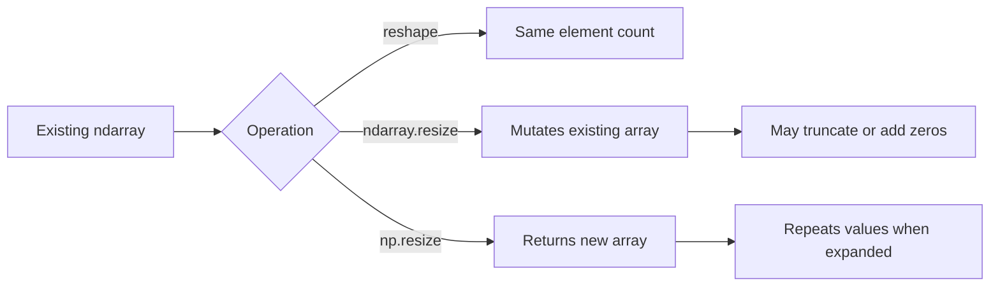
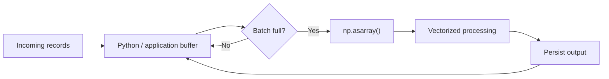

# 02- Resize

## Overview

NumPy provides two related operations for changing an array's size:

- `ndarray.resize()` changes the existing array in place when possible.
- `np.resize()` returns a new array and repeats the input data if the requested size is larger.

These operations are easy to confuse because their names are nearly identical while their semantics are substantially different.

For production engineering, `resize()` should therefore be treated as a distinct concern from `reshape()`:

```text
reshape()
→ changes dimensions
→ preserves element count

resize()
→ changes dimensions and/or element count
→ may truncate or add values
```

This distinction matters for correctness, memory behavior, mutation, and long-running backend workers.



## Resize vs Reshape

The most important distinction is whether the number of elements is allowed to change.

| Operation | Changes shape | Changes element count | Mutates input | Copy behavior |
|---|---:|---:|---:|---|
| `reshape()` | Yes | No | No | View when possible |
| `ndarray.resize()` | Yes | Yes | Yes | May reallocate |
| `np.resize()` | Yes | Yes | No | Returns a new array |
| `ravel()` | Flattens | No | No | View when possible |
| `flatten()` | Flattens | No | No | Always copies |

Use `reshape()` when the data already contains the correct number of elements.

Use resizing only when changing the number of elements is actually part of the required behavior.

## `ndarray.resize()`

The method form modifies the existing array.

```python
import numpy as np

values = np.array([10, 20, 30, 40])

values.resize(6)

print(values)
# [10 20 30 40  0  0]
```

When growing an array, newly created elements are initialized to zero.

When shrinking it, trailing elements are discarded:

```python
import numpy as np

values = np.array([10, 20, 30, 40])

values.resize(2)

print(values)
# [10 20]
```

The operation mutates the original object:

```python
values = np.array([1, 2, 3])

values.resize(2)

print(values)
# [1 2]
```

This is fundamentally different from `reshape()`:

```python
values = np.array([1, 2, 3, 4])

reshaped = values.reshape(2, 2)

print(values.shape)
# (4,)
```

`reshape()` does not change the original array's shape.

## Why `ndarray.resize()` Exists

In-place resizing can be useful when an application owns the array and needs to change its storage size without constructing an entirely separate application-level object.

Typical cases include:

- Controlled numerical preprocessing.
- Incremental buffer management.
- Internal array construction.
- Memory owned exclusively by one processing stage.

However, resizing an array is not equivalent to dynamically growing a Python list. Repeated resizing can result in repeated allocations and data movement, depending on the underlying storage and requested sizes.

For high-throughput pipelines, preallocation or bounded batches are often better choices.

## Growing an Array

```python
import numpy as np

values = np.array([1, 2, 3], dtype=np.int64)

values.resize(5)

print(values)
# [1 2 3 0 0]
```

The new positions contain zeros appropriate to the dtype.

This can be useful when zero is a meaningful default:

```python
import numpy as np

counters = np.array([12, 8, 19], dtype=np.int64)

counters.resize(5)

print(counters)
# [12  8 19  0  0]
```

It should not be used when newly allocated positions must instead contain validated domain values.

## Shrinking an Array

Shrinking discards values beyond the new size.

```python
import numpy as np

values = np.arange(10)

values.resize(4)

print(values)
# [0 1 2 3]
```

This is destructive.

If the discarded values may still be needed, create an explicit copy before resizing or use another data structure.

## Multidimensional Resize

`ndarray.resize()` can accept a shape.

```python
import numpy as np

values = np.arange(6).reshape(2, 3)

values.resize(3, 3)

print(values)
```

```text
[[0 1 2]
 [3 4 5]
 [0 0 0]]
```

The result keeps the existing values and fills the newly created positions with zeros.

The resulting shape is:

```python
print(values.shape)
# (3, 3)
```

The element count changes from:

```text
2 × 3 = 6
```

to:

```text
3 × 3 = 9
```

## `np.resize()`

The function form has different semantics.

```python
import numpy as np

values = np.array([1, 2, 3])

result = np.resize(values, 8)

print(result)
# [1 2 3 1 2 3 1 2]
```

When the requested output is larger than the input, NumPy repeats the original data.

This is the critical distinction:

```text
ndarray.resize()
→ expands with zeros

np.resize()
→ repeats existing values
```

That difference can produce very different application behavior.

## `np.resize()` When Shrinking

When the requested output is smaller, the repeated sequence is simply truncated.

```python
import numpy as np

values = np.array([10, 20, 30, 40])

result = np.resize(values, 2)

print(result)
# [10 20]
```

The input remains unchanged:

```python
print(values)
# [10 20 30 40]
```

This makes `np.resize()` suitable for cases where a new array is intentionally required.

## `np.resize()` and Multidimensional Output

The function can also create a requested multidimensional shape.

```python
import numpy as np

values = np.array([1, 2, 3, 4])

result = np.resize(values, (3, 3))

print(result)
```

```text
[[1 2 3]
 [4 1 2]
 [3 4 1]]
```

The source values are repeated in flattened order until the destination contains the requested number of elements.

This behavior is often surprising when developers expect zero-padding.

## `np.resize()` Is Not Zero Padding

Do not use:

```python
np.resize(values, larger_shape)
```

when the requirement is:

```text
preserve original values
+
fill remaining positions with zeros
```

Instead, use explicit allocation:

```python
import numpy as np

values = np.array([1, 2, 3], dtype=np.int64)

result = np.zeros(5, dtype=values.dtype)
result[: values.size] = values

print(result)
# [1 2 3 0 0]
```

This makes the desired behavior explicit and prevents accidental repetition.

## `np.pad()` for Structured Padding

If the requirement is deliberate padding rather than resizing semantics, `np.pad()` is usually clearer.

```python
import numpy as np

values = np.array([10, 20, 30])

result = np.pad(
    values,
    pad_width=(0, 2),
    mode="constant",
)

print(result)
# [10 20 30  0  0]
```

This is preferable when padding is part of the data transformation itself.

The distinction becomes:

```text
resize()
→ change array size

pad()
→ explicitly add boundary data
```

## Safe API Selection

A practical decision table:

| Requirement | Recommended operation |
|---|---|
| Same values, different dimensions | `reshape()` |
| Change size of owned mutable array | `ndarray.resize()` |
| Create new array and intentionally repeat data | `np.resize()` |
| Add explicit padding | `np.pad()` |
| Flatten without requiring a copy | `ravel()` |
| Flatten with independent storage | `flatten()` |
| Incrementally collect unknown-size data | Python list / chunked buffer |

Choosing the API based on the intended data semantics is more important than choosing based on naming similarity.

## Memory Behavior of `ndarray.resize()`

When an array grows, additional storage may be required.

Conceptually:

```text
Existing buffer
      ↓
Need larger buffer
      ↓
Allocate / reallocate
      ↓
Move or preserve existing values
      ↓
Initialize new region
```

The operation may therefore have an `O(N)` data movement cost when storage must be reallocated.

This makes repeated growth potentially expensive:

```python
import numpy as np

values = np.empty(0, dtype=np.float64)

for _ in range(10_000):
    values.resize(values.size + 1)
```

This pattern is not a good substitute for dynamic collection structures.

Prefer:

```python
values = []

for item in incoming_values:
    values.append(item)

array = np.asarray(values, dtype=np.float64)
```

or use bounded NumPy batches when the workload is large.

## Why Repeated Resize Can Be Expensive

Suppose an array repeatedly grows:

```text
10
→ 20
→ 30
→ 40
→ ...
```

If each growth requires new storage and data movement, the same elements may be copied repeatedly.

For unpredictable input sizes, a more scalable architecture is:



This avoids making NumPy responsible for general-purpose dynamic collection.

## Ownership and Views

`ndarray.resize()` has an important restriction: resizing can be unsafe when other arrays may share the same data.

Consider:

```python
import numpy as np

values = np.arange(6)
view = values[::2]
```

`view` shares storage with `values`.

Attempting to resize the original array may fail because changing the underlying allocation could invalidate the view.

The exact behavior is controlled by NumPy's ownership and reference checks.

Use explicit ownership:

```python
values = np.asarray(values).copy()
values.resize(...)
```

when a function needs to take exclusive ownership before performing destructive operations.

Do not assume that having a Python reference to an array is enough to establish exclusive ownership.

## `refcheck`

The method accepts a `refcheck` parameter.

```python
values.resize((10,), refcheck=True)
```

With the default behavior, NumPy checks for references that could make in-place resizing unsafe.

Disabling the check:

```python
values.resize((10,), refcheck=False)
```

is an advanced operation and should not be treated as a general performance switch.

If other references or views exist, bypassing safety checks can lead to unsafe behavior.

Use `refcheck=False` only when ownership and lifetime are controlled by design and the implications are understood.

## Resize in Backend Pipelines

An application should rarely expose raw array resizing as part of a public API contract.

Instead, keep array-size management inside a controlled processing layer.

```text
HTTP / gRPC Request
        ↓
Schema Validation
        ↓
Bounded Input
        ↓
NumPy Conversion
        ↓
Explicit Shape / Size Validation
        ↓
Numerical Processing
        ↓
Persistence
```

For example:

```python
import numpy as np


def normalize_batch(values: list[float], target_size: int) -> np.ndarray:
    array = np.asarray(values, dtype=np.float64)

    if target_size <= 0:
        raise ValueError("target_size must be positive")

    if array.size > target_size:
        raise ValueError("input exceeds configured target size")

    if array.size == target_size:
        return array

    result = np.zeros(target_size, dtype=array.dtype)
    result[: array.size] = array

    return result
```

This is generally safer than using `np.resize()` because the intended zero-padding behavior is explicit.

## Input Size and Security

Array sizes can become a resource-exhaustion vector.

Consider an API that accepts:

```json
{
  "target_size": 1000000000
}
```

A service that blindly allocates an array from this value can consume large amounts of memory and trigger:

- Worker termination.
- Container OOM kills.
- Request failures.
- Kubernetes restarts.
- Cascading latency.
- Increased infrastructure cost.

Validate both:

```text
requested dimensions
+
total element count
+
dtype memory footprint
```

For example:

```python
import numpy as np


MAX_ELEMENTS = 10_000_000


def validate_size(size: int) -> None:
    if size <= 0:
        raise ValueError("size must be positive")

    if size > MAX_ELEMENTS:
        raise ValueError("requested array is too large")
```

For multidimensional data, validate the product of dimensions rather than checking each dimension independently.

## Memory Estimation

Before allocating a resized array, estimate its data memory:

```text
memory ≈ element_count × dtype.itemsize
```

Example:

```python
import numpy as np

dtype = np.dtype(np.float64)
elements = 5_000_000

estimated_bytes = elements * dtype.itemsize

print(estimated_bytes)
# 40000000
```

This accounts for the raw array data buffer, not all Python or process-level memory overhead.

Peak memory can be higher when an operation temporarily requires both the original and destination arrays.

## Dtype Behavior

Resizing preserves the array's dtype.

```python
import numpy as np

values = np.array([1, 2, 3], dtype=np.int32)

values.resize(5)

print(values.dtype)
# int32
```

New elements therefore use the dtype's representation.

For numeric pipelines, dtype choice should be made before resizing.

Resizing is not an opportunity to change precision:

```python
values.astype(np.float32)
```

performs dtype conversion separately.

## Resize and Missing Values

Zero-filling is not equivalent to missing data.

For example:

```text
0.0
```

may be a valid measurement.

Do not use `ndarray.resize()` as a mechanism for representing missing values unless zero is explicitly defined as the domain's missing/default value.

For floating-point numerical pipelines, missing values may instead be represented using `NaN`:

```python
import numpy as np

values = np.full(5, np.nan, dtype=np.float64)
```

or represented through a separate validity mask.

The correct representation depends on the data contract.

## Resize vs Padding for Batch Processing

Suppose an application receives a final incomplete batch.

For example:

```text
Configured batch size = 8
Received records      = 5
```

A common requirement is to pad the batch.

Do not use:

```python
np.resize(values, 8)
```

because it repeats existing values.

Prefer:

```python
result = np.zeros(8, dtype=values.dtype)
result[: values.size] = values
```

or an explicit padding operation.

This distinction is particularly important in aggregation, billing, telemetry, and numerical validation pipelines where duplicated records could produce incorrect results.

## Testing Resize Behavior

Because the two resize APIs have different semantics, tests should make that difference explicit.

```python
import numpy as np


def test_ndarray_resize_grows_with_zero_values():
    values = np.array([1, 2, 3])

    values.resize(5)

    np.testing.assert_array_equal(
        values,
        np.array([1, 2, 3, 0, 0]),
    )


def test_np_resize_repeats_values():
    values = np.array([1, 2, 3])

    result = np.resize(values, 5)

    np.testing.assert_array_equal(
        result,
        np.array([1, 2, 3, 1, 2]),
    )


def test_np_resize_does_not_mutate_input():
    values = np.array([1, 2, 3])

    result = np.resize(values, 5)

    assert values.shape == (3,)
    assert result.shape == (5,)
```

For production code, test:

- Growing.
- Shrinking.
- Exact-size resize.
- Empty input.
- Multiple dimensions.
- Shared views.
- Maximum permitted sizes.
- Dtype preservation.
- Invalid shapes.
- Padding semantics.

## Performance Considerations

The cost of resizing depends on whether the underlying storage can be adjusted without moving all data.

A practical model is:

```text
No meaningful storage change
→ low overhead

Reallocation required
→ allocation + data movement
→ O(N) work

Repeated incremental resizing
→ potentially repeated O(N) copies
```

When processing millions of records, the allocation pattern can dominate the numerical computation itself.

Measure:

```text
processing time
+
allocation time
+
peak memory
+
throughput
```

A faster numerical operation is not useful if its surrounding allocation strategy increases peak RSS enough to destabilize workers.

## Operational Considerations

In Celery workers, Kubernetes jobs, or long-running data-processing services, unexpected allocation spikes can have system-level effects.

Monitor:

- Process RSS.
- Container memory usage.
- OOM kills.
- Batch size.
- Processing latency.
- Allocation frequency.
- Worker restart frequency.

For large or variable-size datasets:

```text
Unbounded input
      ↓
Bounded batches
      ↓
Fixed or predictable allocations
      ↓
Numerical processing
      ↓
Release / persist
```

This is generally easier to operate than dynamically resizing large arrays throughout the job lifecycle.

## Common Mistakes

### Confusing `np.resize()` with Zero Padding

```python
np.resize(values, larger_size)
```

repeats values.

Use explicit padding when new positions should contain zeros or another controlled value.

### Assuming `ndarray.resize()` Behaves Like `reshape()`

`reshape()` preserves element count.

`ndarray.resize()` can add or remove elements and mutates the array.

### Repeatedly Growing Arrays

Repeated incremental resizing is often inefficient.

Use lists, preallocated arrays, or bounded batches instead.

### Resizing Arrays with Active Views

Shared views can prevent safe in-place resizing.

Understand ownership before using destructive operations.

### Disabling `refcheck` Casually

`refcheck=False` bypasses a safety mechanism. It should only be used when exclusive ownership is guaranteed.

### Ignoring Memory Limits

A resize request derived from an external input can become a resource-exhaustion problem.

Validate maximum element counts and expected memory before allocation.

### Using Zero as an Implicit Missing Value

Zero may be a valid domain value. Missing-data semantics should be explicit.

### Using NumPy for General Dynamic Collection

NumPy arrays are optimized for numerical storage and array operations, not arbitrary append-heavy application workflows.

Use application-level collections for dynamic accumulation and convert to NumPy when numerical processing begins.

## Interview Questions

### What is the difference between `reshape()` and `ndarray.resize()`?

`reshape()` changes dimensions while preserving the number of elements.

`ndarray.resize()` can change the number of elements and mutates the existing array.

### What happens when `ndarray.resize()` grows an array?

New positions are initialized to zero according to the array's dtype.

### What happens when `np.resize()` grows an array?

The input data is repeated until the requested number of elements is reached.

### Why is `np.resize()` often confused with padding?

The name suggests storage expansion, but its actual behavior is repetition rather than zero-filling.

### Why can repeated in-place resizing be inefficient?

Growth can require reallocation and copying. Repeating this process can cause significant allocation and data-movement overhead.

### Why can `ndarray.resize()` fail when views exist?

Changing the underlying allocation can invalidate arrays that share the same storage. NumPy performs reference checks to protect against unsafe mutation.

### When would you prefer a Python list over repeated NumPy resizing?

When the final collection size is unknown and elements are accumulated incrementally. Convert to a NumPy array once the collection boundary is known.

### How would you safely pad a partial numerical batch?

Allocate a destination of the target size and explicitly copy the available values into the valid region, or use `np.pad()` when its semantics fit the requirement.

## Key Takeaways

- `ndarray.resize()` mutates the existing array and can change its element count; `np.resize()` returns a new array and repeats values when expanding.
- `np.resize()` should not be used for zero-padding because its repetition semantics can silently duplicate numerical data.
- Repeated dynamic resizing can cause allocation and data-movement overhead; preallocation, Python collections, and bounded batches are usually better for variable-size ingestion.
- In-place resizing requires careful ownership handling because shared views can prevent safe reallocation; `refcheck=False` should only be used with controlled ownership.
- Treat resize dimensions as resource constraints in production systems and validate element counts, dtype memory requirements, and maximum batch sizes before allocation.