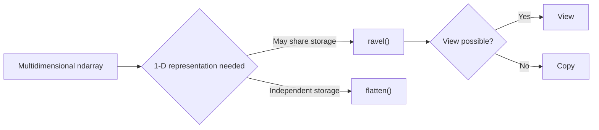
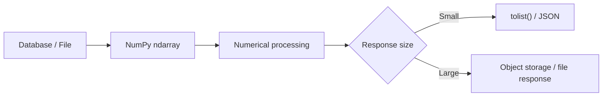

# 03- Flatten and Ravel

## Overview

`flatten()` and `ravel()` both convert an `ndarray` into a one-dimensional representation, but their memory semantics are different.

The central distinction is:

```text
ravel()
→ one-dimensional result
→ view when possible
→ copy when necessary

flatten()
→ one-dimensional result
→ always returns a copy
```

That difference matters when processing large arrays because copying can increase CPU time and peak memory, while a view can retain the original storage and therefore keep a large backing array alive.



For backend and data-engineering workloads, the correct choice depends on whether the one-dimensional representation is only a temporary read-oriented view or must become independently owned data.

## Why Flattening Exists

A multidimensional array can be difficult to pass to APIs or processing stages that expect a one-dimensional sequence.

For example:

```python
import numpy as np

records = np.array(
    [
        [101, 102, 103],
        [201, 202, 203],
    ],
    dtype=np.int64,
)

print(records.shape)
# (2, 3)
```

A one-dimensional representation can be useful for:

- Serialization boundaries.
- Batch buffers.
- Hashing or comparison workflows.
- File-oriented processing.
- Generic numerical functions.
- Passing data into APIs that expect a single dimension.

```python
flat = records.ravel()

print(flat)
# [101 102 103 201 202 203]
```

Flattening changes the dimensional representation, not the logical values.

## `ravel()`

`ravel()` returns a one-dimensional array.

```python
import numpy as np

values = np.arange(12).reshape(3, 4)

flat = values.ravel()

print(flat.shape)
# (12,)
```

The important property is that `ravel()` attempts to avoid a copy.

```python
print(np.shares_memory(values, flat))
# True
```

When the source layout permits it, the returned array is a view.

### Mutation Implications

Because a `ravel()` result can share memory:

```python
import numpy as np

values = np.arange(6).reshape(2, 3)

flat = values.ravel()
flat[0] = 999

print(values)
```

```text
[[999   1   2]
 [  3   4   5]]
```

This behavior is efficient but requires ownership awareness.

If the receiving function assumes independent storage, passing a potentially shared `ravel()` result can create subtle side effects.

## `flatten()`

`flatten()` always creates a copy.

```python
import numpy as np

values = np.arange(6).reshape(2, 3)

flat = values.flatten()

print(np.shares_memory(values, flat))
# False
```

Mutating the result does not affect the original:

```python
flat[0] = 999

print(values)
```

```text
[[0 1 2]
 [3 4 5]]
```

This gives `flatten()` stronger ownership semantics at the cost of allocation and data movement.

## `ravel()` vs `flatten()`

| Property | `ravel()` | `flatten()` |
|---|---|---|
| Output is 1-D | Yes | Yes |
| Copy guaranteed | No | Yes |
| View possible | Yes | No |
| Can share memory | Yes | No |
| Extra allocation | Only when necessary | Always |
| Mutation can affect source | Potentially | No |
| Best for | Efficient read-oriented processing | Independent storage |

The decision should be based on **memory ownership**, not just on whether both produce the same values.

## Why `ravel()` Can Be More Efficient

Consider a large numerical array:

```python
import numpy as np

values = np.empty((10_000_000, 4), dtype=np.float32)
```

Its raw data occupies approximately:

```text
10,000,000 × 4 × 4 bytes
≈ 160 MB
```

A view-based `ravel()` can represent the same storage without allocating another 160 MB buffer.

By contrast:

```python
flat = values.flatten()
```

requires an additional output allocation of roughly the same size.

At service scale, that can increase:

- Peak process RSS.
- Kubernetes container memory usage.
- Garbage-collection pressure from surrounding Python objects.
- Allocation latency.
- Risk of OOM termination.

The exact impact depends on the complete pipeline, but the memory distinction is fundamental.

## The Important Caveat: `ravel()` May Still Copy

`ravel()` is not a guarantee of zero-copy behavior.

For example, transposing an array commonly changes its strides:

```python
import numpy as np

values = np.arange(12).reshape(3, 4)

transposed = values.T
flat = transposed.ravel()
```

Depending on the requested order and memory layout, `ravel()` may need to create a copy.

Check when the distinction matters:

```python
print(np.shares_memory(transposed, flat))
```

Therefore:

```text
ravel()
≠ guaranteed view

ravel()
= prefer a view, copy when required
```

## Memory Layout and Order

Flattening is affected by how NumPy traverses the array.

The default is C-style ordering:

```python
import numpy as np

values = np.array(
    [
        [1, 2, 3],
        [4, 5, 6],
    ]
)

print(values.ravel())
# [1 2 3 4 5 6]
```

For Fortran-style traversal:

```python
print(values.ravel(order="F"))
# [1 4 2 5 3 6]
```

The same concept applies to `flatten()`:

```python
flat = values.flatten(order="F")
```

The `order` parameter should represent a real data-layout requirement. It should not be changed simply because another option sounds faster.

## `order` Options

The commonly relevant choices are:

| Order | Meaning |
|---|---|
| `"C"` | Row-major traversal |
| `"F"` | Column-major traversal |
| `"A"` | Fortran order if the input is Fortran-contiguous, otherwise C |
| `"K"` | Preserve the array's memory order as closely as possible |

For most backend pipelines, default C-order behavior is sufficient.

Use another order only when the downstream representation or memory layout explicitly requires it.

## `ravel()` vs `reshape(-1)`

Another common way to obtain a one-dimensional array is:

```python
flat = values.reshape(-1)
```

For many contiguous arrays, both `reshape(-1)` and `ravel()` can provide a view.

```python
import numpy as np

values = np.arange(12).reshape(3, 4)

a = values.ravel()
b = values.reshape(-1)

print(np.shares_memory(values, a))
# True

print(np.shares_memory(values, b))
# True
```

The APIs communicate slightly different intent:

```text
reshape(-1)
→ change the shape to one dimension

ravel()
→ produce a flattened one-dimensional representation
```

A useful engineering convention is:

- Use `reshape(-1)` when the operation is part of broader shape manipulation.
- Use `ravel()` when flattening is the semantic operation you want to communicate.

## `flatten()` vs `reshape(-1)`

These are not equivalent in memory behavior.

```python
import numpy as np

values = np.arange(12).reshape(3, 4)

a = values.reshape(-1)
b = values.flatten()

print(np.shares_memory(values, a))
# True

print(np.shares_memory(values, b))
# False
```

If an independent array is required:

```python
flat = values.reshape(-1).copy()
```

This can make ownership intent more explicit than using `flatten()` alone.

The choice is therefore:

```text
Need a view when possible?
→ reshape(-1) / ravel()

Need independent memory?
→ flatten() / reshape(-1).copy()
```

## Flattening and Views

View semantics matter beyond immediate mutation.

Suppose a small flattened result keeps a large source array alive:

```python
import numpy as np

large = np.empty((20_000_000, 4), dtype=np.float32)

small = large[:1].ravel()
```

Even though `small` contains very little data, it may still reference the larger underlying allocation.

A long-lived reference such as:

```python
cache["sample"] = small
```

can therefore retain substantially more memory than its apparent size suggests.

This is a memory-lifetime issue rather than an arithmetic issue.

When a small result must outlive a large temporary source, consider taking an explicit copy:

```python
small = large[:1].ravel().copy()
```

This trades CPU and allocation cost for predictable memory lifetime.

## Flattening in Large Data Pipelines

A common pattern is:

```text
Large batch
    ↓
Slice relevant records
    ↓
Flatten / ravel
    ↓
Numerical operation
    ↓
Persist / serialize
```

The memory behavior depends on whether the flattening step is a view or copy.

For bounded processing:

```python
import numpy as np


def process_batch(values: np.ndarray) -> float:
    if values.ndim != 2:
        raise ValueError("Expected a two-dimensional batch")

    flat = values.ravel()

    if not np.isfinite(flat).all():
        raise ValueError("Batch contains non-finite values")

    return float(flat.mean())
```

This is efficient when a temporary one-dimensional representation is enough and no independent ownership is required.

## Flattening for Serialization

Flattening can be useful before serialization into a schema that expects a flat sequence.

```python
import numpy as np


def serialize_values(values: np.ndarray) -> list[float]:
    flat = values.ravel()

    return flat.tolist()
```

However, `tolist()` creates Python objects and therefore changes the memory and performance characteristics substantially.

The overall pipeline becomes:

```text
NumPy ndarray
    ↓
ravel()
    ↓
Python scalar objects
    ↓
JSON serialization
```

For large datasets, converting a huge NumPy array into a Python list can eliminate much of the memory efficiency gained by NumPy.

Prefer compact binary formats such as Parquet, NumPy-compatible binary storage, or other appropriate serialization formats when the system requirements allow them.

## Flattening and REST APIs

For small API responses, converting a NumPy result to a list can be reasonable:

```python
payload = values.ravel().tolist()
```

For large results, this should be treated as an explicit boundary conversion.

A good architecture is:



Do not flatten large numerical datasets merely because the HTTP response model happens to accept a list.

## Flattening and Pandas

Pandas often provides higher-level semantics for tabular data.

NumPy flattening is appropriate when the operation concerns raw numerical storage:

```python
values = dataframe[["latency", "throughput"]].to_numpy(dtype=np.float64)

flat = values.ravel()
```

Use Pandas when the required operation is primarily:

- Column-oriented.
- Label-aware.
- Grouped.
- Joined.
- Tabular.

Use NumPy when the next operation is fundamentally numerical and array-oriented.

The conversion itself may also require memory, so avoid unnecessary representation changes:

```text
DataFrame
→ NumPy
→ DataFrame
```

unless each transition has a clear purpose.

## Flattening and Backend Boundaries

In a Django, FastAPI, or gRPC service, flattening should usually occur near the point where the receiving interface actually requires a one-dimensional representation.

For example:

```text
Request
  ↓
Schema validation
  ↓
ndarray
  ↓
Numerical processing
  ↓
ravel()
  ↓
Boundary-specific conversion
```

Keeping the internal numerical representation multidimensional until flattening is actually needed preserves useful shape information and reduces accidental transformations.

## Performance Considerations

The performance trade-off can be summarized as:

```text
ravel()
→ view when possible
→ little or no data movement

flatten()
→ allocate destination
→ copy N elements
→ O(N) data movement
```

For very small arrays, the difference is often irrelevant.

For large arrays, the cost becomes meaningful.

Benchmark the complete operation:

```python
from time import perf_counter

start = perf_counter()
result = values.ravel()
elapsed = perf_counter() - start

print(f"ravel: {elapsed:.6f}s")
```

Compare with:

```python
start = perf_counter()
result = values.flatten()
elapsed = perf_counter() - start

print(f"flatten: {elapsed:.6f}s")
```

A benchmark should also consider memory because a seemingly inexpensive copy can be operationally expensive at scale.

## CPU vs Memory Trade-Off

The choice is not simply:

```text
ravel = fast
flatten = slow
```

The real trade-off is:

| Requirement | Preferred choice |
|---|---|
| Avoid allocation when possible | `ravel()` |
| Independent ownership | `flatten()` |
| Minimize peak memory | `ravel()` when a view is possible |
| Prevent source mutation | `flatten()` |
| Avoid retaining a huge backing array | Explicit copy of the required subset |
| Shape-only transformation | `reshape(-1)` |

An explicit copy can sometimes improve overall system behavior by shortening the lifetime of a much larger backing array.

Therefore memory lifetime matters alongside CPU time.

## Common Mistakes

### Assuming `ravel()` Always Returns a View

It may need to allocate when the source layout is incompatible.

Check memory sharing when the distinction matters.

### Assuming `flatten()` Is Just a Different Name for `ravel()`

`flatten()` guarantees an independent copy.

The difference can be significant for large arrays.

### Flattening Before Every Operation

Flattening can destroy useful axis semantics.

If the next operation needs rows, columns, or feature axes, retain the multidimensional structure.

### Keeping a Small View of a Huge Array

A small `ravel()` result may retain the full source buffer.

Copy intentionally when the small result needs a longer lifetime than its source.

### Converting Large Arrays to Python Lists Unnecessarily

`tolist()` creates Python-level objects and can substantially increase memory usage.

Use it at external boundaries only when the interface requires it.

### Ignoring Memory Layout

Transposes and other non-contiguous views can turn an apparently simple flatten operation into a copy.

### Using Flattening to Hide Shape Bugs

Flattening removes dimensional information. It can make an incorrectly shaped array look valid while silently changing semantics.

Validate shapes before flattening.

## Testing Flattening Behavior

Test both values and ownership semantics when they matter.

```python
import numpy as np


def test_ravel_preserves_values():
    values = np.arange(6).reshape(2, 3)

    result = values.ravel()

    np.testing.assert_array_equal(
        result,
        np.array([0, 1, 2, 3, 4, 5]),
    )


def test_flatten_creates_independent_storage():
    values = np.arange(6).reshape(2, 3)

    result = values.flatten()
    result[0] = 999

    assert values[0, 0] == 0
```

For performance-sensitive code, add tests or benchmarks for:

- Contiguous input.
- Non-contiguous input.
- Large arrays.
- Different dtypes.
- Memory sharing.
- Long-lived result references.

## Debugging Flattening Problems

When flattening produces unexpected performance or mutation behavior, inspect:

```python
print("shape:", values.shape)
print("strides:", values.strides)
print("dtype:", values.dtype)
print("nbytes:", values.nbytes)
print("C contiguous:", values.flags.c_contiguous)
print("F contiguous:", values.flags.f_contiguous)
```

For a flattened result:

```python
flat = values.ravel()

print("shares memory:", np.shares_memory(values, flat))
print("flat owns data:", flat.flags.owndata)
```

A useful debugging sequence is:

```text
Check original shape
      ↓
Check contiguity
      ↓
Check flattening method
      ↓
Check memory sharing
      ↓
Check mutation expectations
      ↓
Check lifetime of references
```

## Interview Questions

### What is the difference between `ravel()` and `flatten()`?

`ravel()` returns a one-dimensional representation and uses a view when possible, while `flatten()` always returns a copy.

### Is `ravel()` guaranteed to be zero-copy?

No. It returns a view when the requested ordering and source memory layout permit it. Otherwise it creates a copy.

### Why can `ravel()` be more memory efficient?

A view can reuse the original data buffer instead of allocating and copying another array.

### Why might a view still cause a memory problem?

A small view can keep a much larger original allocation alive through shared storage.

### When should `flatten()` be preferred?

When independent storage is required and mutations to the flattened result must not affect the source.

### What is the difference between `ravel()` and `reshape(-1)`?

Both can produce a one-dimensional view for compatible layouts. `ravel()` expresses flattening intent, while `reshape(-1)` expresses a shape transformation.

### Why can flattening a transposed array allocate memory?

A transpose can create a non-contiguous view whose memory ordering does not directly support the requested one-dimensional representation without copying.

### Would you flatten a large NumPy array before returning it from a REST API?

Not automatically. The response contract should determine the representation. Converting a large array to Python lists can create significant memory overhead, so binary/file-based responses may be more appropriate.

## Key Takeaways

- `ravel()` produces a one-dimensional representation and avoids copying when the source layout permits it; `flatten()` always creates independent storage.
- The difference between a view and a copy affects mutation, CPU cost, peak memory, and how long a large backing array remains alive.
- `reshape(-1)` is another useful one-dimensional representation, especially when flattening is part of a broader shape transformation.
- Do not flatten away meaningful axis semantics or convert large NumPy arrays to Python lists without an explicit boundary requirement.
- For production workloads, choose between `ravel()`, `flatten()`, and `reshape(-1)` based on ownership, memory lifetime, layout, and downstream processing requirements.