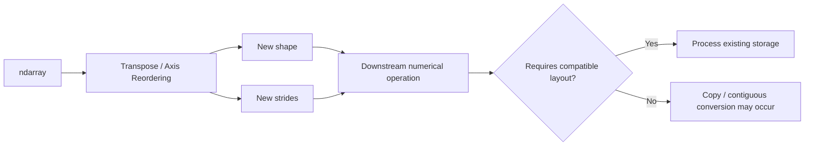
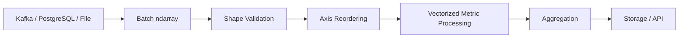

# 04- Transpose

## Overview

Transpose changes the order of an array's axes. For a two-dimensional array, this is commonly described as swapping rows and columns. For higher-dimensional arrays, transpose is more accurately understood as **reordering axes**.

This matters in production numerical processing because transpose usually changes the array's **shape and strides**, not the underlying data buffer. As a result, it is often cheap initially but can affect downstream performance and may force later operations to allocate copies.



The key engineering model is:

```text
Transpose
→ reorder axes
→ usually create a view
→ change strides
→ potentially change access efficiency
→ may cause later copies
```

## What Transpose Does

Consider a two-dimensional array:

```python
import numpy as np

values = np.array(
    [
        [10, 20, 30],
        [40, 50, 60],
    ]
)

print(values.shape)
# (2, 3)
```

Transposing it produces:

```python
transposed = values.T

print(transposed)
```

```text
[[10 40]
 [20 50]
 [30 60]]
```

The shape changes from:

```text
(2, 3)
```

to:

```text
(3, 2)
```

The values are not numerically copied into a different logical arrangement. NumPy can often interpret the same underlying storage using different strides.

## Why Transpose Exists

Transpose is useful when a computation needs a different axis arrangement.

Typical backend and data-engineering examples include:

- Converting record-major data to feature-major data.
- Preparing arrays for column-oriented processing.
- Reordering dimensions in batched numerical processing.
- Adapting data between file or service representations.
- Preparing data for operations with specific axis expectations.

For example:

```text
(batch, metrics)
        ↓ transpose
(metrics, batch)
```

This can make a metric-oriented processing stage easier to express without immediately copying the entire dataset.

## Two-Dimensional Transpose

For two-dimensional arrays, `.T` is the most concise form.

```python
import numpy as np

metrics = np.array(
    [
        [12.1, 25.4, 33.2],
        [11.8, 26.1, 31.9],
        [12.4, 24.9, 34.0],
    ],
    dtype=np.float64,
)

by_metric = metrics.T

print(metrics.shape)
# (3, 3)

print(by_metric.shape)
# (3, 3)
```

Although the shape happens to be square in this example, the axis meaning changes from:

```text
axis 0 → records
axis 1 → metrics
```

to:

```text
axis 0 → metrics
axis 1 → records
```

That distinction is often more important than the numeric shape itself.

## `.T` and `np.transpose()`

For two-dimensional arrays:

```python
values.T
```

and:

```python
np.transpose(values)
```

represent the same basic transpose operation.

```python
transposed_a = values.T
transposed_b = np.transpose(values)

np.testing.assert_array_equal(
    transposed_a,
    transposed_b,
)
```

Use `.T` when the intent is simply matrix-like transposition.

Use `np.transpose()` when you need to specify an explicit axis permutation, especially for arrays with more than two dimensions.

## Transpose for Higher-Dimensional Arrays

For arrays with more than two dimensions, transpose is an axis permutation.

Consider:

```python
import numpy as np

values = np.empty((2, 3, 4))

print(values.shape)
# (2, 3, 4)
```

The axes can be interpreted as:

```text
axis 0 → batch
axis 1 → records
axis 2 → metrics
```

Reorder them:

```python
transposed = np.transpose(values, (0, 2, 1))

print(transposed.shape)
# (2, 4, 3)
```

The axis mapping is:

```text
old axis 0 → new axis 0
old axis 2 → new axis 1
old axis 1 → new axis 2
```

This is the important higher-dimensional meaning of transpose.

## Axis Permutations

For an array with shape:

```text
(A, B, C)
```

possible permutations include:

```python
values.transpose(0, 1, 2)
values.transpose(0, 2, 1)
values.transpose(1, 0, 2)
values.transpose(1, 2, 0)
values.transpose(2, 0, 1)
values.transpose(2, 1, 0)
```

Each changes the logical axis order.

A useful way to reason about the operation is:

```text
Original:
(batch, record, metric)

Transpose:
(batch, metric, record)
```

Do not think only in terms of "moving values around." Think in terms of **renaming and reordering axes**.

## `swapaxes()` and `moveaxis()`

Transpose is not the only axis-reordering operation.

| Operation | Purpose |
|---|---|
| `.T` | Convenient transpose for common cases |
| `np.transpose()` | Arbitrary axis permutation |
| `np.swapaxes()` | Swap two specific axes |
| `np.moveaxis()` | Move selected axes to new positions |

For example:

```python
import numpy as np

values = np.empty((2, 3, 4))

swapped = np.swapaxes(values, 1, 2)
moved = np.moveaxis(values, 2, 0)
```

The APIs communicate different intent.

Use:

```text
transpose()
→ when describing the complete desired axis ordering

swapaxes()
→ when exactly two axes should exchange positions

moveaxis()
→ when specific axes need to be moved while the remaining axes retain relative order
```

## Transpose Is Usually a View

A key performance property is that transpose generally creates a view rather than copying the data.

```python
import numpy as np

values = np.arange(12).reshape(3, 4)

transposed = values.T

print(np.shares_memory(values, transposed))
# True
```

Changing the transposed view can affect the original:

```python
transposed[0, 0] = 999

print(values[0, 0])
# 999
```

This is efficient because NumPy can often represent the new axis order by changing shape and stride metadata.

Conceptually:

```text
Original:
shape   = (3, 4)
strides = (...)

Transpose:
shape   = (4, 3)
strides = (strides swapped)
```

The underlying buffer can remain unchanged.

## Strides and Transpose

Strides tell NumPy how many bytes it must move to reach the next element along each axis.

For example:

```python
import numpy as np

values = np.arange(12, dtype=np.int64).reshape(3, 4)

print(values.strides)
print(values.T.strides)
```

For a standard C-contiguous array, the stride associated with the last dimension is typically smaller than the stride associated with the first dimension.

After transpose, those stride relationships are reversed.

This explains why:

```text
transpose
→ can be cheap
→ but can make access less contiguous
```

The data does not have to move for the view to exist.

## Contiguity After Transpose

A transpose commonly turns a C-contiguous array into a non-C-contiguous view.

```python
import numpy as np

values = np.arange(12).reshape(3, 4)
transposed = values.T

print(values.flags.c_contiguous)
# True

print(transposed.flags.c_contiguous)
# False
```

The transposed array may be Fortran-contiguous instead:

```python
print(transposed.flags.f_contiguous)
# True
```

Contiguity matters because downstream algorithms may process contiguous memory more efficiently.

## Why Non-Contiguous Arrays Matter

A non-contiguous array is not inherently bad.

It becomes important when a downstream operation:

- Expects a particular memory layout.
- Performs sequential memory access.
- Requires a contiguous buffer.
- Creates a copy to simplify computation.

A pipeline such as:

```text
large contiguous array
    ↓
transpose
    ↓
operation requiring contiguous storage
    ↓
copy
```

can produce a significant allocation.

This is why transpose should be evaluated together with the operations that follow it.

## Making a Contiguous Copy

If downstream code benefits from or requires contiguous storage, use an explicit conversion.

```python
contiguous = np.ascontiguousarray(transposed)
```

Now:

```python
print(contiguous.flags.c_contiguous)
# True
```

This makes the copy explicit.

A common production pattern is:

```text
Transpose
    ↓
Determine downstream access pattern
    ↓
Copy only when beneficial or required
    ↓
Vectorized processing
```

Do not blindly call `np.ascontiguousarray()` after every transpose because doing so can eliminate the memory benefit of a view.

## Transpose and Memory Usage

Consider:

```python
values = np.empty(
    (10_000_000, 4),
    dtype=np.float32,
)
```

The source consumes approximately:

```text
10,000,000 × 4 × 4 bytes
≈ 160 MB
```

A transpose itself can often be represented as a view without another 160 MB allocation.

But this:

```python
transposed = values.T
contiguous = np.ascontiguousarray(transposed)
```

can require another large allocation.

The engineering implication is:

```text
Transpose view
→ low additional memory

Contiguous conversion
→ potentially O(N) memory + O(N) copy
```

Peak RSS is therefore determined by the full operation chain, not by the transpose call alone.

## Transpose and Flattening

Transpose interacts directly with `ravel()` and `flatten()`.

```python
import numpy as np

values = np.arange(12).reshape(3, 4)

transposed = values.T

flat = transposed.ravel()
```

Because `transposed` is non-C-contiguous, `ravel()` may need to create a copy depending on the requested order.

By comparison:

```python
flat_copy = transposed.flatten()
```

always creates a copy.

The important relationship is:

```text
transpose
→ changes strides
→ may change contiguity
→ can affect later flattening and reshape operations
```

## Transpose and Reshape

A common mistake is to assume transpose and reshape are interchangeable.

They are not.

Transpose changes axis ordering:

```python
values.T
```

Reshape changes the dimensional interpretation while preserving element count:

```python
values.reshape(...)
```

For example:

```python
import numpy as np

values = np.arange(6).reshape(2, 3)

print(values.T)
```

```text
[[0 3]
 [1 4]
 [2 5]]
```

Whereas:

```python
print(values.reshape(3, 2))
```

```text
[[0 1]
 [2 3]
 [4 5]]
```

Both produce a `(3, 2)` result, but the element arrangement is different.

This distinction is critical in numerical pipelines.

## Transpose and Broadcasting

Transpose is often used to align axes for broadcasting.

Suppose:

```python
values.shape == (batch_size, feature_count)
```

and a later operation expects:

```python
feature_count, 1
```

The shape might be explicitly reorganized:

```python
feature_values = values.T
```

However, experienced NumPy code should first ask whether a simpler broadcasting expression can achieve the same result without changing the main representation.

For example:

```python
scaled = values * weights
```

may be preferable to transposing just to perform multiplication.

The best operation is the one that expresses the required axis semantics with minimal data movement and minimal complexity.

## Backend Example: Feature-Oriented Processing

Consider telemetry records:

```text
batch × metric
```

For some numerical stage, processing each metric independently may be simpler after transposing:

```python
import numpy as np

records = np.array(
    [
        [21.5, 42.0, 1012.4],
        [22.1, 43.2, 1011.8],
        [21.8, 41.7, 1013.1],
    ],
    dtype=np.float64,
)

metrics = records.T

temperature = metrics[0]
humidity = metrics[1]
pressure = metrics[2]
```

The operation is a view when the layout permits it.

However, for a large production pipeline, benchmark whether per-column processing actually benefits from the transposed access pattern.

Sometimes retaining the original `(batch, metric)` representation and operating by axis is simpler and equally or more efficient.

## Backend Example: Batch Processing

A typical pipeline might look like:



The important design principle is to transpose only when the downstream numerical operation benefits from the new axis arrangement.

Do not introduce an axis transformation merely because the operation is available.

## NumPy and Pandas

A Pandas `DataFrame` is already organized around rows and columns, so explicit NumPy transposition is most useful after converting to an array for numerical processing.

```python
import numpy as np
import pandas as pd

frame = pd.DataFrame(
    {
        "latency_ms": [120.0, 130.0, 125.0],
        "throughput": [80.0, 85.0, 82.0],
    }
)

values = frame.to_numpy(dtype=np.float64)
metrics = values.T
```

Before doing this, consider whether Pandas can perform the desired operation directly.

A representation change has a cost in both memory and code complexity.

## Transpose for File and Storage Interoperability

Some file formats, numerical libraries, or external interfaces represent dimensions differently.

For example:

```text
Internal representation:
(batch, metric)

External representation:
(metric, batch)
```

Transpose can bridge that contract:

```python
external = internal.T
```

If the external API requires an actual contiguous buffer, convert explicitly at the boundary:

```python
external = np.ascontiguousarray(internal.T)
```

This is preferable to hiding the copy inside unrelated business logic.

## Transpose at API Boundaries

For REST or gRPC services, keep axis transformations inside the domain-processing layer rather than letting transport models dictate internal data representation.

```text
API payload
    ↓
Validation
    ↓
Canonical internal shape
    ↓
Numerical processing
    ↓
Optional transpose for external format
    ↓
Serialization
```

This avoids coupling numerical algorithms to wire-format details.

## Performance Considerations

Transpose itself is often close to constant-time because it can be implemented through metadata changes.

But subsequent operations may behave differently because memory access patterns change.

A realistic performance model is:

```text
transpose()
→ cheap view creation

later computation
→ potentially different memory-access pattern

contiguous conversion
→ O(N) allocation and copy
```

Therefore benchmarking only:

```python
values.T
```

is not sufficient.

Benchmark:

```text
original representation
vs
transpose + operation
vs
transpose + contiguous copy + operation
```

The best representation is determined by the complete workload.

## CPU Cache Considerations

Contiguous data generally provides more predictable sequential memory access.

A transposed view can cause iteration to jump through the underlying storage with larger strides.

For CPU-intensive operations, this can reduce cache locality.

The result is not:

```text
transpose = slow
```

but rather:

```text
transpose
→ changes access pattern
→ some downstream loops become less cache-friendly
```

Vectorized NumPy operations are designed to work with strided arrays, but performance still depends on the implementation and access pattern.

Measure representative workloads before introducing explicit copies.

## Memory-Efficient Processing

For large arrays, a useful strategy is:

```python
transposed = values.T

# Only make a contiguous copy if the downstream operation benefits from it.
if not transposed.flags.c_contiguous:
    contiguous = np.ascontiguousarray(transposed)
```

Even here, the decision should be driven by profiling rather than by contiguity alone.

A copy is useful when its cost is recovered by faster downstream processing or when the receiving API explicitly requires contiguous storage.

## Common Mistakes

### Assuming Transpose Copies Data

Transpose commonly returns a view.

Mutating the result may therefore mutate the original.

### Treating Transpose as Reshape

Transpose reorders axes.

Reshape changes the dimensional interpretation.

They can produce identical shapes while representing different value arrangements.

### Copying Every Transposed Array

Calling `np.ascontiguousarray()` unconditionally can create unnecessary large allocations.

Only copy when required or justified by measured performance.

### Ignoring Axis Meaning

An array shape such as `(1000, 8)` does not explain whether the axes represent:

```text
records × features
```

or:

```text
features × records
```

Transpose should be based on documented axis semantics.

### Flattening Immediately After Transpose

A transpose followed by flattening may trigger a copy.

If flattening is needed, evaluate whether the required order can be achieved more directly.

### Optimizing `.T` Instead of the Full Pipeline

Transpose itself is often cheap. The expensive operation may be the processing that follows.

Benchmark the entire transformation path.

### Forgetting Long-Lived Views

A transposed view can keep a large original buffer alive.

For long-lived cached or queued data, explicitly copy only the required subset when necessary.

## Testing Transpose Semantics

Test both shape and axis meaning.

```python
import numpy as np


def test_two_dimensional_transpose():
    values = np.array(
        [
            [1, 2, 3],
            [4, 5, 6],
        ]
    )

    result = values.T

    np.testing.assert_array_equal(
        result,
        np.array(
            [
                [1, 4],
                [2, 5],
                [3, 6],
            ]
        ),
    )


def test_transpose_shares_memory_when_possible():
    values = np.arange(12).reshape(3, 4)

    result = values.T

    assert np.shares_memory(values, result)
```

For higher-dimensional data:

```python
def test_axis_permutation():
    values = np.empty((2, 3, 4))

    result = np.transpose(values, (0, 2, 1))

    assert result.shape == (2, 4, 3)
```

Production tests should also cover:

- Non-contiguous inputs.
- Large arrays.
- Expected dtype preservation.
- Memory-sharing assumptions where relevant.
- Downstream operations after transpose.

## Debugging Transpose Problems

Inspect:

```python
print("shape:", values.shape)
print("strides:", values.strides)
print("C contiguous:", values.flags.c_contiguous)
print("F contiguous:", values.flags.f_contiguous)
```

After transposition:

```python
transposed = values.T

print("shape:", transposed.shape)
print("strides:", transposed.strides)
print("C contiguous:", transposed.flags.c_contiguous)
print("F contiguous:", transposed.flags.f_contiguous)
print("shares memory:", np.shares_memory(values, transposed))
```

A useful debugging sequence is:

```text
Check original shape
      ↓
Document axis meanings
      ↓
Inspect transpose order
      ↓
Inspect strides
      ↓
Check contiguity
      ↓
Check memory sharing
      ↓
Benchmark downstream operation
```

## Interview Questions

### What does transpose do internally?

For views that support it, transpose changes the array's shape and stride metadata so that the axes are interpreted in a different order without copying the underlying data.

### Is transpose a copy?

Usually not. NumPy commonly returns a view, although later operations may require a copy.

### Why can a transposed array become non-contiguous?

Reordering the axes changes the relationship between axes and the underlying memory order. The resulting view may no longer satisfy C-contiguous layout.

### What is the difference between `.T` and `np.transpose()`?

`.T` is a convenient transpose attribute, especially useful for common two-dimensional cases. `np.transpose()` supports explicit axis permutations for multidimensional arrays.

### When would you use `swapaxes()`?

When the operation semantically means exchanging exactly two axes.

### When would you use `moveaxis()`?

When specific axes need to move to new positions while preserving the relative order of the other axes.

### Why can transpose followed by a numerical operation be slower?

The transposed view may produce a less cache-friendly access pattern or cause the downstream implementation to materialize a contiguous copy.

### Should you always convert a transposed array to contiguous storage?

No. A copy consumes memory and CPU. Only make the conversion when required or when profiling shows that the downstream performance improvement justifies it.

## Key Takeaways

- Transpose primarily reorders axes and commonly returns a view by changing shape and stride metadata rather than copying the data.
- A transposed view can become non-contiguous, which may affect cache locality and cause downstream operations to allocate copies.
- `.T`, `np.transpose()`, `swapaxes()`, and `moveaxis()` express different axis-reordering intentions and should be selected according to the required semantics.
- In production pipelines, reason about transpose together with downstream operations, memory lifetime, contiguity, and peak RSS rather than treating transpose as an isolated operation.
- Axis meaning is part of the data contract: document dimensions explicitly so that transpose does not silently change the semantics of numerical processing.