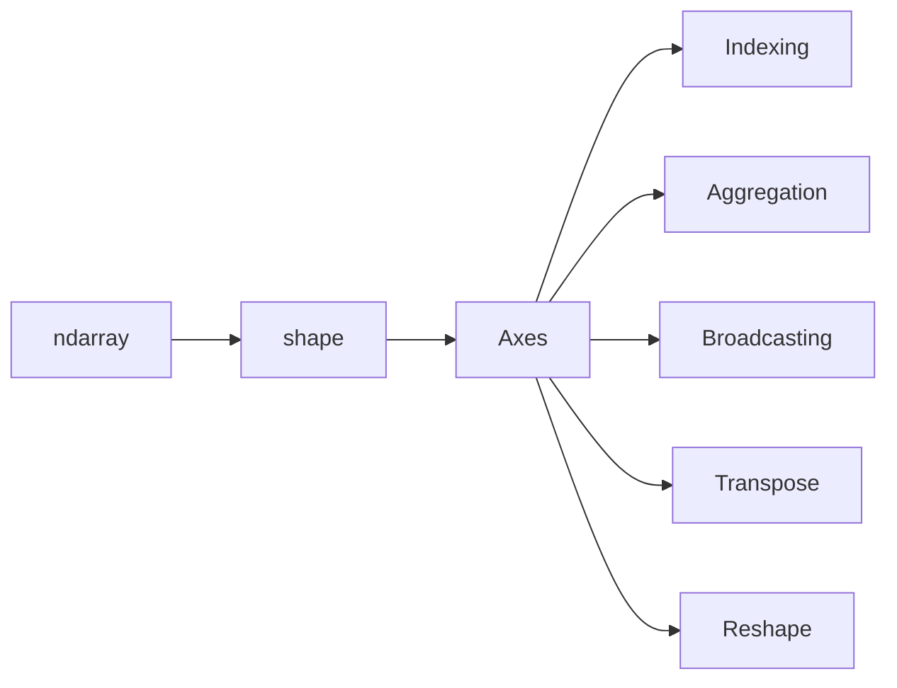
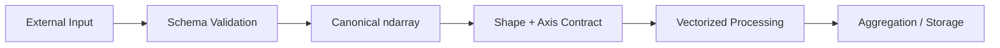

# 05- Axes

## Overview

Axes are one of the most important concepts in NumPy because they define how dimensions are interpreted during indexing, aggregation, broadcasting, reshaping, and transposition.

For backend and data-engineering workloads, an axis should be treated as a **semantic dimension of data**, not merely a position in a tuple.

For example:

```text
(batch, feature)
```

is more useful than simply:

```text
(1000, 8)
```

because it tells the engineer what each dimension represents.



A strong understanding of axes explains why expressions such as:

```python
values.sum(axis=0)
values.mean(axis=1)
values.transpose(1, 0)
```

produce different results.

## What Is an Axis?

An axis identifies one dimension of an `ndarray`.

Consider:

```python
import numpy as np

values = np.array(
    [
        [10, 20, 30],
        [40, 50, 60],
    ]
)
```

Its shape is:

```text
(2, 3)
```

There are two axes:

```text
axis 0 → 2 rows
axis 1 → 3 columns
```

You can inspect them with:

```python
print(values.ndim)
# 2

print(values.shape)
# (2, 3)
```

The important point is that axis numbers are zero-based.

```text
axis 0
axis 1
```

There is no `axis 2` in this two-dimensional array.

## Axis Semantics

Axis numbers describe structure, but they do not tell you what that structure means.

For example:

```python
values.shape == (1000, 8)
```

could mean:

```text
1000 records × 8 metrics
```

or:

```text
8 servers × 1000 measurements
```

The numeric shape is identical, but the semantic meaning is different.

Production code should therefore document axis meaning explicitly:

```text
axis 0 → records
axis 1 → metrics
```

This makes downstream operations much easier to reason about.

## Axis in One-Dimensional Arrays

A one-dimensional array has exactly one axis:

```python
import numpy as np

values = np.array([10, 20, 30, 40])

print(values.shape)
# (4,)

print(values.ndim)
# 1
```

That dimension is:

```text
axis 0
```

For example:

```python
print(values.sum(axis=0))
# 100
```

Although `axis=0` may look unnecessary for a one-dimensional reduction, it is useful when writing generic functions that operate across arrays of different dimensionalities.

## Axis in Two-Dimensional Arrays

For a two-dimensional array:

```text
        axis 1 →
      columns
        0  1  2

axis 0
rows
0     10 20 30
1     40 50 60
```

The axis interpretation is:

```text
axis 0 → move vertically through rows
axis 1 → move horizontally through columns
```

This is why:

```python
values.sum(axis=0)
```

produces:

```text
[50, 70, 90]
```

while:

```python
values.sum(axis=1)
```

produces:

```text
[60, 150]
```

The operation reduces one axis and preserves the others.

## Aggregation and Axis

Axis semantics become especially important with reductions.

Consider:

```python
import numpy as np

metrics = np.array(
    [
        [100.0, 20.0, 30.0],
        [110.0, 25.0, 28.0],
        [105.0, 22.0, 31.0],
    ]
)
```

If:

```text
axis 0 → records
axis 1 → metrics
```

then:

```python
metrics.mean(axis=0)
```

means:

```text
mean for each metric across all records
```

while:

```python
metrics.mean(axis=1)
```

means:

```text
mean across metrics for each record
```

This is a semantic distinction, not merely a syntactic one.

## Axis Reduction Model

A useful mental model is:

```text
Input shape
(batch, metric)

mean(axis=0)
      ↓
(metric)

mean(axis=1)
      ↓
(batch)
```

More generally:

```text
reduction(axis=k)
→ removes axis k
→ preserves remaining dimensions
```

unless `keepdims=True` is used.

## `keepdims=True`

`keepdims` preserves the reduced dimension as size `1`.

```python
import numpy as np

values = np.array(
    [
        [10.0, 20.0, 30.0],
        [40.0, 50.0, 60.0],
    ]
)

result = values.mean(axis=0, keepdims=True)

print(result.shape)
# (1, 3)
```

Without `keepdims`:

```python
result = values.mean(axis=0)

print(result.shape)
# (3,)
```

Preserving the dimension can make broadcasting and shape contracts easier to maintain.

For example:

```python
centered = values - values.mean(axis=0, keepdims=True)
```

This communicates clearly that the mean is being computed per feature and retained as a broadcastable row shape.

## Why `keepdims` Matters in Production

Without explicit shape control, reductions can create a one-dimensional result that later interacts with another array through broadcasting in an unintended way.

For example:

```python
feature_mean = values.mean(axis=0)
```

produces:

```text
(feature,)
```

while:

```python
feature_mean = values.mean(axis=0, keepdims=True)
```

produces:

```text
(1, feature)
```

Both may broadcast successfully in some expressions, but preserving dimensions often makes intent clearer and reduces ambiguity in larger pipelines.

## Axis and Broadcasting

Broadcasting depends heavily on shape alignment.

Suppose:

```python
values.shape == (1000, 8)
```

and:

```python
scales.shape == (8,)
```

Then:

```python
scaled = values * scales
```

broadcasts the eight values across the 1000 records.

Conceptually:

```text
values
(1000, 8)

scales
(8,)

broadcast

(1000, 8)
```

If a reduction produces the scaling parameters:

```python
scales = values.mean(axis=0)
```

the result naturally aligns with the feature axis.

This is one reason understanding axes is essential before learning broadcasting deeply.

## Axis and `keepdims` for Broadcasting

Compare:

```python
means = values.mean(axis=0)
```

with:

```python
means = values.mean(axis=0, keepdims=True)
```

Shapes:

```text
means without keepdims
→ (features,)

means with keepdims
→ (1, features)
```

Both can broadcast against:

```text
(batch, features)
```

but `keepdims=True` explicitly preserves the feature-axis position.

This can make generic numerical functions more robust when extended to higher-dimensional arrays.

## Axis and Transpose

Axes determine what transpose reorders.

For:

```python
values.shape == (2, 3)
```

the transpose operation:

```python
values.T
```

changes:

```text
axis order:
(0, 1)
    ↓
(1, 0)
```

For a three-dimensional array:

```python
values.shape == (2, 3, 4)
```

you can explicitly reorder axes:

```python
result = np.transpose(values, (2, 0, 1))
```

The new shape becomes:

```text
(4, 2, 3)
```

The mapping is:

```text
new axis 0 ← old axis 2
new axis 1 ← old axis 0
new axis 2 ← old axis 1
```

Axis reasoning is therefore the foundation for understanding multidimensional transpose operations.

## Axis and `swapaxes()`

`swapaxes()` exchanges exactly two axes.

```python
import numpy as np

values = np.empty((2, 3, 4))

result = np.swapaxes(values, 1, 2)

print(result.shape)
# (2, 4, 3)
```

This is useful when the required operation is explicitly:

```text
axis 1 ↔ axis 2
```

rather than specifying the entire axis order.

## Axis and `moveaxis()`

`moveaxis()` moves one or more axes to new positions.

```python
import numpy as np

values = np.empty((2, 3, 4))

result = np.moveaxis(values, 2, 0)

print(result.shape)
# (4, 2, 3)
```

This is often easier to reason about when a pipeline has one primary axis that needs to move.

For example:

```text
(batch, record, metric)
```

may become:

```text
(metric, batch, record)
```

without manually calculating the complete permutation.

## Axis and Indexing

Indexing also follows axis order.

For:

```python
values.shape == (100, 8)
```

the expression:

```python
values[0]
```

selects the first element along axis 0 and produces:

```text
shape → (8,)
```

The expression:

```python
values[:, 0]
```

selects all rows and the first element along axis 1:

```text
shape → (100,)
```

Therefore:

```text
values[row, column]
          ↑
       axis 1
    ↑
   axis 0
```

This relationship becomes critical when building batch-processing code.

## Axis and Slicing

Slices preserve the selected axes while changing their lengths.

```python
batch = values[:100, :4]
```

If:

```text
values.shape == (1000, 8)
```

then:

```text
batch.shape == (100, 4)
```

The semantics remain:

```text
axis 0 → records
axis 1 → metrics
```

The dimensions have simply been restricted.

## Axis and Boolean Masks

Boolean masks also interact with axis semantics.

For example:

```python
mask = values[:, 0] > 100
filtered = values[mask]
```

The mask represents:

```text
axis 0 → record selection
```

because it has one boolean value per row.

This produces:

```text
(filtered_records, 8)
```

The second axis remains intact.

Understanding which axis the mask belongs to prevents shape mismatches and accidental filtering.

## Axis and Concatenation

Concatenation uses an axis to determine where arrays are joined.

```python
import numpy as np

left = np.array(
    [
        [1, 2],
        [3, 4],
    ]
)

right = np.array(
    [
        [5, 6],
        [7, 8],
    ]
)
```

Concatenate along axis 0:

```python
result = np.concatenate([left, right], axis=0)

print(result.shape)
# (4, 2)
```

This means:

```text
append more rows
```

Concatenate along axis 1:

```python
result = np.concatenate([left, right], axis=1)

print(result.shape)
# (2, 4)
```

This means:

```text
append more columns
```

A useful engineering rule is:

```text
axis 0 → add records
axis 1 → add features
```

when working with the common `(records, features)` representation.

## Axis and Stacking

Stacking introduces a new axis.

```python
import numpy as np

a = np.array([1, 2, 3])
b = np.array([4, 5, 6])

result = np.stack([a, b], axis=0)

print(result.shape)
# (2, 3)
```

The new axis represents:

```text
which input array
```

With:

```python
result = np.stack([a, b], axis=1)
```

the shape becomes:

```text
(3, 2)
```

The new axis is inserted at a different location.

This distinction matters when building batches from independent numerical buffers.

## Axis and Splitting

Splitting also uses an axis.

```python
import numpy as np

values = np.arange(12).reshape(4, 3)

parts = np.split(values, 2, axis=0)

print(parts[0].shape)
# (2, 3)

print(parts[1].shape)
# (2, 3)
```

Here:

```text
axis 0 → batch / record dimension
```

so splitting divides the dataset into row-oriented chunks.

This is useful for bounded processing:

```text
large batch
   ↓ split(axis=0)
smaller batches
   ↓
worker processing
```

## Axis in Batch Processing

For backend data processing, a common contract is:

```text
axis 0 → batch / records
axis 1 → fields / metrics
```

For example:

```python
records.shape == (50_000, 12)
```

can mean:

```text
50,000 records
12 numeric fields per record
```

Operations then become self-documenting:

```python
column_means = records.mean(axis=0)
record_totals = records.sum(axis=1)
```

This is one of the most useful axis conventions in practical NumPy processing.

## Axis Contracts

For reusable functions, shape and axis semantics should be treated as part of the function contract.

```python
import numpy as np
from numpy.typing import NDArray


def calculate_feature_means(
    records: NDArray[np.float64],
) -> NDArray[np.float64]:
    if records.ndim != 2:
        raise ValueError("records must be two-dimensional")

    if records.shape[0] == 0:
        raise ValueError("records cannot be empty")

    return records.mean(axis=0)
```

The contract is effectively:

```text
Input:
(batch, feature)

Output:
(feature,)
```

This is much more useful documentation than simply stating:

```text
Input: ndarray
Output: ndarray
```

## Higher-Dimensional Axis Contracts

For a three-dimensional dataset:

```text
(batch, timestamp, metric)
```

you might define:

```text
axis 0 → batch
axis 1 → timestamp
axis 2 → metric
```

Then:

```python
values.mean(axis=2)
```

means:

```text
average across metrics
```

while:

```python
values.mean(axis=1)
```

means:

```text
average across timestamps
```

The same API call can therefore represent completely different business operations depending on axis semantics.

## Axis and Numerical Aggregation

Common reductions include:

```python
values.sum(axis=0)
values.mean(axis=0)
values.median(axis=0)
values.min(axis=0)
values.max(axis=0)
```

For a production numerical pipeline, the correct axis should be chosen based on the domain question.

For example:

```text
Question:
"What is the average latency for each endpoint?"

Representation:
(endpoint, request)

Reduction:
axis=1
```

Whereas:

```text
Question:
"What is the average request rate across the observed endpoints?"

Representation:
(endpoint, time)

Reduction:
axis=0
```

Axis selection should follow business semantics, not intuition about which number "looks right."

## Axis and Non-Finite Values

When working with potentially invalid numerical data, axis-aware reductions can use NaN-aware variants.

```python
import numpy as np

values = np.array(
    [
        [10.0, 20.0],
        [np.nan, 30.0],
        [15.0, 25.0],
    ]
)

result = np.nanmean(values, axis=0)

print(result)
```

The axis still represents the same semantic dimension. The reduction simply changes how missing values are handled.

Production code should make the missing-data policy explicit rather than assuming a reduction automatically handles invalid values correctly.

## Axis and `where`

Conditional numerical operations can also be axis-aware.

For example:

```python
import numpy as np

values = np.array(
    [
        [10.0, 20.0],
        [30.0, 40.0],
    ]
)

result = np.sum(
    values,
    axis=0,
    where=values > 15,
)
```

This performs a reduction over axis 0 while considering only elements that satisfy the condition.

Axis and mask semantics should be understood independently:

```text
mask
→ which values participate

axis
→ how the participating values are aggregated
```

## Axis and Broadcasting in Production

A common production pattern is feature normalization:

```python
import numpy as np


def standardize_features(
    records: np.ndarray,
) -> np.ndarray:
    if records.ndim != 2:
        raise ValueError("Expected shape (batch, features)")

    means = records.mean(axis=0, keepdims=True)
    std = records.std(axis=0, keepdims=True)

    if np.any(std == 0):
        raise ValueError("Cannot standardize constant features")

    return (records - means) / std
```

Here:

```text
axis 0 → records
axis 1 → features
```

The reduction is across records, preserving one row of feature statistics for broadcasting.

This pattern illustrates why axis semantics connect directly to vectorized numerical processing.

## Axis and Memory Access

Axis selection is logical, but it can also influence performance.

Suppose the array is C-contiguous:

```text
(batch, feature)
```

and the feature axis is the last dimension.

Operations traversing the last axis can often access nearby memory elements.

However, performance depends on the exact NumPy operation, dtype, layout, and implementation.

The correct engineering approach is:

```text
Understand axis semantics
        ↓
Understand memory layout
        ↓
Benchmark representative workload
```

Do not optimize axis choice solely from assumptions about memory locality.

## Contiguous Layout and Axis Meaning

Consider:

```python
values = np.empty((100_000, 8), dtype=np.float32)
```

A typical interpretation is:

```text
axis 0 → records
axis 1 → metrics
```

The array is usually C-contiguous, meaning the last axis is laid out contiguously.

After transposition:

```python
metrics = values.T
```

the new representation:

```text
axis 0 → metrics
axis 1 → records
```

may be non-C-contiguous.

If a downstream operation expects contiguous storage, that can lead to a copy.

This is why axis design and memory layout should be considered together in performance-sensitive systems.

## Axis and Large Dataset Processing

For large numerical datasets, axis-aware batching usually works best when the batch dimension is explicit.

```text
Dataset
shape:
(total_records, features)

        ↓ split axis=0

Batch 1:
(batch_size, features)

Batch 2:
(batch_size, features)

Batch 3:
(batch_size, features)
```

Example:

```python
import numpy as np


def process_in_batches(
    values: np.ndarray,
    batch_size: int,
) -> list[float]:
    if values.ndim != 2:
        raise ValueError("Expected shape (records, features)")

    if batch_size <= 0:
        raise ValueError("batch_size must be positive")

    results: list[float] = []

    for start in range(0, values.shape[0], batch_size):
        batch = values[start:start + batch_size]

        results.append(float(batch.mean(axis=1).mean()))

    return results
```

Here, `axis=0` remains the record dimension within each batch, preserving the same contract at every processing step.

## Axis and Pandas

Pandas provides labeled row and column semantics, while NumPy uses positional axes.

For a DataFrame:

```text
rows
columns
```

are explicit concepts.

After:

```python
values = frame.to_numpy()
```

the labels disappear and only positional axes remain:

```text
axis 0 → rows
axis 1 → columns
```

Therefore, when converting from Pandas to NumPy, document what the axes represent.

For example:

```python
values = frame[
    ["latency_ms", "throughput", "error_rate"]
].to_numpy(dtype=np.float64)

# axis 0 → records
# axis 1 → selected metrics
```

This prevents confusion after crossing the abstraction boundary.

## Axis and Database Data

A PostgreSQL query commonly returns a row-oriented result:

```text
row → record
column → field
```

When converting numeric query results into NumPy:

```text
PostgreSQL
    ↓
rows × fields
    ↓
ndarray
    ↓
axis 0 → records
axis 1 → fields
```

This makes operations such as:

```python
records.mean(axis=0)
```

natural for per-field aggregation.

Do not use NumPy to replace SQL aggregation when PostgreSQL can perform the aggregation efficiently before transferring data.

A production pipeline should minimize unnecessary data movement:

```text
Filter / aggregate in SQL
        ↓
Transfer required numeric data
        ↓
NumPy processing where appropriate
```

## Axis at Service Boundaries

For FastAPI, Django, gRPC, and Celery workloads, a robust pattern is:



The transport layer should not determine internal axis semantics.

For example, a JSON payload might contain nested arrays in any order, but the application should normalize them into one documented internal representation before numerical processing.

## Common Mistakes

### Confusing Axis Number with Business Meaning

`axis=0` always refers to the first positional dimension, but the meaning of that dimension depends on how the array is modeled.

### Using the Wrong Reduction Axis

A mathematically valid aggregation can still produce the wrong business result.

Always define:

```text
What does each axis represent?
What dimension should be reduced?
What dimensions should remain?
```

### Assuming `axis=0` Means "Columns"

This is a useful shorthand for two-dimensional arrays, but the more precise interpretation is:

```text
reduce along the first dimension
```

In higher-dimensional arrays, "column" may not be meaningful.

### Forgetting `keepdims`

A reduction can remove a dimension and produce a shape that no longer matches an intended broadcasting contract.

Use `keepdims=True` when preserving dimensional alignment improves correctness.

### Transposing Only to Make an Operation Look Familiar

Instead of changing:

```text
(batch, feature)
```

to:

```text
(feature, batch)
```

consider whether the original orientation can already express the operation through an appropriate axis.

Unnecessary transposes can complicate code and affect memory access.

### Ignoring Axis Semantics During Reshaping

Reshape can create a new shape while preserving the element count but changing how dimensions represent the data.

Document the domain meaning of each dimension before reshaping.

### Mixing Pandas and NumPy Axis Mental Models

Pandas provides labels and named row/column concepts.

NumPy provides positional axes.

When converting between them, explicitly define the new axis contract.

## Testing Axis Semantics

Axis-sensitive code should test both values and shapes.

```python
import numpy as np


def test_feature_mean_reduces_records():
    values = np.array(
        [
            [10.0, 20.0],
            [30.0, 40.0],
            [50.0, 60.0],
        ]
    )

    result = values.mean(axis=0)

    assert result.shape == (2,)
    np.testing.assert_allclose(
        result,
        np.array([30.0, 40.0]),
    )


def test_record_mean_reduces_features():
    values = np.array(
        [
            [10.0, 20.0],
            [30.0, 40.0],
            [50.0, 60.0],
        ]
    )

    result = values.mean(axis=1)

    assert result.shape == (3,)
    np.testing.assert_allclose(
        result,
        np.array([15.0, 35.0, 55.0]),
    )


def test_keepdims_preserves_axis():
    values = np.ones((5, 3))

    result = values.mean(axis=0, keepdims=True)

    assert result.shape == (1, 3)
```

For production numerical functions, tests should cover:

- Expected input dimensionality.
- Axis semantics.
- Output shape.
- Empty inputs.
- Missing and non-finite values.
- Broadcasting after reduction.
- Large batch behavior.

## Debugging Axis Problems

When a numerical result looks incorrect, inspect the complete shape contract:

```python
print("shape:", values.shape)
print("ndim:", values.ndim)
print("dtype:", values.dtype)
print("strides:", values.strides)
```

Then explicitly record:

```text
axis 0 → ?
axis 1 → ?
axis 2 → ?
```

For reductions, verify:

```text
input shape
      ↓
reduced axis
      ↓
output shape
```

For example:

```text
Input:
(batch, features)

mean(axis=0):
(features,)

mean(axis=1):
(batch,)

mean(axis=0, keepdims=True):
(1, features)
```

This simple shape reasoning catches a large class of numerical bugs.

## Interview Questions

### What is an axis in NumPy?

An axis identifies one positional dimension of an array. For a shape `(2, 3)`, there are two axes: `axis=0` and `axis=1`.

### What does `sum(axis=0)` mean?

It reduces the first dimension while preserving the remaining dimensions.

For a `(rows, columns)` array, this commonly produces one result per column.

### What is the difference between `axis=0` and `axis=1`?

They reduce different dimensions. The correct choice depends on the semantic meaning of each axis.

### Why is `keepdims=True` useful?

It preserves the reduced dimension with size `1`, which can simplify broadcasting and maintain predictable shape contracts.

### How does transpose relate to axes?

Transpose reorders the axes. For a two-dimensional array it swaps axes 0 and 1; for higher-dimensional arrays an explicit permutation can be provided.

### Why should axis semantics be documented?

Because a shape such as `(1000, 8)` alone does not explain whether axis 0 represents records, time, customers, or another domain dimension.

### How do axes affect broadcasting?

Broadcasting aligns dimensions by shape. Reductions with the wrong axis can therefore produce arrays that broadcast successfully but represent the wrong data.

### Why can axis choice affect performance?

Axis ordering influences memory access patterns and contiguity. A logically correct operation may still have different performance characteristics depending on how the data is laid out.

## Key Takeaways

- An axis is a positional dimension of an `ndarray`; production code should also document the business meaning represented by each axis.
- Reduction operations such as `sum`, `mean`, `min`, and `max` remove the selected axis unless `keepdims=True` is used.
- Broadcasting, indexing, concatenation, stacking, splitting, reshaping, and transposition all depend on correct axis reasoning.
- Treat `(batch, features)`-style representations as explicit shape contracts so numerical functions remain predictable and testable.
- Axis semantics and memory layout are related but distinct concerns: choose the correct axis for correctness first, then benchmark and optimize access patterns where performance matters.