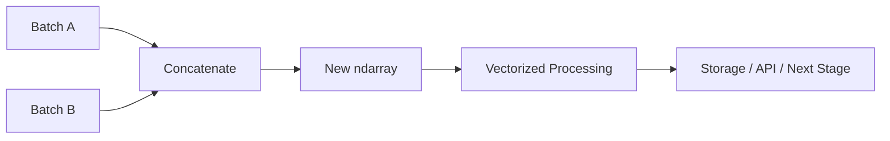
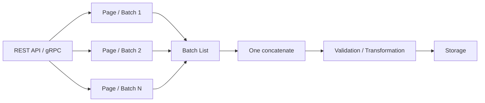
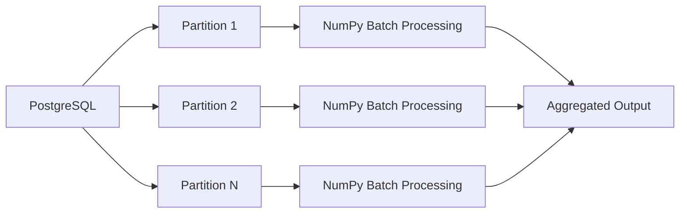

# 06- Concatenate

## Overview

Concatenation combines existing NumPy arrays into a larger array along an existing axis.

It is one of the core array-manipulation operations used in batch processing, ETL pipelines, numerical transformation, and dataset assembly. The important engineering concern is that concatenation normally creates a **new array** containing the combined data, which means both CPU and memory costs can become significant for large inputs.

The key model is:

```text
Array A
   +
Array B
   ↓
concatenate
   ↓
New array
```

Unlike slicing or many transpose operations, concatenation generally requires copying the source values into newly allocated storage.



## What Concatenate Does

Consider two arrays with the same number of columns:

```python
import numpy as np

first = np.array(
    [
        [1, 2],
        [3, 4],
    ]
)

second = np.array(
    [
        [5, 6],
        [7, 8],
    ]
)
```

Concatenating along axis 0:

```python
combined = np.concatenate([first, second], axis=0)

print(combined)
```

```text
[[1 2]
 [3 4]
 [5 6]
 [7 8]]
```

The resulting shape is:

```text
(4, 2)
```

The arrays were combined by adding more rows.

## Axis Determines the Join Direction

For a two-dimensional array:

```text
axis 0 → rows
axis 1 → columns
```

Therefore:

```python
np.concatenate([first, second], axis=0)
```

means:

```text
append rows
```

while:

```python
np.concatenate([first, second], axis=1)
```

means:

```text
append columns
```

For axis 1 to work, the arrays must have compatible sizes along axis 0:

```python
left = np.array(
    [
        [1, 2],
        [3, 4],
    ]
)

right = np.array(
    [
        [5],
        [6],
    ]
)

combined = np.concatenate([left, right], axis=1)

print(combined)
```

```text
[[1 2 5]
 [3 4 6]]
```

## Shape Compatibility

Concatenation requires compatible dimensions in all axes except the concatenation axis.

Suppose:

```text
A.shape = (100, 8)
B.shape = (50, 8)
```

Then:

```python
np.concatenate([A, B], axis=0)
```

is valid because:

```text
axis 1:
8 == 8
```

and axis 0 is the dimension being combined.

But:

```text
A.shape = (100, 8)
B.shape = (100, 6)
```

cannot be concatenated along axis 0 because:

```text
axis 1:
8 != 6
```

The validation rule is:

```text
all non-concatenated dimensions must match
```

## Concatenating One-Dimensional Arrays

For one-dimensional arrays:

```python
import numpy as np

a = np.array([1, 2, 3])
b = np.array([4, 5])

result = np.concatenate([a, b])

print(result)
# [1 2 3 4 5]
```

A one-dimensional array has only `axis=0`, so there is no second axis along which it can be concatenated.

To create a new dimension instead, use `stack()`.

## `concatenate()` vs `stack()`

These APIs are closely related but solve different problems.

| Operation | Existing axes | Creates new axis | Example shape |
|---|---:|---:|---|
| `concatenate()` | Combines along one existing axis | No | `(2, 3)` + `(4, 3)` → `(6, 3)` |
| `stack()` | Inputs must align | Yes | `(3,)` + `(3,)` → `(2, 3)` |

Example:

```python
import numpy as np

a = np.array([1, 2, 3])
b = np.array([4, 5, 6])

concatenated = np.concatenate([a, b])
stacked = np.stack([a, b])

print(concatenated.shape)
# (6,)

print(stacked.shape)
# (2, 3)
```

The semantic distinction is:

```text
concatenate
→ add data along an existing dimension

stack
→ create a new dimension containing the inputs
```

## `concatenate()` vs `hstack()` and `vstack()`

NumPy also provides convenience functions:

```python
np.hstack(...)
np.vstack(...)
```

For two-dimensional arrays, they commonly correspond to horizontal and vertical composition.

```python
horizontal = np.hstack([left, right])
vertical = np.vstack([first, second])
```

However, `concatenate()` is often clearer in production numerical code because it makes the axis explicit:

```python
np.concatenate([first, second], axis=0)
np.concatenate([left, right], axis=1)
```

Explicit axis semantics are easier to review and maintain, especially with higher-dimensional arrays.

## Concatenation Creates a New Array

Concatenation generally allocates destination storage.

```python
import numpy as np

a = np.arange(6)
b = np.arange(6, 12)

result = np.concatenate([a, b])

print(np.shares_memory(a, result))
# False

print(np.shares_memory(b, result))
# False
```

The source arrays remain independent.

Conceptually:

```text
A → ┐
    ├→ allocate destination → copy A + copy B
B → ┘
```

This is important for large arrays.

## Memory Cost

Suppose:

```text
A = 500 MB
B = 500 MB
```

A concatenation may require:

```text
Source A        500 MB
Source B        500 MB
Destination   ~1000 MB
----------------------
Peak          ~2000 MB
```

Actual process memory can be higher because of Python objects, temporary arrays, allocator behavior, and other application state.

Therefore, concatenation can be a significant memory event even when the final array size appears reasonable.

## Repeated Concatenation Is Expensive

A common inefficient pattern is:

```python
import numpy as np

result = np.empty((0, 8), dtype=np.float64)

for batch in batches:
    result = np.concatenate([result, batch], axis=0)
```

Each iteration may allocate a larger destination and copy existing values again.

Conceptually:

```text
batch 1
    ↓
copy 1

batch 1 + batch 2
    ↓
copy previous data again

batch 1 + batch 2 + batch 3
    ↓
copy previous data again
```

For many batches, this can create substantial cumulative data movement.

## Preferred Batch Accumulation Pattern

When the number of batches is known or reasonably bounded, collect arrays and concatenate once:

```python
import numpy as np


def combine_batches(
    batches: list[np.ndarray],
) -> np.ndarray:
    if not batches:
        return np.empty((0, 0), dtype=np.float64)

    return np.concatenate(batches, axis=0)
```

The pipeline becomes:

```text
Batch 1 ─┐
Batch 2 ─┤
Batch 3 ─┤
Batch 4 ─┘
      ↓
one concatenate
      ↓
final array
```

This usually avoids repeatedly copying already accumulated data.

## Preallocation for Fixed Output Size

If the final size is known, preallocation can be even more explicit.

```python
import numpy as np


def combine_fixed_batches(
    batches: list[np.ndarray],
) -> np.ndarray:
    if not batches:
        return np.empty((0, 0), dtype=np.float64)

    rows = sum(batch.shape[0] for batch in batches)
    columns = batches[0].shape[1]

    result = np.empty(
        (rows, columns),
        dtype=batches[0].dtype,
    )

    offset = 0

    for batch in batches:
        end = offset + batch.shape[0]
        result[offset:end] = batch
        offset = end

    return result
```

This still copies each batch once, but the destination is allocated only once.

Use this approach when:

- Final size is known.
- The destination is large.
- Dtype and shape are controlled.
- Predictable memory behavior matters.

## Concatenating API Batches

A realistic ETL pipeline may receive pages of numeric records:

```text
API page 1
API page 2
API page 3
...
```

A practical pattern is:



For example:

```python
import numpy as np


def combine_api_batches(
    batches: list[list[list[float]]],
) -> np.ndarray:
    arrays = [
        np.asarray(batch, dtype=np.float64)
        for batch in batches
    ]

    if not arrays:
        return np.empty((0, 0), dtype=np.float64)

    expected_columns = arrays[0].shape[1]

    for array in arrays:
        if array.ndim != 2:
            raise ValueError("Every batch must be two-dimensional")

        if array.shape[1] != expected_columns:
            raise ValueError("Batch schemas do not match")

    return np.concatenate(arrays, axis=0)
```

The important point is that schema validation happens before the final merge.

## Input Validation

When combining external or heterogeneous batches, validate:

- Number of dimensions.
- Feature count.
- Dtype expectations.
- Element count.
- Empty batches.
- Missing values.
- Non-finite numerical values where required.

For example:

```python
import numpy as np


def validate_batch(batch: np.ndarray, columns: int) -> None:
    if batch.ndim != 2:
        raise ValueError("Expected a two-dimensional batch")

    if batch.shape[1] != columns:
        raise ValueError("Unexpected column count")

    if not np.isfinite(batch).all():
        raise ValueError("Batch contains non-finite values")
```

Without explicit validation, a concatenation failure can occur deep inside a processing pipeline where debugging is harder.

## Dtype Compatibility

Concatenation can result in dtype promotion when the inputs have different dtypes.

```python
import numpy as np

integers = np.array([1, 2, 3], dtype=np.int32)
floats = np.array([4.5, 5.5], dtype=np.float64)

result = np.concatenate([integers, floats])

print(result.dtype)
# float64
```

This can be correct, but it increases the per-element storage compared with the original integer array.

For large datasets, dtype promotion can significantly affect memory.

A production pipeline should define a canonical dtype where appropriate:

```python
arrays = [
    np.asarray(batch, dtype=np.float32)
    for batch in batches
]
```

Do not assume concatenation will preserve the smallest input dtype.

## Dtype and Memory Amplification

Suppose:

```text
10 million elements
int32 → ~40 MB
float64 → ~80 MB
```

A hidden promotion can therefore double the raw data-buffer size.

This is especially relevant when:

```text
large source arrays
        ↓
dtype promotion
        ↓
concatenate
        ↓
large destination
```

can temporarily require both source and promoted destination storage.

Inspect:

```python
print(array.dtype)
print(array.itemsize)
print(array.nbytes)
```

before large concatenations when memory limits are tight.

## Concatenating More Than Two Arrays

The API accepts a sequence:

```python
result = np.concatenate(
    [batch1, batch2, batch3, batch4],
    axis=0,
)
```

This is preferable to repeatedly chaining:

```python
result = np.concatenate([batch1, batch2])
result = np.concatenate([result, batch3])
result = np.concatenate([result, batch4])
```

The chained form can repeatedly copy accumulated data.

## Empty Arrays

Empty inputs require explicit consideration.

```python
import numpy as np

empty = np.empty((0, 4), dtype=np.float64)
batch = np.array(
    [
        [1.0, 2.0, 3.0, 4.0],
    ]
)

result = np.concatenate([empty, batch], axis=0)

print(result.shape)
# (1, 4)
```

The empty array still needs a compatible shape.

This is a useful pattern for representing an empty table with a known schema:

```text
(0, feature_count)
```

rather than:

```text
(0,)
```

The latter loses the feature dimension and may cause later concatenation failures.

## Concatenation Along Higher-Dimensional Axes

Concatenation is not limited to two dimensions.

Consider:

```python
import numpy as np

first = np.empty((4, 8, 3))
second = np.empty((2, 8, 3))
```

Concatenating along axis 0:

```python
result = np.concatenate([first, second], axis=0)

print(result.shape)
# (6, 8, 3)
```

The other dimensions remain compatible.

Similarly:

```python
first = np.empty((4, 8, 3))
second = np.empty((4, 5, 3))

result = np.concatenate([first, second], axis=1)

print(result.shape)
# (4, 13, 3)
```

The third dimension still needs to match.

## `np.block()`

For more structured multidimensional composition, `np.block()` can express block layouts.

```python
import numpy as np

top = np.array(
    [
        [1, 2],
        [3, 4],
    ]
)

bottom = np.array(
    [
        [5, 6],
        [7, 8],
    ]
)

result = np.block(
    [
        [top, top],
        [bottom, bottom],
    ]
)
```

Use `block()` when the requirement is genuinely a block composition.

For simple append-along-axis operations, `concatenate()` is usually clearer.

## `column_stack()` and `row_stack()`

Specialized helpers can also exist for one-dimensional inputs.

```python
import numpy as np

timestamps = np.array([1, 2, 3])
values = np.array([10.0, 20.0, 30.0])

result = np.column_stack([timestamps, values])

print(result)
```

```text
[[ 1. 10.]
 [ 2. 20.]
 [ 3. 30.]]
```

This can be convenient when constructing tabular arrays, but explicit `reshape()` plus `concatenate()` or `stack()` may be easier to reason about in reusable numerical code.

## Concatenation vs Stacking vs Splitting

| Operation | Main purpose |
|---|---|
| `concatenate()` | Join arrays along an existing axis |
| `stack()` | Add a new axis and combine arrays |
| `split()` | Divide one array along an axis |
| `vstack()` | Convenience row-oriented stacking |
| `hstack()` | Convenience column-oriented stacking |
| `block()` | Construct block-shaped arrays |

A useful decision rule is:

```text
Existing dimension?
→ concatenate()

New dimension?
→ stack()

Need to partition data?
→ split()
```

## Concatenation and Views

Slicing commonly produces views:

```python
batch = source[start:end]
```

Concatenating those views creates a new destination:

```python
combined = np.concatenate([batch1, batch2], axis=0)
```

The resulting array does not simply become a larger view spanning unrelated source buffers.

This is important because concatenate should be treated as an explicit materialization boundary.

## Concatenation and Memory Mapping

Memory-mapped arrays can provide access to large files without loading the entire dataset into RAM.

However, concatenating multiple large memory-mapped arrays into a regular ndarray materializes the combined data in memory.

```python
first = np.memmap("part1.dat", dtype=np.float32, mode="r")
second = np.memmap("part2.dat", dtype=np.float32, mode="r")

combined = np.concatenate([first, second])
```

The resulting array can require enough memory to hold the complete combination.

For truly large datasets, prefer streaming, chunked processing, or an output format designed for partitioned storage instead of blindly concatenating everything into RAM.

## Large-Scale Data Processing

For large datasets, ask whether concatenation is actually necessary.

If the next stage can process batches independently:

```text
Batch 1 → process → persist
Batch 2 → process → persist
Batch 3 → process → persist
```

is often preferable to:

```text
Batch 1 ─┐
Batch 2 ─┤
Batch 3 ─┤
          ↓
      concatenate
          ↓
     large array
          ↓
       process
```

The batch-preserving architecture reduces peak memory and can improve fault isolation.

## PostgreSQL and ETL Considerations

Suppose a database query produces 20 million rows across several partitions.

A naive Python pipeline might:

```text
query partition 1
→ NumPy array

query partition 2
→ NumPy array

...

concatenate all
→ one huge array
```

A more scalable design can process each partition independently:



Push filtering and aggregation into PostgreSQL whenever that reduces transferred data without compromising the numerical processing requirements.

Use concatenation when the downstream algorithm genuinely requires a unified array.

## FastAPI and Celery Workloads

In an API service or Celery worker, concatenation should be bounded by explicit resource limits.

For example:

```text
Maximum batches: 100
Maximum records per batch: 10,000
Maximum columns: 32
Maximum combined records: 500,000
```

These constraints can prevent accidental memory exhaustion.

```python
MAX_RECORDS = 500_000
MAX_COLUMNS = 32


def validate_combined_size(
    batches: list[np.ndarray],
) -> None:
    total_records = sum(batch.shape[0] for batch in batches)

    if total_records > MAX_RECORDS:
        raise ValueError("Combined batch exceeds configured limit")

    if any(batch.shape[1] > MAX_COLUMNS for batch in batches):
        raise ValueError("Batch exceeds configured column limit")
```

The exact limits should be derived from workload characteristics and worker memory budgets.

## Performance Considerations

Concatenation of `N` total elements generally requires:

```text
allocate destination
+
copy N elements
```

so the data movement is approximately `O(N)`.

The more important production issue is repeated concatenation.

Repeated growth can result in cumulative copying significantly larger than the final dataset.

Prefer:

```text
collect → concatenate once
```

over:

```text
concatenate → concatenate → concatenate → ...
```

when the final array is genuinely required.

## Benchmarking Concatenation

A useful benchmark compares:

```python
from time import perf_counter

start = perf_counter()
result = np.concatenate(batches, axis=0)
elapsed = perf_counter() - start

print(f"concatenate: {elapsed:.6f}s")
```

with an alternative such as preallocation when applicable.

Do not benchmark only elapsed time.

Also evaluate:

- Final array size.
- Peak memory.
- Dtype promotion.
- Number of batches.
- Batch size.
- Shape compatibility checks.
- Downstream processing cost.

The fastest concatenate operation is not necessarily the best system design if the resulting array causes memory pressure downstream.

## Production Pattern

A robust numerical batch pipeline often looks like:

```text
Input sources
     ↓
Bounded batches
     ↓
Schema / dtype validation
     ↓
Can processing remain batch-local?
     ├── Yes → process independently
     └── No  → concatenate once
                    ↓
              vectorized processing
                    ↓
               aggregation
                    ↓
                 storage
```

This makes concatenation a deliberate architectural decision rather than a default collection mechanism.

## Common Mistakes

### Repeatedly Concatenating Inside a Loop

This can repeatedly allocate and copy accumulated data.

**Prefer:** collect batches and concatenate once, preallocate when size is known, or process batches independently.

### Ignoring Shape Compatibility

A concatenation can fail because a non-concatenated dimension differs.

**Avoid it:** validate the expected shape contract before combining.

### Ignoring Dtype Promotion

Combining `int32` and `float64` can produce a larger dtype.

**Avoid it:** establish canonical dtypes for production pipelines.

### Assuming Concatenation Is Zero-Copy

Unlike many views, concatenation normally materializes a new array.

**Avoid it:** account for destination memory and peak RSS.

### Concatenating Data That Could Be Processed Independently

A unified array may not be necessary.

**Avoid it:** retain batch boundaries when downstream processing can operate independently.

### Loading Entire Datasets to Concatenate Them

This can produce avoidable memory pressure.

**Avoid it:** use chunked processing, partitioned storage, or database-side aggregation.

### Using `hstack()` or `vstack()` Without Understanding Semantics

Convenience APIs can obscure axis behavior, especially for higher-dimensional arrays.

**Prefer:** explicit `concatenate(..., axis=...)` when the axis is part of the data contract.

### Concatenating Empty Arrays with Incompatible Schemas

An empty array still has a shape and dtype.

**Avoid it:** represent empty batches using the same dimensional schema and dtype as non-empty batches.

## Testing Concatenation

Test both shape and values.

```python
import numpy as np


def test_concatenate_rows():
    first = np.array(
        [
            [1, 2],
            [3, 4],
        ]
    )

    second = np.array(
        [
            [5, 6],
        ]
    )

    result = np.concatenate(
        [first, second],
        axis=0,
    )

    assert result.shape == (3, 2)

    np.testing.assert_array_equal(
        result,
        np.array(
            [
                [1, 2],
                [3, 4],
                [5, 6],
            ]
        ),
    )
```

Test failure conditions explicitly:

```python
def test_concatenate_rejects_incompatible_shapes():
    first = np.empty((2, 3))
    second = np.empty((2, 4))

    try:
        np.concatenate([first, second], axis=0)
    except ValueError:
        pass
    else:
        raise AssertionError("Expected ValueError")
```

For production pipelines, also test:

- Empty input.
- Single-batch input.
- Multiple batches.
- Different dtypes.
- Maximum supported batch size.
- Shape mismatches.
- Non-finite values where relevant.
- Memory-sensitive workloads.

## Debugging Concatenation Problems

Inspect every input before combining:

```python
for index, batch in enumerate(batches):
    print(
        index,
        "shape=", batch.shape,
        "dtype=", batch.dtype,
        "nbytes=", batch.nbytes,
    )
```

A useful diagnostic sequence is:

```text
Check number of arrays
      ↓
Check ndim
      ↓
Check concatenation axis
      ↓
Compare all other dimensions
      ↓
Check dtype
      ↓
Estimate destination memory
      ↓
Inspect downstream processing
```

For large arrays, calculate expected destination size before concatenation:

```python
rows = sum(batch.shape[0] for batch in batches)
columns = batches[0].shape[1]

expected_bytes = rows * columns * batches[0].dtype.itemsize

print(expected_bytes)
```

This does not account for all process memory, but it provides an important first-order estimate.

## Interview Questions

### What does `np.concatenate()` do?

It joins arrays along an existing axis and normally creates a new array containing the combined values.

### What are the shape requirements?

All dimensions except the concatenation axis must match.

### What is the difference between `concatenate()` and `stack()`?

`concatenate()` joins along an existing axis. `stack()` creates a new axis and places the input arrays along that dimension.

### Is `concatenate()` zero-copy?

Generally no. It needs a destination buffer containing the combined data.

### Why is repeated concatenation inefficient?

Each growth may require allocating a larger destination and copying the accumulated data again, resulting in substantial repeated data movement.

### How would you combine many batches efficiently?

Collect the batches and concatenate once, preallocate when the final size is known, or avoid concatenation entirely by processing each batch independently.

### How can dtype promotion affect memory?

If inputs have different dtypes, NumPy may promote the result to a wider dtype, increasing bytes per element and therefore total memory consumption.

### When would you avoid concatenating a large dataset?

When downstream processing can operate independently on batches or when the combined array would exceed practical memory limits.

### Why might PostgreSQL aggregation be preferable to concatenating everything in Python?

If filtering or aggregation can be performed efficiently in the database, it can reduce network transfer, Python memory use, and the amount of numerical data that must be materialized.

## Key Takeaways

- `np.concatenate()` joins arrays along an existing axis and normally allocates a new destination array, so its memory cost must be considered for large datasets.
- All dimensions except the concatenation axis must be compatible; explicit axis semantics make the operation easier to reason about and maintain.
- Avoid repeated concatenation inside loops because accumulated data may be repeatedly copied; prefer one final concatenation, preallocation, or batch-local processing.
- Dtype promotion can increase memory consumption, so establish and validate canonical dtypes before combining large numerical batches.
- Concatenation should be a deliberate materialization step in production pipelines, not an automatic substitute for bounded batch processing or database-side reduction.