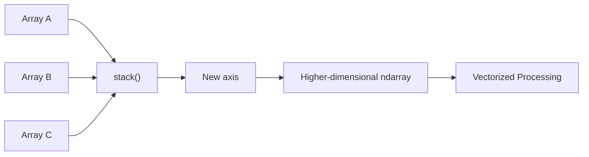
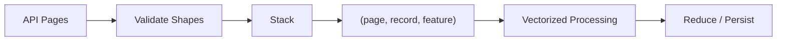

# 07- Stack

## Overview

Stacking combines arrays by introducing a **new axis**. This is the key distinction between `np.stack()` and `np.concatenate()`:

```text
concatenate()
→ combine along an existing axis

stack()
→ create a new axis and place the inputs along it
```

Stacking is useful when multiple arrays represent separate instances of the same structure and the application needs to represent those instances as one higher-dimensional array.

Typical backend and data-engineering examples include:

- Building batches from independent numerical records.
- Combining repeated measurements into a batch dimension.
- Grouping time-window arrays into a higher-dimensional structure.
- Creating consistent tensors for downstream numerical processing.
- Preserving the distinction between individual inputs and their internal dimensions.



The main engineering questions are:

- Where should the new axis be inserted?
- Are the input shapes compatible?
- Does the new dimension have a clear semantic meaning?
- Is the additional allocation acceptable?
- Would batch-local processing be better than materializing one larger array?

## What `stack()` Does

Suppose several arrays have the same shape:

```python
import numpy as np

first = np.array([10, 20, 30])
second = np.array([40, 50, 60])
third = np.array([70, 80, 90])
```

Stack them along a new axis:

```python
result = np.stack(
    [first, second, third],
    axis=0,
)

print(result)
```

```text
[[10 20 30]
 [40 50 60]
 [70 80 90]]
```

The input shape is:

```text
(3,)
```

The output shape is:

```text
(3, 3)
```

A new axis has been inserted.

Conceptually:

```text
input shape:
(3,)

stack(axis=0):

(3, 3)
 ↑
new axis
```

## Why Stacking Exists

Suppose three arrays represent independent batches:

```text
batch A → (100, 8)
batch B → (100, 8)
batch C → (100, 8)
```

Concatenating them:

```text
(300, 8)
```

means:

```text
"these are additional records in one collection"
```

Stacking them:

```text
(3, 100, 8)
```

means:

```text
"these are three separate batches, each containing 100 records with 8 features"
```

That semantic distinction is the primary reason `stack()` exists.

## Shape Semantics

If each input has shape:

```text
(S0, S1, ..., SN-1)
```

then stacking `K` such arrays creates:

```text
(Snew, S0, S1, ..., SN-1)
```

when using `axis=0`.

For example:

```text
Input:
(100, 8)

3 arrays

stack(axis=0):
(3, 100, 8)
```

The new axis represents the collection of input arrays.

This is particularly useful when the extra dimension has a business meaning such as:

```text
batch
replica
time window
partition
experiment run
```

## `axis=0`

The most common form is:

```python
result = np.stack(
    [first, second, third],
    axis=0,
)
```

For inputs:

```text
(100, 8)
```

the result becomes:

```text
(3, 100, 8)
```

The interpretation is:

```text
axis 0 → batch
axis 1 → records
axis 2 → features
```

This is a natural representation for batch-oriented numerical processing.

## `axis=1`

The new axis can be inserted at another position.

```python
import numpy as np

first = np.array([10, 20, 30])
second = np.array([40, 50, 60])

result = np.stack(
    [first, second],
    axis=1,
)

print(result)
```

```text
[[10 40]
 [20 50]
 [30 60]]
```

The output shape is:

```text
(3, 2)
```

The semantic interpretation is:

```text
axis 0 → original element position
axis 1 → input array
```

This is different from:

```python
np.stack([first, second], axis=0)
```

which produces:

```text
(2, 3)
```

with:

```text
axis 0 → input array
axis 1 → original element position
```

## Axis Placement

For an input shape:

```text
(4, 8)
```

stacking four arrays produces different shapes depending on the new axis:

| `axis` | Result shape | New axis position |
|---|---|---|
| `0` | `(4, 4, 8)` | Beginning |
| `1` | `(4, 4, 8)` | Middle |
| `2` | `(4, 8, 4)` | End |

With symmetric dimensions, shapes alone may not reveal the difference. Axis semantics matter.

For non-symmetric inputs:

```text
input shape = (100, 8)
```

then:

```text
axis=0 → (3, 100, 8)
axis=1 → (100, 3, 8)
axis=2 → (100, 8, 3)
```

This makes the choice easier to reason about.

## `stack()` Requires Compatible Shapes

All input arrays must have the same shape for ordinary stacking.

This is valid:

```python
a = np.empty((100, 8))
b = np.empty((100, 8))
c = np.empty((100, 8))

result = np.stack([a, b, c], axis=0)
```

This is invalid:

```python
a = np.empty((100, 8))
b = np.empty((80, 8))

result = np.stack([a, b], axis=0)
```

The arrays represent different shapes and cannot simply become slices of one newly inserted dimension.

Validate shape contracts before stacking when inputs originate from external systems.

## `stack()` vs `concatenate()`

This distinction is fundamental.

| Requirement | `stack()` | `concatenate()` |
|---|---:|---:|
| Uses existing axis | No | Yes |
| Creates new axis | Yes | No |
| Inputs need same shape | Yes | Compatible non-joined dimensions |
| Typical use | Build batches | Append data |
| Example | `(8,) × 3 → (3, 8)` | `(8,) × 3 → (24,)` |

Example:

```python
import numpy as np

a = np.array([1, 2, 3])
b = np.array([4, 5, 6])

stacked = np.stack([a, b], axis=0)
concatenated = np.concatenate([a, b])

print(stacked.shape)
# (2, 3)

print(concatenated.shape)
# (6,)
```

The choice should reflect the meaning of the data.

## Stack as Batch Construction

A strong backend-oriented use case is building a batch from independent records.

Suppose each request produces a fixed-size metric vector:

```text
request 1 → (8,)
request 2 → (8,)
request 3 → (8,)
```

Stack them:

```python
import numpy as np

request_1 = np.array([1.0, 2.0, 3.0, 4.0, 5.0, 6.0, 7.0, 8.0])
request_2 = np.array([1.5, 2.5, 3.5, 4.5, 5.5, 6.5, 7.5, 8.5])
request_3 = np.array([0.5, 1.5, 2.5, 3.5, 4.5, 5.5, 6.5, 7.5])

batch = np.stack(
    [request_1, request_2, request_3],
    axis=0,
)

print(batch.shape)
# (3, 8)
```

Now:

```text
axis 0 → requests
axis 1 → metrics
```

This creates a clean shape contract for downstream processing.

## Stack and Time Windows

Consider metrics collected in independent windows:

```text
window 1 → (60, 8)
window 2 → (60, 8)
window 3 → (60, 8)
```

Stacking:

```python
windows = np.stack(
    [window_1, window_2, window_3],
    axis=0,
)
```

produces:

```text
(3, 60, 8)
```

The axes can now represent:

```text
axis 0 → windows
axis 1 → samples within window
axis 2 → metrics
```

This is useful when the distinction between windows must remain available to later processing.

Concatenating instead would produce:

```text
(180, 8)
```

which intentionally removes the window boundary.

## Stack and Replicas

Suppose multiple services emit the same metric schema:

```text
service A → (100, 8)
service B → (100, 8)
service C → (100, 8)
```

Stacking can preserve service identity as a dimension:

```python
replicas = np.stack(
    [service_a, service_b, service_c],
    axis=0,
)
```

Result:

```text
(3, 100, 8)
```

with:

```text
axis 0 → service
axis 1 → records
axis 2 → metrics
```

This representation can make per-service or cross-service aggregation straightforward.

## Stack and Broadcasting

Adding a dimension can make broadcasting semantics explicit.

Suppose:

```text
data.shape = (3, 100, 8)
```

where:

```text
axis 0 → service
axis 1 → records
axis 2 → metrics
```

A per-service scaling vector could be shaped:

```text
(3, 1, 1)
```

so that:

```python
scaled = data * service_scale
```

broadcasts one scale value across every record and metric for each service.

This illustrates an important relationship:

```text
stacking
→ establishes dimensional structure

broadcasting
→ operates across that dimensional structure
```

## Stack and Aggregation

Once batches or windows have been stacked, reductions can operate across the new dimension.

```python
import numpy as np

batches = np.stack(
    [batch_a, batch_b, batch_c],
    axis=0,
)

overall_mean = batches.mean(axis=0)
```

If:

```text
batches.shape == (3, 100, 8)
```

then:

```text
batches.mean(axis=0)
→ (100, 8)
```

This computes the mean across the three input batches while retaining their internal structure.

Alternatively:

```python
batch_means = batches.mean(axis=(1, 2))
```

produces:

```text
(3,)
```

with one mean per input batch.

Axis semantics make the operation explicit.

## Stack and `keepdims`

As with other reductions, `keepdims=True` can preserve dimensional alignment.

```python
mean = batches.mean(
    axis=0,
    keepdims=True,
)

print(mean.shape)
# (1, 100, 8)
```

This can be useful when the result will later be broadcast against the original stacked representation:

```python
centered = batches - mean
```

The shapes align naturally:

```text
batches → (3, 100, 8)
mean    → (1, 100, 8)
```

## Stack Creates a New Array

Unlike many basic slicing operations, stacking normally materializes a new array.

```python
import numpy as np

a = np.arange(3)
b = np.arange(3, 6)

result = np.stack([a, b])

print(np.shares_memory(a, result))
# False

print(np.shares_memory(b, result))
# False
```

This means the operation has allocation and data-copy costs.

For large batches:

```text
Input arrays
+
New stacked buffer
```

can temporarily increase memory usage significantly.

## Memory Implications

Suppose there are:

```text
3 arrays
each = 200 MB
```

Stacking them can require approximately:

```text
Existing arrays:
200 + 200 + 200 = 600 MB

Stacked destination:
~600 MB

Potential peak:
~1.2 GB
```

The exact process RSS will depend on the application and allocator, but the conceptual cost is important.

Do not stack large arrays simply to make their representation look convenient if they can be processed independently.

## Stack vs Batch Processing

A common production decision is:

```text
Should the system materialize:
(batch_count, records, features)
```

or process:

```text
batch 1
batch 2
batch 3
...
```

independently?

Stacking makes sense when the downstream algorithm genuinely benefits from having the extra dimension available.

Batch-local processing is preferable when:

- Data is too large for comfortable memory limits.
- Each batch can be processed independently.
- Intermediate persistence is available.
- Fault isolation is useful.
- Streaming behavior is preferred.

## API Batch Processing

Suppose a service retrieves fixed-shape API pages:

```text
page 1 → (1000, 8)
page 2 → (1000, 8)
page 3 → (1000, 8)
```

If cross-page operations are required, stack:

```python
pages = np.stack(
    [page_1, page_2, page_3],
    axis=0,
)
```

Result:

```text
(3, 1000, 8)
```

The pipeline becomes:



If cross-page structure is irrelevant, processing pages independently avoids the additional allocation.

## Stack and Celery

A Celery worker may process several independently produced batches.

A safe design is:

```text
Task result 1 → ndarray
Task result 2 → ndarray
Task result 3 → ndarray
        ↓
Validate shape / dtype
        ↓
stack if cross-task dimension matters
        ↓
Numerical processing
```

Avoid stacking arbitrary task outputs without resource limits.

If each task can return a large array, a coordinator that stacks hundreds of them can become a memory hotspot.

For large workflows, prefer:

```text
object storage
+
partitioned datasets
+
bounded aggregation
```

rather than passing large arrays through task metadata or broker messages.

## Stack and Kafka

Kafka consumers naturally operate on records or batches of records.

If each consumer batch has the same numerical schema, stacking can establish a higher-level processing dimension:

```text
consumer batch
    ↓
ndarray (records, features)

multiple batches
    ↓ stack
(batch, records, features)
```

However, Kafka-style streaming workloads generally benefit from bounded processing rather than accumulating an unbounded stack.

Use a maximum number of batches or records per processing window.

## Stack and Pandas

When multiple DataFrames have the same schema, Pandas may be the more natural abstraction for row-wise or labeled data composition.

NumPy stacking becomes more appropriate after conversion when the operation is primarily numerical.

For example:

```python
import numpy as np

arrays = [
    frame.to_numpy(dtype=np.float64)
    for frame in frames
]

batch = np.stack(arrays, axis=0)
```

Before converting, ask whether the entire operation could remain in Pandas.

Representation changes add memory and maintenance costs.

## `dstack()`

`np.dstack()` is a convenience function for stacking arrays along the third dimension.

For example:

```python
import numpy as np

a = np.array(
    [
        [1, 2],
        [3, 4],
    ]
)

b = np.array(
    [
        [5, 6],
        [7, 8],
    ]
)

result = np.dstack([a, b])

print(result.shape)
# (2, 2, 2)
```

For engineering code, explicit `stack()` is often easier to reason about:

```python
result = np.stack([a, b], axis=2)
```

The explicit axis makes the dimensional contract visible.

## `column_stack()` and Stacking

`column_stack()` is useful for turning one-dimensional inputs into columns.

```python
import numpy as np

latency = np.array([100.0, 110.0, 105.0])
throughput = np.array([80.0, 85.0, 82.0])

result = np.column_stack(
    [latency, throughput],
)

print(result.shape)
# (3, 2)
```

This is different from ordinary `stack()` along axis 0:

```python
np.stack([latency, throughput], axis=0).shape
# (2, 3)
```

Choose the operation based on the desired semantic orientation.

## `vstack()` and `hstack()`

These convenience functions can be useful for common layouts:

```python
rows = np.vstack([a, b])
columns = np.hstack([a, b])
```

But they can be less explicit for higher-dimensional arrays.

For production code where shape semantics matter, explicit operations are often easier to review:

```python
np.concatenate(...)
np.stack(...)
```

Use specialized convenience functions when they make the code clearer rather than merely shorter.

## Stack and Dtype Promotion

Like concatenation, stacking can result in dtype promotion.

```python
import numpy as np

integers = np.array([1, 2, 3], dtype=np.int32)
floats = np.array([4.0, 5.0, 6.0], dtype=np.float64)

result = np.stack([integers, floats])

print(result.dtype)
# float64
```

This can increase memory usage.

When processing large batches, normalize dtypes before stacking:

```python
arrays = [
    np.asarray(batch, dtype=np.float32)
    for batch in batches
]

stacked = np.stack(arrays, axis=0)
```

This makes the memory contract explicit.

## Empty Inputs

`np.stack()` requires at least one array.

```python
np.stack([])
```

raises an error.

For APIs where an empty collection is a valid state, handle it before calling `stack()`:

```python
import numpy as np


def stack_batches(
    batches: list[np.ndarray],
    shape: tuple[int, ...],
    dtype: np.dtype,
) -> np.ndarray:
    if not batches:
        return np.empty((0, *shape), dtype=dtype)

    return np.stack(batches, axis=0)
```

The chosen empty representation should match the application's shape contract.

For example:

```text
normal:
(batch, records, features)

empty:
(0, records, features)
```

can preserve dimensional semantics.

## Stack and Validation

A production stack operation should normally validate:

```text
number of arrays
       ↓
ndim
       ↓
shape equality
       ↓
dtype
       ↓
element count
       ↓
estimated output memory
```

Example:

```python
import numpy as np


def validate_stack_inputs(
    arrays: list[np.ndarray],
) -> None:
    if not arrays:
        raise ValueError("At least one array is required")

    reference_shape = arrays[0].shape
    reference_dtype = arrays[0].dtype

    for array in arrays:
        if array.shape != reference_shape:
            raise ValueError(
                f"Expected shape {reference_shape}, got {array.shape}"
            )

        if array.dtype != reference_dtype:
            raise ValueError(
                f"Expected dtype {reference_dtype}, got {array.dtype}"
            )
```

This is particularly useful when arrays originate from separate services or independent pipeline stages.

## Large Dataset Considerations

Before stacking:

```python
element_count = len(arrays) * arrays[0].size
estimated_bytes = (
    element_count * arrays[0].dtype.itemsize
)
```

For example:

```python
print(f"Estimated output bytes: {estimated_bytes}")
```

This only estimates the raw output buffer.

Peak memory can be much higher because all source arrays may still exist while the stacked destination is allocated.

For large datasets, consider:

```text
Do we need the complete stacked structure?
```

If not:

```text
process batch
→ discard / persist
→ process next batch
```

is often the better architecture.

## Performance Considerations

For `K` arrays containing `N` elements each, stack must generally:

```text
allocate K × N elements
+
copy K × N elements
```

so the operation is approximately linear in the amount of output data.

The bigger performance concern is often unnecessary stacking.

For example:

```text
3 batches × 100 MB
```

may seem manageable, but:

```text
100 batches × 100 MB
```

creates a 10 GB logical stack before accounting for source arrays and application overhead.

Use stacking when the higher-dimensional representation provides meaningful downstream value.

## Stack and Contiguous Layout

A newly materialized stacked array is typically stored as a regular contiguous array under common conditions.

You can inspect:

```python
print(stacked.flags.c_contiguous)
```

However, the final layout depends on dtype, shape, and operation details.

The important distinction from transpose is:

```text
stack()
→ constructs new storage

transpose()
→ often reinterprets existing storage
```

Therefore stacking can intentionally establish a new layout at the cost of allocation and copying.

## Stack for Cache-Friendly Processing

Sometimes materializing a stacked array can simplify downstream vectorized processing by giving the workload a predictable layout.

For example:

```text
separate arrays
    ↓
stack
    ↓
regular batched ndarray
    ↓
single vectorized operation
```

This can be beneficial if the downstream computation is repeated many times.

The engineering trade-off is:

```text
one-time allocation + copy
vs
simpler / faster repeated processing
```

This is a legitimate optimization only when measured against the actual workload.

## Common Mistakes

### Confusing `stack()` with `concatenate()`

`stack()` adds a new axis.

`concatenate()` extends an existing axis.

Choose based on data semantics rather than API similarity.

### Stacking Arrays with Different Shapes

All inputs must have compatible shapes for the new dimension.

Validate independent data sources before stacking.

### Stacking Large Arrays Unnecessarily

Stacking materializes another large buffer.

Process batches independently when the additional dimension provides no operational value.

### Forgetting What the New Axis Means

A shape such as:

```text
(10, 1000, 8)
```

should have a documented interpretation such as:

```text
10 batches × 1000 records × 8 features
```

Without that contract, downstream axis operations become error-prone.

### Using `dstack()` or `hstack()` Without Understanding Dimensions

Convenience functions have specialized dimensional behavior.

Prefer explicit `stack()` with a named axis when maintainability matters.

### Ignoring Dtype Promotion

Mixed input dtypes can produce a larger result dtype.

Normalize dtypes when memory predictability is important.

### Accumulating an Unbounded Stack

A streaming service should not continuously stack incoming batches without a bounded window.

Use batch limits, time windows, or incremental processing.

## Testing Stack Behavior

Test both shape and axis semantics.

```python
import numpy as np


def test_stack_creates_batch_axis():
    first = np.array([1, 2, 3])
    second = np.array([4, 5, 6])

    result = np.stack(
        [first, second],
        axis=0,
    )

    assert result.shape == (2, 3)

    np.testing.assert_array_equal(
        result,
        np.array(
            [
                [1, 2, 3],
                [4, 5, 6],
            ]
        ),
    )


def test_stack_along_last_axis():
    first = np.array([1, 2, 3])
    second = np.array([4, 5, 6])

    result = np.stack(
        [first, second],
        axis=1,
    )

    assert result.shape == (3, 2)

    np.testing.assert_array_equal(
        result,
        np.array(
            [
                [1, 4],
                [2, 5],
                [3, 6],
            ]
        ),
    )
```

Test invalid inputs:

```python
def test_stack_rejects_different_shapes():
    first = np.empty((3,))
    second = np.empty((4,))

    try:
        np.stack([first, second], axis=0)
    except ValueError:
        pass
    else:
        raise AssertionError("Expected ValueError")
```

For production workloads, also test:

- Empty input collections.
- Different dtypes.
- Large batches.
- Maximum supported dimensions.
- Axis placement.
- Downstream broadcasting.
- Memory-sensitive cases.

## Debugging Stack Problems

Inspect every input:

```python
for index, array in enumerate(arrays):
    print(
        index,
        "shape=", array.shape,
        "ndim=", array.ndim,
        "dtype=", array.dtype,
        "nbytes=", array.nbytes,
    )
```

Then verify:

```text
Are all shapes identical?
        ↓
What does the new axis represent?
        ↓
Where should the axis be inserted?
        ↓
What will the resulting shape be?
        ↓
How much memory will the result require?
```

For example:

```text
Inputs:
(1000, 8)
(1000, 8)
(1000, 8)

stack(axis=0):
(3, 1000, 8)

Interpretation:
batch × record × feature
```

This shape-first approach is usually faster than debugging incorrect numerical output after a downstream calculation.

## Interview Questions

### What is the difference between `stack()` and `concatenate()`?

`stack()` creates a new axis. `concatenate()` joins arrays along an existing axis.

### What happens to the shape when stacking?

If the input shape is `(A, B)`, stacking `N` arrays along axis 0 produces `(N, A, B)`.

### Why must input arrays have the same shape?

Because the new axis represents multiple arrays of the same internal structure. Each input becomes one slice along the newly created dimension.

### Can `stack()` create a view?

Stacking normally materializes a new array because the individual inputs are separate memory regions that must be represented as one array.

### When is stacking useful in backend systems?

When the additional dimension represents a meaningful concept such as batch, time window, replica, partition, or processing stage.

### Why might stacking be a bad idea for large streaming workloads?

It creates a combined in-memory representation. Accumulating too many batches can cause excessive memory usage and reduce the benefits of bounded processing.

### How does `axis` affect `stack()`?

It determines where the newly created dimension is inserted into the resulting shape.

### How would you stack API batches safely?

Validate that every batch has the same shape and dtype, bound the maximum number of records, estimate output memory, and stack only when cross-batch processing actually requires the combined representation.

## Key Takeaways

- `np.stack()` combines arrays by introducing a new axis, making it fundamentally different from `np.concatenate()`.
- The new axis should have a clear semantic meaning such as batch, time window, replica, or partition; document that meaning as part of the shape contract.
- Stacking normally allocates and copies data, so large or unbounded stacks can create significant memory pressure.
- Use `axis`, `keepdims`, and broadcasting together to build predictable higher-dimensional numerical pipelines.
- For production workloads, validate shape and dtype compatibility, bound stack size, and prefer batch-local processing when a unified higher-dimensional array is not actually required.