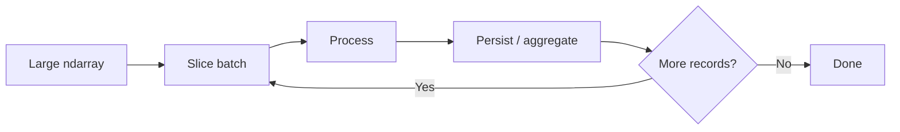

# 08- Split

## Overview

Splitting divides one NumPy array into multiple smaller arrays along an existing axis.

It is the inverse-side operation to concatenation in many data pipelines:

```text
large array
    ↓
split
    ↓
smaller arrays
```

Splitting is useful for:

- Batch processing.
- Partitioning work across workers.
- Creating bounded processing chunks.
- Separating training or validation ranges from numerical datasets.
- Dividing arrays by records, features, or time windows.
- Preparing data for parallel or staged processing.

The primary APIs are:

| API | Main purpose |
|---|---|
| `np.split()` | Split into equal-sized sections or at explicit indices |
| `np.array_split()` | Split even when sizes are not evenly divisible |
| `np.hsplit()` | Split along the second dimension for common 2-D usage |
| `np.vsplit()` | Split along the first dimension for common 2-D usage |
| `np.dsplit()` | Split along the third dimension for higher-dimensional arrays |

The main engineering considerations are shape semantics, axis selection, view behavior, and memory usage.


## What `split()` Does

Suppose a numerical dataset contains 12 records:

```python
import numpy as np

values = np.arange(12)

parts = np.split(values, 3)

for part in parts:
    print(part)
```

Output:

```text
[0 1 2 3]
[4 5 6 7]
[ 8  9 10 11]
```

The input shape is:

```text
(12,)
```

and each result has shape:

```text
(4,)
```

The operation divides one existing axis into multiple sections.

## Equal Splits

The simplest form is:

```python
np.split(array, sections, axis=0)
```

When `sections` is an integer, the axis length must be evenly divisible.

For:

```text
length = 12
sections = 3
```

each section contains:

```text
12 / 3 = 4
```

But:

```python
np.split(np.arange(10), 3)
```

raises an error because 10 cannot be divided equally into 3 sections.

This strict behavior is useful when equal-sized partitions are a requirement.

## Unequal Splits with `array_split()`

When the data cannot be divided evenly, use `np.array_split()`.

```python
import numpy as np

values = np.arange(10)

parts = np.array_split(values, 3)

for part in parts:
    print(part)
```

Output:

```text
[0 1 2 3]
[4 5 6]
[7 8 9]
```

The sizes differ by at most one element.

The distinction is:

```text
split()
→ equal sections required

array_split()
→ unequal sections allowed
```

For batch-processing code, this difference is often important because the final batch may be smaller than the configured batch size.

## Splitting by Explicit Indices

`np.split()` can also accept split positions.

```python
import numpy as np

values = np.arange(10)

parts = np.split(values, [3, 7])

for part in parts:
    print(part)
```

Output:

```text
[0 1 2]
[3 4 5 6]
[7 8 9]
```

The indices define boundaries:

```text
0 ───── 3 ───────── 7 ───── 10
| part1 |   part2   | part3 |
```

This is useful when business boundaries are already known.

## Explicit Boundaries in Data Pipelines

Suppose records are grouped by known offsets:

```text
header records → 0:10
body records   → 10:90
trailer        → 90:100
```

An explicit split can represent those boundaries:

```python
header, body, trailer = np.split(
    values,
    [10, 90],
)
```

This is often clearer than constructing several independent slices manually.

## Axis Semantics

Splitting always operates along an axis.

For a common 2-D representation:

```text
shape = (records, features)

axis 0 → records
axis 1 → features
```

Therefore:

```python
np.split(values, 4, axis=0)
```

means:

```text
split records into four groups
```

while:

```python
np.split(values, 4, axis=1)
```

means:

```text
split features into four groups
```

provided the relevant axis length is divisible by four.

## Splitting Rows

Consider:

```python
import numpy as np

records = np.arange(24).reshape(6, 4)

parts = np.split(
    records,
    3,
    axis=0,
)
```

Input:

```text
(6, 4)
```

Output:

```text
(2, 4)
(2, 4)
(2, 4)
```

The semantic interpretation is:

```text
6 records
→ 3 batches
→ 2 records per batch
```

This is one of the most common uses of `split()` in data-processing pipelines.

## Splitting Columns

The same array can be split along axis 1:

```python
parts = np.split(
    records,
    2,
    axis=1,
)
```

Input:

```text
(6, 4)
```

Output:

```text
(6, 2)
(6, 2)
```

Now the operation means:

```text
4 features
→ 2 feature groups
```

This can be useful when processing groups of metrics independently.

## Splitting Higher-Dimensional Arrays

Split works with arbitrary-dimensional arrays.

Suppose:

```python
import numpy as np

values = np.empty((8, 16, 4))
```

The dimensions might mean:

```text
axis 0 → records
axis 1 → time steps
axis 2 → metrics
```

Splitting along axis 0:

```python
parts = np.split(
    values,
    4,
    axis=0,
)
```

produces:

```text
4 arrays
each shape = (2, 16, 4)
```

Splitting along axis 1:

```python
parts = np.split(
    values,
    4,
    axis=1,
)
```

produces:

```text
4 arrays
each shape = (8, 4, 4)
```

The remaining axes are preserved.

## Shape Rules

The general rule is:

```text
split along axis K
→ axis K is divided
→ every other axis keeps the same size
```

For:

```text
input = (A, B, C)
```

splitting axis 1 into four equal pieces requires:

```text
B % 4 == 0
```

and produces:

```text
(A, B/4, C)
```

for each piece.

This shape reasoning is often more useful than memorizing function signatures.

## Split Returns Subarrays

For standard ndarray inputs, split operations commonly produce subarrays that share the original storage when the split can be represented through slicing.

For example:

```python
import numpy as np

values = np.arange(12)

parts = np.split(values, 3)

print(np.shares_memory(values, parts[0]))
# True
```

This means splitting can be memory efficient.

Mutating a returned section may therefore affect the source:

```python
parts[0][0] = 999

print(values[0])
# 999
```

Treat split results as views when shared-memory behavior matters, and verify with `np.shares_memory()` when necessary.

## Split vs Copy

If independent ownership is required:

```python
parts = [
    part.copy()
    for part in np.split(values, 3)
]
```

This introduces additional allocation and data movement.

The decision is:

```text
Need temporary batch views?
→ split()

Need independent ownership?
→ split() + copy()
```

For large datasets, copying every partition may substantially increase memory usage.

## Why Views Matter for Batch Processing

Suppose a large array is split into batches:

```text
10 million records
      ↓
10 views
      ↓
process each view
```

No additional full-size copy is required just to define the batches.

This can be much more memory-efficient than materializing ten independent arrays before processing.

However, a view keeps the underlying source buffer alive.

If a small partition needs to outlive the original large dataset, copying that partition may be appropriate.

## Memory Lifetime

Consider:

```python
import numpy as np

large = np.empty((10_000_000, 8), dtype=np.float32)

small = np.split(large, 10, axis=0)[0]
```

`small` represents only one tenth of the rows, but it still references the original allocation.

Therefore:

```text
small view
   ↓
large backing buffer remains alive
```

If the small partition is cached or queued for a long time, that can retain far more memory than its apparent size suggests.

When long-lived ownership is required:

```python
small = np.split(large, 10, axis=0)[0].copy()
```

This deliberately trades memory duplication for shorter source lifetime.

## `array_split()` for Batch Pipelines

A common production case is a final partial batch.

Suppose:

```text
records = 10,000
batch size = 3,000
```

The desired batches are:

```text
3,000
3,000
3,000
1,000
```

`np.split()` cannot express this with an integer section count because the divisions are unequal.

Use slicing or explicit boundaries, or use `np.array_split()` when approximately equal partitions are the requirement.

For a fixed batch size, explicit slicing is often clearer:

```python
import numpy as np


def iter_batches(
    values: np.ndarray,
    batch_size: int,
):
    if batch_size <= 0:
        raise ValueError("batch_size must be positive")

    for start in range(0, values.shape[0], batch_size):
        yield values[start:start + batch_size]
```

This approach gives exact control over batch size and avoids forcing a dataset into an arbitrary number of equally sized partitions.

## Split vs Explicit Slicing

For batch processing, these approaches are related:

```python
parts = np.split(values, 10, axis=0)
```

and:

```python
for start in range(0, values.shape[0], batch_size):
    batch = values[start:start + batch_size]
```

Use `split()` when:

- The number of equal partitions is the requirement.
- You want all sections immediately.
- The array is already in memory.

Use explicit slicing when:

- Batch size is the requirement.
- You want lazy iteration.
- The last batch may be smaller.
- You want to process and release each batch sequentially.

The second approach is usually more appropriate for large backend workloads because it avoids constructing a list of all partitions upfront.

## Lazy Batch Processing

For large arrays, a generator can keep the workflow bounded:

```python
import numpy as np


def iter_batches(
    values: np.ndarray,
    batch_size: int,
):
    for start in range(0, values.shape[0], batch_size):
        yield values[start:start + batch_size]


for batch in iter_batches(values, 10_000):
    process(batch)
```

Conceptually:



This keeps the data-processing flow bounded without materializing every partition simultaneously.

## `vsplit()`

`np.vsplit()` is a convenience API for splitting along axis 0 in common multidimensional cases.

```python
import numpy as np

values = np.arange(24).reshape(6, 4)

parts = np.vsplit(values, 3)

for part in parts:
    print(part.shape)
```

Output shapes:

```text
(2, 4)
(2, 4)
(2, 4)
```

Equivalent explicit form:

```python
parts = np.split(values, 3, axis=0)
```

The explicit `axis` form is often preferable in code where dimensions are important.

## `hsplit()`

`np.hsplit()` commonly splits a two-dimensional array along axis 1.

```python
import numpy as np

values = np.arange(24).reshape(6, 4)

parts = np.hsplit(values, 2)

for part in parts:
    print(part.shape)
```

Output:

```text
(6, 2)
(6, 2)
```

Equivalent explicit form:

```python
parts = np.split(values, 2, axis=1)
```

## `dsplit()`

`np.dsplit()` splits along the third axis for arrays with sufficient dimensions.

```python
import numpy as np

values = np.empty((4, 8, 6))

parts = np.dsplit(values, 3)

for part in parts:
    print(part.shape)
```

Each result has shape:

```text
(4, 8, 2)
```

Equivalent explicit form:

```python
parts = np.split(values, 3, axis=2)
```

Again, explicit axis notation is often clearer for production code.

## Choosing a Split API

| Requirement | Preferred API |
|---|---|
| Equal partitions | `np.split()` |
| Unequal approximately equal partitions | `np.array_split()` |
| Split rows in a conventional 2-D array | `np.vsplit()` or `axis=0` |
| Split columns in a conventional 2-D array | `np.hsplit()` or `axis=1` |
| Split third dimension | `np.dsplit()` or `axis=2` |
| Exact batch size | Slicing / batch generator |
| Lazy processing | Slicing / generator |

The choice should reflect the desired partition semantics, not simply the shortest syntax.

## Split and File Processing

Large numerical files can often be processed in bounded slices:

```text
file-backed array
    ↓
slice batch
    ↓
validate
    ↓
vectorized processing
    ↓
write result
    ↓
next batch
```

For memory-mapped arrays:

```python
import numpy as np

values = np.memmap(
    "metrics.dat",
    dtype=np.float32,
    mode="r",
    shape=(20_000_000, 8),
)

for start in range(0, values.shape[0], 100_000):
    batch = values[start:start + 100_000]
    process(batch)
```

This avoids creating a single enormous in-memory working set.

The efficiency comes primarily from bounded access to the backing file, not from the split API itself.

## Split and PostgreSQL

When extracting numerical data from PostgreSQL, do not automatically load the complete result and then split it.

Prefer:

```text
database query
    ↓
bounded fetch
    ↓
NumPy batch
    ↓
process
    ↓
next fetch
```

Use SQL filtering and aggregation first when they reduce the amount of data transferred.

NumPy splitting is most useful after the application already has an in-memory array and needs a processing boundary.

## Split and Kafka

Kafka consumers naturally provide bounded batches of messages.

The consumer boundary often makes an explicit `np.split()` unnecessary.

A stronger pattern is:

```text
Kafka poll
    ↓
convert batch
    ↓
process
    ↓
commit
```

Use NumPy splitting when a single consumer batch must itself be partitioned into smaller numerical units:

```text
Kafka batch
    ↓
ndarray
    ↓
split into worker-sized chunks
```

Keep the partition count bounded to prevent excessive memory and scheduling overhead.

## Split and Celery

For Celery tasks, a useful architecture is:

```text
Large ndarray
    ↓
bounded partitions
    ↓
task payload / shared storage reference
    ↓
worker processing
```

Avoid serializing huge NumPy partitions directly into broker messages.

Prefer object storage, files, databases, or shared durable references for large payloads.

Splitting is a data-partitioning mechanism; it does not solve task-distribution transport costs.

## Split and Pandas

Pandas often has richer support for labeled partitioning and dataframe-specific workflows.

If the data is primarily tabular:

```text
DataFrame
→ filtering / grouping / joins
```

may be more appropriate than converting to NumPy simply to split it.

NumPy splitting becomes useful when:

```text
DataFrame
    ↓
numeric ndarray
    ↓
numerical batch processing
```

The conversion boundary should be intentional.

## Split and Concatenate

A common pipeline pattern is:

```text
large array
   ↓
split
   ↓
process partitions
   ↓
concatenate results
```

For example:

```python
import numpy as np


def process_partition(batch: np.ndarray) -> np.ndarray:
    return batch * 1.05


parts = np.array_split(values, 4, axis=0)

processed = [
    process_partition(part)
    for part in parts
]

result = np.concatenate(processed, axis=0)
```

This can be useful when the processing step is easier to parallelize or isolate by partition.

However, if the final concatenation creates a large array solely for convenience, consider whether downstream consumers can use partitions directly.

## Split and Parallel Processing

Splitting can establish work units:

```text
Dataset
  │
  ├── Partition 1 → Worker A
  ├── Partition 2 → Worker B
  ├── Partition 3 → Worker C
  └── Partition 4 → Worker D
```

The important operational concerns are:

- Partition size.
- Serialization cost.
- Worker memory.
- Scheduling overhead.
- Ordering requirements.
- Retry behavior.
- Reassembly cost.

For CPU-heavy NumPy operations, parallelism strategy should also account for the numerical libraries' own threading behavior. More workers do not automatically mean more throughput.

## Performance Considerations

For ordinary slicing-based splits, defining partitions can be inexpensive because the results can share the source buffer.

That makes:

```python
parts = np.split(values, 4)
```

very different from copying each part:

```python
parts = [
    part.copy()
    for part in np.split(values, 4)
]
```

The first mainly creates views and metadata structures.

The second allocates and copies the actual data.

For large datasets, this distinction can be substantial.

## Allocation and Peak Memory

If split results remain views:

```text
source
  ↓
multiple views
```

additional raw data storage can remain low.

If each partition is copied:

```text
source
  +
partition 1 copy
partition 2 copy
partition 3 copy
partition 4 copy
```

peak memory can increase dramatically.

Do not copy partitions unless ownership or lifetime requirements justify it.

## Split and Contiguity

A split created through ordinary slicing can have predictable stride behavior, but contiguity depends on the source layout and the axis being split.

Inspect:

```python
for part in parts:
    print(
        part.shape,
        part.flags.c_contiguous,
        part.flags.f_contiguous,
    )
```

Do not assume every partition has identical contiguous characteristics.

If downstream code requires a specific layout, convert explicitly and benchmark the cost.

## Common Mistakes

### Using `split()` for Uneven Partitions

```python
np.split(np.arange(10), 3)
```

fails because the sections are not equal.

Use `array_split()` or explicit slicing when uneven batches are expected.

### Splitting into Too Many Partitions

Partitioning a dataset into thousands of tiny arrays can create Python-object overhead and excessive scheduling costs.

Choose partition sizes based on the numerical workload and worker capacity.

### Copying Every Partition

Split results can often share memory with the source.

Copy only when independent ownership is required.

### Holding All Partitions in Memory

Even views keep the source alive, and copies consume additional storage.

For large workloads, process partitions sequentially instead of collecting them all.

### Using `split()` Instead of Lazy Batching

If the goal is fixed-size streaming batches, a generator with slicing is often clearer and more memory-efficient at the application level.

### Ignoring Axis Meaning

A split along axis 0 and axis 1 can produce structurally valid results with completely different business semantics.

Document the array contract before choosing the axis.

### Treating Split as a Distributed Processing Solution

Splitting creates local partitions. It does not solve serialization, scheduling, durability, retry, or inter-worker communication.

Distributed processing requires an appropriate execution architecture.

## Testing Split Behavior

Test equal partitioning:

```python
import numpy as np


def test_split_equal_batches():
    values = np.arange(12)

    parts = np.split(values, 3)

    assert [part.shape for part in parts] == [
        (4,),
        (4,),
        (4,),
    ]

    np.testing.assert_array_equal(
        np.concatenate(parts),
        values,
    )
```

Test uneven partitioning:

```python
def test_array_split_handles_remainder():
    values = np.arange(10)

    parts = np.array_split(values, 3)

    assert [part.size for part in parts] == [
        4,
        3,
        3,
    ]
```

Test axis semantics:

```python
def test_split_rows():
    values = np.arange(24).reshape(6, 4)

    parts = np.split(values, 3, axis=0)

    assert [part.shape for part in parts] == [
        (2, 4),
        (2, 4),
        (2, 4),
    ]
```

Test shared-memory behavior when relevant:

```python
def test_split_results_share_memory():
    values = np.arange(12)

    parts = np.split(values, 3)

    assert np.shares_memory(values, parts[0])
```

Production tests should also cover:

- Empty arrays where supported by the chosen operation.
- Uneven final batches.
- Multiple dimensions.
- Different axis selections.
- Maximum batch sizes.
- Non-contiguous sources.
- Downstream mutation expectations.

## Debugging Split Problems

Inspect the source before splitting:

```python
print("shape:", values.shape)
print("ndim:", values.ndim)
print("dtype:", values.dtype)
print("nbytes:", values.nbytes)
```

Then verify:

```text
Which axis represents the partition dimension?
        ↓
How many partitions are required?
        ↓
Must they be equal?
        ↓
What is the expected partition shape?
        ↓
Should results be views or copies?
        ↓
How will partitions be consumed?
```

For example:

```text
Input:
(100_000, 8)

split(axis=0, sections=10)

Expected:
10 × (10_000, 8)
```

This shape-first reasoning prevents many batch-processing errors.

## Interview Questions

### What is the difference between `np.split()` and `np.array_split()`?

`np.split()` requires equal-sized sections when an integer section count is provided. `np.array_split()` allows unequal sections when the axis length is not evenly divisible.

### Does splitting copy the data?

For typical ndarray inputs, split results can be views that share the original storage. Verify with `np.shares_memory()` when memory behavior is important.

### Why can splitting be memory efficient?

When the results are views, defining partitions does not require copying the underlying numerical data.

### When should you use explicit slicing instead of `split()`?

Use slicing when you need fixed-size batches, lazy iteration, partial final batches, or sequential processing without materializing a list of all partitions.

### What is the difference between `vsplit()` and `split(..., axis=0)`?

For common multidimensional arrays, `vsplit()` is a convenience form for splitting along axis 0.

### Why might copying split results be useful?

A copy gives the partition independent ownership and can prevent a small long-lived partition from retaining a large source allocation.

### How would you split a large dataset for a Celery workload?

Create bounded partitions, keep serialization costs under control, use durable shared storage for large payloads, and size partitions according to worker memory and processing time.

### Why should database-side filtering happen before NumPy splitting when possible?

Reducing the data before it reaches Python lowers network transfer, memory usage, and unnecessary numerical processing.

## Key Takeaways

- Splitting divides an `ndarray` along an existing axis, and the axis determines the semantic dimension being partitioned.
- `np.split()` requires equal sections, while `np.array_split()` supports uneven partitions; fixed-size batch processing is often clearer with explicit slicing.
- Split results can share the source buffer, making partitioning memory-efficient, but long-lived views can keep large backing arrays alive.
- For production workloads, choose partition sizes deliberately based on memory, CPU cost, serialization overhead, and downstream processing requirements.
- Splitting is a local data-partitioning operation, not a distributed-processing solution; reliable worker systems still require bounded payloads, appropriate transport, retries, and durable storage where necessary.