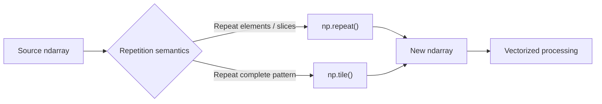
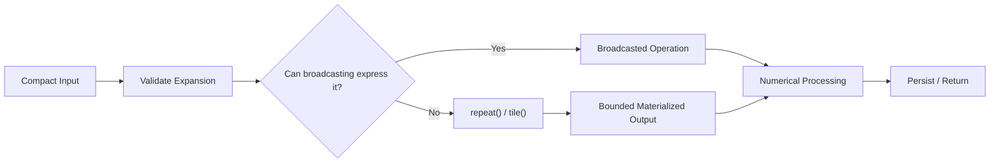

# 09- Repeat and Tile

## Overview

`np.repeat()` and `np.tile()` both create larger arrays by repeating existing data, but they repeat data at different structural levels.

The core distinction is:

```text
np.repeat()
→ repeats individual elements or slices along an axis

np.tile()
→ repeats the entire input pattern
```

This difference matters when constructing batch data, expanding categorical or configuration values across records, generating repeated processing patterns, or preparing arrays for vectorized operations.

Both operations allocate new array storage in the resulting array. They should therefore be treated as **materialization operations**, not as zero-copy views.



A useful decision rule is:

```text
Need each value repeated?
→ repeat()

Need the entire array pattern repeated?
→ tile()
```

## Why Repeat and Tile Exist

Numerical pipelines sometimes need to expand a compact representation into an explicitly repeated structure.

Typical examples include:

- Expanding a per-record parameter.
- Repeating labels or identifiers.
- Constructing repeated batch patterns.
- Creating deterministic test data.
- Expanding control values to match numerical data.
- Building structured inputs for vectorized operations.

However, repetition should not be confused with broadcasting.

```text
broadcasting
→ often avoids materializing repeated values

repeat / tile
→ explicitly materialize repeated values
```

For large arrays, this difference can determine whether an operation remains memory-efficient.

## `np.repeat()`

`np.repeat()` repeats elements of an array.

```python
import numpy as np

values = np.array([10, 20, 30])

result = np.repeat(values, 2)

print(result)
# [10 10 20 20 30 30]
```

Each original element is repeated twice.

Conceptually:

```text
[10, 20, 30]
     ↓ repeat(..., 2)
[10, 10, 20, 20, 30, 30]
```

The repetition occurs at the element level.

## Repeating Different Numbers of Times

The repeat count can be an array.

```python
import numpy as np

values = np.array([10, 20, 30])

result = np.repeat(
    values,
    [1, 2, 3],
)

print(result)
# [10 20 20 30 30 30]
```

The semantics are:

```text
10 → 1 time
20 → 2 times
30 → 3 times
```

This is useful when each input element has a different multiplicity.

## Repeating Along an Axis

For multidimensional arrays, `axis` controls which dimension is repeated.

```python
import numpy as np

values = np.array(
    [
        [10, 20],
        [30, 40],
    ]
)

result = np.repeat(
    values,
    2,
    axis=0,
)

print(result)
```

```text
[[10 20]
 [10 20]
 [30 40]
 [30 40]]
```

Here:

```text
axis=0
→ repeat rows
```

The shape changes from:

```text
(2, 2)
```

to:

```text
(4, 2)
```

## Repeating Columns

Repeat along axis 1:

```python
result = np.repeat(
    values,
    2,
    axis=1,
)
```

Result:

```text
[[10 10 20 20]
 [30 30 40 40]]
```

The shape becomes:

```text
(2, 4)
```

The semantics are:

```text
axis=0 → repeat rows
axis=1 → repeat columns
```

for a conventional two-dimensional array.

## `repeat()` with Per-Element Counts Along an Axis

The repetition count can also vary by element of the selected axis.

For example:

```python
import numpy as np

values = np.array(
    [
        [10, 20],
        [30, 40],
    ]
)

result = np.repeat(
    values,
    [1, 2],
    axis=0,
)

print(result)
```

```text
[[10 20]
 [30 40]
 [30 40]]
```

The first row appears once and the second row appears twice.

This is useful when different records or groups need different expansion factors.

## `np.tile()`

`np.tile()` repeats the entire input pattern.

```python
import numpy as np

values = np.array([10, 20, 30])

result = np.tile(values, 2)

print(result)
# [10 20 30 10 20 30]
```

Compare:

```python
np.repeat(values, 2)
# [10 10 20 20 30 30]

np.tile(values, 2)
# [10 20 30 10 20 30]
```

The distinction is fundamental:

```text
repeat
→ duplicate individual values

tile
→ duplicate the complete pattern
```

## `tile()` with Multidimensional Arrays

For a matrix:

```python
import numpy as np

values = np.array(
    [
        [1, 2],
        [3, 4],
    ]
)

result = np.tile(
    values,
    (2, 3),
)

print(result)
```

```text
[[1 2 1 2 1 2]
 [3 4 3 4 3 4]
 [1 2 1 2 1 2]
 [3 4 3 4 3 4]]
```

The tuple:

```text
(2, 3)
```

means:

```text
repeat rows 2 times
repeat columns 3 times
```

The resulting shape is:

```text
(4, 6)
```

## `repeat()` vs `tile()`

| Requirement | `np.repeat()` | `np.tile()` |
|---|---:|---:|
| Repeats individual elements | Yes | No |
| Repeats entire pattern | No | Yes |
| Supports per-element counts | Yes | No |
| Supports axis-specific repetition | Yes | Yes |
| Common use | Expand values or rows | Repeat a complete pattern |
| Result is a new array | Yes | Yes |

A practical rule:

```text
[1, 2, 3]

repeat(..., 2)
→ [1, 1, 2, 2, 3, 3]

tile(..., 2)
→ [1, 2, 3, 1, 2, 3]
```

## Repeat vs Broadcasting

One of the most important production distinctions is that explicit repetition is often unnecessary.

Suppose:

```python
import numpy as np

values = np.array(
    [
        [10.0, 20.0],
        [30.0, 40.0],
        [50.0, 60.0],
    ]
)

offset = np.array([1.0, 2.0])
```

You could explicitly repeat the offset:

```python
expanded = np.tile(offset, (3, 1))
result = values + expanded
```

But broadcasting is usually simpler and more memory-efficient:

```python
result = values + offset
```

The shapes are:

```text
values → (3, 2)
offset → (2,)
```

NumPy broadcasts `offset` without materializing three copies.

This gives an important engineering principle:

```text
Need repeated values only for an arithmetic operation?
→ prefer broadcasting when possible

Need an actual expanded array as data?
→ repeat() / tile()
```

## Why Broadcasting Is Often Better

Suppose:

```text
rows = 10,000,000
features = 8
```

Repeating an 8-element vector across all rows creates:

```text
10,000,000 × 8
```

additional values.

Broadcasting can apply the same vector without explicitly allocating that repeated matrix.

Conceptually:

```text
Explicit repeat:
small array
    ↓
large materialized array
    ↓
operation

Broadcast:
small array
    ↓
shape alignment
    ↓
operation
```

For large numerical workloads, avoiding unnecessary materialization can significantly reduce memory pressure.

## When Explicit Repetition Is Appropriate

Broadcasting is not a universal replacement.

An explicit repeated array may be required when:

- The repeated values must be stored independently.
- The result is passed to an API requiring matching shapes.
- The expanded structure itself has semantic meaning.
- Each repeated element will subsequently be mutated independently.
- The data must be serialized in expanded form.
- A downstream operation cannot consume broadcastable inputs directly.

In those cases, `repeat()` or `tile()` may be appropriate.

## Backend Example: Expanding Per-Group Values

Suppose records are grouped by service:

```text
Service A → 3 records
Service B → 2 records
Service C → 4 records
```

Per-service weights are:

```python
import numpy as np

weights = np.array(
    [1.0, 1.2, 0.8],
)
```

A corresponding group-index representation might be:

```python
counts = [3, 2, 4]

expanded_weights = np.repeat(
    weights,
    counts,
)
```

Result:

```text
[1.0, 1.0, 1.0,
 1.2, 1.2,
 0.8, 0.8, 0.8]
```

This is useful when every individual record needs an explicit group weight.

The key point is that `repeat()` handles **variable repetition counts**, which broadcasting cannot directly express as a materialized one-dimensional mapping.

## Backend Example: Repeating a Fixed Pattern

Suppose a processing pipeline needs the same four-slot schedule repeated for many windows:

```python
import numpy as np

schedule = np.array(
    [1, 2, 3, 4],
    dtype=np.int8,
)

windows = np.tile(schedule, 10)

print(windows.shape)
# (40,)
```

This explicitly creates the repeated pattern.

For a production workload, verify whether the repeated schedule actually needs to exist as data. If it only drives a calculation, an alternative representation may be cheaper.

## Repeat for Record Expansion

Consider one record per customer:

```python
customers = np.array(
    [101, 102, 103],
)
```

Suppose each customer must be represented for four reporting periods:

```python
expanded = np.repeat(
    customers,
    4,
)

print(expanded)
```

```text
[101 101 101 101 102 102 102 102 103 103 103 103]
```

This produces:

```text
customer
customer
customer
customer
```

for each original record.

A corresponding period array could be generated with `tile()`:

```python
periods = np.tile(
    np.arange(4),
    3,
)

print(periods)
# [0 1 2 3 0 1 2 3 0 1 2 3]
```

Together:

```text
customer → [101 101 101 101 102 102 102 102 103 103 103 103]
period   → [  0   1   2   3   0   1   2   3   0   1   2   3]
```

This is a useful pattern for constructing explicit Cartesian-like record representations.

## Repeat and Tile Together

`repeat()` and `tile()` can solve complementary parts of the same data-expansion problem.

```python
import numpy as np

customers = np.array([101, 102, 103])
periods = np.array([0, 1, 2, 3])

customer_ids = np.repeat(
    customers,
    periods.size,
)

period_ids = np.tile(
    periods,
    customers.size,
)
```

The result is:

```text
customer_ids
[101 101 101 101 102 102 102 102 103 103 103 103]

period_ids
[  0   1   2   3   0   1   2   3   0   1   2   3]
```

This can be useful for numerical feature construction, but materializing both arrays may be expensive for very large Cartesian expansions.

For large combinations, consider whether SQL, Pandas, streaming generation, or a more compact representation is more appropriate.

## Repeat and Memory Usage

Both operations create new arrays.

For example:

```python
import numpy as np

values = np.array(
    [1, 2, 3],
    dtype=np.float64,
)

result = np.repeat(values, 1_000_000)

print(result.nbytes)
```

The output can become very large even when the source is tiny.

A useful estimation is:

```text
output bytes
≈ output element count × dtype.itemsize
```

For production code, estimate the output size before performing large repetitions.

## Resource-Exhaustion Risk

Repetition counts can become a memory-exhaustion vector when they originate from external input.

For example:

```python
repeat_count = request.repeat_count
result = np.repeat(values, repeat_count)
```

An attacker or accidental caller could request a very large expansion.

Validate:

```text
input element count
+
repeat counts
+
result element count
+
dtype size
```

before allocation.

```python
MAX_OUTPUT_ELEMENTS = 10_000_000


def validate_repeat_count(
    input_size: int,
    repeat_count: int,
) -> None:
    if repeat_count < 0:
        raise ValueError("repeat_count must be non-negative")

    if input_size * repeat_count > MAX_OUTPUT_ELEMENTS:
        raise ValueError("requested expansion is too large")
```

The appropriate limit should come from the service's memory budget.

## Variable Repeat Counts and Validation

If counts are supplied per element:

```python
values = np.array([10, 20, 30])
counts = np.array([1, 2, 3])
```

validate the length:

```python
if values.size != counts.size:
    raise ValueError(
        "values and counts must have the same length"
    )
```

Also validate that counts are non-negative.

The output size is:

```text
sum(counts)
```

which should be checked before allocation.

## Repeat and Dtype

Repetition preserves the input dtype:

```python
import numpy as np

values = np.array(
    [1, 2, 3],
    dtype=np.int32,
)

result = np.repeat(values, 2)

print(result.dtype)
# int32
```

The number of elements changes, but the bytes per element remain the same.

This makes output-size estimation straightforward:

```text
output bytes
= output size × input dtype.itemsize
```

## Tile and Shape

`np.tile()` accepts either a scalar or a tuple describing repetitions.

For a one-dimensional array:

```python
import numpy as np

values = np.array([1, 2, 3])

np.tile(values, 2)
```

creates:

```text
[1 2 3 1 2 3]
```

For a matrix:

```python
np.tile(values_2d, (2, 3))
```

repeats the input structure across the specified dimensions.

The repetition tuple should therefore be treated as a shape transformation:

```text
input shape
+
tile repetitions
→
output shape
```

## Tile and Dimension Alignment

For:

```python
values.shape == (2, 3)
```

then:

```python
np.tile(values, (4, 2))
```

produces a shape corresponding to:

```text
(2 × 4, 3 × 2)
→ (8, 6)
```

The entire original pattern is replicated.

When using `tile()` on multidimensional arrays, reason about the resulting shape before allocating the data.

## Repeat and Axis Semantics

`repeat()` has more fine-grained control over individual elements or slices.

For:

```python
values.shape == (2, 3)
```

then:

```python
np.repeat(values, 2, axis=0)
```

repeats rows:

```text
(2, 3)
→ (4, 3)
```

while:

```python
np.repeat(values, 2, axis=1)
```

repeats columns:

```text
(2, 3)
→ (2, 6)
```

The correct axis depends on what the repeated unit represents.

## Repeat vs Stack

These operations can also look similar but mean different things.

Given:

```python
a = np.array([1, 2, 3])
b = np.array([1, 2, 3])
```

`stack()` creates a new axis:

```python
np.stack([a, b])
```

Result:

```text
[[1 2 3]
 [1 2 3]]
```

`repeat()` duplicates values within an existing structure:

```python
np.repeat(a, 2)
```

Result:

```text
[1 1 2 2 3 3]
```

The semantic difference is:

```text
stack
→ multiple arrays become separate slices along a new axis

repeat
→ elements are duplicated within an axis
```

## Repeat vs Concatenate

These can also produce larger arrays but have different intent.

```python
a = np.array([1, 2])
b = np.array([3, 4])

np.concatenate([a, b])
# [1 2 3 4]

np.tile(a, 2)
# [1 2 1 2]

np.repeat(a, 2)
# [1 1 2 2]
```

Choose the operation based on the transformation semantics rather than the desired output size alone.

## Repeat and Tile with Broadcasting

Before using either function, ask whether broadcasting already expresses the intended computation.

Example:

```python
import numpy as np

values = np.arange(12).reshape(4, 3)
weights = np.array([1.0, 2.0, 3.0])

result = values * weights
```

There is no need to:

```python
expanded_weights = np.tile(weights, (4, 1))
```

The broadcasted expression avoids materializing a `(4, 3)` weights array.

This is one of the most important production optimizations for large numerical workloads.

## When Broadcasting Cannot Replace Repeat

Suppose every customer has a different number of repeated records:

```text
customer 101 → 2 records
customer 102 → 5 records
customer 103 → 1 record
```

A direct broadcast cannot express this varying-length expansion.

`repeat()` can:

```python
customers = np.array([101, 102, 103])
counts = np.array([2, 5, 1])

expanded = np.repeat(
    customers,
    counts,
)
```

Result:

```text
[101 101 102 102 102 102 102 103]
```

This is a legitimate use of explicit repetition because the output itself represents a variable-length mapping.

## Batch Processing Considerations

Repeated expansion can turn compact input into a dramatically larger working set.

Consider:

```text
10,000 source rows
× 1,000 repetition factor
=
10,000,000 output rows
```

If the expanded structure is immediately consumed by a vectorized operation, ask whether the calculation can instead operate on the compact representation.

A scalable architecture is often:

```text
Compact representation
      ↓
Broadcast / indexed computation
      ↓
Compact result
```

rather than:

```text
Compact representation
      ↓
Repeat / tile
      ↓
Huge materialized array
      ↓
Computation
```

## File and Serialization Considerations

Repeated data can become expensive to serialize.

For example:

```python
expanded = np.repeat(values, counts)
payload = expanded.tolist()
```

creates:

```text
NumPy buffer
   ↓
Python objects
   ↓
serialized payload
```

This can multiply memory usage.

For large data, prefer storing the compact source representation and repetition metadata when the consumer can reconstruct the expanded form.

Use explicit expansion at the boundary only when the downstream contract actually requires the materialized representation.

## Pandas Relationship

Pandas offers higher-level operations for repeating rows and constructing repeated tabular structures.

If the data is primarily:

```text
labeled rows
columns
categorical metadata
```

Pandas may be easier to maintain.

NumPy repetition is most appropriate when the operation is fundamentally numerical and array-oriented.

A practical flow might be:

```text
Pandas
→ organize records
→ convert numeric block to NumPy
→ numerical repeat/tile only where required
→ vectorized processing
```

Avoid converting between Pandas and NumPy solely to perform a simple row duplication that the higher-level abstraction already handles well.

## Performance Considerations

Both `repeat()` and `tile()` generally require output allocation and data movement proportional to the output size.

A useful model is:

```text
cost ≈ O(output_elements)
```

The source size alone is not sufficient to estimate cost.

For example:

```text
source = 1,000 elements
repeat factor = 10,000

output = 10,000,000 elements
```

Even though the source is tiny, the operation is large.

Benchmarking should therefore use realistic repetition factors and include memory measurement.

## Benchmarking

A simple benchmark:

```python
from time import perf_counter
import numpy as np

values = np.arange(1_000_000, dtype=np.float32)

start = perf_counter()
result = np.repeat(values, 2)
elapsed = perf_counter() - start

print(f"repeat time: {elapsed:.6f}s")
print(f"output bytes: {result.nbytes}")
```

For `tile()`:

```python
start = perf_counter()
result = np.tile(values, 2)
elapsed = perf_counter() - start

print(f"tile time: {elapsed:.6f}s")
print(f"output bytes: {result.nbytes}")
```

For a useful comparison, also benchmark a broadcasted formulation when it can replace materialization.

Measure:

- Execution time.
- Output size.
- Peak memory.
- Downstream processing time.
- End-to-end latency.

## Production Design Pattern

A robust numerical pipeline treats explicit repetition as a deliberate transformation:



This avoids materializing large repeated arrays when the operation itself does not require them.

## Common Mistakes

### Confusing `repeat()` with `tile()`

`repeat()` duplicates elements.

`tile()` duplicates the entire input pattern.

Use small examples to verify the intended semantics before applying either to production data.

### Using `tile()` When Broadcasting Is Enough

This can allocate a large temporary array for no reason.

Prefer broadcasting when the repeated values are only needed for arithmetic or comparisons.

### Repeating Untrusted Counts

Large repeat factors can create resource-exhaustion problems.

Validate the resulting element count before allocation.

### Ignoring Output Size

The source may be small while the expanded result is enormous.

Estimate:

```text
output elements × dtype.itemsize
```

before materialization.

### Treating Repeat as a View

`repeat()` materializes new data.

Do not assume shared-memory behavior.

### Creating Huge Cartesian Expansions in NumPy

Combining `repeat()` and `tile()` can create a full Cartesian-style representation that grows multiplicatively.

For large datasets, consider SQL joins, Pandas operations, generators, or streaming approaches.

### Converting Expanded Arrays to Python Lists

`tolist()` creates Python objects and may significantly increase memory usage.

Keep data in NumPy form as long as possible.

### Repeating Data Simply to Match Shapes

Broadcasting usually solves shape alignment more efficiently.

First ask whether the computation requires actual repeated storage.

## Testing Repeat and Tile

Test the semantic difference explicitly.

```python
import numpy as np


def test_repeat_repeats_elements():
    values = np.array([1, 2, 3])

    result = np.repeat(values, 2)

    np.testing.assert_array_equal(
        result,
        np.array([1, 1, 2, 2, 3, 3]),
    )


def test_tile_repeats_pattern():
    values = np.array([1, 2, 3])

    result = np.tile(values, 2)

    np.testing.assert_array_equal(
        result,
        np.array([1, 2, 3, 1, 2, 3]),
    )
```

Test axis behavior:

```python
def test_repeat_rows():
    values = np.array(
        [
            [1, 2],
            [3, 4],
        ]
    )

    result = np.repeat(
        values,
        2,
        axis=0,
    )

    np.testing.assert_array_equal(
        result,
        np.array(
            [
                [1, 2],
                [1, 2],
                [3, 4],
                [3, 4],
            ]
        ),
    )
```

For production code, test:

- Zero repeat counts.
- Variable repeat counts.
- Empty inputs.
- Large expansion limits.
- Multiple axes.
- Dtype preservation.
- Maximum supported output sizes.
- Behavior near configured memory limits.

## Debugging Repeat and Tile

Inspect the source and expected output dimensions:

```python
print("input shape:", values.shape)
print("input dtype:", values.dtype)
print("input bytes:", values.nbytes)
```

Then calculate the expected result size before allocation.

For `repeat()`:

```text
output elements
≈ sum(repeat_counts)
```

For a uniform repeat:

```text
output elements
≈ input.size × repeat_count
```

For `tile()`:

```text
output shape
≈ input shape × repetition factors
```

A useful debugging sequence is:

```text
Define semantic requirement
      ↓
Choose repeat vs tile
      ↓
Check axis
      ↓
Calculate output shape
      ↓
Estimate memory
      ↓
Check whether broadcasting avoids materialization
      ↓
Run the operation
```

## Interview Questions

### What is the difference between `np.repeat()` and `np.tile()`?

`repeat()` repeats individual elements or slices along an axis. `tile()` repeats the entire input pattern.

### Does `repeat()` return a view?

No. It produces a new array containing the repeated values.

### Why is broadcasting often preferable to `tile()`?

Broadcasting can apply values across compatible shapes without materializing copies of those values, reducing memory usage and often allocation overhead.

### When would `repeat()` be preferable to broadcasting?

When the expanded representation itself is required, especially when each input element has a different number of repetitions.

### How can `tile()` be dangerous with large inputs?

The resulting array grows according to the repetition factors and can consume substantial memory even when the source array is small.

### How would you calculate the memory impact of repetition?

Estimate the output element count and multiply by the result dtype's `itemsize`.

### Can `repeat()` repeat different elements different numbers of times?

Yes. An array of repeat counts can specify a different count for each element or slice.

### When might `repeat()` and `tile()` be used together?

They can construct explicit aligned arrays for Cartesian-style expansions, such as repeating each customer ID for every reporting period while cycling the period values.

### Would you use explicit repetition in a large streaming pipeline?

Only when the materialized expanded representation is actually required. Otherwise, prefer compact representations, broadcasting, or batch-local computation.

## Key Takeaways

- `np.repeat()` repeats individual elements or slices, while `np.tile()` repeats the complete input pattern; the distinction is semantic, not cosmetic.
- Both operations materialize new arrays, so output size, dtype, and repetition factors must be considered before allocation.
- Broadcasting is often a better alternative when repeated values are only needed to align shapes for numerical computation.
- Explicit repetition is appropriate when the expanded representation itself is meaningful or required, especially for variable-length mappings handled by `repeat()`.
- In production systems, validate expansion limits, estimate memory, avoid unnecessary Cartesian growth, and keep compact representations whenever downstream processing can operate without materialization.