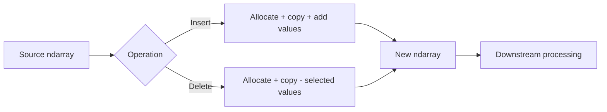

# 10- Insert and Delete

## Overview

`np.insert()` and `np.delete()` modify the logical contents and shape of an array by adding or removing elements along an axis.

They are useful for controlled array transformations, but they should be treated differently from in-place mutation methods such as `ndarray.resize()`:

```text
np.insert()
→ returns a new array

np.delete()
→ returns a new array
```

Neither operation should be assumed to modify the original array.

For production numerical workloads, this matters because insertion and deletion require data movement and generally allocate a new destination array. Repeated use on large arrays can therefore become expensive in both CPU time and memory.



A practical engineering rule is:

```text
Insert/Delete once on a moderate array
→ acceptable when the transformation is required

Repeated Insert/Delete on a growing dataset
→ usually the wrong data structure
```

## What `np.insert()` Does

`np.insert()` inserts values before a specified index.

```python
import numpy as np

values = np.array([10, 20, 30])

result = np.insert(
    values,
    1,
    99,
)

print(result)
# [10 99 20 30]
```

The original array is unchanged:

```python
print(values)
# [10 20 30]
```

The insertion occurs before index `1`.

Conceptually:

```text
Original:
[10, 20, 30]
     ↑
    index 1

Insert 99:

[10, 99, 20, 30]
```

## Why `insert()` Returns a New Array

NumPy arrays use contiguous or strided memory layouts with fixed shape metadata.

Inserting an element usually means the existing values after the insertion point must be shifted into a new arrangement.

Conceptually:

```text
Original buffer
[10 20 30]
     ↓
allocate destination
[10 ? 20 30]
     ↓
write inserted value
[10 99 20 30]
```

This is fundamentally different from appending to a dynamically growing Python list.

For large arrays, the data movement can be substantial.

## Inserting at Different Positions

```python
import numpy as np

values = np.array([10, 20, 30, 40])

start = np.insert(values, 0, 5)
middle = np.insert(values, 2, 25)
end = np.insert(values, values.size, 50)

print(start)
# [ 5 10 20 30 40]

print(middle)
# [10 20 25 30 40]

print(end)
# [10 20 30 40 50]
```

Insertion at the end is still a new-array operation. It should not be treated like amortized list append.

## Inserting Multiple Values

Multiple values can be inserted at a position:

```python
import numpy as np

values = np.array([10, 20, 30])

result = np.insert(
    values,
    1,
    [11, 12, 13],
)

print(result)
# [10 11 12 13 20 30]
```

The shape changes according to the number of inserted elements.

The resulting size is:

```text
original size + inserted size
```

## Insert Semantics with Multiple Indices

When passing multiple insertion positions, the behavior can be unintuitive.

For example:

```python
import numpy as np

values = np.array([10, 20, 30, 40])

result = np.insert(
    values,
    [1, 3],
    [15, 35],
)

print(result)
```

When multiple positions and values are used together, NumPy applies specific positional semantics rather than treating the indexes as independent mutable positions in a list.

For production code, prefer one well-defined insertion transformation at a time when readability matters, and test the exact expected output rather than relying on intuition about repeated insertions.

## Inserting Along an Axis

For multidimensional arrays, `axis` controls what is being inserted.

```python
import numpy as np

values = np.array(
    [
        [10, 20],
        [30, 40],
    ]
)

result = np.insert(
    values,
    1,
    [25, 35],
    axis=0,
)

print(result)
```

```text
[[10 20]
 [25 35]
 [30 40]]
```

The shape changes from:

```text
(2, 2)
```

to:

```text
(3, 2)
```

The inserted row is placed before row index `1`.

## Inserting Columns

Use `axis=1` to insert columns:

```python
import numpy as np

values = np.array(
    [
        [10, 20],
        [30, 40],
    ]
)

result = np.insert(
    values,
    1,
    [15, 35],
    axis=1,
)

print(result)
```

```text
[[10 15 20]
 [30 35 40]]
```

The shape changes:

```text
(2, 2)
→
(2, 3)
```

The inserted data must be compatible with the array's dimensional structure.

## Inserting Without `axis`

When `axis` is omitted:

```python
np.insert(values, index, value)
```

NumPy works with a flattened representation.

For example:

```python
import numpy as np

values = np.array(
    [
        [10, 20],
        [30, 40],
    ]
)

result = np.insert(
    values,
    2,
    99,
)

print(result)
# [10 20 99 30 40]
```

The result becomes one-dimensional.

This can be useful when flattening is explicitly intended, but omitting `axis` in multidimensional application code can also hide a shape mistake.

Prefer specifying `axis` when preserving the dimensional model matters.

## What `np.delete()` Does

`np.delete()` removes elements and returns a new array.

```python
import numpy as np

values = np.array([10, 20, 30, 40])

result = np.delete(
    values,
    1,
)

print(result)
# [10 30 40]

print(values)
# [10 20 30 40]
```

The original remains unchanged.

The removed element is not replaced with a default value; the result is simply smaller.

## Deleting Multiple Elements

```python
import numpy as np

values = np.array([10, 20, 30, 40, 50])

result = np.delete(
    values,
    [1, 3],
)

print(result)
# [10 30 50]
```

The deleted indexes refer to positions in the original input.

For production code, test multi-index deletion explicitly because the operation is not equivalent to repeatedly calling `delete()` on an already modified result.

## Deleting Along an Axis

For two-dimensional arrays:

```python
import numpy as np

values = np.array(
    [
        [10, 20, 30],
        [40, 50, 60],
        [70, 80, 90],
    ]
)

rows_removed = np.delete(
    values,
    1,
    axis=0,
)

print(rows_removed)
```

```text
[[10 20 30]
 [70 80 90]]
```

The shape changes:

```text
(3, 3)
→
(2, 3)
```

## Deleting Columns

```python
columns_removed = np.delete(
    values,
    1,
    axis=1,
)

print(columns_removed)
```

```text
[[10 30]
 [40 60]
 [70 90]]
```

The shape becomes:

```text
(3, 2)
```

The axis determines which structural dimension is reduced.

## Delete Without `axis`

Without `axis`, the input is flattened first.

```python
import numpy as np

values = np.array(
    [
        [10, 20],
        [30, 40],
    ]
)

result = np.delete(
    values,
    1,
)

print(result)
# [10 30 40]
```

The output is one-dimensional.

As with insertion, specify `axis` explicitly when dimensional semantics matter.

## Insert vs Delete

| Operation | Purpose | Input modified? | Output allocated? |
|---|---|---:|---:|
| `np.insert()` | Add values | No | Yes |
| `np.delete()` | Remove values | No | Yes |
| `reshape()` | Change shape | No | View when possible |
| `resize()` | Change size | Yes | May reallocate |
| Slicing | Select region | No | View when possible |

This difference is important when designing transformation pipelines.

## Memory Behavior

Insertion and deletion generally require a new result array.

For a large array:

```text
Source:
500 MB

Insert/Delete destination:
~500 MB or more

Peak:
source + destination + temporary overhead
```

The exact size depends on the resulting shape, dtype, and other objects alive at the time.

Unlike slicing:

```python
subset = values[1000:2000]
```

which can be a view, `np.delete()` cannot generally represent an arbitrary removal simply by changing shape and strides.

## Complexity

For an array with `N` elements, insertion or deletion generally involves moving data proportional to the output size.

A practical model is:

```text
np.insert()
→ allocation + data movement
→ approximately O(N)

np.delete()
→ allocation + data movement
→ approximately O(N)
```

The exact constant cost depends on:

- Array dimensionality.
- Dtype.
- Axis.
- Memory layout.
- Amount of inserted/deleted data.
- Hardware memory bandwidth.

For large arrays, the allocation and copy may dominate the actual business logic.

## Repeated Insert/Delete Is Usually a Design Smell

This is an inefficient pattern:

```python
import numpy as np

values = np.empty(0, dtype=np.float64)

for item in incoming_values:
    values = np.insert(
        values,
        values.size,
        item,
    )
```

Conceptually:

```text
1 item
→ allocate

2 items
→ copy previous + allocate

3 items
→ copy previous + allocate

...
```

This can produce substantial cumulative data movement.

For dynamically growing data, prefer:

```python
buffer: list[float] = []

for item in incoming_values:
    buffer.append(item)

values = np.asarray(buffer, dtype=np.float64)
```

The Python list is designed for dynamic accumulation; NumPy is designed for efficient array-level computation after the data shape is reasonably established.

## Better Alternative: Preallocation

If the final size is known, preallocate:

```python
import numpy as np

count = 10_000

values = np.empty(
    count,
    dtype=np.float64,
)

for index, item in enumerate(incoming_values):
    values[index] = item
```

This avoids repeatedly reallocating the numerical buffer.

For a known two-dimensional shape:

```python
values = np.empty(
    (count, 8),
    dtype=np.float32,
)
```

Then fill rows or columns directly.

## Better Alternative: Masking Instead of Deletion

Often, `delete()` is being used to remove invalid or unwanted records.

For numerical filtering:

```python
import numpy as np

values = np.array(
    [10.0, 20.0, np.nan, 40.0],
)

filtered = values[np.isfinite(values)]
```

This expresses the actual semantic intent:

```text
keep valid values
```

rather than:

```text
find indexes to delete
```

Boolean masking is often clearer and more natural for data-quality pipelines.

## Better Alternative: Filtering Rows

For a two-dimensional dataset:

```python
import numpy as np

records = np.array(
    [
        [101.0, 1.0],
        [102.0, np.nan],
        [103.0, 3.0],
    ]
)

valid = np.isfinite(records).all(axis=1)

filtered = records[valid]
```

This avoids explicitly constructing a list of rows to delete.

For production ETL, filtering by a boolean predicate is often easier to maintain than index-based deletion.

## Better Alternative: Concatenation

If the requirement is to add a complete batch of data, `concatenate()` is generally more expressive than repeated `insert()`.

```python
combined = np.concatenate(
    [existing, new_batch],
    axis=0,
)
```

This still allocates a new array, but it matches the semantic operation:

```text
append a batch
```

rather than:

```text
insert individual elements at positions
```

## Insert vs Concatenate

Consider adding records to an existing dataset.

Using insertion:

```python
result = np.insert(
    existing,
    existing.shape[0],
    new_batch,
    axis=0,
)
```

can be less expressive than:

```python
result = np.concatenate(
    [existing, new_batch],
    axis=0,
)
```

For batch-oriented applications, `concatenate()` usually communicates intent more clearly.

## Delete vs Boolean Masking

These are often interchangeable from a result perspective:

```python
result = np.delete(
    values,
    [1, 3],
)
```

versus:

```python
mask = np.ones(values.size, dtype=bool)
mask[[1, 3]] = False

result = values[mask]
```

But the predicate-based version becomes much more useful when the removal rule is data-driven:

```python
result = values[values > 0]
```

The engineering principle is:

```text
Known positions must be removed
→ delete()

Values meeting a condition must be removed
→ boolean masking
```

## `np.delete()` and Data Quality

For a quality pipeline, direct index deletion can obscure why records are removed.

Prefer:

```python
valid_mask = (
    np.isfinite(values)
    & (values >= 0)
)

cleaned = values[valid_mask]
```

Now the removal rule is explicit and testable.

This also makes operational metrics easier to produce:

```python
removed_count = int((~valid_mask).sum())
```

A production pipeline can then emit:

```text
records_processed
records_rejected
rejection_rate
```

without maintaining a separate list of deleted indexes.

## Insert and Delete in API Workloads

Public APIs should generally not expose arbitrary NumPy array insertion or deletion semantics.

If a service accepts a list of records, validate the domain request first:

```text
HTTP / gRPC
    ↓
Schema validation
    ↓
Domain rules
    ↓
NumPy conversion
    ↓
Vectorized transformation
```

Array insertion and deletion should usually remain internal implementation details.

For example, if an API says:

```text
"remove invalid records"
```

implement that as a domain-level validation rule and boolean filtering rather than exposing integer positions to clients.

## Security Considerations

Insertion and deletion positions may originate from external input.

Unsafe patterns include:

```python
index = request.index
values = np.delete(values, index)
```

Even when NumPy handles invalid indexes safely at the API level, unbounded array operations can still be expensive at scale.

Validate:

- Maximum input size.
- Maximum operation count.
- Valid index range.
- Maximum resulting size.
- Request frequency.

The larger security concern is resource exhaustion rather than direct memory corruption.

## Insert and Delete with Negative Indexes

Negative indexes follow NumPy's normal positional semantics.

```python
import numpy as np

values = np.array([10, 20, 30, 40])

result = np.delete(
    values,
    -1,
)

print(result)
# [10 20 30]
```

Similarly:

```python
result = np.insert(
    values,
    -1,
    35,
)

print(result)
```

When negative positions are used in production code, document the intended semantics because they can be less obvious during code review.

## Insert and Delete with Multidimensional Data

For a three-dimensional array:

```text
(batch, record, feature)
```

the axis determines what structural unit is inserted or removed.

For example:

```python
import numpy as np

values = np.empty(
    (4, 100, 8),
    dtype=np.float32,
)

without_batch = np.delete(
    values,
    0,
    axis=0,
)
```

This removes one complete batch:

```text
(4, 100, 8)
→
(3, 100, 8)
```

The operation preserves the remaining record and feature dimensions.

## Insert and Delete with Dtypes

Inserted values may participate in dtype promotion depending on the input and inserted object.

For example:

```python
import numpy as np

values = np.array(
    [1, 2, 3],
    dtype=np.int32,
)

result = np.insert(
    values,
    1,
    2.5,
)

print(result.dtype)
```

The result can have a wider dtype to represent the inserted values.

For large numerical arrays, normalize the inserted data before the operation if memory and precision requirements are strict.

```python
value = np.asarray(
    [2.5],
    dtype=np.float64,
)
```

Then verify the resulting dtype.

## Insert/Delete and Contiguity

Because both operations create new arrays, the resulting storage may have different layout characteristics from the input.

Inspect when performance matters:

```python
print(result.flags.c_contiguous)
print(result.flags.f_contiguous)
print(result.strides)
```

Do not assume that preserving the same shape except for one dimension guarantees identical memory characteristics.

## Insert/Delete and Views

Because insertion and deletion return newly constructed arrays, the result should not be treated like a basic slice view.

For example:

```python
import numpy as np

values = np.arange(6)

result = np.delete(
    values,
    2,
)

print(np.shares_memory(values, result))
# False
```

This makes mutation safer than passing a view, but it comes at the cost of allocation and copying.

## Large Dataset Processing

For large numerical datasets, insertion and deletion should generally be avoided as repeated transformation primitives.

A scalable design is:

```text
Input
  ↓
Validate
  ↓
Filter with masks
  ↓
Process bounded batches
  ↓
Concatenate only when required
  ↓
Persist
```

Rather than:

```text
Input
  ↓
Repeated delete
  ↓
Repeated insert
  ↓
Repeated reallocation
```

This distinction becomes increasingly important as dataset size and worker concurrency increase.

## PostgreSQL Considerations

If records are being removed because they do not satisfy a database predicate, push the predicate into SQL when appropriate.

Prefer:

```sql
SELECT ...
FROM metrics
WHERE value >= 0
  AND value IS NOT NULL;
```

over:

```text
SELECT everything
    ↓
load into NumPy
    ↓
delete invalid rows
```

Database-side filtering reduces:

- Network transfer.
- Python memory.
- NumPy allocation.
- CPU work.

NumPy should handle numerical transformations that genuinely belong in the application processing layer.

## Pandas Considerations

For labeled tabular data, Pandas often provides clearer row/column deletion and filtering semantics.

Use Pandas when the operation is:

```text
drop rows
drop columns
filter by labels
```

Use NumPy when the data is already a numerical array and the transformation is array-oriented.

Avoid converting:

```text
NumPy
→ Pandas
→ NumPy
```

just to perform a simple insertion or deletion that can be expressed directly in the existing representation.

## Benchmarking

Measure insertion and deletion with representative array sizes.

```python
from time import perf_counter
import numpy as np

values = np.arange(
    5_000_000,
    dtype=np.int64,
)

start = perf_counter()

result = np.delete(
    values,
    np.arange(0, values.size, 100),
)

elapsed = perf_counter() - start

print(f"delete time: {elapsed:.6f}s")
print(f"result bytes: {result.nbytes}")
```

For insertion:

```python
start = perf_counter()

result = np.insert(
    values,
    1_000_000,
    123,
)

elapsed = perf_counter() - start

print(f"insert time: {elapsed:.6f}s")
print(f"result bytes: {result.nbytes}")
```

For meaningful performance analysis, also compare against:

- Boolean masking.
- Slicing.
- Concatenation.
- Preallocation.
- Batch-local processing.

The best alternative depends on the actual data transformation.

## Common Mistakes

### Repeated Insert in a Loop

This repeatedly allocates larger arrays and copies existing values.

**Prefer:** Python lists, preallocation, or batch accumulation.

### Using Delete When Filtering Is the Real Requirement

If records should be removed based on a condition, boolean masking is usually clearer.

### Forgetting `axis`

Omitting `axis` on a multidimensional array flattens the data before the operation.

**Prefer:** explicit `axis` in production numerical code.

### Assuming Operations Are In-Place

Neither `np.insert()` nor `np.delete()` modifies the original array.

Always assign the returned result when you need the transformed array.

### Ignoring Dtype Promotion

Inserted values can cause the output dtype to become wider.

Check `dtype` and `itemsize` when processing large arrays.

### Using NumPy for Dynamic Application-State Mutation

Arrays are not ideal general-purpose data structures for frequent insert/delete workloads.

Use appropriate application collections or database structures.

### Deleting Large Numbers of Individual Positions

If many rows are being removed according to a predicate, a single boolean mask is usually more natural than constructing a large deletion index list.

### Materializing Unnecessary Intermediate Arrays

Insert/delete can create large temporary buffers.

For memory-sensitive systems, prefer transformations that preserve compact representations or process bounded batches.

## Testing Insert and Delete

Test the original array and the transformed result separately.

```python
import numpy as np


def test_insert_does_not_modify_input():
    values = np.array([10, 20, 30])

    result = np.insert(
        values,
        1,
        99,
    )

    np.testing.assert_array_equal(
        values,
        np.array([10, 20, 30]),
    )

    np.testing.assert_array_equal(
        result,
        np.array([10, 99, 20, 30]),
    )


def test_delete_does_not_modify_input():
    values = np.array([10, 20, 30])

    result = np.delete(
        values,
        1,
    )

    np.testing.assert_array_equal(
        values,
        np.array([10, 20, 30]),
    )

    np.testing.assert_array_equal(
        result,
        np.array([10, 30]),
    )
```

Test axis behavior:

```python
def test_delete_row():
    values = np.array(
        [
            [1, 2],
            [3, 4],
            [5, 6],
        ]
    )

    result = np.delete(
        values,
        1,
        axis=0,
    )

    np.testing.assert_array_equal(
        result,
        np.array(
            [
                [1, 2],
                [5, 6],
            ]
        ),
    )
```

For production pipelines, also test:

- Empty arrays.
- Multiple indexes.
- Negative indexes.
- Multiple dimensions.
- Dtype promotion.
- Maximum input sizes.
- Shape compatibility.
- Memory-sensitive paths.

## Debugging Insert/Delete Problems

Inspect the source and result:

```python
print("source shape:", values.shape)
print("source dtype:", values.dtype)
print("source bytes:", values.nbytes)

print("result shape:", result.shape)
print("result dtype:", result.dtype)
print("result bytes:", result.nbytes)
```

If the operation is unexpectedly expensive, ask:

```text
How large is the source?
        ↓
How large is the destination?
        ↓
Could masking express the same transformation?
        ↓
Could concatenation express the same transformation?
        ↓
Could preallocation avoid repeated growth?
        ↓
Could SQL perform the filtering first?
```

This turns a local NumPy optimization problem into a pipeline-level engineering decision.

## Interview Questions

### Do `np.insert()` and `np.delete()` modify the original array?

No. They return new arrays and leave the input unchanged.

### Why are insert and delete relatively expensive?

They generally require a new destination buffer and data movement proportional to the resulting array size.

### Why is repeated insertion inefficient?

Repeated operations may repeatedly allocate and copy the existing data, causing substantial cumulative work.

### What is the better approach for dynamically accumulating data?

Use a Python list or another dynamic collection, then convert to NumPy once the collection boundary is known. Preallocation is preferable when the final size is known.

### Why might boolean masking be better than `np.delete()`?

Masking expresses a value-based predicate directly and avoids constructing explicit deletion indexes when records are removed according to data conditions.

### What happens if `axis` is omitted?

For multidimensional inputs, NumPy operates on a flattened representation, which can change dimensional semantics.

### Can insertion change dtype?

Yes. The output dtype may be promoted to represent the inserted values.

### Why should large deletions sometimes happen in SQL instead?

Database-side filtering can reduce network transfer, application memory, and numerical processing when the predicate is naturally relational.

### When is `np.insert()` appropriate?

When a bounded array transformation genuinely requires inserting values at known positions. It is not a general-purpose replacement for dynamic collection mutation.

## Key Takeaways

- `np.insert()` and `np.delete()` return new arrays, so they involve allocation and data movement rather than modifying the original array in place.
- Both operations can be useful for bounded structural transformations, but repeated insertion or deletion on large arrays is usually an inefficient design.
- Specify `axis` explicitly for multidimensional data because omitting it can flatten the input and change the intended data semantics.
- Prefer boolean masking for predicate-based filtering, concatenation for batch additions, and preallocation or Python collections for dynamic accumulation.
- In production pipelines, consider the entire data flow: validate sizes and dtypes, control memory growth, push relational filtering into SQL when appropriate, and avoid unnecessary materialization.