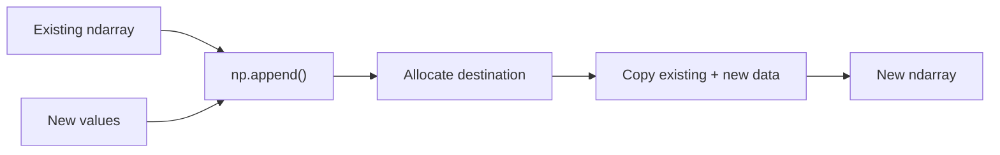
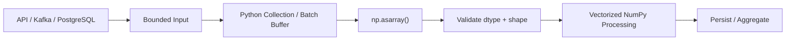

# 11- Append

## Overview

`np.append()` is a convenience function for adding values to an existing NumPy array. It returns a **new array** rather than modifying the original array in place.

The most important behavior to remember is:

```text
np.append()
→ returns a new ndarray
→ copies existing data into the new result
→ can flatten the input when axis=None
```

This makes `np.append()` convenient for small, one-off transformations, but it is usually a poor choice for repeatedly growing arrays in production data-processing workloads.



For engineering workloads, the main question is not whether `np.append()` works. It is whether appending is actually the right **data-structure and allocation strategy**.

## What `np.append()` Does

A basic append combines an array with additional values:

```python
import numpy as np

values = np.array([10, 20, 30])

result = np.append(
    values,
    40,
)

print(result)
# [10 20 30 40]
```

The original remains unchanged:

```python
print(values)
# [10 20 30]
```

The function therefore behaves more like a convenience wrapper around concatenation than an in-place operation.

## Why `np.append()` Exists

`np.append()` provides a compact interface for a common operation:

```text
existing array
+
additional values
```

It is useful when:

- A single small append is needed.
- Code readability is more important than allocation optimization.
- The final output is immediately required as a new array.
- The input size is moderate and predictable.
- The operation occurs outside a hot path.

For large or repeatedly growing datasets, other approaches are usually more appropriate.

## `np.append()` Is Not In-Place

This is a common mistake:

```python
import numpy as np

values = np.array([1, 2, 3])

np.append(values, 4)

print(values)
# [1 2 3]
```

The result must be assigned:

```python
values = np.append(values, 4)

print(values)
# [1 2 3 4]
```

The important engineering contract is:

```text
np.append(source, values)
→ source is unchanged
→ returned array contains the result
```

## `np.append()` and `axis=None`

By default:

```python
axis=None
```

This means the input arrays are flattened before the append operation.

Consider:

```python
import numpy as np

values = np.array(
    [
        [1, 2],
        [3, 4],
    ]
)

result = np.append(
    values,
    [5, 6],
)

print(result)
# [1 2 3 4 5 6]
```

The original two-dimensional structure is not preserved.

This behavior is easy to overlook and can introduce shape bugs.

When dimensional semantics matter, specify `axis` explicitly.

## Appending Along an Axis

For two-dimensional arrays, append can operate along an existing axis.

```python
import numpy as np

values = np.array(
    [
        [1, 2],
        [3, 4],
    ]
)

result = np.append(
    values,
    [
        [5, 6],
    ],
    axis=0,
)

print(result)
```

```text
[[1 2]
 [3 4]
 [5 6]]
```

The shape changes from:

```text
(2, 2)
→
(3, 2)
```

Here:

```text
axis=0
→ append rows
```

## Appending Columns

Use `axis=1` to append columns:

```python
import numpy as np

values = np.array(
    [
        [1, 2],
        [3, 4],
    ]
)

result = np.append(
    values,
    [
        [5],
        [6],
    ],
    axis=1,
)

print(result)
```

```text
[[1 2 5]
 [3 4 6]]
```

The shape becomes:

```text
(2, 3)
```

The appended values must have a compatible shape for the selected axis.

## Shape Compatibility

When `axis` is specified, all dimensions except the append axis must match.

For example:

```text
source → (100, 8)
new    → (20, 8)
```

is valid with:

```python
np.append(source, new, axis=0)
```

because the feature dimension matches.

But:

```text
source → (100, 8)
new    → (20, 6)
```

is invalid along axis 0 because:

```text
8 != 6
```

The general rule is:

```text
all non-appended dimensions must be compatible
```

## `np.append()` vs `np.concatenate()`

`np.append()` is essentially a convenience API for a subset of concatenation use cases.

| Operation | Main purpose | Modifies input | Explicit axis | Typical production use |
|---|---|---:|---:|---|
| `np.append()` | Add values | No | Optional | Small/simple one-off additions |
| `np.concatenate()` | Join arrays | No | Yes | Batch composition |
| `np.stack()` | Add a new dimension | No | Yes | Build higher-dimensional batches |
| `np.insert()` | Add values at positions | No | Optional | Position-specific insertion |

For production code, `concatenate()` often communicates intent more clearly:

```python
result = np.concatenate(
    [values, new_batch],
    axis=0,
)
```

rather than:

```python
result = np.append(
    values,
    new_batch,
    axis=0,
)
```

when the actual semantic operation is "join another batch."

## Why Repeated `np.append()` Is Expensive

A common anti-pattern is:

```python
import numpy as np

values = np.empty(
    0,
    dtype=np.float64,
)

for item in incoming_values:
    values = np.append(
        values,
        item,
    )
```

Each append can require:

```text
existing array
      ↓
allocate larger destination
      ↓
copy existing values
      ↓
write new value
      ↓
replace reference
```

Repeated over many iterations, previously stored values may be copied again and again.

The cumulative data movement can become much larger than the final array size.

## Why Python Lists Are Better for Dynamic Growth

Python lists are designed for dynamic accumulation:

```python
values: list[float] = []

for item in incoming_values:
    values.append(item)

array = np.asarray(
    values,
    dtype=np.float64,
)
```

This separates the two concerns:

```text
Dynamic collection
→ Python list

Numerical processing
→ NumPy ndarray
```

That is generally a better architecture than repeatedly resizing a NumPy array.

## Preallocation for Known Sizes

If the final size is known, preallocate the NumPy array:

```python
import numpy as np

count = 100_000

values = np.empty(
    count,
    dtype=np.float64,
)

for index, item in enumerate(incoming_values):
    values[index] = item
```

This avoids repeated reallocation.

For fixed-shape records:

```python
values = np.empty(
    (100_000, 8),
    dtype=np.float32,
)
```

and fill each batch or row directly.

The engineering rule is:

```text
Known size
→ preallocate

Unknown size
→ accumulate in a dynamic structure, then convert
```

## Batch-Oriented Appending

Suppose an API returns batches:

```text
batch 1 → (10,000, 8)
batch 2 → (10,000, 8)
batch 3 → (10,000, 8)
```

Avoid:

```python
result = np.empty((0, 8), dtype=np.float32)

for batch in batches:
    result = np.append(
        result,
        batch,
        axis=0,
    )
```

Prefer:

```python
result = np.concatenate(
    batches,
    axis=0,
)
```

This still creates one final destination, but avoids repeatedly rebuilding the accumulated array.

An even better design for very large workloads may be to process each batch independently and avoid creating the combined array altogether.

## Batch-Local Processing

Instead of:

```text
batch 1 ─┐
batch 2 ─┤
batch 3 ─┤
          ↓
       append
          ↓
    huge ndarray
          ↓
       process
```

prefer:

```text
batch 1 → process → persist
batch 2 → process → persist
batch 3 → process → persist
```

This reduces peak memory and gives the system natural processing boundaries.

`np.append()` should not become an accidental buffer-management strategy.

## Memory Costs

Consider:

```python
import numpy as np

values = np.empty(
    10_000_000,
    dtype=np.float64,
)
```

The source occupies approximately:

```text
10,000,000 × 8 bytes
≈ 80 MB
```

Appending one element still requires a new result representation.

The resulting data is approximately:

```text
80 MB + 8 bytes
```

but the process may temporarily hold both the source and destination:

```text
source
+
destination
+
temporary/application overhead
```

The exact peak RSS depends on the runtime and allocator, but the allocation behavior is what matters operationally.

## Dtype Promotion

Appending values with different dtypes can cause promotion.

```python
import numpy as np

values = np.array(
    [1, 2, 3],
    dtype=np.int32,
)

result = np.append(
    values,
    4.5,
)

print(result.dtype)
```

The result may use a wider dtype capable of representing the new value.

For large arrays, this can increase memory use significantly.

A production pipeline should establish a canonical dtype:

```python
values = np.asarray(
    values,
    dtype=np.float32,
)

new_values = np.asarray(
    new_values,
    dtype=np.float32,
)

result = np.concatenate(
    [values, new_values],
    axis=0,
)
```

## `append()` and Shape Semantics

Without `axis`:

```python
np.append(
    values_2d,
    new_values,
)
```

flattens the data.

With `axis=0`:

```python
np.append(
    values_2d,
    new_values,
    axis=0,
)
```

the dimensional structure is preserved.

Therefore:

```text
axis=None
→ flattening semantics

axis=0 / 1 / ...
→ preserve multidimensional structure
```

For production numerical code, explicit `axis` is usually preferable whenever shape semantics matter.

## Appending Empty Arrays

Appending an empty array still needs dtype and dimensional considerations.

```python
import numpy as np

values = np.array(
    [1, 2, 3],
    dtype=np.int64,
)

result = np.append(
    values,
    np.array([], dtype=np.int64),
)

print(result)
# [1 2 3]
```

For multidimensional arrays with an explicit axis, the empty array must still have compatible dimensions.

```python
empty_batch = np.empty(
    (0, 8),
    dtype=np.float32,
)

batch = np.empty(
    (100, 8),
    dtype=np.float32,
)

result = np.append(
    empty_batch,
    batch,
    axis=0,
)
```

This preserves the expected two-dimensional shape.

## Append vs Insert

`np.append()` adds values at the end of an axis.

`np.insert()` adds values at a specified position.

```python
values = np.array([10, 20, 30])

np.append(values, 40)
# [10 20 30 40]

np.insert(values, 1, 40)
# [10 40 20 30]
```

If the requirement is simply:

```text
add another batch at the end
```

`concatenate()` or append semantics are more appropriate than `insert()`.

If position matters:

```text
insert()
```

is the more direct API.

## Append vs Resize

The two operations also have different mutation semantics.

| Operation | Input modified | Can change size | Result |
|---|---:|---:|---|
| `np.append()` | No | Yes | New array |
| `ndarray.resize()` | Yes | Yes | Same array object |
| `np.concatenate()` | No | Yes | New array |
| `reshape()` | No | No | View when possible |

Do not treat `np.append()` as a safer or more convenient in-place `resize()`.

Its returned-array semantics are fundamentally different.

## Append vs Broadcasting

`np.append()` is about changing data size.

Broadcasting is about allowing arrays of compatible shapes to participate in an operation without materializing repeated data.

For example:

```python
import numpy as np

records = np.array(
    [
        [10.0, 20.0],
        [30.0, 40.0],
    ]
)

offset = np.array(
    [1.0, 2.0],
)

result = records + offset
```

No append operation is required.

Do not use `append()` when the actual requirement is only shape alignment.

## Append and Backend APIs

An API handler may receive incremental numeric records:

```text
HTTP request
    ↓
validation
    ↓
application collection
    ↓
NumPy conversion
    ↓
vectorized processing
```

A common mistake is converting every request into a NumPy array and repeatedly appending records.

Instead:

```python
records: list[list[float]] = []

for payload in incoming_payloads:
    records.extend(payload)

array = np.asarray(
    records,
    dtype=np.float32,
)
```

Then perform the numerical work once.

This keeps dynamic accumulation separate from numerical processing.

## Append and Kafka

Kafka consumers already provide bounded polling and batching semantics.

A practical consumer pattern is:

```text
Kafka poll
    ↓
list / message buffer
    ↓
NumPy conversion
    ↓
vectorized processing
    ↓
commit / persist
```

Avoid:

```text
poll message
→ np.append()
→ poll message
→ np.append()
→ ...
```

for large streams.

Use the consumer's batching model and convert to NumPy at a deliberate processing boundary.

## Append and Celery

For Celery tasks, do not use `np.append()` as an unbounded accumulator across task results.

Instead:

```text
Task outputs
    ↓
bounded list / object references
    ↓
single numerical materialization
    ↓
processing
```

Large numerical results should generally live in:

- Object storage.
- Files.
- Databases.
- Durable shared storage.

rather than being accumulated through repeated array operations or transported through broker messages.

## Append and PostgreSQL

When rows are being added to a NumPy array because they came from multiple database queries, first consider whether the queries can be consolidated.

Prefer:

```text
PostgreSQL
→ filtered / aggregated result
→ one bounded fetch
→ NumPy
```

over:

```text
query
→ append
→ query
→ append
→ query
→ append
```

If multiple batches are unavoidable, accumulate them and use one `concatenate()` where a unified array is genuinely required.

## Append and Pandas

Pandas is generally more appropriate when incremental data represents labeled tabular records.

NumPy should be introduced when the workload becomes numerical and array-oriented.

A common boundary is:

```text
API / database
    ↓
Pandas / Python structures
    ↓
schema cleanup
    ↓
NumPy numerical block
    ↓
vectorized processing
```

Avoid switching between Pandas and NumPy simply because `append()` or another convenience method exists.

The data representation should follow the workload.

## Security and Resource Limits

If append operations depend on external input, control the maximum resulting size.

For example:

```python
MAX_RECORDS = 1_000_000


def validate_append(
    current_size: int,
    incoming_size: int,
) -> None:
    if current_size + incoming_size > MAX_RECORDS:
        raise ValueError(
            "Result would exceed configured record limit"
        )
```

Also consider:

```text
maximum request size
maximum batch size
maximum cumulative records
maximum output bytes
worker memory limit
```

An attacker does not need direct memory access to trigger a memory-exhaustion problem. A service that repeatedly materializes large arrays from unbounded input can be vulnerable to resource exhaustion.

## Production Pattern

A robust numerical ingestion pipeline usually separates collection from numerical representation:



This avoids making `np.append()` responsible for lifecycle management.

## Performance Considerations

For an array containing `N` elements, an append that changes the output size generally requires:

```text
allocate destination
+
copy existing N elements
+
write incoming values
```

so the operation is approximately:

```text
O(N + M)
```

where:

```text
N = existing elements
M = appended elements
```

Repeated appends create cumulative copying.

For example:

```text
append 1
→ copy 1

append 2
→ copy 2

append 3
→ copy 3

...

append N
→ copy N
```

The total work can become quadratic in the number of incremental additions for certain workloads.

This is why dynamic Python collections or fixed-size preallocation are usually better.

## Benchmarking

A simple benchmark can compare repeated append with batch construction:

```python
from time import perf_counter
import numpy as np


items = list(range(100_000))

start = perf_counter()

result = np.empty(
    0,
    dtype=np.int64,
)

for item in items:
    result = np.append(
        result,
        item,
    )

append_elapsed = perf_counter() - start

start = perf_counter()

result = np.asarray(
    items,
    dtype=np.int64,
)

array_elapsed = perf_counter() - start

print(f"repeated append: {append_elapsed:.6f}s")
print(f"array construction: {array_elapsed:.6f}s")
```

The benchmark should be treated as a methodology example, not a universal performance number.

Measure with:

- Representative data sizes.
- Realistic dtypes.
- Production-like batching.
- Peak memory.
- Downstream processing.
- Different ingestion patterns.

## Choosing the Right Operation

| Requirement | Preferred approach |
|---|---|
| Add one small value to a small array | `np.append()` |
| Add a complete batch | `np.concatenate()` |
| Repeated dynamic accumulation | Python list |
| Known final size | Preallocated ndarray |
| Add values at arbitrary positions | `np.insert()` |
| Remove values by condition | Boolean masking |
| Change shape without changing count | `reshape()` |
| Build a new dimension | `stack()` |
| Process large datasets incrementally | Bounded slices / generators |

The important point is that API selection should follow data lifecycle rather than convenience.

## Common Mistakes

### Assuming `np.append()` Is In-Place

It is not.

```python
np.append(values, item)
```

does not modify `values`.

Assign the result or use an operation that matches your ownership model.

### Calling `np.append()` Inside a Loop

This is one of the most common performance mistakes.

Repeated allocations and copies can become extremely expensive.

Use a list, preallocation, or batch concatenation.

### Forgetting `axis`

For multidimensional arrays, omitting `axis` flattens the input.

Specify the axis when shape semantics matter.

### Using Append to Build Large Batches

Append is a convenience operation, not a high-performance dynamic buffer.

Use batch collection and one final materialization instead.

### Ignoring Dtype Promotion

Appending values of incompatible types can widen the result dtype.

Check `dtype`, `itemsize`, and `nbytes` when memory is important.

### Using Append When Broadcasting Is Intended

If the real problem is shape alignment for arithmetic, broadcasting may eliminate the need for explicit materialization.

### Sending Large Appended Arrays Through API or Broker Boundaries

Creating a large array is only one part of the cost. Serialization and transport can multiply the memory and latency impact.

Use bounded payloads and durable storage for large datasets.

### Appending Instead of Filtering

If records should be accepted conditionally, construct a valid batch directly rather than appending accepted records one at a time.

## Testing Append Behavior

Test that the original input remains unchanged:

```python
import numpy as np


def test_append_returns_new_array():
    values = np.array([1, 2, 3])

    result = np.append(
        values,
        4,
    )

    np.testing.assert_array_equal(
        values,
        np.array([1, 2, 3]),
    )

    np.testing.assert_array_equal(
        result,
        np.array([1, 2, 3, 4]),
    )
```

Test axis-aware behavior:

```python
def test_append_rows():
    values = np.array(
        [
            [1, 2],
            [3, 4],
        ]
    )

    result = np.append(
        values,
        [[5, 6]],
        axis=0,
    )

    assert result.shape == (3, 2)

    np.testing.assert_array_equal(
        result,
        np.array(
            [
                [1, 2],
                [3, 4],
                [5, 6],
            ]
        ),
    )
```

Test that omitted axis changes dimensionality:

```python
def test_append_without_axis_flattens():
    values = np.array(
        [
            [1, 2],
            [3, 4],
        ]
    )

    result = np.append(
        values,
        [5, 6],
    )

    assert result.ndim == 1
```

Production tests should also cover:

- Empty arrays.
- Multiple dtypes.
- Large batch sizes.
- Shape incompatibility.
- Maximum configured record counts.
- Non-finite values where relevant.
- Downstream processing behavior.

## Debugging Append Problems

Inspect both source and result:

```python
print("source shape:", values.shape)
print("source dtype:", values.dtype)
print("source bytes:", values.nbytes)

print("result shape:", result.shape)
print("result dtype:", result.dtype)
print("result bytes:", result.nbytes)
```

When performance is unexpectedly poor, ask:

```text
Is append being called repeatedly?
        ↓
Could I collect values first?
        ↓
Could I preallocate?
        ↓
Could concatenate express batch semantics better?
        ↓
Could I process batches independently?
        ↓
Could the database or upstream service provide bounded batches?
```

This identifies the architectural cause instead of optimizing the append call itself.

## Interview Questions

### Does `np.append()` modify the original array?

No. It returns a new array.

### Why can repeated `np.append()` be slow?

Each call may allocate a larger destination and copy the existing values, creating repeated data movement.

### What should be used for dynamic accumulation?

A Python list or another dynamic collection, followed by one NumPy conversion once the collection boundary is known.

### What happens when `axis` is omitted?

The inputs are flattened before appending.

### How is `np.append()` related to `np.concatenate()`?

`np.append()` is a convenience interface for adding data to an array. `np.concatenate()` is more explicit and flexible for joining arrays along an existing axis and is usually clearer for batch-oriented production code.

### Why is preallocation better when the final size is known?

It creates the destination buffer once and avoids repeated reallocation and copying.

### When would you use `np.append()` in production?

For small, bounded, one-off transformations where allocation cost is insignificant and the code is clearer than a more elaborate alternative.

### Why might a database-side operation be better than appending in Python?

Filtering, aggregation, and batching in the database can reduce data transfer and application-side memory pressure before NumPy processing begins.

## Key Takeaways

- `np.append()` returns a new array and should not be treated as an in-place growth operation.
- Repeated appending is usually inefficient because accumulated data can be repeatedly reallocated and copied.
- Specify `axis` explicitly for multidimensional data; the default `axis=None` flattens the inputs before appending.
- Use Python collections for dynamic accumulation, preallocate when the final size is known, and prefer `concatenate()` for joining complete numerical batches.
- In production pipelines, treat append as a small convenience operation rather than a buffering strategy, and control memory, dtype, batch size, and external input limits before materializing large arrays.