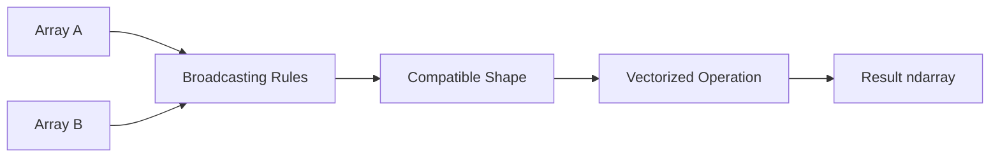

# 12- Broadcasting

## Overview

Broadcasting is NumPy's mechanism for performing element-wise operations on arrays with compatible but different shapes.

Instead of requiring two arrays to have identical dimensions, NumPy can logically expand the smaller shape to match the larger one without necessarily materializing repeated data.

The key engineering distinction is:

```text
Broadcasting
→ logical shape alignment
→ often avoids explicit replication
→ enables vectorized operations

repeat() / tile()
→ physically materialize repeated values
→ allocate output storage
```

Broadcasting is one of the main reasons NumPy can express large numerical transformations compactly and efficiently.



The production challenge is not merely knowing how broadcasting works. It is understanding:

- Shape compatibility.
- Axis alignment.
- Implicit expansion.
- Memory behavior.
- Temporary allocations.
- Dtype promotion.
- When broadcasting improves performance.
- When broadcasting produces unintended results.

## Why Broadcasting Exists

Consider a batch of records:

```text
records.shape = (100_000, 8)
```

Suppose every feature needs a different scaling factor:

```text
scales.shape = (8,)
```

Without broadcasting, you could explicitly construct:

```text
(100_000, 8)
```

copies of the eight scaling values.

Broadcasting allows:

```python
scaled = records * scales
```

without requiring that repeated matrix to exist explicitly.

Conceptually:

```text
records
(100000, 8)

scales
(8,)

logical broadcast
     ↓

(100000, 8)
```

The calculation operates element-wise across the aligned dimensions.

## Basic Broadcasting

```python
import numpy as np

values = np.array(
    [
        [10.0, 20.0, 30.0],
        [40.0, 50.0, 60.0],
    ]
)

offset = np.array(
    [1.0, 2.0, 3.0],
)

result = values + offset

print(result)
```

```text
[[11. 22. 33.]
 [41. 52. 63.]]
```

Shapes:

```text
values → (2, 3)
offset → (3,)
result → (2, 3)
```

The one-dimensional array is logically aligned with the last dimension of the two-dimensional array.

## Broadcasting Rules

NumPy compares shapes from the **rightmost dimension toward the left**.

Two dimensions are compatible when:

1. They are equal.
2. One of them is `1`.
3. One of the arrays has no dimension at that position.

For example:

```text
A → (4, 3)
B → (3,)
```

Align from the right:

```text
A → (4, 3)
B →    (3)
```

The `3` matches.

So the operation is valid.

Another example:

```text
A → (4, 3, 2)
B →    (3, 1)
```

Alignment:

```text
A → (4, 3, 2)
B → (   3, 1)
```

Compare from the right:

```text
2 vs 1 → compatible
3 vs 3 → compatible
4 vs missing → compatible
```

Therefore the result shape is:

```text
(4, 3, 2)
```

## Broadcasting Example with Scalars

A scalar broadcasts to every element.

```python
import numpy as np

values = np.array(
    [
        [10.0, 20.0],
        [30.0, 40.0],
    ]
)

result = values * 1.05
```

Conceptually:

```text
1.05
 ↓
[1.05 1.05
 1.05 1.05]
```

but NumPy does not need to explicitly construct that repeated matrix.

This is the simplest form of broadcasting.

## Broadcasting with a Row Vector

Consider:

```python
import numpy as np

values = np.array(
    [
        [10.0, 20.0, 30.0],
        [40.0, 50.0, 60.0],
    ]
)

weights = np.array(
    [1.0, 2.0, 3.0],
)

result = values * weights
```

The shape relationship is:

```text
values  → (2, 3)
weights → (3,)
```

NumPy effectively treats `weights` as:

```text
(1, 3)
```

and broadcasts it across axis 0.

## Broadcasting with a Column Vector

Sometimes the desired shape is:

```text
(rows, 1)
```

rather than:

```text
(columns,)
```

For example:

```python
import numpy as np

values = np.array(
    [
        [10.0, 20.0, 30.0],
        [40.0, 50.0, 60.0],
    ]
)

weights = np.array(
    [1.0, 2.0],
)

result = values * weights[:, np.newaxis]
```

Now:

```text
values  → (2, 3)
weights → (2, 1)
```

The shape `(2, 1)` broadcasts across the feature dimension:

```text
[[1.0, 1.0, 1.0],
 [2.0, 2.0, 2.0]]
```

This is a common pattern for per-record scaling.

## `None` and `np.newaxis`

These are equivalent ways to insert a size-one dimension:

```python
weights[:, None]
```

and:

```python
weights[:, np.newaxis]
```

Both transform:

```text
(2,)
```

into:

```text
(2, 1)
```

This is often the cleanest way to prepare an array for broadcasting.

## Broadcasting with `reshape()`

The same shape manipulation can be expressed with `reshape()`:

```python
weights = weights.reshape(-1, 1)
```

This transforms:

```text
(2,)
```

into:

```text
(2, 1)
```

The choice is mostly about readability and intent:

```text
[:, None]
→ concise axis insertion

reshape(-1, 1)
→ explicit shape transformation
```

Both are useful in production code.

## Broadcasting Shape Examples

| Array A | Array B | Compatible? | Result |
|---|---|---:|---|
| `(4, 3)` | `(3,)` | Yes | `(4, 3)` |
| `(4, 3)` | `(4, 1)` | Yes | `(4, 3)` |
| `(4, 3)` | `(1, 3)` | Yes | `(4, 3)` |
| `(4, 3)` | `(2,)` | No | — |
| `(4, 3, 2)` | `(3, 1)` | Yes | `(4, 3, 2)` |
| `(4, 3, 2)` | `(4, 1, 1)` | Yes | `(4, 3, 2)` |
| `(4, 3, 2)` | `(4, 2)` | No | — |

The rightmost-dimension rule should become the primary mental model.

## Broadcasting Failure

Consider:

```python
import numpy as np

values = np.empty((4, 3))
weights = np.empty((2,))

result = values * weights
```

The shapes are:

```text
(4, 3)
(2,)
```

Alignment:

```text
4 3
  2
```

The last dimensions:

```text
3 != 2
```

and neither is `1`.

Therefore broadcasting fails.

The error is a shape-contract problem, not a NumPy performance issue.

## Broadcasting and Axis Semantics

Broadcasting becomes much easier when array axes have explicit meanings.

Suppose:

```text
records.shape = (batch, features)
```

and:

```text
feature_mean.shape = (features,)
```

Then:

```python
centered = records - feature_mean
```

has a clear interpretation:

```text
subtract each feature's mean from every record
```

Without the semantic contract, the same code may appear arbitrary.

Senior-level NumPy code should therefore document:

```text
axis 0 → records
axis 1 → features
```

before relying heavily on broadcasting.

## `keepdims` and Broadcasting

Reductions frequently produce arrays that are intended for broadcasting.

Consider:

```python
import numpy as np

values = np.array(
    [
        [10.0, 20.0, 30.0],
        [12.0, 18.0, 33.0],
        [11.0, 21.0, 29.0],
    ]
)

means = values.mean(
    axis=0,
    keepdims=True,
)

centered = values - means
```

Shapes:

```text
values → (3, 3)
means  → (1, 3)
```

The `(1, 3)` shape explicitly preserves the feature dimension and broadcasts across records.

This pattern is especially useful in reusable numerical functions.

## Broadcasting and Aggregation

Broadcasting commonly follows a reduction:

```text
input
  ↓
reduce across an axis
  ↓
statistics with keepdims
  ↓
broadcast back over original array
```

Example:

```python
import numpy as np


def center_features(
    records: np.ndarray,
) -> np.ndarray:
    if records.ndim != 2:
        raise ValueError("Expected shape (batch, features)")

    means = records.mean(
        axis=0,
        keepdims=True,
    )

    return records - means
```

The shape contract is:

```text
Input:
(batch, features)

Mean:
(1, features)

Output:
(batch, features)
```

This is a common and robust numerical processing pattern.

## Broadcasting vs Explicit Repetition

Suppose:

```python
weights = np.array(
    [1.0, 2.0, 3.0],
)

records = np.empty(
    (1_000_000, 3),
    dtype=np.float32,
)
```

A materialized approach:

```python
expanded = np.tile(
    weights,
    (records.shape[0], 1),
)

result = records * expanded
```

creates a large intermediate array.

Broadcasting:

```python
result = records * weights
```

expresses the same mathematical operation without explicitly materializing the repeated weights array.

This can substantially reduce memory use.

## Broadcasting Does Not Mean No Extra Memory

Broadcasting avoids one common class of materialization, but the operation itself can still allocate an output array.

For:

```python
result = values * weights
```

the result is a new array unless an explicit output buffer is used.

Therefore:

```text
broadcasting
→ may avoid repeated-input allocation

but

vectorized result
→ may still allocate output storage
```

This distinction is important when peak memory is constrained.

## Using `out=` to Control Allocation

Many NumPy ufuncs support an `out=` parameter.

```python
import numpy as np

values = np.empty(
    (100_000, 8),
    dtype=np.float32,
)

weights = np.ones(
    8,
    dtype=np.float32,
)

result = np.empty_like(values)

np.multiply(
    values,
    weights,
    out=result,
)
```

This makes the output buffer explicit.

For memory-sensitive pipelines, `out=` can reduce unnecessary temporary allocations when the operation and ownership semantics permit it.

## Broadcasting and Temporary Arrays

A compound expression can create multiple intermediate arrays.

For example:

```python
result = (values - mean) / scale
```

may conceptually involve:

```text
values - mean
      ↓
temporary array
      ↓
temporary / scale
      ↓
result
```

Broadcasting itself is not necessarily the source of the memory problem.

The issue is the complete expression graph.

For very large arrays, consider:

```python
np.subtract(
    values,
    mean,
    out=result,
)

np.divide(
    result,
    scale,
    out=result,
)
```

This can reuse the same destination buffer.

The trade-off is increased implementation complexity.

## Broadcasting and Dtypes

Broadcasting aligns shapes, not numeric precision.

Dtype promotion can still occur during the operation.

```python
import numpy as np

values = np.ones(
    10_000_000,
    dtype=np.float32,
)

offset = np.array(
    [1.0],
    dtype=np.float64,
)

result = values + offset

print(result.dtype)
# float64
```

The result can therefore require twice as much data-buffer memory as the `float32` input.

For large numerical pipelines, validate dtype expectations before expensive broadcasted operations.

## Broadcasting with Integer Types

Integer operations can also be affected by dtype behavior.

```python
import numpy as np

values = np.array(
    [1, 2, 3],
    dtype=np.int32,
)

offset = np.int64(1)

result = values + offset
```

The result dtype depends on NumPy's type-promotion rules.

Do not infer memory cost from shape alone.

The full resource model is:

```text
element count
×
dtype itemsize
```

## Broadcasting and Boolean Masks

Broadcasting also applies to comparisons and masks.

```python
import numpy as np

values = np.array(
    [
        [10, 20, 30],
        [40, 50, 60],
    ]
)

limits = np.array(
    [15, 25, 35],
)

mask = values < limits
```

Shapes:

```text
values → (2, 3)
limits → (3,)
mask   → (2, 3)
```

The per-column limits broadcast across rows.

This is useful for vectorized validation:

```text
record values
    ↓
per-feature constraints
    ↓
broadcast comparison
    ↓
boolean validation mask
```

## Backend Validation Example

```python
import numpy as np


def validate_metrics(
    records: np.ndarray,
    minimums: np.ndarray,
    maximums: np.ndarray,
) -> np.ndarray:
    if records.ndim != 2:
        raise ValueError("Expected shape (batch, features)")

    if minimums.shape != (records.shape[1],):
        raise ValueError("minimums must match feature count")

    if maximums.shape != (records.shape[1],):
        raise ValueError("maximums must match feature count")

    return (
        np.all(records >= minimums, axis=1)
        & np.all(records <= maximums, axis=1)
    )
```

Here:

```text
records    → (batch, features)
minimums   → (features,)
maximums   → (features,)
```

Broadcasting applies each feature's boundary to every record.

This is a practical pattern for data validation without Python-level nested loops.

## Broadcasting and Normalization

A common transformation is per-feature normalization:

```python
import numpy as np


def normalize(
    records: np.ndarray,
) -> np.ndarray:
    if records.ndim != 2:
        raise ValueError("Expected a 2-D array")

    minimum = records.min(
        axis=0,
        keepdims=True,
    )

    maximum = records.max(
        axis=0,
        keepdims=True,
    )

    span = maximum - minimum

    if np.any(span == 0):
        raise ValueError(
            "Cannot normalize constant features"
        )

    return (records - minimum) / span
```

The shapes remain:

```text
records → (batch, features)
minimum → (1, features)
maximum → (1, features)
```

Broadcasting applies the feature-specific values across the batch.

## Broadcasting and Standardization

The same concept applies to standardization:

```python
import numpy as np


def standardize(
    records: np.ndarray,
) -> np.ndarray:
    mean = records.mean(
        axis=0,
        keepdims=True,
    )

    std = records.std(
        axis=0,
        keepdims=True,
    )

    if np.any(std == 0):
        raise ValueError(
            "Constant features cannot be standardized"
        )

    return (records - mean) / std
```

The operation is:

```text
subtract per-feature mean
        ↓
divide by per-feature standard deviation
```

with broadcasting handling the batch dimension.

## Broadcasting Across Higher Dimensions

Suppose:

```text
data.shape = (batch, timestamp, metric)
```

For:

```text
(32, 1440, 8)
```

you may want one scale per metric:

```text
scale.shape = (8,)
```

Then:

```python
scaled = data * scale
```

broadcasts the scale vector across both:

```text
batch
timestamp
```

dimensions.

The effective alignment is:

```text
data:
(32, 1440, 8)

scale:
(        8)

result:
(32, 1440, 8)
```

This is particularly useful for telemetry and time-windowed numerical data.

## Adding Explicit Dimensions

Suppose each batch needs one multiplier:

```text
batch_scale.shape = (32,)
data.shape         = (32, 1440, 8)
```

To broadcast one scale across each batch:

```python
scaled = data * batch_scale[:, None, None]
```

The shape becomes:

```text
(32, 1, 1)
```

which broadcasts across:

```text
timestamp = 1440
metric    = 8
```

This is a general technique:

```text
insert size-one axes
→ control exactly where broadcasting occurs
```

## Broadcasting and Transpose

Broadcasting and transpose are often combined, but unnecessary transposes can make code harder to reason about.

Suppose:

```text
values.shape = (batch, features)
```

and:

```text
weights.shape = (features,)
```

This already broadcasts correctly:

```python
values * weights
```

There is no reason to transpose merely to make the vectors "line up."

Use transpose when the data itself needs a different axis order, not simply as a workaround for a misunderstood shape.

## Broadcasting and Concatenation

Broadcasting does not change array size by itself.

It enables an operation such as:

```python
result = values + offset
```

but the result has a concrete shape and may allocate new storage.

Concatenation explicitly changes the stored shape:

```python
result = np.concatenate(
    [values, new_values],
    axis=0,
)
```

The distinction is:

```text
broadcasting
→ shape compatibility for computation

concatenation
→ physically combine data
```

## Broadcasting and Stack

Stack creates a new dimension:

```python
stacked = np.stack(
    [batch_a, batch_b],
    axis=0,
)
```

Broadcasting then operates over that dimension if shapes are compatible.

For example:

```text
stacked:
(batch, record, feature)

scale:
(feature,)

stacked * scale
```

The scale broadcasts across batch and record dimensions.

This creates a useful composition:

```text
stack
→ define structure

broadcast
→ apply shared numerical parameters
```

## Broadcasting and `where`

Conditional selection can also use broadcasting.

```python
import numpy as np

values = np.array(
    [
        [10.0, 50.0, 90.0],
        [20.0, 60.0, 80.0],
    ]
)

thresholds = np.array(
    [30.0, 55.0, 85.0],
)

result = np.where(
    values > thresholds,
    values,
    0.0,
)
```

The threshold vector broadcasts across rows.

This is useful for vectorized business rules where each metric has its own threshold.

## Broadcasting and Missing Values

Broadcasting can apply validity conditions across an entire dataset.

For example:

```python
import numpy as np

values = np.array(
    [
        [10.0, np.nan, 30.0],
        [20.0, 40.0, 50.0],
    ]
)

allowed = np.array(
    [True, False, True],
)

mask = np.isfinite(values) & allowed
```

The `allowed` vector broadcasts across rows.

This allows feature-specific eligibility rules to be combined with numerical validity checks.

## Broadcasting and Memory-Mapped Arrays

Broadcasting can be particularly useful with memory-mapped numerical data because it avoids creating a repeated copy of small parameter arrays.

```python
import numpy as np

data = np.memmap(
    "metrics.dat",
    dtype=np.float32,
    mode="r",
    shape=(10_000_000, 8),
)

scale = np.array(
    [1.0, 0.95, 1.05, 1.0, 0.9, 1.1, 1.0, 0.98],
    dtype=np.float32,
)

for start in range(0, data.shape[0], 100_000):
    batch = data[start:start + 100_000]
    result = batch * scale
    process(result)
```

The scale vector does not need to be expanded to the batch shape before processing.

## Broadcasting and Large Datasets

Broadcasting helps avoid one class of memory amplification, but it does not make arbitrarily large operations safe.

Suppose:

```text
data.shape = (100_000_000, 8)
```

and:

```python
result = data * scale
```

The output itself can still be hundreds of megabytes or more depending on dtype.

For large datasets, use bounded batches:

```text
large source
    ↓
slice batch
    ↓
broadcast parameters
    ↓
vectorized operation
    ↓
persist / consume
    ↓
next batch
```

This keeps peak working memory predictable.

## `np.broadcast_to()`

`np.broadcast_to()` exposes a broadcasted view of an array with a requested shape.

```python
import numpy as np

values = np.array(
    [1, 2, 3],
)

expanded = np.broadcast_to(
    values,
    (4, 3),
)

print(expanded)
```

```text
[[1 2 3]
 [1 2 3]
 [1 2 3]
 [1 2 3]]
```

This is different from `np.tile()` because the broadcasted representation does not need to materialize independent copies of the values.

However, the returned broadcasted array should generally be treated as read-only because multiple logical positions may refer to the same underlying data.

`broadcast_to()` is useful when explicitly inspecting or passing a broadcast-compatible view is valuable.

## `np.broadcast_shapes()`

When building reusable functions, `np.broadcast_shapes()` can validate shape compatibility without performing the numerical operation.

```python
import numpy as np

result_shape = np.broadcast_shapes(
    (1000, 8),
    (8,),
)

print(result_shape)
# (1000, 8)
```

This can be useful at application boundaries where shape validation should happen before an expensive computation.

## `np.broadcast_arrays()`

`np.broadcast_arrays()` can produce broadcast-compatible views:

```python
import numpy as np

values = np.empty((4, 3))
weights = np.empty(3)

values_view, weights_view = np.broadcast_arrays(
    values,
    weights,
)

print(values_view.shape)
# (4, 3)

print(weights_view.shape)
# (4, 3)
```

Use this selectively. The main benefit is making the broadcasted shapes explicit, not creating a larger independent dataset.

## Production Shape Contracts

Reusable numerical functions should make broadcasting requirements explicit.

```python
import numpy as np
from numpy.typing import NDArray


def apply_feature_scale(
    records: NDArray[np.float32],
    scale: NDArray[np.float32],
) -> NDArray[np.float32]:
    if records.ndim != 2:
        raise ValueError(
            "records must have shape (batch, features)"
        )

    if scale.shape != (records.shape[1],):
        raise ValueError(
            "scale must have one value per feature"
        )

    return records * scale
```

The contract is:

```text
records → (batch, features)
scale   → (features,)
result  → (batch, features)
```

This is preferable to allowing arbitrary shapes and relying on accidental broadcasting.

## Security and Resource Exhaustion

Broadcasting itself is not typically a memory-exhaustion operation, but the output and surrounding expressions still consume resources.

External input can manipulate:

- Array dimensions.
- Batch sizes.
- Dtypes.
- Number of operations.
- Shape combinations.

Validate dimensions before constructing large arrays.

For example:

```python
MAX_RECORDS = 1_000_000
MAX_FEATURES = 128


def validate_shape(
    records: tuple[int, int],
) -> None:
    rows, columns = records

    if rows <= 0 or rows > MAX_RECORDS:
        raise ValueError("Invalid record count")

    if columns <= 0 or columns > MAX_FEATURES:
        raise ValueError("Invalid feature count")
```

The main security concern is resource exhaustion through large legitimate-looking numerical workloads.

## Performance Considerations

Broadcasting can improve performance by keeping computation at the NumPy array level and avoiding Python loops.

For example:

```python
result = records * weights
```

can perform one vectorized operation across the entire batch.

However, performance is not guaranteed to improve for every shape or access pattern.

The actual cost depends on:

- Array size.
- Dtype.
- Contiguity.
- Strides.
- CPU cache behavior.
- Temporary allocations.
- Operation type.
- Memory bandwidth.

The correct statement is:

```text
Broadcasting can reduce explicit allocation and Python-loop overhead.
It does not guarantee lower total runtime for every workload.
```

## CPU vs Memory Trade-Off

Compare:

```python
result = records * weights
```

with:

```python
expanded = np.tile(
    weights,
    (records.shape[0], 1),
)

result = records * expanded
```

Broadcasting avoids the explicit `expanded` input allocation.

But both expressions still need result storage unless an output buffer is reused.

Therefore:

```text
Broadcasting
→ potentially lower memory footprint

Vectorized result
→ still consumes output memory
```

For memory-bound workloads, using `out=` or processing in batches may provide additional benefits.

## Benchmarking Broadcasting

Benchmark realistic operations rather than isolated shape manipulations.

```python
from time import perf_counter
import numpy as np

records = np.random.default_rng(42).random(
    (1_000_000, 8),
    dtype=np.float32,
)

weights = np.array(
    [1.0, 0.95, 1.05, 1.0, 0.9, 1.1, 1.0, 0.98],
    dtype=np.float32,
)

start = perf_counter()

result = records * weights

elapsed = perf_counter() - start

print(f"broadcasted multiply: {elapsed:.6f}s")
print(f"result bytes: {result.nbytes}")
```

Compare against explicit repetition when it is a legitimate alternative:

```python
start = perf_counter()

expanded = np.tile(
    weights,
    (records.shape[0], 1),
)

result = records * expanded

elapsed = perf_counter() - start

print(f"tiled multiply: {elapsed:.6f}s")
print(f"expanded bytes: {expanded.nbytes}")
print(f"result bytes: {result.nbytes}")
```

The benchmark should evaluate both runtime and memory.

## Common Mistakes

### Memorizing Broadcasting Without Shape Reasoning

Broadcasting is much easier when shapes are written explicitly:

```text
(1000, 8)
(8,)
```

Rather than relying on intuition.

### Assuming Smaller Arrays Always Broadcast

They must be compatible from the rightmost dimensions.

A `(4, 2)` array does not broadcast with `(3,)`.

### Repeating Data When Broadcasting Is Enough

Using `tile()` or `repeat()` just to align shapes can introduce unnecessary allocations.

### Forgetting `keepdims`

A reduction may remove a dimension needed for later alignment.

Use `keepdims=True` when maintaining explicit dimensional structure improves correctness.

### Ignoring Dtype Promotion

Broadcasting aligns shapes but does not prevent dtype promotion.

A small `float64` operand can make a large `float32` result become `float64`.

### Assuming Broadcasting Is Always Zero-Copy

Broadcasting can avoid explicit repeated-input storage, but the operation may still allocate a new result.

### Broadcasting Accidental Shapes

Some incorrectly shaped arrays broadcast successfully while representing the wrong business semantics.

A shape-compatible operation is not automatically a semantically correct operation.

### Ignoring Peak Memory

Broadcasting reduces some temporary allocations but does not eliminate output allocation or other intermediate arrays.

### Using Arbitrary Transposes to Make Broadcasting Work

Transpose changes axis semantics and memory access patterns.

Use explicit singleton dimensions instead when they express the intended broadcast more clearly.

## Testing Broadcasting

Test shapes and values explicitly.

```python
import numpy as np


def test_feature_broadcast():
    values = np.array(
        [
            [10.0, 20.0],
            [30.0, 40.0],
        ]
    )

    offset = np.array(
        [1.0, 2.0],
    )

    result = values + offset

    assert result.shape == (2, 2)

    np.testing.assert_allclose(
        result,
        np.array(
            [
                [11.0, 22.0],
                [31.0, 42.0],
            ]
        ),
    )
```

Test incompatible shapes:

```python
def test_incompatible_broadcast_shapes():
    values = np.empty((4, 3))
    weights = np.empty((2,))

    try:
        values * weights
    except ValueError:
        pass
    else:
        raise AssertionError("Expected ValueError")
```

Test shape contracts separately:

```python
def test_broadcast_shape():
    assert np.broadcast_shapes(
        (100, 8),
        (8,),
    ) == (100, 8)
```

For production numerical functions, test:

- Input shapes.
- Output shape.
- Axis semantics.
- Dtype behavior.
- Singleton dimensions.
- Empty inputs where supported.
- Non-finite values.
- Large batch sizes.
- Memory-sensitive paths.

## Debugging Broadcasting Problems

When a broadcast operation fails, write the shapes from right to left:

```text
A → (32, 1440, 8)
B → (8,)
```

Align:

```text
A → (32, 1440, 8)
B → (       8)
```

Then compare:

```text
8 vs 8 → compatible
1440 vs missing → compatible
32 vs missing → compatible
```

For:

```text
A → (32, 1440, 8)
B → (1440, 1)
```

align:

```text
A → (32, 1440, 8)
B → (   1440, 1)
```

Then:

```text
8 vs 1      → compatible
1440 vs 1440 → compatible
32 vs missing → compatible
```

Result:

```text
(32, 1440, 8)
```

A shape-first debugging approach is much more reliable than trial-and-error reshaping.

## Interview Questions

### What is broadcasting?

Broadcasting allows NumPy to perform element-wise operations on arrays with compatible but different shapes by logically aligning dimensions according to NumPy's broadcasting rules.

### What are the broadcasting rules?

Compare dimensions from right to left. Two dimensions are compatible when they are equal, one is `1`, or one dimension is missing.

### Why is broadcasting useful?

It allows vectorized operations without explicitly materializing repeated copies of smaller operands.

### Is broadcasting itself a copy?

Broadcasting can be represented through views and stride semantics, so the smaller operand does not necessarily need to be copied. The eventual numerical operation may still allocate its result.

### What is the difference between broadcasting and `tile()`?

Broadcasting logically aligns shapes for an operation. `tile()` explicitly materializes repeated data.

### Why is `keepdims=True` useful with broadcasting?

It preserves reduced dimensions as size `1`, making the result naturally broadcastable against the original array.

### How can broadcasting cause a subtle bug?

An operation can be shape-compatible while applying values along the wrong semantic axis. Numerical code must validate not only compatibility but also axis meaning.

### How can broadcasting affect memory?

It can avoid large repeated-input allocations, but output arrays and intermediate expressions can still consume substantial memory.

### How would you use broadcasting for per-feature validation?

Represent per-feature bounds as one-dimensional arrays and compare them against a `(batch, features)` array. NumPy broadcasts the bounds across the batch dimension.

### When should you avoid explicit repetition?

When the repeated values are only needed to align shapes for an arithmetic, comparison, masking, or other vectorized operation.

## Key Takeaways

- Broadcasting aligns compatible array shapes from right to left, allowing vectorized operations without requiring identical input dimensions.
- Correct broadcasting depends on both shape compatibility and semantic axis meaning; a result can be valid NumPy and still represent the wrong business operation.
- Broadcasting often avoids explicit `repeat()` or `tile()` allocations, but the resulting operation can still allocate large output or temporary arrays.
- `keepdims`, singleton dimensions, `reshape()`, and `np.newaxis` are key tools for making broadcasting contracts explicit and predictable.
- In production numerical pipelines, validate shapes and dtypes, prefer broadcasting over unnecessary materialization, process large datasets in bounded batches, and benchmark both CPU and memory behavior.