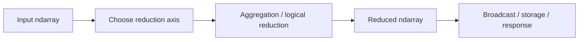

# 14- Dimension Reduction

## Overview

Dimension reduction removes one or more axes from an `ndarray` by aggregating values or otherwise collapsing a dimension.

In NumPy, the most common form of dimension reduction is a **reduction operation** such as:

```python
sum()
mean()
min()
max()
median()
std()
any()
all()
```

These operations typically reduce one or more axes into a smaller representation.

The key distinction is:

```text
Dimension expansion
→ adds size-one axes

Dimension reduction
→ removes axes through aggregation or logical reduction
```

Dimension reduction is fundamental to backend and data-engineering workloads because large numerical datasets frequently need to become smaller summaries:

```text
records × features
        ↓
aggregate across records
        ↓
features
```



The engineering challenge is selecting the correct axis, understanding the resulting shape, handling missing or invalid data, and avoiding unnecessary intermediate allocations.

## What Dimension Reduction Means

Consider:

```python
import numpy as np

values = np.array(
    [
        [10.0, 20.0, 30.0],
        [40.0, 50.0, 60.0],
    ]
)
```

The shape is:

```text
(2, 3)
```

Suppose:

```text
axis 0 → records
axis 1 → metrics
```

Reducing axis 0:

```python
result = values.mean(axis=0)
```

produces:

```text
[25. 35. 45.]
```

The shape becomes:

```text
(3,)
```

The record dimension has been reduced, leaving one value per metric.

## Why Reduction Exists

Backend systems frequently need summary information rather than every raw value.

Typical examples include:

- Average latency per service.
- Total revenue per batch.
- Minimum and maximum sensor values.
- Number of valid records.
- Error counts.
- Per-feature statistics.
- Per-window summaries.
- Boolean validation results.

A reduction converts:

```text
large detailed dataset
```

into:

```text
compact aggregate representation
```

This can reduce memory requirements for downstream processing and persistence.

## Common Reduction Operations

| Operation | Purpose | Typical result |
|---|---|---|
| `sum()` | Total | Numeric aggregate |
| `mean()` | Average | Numeric aggregate |
| `median()` | Middle value | Numeric aggregate |
| `min()` | Lowest value | Numeric aggregate |
| `max()` | Highest value | Numeric aggregate |
| `std()` | Standard deviation | Numeric aggregate |
| `var()` | Variance | Numeric aggregate |
| `any()` | Any condition is true | Boolean |
| `all()` | Every condition is true | Boolean |
| `count_nonzero()` | Count non-zero values | Integer |

The important concept is not the API list but the relationship between:

```text
input shape
→ reduction axis
→ output shape
```

## Reducing Along `axis=0`

For:

```python
import numpy as np

metrics = np.array(
    [
        [100.0, 20.0, 30.0],
        [110.0, 25.0, 28.0],
        [105.0, 22.0, 31.0],
    ]
)
```

Reducing across rows:

```python
mean = metrics.mean(axis=0)
```

produces one result per column:

```text
[105.0, 22.333..., 29.666...]
```

Shape:

```text
(3, 3)
→
(3,)
```

If:

```text
axis 0 → records
axis 1 → features
```

then:

```text
mean(axis=0)
→ per-feature mean
```

## Reducing Along `axis=1`

```python
record_mean = metrics.mean(axis=1)
```

produces:

```text
[
    50.0,
    54.333...,
    52.666...
]
```

Shape:

```text
(3, 3)
→
(3,)
```

Now the interpretation is:

```text
mean(axis=1)
→ one aggregate per record
```

The output shape is identical to the previous example, but the semantics are different.

This is why shape alone is not enough to validate numerical correctness.

## Reduction with `axis=None`

When `axis=None` is used, the operation reduces across all elements.

```python
import numpy as np

values = np.array(
    [
        [10, 20],
        [30, 40],
    ]
)

result = values.sum(axis=None)

print(result)
# 100
```

The result is scalar-like:

```text
(2, 2)
→
single value
```

This is useful for global statistics:

```text
total dataset sum
global minimum
global maximum
```

Use it only when collapsing all dimensions is actually intended.

## Multiple-Axis Reduction

Several reductions can operate on more than one axis.

Suppose:

```python
import numpy as np

data = np.empty(
    (32, 1440, 8),
    dtype=np.float32,
)
```

with:

```text
axis 0 → batch
axis 1 → timestamp
axis 2 → metric
```

To reduce across timestamp and metric:

```python
result = data.mean(
    axis=(1, 2),
)
```

The shape becomes:

```text
(32, 1440, 8)
→
(32,)
```

This produces one value per batch.

The operation is conceptually:

```text
batch
  ↓
aggregate all timestamps and metrics
  ↓
one aggregate per batch
```

## Reduction and `keepdims=True`

By default, reduced axes are removed.

```python
mean = values.mean(axis=0)

print(mean.shape)
# (3,)
```

Using:

```python
mean = values.mean(
    axis=0,
    keepdims=True,
)
```

preserves the reduced dimension:

```text
(3, 3)
→
(1, 3)
```

This is useful when the result will later be broadcast back against the original array.

## Why `keepdims` Matters

A common numerical pipeline is:

```text
records
   ↓
calculate per-feature mean
   ↓
subtract mean from every record
```

Write it as:

```python
means = records.mean(
    axis=0,
    keepdims=True,
)

centered = records - means
```

Shapes:

```text
records → (batch, features)
means   → (1, features)
```

Broadcasting can then operate naturally.

Without `keepdims`:

```python
means = records.mean(axis=0)
```

the result is:

```text
(features,)
```

which may still broadcast correctly, but `keepdims=True` makes the preserved axis explicit and provides more stable shape semantics in generic multi-dimensional functions.

## `keepdims` vs Dimension Expansion

These can produce equivalent shapes:

```python
mean = records.mean(
    axis=0,
    keepdims=True,
)
```

and:

```python
mean = np.expand_dims(
    records.mean(axis=0),
    axis=0,
)
```

When the shape is created by a reduction, prefer `keepdims=True` because it expresses the intent at the reduction site.

Use `expand_dims()` when the dimension adjustment is an independent shape operation.

## Sum

`sum()` is commonly used for totals and counters.

```python
import numpy as np

revenue = np.array(
    [
        [100.0, 200.0],
        [150.0, 250.0],
        [120.0, 180.0],
    ]
)

per_channel = revenue.sum(axis=0)

print(per_channel)
# [370. 630.]
```

For backend workloads, this can represent:

```text
axis 0 → transactions
axis 1 → revenue channels
```

The result gives one total per channel.

## Mean

`mean()` computes the arithmetic average:

```python
average = revenue.mean(axis=0)
```

Use it when every value should contribute equally.

Be careful with missing values:

```python
np.mean(...)
```

can propagate `NaN` values.

For data containing `NaN`, use:

```python
np.nanmean(...)
```

when ignoring missing values is the intended business rule.

Do not silently substitute `nanmean()` for `mean()` without documenting the missing-data policy.

## Median

`median()` is useful when outliers make the mean misleading.

```python
latency = np.array(
    [
        [100.0, 120.0],
        [110.0, 115.0],
        [5000.0, 130.0],
    ]
)

median = np.median(
    latency,
    axis=0,
)
```

For backend observability data, median latency may be useful for understanding typical behavior, although production SLO analysis often requires additional percentile statistics.

The important point here is that reduction choice represents a business/statistical decision, not just a NumPy API choice.

## Minimum and Maximum

```python
minimum = values.min(axis=0)
maximum = values.max(axis=0)
```

These operations are useful for:

- Range validation.
- Monitoring.
- Data-quality checks.
- Threshold analysis.
- Batch diagnostics.

For example:

```python
min_values = records.min(
    axis=0,
    keepdims=True,
)

max_values = records.max(
    axis=0,
    keepdims=True,
)
```

This produces one row of feature-wise boundaries.

## Standard Deviation and Variance

Statistical reductions can summarize variability:

```python
std = records.std(
    axis=0,
)

variance = records.var(
    axis=0,
)
```

The axis still defines what population is being summarized.

For example:

```text
records × features

std(axis=0)
→ variability of each feature across records
```

Do not treat statistical reduction semantics as independent from data modeling.

## Boolean Reductions

`any()` and `all()` reduce boolean arrays.

```python
import numpy as np

valid = np.array(
    [
        [True, True, True],
        [True, False, True],
        [True, True, True],
    ]
)

row_valid = valid.all(axis=1)

print(row_valid)
# [ True False  True]
```

This is useful for validation pipelines:

```text
feature-level validation
    ↓
all(axis=1)
    ↓
record-level validity
```

Similarly:

```python
has_error = (~valid).any(axis=1)
```

can identify records containing at least one invalid field.

## Counting with `count_nonzero()`

For boolean or indicator arrays:

```python
count = np.count_nonzero(
    valid,
    axis=0,
)
```

This can produce counts per feature.

For example:

```text
valid.shape = (batch, features)

count_nonzero(valid, axis=0)
→ valid record count per feature
```

This is often useful in data-quality monitoring.

## NaN-Aware Reductions

Missing numerical values require an explicit policy.

Consider:

```python
import numpy as np

values = np.array(
    [
        [10.0, 20.0],
        [np.nan, 30.0],
        [15.0, 25.0],
    ]
)
```

Normal mean:

```python
result = values.mean(axis=0)
```

can produce `NaN` for affected dimensions.

NaN-aware mean:

```python
result = np.nanmean(
    values,
    axis=0,
)
```

ignores `NaN` values.

Related APIs include:

```python
np.nansum()
np.nanmean()
np.nanmedian()
np.nanmin()
np.nanmax()
np.nanstd()
np.nanvar()
```

The production decision is:

```text
Does NaN mean "ignore this observation"?
```

If yes, use an appropriate NaN-aware reduction.

If no, explicit validation or rejection may be safer.

## Empty Slices and Warning Conditions

NaN-aware reductions can encounter empty effective slices.

For example, a feature containing only `NaN` values may not have a defined `nanmean`.

```python
import numpy as np

values = np.array(
    [
        [np.nan, 10.0],
        [np.nan, 20.0],
    ]
)

result = np.nanmean(
    values,
    axis=0,
)
```

The first output position has no valid observations.

Production code should define what should happen in such cases:

- Reject the batch.
- Produce a sentinel value.
- Preserve `NaN`.
- Emit a metric.
- Apply a domain-specific default.

Do not let warnings and undefined aggregates become operational surprises.

## Reduction and Integer Types

Integer reductions can have dtype-specific accumulation behavior.

For example:

```python
import numpy as np

values = np.array(
    [1, 2, 3],
    dtype=np.int32,
)

result = values.sum()
```

The accumulator dtype may differ from the input dtype depending on the platform and operation.

For large integer totals, be deliberate about overflow and output dtype.

When money-like or counter-like values can exceed fixed-width integer ranges, validate the expected magnitude and choose a suitable representation.

## Dtype and Floating-Point Reductions

For floating-point data:

```python
values = np.array(
    ...,
    dtype=np.float32,
)
```

reductions such as `mean()` and `std()` have numerical precision considerations.

There is a trade-off:

```text
float32
→ less memory
→ lower precision

float64
→ more memory
→ higher precision
```

Do not automatically convert every dataset to `float64`. Choose dtype according to the accuracy requirements and benchmark the workload.

## Reduction and `where=`

Many reductions can use a condition to include only selected values.

```python
import numpy as np

values = np.array(
    [
        [10.0, 20.0],
        [30.0, 40.0],
    ]
)

result = np.sum(
    values,
    axis=0,
    where=values > 15,
)
```

This separates:

```text
selection condition
+
aggregation axis
```

and can be useful when a temporary masked copy would otherwise be unnecessary.

The exact support and semantics depend on the reduction being used, so production code should use it where it improves clarity and memory behavior.

## Reduction and `out=`

Some reduction functions support an output buffer.

For example:

```python
import numpy as np

values = np.empty(
    (100_000, 8),
    dtype=np.float32,
)

result = np.empty(
    8,
    dtype=np.float32,
)

np.sum(
    values,
    axis=0,
    out=result,
)
```

This can make allocation behavior explicit and reduce repeated allocations in reusable processing loops.

Use it when profiling shows allocation pressure and the ownership model remains clear.

## Reduction and Broadcasting

Dimension reduction frequently feeds dimension expansion or broadcasting.

The common pattern is:

```text
Input:
(batch, features)

Reduce:
mean(axis=0, keepdims=True)

Result:
(1, features)

Broadcast:
original - mean
```

Example:

```python
import numpy as np


def center_features(
    records: np.ndarray,
) -> np.ndarray:
    mean = records.mean(
        axis=0,
        keepdims=True,
    )

    return records - mean
```

This is a central NumPy processing pattern.

## Reduction and Batch Processing

For large datasets, reductions should often be performed per batch.

Instead of:

```text
10 GB dataset
    ↓
load entire dataset
    ↓
global mean
```

use:

```text
batch 1 → partial statistics
batch 2 → partial statistics
batch 3 → partial statistics
...
```

However, some statistics cannot be combined by simply averaging batch-level statistics.

For example:

```text
mean of means
```

is only correct under appropriate equal-weight conditions.

A production pipeline should use mathematically correct incremental aggregation rather than assuming every reduction can be merged naively.

## Batch Aggregation Example

For simple totals and counts:

```python
import numpy as np


def batch_sum_and_count(
    values: np.ndarray,
) -> tuple[np.ndarray, np.ndarray]:
    return (
        values.sum(axis=0),
        np.full(
            values.shape[1],
            values.shape[0],
            dtype=np.int64,
        ),
    )
```

Multiple batches can then be combined:

```text
global sum
= sum of batch sums

global count
= sum of batch counts
```

and:

```text
global mean
= global sum / global count
```

This pattern is memory-efficient and mathematically valid.

## Reduction of Large Files

A memory-mapped or chunked dataset can be reduced batch by batch:

```python
import numpy as np


def aggregate_file(
    values: np.ndarray,
    batch_size: int,
) -> tuple[np.ndarray, np.ndarray]:
    total = np.zeros(
        values.shape[1],
        dtype=np.float64,
    )

    count = 0

    for start in range(
        0,
        values.shape[0],
        batch_size,
    ):
        batch = values[start:start + batch_size]

        total += batch.sum(
            axis=0,
            dtype=np.float64,
        )

        count += batch.shape[0]

    return total, np.array(
        count,
        dtype=np.int64,
    )
```

The implementation illustrates an important production principle:

```text
Read bounded batch
→ reduce immediately
→ retain compact state
→ release batch
```

This prevents the entire dataset from needing to remain in memory.

## Reduction and PostgreSQL

Many reductions map naturally to SQL:

```text
NumPy:
sum
mean
min
max
```

can correspond to:

```sql
SUM()
AVG()
MIN()
MAX()
```

For relational datasets, perform the reduction in PostgreSQL when that reduces data transfer and the database is the appropriate processing layer.

Use NumPy when:

- The data must already be in Python.
- The operation is part of a larger numerical transformation.
- The calculation is not naturally expressed in SQL.
- The data source is a file or numerical buffer.

The engineering principle is:

```text
Reduce data as close to the source as practical.
```

## Reduction and Pandas

Pandas provides labeled aggregation over tabular data.

For example:

```python
column_means = frame.mean(numeric_only=True)
```

may be more appropriate than:

```python
values = frame.to_numpy()
values.mean(axis=0)
```

when the labels themselves matter.

NumPy becomes preferable when the workload has moved into dense numerical processing.

Avoid converting to NumPy simply to perform a reduction that Pandas already expresses clearly with semantic labels.

## Reduction and REST APIs

Large raw numerical arrays should rarely be returned directly from an API just to let a client calculate aggregates.

A better service pattern is often:

```text
Database / file
      ↓
bounded numerical processing
      ↓
aggregation
      ↓
compact response
```

For example:

```text
1,000,000 telemetry points
        ↓
per-service means
        ↓
20 values
        ↓
JSON response
```

The reduction itself can dramatically reduce response size and network cost.

## Reduction in FastAPI and Celery

For a FastAPI endpoint:

```text
request
  ↓
validate
  ↓
NumPy array
  ↓
reduce
  ↓
compact response
```

For Celery:

```text
large input
  ↓
worker batches
  ↓
partial reductions
  ↓
compact aggregate
  ↓
persist
```

Do not return or transmit huge intermediate arrays if only aggregate results are needed downstream.

## Reduction and Kafka

Kafka consumers can maintain compact aggregation state over windows:

```text
records
   ↓
batch
   ↓
NumPy reduction
   ↓
window state
   ↓
next batch
```

For example:

```text
sum
count
min
max
```

can often be updated incrementally.

This avoids retaining all raw records for the entire processing window.

## Performance Considerations

Reduction operations are generally linear in the number of processed elements:

```text
O(N)
```

for a straightforward reduction.

The actual runtime depends on:

- Dtype.
- Memory layout.
- Axis.
- Contiguity.
- CPU vectorization.
- Memory bandwidth.
- Threading behavior of the underlying build and operation.

The main optimization opportunities are often:

```text
avoid unnecessary copies
process contiguous data when useful
choose appropriate dtype
reduce early
process bounded batches
reuse output buffers when appropriate
```

Do not assume reducing a smaller number of axes is always cheaper if it still processes the same total number of elements.

## Reduction Order and Memory Access

Consider:

```python
values.shape == (100_000, 8)
```

Reducing:

```python
values.sum(axis=0)
```

and:

```python
values.sum(axis=1)
```

both process the full array, but they produce different shapes and may have different access characteristics depending on layout and implementation.

Correctness comes first:

```text
Which dimension should be aggregated?
```

Then optimize based on measurement.

Do not change the reduction axis merely because one operation appears faster without preserving the intended semantics.

## Numerical Stability

Some reductions accumulate floating-point error.

For large numerical datasets, the result can depend on:

- Input dtype.
- Magnitude differences.
- Accumulation order.
- Number of elements.

For ordinary `float32` workloads, converting accumulation to `float64` can sometimes improve numerical robustness:

```python
total = values.sum(
    axis=0,
    dtype=np.float64,
)
```

This trades additional computation and larger accumulator storage for improved numerical precision.

For high-integrity financial or scientific calculations, define numerical-accuracy requirements explicitly rather than relying on default dtype behavior.

## Reduction and NaN Policy

A production data pipeline should define:

```text
What does NaN mean?
```

Possible policies include:

```text
reject batch
ignore missing values
propagate NaN
replace with domain default
track invalid observations separately
```

For example:

```python
valid = np.isfinite(values)

valid_count = valid.sum(axis=0)
```

and:

```python
safe_mean = np.nanmean(
    values,
    axis=0,
)
```

can be combined to track both the aggregate and its data-quality coverage.

This is more operationally useful than calculating an aggregate without knowing how much valid data contributed to it.

## Common Mistakes

### Reducing Along the Wrong Axis

A correct NumPy expression can still calculate the wrong business metric.

Always document axis semantics before choosing the reduction axis.

### Ignoring `keepdims`

Removing a dimension can make downstream broadcasting less explicit.

Use `keepdims=True` when preserving dimensional alignment matters.

### Averaging Batch Means Naively

If batches have different sizes:

```text
mean(mean(batch1), mean(batch2))
```

is not generally the same as the global mean.

Aggregate counts and sums instead.

### Ignoring NaN Values

A single `NaN` can affect ordinary reductions.

Define an explicit missing-data policy.

### Assuming Reduction Means One Scalar

`axis=0` or `axis=1` usually produces an array, not a scalar.

The output shape should be part of the function contract.

### Reducing Huge Data After Loading Everything

If the final output is compact, reduce incrementally rather than materializing the complete dataset in memory.

### Assuming Smaller Dtype Means Identical Numerical Behavior

`float32` can reduce memory but may reduce precision.

Choose dtype based on numerical requirements.

### Replacing SQL Aggregation with NumPy Unnecessarily

If PostgreSQL can efficiently aggregate before data transfer, doing the entire aggregation in Python can increase network and memory costs.

## Testing Dimension Reduction

Test both output values and output shape.

```python
import numpy as np


def test_feature_mean():
    values = np.array(
        [
            [10.0, 20.0],
            [30.0, 40.0],
            [50.0, 60.0],
        ]
    )

    result = values.mean(
        axis=0,
    )

    assert result.shape == (2,)

    np.testing.assert_allclose(
        result,
        np.array([30.0, 40.0]),
    )
```

Test row-wise reduction:

```python
def test_record_mean():
    values = np.array(
        [
            [10.0, 20.0],
            [30.0, 40.0],
            [50.0, 60.0],
        ]
    )

    result = values.mean(
        axis=1,
    )

    assert result.shape == (3,)

    np.testing.assert_allclose(
        result,
        np.array([15.0, 35.0, 55.0]),
    )
```

Test `keepdims`:

```python
def test_keepdims():
    values = np.ones((5, 3))

    result = values.mean(
        axis=0,
        keepdims=True,
    )

    assert result.shape == (1, 3)
```

For production numerical code, also test:

- Empty inputs where applicable.
- NaN-containing inputs.
- Infinite values.
- Integer and floating dtypes.
- Large batches.
- Multiple-axis reductions.
- Output dtype expectations.
- Incremental versus whole-dataset aggregation.

## Debugging Reduction Problems

Inspect the input shape first:

```python
print("shape:", values.shape)
print("ndim:", values.ndim)
print("dtype:", values.dtype)
```

Then write:

```text
axis 0 → ?
axis 1 → ?
axis 2 → ?
```

Before executing the reduction, predict:

```text
input shape
→ removed axes
→ expected output shape
```

For example:

```text
Input:
(batch, features)

mean(axis=0):
(features,)

mean(axis=1):
(batch,)

mean(axis=0, keepdims=True):
(1, features)
```

If the predicted shape does not match the code's output shape, the operation deserves review.

## Interview Questions

### What is dimension reduction in NumPy?

It is an operation that collapses one or more array dimensions, usually through aggregation or logical reduction.

### What happens to the selected axis during a normal reduction?

The axis is removed from the result shape.

### What does `keepdims=True` do?

It keeps the reduced axis as a dimension of size `1`, making the result easier to broadcast against the original array.

### What is the difference between `mean(axis=0)` and `mean(axis=1)`?

They reduce different dimensions. For `(records, features)`, `axis=0` produces per-feature statistics and `axis=1` produces per-record statistics.

### What does `axis=None` do?

It reduces across all elements of the array.

### Why can averaging batch means be wrong?

If batches have different numbers of observations, each batch mean has a different statistical weight. Combining sums and counts is safer for a global mean.

### How would you reduce a dataset that does not fit comfortably in memory?

Process it in bounded batches and maintain a compact aggregation state such as sum, count, minimum, and maximum.

### How do NaN-aware reductions differ from ordinary reductions?

NaN-aware functions can ignore `NaN` values according to their defined semantics, while ordinary reductions can propagate `NaN`.

### When should a reduction happen in PostgreSQL instead of NumPy?

When the data is relational and the database can perform the aggregation efficiently before transferring the data to the application.

### How can reduction improve backend performance?

It can transform a large numerical dataset into a compact representation early, reducing memory, network transfer, serialization, and downstream processing costs.

## Key Takeaways

- Dimension reduction collapses one or more axes through operations such as `sum`, `mean`, `min`, `max`, `median`, `any`, and `all`.
- The reduction axis is a semantic decision: for `(batch, features)`, reducing `axis=0` and `axis=1` answers different business questions even when both return one-dimensional arrays.
- `keepdims=True` preserves reduced axes as size-one dimensions and is especially useful when the result will be broadcast back against the original data.
- Large datasets should be reduced as early as practical and, when necessary, in bounded batches using mathematically correct incremental aggregation rather than loading the entire dataset into memory.
- Production reductions require explicit policies for dtype, missing values, numerical precision, shape contracts, and the appropriate execution layer such as NumPy, Pandas, or PostgreSQL.