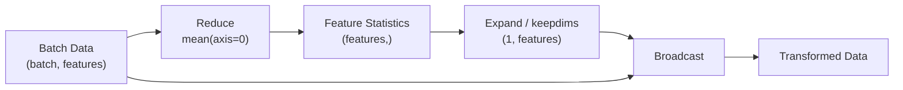

# README

## Overview

Array manipulation in NumPy is the process of changing an array's shape, dimensions, axis structure, ordering, or partitioning without changing the underlying numerical meaning unless the operation explicitly modifies the data.

These operations are central to backend and data-processing workflows because numerical data rarely arrives in exactly the shape required by the next stage of a pipeline.

Common transformations include:

```text
Input data
    ↓
reshape / transpose
    ↓
dimension alignment
    ↓
concatenate / stack
    ↓
partition / split
    ↓
broadcast / expand
    ↓
reduce
    ↓
processed numerical data
```

This section focuses on understanding **shape semantics, axis behavior, allocation, views versus copies, broadcasting, and memory implications**, rather than memorizing individual APIs.

## Navigation

| # | File | Description |
|---|---|---|
| 01 | [01- Reshape](./01-%20Reshape.md) | Change array shape while preserving element count |
| 02 | [02- Resize](./02-%20Resize.md) | Grow or shrink arrays and understand mutation and allocation behavior |
| 03 | [03- Flatten and Ravel](./03-%20Flatten%20and%20Ravel.md) | Convert arrays to one dimension, copy vs view behavior |
| 04 | [04- Transpose](./04-%20Transpose.md) | Reorder dimensions and understand strides and memory layout |
| 05 | [05- Axes](./05-%20Axes.md) | Reason about dimensions, axis semantics, and axis-dependent operations |
| 06 | [06- Concatenate](./06-%20Concatenate.md) | Join arrays along an existing axis |
| 07 | [07- Stack](./07-%20Stack.md) | Combine arrays while introducing a new dimension |
| 08 | [08- Split](./08-%20Split.md) | Partition arrays into smaller arrays along an axis |
| 09 | [09- Repeat and Tile](./09-%20Repeat%20and%20Tile.md) | Replicate elements or complete array patterns |
| 10 | [10- Insert and Delete](./10-%20Insert%20and%20Delete.md) | Add or remove values along an axis and understand allocation costs |
| 11 | [11- Append](./11-%20Append.md) | Extend arrays and understand why repeated appends are inefficient |
| 12 | [12- Broadcasting](./12-%20Broadcasting.md) | Perform operations across compatible shapes without explicitly copying data |
| 13 | [13- Dimension Expansion](./13-%20Dimension%20Expansion.md) | Add size-one dimensions for alignment and broadcasting |
| 14 | [14- Dimension Reduction](./14-%20Dimension%20Reduction.md) | Collapse one or more axes through aggregation or logical reduction |


## Core Concepts

The folder is organized around a small set of concepts that should be understood together.

### Shape Transformation

Operations such as:

```python
reshape()
resize()
flatten()
ravel()
transpose()
```

change how data is represented or accessed.

The critical questions are:

- Does the operation preserve the number of elements?
- Does it return a view or allocate new memory?
- Does it mutate the original array?
- Does it change memory contiguity?
- Can the operation affect subsequent performance?

### Axis Manipulation

Axes describe the semantic structure of multidimensional arrays.

For example:

```text
(batch, timestamp, feature)
```

may represent:

```text
axis 0 → batch
axis 1 → timestamp
axis 2 → feature
```

Operations such as `transpose`, `concatenate`, `stack`, `split`, and reductions are meaningful only when the axis semantics are understood.

### Combination and Partitioning

Arrays may need to be combined or divided during batch processing:

```text
multiple batches
     ↓
concatenate / stack
     ↓
larger array
```

or:

```text
large array
     ↓
split
     ↓
bounded processing batches
```

These operations often allocate memory, so repeated manipulation of large arrays can become expensive.

### Broadcasting and Dimension Alignment

Broadcasting allows compatible arrays with different shapes to participate in the same vectorized operation.

For example:

```python
import numpy as np

records = np.empty((10_000, 8), dtype=np.float32)
mean = records.mean(axis=0, keepdims=True)

centered = records - mean
```

The key idea is:

```text
(10_000, 8)
(1, 8)
─────────
(10_000, 8)
```

No explicit replication of the mean across all rows is required.

### Dimension Expansion and Reduction

Two complementary operations are:

```text
Dimension expansion
→ (features,) → (1, features)

Dimension reduction
→ (batch, features) → (features,)
```

They frequently appear together in numerical pipelines:



## Shape Reasoning

Before manipulating an array, establish the shape contract.

For example:

```text
(batch, features)
(batch, timestamp, features)
(batch, channel, metric)
```

Then determine:

```text
Which axis is being changed?
Does the operation add or remove an axis?
Will the output be a view or a copy?
What should the final shape be?
```

A useful engineering habit is to predict the shape before running the operation.

```python
print(values.shape)
print(values.ndim)
print(values.dtype)
```

For generic processing functions, shape should be treated as part of the function contract rather than an incidental property.

## Views, Copies, and Memory

Array manipulation frequently changes how data is interpreted without moving the underlying buffer.

Typical behavior:

| Operation | Typical Memory Behavior |
|---|---|
| Basic slicing | Often returns a view |
| `reshape()` | View when compatible, otherwise may copy |
| `ravel()` | View when possible, otherwise may copy |
| `flatten()` | Always returns a copy |
| `transpose()` | Typically returns a view with changed strides |
| `concatenate()` | Allocates a new array |
| `stack()` | Allocates a new array |
| `split()` | Typically returns views for standard splitting |
| `repeat()` | Allocates output |
| `tile()` | Allocates output |
| `insert()` | Allocates a new array |
| `delete()` | Allocates a new array |
| `append()` | Allocates a new array |

The exact behavior should be verified for the specific operation and input layout rather than inferred only from the API name.

Useful diagnostics include:

```python
values.nbytes
values.itemsize
values.flags
np.shares_memory(a, b)
```

Remember that `nbytes` describes the array's data buffer, not the Python process's total resident memory.

## Production Processing Pattern

A typical numerical backend pipeline may look like:

```text
Database / API / File
        ↓
Input validation
        ↓
NumPy array construction
        ↓
Shape normalization
        ↓
Axis alignment
        ↓
Vectorized transformation
        ↓
Aggregation / reduction
        ↓
Batch output
        ↓
Storage / API response
```

For large datasets, avoid unnecessary materialization:

```text
large input
   ↓
bounded batch
   ↓
transform
   ↓
reduce
   ↓
persist compact result
```

This limits peak memory usage and can improve operational stability.

## Performance Considerations

Array manipulation performance is influenced by more than the number of Python statements.

Important factors include:

- Allocation and copying.
- Contiguous versus non-contiguous memory.
- Strides and access patterns.
- Dtype size.
- Temporary arrays.
- Broadcasting behavior.
- Repeated concatenation or append operations.
- Batch size.

For example, this pattern is usually inefficient:

```python
result = np.empty(0, dtype=np.float64)

for batch in batches:
    result = np.append(result, batch)
```

Every append may allocate and copy a larger array.

Prefer accumulating batches in a Python list and concatenating once when the final size is known:

```python
parts = []

for batch in batches:
    parts.append(batch)

result = np.concatenate(parts)
```

For very large datasets, avoid concatenating everything when downstream processing can consume batches directly.

## Backend and Data Engineering Usage

Array manipulation becomes useful when integrating NumPy with:

- REST or gRPC numerical payloads.
- PostgreSQL query results.
- Kafka consumer batches.
- Celery background jobs.
- File-based numerical datasets.
- Pandas ETL pipelines.
- Memory-mapped arrays.
- Batch-oriented processing systems.

A common architecture is:


The key design principle is to use NumPy where dense numerical processing provides a meaningful advantage rather than forcing every backend transformation into an array representation.

## NumPy and Pandas

NumPy is strongest when the workload is primarily numerical and array-oriented.

Pandas is generally more appropriate when the workflow depends heavily on:

- Column names.
- Row labels.
- Heterogeneous columns.
- Joins.
- Grouping.
- Missing-data handling across tabular structures.
- CSV, JSON, and database-oriented table processing.

A common boundary is:

```text
Data source
    ↓
Pandas for tabular preparation
    ↓
NumPy for dense numerical transformation
    ↓
Pandas / storage / API
```

Avoid converting repeatedly between representations without a clear reason because conversions may allocate memory and increase processing cost.

## Common Mistakes

### Treating Every Shape Change as Free

Some operations only modify metadata, while others allocate and copy the entire array.

### Ignoring Axis Semantics

A syntactically valid operation can still calculate the wrong result if the wrong axis is selected.

### Repeatedly Appending to Arrays

NumPy arrays are not optimized for repeated dynamic growth. Prefer preallocation, list accumulation, or batch-oriented processing.

### Confusing Broadcasting with Replication

Broadcasting can avoid explicitly creating repeated data, while `repeat()` and `tile()` materialize output arrays.

### Ignoring Non-Contiguous Arrays

Transposing or slicing can produce non-contiguous arrays. Some later operations may require additional copying to obtain an appropriate memory layout.

### Assuming Views Are Always Safe

A view shares underlying memory. Mutating a view can modify the source array.

### Loading Entire Datasets Before Manipulation

For large files or event streams, process bounded batches whenever the workload permits it.

## Practical Review Checklist

When reviewing NumPy array-manipulation code, ask:

1. What does each axis represent?
2. What is the expected input and output shape?
3. Does the operation create a view or a copy?
4. Does it allocate a large temporary array?
5. Could broadcasting replace explicit replication?
6. Could repeated concatenation or append be avoided?
7. Is the dtype appropriate for memory and numerical precision?
8. Would the operation scale to the expected batch size?
9. Should the transformation happen in SQL or Pandas instead?
10. Is the resulting array contiguous when downstream code requires it?

## Related Projects

The concepts in this section support the practical NumPy projects in the separate `py-data-sandbox` repository:

| Project | Relevant Skills |
|---|---|
| Numerical Data Processor | Shape normalization, masking, reduction, validation, batch processing |
| Vectorized Data Transformation | Broadcasting, dimension manipulation, vectorization, memory awareness |
| Performance Benchmarking | Allocation costs, contiguous memory, copies, dtype size, vectorized operations |

Runnable implementation belongs in `py-data-sandbox`; this playbook provides the conceptual and engineering reference required to build those systems correctly.

## Key Takeaways

- Array manipulation is fundamentally about controlling shape, axes, memory layout, and data movement in `ndarray` workflows.
- Always reason about axis semantics and expected shapes before applying transformations such as `reshape`, `transpose`, `stack`, `split`, or broadcasting.
- Understand when an operation returns a view versus allocating a copy because unnecessary memory movement can dominate large numerical workloads.
- Prefer vectorized, batch-oriented transformations and avoid repeated array growth through `append`, `insert`, or repeated concatenation.
- Use NumPy as a dense numerical processing layer alongside Python, Pandas, databases, APIs, and streaming systems rather than as a replacement for general-purpose data structures.