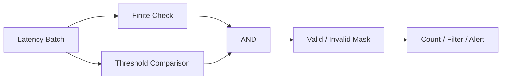

# 02- Comparison Operations

## Overview

NumPy comparison operations perform element-wise comparisons and produce boolean arrays that can be used for filtering, validation, conditional processing, and aggregation.

For backend and data-engineering workloads, comparison operations commonly sit between raw numerical input and business logic:

```text
Raw numerical data
       ↓
Validation
       ↓
Comparison / condition
       ↓
Boolean mask
       ↓
Filtering / selection / aggregation
```

Typical operations include:

```python
==
!=
<
<=
>
>=
```

as well as NumPy-specific helpers such as:

```python
np.equal()
np.not_equal()
np.less()
np.less_equal()
np.greater()
np.greater_equal()
np.isclose()
np.array_equal()
np.array_equiv()
```

The important engineering concerns are:

- Broadcasting.
- Boolean masks.
- Floating-point precision.
- `NaN` and infinity.
- Dtype behavior.
- Memory allocation from masks.
- Combining multiple conditions.
- Using comparisons safely at API and data-processing boundaries.

## Element-wise Comparisons

NumPy comparisons are normally element-wise.

```python
import numpy as np

latency_ms = np.array(
    [80.0, 120.0, 450.0, 95.0],
    dtype=np.float32,
)

slow = latency_ms > 200.0

print(slow)
# [False False  True False]
```

The result is a boolean array with the same shape as the input.

This is the foundation of NumPy filtering:

```text
values
  ↓
comparison
  ↓
boolean mask
  ↓
selected values
```

## Comparison Operators

| Operator | Meaning | NumPy equivalent |
|---|---|---|
| `==` | Equal | `np.equal()` |
| `!=` | Not equal | `np.not_equal()` |
| `<` | Less than | `np.less()` |
| `<=` | Less than or equal | `np.less_equal()` |
| `>` | Greater than | `np.greater()` |
| `>=` | Greater than or equal | `np.greater_equal()` |

Operator syntax is usually the clearest form:

```python
high_value = values >= threshold
```

The ufunc form is useful when you need features such as an explicit `out=` buffer or want to compose lower-level operations consistently.

## Scalar Comparisons

A scalar is compared against every element through broadcasting.

```python
import numpy as np

prices = np.array(
    [99.0, 120.0, 175.0, 80.0],
)

expensive = prices > 100.0
```

Result:

```text
[False, True, True, False]
```

This pattern is common for:

- Threshold checks.
- Range validation.
- Alert generation.
- Data quality rules.
- Feature filtering.

## Array-to-Array Comparisons

Two arrays can be compared when their shapes are broadcast-compatible.

```python
import numpy as np

observed = np.array(
    [101.0, 98.0, 104.0],
)

expected = np.array(
    [100.0, 100.0, 100.0],
)

within_upper_bound = observed <= expected + 5.0
```

Each corresponding value is evaluated independently.

This is useful for:

```text
actual vs expected
current vs previous
observed vs threshold
lower_bound vs value
```

## Broadcasting in Comparisons

Broadcasting applies to comparisons just as it does to arithmetic.

```python
import numpy as np

records = np.array(
    [
        [10.0, 20.0, 30.0],
        [12.0, 25.0, 28.0],
        [8.0, 21.0, 35.0],
    ],
)

thresholds = np.array(
    [10.0, 22.0, 32.0],
)

valid = records <= thresholds
```

Shapes:

```text
records    → (3, 3)
thresholds → (3,)
result     → (3, 3)
```

The comparison is performed independently for each feature.

This is especially useful when every metric has a different acceptable range.

## Building Boolean Masks

A boolean mask is a boolean `ndarray` aligned with the data it describes.

```python
import numpy as np

latency = np.array(
    [80, 120, 450, 95, 310],
)

mask = latency > 200

filtered = latency[mask]

print(filtered)
# [450 310]
```

The mask itself does not contain the filtered values:

```text
latency → data
mask    → selection rule
```

This separation is useful because the same mask can be reused for multiple aligned arrays.

## Masking Multiple Arrays

Consider:

```python
import numpy as np

request_id = np.array(
    [101, 102, 103, 104],
)

latency_ms = np.array(
    [120.0, 450.0, 80.0, 300.0],
)

status_code = np.array(
    [200, 500, 200, 503],
)

slow = latency_ms > 200
```

The same mask can select corresponding entries:

```python
slow_request_ids = request_id[slow]
slow_statuses = status_code[slow]
```

This works because the arrays share the same first dimension and therefore the same record alignment.

A production pipeline should preserve this alignment deliberately.

## Combining Conditions

Use bitwise operators for element-wise boolean logic:

```python
&   # AND
|   # OR
~   # NOT
```

For example:

```python
import numpy as np

latency = np.array(
    [80, 120, 450, 95, 310],
)

server_error = np.array(
    [False, False, True, False, True],
)

condition = (
    (latency > 200)
    & server_error
)
```

The resulting mask identifies requests that are both slow and server errors.

### Parentheses Are Required

Write:

```python
(latency > 200) & server_error
```

not:

```python
latency > 200 & server_error
```

Python operator precedence can otherwise produce an expression with different semantics or an error.

For NumPy boolean expressions, parenthesize each comparison.

## Logical NOT

Use `~` to invert boolean arrays:

```python
valid = latency <= 200
invalid = ~valid
```

For example:

```text
valid
→ [True, False, True]

~valid
→ [False, True, False]
```

This is useful for deriving exclusion masks without recalculating the underlying comparison.

## `np.logical_and`, `np.logical_or`, and `np.logical_not`

NumPy also provides explicit logical operations:

```python
np.logical_and(a, b)
np.logical_or(a, b)
np.logical_not(a)
```

These are useful when the boolean operation itself needs to be composed as an array operation or supplied with parameters such as `out=`.

For ordinary condition expressions:

```python
(mask_a & mask_b)
```

is usually easier to read.

## Multiple Conditions

A realistic data-quality rule might combine several conditions:

```python
import numpy as np

temperature = np.array(
    [22.0, 45.0, 18.0, 61.0],
)

pressure = np.array(
    [101.0, 98.0, 105.0, 110.0],
)

valid = (
    (temperature >= 15.0)
    & (temperature <= 50.0)
    & (pressure >= 95.0)
    & (pressure <= 108.0)
)
```

The resulting mask encodes a business rule:

```text
15 <= temperature <= 50
AND
95 <= pressure <= 108
```

For complex production rules, consider separating the individual masks:

```python
valid_temperature = (
    (temperature >= 15.0)
    & (temperature <= 50.0)
)

valid_pressure = (
    (pressure >= 95.0)
    & (pressure <= 108.0)
)

valid = (
    valid_temperature
    & valid_pressure
)
```

This improves debugging and observability.

## Filtering with Comparison Results

Boolean masks can directly select data:

```python
filtered = values[values > threshold]
```

This is compact and useful for one-off transformations.

For reusable production logic, naming the mask can make the rule easier to inspect:

```python
eligible = values >= minimum
filtered = values[eligible]
```

## Comparisons and `np.where`

Comparison results can drive conditional output:

```python
import numpy as np

latency = np.array(
    [80.0, 120.0, 450.0],
)

status = np.where(
    latency > 200.0,
    "slow",
    "normal",
)
```

This produces a new array containing the selected values.

`np.where` is useful when the requirement is:

```text
condition
→ choose value A
→ otherwise choose value B
```

For pure filtering, boolean indexing is usually simpler.

## `np.select` for Multiple Rules

When multiple mutually ordered conditions determine an output, `np.select()` can be clearer than deeply nested `np.where()` expressions.

```python
import numpy as np

latency = np.array(
    [50.0, 150.0, 350.0],
)

conditions = [
    latency < 100.0,
    latency < 300.0,
]

choices = [
    "healthy",
    "warning",
]

status = np.select(
    conditions,
    choices,
    default="critical",
)
```

The ordering matters because the first matching condition is selected.

For many business rules, however, a small Python function may be easier to maintain than a large array expression.

## Equality and Exact Matching

Integer equality is generally straightforward:

```python
import numpy as np

status = np.array(
    [200, 404, 500, 200],
)

success = status == 200
```

Floating-point equality deserves more care.

```python
import numpy as np

actual = np.array(
    [0.1 + 0.2],
)

expected = np.array(
    [0.3],
)

print(actual == expected)
```

A direct equality check can be false because binary floating-point arithmetic does not represent every decimal value exactly.

Use:

```python
np.isclose(actual, expected)
```

or:

```python
np.allclose(actual, expected)
```

depending on whether you need an element-wise mask or a single aggregate decision.

## `np.isclose`

`np.isclose()` compares values within configurable tolerances.

```python
import numpy as np

actual = np.array(
    [100.000001, 49.999999],
)

expected = np.array(
    [100.0, 50.0],
)

close = np.isclose(
    actual,
    expected,
    rtol=1e-5,
    atol=1e-8,
)
```

The comparison is approximately:

```text
absolute difference
+
relative tolerance
```

The exact tolerance policy should be chosen based on the data domain.

Do not blindly use a tolerance copied from another system.

## `np.allclose`

`np.allclose()` reduces the element-wise comparison to a single boolean:

```python
matches = np.allclose(
    actual,
    expected,
)
```

This is particularly useful for:

- Test assertions.
- Numerical regression checks.
- Comparing transformed datasets.
- Validating batch outputs.

Use `np.isclose()` when you need to know which elements differ.

Use `np.allclose()` when you only need an overall pass/fail result.

## Relative and Absolute Tolerance

Tolerance-based comparisons support two important concepts:

```text
absolute tolerance
→ useful near zero

relative tolerance
→ useful as values become larger
```

This is why a comparison such as:

```python
np.isclose(
    actual,
    expected,
    rtol=1e-5,
    atol=1e-8,
)
```

is generally more robust than checking whether:

```python
np.abs(actual - expected) < fixed_threshold
```

for values spanning multiple orders of magnitude.

The correct tolerance remains domain-specific.

## Comparing `NaN`

`NaN` has special comparison semantics.

```python
import numpy as np

value = np.nan

print(value == value)
# False
```

In NumPy:

```python
np.nan == np.nan
```

is also false.

To identify NaN values:

```python
mask = np.isnan(values)
```

To identify non-NaN values:

```python
mask = ~np.isnan(values)
```

Do not use equality against `np.nan` for missing-value detection.

## Comparing Infinity

Use:

```python
np.isinf(values)
```

to identify positive or negative infinity.

For a complete finite-value check:

```python
finite = np.isfinite(values)
```

This is often more useful at a validation boundary because it excludes both:

```text
NaN
+inf
-inf
```

## Comparison of Complex Numbers

Complex NumPy arrays support equality and inequality comparisons, but ordering comparisons such as:

```python
<
>
<=
>=
```

are not meaningful for complex numbers and are not supported in the same way as real-valued arrays.

For general backend numerical processing, explicitly validate that the dtype matches the comparison semantics your application expects.

## Dtype Considerations

Comparisons can involve different dtypes:

```python
import numpy as np

values = np.array(
    [1, 2, 3],
    dtype=np.int32,
)

mask = values > 1.5
```

The comparison is valid even though the operands have different types.

The main production concern is not usually the boolean result's dtype but the semantics of the comparison:

- Signed versus unsigned integers.
- Integer versus floating-point values.
- Large integer values converted or compared with floating-point types.
- Precision boundaries.
- Complex values.

Be deliberate when comparing values near the representable limits of their dtypes.

## Signed and Unsigned Integer Comparisons

Unsigned integers have no negative representation.

For example:

```python
import numpy as np

values = np.array(
    [0, 1, 2],
    dtype=np.uint8,
)

mask = values >= 0
```

This is straightforward, but mixed signed/unsigned arithmetic and comparison can become surprising when values approach dtype limits.

For production numerical pipelines, normalize dtypes before complex transformations when mixed integer types could affect correctness.

## Boolean Arrays as Data

Boolean arrays are themselves compact numerical-processing structures:

```python
mask = values > threshold
```

You can inspect how many values passed a condition:

```python
count = np.count_nonzero(mask)
```

or:

```python
count = mask.sum()
```

This is useful for:

- Validation metrics.
- Rejection counts.
- Alert thresholds.
- Data-quality monitoring.

For example:

```python
invalid_ratio = (
    np.count_nonzero(~valid)
    / valid.size
)
```

The resulting ratio can be emitted as an operational metric.

## `any()` and `all()`

Comparisons often feed reductions:

```python
violations = values > maximum

has_violation = np.any(violations)
```

or:

```python
all_valid = np.all(
    values >= minimum
)
```

Along an axis:

```python
row_valid = np.all(
    values >= minimum,
    axis=1,
)
```

This combines:

```text
comparison
+
dimension reduction
```

and is common in batch validation.

## Comparing Rows Against Per-Feature Bounds

A realistic validation pipeline may use lower and upper bounds:

```python
import numpy as np


def validate_records(
    records: np.ndarray,
    minimum: np.ndarray,
    maximum: np.ndarray,
) -> np.ndarray:
    return (
        np.all(
            records >= minimum,
            axis=1,
        )
        & np.all(
            records <= maximum,
            axis=1,
        )
    )
```

For:

```text
records  → (batch, features)
minimum  → (features,)
maximum  → (features,)
```

broadcasting performs per-feature validation.

The result is:

```text
(batch,)
```

where each boolean represents whether the entire record is within bounds.

## Memory Considerations

Boolean masks consume memory.

For a large array:

```text
100 million elements
```

creating several masks can materially increase peak memory.

For example:

```python
mask = (
    (values > lower)
    & (values < upper)
)
```

may require intermediate boolean arrays while the expression is evaluated.

Usually this is acceptable for moderate arrays, but high-volume pipelines should consider:

- Reusing masks when possible.
- Processing in batches.
- Reducing early.
- Avoiding unnecessary duplicate masks.
- Using operations with `out=` where appropriate.
- Measuring peak memory rather than assuming the mask is free.

The goal is to manage memory deliberately, not eliminate every allocation.

## Comparison Performance

Comparison operations are generally linear in the number of elements examined:

```text
O(N)
```

For dense arrays, NumPy can process comparisons efficiently at the lower level.

Performance still depends on:

- Array size.
- Dtype.
- Memory layout.
- CPU.
- Cache behavior.
- Number of temporary masks.
- Subsequent filtering and copying.

This is why:

```python
mask = values > threshold
```

is a good baseline, but large-scale optimization should be guided by measurement.

## Comparison vs Python Loops

A Python loop:

```python
result = []

for value in values:
    result.append(value > threshold)
```

performs repeated Python-level work.

The NumPy equivalent:

```python
result = values > threshold
```

delegates the element-wise operation to NumPy's array implementation.

This reduces Python loop overhead, but the resulting boolean mask still requires storage and the downstream filtering step may allocate another array.

Therefore:

```text
faster comparison
≠
zero-copy pipeline
```

CPU performance and memory efficiency remain separate concerns.

## In-Place and Output Buffers

Comparison ufuncs can use an output buffer:

```python
import numpy as np

values = np.array(
    [10.0, 20.0, 30.0],
)

mask = np.empty(
    values.shape,
    dtype=bool,
)

np.greater(
    values,
    15.0,
    out=mask,
)
```

This can be useful in high-throughput pipelines where repeated mask allocation is measurable.

It also makes ownership explicit:

```text
input array
+
output boolean buffer
```

As with all output-buffer patterns, keep the code simple unless allocation behavior justifies the added complexity.

## Backend Example: Request Validation

Suppose a batch contains request durations:

```python
import numpy as np


def validate_latencies(
    latency_ms: np.ndarray,
    maximum_ms: float,
) -> np.ndarray:
    finite = np.isfinite(latency_ms)
    within_limit = latency_ms <= maximum_ms

    return finite & within_limit
```

The validation flow is:



The function keeps numerical validation separate from higher-level business decisions.

## Backend Example: Selecting Eligible Records

For an ETL stage:

```python
import numpy as np


def select_eligible(
    amounts: np.ndarray,
    status_codes: np.ndarray,
) -> np.ndarray:
    valid_amount = (
        np.isfinite(amounts)
        & (amounts > 0)
    )

    successful = status_codes == 200

    return valid_amount & successful
```

The result can then select aligned records:

```python
mask = select_eligible(
    amounts,
    status_codes,
)

eligible_amounts = amounts[mask]
```

For a large pipeline, consider whether the filtering should happen earlier at the SQL or source-system layer.

## Comparison with PostgreSQL

Many comparisons map naturally to SQL:

```sql
WHERE amount > 100
  AND status_code = 200
```

If the source is PostgreSQL and the filter can be pushed into the query without changing the required semantics:

```text
database
  ↓
filter
  ↓
smaller result set
  ↓
NumPy
```

is often preferable to:

```text
database
  ↓
large result set
  ↓
NumPy filter
```

Database-side filtering can reduce:

- Network transfer.
- Application memory.
- Serialization work.
- Python-side processing.

NumPy is most appropriate when the data is already in the application or when the comparison is part of a larger numerical processing step.

## Comparison with Pandas

Pandas comparisons preserve tabular labels and integrate naturally with DataFrame filtering:

```python
eligible = frame[
    (frame["amount"] > 100)
    & (frame["status_code"] == 200)
]
```

NumPy becomes more appropriate when the data is already represented as dense numerical arrays and the workload is focused on numerical transformations.

Avoid converting a DataFrame to NumPy merely to perform a simple labeled comparison that Pandas already expresses clearly.

## Common Mistakes

### Using Python `and` and `or`

Do not write:

```python
(values > 10) and (values < 100)
```

Use:

```python
(values > 10) & (values < 100)
```

for element-wise boolean logic.

### Forgetting Parentheses

Write:

```python
(values > 10) & (values < 100)
```

rather than relying on operator precedence.

### Comparing Floating-Point Values with `==`

Use `np.isclose()` or `np.allclose()` when approximate numerical equality is intended.

### Comparing Against `np.nan`

This does not detect missing values:

```python
values == np.nan
```

Use:

```python
np.isnan(values)
```

### Creating Too Many Masks

Large boolean masks consume memory. Repeated complex conditions can increase peak memory substantially.

### Assuming Filtering Is Zero-Copy

The boolean mask is usually a compact representation of the selection, but applying boolean indexing generally creates a new array containing the selected values.

### Ignoring Shape Alignment

Comparisons use broadcasting. A comparison can execute successfully while applying the rule along an unintended dimension if the shapes are misunderstood.

### Filtering After Loading Unnecessary Data

If a database or upstream service can safely perform the same filter, pushing it closer to the source may reduce system cost.

### Mixing Business Rules into Dense Expressions

A highly compressed expression may be correct but difficult to debug.

For production code, separate meaningful validation masks when the rules are complex.

## Testing Comparison Logic

Comparison-heavy code should test both the mask and the resulting selected data.

```python
import numpy as np


def test_threshold_mask():
    values = np.array(
        [50.0, 100.0, 150.0],
    )

    result = values > 100.0

    np.testing.assert_array_equal(
        result,
        np.array(
            [False, False, True],
        ),
    )
```

Test floating-point comparison separately:

```python
def test_float_tolerance():
    actual = np.array(
        [0.1 + 0.2],
    )

    expected = np.array(
        [0.3],
    )

    assert np.allclose(
        actual,
        expected,
    )
```

Also test:

- `NaN`.
- Positive and negative infinity.
- Empty arrays where supported.
- Different dtypes.
- Broadcasting shapes.
- Boundary values.
- Multiple combined conditions.
- Very large batches.

## Debugging Comparison Problems

When a comparison produces unexpected results, inspect:

```python
print("shape:", values.shape)
print("dtype:", values.dtype)
print("min:", np.nanmin(values))
print("max:", np.nanmax(values))
```

Also inspect the intermediate masks:

```python
above_min = values >= minimum
below_max = values <= maximum

print("above_min:", above_min)
print("below_max:", below_max)
```

For complex validation logic, examining intermediate conditions is usually faster and safer than debugging one large boolean expression.

## Interview Questions

### What does `a > b` return for NumPy arrays?

It performs an element-wise comparison and returns a boolean array with the broadcast-compatible result shape.

### How do you combine multiple NumPy conditions?

Use element-wise operators such as `&`, `|`, and `~`, with each comparison enclosed in parentheses.

### Why can you not use Python `and` and `or` with NumPy arrays?

Python's `and` and `or` operate on scalar truth values, while NumPy comparisons usually produce arrays containing multiple boolean values.

### Why should floating-point values usually not be compared with `==`?

Floating-point representation and arithmetic can introduce small differences. Use `np.isclose()` or `np.allclose()` where approximate equality is intended.

### How do you detect NaN values?

Use:

```python
np.isnan(values)
```

rather than comparing against `np.nan`.

### What is the difference between `np.isclose()` and `np.allclose()`?

`np.isclose()` returns an element-wise boolean array, while `np.allclose()` reduces the comparison to a single boolean result.

### Does boolean filtering create a copy?

Boolean indexing generally creates a new array containing the selected elements rather than returning a view of the source.

### How would you validate a large numerical dataset efficiently?

Use vectorized comparisons, combine masks carefully, process large inputs in bounded batches when necessary, and reduce or aggregate validation results early.

### When should a comparison happen in PostgreSQL rather than NumPy?

When the database can safely perform the filter before transferring the data to the application, reducing network, memory, and application processing costs.

### What is the main memory concern with complex comparisons?

Each boolean mask and intermediate expression can consume additional memory, which becomes significant for very large arrays.

## Key Takeaways

- NumPy comparisons are element-wise operations that produce boolean arrays and form the basis of filtering, validation, and conditional processing.
- Use `&`, `|`, and `~` for element-wise boolean logic, and parenthesize individual comparison expressions.
- Use `np.isclose()` or `np.allclose()` for floating-point tolerance checks and `np.isnan()` / `np.isfinite()` for non-finite-value validation.
- Boolean masks are useful but consume memory, and applying boolean indexing generally creates a new selected array.
- For production pipelines, treat shape, dtype, memory usage, and the location of filtering—NumPy, Pandas, or the database—as explicit engineering decisions.