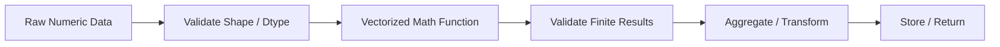

# 03- Mathematical Functions

## Overview

NumPy mathematical functions provide vectorized numerical transformations over `ndarray` objects. They cover common operations such as square roots, exponentials, logarithms, trigonometric functions, rounding, sign handling, and finite-value inspection.

For backend and data-engineering workloads, these functions are useful when processing dense numerical data such as:

- Service metrics.
- Financial and operational measurements.
- Batch calculations.
- Capacity and utilization data.
- Normalized numerical features.
- File-based numerical datasets.
- Validation and transformation pipelines.

The important engineering concerns are not the individual formulas, but how mathematical functions interact with:

```text
dtype
+
vectorization
+
broadcasting
+
non-finite values
+
overflow / underflow
+
temporary allocations
+
memory layout
```

A typical numerical pipeline is:



## Mathematical Functions and Ufuncs

Many NumPy mathematical functions are implemented as universal functions, commonly called **ufuncs**.

Examples include:

```python
np.sqrt()
np.exp()
np.log()
np.log10()
np.abs()
np.floor()
np.ceil()
np.round()
np.maximum()
np.minimum()
```

They operate element-wise over arrays and can usually participate in broadcasting.

For example:

```python
import numpy as np

values = np.array(
    [1.0, 4.0, 9.0, 16.0],
    dtype=np.float64,
)

result = np.sqrt(values)

print(result)
# [1. 2. 3. 4.]
```

The operation avoids writing a Python loop for every element and allows NumPy to process the array using its optimized lower-level implementation.

## Why Vectorized Mathematical Functions Matter

Consider a large array:

```text
millions of numerical values
```

A Python implementation would repeatedly execute operations at the Python level:

```python
result = [
    value ** 0.5
    for value in values
]
```

NumPy provides:

```python
result = np.sqrt(values)
```

The NumPy expression reduces Python interpreter overhead and works naturally with contiguous numerical buffers.

This does not mean every NumPy expression is automatically faster or more memory-efficient. Large mathematical expressions can still create temporary arrays, and some operations may be limited by memory bandwidth rather than CPU computation.

## Common Mathematical Functions

| Function | Purpose | Typical Backend Usage |
|---|---|---|
| `np.abs()` | Absolute value | Error magnitude, deviation |
| `np.sqrt()` | Square root | Distance-like metrics, transformations |
| `np.square()` | Square | Error calculations, variance components |
| `np.exp()` | Exponential | Growth, decay, scoring functions |
| `np.log()` | Natural logarithm | Scale transformation |
| `np.log10()` | Base-10 logarithm | Orders of magnitude, metrics |
| `np.log1p()` | `log(1 + x)` | Stable small-value transformations |
| `np.expm1()` | `exp(x) - 1` | Stable small-value inverse |
| `np.floor()` | Round toward negative infinity | Bucketing, lower boundaries |
| `np.ceil()` | Round toward positive infinity | Capacity calculations |
| `np.round()` | Round to nearest value | Presentation or controlled precision |
| `np.sign()` | Sign of a value | Direction classification |
| `np.maximum()` | Element-wise maximum | Clamping, thresholds |
| `np.minimum()` | Element-wise minimum | Upper bounds, clamping |

The goal is to understand the behavior and engineering implications rather than memorize the complete NumPy function catalog.

## Absolute Value

`np.abs()` returns the magnitude of each element.

```python
import numpy as np

deviation = np.array(
    [-8.5, 2.0, -1.25, 6.75],
    dtype=np.float32,
)

error = np.abs(deviation)
```

A common backend use case is threshold validation:

```python
within_tolerance = np.abs(
    observed - expected
) <= tolerance
```

This keeps the calculation vectorized and makes the business rule explicit.

## Square and Square Root

For squared values:

```python
squared = np.square(values)
```

Equivalent operator syntax is:

```python
squared = values ** 2
```

For square roots:

```python
root = np.sqrt(values)
```

These operations commonly appear in numerical error calculations.

For example:

```python
import numpy as np

observed = np.array(
    [101.0, 98.0, 105.0],
)

expected = np.array(
    [100.0, 100.0, 100.0],
)

error = observed - expected
absolute_error = np.abs(error)
squared_error = np.square(error)
root_mean_square = np.sqrt(
    np.mean(squared_error)
)
```

The calculation is entirely vectorized.

## Domain Validation Before Square Root

For real-valued arrays, `np.sqrt()` of a negative value produces `NaN` and may emit a floating-point warning.

```python
import numpy as np

values = np.array(
    [4.0, 9.0, -1.0],
)

result = np.sqrt(values)
```

Production code should decide whether negative values are:

- Invalid input.
- A data-quality issue.
- Expected and domain-specific.
- Evidence that an earlier calculation is wrong.

For validation:

```python
valid = values >= 0

result = np.full(
    values.shape,
    np.nan,
    dtype=np.float64,
)

np.sqrt(
    values,
    out=result,
    where=valid,
)
```

This makes the handling of invalid input explicit.

## Exponential Function

`np.exp()` computes the exponential function element-wise.

```python
import numpy as np

values = np.array(
    [0.0, 1.0, 2.0],
)

result = np.exp(values)
```

This can be useful for:

- Growth and decay calculations.
- Numerical transformations.
- Rate models.
- Exponential scaling.

Be careful with large positive inputs.

```python
values = np.array(
    [1000.0],
)

result = np.exp(values)
```

This can overflow to infinity for floating-point dtypes.

Production pipelines should validate ranges when input values can grow unexpectedly.

## Logarithms

Common logarithmic functions include:

```python
np.log(values)
np.log10(values)
np.log2(values)
```

Examples:

```python
import numpy as np

values = np.array(
    [1.0, 10.0, 100.0],
)

natural_log = np.log(values)
base10_log = np.log10(values)
```

Logarithmic transformations are useful when values span several orders of magnitude.

For example:

```text
1
10
100
1000
10000
```

can become a more manageable numeric scale after logarithmic transformation.

## Logarithm Domain

For real-valued numerical processing:

```text
log(x)
```

requires:

```text
x > 0
```

`np.log(0)` produces `-inf`, while `np.log()` of a negative real number produces `NaN` and may emit a warning.

Validate inputs when the domain requires strictly positive values:

```python
positive = values > 0

result = np.full(
    values.shape,
    np.nan,
    dtype=np.float64,
)

np.log(
    values,
    out=result,
    where=positive,
)
```

Whether invalid entries should become `NaN`, be rejected, or use another sentinel should be determined by the application.

## Stable Logarithmic Operations

For values close to zero, prefer:

```python
np.log1p(x)
```

instead of:

```python
np.log(1 + x)
```

when numerical precision matters.

Similarly:

```python
np.expm1(x)
```

computes:

```text
exp(x) - 1
```

with improved numerical behavior for small `x`.

Example:

```python
import numpy as np

small = np.array(
    [1e-12, 1e-10, 1e-8],
)

stable_log = np.log1p(small)
stable_exp = np.expm1(small)
```

These functions are particularly useful when a calculation involves small differences around zero.

## Floor, Ceiling, and Rounding

NumPy provides several ways to change numerical precision or boundaries.

```python
import numpy as np

values = np.array(
    [1.2, 1.8, -1.2, -1.8],
)

floor_values = np.floor(values)
ceil_values = np.ceil(values)
rounded_values = np.round(values)
```

Their semantics differ:

| Function | Behavior |
|---|---|
| `floor()` | Moves toward negative infinity |
| `ceil()` | Moves toward positive infinity |
| `trunc()` | Removes fractional part toward zero |
| `round()` | Rounds to nearest value according to NumPy's rounding rules |

Do not substitute these operations based only on an informal interpretation such as "round down."

For example, for:

```text
-1.2
```

flooring gives:

```text
-2.0
```

while truncation gives:

```text
-1.0
```

The distinction matters in capacity calculations and bucket assignment.

## Rounding and Monetary Values

`np.round()` should not automatically be treated as a replacement for exact financial decimal arithmetic.

For example:

```python
rounded = np.round(
    values,
    decimals=2,
)
```

is useful for numerical presentation or controlled data processing, but binary floating-point representation does not provide exact decimal accounting semantics.

For authoritative monetary calculations, consider:

- `decimal.Decimal`.
- PostgreSQL `NUMERIC`.
- Integer minor units such as cents, where appropriate.

NumPy floating-point arrays remain useful for analytical calculations where approximate arithmetic is acceptable.

## Sign Function

`np.sign()` identifies the sign of values:

```python
import numpy as np

values = np.array(
    [-10.0, 0.0, 20.0],
)

signs = np.sign(values)
```

The result indicates negative, zero, or positive values.

This can be useful for directional changes:

```python
change = current - previous

direction = np.sign(change)
```

For business logic, convert the numerical result into semantic states only when needed.

## Minimum and Maximum

Element-wise bounds can be enforced with:

```python
np.minimum()
np.maximum()
```

For example:

```python
import numpy as np

values = np.array(
    [10.0, 55.0, 120.0],
)

lower_bounded = np.maximum(
    values,
    0.0,
)

clamped = np.minimum(
    lower_bounded,
    100.0,
)
```

This effectively applies:

```text
0 <= value <= 100
```

without explicit Python loops.

## Clamping Values

The previous pattern is commonly called **clamping** or **bounding**.

A helper can make the intent explicit:

```python
import numpy as np


def clamp(
    values: np.ndarray,
    minimum: float,
    maximum: float,
) -> np.ndarray:
    return np.minimum(
        np.maximum(values, minimum),
        maximum,
    )
```

This is useful when input values must remain within operational bounds.

However, clamping should not be used to hide invalid input. If a value outside the allowed range represents corrupted data, rejecting or monitoring it may be more appropriate than silently modifying it.

## Mathematical Functions and Broadcasting

Mathematical functions operate naturally with arrays of different compatible shapes.

For example:

```python
import numpy as np

values = np.array(
    [
        [10.0, 20.0, 30.0],
        [15.0, 25.0, 35.0],
    ],
)

scale = np.array(
    [1.0, 0.5, 2.0],
)

scaled = values * scale
transformed = np.log1p(scaled)
```

The flow is:

```text
(batch, features)
        ↓
broadcast scale
        ↓
(batch, features)
        ↓
log1p
        ↓
(batch, features)
```

This is a common numerical-processing pattern.

## Mathematical Functions and Dtypes

Dtype affects:

- Precision.
- Range.
- Memory usage.
- Numerical stability.
- Performance characteristics.

For example:

```python
values32 = values.astype(
    np.float32
)

values64 = values.astype(
    np.float64
)
```

`float32` uses less memory than `float64`, but it provides less precision and a smaller representable range.

Do not convert to `float64` automatically. Choose a dtype based on:

```text
accuracy requirements
+
value range
+
memory constraints
+
downstream interfaces
```

## Integer Inputs and Mathematical Functions

Some mathematical operations naturally produce floating-point results even when the input is integer.

For example:

```python
import numpy as np

values = np.array(
    [1, 4, 9],
    dtype=np.int32,
)

result = np.sqrt(values)
```

The resulting representation is floating-point because square roots are not generally integral.

This matters when downstream code expects a particular dtype.

Validate the result contract where dtype is important.

## Non-Finite Results

Mathematical functions can produce:

```text
NaN
+inf
-inf
```

Examples include:

```text
sqrt(negative)
log(negative)
log(0)
exp(very large value)
```

A production pipeline should detect invalid results when they matter:

```python
result = np.log(values)

invalid = ~np.isfinite(result)

invalid_count = np.count_nonzero(
    invalid
)
```

This can feed:

- Validation.
- Metrics.
- Error handling.
- Data-quality monitoring.

## Floating-Point Error Handling

NumPy provides controls for floating-point exceptions:

```python
np.errstate(...)
```

For example:

```python
import numpy as np

values = np.array(
    [1.0, 0.0],
)

with np.errstate(
    divide="ignore",
):
    result = 1.0 / values
```

This can be useful when the application has an explicit policy for known floating-point conditions.

Do not globally suppress numerical warnings just to keep logs clean. Suppression can hide genuine data-quality problems.

Prefer a narrow scope:

```python
with np.errstate(...):
    ...
```

and validate the result afterward.

## `out=` for Memory Control

Many mathematical ufuncs support an output buffer.

```python
import numpy as np

values = np.array(
    [1.0, 4.0, 9.0],
    dtype=np.float32,
)

result = np.empty_like(values)

np.sqrt(
    values,
    out=result,
)
```

This can reduce repeated allocations in processing loops.

For example:

```python
result = np.empty_like(values)

for batch in batches:
    np.sqrt(
        batch,
        out=result,
    )

    process(result)
```

The output buffer must not be reused while another operation still needs its previous contents.

## Chained Mathematical Expressions

Consider:

```python
result = np.sqrt(
    np.abs(values)
)
```

The intermediate:

```python
np.abs(values)
```

may require additional storage.

For moderate arrays this is usually reasonable.

For very large arrays, temporary arrays can increase peak memory.

When profiling shows allocation pressure, reusable buffers and `out=` may be worth considering.

The optimization should preserve readability and correctness.

## Mathematical Functions and Memory Layout

Many NumPy mathematical functions operate effectively on non-contiguous arrays, but memory layout can still influence overall throughput.

Consider:

```python
transposed = values.T
result = np.sqrt(transposed)
```

The transpose commonly produces a view with different strides rather than immediately copying the data.

A downstream operation may still process the non-contiguous layout directly or may require a contiguous representation depending on the operation and surrounding code.

Do not add:

```python
np.ascontiguousarray(...)
```

without a reason. It may allocate a full copy.

Use memory-layout changes when profiling or downstream interfaces justify them.

## Batch Processing

Mathematical functions are often suitable for batch processing.

```python
import numpy as np


def transform_batches(
    values: np.ndarray,
    batch_size: int,
):
    for start in range(
        0,
        values.shape[0],
        batch_size,
    ):
        batch = values[
            start:start + batch_size
        ]

        yield np.log1p(
            np.abs(batch)
        )
```

This pattern limits the working set:

```text
large dataset
    ↓
bounded batch
    ↓
math transformation
    ↓
downstream processing
```

For very large file-backed arrays, this can prevent unnecessary memory growth.

## Memory-Mapped Data

NumPy can work with memory-mapped arrays for large file-backed numerical datasets.

The processing model becomes:

```text
disk-backed array
      ↓
bounded slices
      ↓
mathematical transformation
      ↓
compact output / persisted result
```

This is useful when the full dataset is larger than available RAM.

However, memory mapping does not make computation free. Poor access patterns can still cause significant disk I/O and page faults.

Use sequential or locality-friendly access patterns when working with large memory-mapped datasets.

## Backend Example: Log Transforming Metrics

Suppose a service receives a large metric batch whose values can span several orders of magnitude.

```python
import numpy as np


def normalize_metric_scale(
    values: np.ndarray,
) -> np.ndarray:
    finite = np.isfinite(values)
    non_negative = values >= 0

    valid = finite & non_negative

    result = np.full(
        values.shape,
        np.nan,
        dtype=np.float32,
    )

    np.log1p(
        values,
        out=result,
        where=valid,
    )

    return result
```

The function explicitly separates:

```text
input validation
        ↓
mathematical transformation
        ↓
invalid-result handling
```

This is preferable to silently applying a mathematical transformation to unvalidated input.

## Backend Example: Capacity Calculation

Suppose resource requests must be rounded up to the next capacity unit:

```python
import numpy as np


def required_units(
    requested: np.ndarray,
    unit_size: float,
) -> np.ndarray:
    return np.ceil(
        requested / unit_size
    ).astype(np.int64)
```

For example:

```text
requested = [101, 200, 201]
unit_size = 100

result = [2, 2, 3]
```

This pattern can appear in:

- Storage allocation.
- Worker capacity planning.
- Batch sizing.
- Infrastructure estimation.

The input range should still be validated before applying the calculation.

## Mathematical Functions and Aggregation

Mathematical functions are often combined with reductions:

```python
import numpy as np

errors = observed - expected

rmse = np.sqrt(
    np.mean(
        np.square(errors),
        axis=0,
    )
)
```

The pipeline is:

```text
difference
   ↓
square
   ↓
mean
   ↓
square root
   ↓
aggregate metric
```

Each operation preserves or changes dimensions according to its own semantics.

When debugging, inspect shapes after each major stage.

## Mathematical Functions and Comparisons

A common validation pattern combines transformation and comparison:

```python
import numpy as np

values = np.array(
    [9.0, 16.0, 25.0],
)

transformed = np.sqrt(values)

valid = transformed <= 5.0
```

This can be generalized to:

```text
raw data
  ↓
mathematical transformation
  ↓
comparison
  ↓
boolean mask
```

Such pipelines are common in data-quality and numerical-processing systems.

## Mathematical Functions and Pandas

For labeled tabular data, Pandas often provides convenient column-level operations:

```python
frame["log_amount"] = np.log1p(
    frame["amount"]
)
```

This allows NumPy's vectorized mathematical function to operate on a Pandas Series while retaining the DataFrame's labels.

Use this combination when:

```text
Pandas → tabular orchestration
NumPy → numerical transformation
```

For dense array workloads with no need for labels, staying within NumPy may be more direct and memory-efficient.

## Mathematical Functions and PostgreSQL

Many transformations can also be performed in SQL.

For example:

```sql
SELECT LOG(1 + amount)
FROM transactions;
```

When the data is already in PostgreSQL and the transformation can be pushed into the query efficiently, doing so may reduce:

- Network transfer.
- Python memory usage.
- Application CPU.
- Serialization overhead.

Use NumPy when the data is already in the application or when the transformation belongs to a larger numerical pipeline.

## Performance Considerations

Mathematical functions are usually linear in the number of elements:

```text
O(N)
```

but practical performance depends on:

- CPU instruction efficiency.
- Memory bandwidth.
- Dtype.
- Input size.
- Contiguity.
- Temporary allocations.
- Cache locality.
- Number of chained operations.

For example:

```python
result = np.sqrt(
    np.abs(values)
)
```

may involve more memory traffic than a single ufunc because the intermediate absolute-value result may need storage.

The performance objective is therefore:

```text
minimize unnecessary Python overhead
+
avoid unnecessary data movement
+
control temporary allocations
+
process appropriate batch sizes
```

## Benchmarking Mathematical Functions

Benchmark with realistic data:

```python
import time

start = time.perf_counter()

result = np.log1p(values)

elapsed = time.perf_counter() - start

print(
    f"elapsed={elapsed:.6f}s"
)
```

For serious performance analysis, use repeated measurements with `timeit` or a benchmark framework.

Benchmark across:

- Small and large arrays.
- `float32` versus `float64`.
- Contiguous versus non-contiguous data.
- Single functions versus chained expressions.
- Different batch sizes.

Measure memory when temporary allocations are a concern.

## Common Mistakes

### Ignoring Function Domains

Examples:

```text
sqrt(x) → x should be non-negative for real-valued output
log(x)  → x should be positive for finite real output
```

Invalid domains can generate `NaN` or infinity.

### Silencing All Floating-Point Warnings

Suppressing warnings globally can hide real data-quality failures.

Use localized `np.errstate()` only when the condition is expected and explicitly handled.

### Assuming `float64` Is Always Better

`float64` provides greater precision than `float32`, but it also uses more memory and can increase memory traffic.

Choose the dtype based on requirements.

### Ignoring Temporary Arrays

Chained mathematical expressions may create intermediate arrays.

This can matter when processing hundreds of megabytes or gigabytes of numerical data.

### Rounding Financial Values with NumPy

Rounding a binary floating-point array is not equivalent to using an exact decimal accounting model.

### Silently Clamping Invalid Data

`np.minimum()` and `np.maximum()` can enforce bounds, but silently changing invalid data may hide upstream defects.

### Processing the Entire Dataset by Default

A vectorized operation can still require the whole array to be resident in memory.

Use batching or file-backed processing for large datasets.

### Using a Mathematical Transformation Without a Business Contract

A mathematically valid transformation can still be semantically wrong for the application.

For example, logarithmic transformation or clamping should have a documented interpretation in the pipeline.

## Testing Mathematical Functions

Numerical tests should account for floating-point behavior.

Prefer:

```python
import numpy as np


def test_square_root():
    values = np.array(
        [1.0, 4.0, 9.0],
    )

    result = np.sqrt(values)

    np.testing.assert_allclose(
        result,
        np.array(
            [1.0, 2.0, 3.0],
        ),
    )
```

Test invalid domains:

```python
def test_log_invalid_domain():
    values = np.array(
        [1.0, -1.0],
    )

    result = np.log(values)

    assert np.isfinite(result[0])
    assert np.isnan(result[1])
```

Depending on the intended contract, production code may instead reject the invalid value before the transformation.

Also test:

- Very small values.
- Very large values.
- `NaN`.
- Positive and negative infinity.
- Negative inputs where applicable.
- `float32` and `float64`.
- Empty arrays where supported.
- Large batches.
- Boundary conditions.

## Debugging Mathematical Results

When a mathematical transformation produces unexpected values, inspect:

```python
print("shape:", values.shape)
print("dtype:", values.dtype)
print("finite:", np.isfinite(values).all())
print("min:", np.nanmin(values))
print("max:", np.nanmax(values))
```

For chained transformations, inspect intermediate results:

```python
absolute = np.abs(values)
squared = np.square(absolute)
transformed = np.sqrt(squared)
```

This may look verbose, but it is useful when diagnosing:

- Overflow.
- Invalid domains.
- Unexpected dtype conversion.
- Shape errors.
- Non-finite values.

Once correctness is established, unnecessary intermediates can be removed.

## Interview Questions

### What is a NumPy ufunc?

A universal function is a NumPy operation designed to operate element-wise over arrays and compatible scalar inputs, typically supporting broadcasting and optimized lower-level execution.

### Why are NumPy mathematical functions useful for backend data processing?

They allow dense numerical transformations to be expressed as vectorized array operations instead of Python-level element-by-element loops.

### What happens when `np.sqrt()` receives negative real values?

For ordinary real floating-point inputs, the result is generally `NaN` for those entries and NumPy may emit a floating-point warning.

### Why use `np.log1p(x)` instead of `np.log(1 + x)`?

`np.log1p()` is designed to provide better numerical accuracy for values of `x` close to zero.

### Why is `np.expm1(x)` useful?

It computes `exp(x) - 1` with improved numerical behavior when `x` is close to zero.

### What is the difference between `floor`, `ceil`, and `trunc`?

`floor` moves toward negative infinity, `ceil` toward positive infinity, and `trunc` removes the fractional component toward zero.

### Why should `float32` and `float64` be chosen deliberately?

They differ in precision, numeric range, memory consumption, and potentially performance characteristics.

### How can mathematical functions create memory pressure?

Chained expressions can allocate intermediate arrays, increasing peak memory and memory bandwidth requirements.

### How would you safely apply a logarithm to data that may contain invalid values?

Validate the domain, use an output buffer with `where=` when appropriate, and explicitly define what should happen to invalid entries.

### When should a mathematical transformation happen in PostgreSQL rather than NumPy?

When the data is already in the database and pushing the transformation into SQL safely reduces application-side data transfer and processing.

## Key Takeaways

- NumPy mathematical functions provide vectorized element-wise transformations that are foundational for dense numerical processing.
- Mathematical operations have input domains and numerical limits; production code must explicitly handle invalid values, overflow, underflow, `NaN`, and infinity.
- Dtype selection affects precision, numeric range, memory usage, and performance, so `float32` versus `float64` should be a deliberate engineering decision.
- Large or chained numerical transformations can create temporary arrays and increase memory pressure; use batching, `out=`, and memory-aware processing when profiling justifies them.
- Choose the execution layer deliberately: use NumPy for application-side numerical processing, Pandas for labeled tabular workflows, and PostgreSQL when database-side computation can safely reduce data movement.