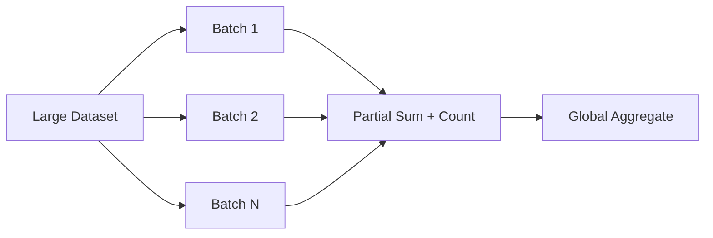

# 04- Aggregation Functions

## Overview

NumPy aggregation functions reduce one or more dimensions of an `ndarray` into summary values.

They are fundamental to backend and data-processing workloads because raw numerical data often needs to become compact operational information:

```text
Raw records
    ↓
Validation
    ↓
Aggregation
    ↓
Compact statistics
    ↓
Storage / API response / monitoring
```

Common aggregations include:

```python
np.sum()
np.mean()
np.median()
np.min()
np.max()
np.std()
np.var()
np.any()
np.all()
np.count_nonzero()
```

The important engineering concepts are:

- Which axis is being reduced.
- Whether the reduced dimension should be retained.
- How missing and non-finite values are handled.
- What dtype is used for accumulation and output.
- Whether the aggregation can be performed incrementally.
- Whether the operation should happen in NumPy, Pandas, or the database.
- How much memory and CPU the aggregation requires.

## Aggregation and Axes

Consider a batch of metrics:

```python
import numpy as np

metrics = np.array(
    [
        [100.0, 20.0, 30.0],
        [110.0, 25.0, 28.0],
        [105.0, 22.0, 31.0],
    ],
    dtype=np.float32,
)
```

Assume:

```text
axis 0 → records
axis 1 → metrics
```

Reducing `axis=0` produces one value per metric:

```python
mean_per_metric = metrics.mean(axis=0)
```

Shape:

```text
(3, 3)
→
(3,)
```

Reducing `axis=1` produces one value per record:

```python
mean_per_record = metrics.mean(axis=1)
```

Shape:

```text
(3, 3)
→
(3,)
```

The output shapes happen to match, but the semantics are different.

Axis meaning should therefore be documented as part of the data contract.

## `axis=None`

`axis=None` reduces across all elements:

```python
total = metrics.sum(axis=None)
```

The result is a scalar.

This is appropriate for global statistics:

```text
entire dataset
    ↓
single aggregate
```

Use it only when collapsing every dimension is intentional.

## `keepdims=True`

Aggregation normally removes the reduced dimension:

```python
mean = metrics.mean(axis=0)

print(mean.shape)
# (3,)
```

With `keepdims=True`:

```python
mean = metrics.mean(
    axis=0,
    keepdims=True,
)

print(mean.shape)
# (1, 3)
```

This is useful when the aggregate will later participate in broadcasting:

```python
centered = metrics - mean
```

Shape contract:

```text
metrics → (records, metrics)
mean    → (1, metrics)
result  → (records, metrics)
```

When an aggregate feeds another array operation, `keepdims=True` often makes the dimensional intent clearer.

## Core Aggregation Functions

| Function | Purpose | Typical Use |
|---|---|---|
| `sum()` | Total | Counts, revenue, usage |
| `prod()` | Product | Specialized numerical accumulation |
| `mean()` | Arithmetic average | Average latency, utilization |
| `median()` | Middle value | Robust central tendency |
| `min()` | Smallest value | Lower boundary |
| `max()` | Largest value | Upper boundary |
| `std()` | Standard deviation | Variability |
| `var()` | Variance | Dispersion |
| `ptp()` | Range (`max - min`) | Spread |
| `any()` | At least one true | Validation |
| `all()` | Every value true | Validation |
| `count_nonzero()` | Count non-zero values | Event/error counts |

The choice of aggregation should reflect the business meaning of the data, not merely which function is convenient.

## Sum

`sum()` calculates the total along an axis.

```python
import numpy as np

revenue = np.array(
    [
        [100.0, 200.0],
        [150.0, 250.0],
        [120.0, 180.0],
    ],
)

total_by_channel = revenue.sum(axis=0)
```

Result:

```text
[370.0, 630.0]
```

Typical uses include:

- Total revenue.
- Request counts.
- Resource consumption.
- Number of processed records.
- Batch-level totals.

For large datasets, totals are particularly useful because they are easy to combine incrementally.

## Mean

`mean()` computes an arithmetic average.

```python
average_latency = latency.mean(
    axis=0,
)
```

For a global average:

```python
average_latency = latency.mean()
```

Be careful with batches. In general:

```text
mean(batch means)
```

is not equal to:

```text
global mean
```

when batches contain different numbers of observations.

For incremental aggregation, retain:

```text
sum
+
count
```

and calculate:

```text
global mean = total sum / total count
```

## Weighted Averages

A plain mean assumes every observation contributes equally.

Some backend workloads require weighting.

For example, if batches represent traffic volumes, averaging per-batch rates equally may produce a misleading result.

NumPy can calculate a weighted average:

```python
import numpy as np

latency = np.array(
    [100.0, 200.0, 500.0],
)

request_count = np.array(
    [1000, 100, 10],
)

weighted_average = np.average(
    latency,
    weights=request_count,
)
```

The weights should have a clear domain interpretation.

A weighted average is not automatically more correct than a regular mean.

## Median

`median()` returns the middle value after ordering the observations.

```python
import numpy as np

latency = np.array(
    [95.0, 100.0, 105.0, 1200.0],
)

median = np.median(latency)
mean = np.mean(latency)
```

The outlier has a large effect on the mean but less direct influence on the median.

Median can therefore be useful when a dataset contains extreme values.

For production observability, however, median alone is rarely sufficient when tail behavior matters. Percentile-oriented metrics are often more useful for latency analysis.

## Minimum and Maximum

```python
minimum = values.min(axis=0)
maximum = values.max(axis=0)
```

These are useful for:

- Range validation.
- Batch diagnostics.
- Monitoring.
- Capacity analysis.
- Detecting unexpected values.

For example:

```python
minimum = latency.min()
maximum = latency.max()
```

can help identify whether a processing batch contains suspicious values.

## Range with `ptp`

`np.ptp()` calculates:

```text
maximum - minimum
```

For example:

```python
spread = np.ptp(
    latency,
    axis=0,
)
```

This provides a simple measure of range.

It is not equivalent to standard deviation and can be strongly influenced by outliers.

Use it when the actual range is the quantity of interest.

## Standard Deviation

`std()` measures dispersion around the mean.

```python
std = values.std(
    axis=0,
)
```

This can be useful for monitoring variability in:

- Latency.
- Resource usage.
- Numeric measurements.
- Batch behavior.

The meaning of `std()` depends on the data population and statistical assumptions. Do not interpret it as an operational threshold without understanding the underlying dataset.

## Variance

Variance is the squared form of standard deviation:

```python
variance = values.var(
    axis=0,
)
```

Because variance uses squared units, standard deviation is often easier to communicate operationally.

Use variance when it is part of a downstream numerical calculation rather than because it is mathematically available.

## Boolean Aggregation

Comparisons naturally produce boolean arrays:

```python
healthy = latency < 500.0
```

Those boolean values can be reduced.

Use `any()` when one or more elements satisfying a condition is enough:

```python
has_slow_request = np.any(
    latency >= 500.0,
)
```

Use `all()` when every element must satisfy the condition:

```python
all_healthy = np.all(
    latency < 500.0,
)
```

Along an axis:

```python
record_valid = np.all(
    feature_valid,
    axis=1,
)
```

This is useful for record-level validation.

## Counting with `count_nonzero`

`np.count_nonzero()` is useful for turning a boolean condition into a count.

```python
slow = latency >= 500.0

slow_count = np.count_nonzero(
    slow
)
```

For dimensional counts:

```python
slow_per_service = np.count_nonzero(
    slow,
    axis=0,
)
```

This pattern is common in:

- Data-quality monitoring.
- Error counting.
- Validation reports.
- Batch statistics.

A boolean mask can also be summed:

```python
slow_count = slow.sum()
```

because `True` behaves as `1` and `False` as `0` for the reduction.

`count_nonzero()` makes the intent more explicit.

## NaN-Aware Aggregations

Missing numerical values need an explicit policy.

Consider:

```python
import numpy as np

values = np.array(
    [
        [10.0, 20.0],
        [np.nan, 30.0],
        [15.0, 25.0],
    ],
)
```

Ordinary mean:

```python
values.mean(axis=0)
```

can propagate `NaN`.

When the intended policy is to ignore missing entries:

```python
np.nanmean(values, axis=0)
```

Related functions include:

```python
np.nansum()
np.nanmean()
np.nanmedian()
np.nanmin()
np.nanmax()
np.nanstd()
np.nanvar()
```

Do not use NaN-aware functions merely because they are convenient. Ignoring missing observations changes the meaning of the aggregate.

## All-NaN Slices

A NaN-aware aggregation can still encounter a dimension containing no valid values.

```python
import numpy as np

values = np.array(
    [
        [np.nan, 10.0],
        [np.nan, 20.0],
    ],
)

result = np.nanmean(
    values,
    axis=0,
)
```

The first output position has no valid observations.

The application must decide whether this means:

- Undefined.
- Invalid input.
- Missing data.
- A sentinel value.
- A batch rejection.

Do not silently interpret an undefined aggregate as zero.

## Aggregation and `where`

Many NumPy reductions support a `where=` condition.

For example:

```python
import numpy as np

values = np.array(
    [
        [10.0, 20.0],
        [30.0, 40.0],
    ],
)

result = np.sum(
    values,
    axis=0,
    where=values > 15.0,
)
```

This allows the reduction to include only values satisfying the condition.

It can be useful when the aggregation rule is naturally expressed as:

```text
select during reduction
+
aggregate
```

rather than building a separate filtered copy.

## Aggregation with `out=`

Some reduction functions support an explicit output buffer.

```python
import numpy as np

values = np.empty(
    (100_000, 8),
    dtype=np.float32,
)

result = np.empty(
    8,
    dtype=np.float64,
)

np.sum(
    values,
    axis=0,
    dtype=np.float64,
    out=result,
)
```

This can be useful in repeated batch processing where allocation behavior is important.

Use it when profiling demonstrates allocation pressure or when a reusable buffer is part of the processing design.

## Dtype and Aggregation

Aggregation can have dtype implications.

For example:

```python
values = np.array(
    [1, 2, 3],
    dtype=np.int32,
)

total = values.sum()
```

The accumulation dtype is not necessarily identical to the input dtype in every case.

For large numerical totals, be deliberate about:

- Integer range.
- Floating-point precision.
- Accumulator dtype.
- Output dtype.

For example:

```python
total = values.sum(
    dtype=np.int64,
)
```

can make the accumulation choice explicit.

The correct dtype depends on the expected value range and numerical requirements.

## Floating-Point Accuracy

Aggregations over floating-point values are subject to representation and accumulation error.

This matters more when:

```text
many values
+
different magnitudes
+
limited precision
```

are involved.

For example:

```python
total = values.sum(
    dtype=np.float64,
)
```

can provide more precise accumulation than a lower-precision input dtype in some workloads.

This increases the size of the accumulator and may affect performance.

Do not automatically use `float64` everywhere; choose it when the numerical requirements justify the cost.

## Reduction Order

Floating-point aggregation is not perfectly associative.

Conceptually:

```text
(a + b) + c
```

can differ slightly from:

```text
a + (b + c)
```

because of finite precision.

This becomes relevant when comparing:

- Whole-dataset calculations.
- Batch-by-batch calculations.
- Parallel reductions.
- Different execution environments.

Small numerical differences do not automatically indicate a bug.

For sensitive calculations, define acceptable numerical error and test using appropriate tolerances.

## Incremental Aggregation

Some aggregations can be combined safely across batches.

For totals:

```text
global sum
=
sum(batch_1)
+
sum(batch_2)
+
...
```

For counts:

```text
global count
=
count(batch_1)
+
count(batch_2)
+
...
```

For mean:

```text
global mean
=
global sum / global count
```

This produces an efficient streaming pattern:



The important point is that not every aggregate can be merged by simply averaging batch outputs.

## Aggregates That Need Careful Combining

Consider standard deviation or variance.

Naively averaging batch standard deviations is not generally correct.

Similarly:

```text
mean(mean(batch_1), mean(batch_2))
```

is incorrect when the batches have different sizes.

For statistics such as variance, use mathematically correct incremental formulas or retain sufficient state such as:

```text
count
sum
sum of squared deviations
```

depending on the required numerical properties.

The aggregation strategy should therefore be designed before implementing batch processing.

## Large Dataset Aggregation

A large numerical dataset should often be processed as:

```text
input
  ↓
bounded batch
  ↓
reduce
  ↓
update compact state
  ↓
discard batch
  ↓
next batch
```

Example:

```python
import numpy as np


def aggregate_batches(
    values: np.ndarray,
    batch_size: int,
) -> tuple[np.ndarray, np.ndarray]:
    total = np.zeros(
        values.shape[1],
        dtype=np.float64,
    )

    count = np.zeros(
        values.shape[1],
        dtype=np.int64,
    )

    for start in range(
        0,
        values.shape[0],
        batch_size,
    ):
        batch = values[
            start:start + batch_size
        ]

        valid = np.isfinite(batch)

        total += np.where(
            valid,
            batch,
            0.0,
        ).sum(axis=0)

        count += valid.sum(axis=0)

    return total, count
```

The global mean can then be computed using:

```python
total, count = aggregate_batches(
    values,
    batch_size=10_000,
)

mean = np.divide(
    total,
    count,
    out=np.full(
        total.shape,
        np.nan,
        dtype=np.float64,
    ),
    where=count != 0,
)
```

This keeps memory bounded while explicitly tracking the number of valid observations.

## Aggregation Over Memory-Mapped Arrays

For file-backed datasets:

```python
import numpy as np

values = np.memmap(
    "metrics.dat",
    dtype=np.float32,
    mode="r",
    shape=(10_000_000, 8),
)
```

the entire dataset does not need to be materialized as a normal in-memory array.

Process it in slices:

```python
batch = values[start:start + batch_size]
```

and aggregate each batch.

This is useful for datasets larger than RAM, although disk I/O and access patterns remain important performance constraints.

## Aggregation in Backend Services

Aggregation is often used before data crosses service boundaries.

For example:

```text
raw telemetry
     ↓
worker batch
     ↓
NumPy aggregation
     ↓
per-service metrics
     ↓
Redis / PostgreSQL
     ↓
API response
```

Reducing data early can decrease:

- Storage volume.
- Network traffic.
- Serialization cost.
- API payload size.
- Downstream processing.

A typical Celery worker might aggregate records before persisting a compact result instead of writing every intermediate value.

## Aggregation and Kafka

Streaming consumers frequently need windowed aggregates.

Conceptually:

```text
Kafka records
      ↓
consumer batch
      ↓
NumPy reduction
      ↓
window state
      ↓
next batch
```

Simple statistics such as:

```text
count
sum
min
max
```

are naturally incremental.

More complex statistics require carefully designed state.

The aggregation state should remain small enough that a worker restart can recover it efficiently from the source or checkpoint.

## Aggregation and PostgreSQL

Many NumPy reductions correspond directly to SQL aggregates:

| NumPy | SQL |
|---|---|
| `sum()` | `SUM()` |
| `mean()` | `AVG()` |
| `min()` | `MIN()` |
| `max()` | `MAX()` |
| `count_nonzero()` | Conditional `COUNT()` patterns |

If the source data already resides in PostgreSQL and the aggregate can be efficiently computed there, database-side aggregation is often preferable:

```text
PostgreSQL
   ↓
filter
   ↓
aggregate
   ↓
compact result
   ↓
Python
```

This reduces data movement and application memory usage.

NumPy becomes more appropriate when:

- Data already resides in Python.
- The aggregate is part of a larger numerical transformation.
- The input comes from numerical files or arrays.
- Application-side computation is required.

## Aggregation and Pandas

Pandas is often preferable for labeled, tabular aggregation:

```python
summary = frame.groupby(
    "service"
)["latency_ms"].mean()
```

NumPy is more appropriate for dense numerical arrays where the axis semantics are already established.

A common architecture is:

```text
SQL / API / files
      ↓
Pandas tabular preparation
      ↓
NumPy numerical processing
      ↓
Pandas / database / API
```

Avoid repeated conversion between Pandas and NumPy if the same representation can perform the necessary work.

## Validation Through Aggregation

Aggregates are useful for data-quality monitoring.

For example:

```python
finite = np.isfinite(values)

valid_count = np.count_nonzero(
    finite,
    axis=0,
)

total_count = values.shape[0]

valid_ratio = (
    valid_count / total_count
)
```

This produces feature-level coverage information.

A production pipeline can emit metrics such as:

```text
records_processed
records_invalid
valid_ratio
min_value
max_value
mean_value
```

These are often more operationally useful than storing every intermediate value.

## Aggregation and Empty Inputs

Reduction behavior for empty arrays varies by operation.

For example:

```python
import numpy as np

values = np.array(
    [],
    dtype=np.float64,
)
```

A sum has an identity value:

```python
values.sum()
```

while operations such as mean do not have a meaningful result without observations.

Production functions should define empty-input behavior explicitly rather than depending on implicit mathematical assumptions.

For example:

```python
def safe_mean(values: np.ndarray) -> float:
    if values.size == 0:
        return float("nan")

    return float(values.mean())
```

The sentinel should match the application's contract.

## Performance Considerations

Aggregation typically processes every relevant element:

```text
O(N)
```

The operation is often memory-bandwidth bound for simple reductions.

Performance depends on:

- Array size.
- Dtype.
- Memory layout.
- Axis.
- CPU.
- Cache behavior.
- Temporary arrays.
- Batch size.

For example:

```python
values.sum(axis=0)
```

may be dominated by reading the input array rather than arithmetic complexity.

This explains why memory layout and dtype can matter even when the algorithm remains `O(N)`.

## Memory Considerations

Reductions usually produce a much smaller output than the input, but they can still create temporary arrays.

For example:

```python
result = np.mean(
    np.abs(values),
    axis=0,
)
```

may require the absolute-value result to exist before the reduction.

For large arrays:

```text
input buffer
+
temporary buffer
+
output buffer
```

can substantially increase peak memory.

Where necessary, separate the stages or use reusable buffers.

## `axis` and Semantic Contracts

A reduction function should make its expected axis explicit.

For example:

```python
def average_features(
    records: np.ndarray,
) -> np.ndarray:
    return records.mean(
        axis=0,
    )
```

This communicates:

```text
input:
(batch, features)

output:
(features,)
```

rather than leaving the caller to infer the semantics.

For production code, documenting shape contracts is especially valuable when arrays cross module or service boundaries.

## Common Mistakes

### Averaging Averages

This can be incorrect when groups have different sizes.

Use weighted aggregation or maintain sum and count.

### Reducing the Wrong Axis

The result may be mathematically valid but semantically wrong.

Always document axis meaning.

### Ignoring NaN Values

Ordinary reductions can propagate `NaN`.

Define the missing-data policy explicitly.

### Treating Missing Data as Zero

Replacing missing observations with zero changes the aggregate and can introduce significant bias.

### Assuming Every Aggregate Is Incrementally Mergeable

Some aggregates require more state than a single partial output.

### Loading Entire Datasets for Compact Results

If only aggregate statistics are needed, process the source in batches.

### Using `float64` Everywhere

Higher precision can increase memory and computational costs.

### Ignoring Empty Inputs

Some reductions have natural identity values; others are undefined.

Define the contract.

### Aggregating in Python When the Database Can Do It

Moving millions of database rows into the application only to calculate `SUM()` or `AVG()` is often unnecessary.

## Testing Aggregations

Test both the numerical result and shape.

```python
import numpy as np


def test_mean_by_feature():
    values = np.array(
        [
            [10.0, 20.0],
            [30.0, 40.0],
            [50.0, 60.0],
        ]
    )

    result = values.mean(
        axis=0,
    )

    assert result.shape == (2,)

    np.testing.assert_allclose(
        result,
        np.array(
            [30.0, 40.0],
        ),
    )
```

Test NaN-aware behavior:

```python
def test_nanmean():
    values = np.array(
        [
            [10.0, np.nan],
            [30.0, 40.0],
        ]
    )

    result = np.nanmean(
        values,
        axis=0,
    )

    np.testing.assert_allclose(
        result,
        np.array(
            [20.0, 40.0],
        ),
    )
```

Also test:

- Empty input.
- All-NaN dimensions.
- Integer dtypes.
- Floating-point dtypes.
- Large values.
- Multiple axes.
- `keepdims=True`.
- Incremental versus whole-dataset aggregation.
- Boundary conditions.

## Debugging Aggregation Issues

When an aggregate appears incorrect, inspect:

```python
print("shape:", values.shape)
print("dtype:", values.dtype)
print("size:", values.size)
print("finite:", np.isfinite(values).all())
```

Then verify the axis contract:

```text
axis 0 → ?
axis 1 → ?
axis 2 → ?
```

For missing-value issues:

```python
valid = np.isfinite(values)

print(
    "valid count:",
    valid.sum(),
)
```

Compare a small representative sample using a simpler reference implementation when investigating correctness.

## Interview Questions

### What does an aggregation function do?

It combines multiple values into a smaller representation, often reducing one or more array dimensions.

### What is the difference between `axis=0` and `axis=1`?

They reduce different dimensions. For `(records, features)`, `axis=0` produces per-feature aggregates and `axis=1` produces per-record aggregates.

### Why is `keepdims=True` useful?

It preserves reduced dimensions as size-one axes, making the result easier to align with the original array through broadcasting.

### Why is averaging batch means potentially incorrect?

Batch means can represent different numbers of observations. A global mean should usually be computed from total sum divided by total count.

### How do you aggregate data containing `NaN` values?

Use an explicit missing-data policy and, when appropriate, NaN-aware functions such as `np.nanmean()` and `np.nansum()`.

### Can every aggregation be computed incrementally?

No. Some aggregates can be combined directly, while others require sufficient intermediate state or specialized formulas.

### Why can reduction performance be memory-bound?

Simple reductions perform little arithmetic per element but must read large amounts of data, making memory bandwidth a significant part of runtime.

### How would you aggregate a dataset larger than RAM?

Process bounded batches and maintain compact aggregation state rather than loading the full dataset.

### When should aggregation happen in PostgreSQL?

When the source is relational and the database can perform the aggregation efficiently before transferring data to the application.

### Why should aggregation tests verify shape as well as values?

A result can contain numerically plausible values while reducing the wrong axis. Shape assertions help detect semantic errors.

## Key Takeaways

- NumPy aggregation functions reduce one or more axes into compact numerical or boolean summaries, making axis semantics part of the correctness contract.
- `sum`, `mean`, `min`, `max`, `median`, `std`, `var`, `any`, `all`, and `count_nonzero` cover many common backend and data-processing aggregation needs.
- Large datasets should use incremental aggregation where mathematically valid, especially for totals and counts; never assume batch-level aggregates can simply be averaged.
- Production aggregation requires explicit handling of `NaN`, empty inputs, dtype and precision, accumulator behavior, and memory usage.
- Push aggregation toward the data source when appropriate, such as PostgreSQL, and use NumPy when dense numerical processing is already happening in the application.