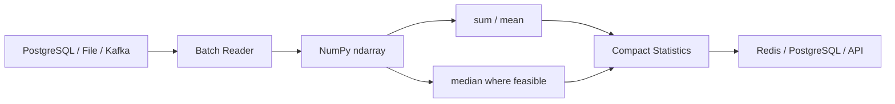

# 05- Sum Mean Median

## Overview

`sum()`, `mean()`, and `median()` are three of the most common NumPy aggregation operations for turning detailed numerical data into compact statistics.

They answer different questions:

```text
sum
→ How much in total?

mean
→ What is the arithmetic average?

median
→ What is the middle value?
```

The choice matters because the three statistics behave differently with:

- Outliers.
- Missing values.
- Unequal group sizes.
- Dtypes and precision.
- Large datasets.
- Incremental or batch processing.

For backend and data-engineering systems, these operations commonly appear in:

- Request and latency analysis.
- Usage aggregation.
- Revenue and transaction processing.
- Data-quality reporting.
- Batch analytics.
- Resource utilization.
- ETL pipelines.
- Operational dashboards.

## Sum

`sum()` adds values across an array or along one or more axes.

```python
import numpy as np

values = np.array(
    [100.0, 150.0, 120.0],
    dtype=np.float64,
)

total = values.sum()

print(total)
# 370.0
```

For multidimensional data:

```python
sales = np.array(
    [
        [100.0, 200.0],
        [150.0, 250.0],
        [120.0, 180.0],
    ],
)

total_by_channel = sales.sum(
    axis=0,
)

print(total_by_channel)
# [370. 630.]
```

If:

```text
axis 0 → transactions
axis 1 → channels
```

then `sum(axis=0)` produces one total per channel.

## Why Sum Matters in Backend Systems

Summation is naturally useful for quantities that are additive:

```text
request count
bytes transferred
units sold
CPU time
storage consumed
revenue
```

For example:

```python
request_counts = np.array(
    [1200, 1500, 900, 1800],
    dtype=np.int64,
)

total_requests = request_counts.sum()
```

Because sums are associative enough for practical aggregation state, they are particularly well suited to batch and streaming processing.

## Sum and Batch Processing

A large dataset does not need to be fully loaded before calculating a total.

The aggregation can be maintained incrementally:

```python
import numpy as np


def batch_total(
    values: np.ndarray,
    batch_size: int,
) -> float:
    total = 0.0

    for start in range(
        0,
        values.shape[0],
        batch_size,
    ):
        batch = values[
            start:start + batch_size
        ]

        total += batch.sum(
            dtype=np.float64,
        )

    return total
```

The processing model is:


The worker keeps only the current batch and a compact running value.

This is useful for large files, memory-mapped arrays, Celery jobs, and streaming-style numerical processing.

## Sum and Dtype

Accumulator dtype matters for sums, particularly with integers.

For example:

```python
values = np.array(
    [1_000_000, 2_000_000],
    dtype=np.int32,
)

total = values.sum(
    dtype=np.int64,
)
```

Explicitly selecting an accumulator dtype can make the numeric contract clearer.

For large integer totals, always consider the maximum possible accumulated value rather than only the dtype of individual records.

For floating-point sums, a wider accumulation dtype can improve numerical precision at the cost of additional computation or storage.

## Empty Sum

Sum has a natural identity value:

```python
import numpy as np

values = np.array(
    [],
    dtype=np.float64,
)

result = values.sum()

print(result)
# 0.0
```

This makes sum convenient in incremental pipelines.

However, an application may still want to distinguish:

```text
no observations
```

from:

```text
observations whose total happens to be zero
```

Those are not necessarily the same business condition.

Track a separate count when that distinction matters.

## Sum with `NaN`

Ordinary sum can propagate `NaN`:

```python
import numpy as np

values = np.array(
    [10.0, np.nan, 20.0],
)

result = values.sum()
```

When the intended policy is to ignore missing values:

```python
result = np.nansum(values)
```

Do not use `nansum()` automatically. Ignoring missing data changes the meaning of the aggregate.

A robust pipeline may track both:

```text
valid observation count
+
sum of valid observations
```

so that downstream systems know how much data contributed to the result.

## Mean

`mean()` calculates the arithmetic average:

```text
sum of observations
-------------------
number of observations
```

Example:

```python
import numpy as np

latency = np.array(
    [100.0, 120.0, 140.0],
)

average = latency.mean()

print(average)
# 120.0
```

Along an axis:

```python
metrics = np.array(
    [
        [100.0, 10.0],
        [200.0, 20.0],
        [300.0, 30.0],
    ],
)

mean_per_metric = metrics.mean(
    axis=0,
)

print(mean_per_metric)
# [200.  20.]
```

## Why Mean Matters

Mean is useful when every observation should contribute equally to the aggregate.

Typical examples:

- Average processing time.
- Average resource usage.
- Average order value.
- Average numerical measurement.
- Average batch size.

However, mean is sensitive to extreme values.

For example:

```python
latency = np.array(
    [100.0, 110.0, 120.0, 10_000.0],
)

mean = latency.mean()
median = np.median(latency)
```

The large outlier significantly increases the mean.

This is not a NumPy problem; it is a property of the statistic.

## Mean and Unequal Batch Sizes

A common production mistake is averaging batch means:

```text
mean(batch_1)
+
mean(batch_2)
+
...
----------------
number of batches
```

This is generally incorrect when batch sizes differ.

For example:

```text
Batch A → 100 records, mean = 10
Batch B → 10 records, mean = 100
```

The simple average is:

```text
(10 + 100) / 2 = 55
```

but the true global mean is:

```text
(100 × 10 + 10 × 100) / 110
= 18.18...
```

The correct incremental state is:

```text
sum
+
count
```

Then:

```text
global mean = total sum / total count
```

## Incremental Mean

For a batch-oriented pipeline:

```python
import numpy as np


def running_sum_and_count(
    values: np.ndarray,
    batch_size: int,
) -> tuple[float, int]:
    total = 0.0
    count = 0

    for start in range(
        0,
        values.shape[0],
        batch_size,
    ):
        batch = values[
            start:start + batch_size
        ]

        total += batch.sum(
            dtype=np.float64,
        )

        count += batch.size

    return total, count
```

Then:

```python
total, count = running_sum_and_count(
    values,
    batch_size=10_000,
)

mean = total / count if count else np.nan
```

This avoids loading the entire dataset solely to calculate the mean.

## Weighted Mean

A plain mean treats every observation equally.

Sometimes observations carry different importance or exposure.

NumPy provides:

```python
np.average(
    values,
    weights=weights,
)
```

Example:

```python
import numpy as np

latency = np.array(
    [100.0, 200.0, 500.0],
)

requests = np.array(
    [1000, 100, 10],
)

weighted_latency = np.average(
    latency,
    weights=requests,
)
```

The weighted result reflects traffic volume.

A weighted mean is useful when the weight has a real semantic meaning.

Do not add weights simply because the resulting number appears more reasonable.

## Mean and Missing Values

For:

```python
values = np.array(
    [10.0, np.nan, 30.0],
)
```

ordinary mean:

```python
values.mean()
```

can produce `NaN`.

When ignoring missing values is explicitly correct:

```python
np.nanmean(values)
```

Use NaN-aware functions only when the missing-data policy supports that interpretation.

If every value is `NaN`, `nanmean()` does not produce a meaningful finite average. Production code should define the expected behavior for that condition.

## Mean and Numerical Precision

A mean involves summation and division, so floating-point precision matters.

For high-volume data:

```python
mean = values.mean(
    dtype=np.float64,
)
```

can provide more precise accumulation than a lower-precision representation in appropriate cases.

However, higher precision can increase memory traffic and computation.

Choose precision based on:

```text
accuracy requirement
+
data magnitude
+
dtype
+
resource budget
```

rather than automatically converting every dataset to `float64`.

## Median

`median()` returns the middle value after ordering the observations.

```python
import numpy as np

latency = np.array(
    [90.0, 100.0, 110.0, 120.0, 5000.0],
)

median = np.median(latency)

print(median)
# 110.0
```

The median is much less affected by a single extreme outlier than the mean.

This can make it useful for:

- Typical latency.
- Response-time analysis.
- Operational measurements with occasional spikes.
- Skewed distributions.

## Median with Even Numbers of Values

For an even number of values, the median is typically the average of the two middle values.

```python
import numpy as np

values = np.array(
    [10.0, 20.0, 30.0, 40.0],
)

median = np.median(values)

print(median)
# 25.0
```

This means the median does not necessarily correspond to an actual observation.

## Mean vs Median

| Property | Mean | Median |
|---|---|---|
| Calculation | Arithmetic average | Middle ordered value |
| Sensitive to outliers | High | Lower |
| Typical use | Overall average | Typical central value |
| Easily combined from simple batch outputs | Yes, using sum + count | Not from medians alone |
| Computational characteristics | Linear reduction | Requires order-statistics work |
| Useful for latency | Sometimes | Often useful for typical latency |

Neither statistic is universally better.

The correct choice depends on the distribution and business meaning of the data.

## Mean and Median Together

Operational dashboards often benefit from looking at both:

```python
mean = latency.mean()
median = np.median(latency)
```

For example:

```text
median = 110 ms
mean   = 450 ms
```

The large gap suggests that the distribution is highly skewed or contains significant outliers.

This does not diagnose the root cause by itself, but it is a useful signal for further investigation.

## Median and Large Datasets

Median is different from sum and mean in terms of incremental processing.

You cannot generally compute the global median by simply averaging batch medians:

```text
median(batch_1)
+
median(batch_2)
----------------
2
```

This does not produce the global median.

For very large datasets, exact median computation may require retaining or processing sufficient information about the distribution.

If exact median is not necessary, approximate quantile methods or dedicated streaming statistics may be more appropriate. Those techniques should be introduced deliberately rather than approximating the median by averaging batch medians.

## Axis-Based Sum, Mean, and Median

For a matrix:

```python
import numpy as np

values = np.array(
    [
        [10.0, 100.0],
        [20.0, 200.0],
        [30.0, 300.0],
    ],
)
```

Per-column:

```python
column_sum = values.sum(axis=0)
column_mean = values.mean(axis=0)
column_median = np.median(
    values,
    axis=0,
)
```

Result:

```text
sum:
[60, 600]

mean:
[20, 200]

median:
[20, 200]
```

Per-row:

```python
row_sum = values.sum(axis=1)
row_mean = values.mean(axis=1)
row_median = np.median(
    values,
    axis=1,
)
```

The axis determines the population being summarized.

## `keepdims=True`

When an aggregate will be broadcast back against the original array:

```python
feature_mean = values.mean(
    axis=0,
    keepdims=True,
)
```

produces:

```text
(1, features)
```

rather than:

```text
(features,)
```

Example:

```python
centered = values - feature_mean
```

This makes the shape relationship explicit and is particularly useful in generic numerical functions.

## `out=` and Reusable Buffers

For repeated reductions, an output buffer can be used where supported:

```python
import numpy as np

values = np.empty(
    (100_000, 8),
    dtype=np.float32,
)

result = np.empty(
    8,
    dtype=np.float64,
)

np.sum(
    values,
    axis=0,
    dtype=np.float64,
    out=result,
)
```

This can reduce repeated output allocation.

It adds complexity, so it is most appropriate when profiling identifies allocation pressure or when the pipeline is intentionally designed around reusable buffers.

## Memory and Performance

### Sum

Sum is typically a simple linear scan:

```text
O(N)
```

and can be strongly influenced by memory bandwidth.

### Mean

Mean is similar to sum because it requires accumulation followed by division.

### Median

Median generally requires more work because determining the middle value depends on the ordering of the data. Do not assume it has the same cost characteristics as a simple sum or mean.

The practical lesson is:

```text
sum / mean
→ straightforward streaming reductions

median
→ requires more information about the distribution
```

For large-scale processing, this distinction matters.

## Batch Aggregation Architecture

A practical numerical backend can use:



For sum and mean:

```text
batch
  ↓
partial sum + count
  ↓
merge
  ↓
global result
```

For exact median:

```text
batch
  ↓
distribution information
  ↓
global median calculation
```

The two aggregation strategies are materially different.

## Backend Example: Service Metrics

Suppose a worker processes request latency data:

```python
import numpy as np


def summarize_latency(
    latency_ms: np.ndarray,
) -> dict[str, float]:
    finite = np.isfinite(
        latency_ms
    )

    valid = latency_ms[finite]

    if valid.size == 0:
        return {
            "mean_ms": float("nan"),
            "median_ms": float("nan"),
        }

    return {
        "mean_ms": float(
            valid.mean()
        ),
        "median_ms": float(
            np.median(valid)
        ),
    }
```

The function:

1. Removes non-finite measurements.
2. Detects the empty-valid-input case.
3. Calculates mean and median.
4. Returns compact values suitable for a metrics pipeline.

The missing-data policy should be explicit in the surrounding service contract.

## Backend Example: Revenue Aggregation

For transaction-level data:

```python
import numpy as np


def summarize_revenue(
    amounts: np.ndarray,
) -> dict[str, float]:
    valid = np.isfinite(amounts)

    values = amounts[valid]

    if values.size == 0:
        return {
            "total": 0.0,
            "mean": float("nan"),
            "median": float("nan"),
        }

    return {
        "total": float(
            values.sum(
                dtype=np.float64
            )
        ),
        "mean": float(
            values.mean(
                dtype=np.float64
            )
        ),
        "median": float(
            np.median(values)
        ),
    }
```

For an accounting system, the numerical representation must still be chosen carefully. Float-based NumPy calculations should not automatically become the authoritative representation for exact monetary accounting.

## PostgreSQL Comparison

Many applications can calculate sum and mean in PostgreSQL:

```sql
SELECT
    SUM(amount),
    AVG(amount)
FROM transactions
WHERE status = 'completed';
```

If the source is already PostgreSQL, pushing filtering and aggregation into the database can reduce:

```text
rows transferred
+
application memory
+
serialization
+
application CPU
```

NumPy is a better fit when the application already owns the numerical processing stage or the data originates from arrays, files, or another numerical pipeline.

## Pandas Comparison

Pandas provides labeled aggregation naturally:

```python
summary = frame["amount"].agg(
    ["sum", "mean", "median"]
)
```

This is often the clearest approach when working with tabular data.

NumPy is more appropriate when:

```text
data is already a dense ndarray
```

and the workflow is focused on numerical processing rather than labeled tabular manipulation.

Avoid unnecessary conversions:

```text
Pandas
→ NumPy
→ Pandas
```

when the same operation can be performed directly in the existing representation.

## Data Quality and Monitoring

Aggregate statistics can act as operational signals.

For a batch:

```python
finite = np.isfinite(values)

valid_count = np.count_nonzero(
    finite
)

invalid_count = values.size - valid_count

mean = (
    values[finite].mean()
    if valid_count
    else np.nan
)
```

Metrics can expose:

```text
records_processed
records_valid
records_invalid
total
mean
median
```

These signals can be used with application monitoring systems and alerts.

Avoid logging raw arrays in production. Aggregate metrics are usually safer and dramatically smaller.

## Common Mistakes

### Averaging Batch Means

Incorrect when batch sizes differ.

Maintain total sum and count instead.

### Averaging Batch Medians

This does not produce the global median.

Exact median requires more distribution information.

### Treating Mean as the "Typical" Value

The mean can be heavily affected by outliers.

Use median when the central tendency needs to be more robust to extreme observations.

### Ignoring NaN Values

Ordinary `sum()` and `mean()` can propagate `NaN`.

Define an explicit missing-data policy.

### Treating Missing Values as Zero

A missing measurement is not necessarily a zero measurement.

### Ignoring Empty Inputs

`sum()` naturally has an identity value, but `mean()` and `median()` do not provide meaningful values without observations.

### Using Float for Authoritative Monetary Accounting

NumPy floating-point values are not a replacement for exact decimal accounting semantics.

### Assuming Median Scales Like Sum

Median requires substantially more information about ordering and is not a simple associative reduction like sum.

### Reducing the Wrong Axis

The output can look numerically plausible while representing the wrong population.

### Moving Large Database Tables into Python for Simple Aggregates

When PostgreSQL can safely calculate the aggregate, pushing the work closer to the source is often more efficient.

## Testing

Test values, shapes, missing data, and edge cases.

```python
import numpy as np


def test_sum_mean_median():
    values = np.array(
        [10.0, 20.0, 30.0],
    )

    assert values.sum() == 60.0
    assert values.mean() == 20.0
    assert np.median(values) == 20.0
```

Test axis behavior:

```python
def test_axis_aggregation():
    values = np.array(
        [
            [10.0, 100.0],
            [20.0, 200.0],
            [30.0, 300.0],
        ],
    )

    result = values.mean(
        axis=0,
    )

    assert result.shape == (2,)

    np.testing.assert_allclose(
        result,
        np.array([20.0, 200.0]),
    )
```

Test NaN handling:

```python
def test_nanmean():
    values = np.array(
        [10.0, np.nan, 30.0],
    )

    result = np.nanmean(values)

    assert result == 20.0
```

Also test:

- Empty arrays.
- All-NaN arrays.
- Very large numbers.
- Different dtypes.
- Unequal batch sizes.
- Incremental sum versus whole-dataset sum.
- Axis and `keepdims` behavior.

## Debugging

When an aggregate looks wrong, inspect:

```python
print("shape:", values.shape)
print("dtype:", values.dtype)
print("size:", values.size)
print("finite:", np.isfinite(values).sum())
```

Then explicitly verify the axis:

```text
axis 0 → what does it represent?
axis 1 → what does it represent?
```

For mean-related problems, compare:

```text
sum
count
mean
```

because:

```text
mean = sum / count
```

provides a simple way to verify whether the result is internally consistent.

For median-related issues, inspect the distribution and a sorted sample rather than attempting to reason from the mean.

## Interview Questions

### What is the difference between sum, mean, and median?

- `sum` returns the total.
- `mean` returns the arithmetic average.
- `median` identifies the middle of the ordered distribution.

### Why is mean sensitive to outliers?

Because every observation directly contributes to the arithmetic total.

### Why is median more robust to an isolated outlier?

An extreme value changes the magnitude of the distribution but does not necessarily change the middle position.

### Can you calculate a global mean from batch means?

Yes, but not by simply averaging the batch means unless the batches have equal size. The reliable approach is to combine sums and counts.

### Can you calculate a global median from batch medians?

Not in general. Batch medians do not contain enough information to reconstruct the global ordering.

### Which is easier to compute incrementally: sum, mean, or median?

Sum is directly additive. Mean can be maintained using sum and count. Exact median generally requires more distribution information.

### Why might a database be preferable for sum and mean?

If the data is already in PostgreSQL, database-side aggregation can reduce data transfer and application memory usage.

### Why test aggregation shape as well as numerical values?

The values may be correct for the wrong axis. Shape assertions help detect semantic errors.

### When should you use median instead of mean for latency?

When the goal is to understand typical latency in a distribution where outliers or skew can substantially distort the arithmetic mean.

## Key Takeaways

- `sum`, `mean`, and `median` answer different questions and should be selected based on the semantics of the dataset rather than convenience.
- Sum and mean are naturally suited to batch aggregation when maintaining sufficient state such as `sum` and `count`; averaging batch outputs naively can be incorrect.
- Median is more resistant to isolated outliers but cannot generally be reconstructed from batch medians and has different scaling characteristics from simple reductions.
- Production aggregation requires explicit handling of `NaN`, empty inputs, dtype and precision, axis semantics, and the distinction between missing values and zeros.
- Use NumPy for dense application-side numerical processing, Pandas for labeled tabular aggregation, and PostgreSQL when database-side aggregation can safely reduce data movement and resource usage.