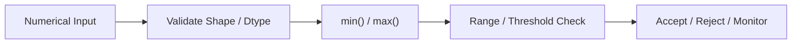
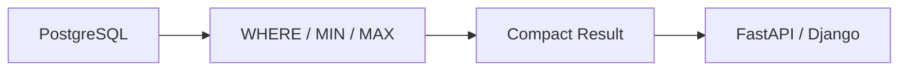

# 06- Min Max

## Overview

`min()` and `max()` are fundamental NumPy aggregation operations for identifying the smallest and largest values in an array or along one or more axes.

They are commonly used for:

- Input validation.
- Range detection.
- Threshold monitoring.
- Batch diagnostics.
- Capacity analysis.
- Data-quality checks.
- Normalization boundaries.
- Operational metrics.

The basic operations are:

```python
values.min()
values.max()
```

or:

```python
np.min(values)
np.max(values)
```

For engineering workloads, the important concerns are:

```text
axis semantics
+
NaN / infinity handling
+
dtype behavior
+
empty inputs
+
memory access
+
batch processing
+
source-level filtering
```

A typical validation workflow is:



## Basic Minimum and Maximum

Consider:

```python
import numpy as np

latency_ms = np.array(
    [85.0, 120.0, 95.0, 310.0],
    dtype=np.float64,
)

minimum = latency_ms.min()
maximum = latency_ms.max()

print(minimum)
# 85.0

print(maximum)
# 310.0
```

The functions scan the input and return the smallest or largest value.

The same operation can be expressed as:

```python
minimum = np.min(latency_ms)
maximum = np.max(latency_ms)
```

The method form is concise for an existing array, while the functional form is useful when writing generic NumPy expressions.

## Why Min and Max Matter

Minimum and maximum values describe the boundaries of a dataset.

In backend systems, they are useful for questions such as:

```text
What was the fastest request?
What was the slowest request?
Did any value exceed the allowed limit?
Did a batch contain an impossible measurement?
What range did this processing window cover?
```

For example:

```python
if latency_ms.max() > 5_000:
    raise ValueError(
        "Latency exceeds configured batch limit"
    )
```

For production systems, explicit threshold validation is usually more useful than calculating a range without interpreting it.

## Axis-Based Reduction

For multidimensional arrays:

```python
import numpy as np

metrics = np.array(
    [
        [100.0, 20.0, 30.0],
        [110.0, 25.0, 28.0],
        [105.0, 22.0, 31.0],
    ],
)
```

Assume:

```text
axis 0 → records
axis 1 → metrics
```

Per-metric minimum:

```python
minimum = metrics.min(
    axis=0,
)
```

Result:

```text
[100.  20.  28.]
```

Per-metric maximum:

```python
maximum = metrics.max(
    axis=0,
)
```

Result:

```text
[110.  25.  31.]
```

The output shape is:

```text
(3, 3)
→
(3,)
```

The axis determines which population is being summarized.

## Reducing Along `axis=1`

To calculate one minimum per record:

```python
minimum = metrics.min(
    axis=1,
)
```

and one maximum per record:

```python
maximum = metrics.max(
    axis=1,
)
```

The shape becomes:

```text
(3, 3)
→
(3,)
```

The result is one pair of boundaries per record.

This is useful when each row represents an independent batch item or entity.

## `axis=None`

By default, `min()` and `max()` can reduce the entire array:

```python
global_min = metrics.min()
global_max = metrics.max()
```

Conceptually:

```text
all dimensions
    ↓
single minimum
single maximum
```

This is useful for global bounds and sanity checks.

For multidimensional arrays, `axis=None` makes the "search the entire dataset" intent explicit:

```python
global_min = np.min(
    metrics,
    axis=None,
)
```

## `keepdims=True`

When the result will be combined with the original array, retaining the reduced dimension can simplify broadcasting.

```python
minimum = metrics.min(
    axis=0,
    keepdims=True,
)

maximum = metrics.max(
    axis=0,
    keepdims=True,
)
```

Shapes:

```text
metrics → (records, features)
minimum → (1, features)
maximum → (1, features)
```

For example, feature-range normalization can use these aligned arrays:

```python
span = maximum - minimum

normalized = np.divide(
    metrics - minimum,
    span,
    out=np.zeros_like(metrics),
    where=span != 0,
)
```

This avoids manually reshaping the aggregate results later.

## Min and Max for Validation

Boundary checks are common in numerical pipelines.

```python
import numpy as np


def validate_temperature(
    values: np.ndarray,
    minimum: float,
    maximum: float,
) -> bool:
    return bool(
        np.all(values >= minimum)
        and np.all(values <= maximum)
    )
```

An alternate diagnostic form is:

```python
actual_min = values.min()
actual_max = values.max()

print(
    f"observed range: "
    f"{actual_min}..{actual_max}"
)
```

The first form answers:

```text
Are all values valid?
```

The second answers:

```text
What range was actually observed?
```

Production systems often need both.

## Min, Max, and Range

The difference between maximum and minimum gives the observed range:

```python
range_size = (
    values.max()
    - values.min()
)
```

NumPy also provides:

```python
np.ptp(values)
```

which directly calculates:

```text
max - min
```

Example:

```python
import numpy as np

values = np.array(
    [10.0, 20.0, 35.0, 15.0],
)

range_size = np.ptp(values)

print(range_size)
# 25.0
```

Range is useful for understanding spread, but it is highly sensitive to outliers.

## Min and Max Compared with Mean and Median

Minimum and maximum describe boundaries, while mean and median describe central tendency.

| Statistic | Answers |
|---|---|
| Minimum | What is the smallest value? |
| Maximum | What is the largest value? |
| Mean | What is the arithmetic average? |
| Median | What is the middle value? |

For example:

```python
import numpy as np

latency = np.array(
    [90.0, 100.0, 110.0, 5000.0],
)

minimum = latency.min()
maximum = latency.max()
mean = latency.mean()
median = np.median(latency)
```

A production dashboard may use all four because they expose different properties of the distribution.

## NaN Behavior

A critical production consideration is how `NaN` affects minimum and maximum.

```python
import numpy as np

values = np.array(
    [10.0, np.nan, 30.0],
)

minimum = values.min()
maximum = values.max()
```

Ordinary reductions can propagate `NaN`, resulting in a non-finite output.

When the intended policy is to ignore missing values:

```python
minimum = np.nanmin(values)
maximum = np.nanmax(values)
```

Use NaN-aware functions only when ignoring missing values is semantically correct.

The difference is important:

```text
min()
→ "Any missing value invalidates this aggregate."

nanmin()
→ "Ignore missing values and aggregate the remaining observations."
```

Neither policy is universally correct.

## All-NaN Inputs

NaN-aware minimum and maximum cannot produce a meaningful finite boundary if every value is `NaN`.

```python
import numpy as np

values = np.array(
    [np.nan, np.nan],
)

minimum = np.nanmin(values)
maximum = np.nanmax(values)
```

This condition should be treated explicitly in production pipelines.

Possible policies include:

- Reject the batch.
- Return `NaN`.
- Record a data-quality error.
- Preserve an "unknown" state.
- Apply a domain-specific fallback.

Never silently convert an all-missing dataset into an arbitrary numeric boundary.

## Positive and Negative Infinity

Infinity can legitimately participate in min/max calculations.

```python
import numpy as np

values = np.array(
    [10.0, np.inf, -np.inf, 20.0],
)

minimum = values.min()
maximum = values.max()
```

The results reflect the infinite values.

If only finite measurements are valid:

```python
finite = np.isfinite(values)

valid_values = values[finite]
```

then calculate:

```python
minimum = valid_values.min()
maximum = valid_values.max()
```

This distinction is important when infinities are caused by upstream numerical errors.

## `np.isfinite()` Before Min and Max

For a validation boundary:

```python
import numpy as np


def finite_range(
    values: np.ndarray,
) -> tuple[float, float]:
    finite = np.isfinite(values)

    if not np.any(finite):
        return np.nan, np.nan

    valid = values[finite]

    return (
        float(valid.min()),
        float(valid.max()),
    )
```

This explicitly separates:

```text
input validity
+
boundary calculation
```

It also handles a batch containing no finite observations.

## Comparison with `nanmin()` and `nanmax()`

There are two common approaches.

### Filter First

```python
finite = np.isfinite(values)
valid = values[finite]

minimum = valid.min()
maximum = valid.max()
```

This makes the filtering rule explicit, but boolean indexing generally creates a new array.

### Use NaN-Aware Reduction

```python
minimum = np.nanmin(values)
maximum = np.nanmax(values)
```

This can be more direct when `NaN` is the specific missing-value representation you intend to ignore.

The important difference is that `np.nanmin()` and `np.nanmax()` address `NaN`, not all forms of invalid data.

For example, `+inf` and `-inf` are not ignored by NaN-aware reductions.

## Dtype Considerations

Minimum and maximum generally preserve the relevant value representation of the input.

For integer arrays:

```python
values = np.array(
    [10, 20, 30],
    dtype=np.int32,
)

minimum = values.min()
maximum = values.max()
```

For floating-point arrays:

```python
values = np.array(
    [10.0, 20.0, 30.0],
    dtype=np.float32,
)
```

the dtype can affect:

- Representable range.
- Precision.
- Memory consumption.
- Comparisons at boundary values.

For min/max specifically, overflow is less of a concern than for accumulation operations such as `sum`, but dtype precision still matters when values are transformed before the reduction.

## Integer Boundaries

NumPy fixed-width integers have finite ranges.

If upstream processing generates values near the limits of the dtype, arithmetic performed before `min()` or `max()` can overflow even though the aggregation itself is simple.

For example:

```python
import numpy as np

values = np.array(
    [2_000_000_000],
    dtype=np.int32,
)

transformed = values * 2
```

The arithmetic can overflow before the result is passed to `min()` or `max()`.

The engineering lesson is:

```text
Validate the arithmetic pipeline,
not only the final aggregation.
```

## Floating-Point Boundaries

Floating-point values are approximate.

Suppose an upper boundary is:

```python
maximum_allowed = 100.0
```

Then:

```python
values <= maximum_allowed
```

is appropriate when the business rule genuinely defines an exact representable boundary.

When comparing values derived through floating-point calculations, consider whether tolerance is more appropriate:

```python
np.isclose(
    observed_max,
    expected_max,
)
```

Do not add tolerance automatically to simple threshold checks. The threshold semantics should determine the comparison policy.

## Min and Max with `where`

Some reduction APIs support conditional selection during the reduction.

For example:

```python
import numpy as np

values = np.array(
    [10.0, -5.0, 30.0, 0.0],
)

positive_min = np.min(
    values,
    where=values > 0,
    initial=np.inf,
)
```

The `initial` value is important here because the reduction needs an initial value when the condition excludes all elements.

The resulting value is:

```text
10.0
```

Conditional reductions can avoid explicitly creating a filtered copy in some situations.

However, the identity or `initial` value must be chosen carefully because an inappropriate value can change the result.

## `initial` and Empty Selection

For conditional reductions, `initial` provides a starting value:

```python
minimum = np.min(
    values,
    where=mask,
    initial=np.inf,
)
```

and:

```python
maximum = np.max(
    values,
    where=mask,
    initial=-np.inf,
)
```

The pattern is useful when no element satisfies the condition.

For example:

```text
no matching values
→ return +inf for minimum
```

may be technically convenient but may not be a valid business representation.

Often the better approach is to track whether any value matched:

```python
matched = np.any(mask)
```

and handle the empty case explicitly.

## Min and Max by Feature

A common backend data-processing operation is feature-level range extraction:

```python
import numpy as np


def feature_bounds(
    records: np.ndarray,
) -> tuple[np.ndarray, np.ndarray]:
    minimum = records.min(
        axis=0,
    )

    maximum = records.max(
        axis=0,
    )

    return minimum, maximum
```

For:

```text
records → (batch, features)
```

the outputs are:

```text
minimum → (features,)
maximum → (features,)
```

This can support:

- Validation.
- Monitoring.
- Scaling.
- Data-quality reports.
- Batch diagnostics.

## Feature Bounds with `keepdims`

For immediate broadcasting:

```python
minimum = records.min(
    axis=0,
    keepdims=True,
)

maximum = records.max(
    axis=0,
    keepdims=True,
)
```

Now:

```text
records → (batch, features)
minimum → (1, features)
maximum → (1, features)
```

This is useful when calculating feature-relative transformations.

For example:

```python
span = maximum - minimum

normalized = np.divide(
    records - minimum,
    span,
    out=np.zeros_like(records),
    where=span != 0,
)
```

Features with no variation require a deliberate policy because their range is zero.

## Constant Features

Suppose:

```python
values = np.array(
    [
        [10.0, 100.0],
        [10.0, 200.0],
        [10.0, 300.0],
    ],
)
```

The first feature has:

```text
min = 10
max = 10
range = 0
```

A normalization formula dividing by:

```text
max - min
```

would therefore encounter division by zero.

Handle constant dimensions explicitly:

```python
minimum = values.min(
    axis=0,
    keepdims=True,
)

maximum = values.max(
    axis=0,
    keepdims=True,
)

span = maximum - minimum

normalized = np.divide(
    values - minimum,
    span,
    out=np.zeros_like(values),
    where=span != 0,
)
```

Whether a constant feature should become zero, remain unchanged, or be excluded is a domain decision.

## Batch Min and Max

For large datasets, min and max are particularly easy to aggregate incrementally.

For each batch:

```text
batch minimum
batch maximum
```

can be combined as:

```text
global minimum
=
min(batch minima)

global maximum
=
max(batch maxima)
```

This is associative and does not require retaining the entire dataset.

Example:

```python
import numpy as np


def aggregate_bounds(
    values: np.ndarray,
    batch_size: int,
) -> tuple[float, float]:
    global_min = np.inf
    global_max = -np.inf

    for start in range(
        0,
        values.shape[0],
        batch_size,
    ):
        batch = values[
            start:start + batch_size
        ]

        if batch.size == 0:
            continue

        batch_min = batch.min()
        batch_max = batch.max()

        global_min = min(
            global_min,
            batch_min,
        )

        global_max = max(
            global_max,
            batch_max,
        )

    return global_min, global_max
```

This requires only constant-size aggregate state in addition to the current batch.

## Batch Min and Max with Missing Values

For data containing `NaN`:

```python
import numpy as np


def aggregate_finite_bounds(
    values: np.ndarray,
    batch_size: int,
) -> tuple[float, float]:
    global_min = np.inf
    global_max = -np.inf
    found = False

    for start in range(
        0,
        values.shape[0],
        batch_size,
    ):
        batch = values[
            start:start + batch_size
        ]

        finite = np.isfinite(batch)

        if not np.any(finite):
            continue

        batch_values = batch[finite]

        global_min = min(
            global_min,
            float(batch_values.min()),
        )

        global_max = max(
            global_max,
            float(batch_values.max()),
        )

        found = True

    if not found:
        return np.nan, np.nan

    return global_min, global_max
```

This explicitly distinguishes:

```text
valid observations exist
```

from:

```text
the dataset contains no finite observations
```

## Min and Max for Monitoring

Boundary statistics are useful operational metrics.

For example:

```text
request_latency_min_ms
request_latency_max_ms
payload_size_min_bytes
payload_size_max_bytes
temperature_min
temperature_max
```

However, min and max can be unstable indicators when a single bad observation can dominate the range.

A production monitoring system should typically combine them with:

```text
count
mean / median
percentiles where appropriate
invalid count
```

Min and max are excellent diagnostic signals but rarely sufficient as the sole health indicator.

## Backend Example: Request Latency Validation

A worker can validate a batch of request measurements:

```python
import numpy as np


def inspect_latency(
    latency_ms: np.ndarray,
    maximum_allowed_ms: float,
) -> dict[str, float | int | bool]:
    finite = np.isfinite(latency_ms)

    if not np.any(finite):
        return {
            "valid": False,
            "count": 0,
            "minimum_ms": np.nan,
            "maximum_ms": np.nan,
        }

    values = latency_ms[finite]

    minimum = float(values.min())
    maximum = float(values.max())

    return {
        "valid": maximum <= maximum_allowed_ms,
        "count": int(values.size),
        "minimum_ms": minimum,
        "maximum_ms": maximum,
    }
```

This creates a compact diagnostic object suitable for:

```text
Celery worker
→ monitoring
→ PostgreSQL / Redis
→ API / dashboard
```

For very large arrays, process the input in batches rather than constructing a filtered copy of the entire dataset.

## Min and Max in PostgreSQL

PostgreSQL supports:

```sql
SELECT
    MIN(latency_ms),
    MAX(latency_ms)
FROM request_metrics;
```

When data already resides in PostgreSQL, database-side min/max calculation is often preferable because it avoids transferring every row into Python.

A typical design is:



NumPy becomes useful when:

- The values are already in memory.
- The source is a numerical file.
- The operation is part of a larger array pipeline.
- Additional vectorized transformations are required.

## Min and Max in Pandas

For labeled tabular data:

```python
minimum = frame["latency_ms"].min()
maximum = frame["latency_ms"].max()
```

is often clearer than converting to NumPy.

NumPy is the better abstraction when the data is already a dense `ndarray` and the surrounding processing is array-oriented.

Avoid unnecessary transitions:

```text
Pandas
→ NumPy
→ Pandas
```

when a direct labeled operation satisfies the requirement.

## Performance Characteristics

Min and max are generally linear scans:

```text
O(N)
```

Each element must be considered because any element could be the new minimum or maximum.

For large arrays, runtime is therefore influenced heavily by:

- Memory bandwidth.
- Contiguity.
- Dtype size.
- Cache locality.
- CPU architecture.

There is usually little benefit in trying to reduce the arithmetic itself.

The practical optimization target is often:

```text
read less data
+
avoid unnecessary copies
+
process bounded batches
+
push filtering closer to the source
```

## Memory Efficiency

A direct reduction:

```python
values.min()
```

produces a compact result and does not require an output array proportional to the input.

However, a preceding filter can create a copy:

```python
finite = np.isfinite(values)
valid = values[finite]

minimum = valid.min()
```

For very large arrays:

```text
values
+
boolean mask
+
filtered copy
```

can increase peak memory.

When practical, NaN-aware or conditional reduction may avoid some of that materialization.

## Common Mistakes

### Using `min()` on Data Containing NaN Without a Policy

A `NaN` can affect the result.

Use ordinary or NaN-aware reduction according to the intended semantics.

### Assuming `nanmin()` Ignores Infinity

It ignores `NaN`, not `+inf` or `-inf`.

Use `np.isfinite()` when all non-finite values are invalid.

### Ignoring All-Invalid Inputs

A batch with no valid values does not have a meaningful finite minimum or maximum.

Handle this explicitly.

### Reducing the Wrong Axis

The values may look plausible while representing the wrong dimension.

### Treating Min and Max as Complete Distribution Statistics

One extreme value can dominate the range.

Combine boundaries with counts and appropriate central or percentile metrics.

### Using Arbitrary Sentinels

Returning `0` for "no valid values" can be indistinguishable from a legitimate minimum or maximum.

Prefer an explicit validity indicator or a semantically appropriate sentinel.

### Loading Huge Data Just to Find a Boundary

Process in batches or push the operation into the data source.

### Using Min and Max to Hide Invalid Data

Clamping bad values into an allowed range may make the output look valid while concealing the upstream defect.

## Testing

Test normal values:

```python
import numpy as np


def test_min_max():
    values = np.array(
        [10.0, 5.0, 20.0],
    )

    assert values.min() == 5.0
    assert values.max() == 20.0
```

Test axis behavior:

```python
def test_min_max_by_feature():
    values = np.array(
        [
            [10.0, 100.0],
            [20.0, 200.0],
            [5.0, 150.0],
        ],
    )

    minimum = values.min(
        axis=0,
    )

    maximum = values.max(
        axis=0,
    )

    np.testing.assert_allclose(
        minimum,
        np.array([5.0, 100.0]),
    )

    np.testing.assert_allclose(
        maximum,
        np.array([20.0, 200.0]),
    )
```

Test non-finite values:

```python
def test_nan_aware_bounds():
    values = np.array(
        [10.0, np.nan, 30.0],
    )

    assert np.nanmin(values) == 10.0
    assert np.nanmax(values) == 30.0
```

Also test:

- Empty arrays.
- All-NaN arrays.
- Positive and negative infinity.
- Integer dtypes.
- Floating-point dtypes.
- Constant arrays.
- Multiple axes.
- `keepdims=True`.
- Large batches.
- Incremental batch aggregation.

## Debugging

When min or max produces an unexpected result, inspect:

```python
print("shape:", values.shape)
print("dtype:", values.dtype)
print("size:", values.size)
print("finite:", np.isfinite(values).sum())
```

Then compare:

```python
minimum = np.nanmin(values)
maximum = np.nanmax(values)
```

with:

```python
finite = np.isfinite(values)
valid = values[finite]

minimum = valid.min()
maximum = valid.max()
```

If the two approaches differ, the issue is likely related to the distinction between:

```text
NaN
vs
infinity
vs
other invalid values
```

For multidimensional data, verify the axis before investigating numerical details.

## Interview Questions

### What do `min()` and `max()` do?

They reduce an array by returning its smallest or largest value, optionally along a specified axis.

### What happens when `axis=0` is used?

The first dimension is reduced, leaving the remaining dimensions in the result.

### What is the difference between `min()` and `nanmin()`?

`nanmin()` ignores `NaN` values, while ordinary `min()` follows normal floating-point propagation behavior for `NaN`.

### Does `nanmin()` ignore infinity?

No. Positive and negative infinity are valid floating-point values and still participate in the reduction.

### How would you calculate min and max for a dataset larger than RAM?

Process bounded batches and maintain running global minimum and maximum values.

### Can batch-level minima and maxima be combined?

Yes:

```text
global_min = min(batch_minima)
global_max = max(batch_maxima)
```

### Why are min and max suitable for streaming aggregation?

They can be merged using a constant amount of state and do not require retaining the full input distribution.

### What is the difference between `min()` and `ptp()`?

`min()` returns the lower boundary, while `ptp()` returns the range:

```text
max - min
```

### Why is a min/max pair not enough to understand a dataset?

A single outlier can dominate either boundary. Central tendency, counts, and distribution-oriented metrics may be required for a more complete view.

### When should min/max be calculated in PostgreSQL?

When the source is already relational and the database can efficiently calculate the boundary before transferring data to the application.

## Key Takeaways

- `min()` and `max()` are linear reductions used to identify numerical boundaries, validate ranges, and produce compact operational statistics.
- Axis selection defines the meaning of the result, while `keepdims=True` preserves dimensional alignment for subsequent broadcasting.
- Choose deliberately between ordinary reductions, `nanmin()` / `nanmax()`, and explicit finite-value filtering based on the pipeline's missing and invalid-data policy.
- Minimum and maximum are especially suitable for incremental processing because global bounds can be updated from batch-level bounds using constant-size state.
- For production systems, combine boundary metrics with validity counts and other statistics, and calculate min/max in PostgreSQL or Pandas when those layers are the more appropriate execution boundary.