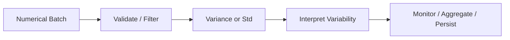
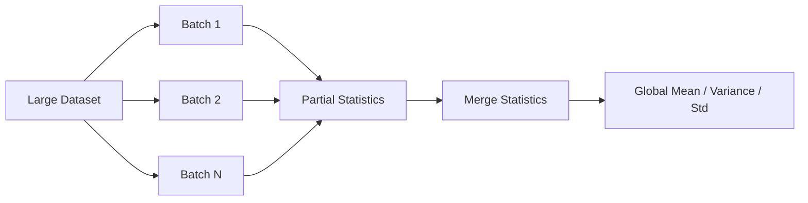

# 07- Standard Deviation and Variance

## Overview

Standard deviation and variance measure how widely numerical values are distributed around their mean.

In NumPy:

```python
np.std()
np.var()
```

are common tools for analyzing variability in:

- Request latency.
- Resource utilization.
- Batch processing times.
- Numeric measurements.
- Transaction amounts.
- Operational metrics.
- Data-quality signals.

The distinction is:

```text
variance
→ average squared deviation from the mean

standard deviation
→ square root of variance
```

They are related, but they are not interchangeable in how their results are interpreted.

For backend and data-engineering systems, the important concerns are:

```text
axis semantics
+
ddof / population vs sample behavior
+
dtype and precision
+
NaN handling
+
incremental aggregation
+
memory usage
+
outlier sensitivity
```

A typical processing flow is:



## Variance

Variance measures the average squared deviation from the mean.

Conceptually:

```text
1. Calculate the mean.
2. Calculate each value's deviation from the mean.
3. Square the deviations.
4. Average the squared deviations.
```

For an array:

```python
import numpy as np

latency_ms = np.array(
    [90.0, 100.0, 110.0, 120.0],
    dtype=np.float64,
)

variance = np.var(latency_ms)

print(variance)
```

The important property is that variance uses **squared units**.

If the input is:

```text
milliseconds
```

then variance is in:

```text
milliseconds²
```

This makes variance useful for numerical calculations but often less intuitive for operational dashboards.

## Standard Deviation

Standard deviation is the square root of variance.

```python
std = np.std(latency_ms)
```

If the input is measured in milliseconds, the standard deviation is also measured in milliseconds.

This makes standard deviation easier to interpret operationally.

For example:

```text
mean latency = 120 ms
std deviation = 15 ms
```

means the data has a typical amount of spread around the mean on the same scale as the original measurement.

## Variance vs Standard Deviation

| Property | Variance | Standard Deviation |
|---|---|---|
| NumPy | `np.var()` | `np.std()` |
| Relationship | Base dispersion measure | `sqrt(variance)` |
| Units | Squared input units | Same as input |
| Interpretability | Lower for operational reporting | Higher |
| Common use | Statistical calculations | Metrics and reporting |
| Outlier sensitivity | High | High |

Both describe dispersion, but standard deviation is usually easier to communicate to backend and operations teams.

## Population vs Sample

One of the most important details is the denominator used in the calculation.

NumPy's default behavior uses:

```text
ddof=0
```

which corresponds to the population-style calculation:

```text
divide by N
```

Example:

```python
import numpy as np

values = np.array(
    [10.0, 20.0, 30.0],
)

population_variance = np.var(
    values,
)

population_std = np.std(
    values,
)
```

For sample statistics, use:

```python
sample_variance = np.var(
    values,
    ddof=1,
)

sample_std = np.std(
    values,
    ddof=1,
)
```

The distinction matters.

Do not change `ddof` simply because `ddof=1` appears in statistical examples. Choose it based on whether the array represents the entire population of interest or a sample used to estimate a larger population.

## Understanding `ddof`

`ddof` means **delta degrees of freedom**.

The denominator is effectively:

```text
N - ddof
```

Therefore:

```text
ddof=0
→ divide by N

ddof=1
→ divide by N-1
```

This is important in reporting and testing because two implementations can use the same input values and produce different variances if their `ddof` values differ.

When a numerical result crosses a service boundary, document the convention if it is part of the business or statistical contract.

## Axis-Based Standard Deviation

For multidimensional data:

```python
import numpy as np

metrics = np.array(
    [
        [100.0, 20.0, 30.0],
        [110.0, 25.0, 28.0],
        [105.0, 22.0, 31.0],
    ],
)
```

Assume:

```text
axis 0 → records
axis 1 → metrics
```

Per-metric standard deviation:

```python
std = metrics.std(
    axis=0,
)
```

This answers:

```text
How much does each metric vary across records?
```

Per-record standard deviation:

```python
std = metrics.std(
    axis=1,
)
```

answers a different question:

```text
How much do the features within each record vary?
```

The numerical function is identical; the axis determines the meaning.

## `keepdims=True`

When the statistic will be broadcast back against the original array:

```python
std = metrics.std(
    axis=0,
    keepdims=True,
)
```

produces:

```text
metrics → (records, features)
std     → (1, features)
```

This can support standardization:

```python
mean = metrics.mean(
    axis=0,
    keepdims=True,
)

std = metrics.std(
    axis=0,
    keepdims=True,
)

standardized = (
    metrics - mean
) / std
```

The reduced dimensions remain aligned with the original data.

## Standardization Pattern

A common numerical transformation is:

```text
value - mean
---------------
     std
```

In NumPy:

```python
import numpy as np


def standardize(
    values: np.ndarray,
) -> np.ndarray:
    mean = values.mean(
        axis=0,
        keepdims=True,
    )

    std = values.std(
        axis=0,
        keepdims=True,
    )

    return (
        values - mean
    ) / std
```

This centers the data around zero and scales each feature according to its standard deviation.

However, standardization must handle zero-variance features explicitly.

## Zero-Variance Features

Consider:

```python
values = np.array(
    [
        [10.0, 100.0],
        [10.0, 200.0],
        [10.0, 300.0],
    ],
)
```

The first feature has no variation:

```text
std = 0
```

Dividing by zero can produce invalid results.

Handle this explicitly:

```python
import numpy as np


def standardize(
    values: np.ndarray,
) -> np.ndarray:
    mean = values.mean(
        axis=0,
        keepdims=True,
    )

    std = values.std(
        axis=0,
        keepdims=True,
    )

    result = np.zeros_like(
        values,
        dtype=np.float64,
    )

    np.divide(
        values - mean,
        std,
        out=result,
        where=std != 0,
    )

    return result
```

Whether a zero-variance feature should become zero, remain unchanged, or be excluded is a data-contract decision.

## NaN and Standard Deviation

Ordinary standard deviation can be affected by `NaN` values.

```python
import numpy as np

values = np.array(
    [10.0, np.nan, 30.0],
)

std = np.std(values)
```

When the intended policy is to ignore `NaN`:

```python
std = np.nanstd(values)
```

Similarly:

```python
np.nanvar(values)
```

ignores `NaN` observations.

The production question is:

```text
Should missing observations be excluded
or should their presence invalidate the aggregate?
```

Do not choose `nanstd()` automatically without answering that question.

## All-NaN Inputs

If every observation is `NaN`:

```python
import numpy as np

values = np.array(
    [np.nan, np.nan],
)

result = np.nanstd(values)
```

there is no meaningful finite dispersion statistic.

Production code should explicitly define what an all-missing input means:

- Invalid batch.
- Unknown metric.
- `NaN` result.
- Missing measurement.
- Data-quality failure.

Avoid silently replacing the result with zero.

## Infinity and Non-Finite Values

`np.nanstd()` and `np.nanvar()` ignore `NaN`, but they do not ignore infinity.

For example:

```python
values = np.array(
    [10.0, np.inf, 30.0],
)
```

contains a non-finite value even though there is no `NaN`.

If all non-finite values are invalid:

```python
finite = np.isfinite(values)
valid = values[finite]

std = valid.std() if valid.size else np.nan
```

The filtering policy should be explicit.

## Outlier Sensitivity

Variance and standard deviation are sensitive to outliers because deviations are squared during the variance calculation.

Consider:

```python
import numpy as np

latency = np.array(
    [95.0, 100.0, 105.0, 5000.0],
)

mean = latency.mean()
std = latency.std()
```

The large latency spike has a disproportionately strong influence on the result.

This makes standard deviation useful for quantifying spread, but it also means:

```text
high std
```

does not automatically mean:

```text
system is unhealthy
```

It may indicate:

- Genuine workload variability.
- A small number of outliers.
- Measurement errors.
- A distribution with multiple operating modes.

Interpret the statistic alongside other metrics.

## Standard Deviation and Median

For heavily skewed datasets, standard deviation around the mean may not fully describe the behavior.

A production observability pipeline may combine:

```text
mean
median
minimum
maximum
percentiles
standard deviation
invalid count
```

Each provides different information.

Do not use standard deviation as a substitute for percentile metrics when tail latency is the primary operational concern.

## Variance and Standard Deviation with Dtypes

Dtype affects numerical precision and memory behavior.

For example:

```python
values = np.asarray(
    values,
    dtype=np.float32,
)

std = values.std()
```

A `float32` representation consumes less memory than `float64`, but it also offers less precision.

For larger or numerically sensitive calculations, an explicit accumulation dtype can be useful:

```python
std = values.std(
    dtype=np.float64,
)
```

This trades higher-precision accumulation against additional computational or memory costs.

Choose based on:

```text
required accuracy
+
input magnitude
+
memory budget
+
downstream contract
```

## Numerical Precision

Variance involves subtracting values from a mean, squaring deviations, and accumulating them.

This makes numerical precision relevant when:

- Values are large.
- Differences are relatively small.
- There are many observations.
- `float32` is used.
- Batches are aggregated separately.

Do not assume that mathematically identical implementations will produce bit-for-bit identical results across dtypes or execution paths.

For tests, use tolerance-based comparisons when appropriate:

```python
np.testing.assert_allclose(
    actual,
    expected,
    rtol=1e-6,
    atol=1e-8,
)
```

The tolerance should reflect the expected numerical error, not simply be made large enough to make the test pass.

## Aggregating Variance Across Batches

Standard deviation is more difficult to aggregate across batches than sum.

You should not calculate:

```text
mean(batch standard deviations)
```

and treat the result as global standard deviation.

You should also not simply average batch variances when batch sizes differ.

A correct incremental approach needs sufficient state, typically including quantities such as:

```text
count
mean
sum of squared deviations
```

or an equivalent numerically stable representation.

This matters in large-data pipelines because:

```text
batch statistics
≠
global statistics
```

unless the combination rule is mathematically valid.

## Why Naive Batch Aggregation Fails

Suppose:

```text
Batch A
count = 100
variance = 4

Batch B
count = 10
variance = 100
```

A simple average:

```text
(4 + 100) / 2
```

does not correctly account for:

- Different batch sizes.
- Different batch means.
- Between-batch variation.

Global variance contains more information than a simple average of local variances.

For production systems, use a mathematically correct online or mergeable variance algorithm when exact aggregation across batches is required.

## Batch Processing Architecture

A scalable variance pipeline can maintain compact statistical state:



This avoids loading the complete dataset into memory.

For truly large workloads, the state should remain small:

```text
count
mean
variance state
```

while the raw batch can be discarded after processing.

## Empty Input

Standard deviation and variance do not have a meaningful value for an empty population.

```python
import numpy as np

values = np.array(
    [],
    dtype=np.float64,
)

std = values.std()
variance = values.var()
```

NumPy produces non-finite or warning-associated results rather than a meaningful population statistic.

Production code should define empty-input semantics explicitly:

```python
def safe_std(
    values: np.ndarray,
) -> float:
    if values.size == 0:
        return float("nan")

    return float(values.std())
```

The correct fallback depends on the application.

## `ddof` and Small Inputs

Sample standard deviation with:

```python
ddof=1
```

requires enough observations to form a meaningful estimate.

For a single observation:

```python
values = np.array(
    [10.0],
)

std = values.std(
    ddof=1,
)
```

there are insufficient degrees of freedom for a conventional sample variance estimate.

This is why pipelines using sample statistics should validate minimum observation counts.

## Degrees of Freedom as a Contract

If one service calculates:

```python
np.std(values, ddof=0)
```

and another calculates:

```python
np.std(values, ddof=1)
```

they are calculating different statistics.

If the result is serialized in an API, stored in PostgreSQL, or consumed by another service, include the statistical convention in the system design.

This prevents subtle cross-service inconsistencies.

## Backend Example: Batch Latency Variability

Suppose a Celery worker processes latency measurements:

```python
import numpy as np


def summarize_latency(
    latency_ms: np.ndarray,
) -> dict[str, float]:
    finite = np.isfinite(
        latency_ms
    )

    values = latency_ms[finite]

    if values.size == 0:
        return {
            "mean_ms": float("nan"),
            "std_ms": float("nan"),
        }

    return {
        "mean_ms": float(
            values.mean(
                dtype=np.float64
            )
        ),
        "std_ms": float(
            values.std(
                dtype=np.float64
            )
        ),
    }
```

A monitoring system can store:

```text
count
mean_ms
std_ms
```

and combine them with:

```text
maximum
percentiles
error rate
```

for a more useful operational view.

## Backend Example: Feature Variability

For a dense batch:

```python
import numpy as np


def feature_statistics(
    values: np.ndarray,
) -> dict[str, np.ndarray]:
    mean = values.mean(
        axis=0,
        keepdims=True,
    )

    variance = values.var(
        axis=0,
        keepdims=True,
    )

    std = values.std(
        axis=0,
        keepdims=True,
    )

    return {
        "mean": mean,
        "variance": variance,
        "std": std,
    }
```

Shape contract:

```text
input:
(batch, features)

output:
(1, features)
```

Preserving the dimension allows the statistics to be reused in vectorized transformations.

## PostgreSQL Considerations

PostgreSQL supports statistical aggregates such as variance and standard deviation.

For example:

```sql
SELECT
    AVG(latency_ms),
    STDDEV_POP(latency_ms),
    STDDEV_SAMP(latency_ms)
FROM request_metrics;
```

Database-side computation can be preferable when:

- The source data already resides in PostgreSQL.
- Only the resulting statistics are needed.
- Filtering can happen in the same query.
- Transferring raw rows would be expensive.

NumPy is more appropriate when the application already has the data as an array or the calculation is part of a larger in-memory numerical pipeline.

## Pandas Considerations

Pandas provides labeled standard deviation and variance operations:

```python
std = frame[
    "latency_ms"
].std()

variance = frame[
    "latency_ms"
].var()
```

Pandas has its own defaults and semantics around statistical calculations, so when moving between Pandas and NumPy, verify parameters such as degrees of freedom rather than assuming identical behavior.

When exact parity matters:

```text
same input
+
same ddof
+
same missing-data policy
+
same dtype assumptions
```

should be part of the test contract.

## Performance Considerations

Variance and standard deviation are generally linear-time operations:

```text
O(N)
```

but they typically require more arithmetic than a simple minimum or sum.

Performance is influenced by:

- Array size.
- Dtype.
- Memory layout.
- CPU.
- Number of passes or intermediate operations.
- Temporary allocations.

Memory traffic can be important because large arrays must be read even when the final output is tiny.

For large datasets:

```text
batch
→ calculate partial statistics
→ merge
→ discard batch
```

is often preferable to loading the entire input.

## Memory Considerations

A direct reduction such as:

```python
values.std()
```

returns a compact result.

However, preprocessing can create temporary arrays:

```python
valid = values[np.isfinite(values)]
std = valid.std()
```

For a large array, this can require:

```text
original array
+
boolean mask
+
filtered copy
```

If `NaN` is the only missing representation that should be ignored, `np.nanstd()` can be more direct.

For high-volume workloads, benchmark both memory and runtime rather than optimizing based only on source-code appearance.

## Monitoring and Operational Use

Standard deviation and variance can support operational monitoring, but they should not normally be used as the only alert signal.

A better metric set might include:

```text
sample count
mean
std deviation
minimum
maximum
p50
p95
p99
error count
```

For example:

```text
mean latency = 120 ms
std = 20 ms
p99 = 900 ms
```

The standard deviation alone does not describe the tail behavior adequately.

The monitoring system should track both central tendency and tail behavior where latency matters.

## Common Mistakes

### Confusing Population and Sample Statistics

`ddof=0` and `ddof=1` are different statistical definitions.

### Averaging Standard Deviations

The average of batch standard deviations is not generally the global standard deviation.

### Averaging Batch Variances

This is also not generally valid, especially when batch sizes or means differ.

### Ignoring NaN Values

Ordinary `std()` and `var()` can be affected by `NaN`.

### Treating Infinity Like NaN

NaN-aware functions do not automatically ignore infinity.

### Dividing by Zero During Standardization

A zero standard deviation indicates a constant dimension and requires an explicit policy.

### Ignoring Small Sample Sizes

Sample statistics with `ddof=1` require enough observations.

### Assuming Standard Deviation Describes Tail Latency

Standard deviation is not a percentile metric and can be insufficient for skewed operational distributions.

### Silently Changing `ddof`

Changing the degrees-of-freedom convention can create incompatible results between services or reports.

## Testing

Test the default population calculation:

```python
import numpy as np


def test_population_statistics():
    values = np.array(
        [1.0, 2.0, 3.0],
    )

    variance = np.var(values)
    std = np.std(values)

    np.testing.assert_allclose(
        variance,
        2.0 / 3.0,
    )

    np.testing.assert_allclose(
        std,
        np.sqrt(2.0 / 3.0),
    )
```

Test sample statistics:

```python
def test_sample_statistics():
    values = np.array(
        [1.0, 2.0, 3.0],
    )

    variance = np.var(
        values,
        ddof=1,
    )

    std = np.std(
        values,
        ddof=1,
    )

    np.testing.assert_allclose(
        variance,
        1.0,
    )

    np.testing.assert_allclose(
        std,
        1.0,
    )
```

Test NaN-aware behavior:

```python
def test_nanstd():
    values = np.array(
        [1.0, np.nan, 3.0],
    )

    result = np.nanstd(values)

    np.testing.assert_allclose(
        result,
        1.0,
    )
```

Also test:

- Empty input.
- Single-value input.
- All-NaN input.
- Infinite values.
- Zero-variance features.
- Different dtypes.
- `axis`.
- `keepdims`.
- `ddof`.
- Incremental aggregation against a reference calculation.

## Debugging

When a variance or standard deviation looks incorrect, inspect:

```python
print("shape:", values.shape)
print("dtype:", values.dtype)
print("count:", values.size)
print("finite:", np.isfinite(values).sum())
```

Then verify:

```text
axis
ddof
NaN policy
dtype
```

A useful debugging strategy is to compare the result with:

```python
mean = values.mean()
manual_variance = np.mean(
    np.square(
        values - mean
    )
)
```

This can validate the basic population-variance semantics for a manageable test dataset.

Do not use the manual formula as a production optimization strategy. It may create additional temporary arrays and can have different numerical characteristics.

## Interview Questions

### What is variance?

Variance measures the average squared deviation from the mean.

### What is standard deviation?

Standard deviation is the square root of variance and therefore has the same units as the original data.

### What is the difference between `ddof=0` and `ddof=1`?

`ddof=0` uses a denominator of `N`, while `ddof=1` uses `N-1`.

### Why is standard deviation often easier to interpret than variance?

It has the same units as the input values.

### Can you average batch standard deviations to get the global standard deviation?

No. Standard deviations are not directly mergeable that way.

### Can you average batch variances?

Not generally. Correct combination requires accounting for batch sizes and differences between batch means.

### How would you calculate variability for data larger than RAM?

Process batches and maintain sufficient mergeable statistical state rather than storing all raw observations.

### How do `np.std()` and `np.nanstd()` differ?

`np.nanstd()` ignores `NaN` values, while `np.std()` does not use the NaN-ignoring policy.

### Why does `ddof` matter in production?

Different services or reports using different degrees-of-freedom conventions can produce inconsistent statistics from the same raw data.

### Is standard deviation sufficient to monitor API latency?

Usually not. Latency distributions can be skewed, so standard deviation should generally be considered alongside percentiles, counts, and other operational metrics.

## Key Takeaways

- Variance measures squared dispersion around the mean, while standard deviation expresses the same spread on the original data scale.
- `ddof` is a critical correctness parameter: NumPy defaults to population-style `ddof=0`, while sample statistics commonly use `ddof=1`.
- Do not aggregate batch standard deviations or variances by simple averaging; global variability requires sufficient state that accounts for counts and batch means.
- Production pipelines must explicitly handle `NaN`, infinity, empty inputs, zero-variance dimensions, dtype precision, and small sample sizes.
- Standard deviation is useful for measuring variability but should be combined with percentiles and other operational metrics when analyzing production systems such as API latency.