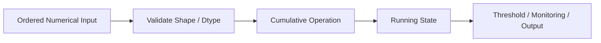
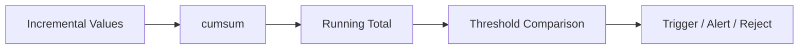
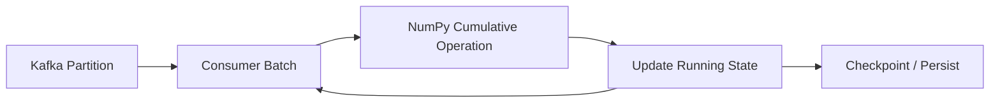

# 08- Cumulative Operations

## Overview

Cumulative operations transform a sequence into a sequence of running results.

Instead of producing one aggregate:

```text
[10, 20, 30, 40]
      ↓
sum
      ↓
100
```

a cumulative operation preserves the original length while carrying the result forward:

```text
[10, 20, 30, 40]
      ↓
cumsum
      ↓
[10, 30, 60, 100]
```

Common cumulative operations in NumPy include:

```python
np.cumsum()
np.cumprod()
np.minimum.accumulate()
np.maximum.accumulate()
```

They are useful for:

- Running totals.
- Cumulative counters.
- Inventory balances.
- Resource consumption.
- Running minimum and maximum.
- Threshold detection.
- Batch-level progress tracking.
- Time-ordered numerical processing.

The central engineering concerns are:

```text
axis
+
ordering
+
dtype
+
overflow
+
NaN handling
+
memory allocation
+
batch offsets
+
reset semantics
```

A cumulative pipeline typically looks like:



## Cumulative Sum

`np.cumsum()` calculates the running total.

```python
import numpy as np

values = np.array(
    [10, 20, 30, 40],
    dtype=np.int64,
)

running_total = np.cumsum(values)

print(running_total)
# [ 10  30  60 100]
```

Each output position represents the sum of all values up to that position.

Conceptually:

```text
10
10 + 20
10 + 20 + 30
10 + 20 + 30 + 40
```

This is useful when the intermediate cumulative state matters, not only the final total.

## Running Totals in Backend Systems

A common example is cumulative usage:

```python
import numpy as np

daily_usage = np.array(
    [120, 150, 90, 180],
    dtype=np.int64,
)

cumulative_usage = np.cumsum(
    daily_usage,
)
```

Result:

```text
[120, 270, 360, 540]
```

This pattern can represent:

- Daily storage consumption.
- Cumulative API requests.
- Running transaction volume.
- Cumulative event counts.
- Batch progress.

## Cumulative Sum Along an Axis

For a multidimensional array:

```python
import numpy as np

usage = np.array(
    [
        [10, 100],
        [20, 200],
        [30, 300],
    ],
    dtype=np.int64,
)
```

Reducing cumulatively along `axis=0`:

```python
result = np.cumsum(
    usage,
    axis=0,
)
```

produces:

```text
[
    [10, 100],
    [30, 300],
    [60, 600],
]
```

The rows represent time or sequence order, while each column maintains an independent running total.

Along `axis=1`:

```python
result = np.cumsum(
    usage,
    axis=1,
)
```

produces:

```text
[
    [10, 110],
    [20, 220],
    [30, 330],
]
```

The axis therefore defines the direction of cumulative state propagation.

## Cumulative Product

`np.cumprod()` calculates a running product.

```python
import numpy as np

factors = np.array(
    [1.1, 0.9, 1.2],
    dtype=np.float64,
)

running_product = np.cumprod(
    factors,
)

print(running_product)
```

Conceptually:

```text
1.1
1.1 × 0.9
1.1 × 0.9 × 1.2
```

Cumulative products are less common than cumulative sums in backend systems, but they can be useful for:

- Sequential multiplicative adjustments.
- Growth factors.
- Compounded rates.
- Scaling pipelines.

Because products can grow or shrink rapidly, overflow and underflow deserve more attention than they do for ordinary cumulative sums.

## Cumulative Minimum

NumPy does not require a dedicated `cummin()` function.

Use the ufunc accumulation mechanism:

```python
import numpy as np

values = np.array(
    [100, 80, 90, 70, 75],
)

running_minimum = np.minimum.accumulate(
    values,
)

print(running_minimum)
# [100  80  80  70  70]
```

Each output contains the smallest value observed so far.

This is useful for:

- Running best price.
- Lowest observed latency.
- Minimum balance.
- Historical low tracking.
- Progressive quality thresholds.

## Cumulative Maximum

Similarly:

```python
running_maximum = np.maximum.accumulate(
    values,
)
```

Example:

```python
import numpy as np

values = np.array(
    [100, 120, 110, 150, 130],
)

running_maximum = np.maximum.accumulate(
    values,
)

print(running_maximum)
# [100 120 120 150 150]
```

This tracks the largest observed value at every position.

Typical uses include:

- Running peak traffic.
- Highest observed utilization.
- Peak memory usage.
- Highest price.
- Cumulative performance records.

## Ufunc `accumulate`

Cumulative minimum and maximum illustrate a broader mechanism:

```python
ufunc.accumulate()
```

A ufunc's `accumulate` method applies the operation cumulatively along an axis.

For example:

```python
import numpy as np

values = np.array(
    [1, 2, 3, 4],
)

running_sum = np.add.accumulate(values)
running_product = np.multiply.accumulate(values)
running_min = np.minimum.accumulate(values)
running_max = np.maximum.accumulate(values)
```

This provides a useful mental model:

```text
cumsum
≈ np.add.accumulate()

cumprod
≈ np.multiply.accumulate()
```

The dedicated APIs are generally clearer for common operations, while `accumulate()` is useful when the cumulative operator itself is the important abstraction.

## Cumulative vs Ordinary Aggregation

A normal reduction returns a compact result:

```python
values.sum()
```

produces:

```text
scalar
```

A cumulative operation preserves the sequence:

```python
np.cumsum(values)
```

produces:

```text
same logical length
```

Comparison:

| Operation | Output | Typical Purpose |
|---|---|---|
| `sum()` | One aggregate | Final total |
| `cumsum()` | Running aggregate sequence | Running totals |
| `min()` | One boundary | Final minimum |
| `minimum.accumulate()` | Running boundary | Historical low |
| `max()` | One boundary | Final maximum |
| `maximum.accumulate()` | Running boundary | Historical high |
| `prod()` | One product | Final product |
| `cumprod()` | Running product | Compounded state |

## Cumulative Operations Depend on Order

Unlike a final sum or maximum, a cumulative result depends on the ordering of the input.

For example:

```text
[10, 20, 30]
→ cumsum
[10, 30, 60]
```

but:

```text
[30, 10, 20]
→ cumsum
[30, 40, 60]
```

The final sum is the same, but the intermediate state is different.

This matters in backend systems where data has a temporal or sequence dimension.

Before using a cumulative operation, establish:

```text
What is the ordering?
```

Possible ordering keys include:

- Event timestamp.
- Sequence number.
- Database offset.
- Kafka partition offset.
- Batch position.

## Cumulative Operations and Time Series

A common representation is:

```text
(time, metric)
```

For example:

```python
import numpy as np

requests = np.array(
    [
        [100, 20],
        [120, 25],
        [90, 30],
    ],
    dtype=np.int64,
)

cumulative_requests = np.cumsum(
    requests,
    axis=0,
)
```

The first axis represents chronological progression.

The cumulative result means:

```text
row 1 → total through timestamp 1
row 2 → total through timestamp 2
row 3 → total through timestamp 3
```

If the input rows are not chronologically ordered, the cumulative result may be mathematically correct but operationally meaningless.

## Cumulative Sum and Running Balance

A common accounting-like numerical pattern is a running balance:

```python
import numpy as np

deltas = np.array(
    [100.0, -30.0, 50.0, -20.0],
)

balance = 1_000.0 + np.cumsum(
    deltas,
)

print(balance)
# [1100. 1070. 1120. 1100.]
```

The calculation is:

```text
initial balance
+
cumulative net change
```

In a real financial system, exact decimal semantics and transactional state should generally be handled by the authoritative accounting layer rather than assuming binary floating-point NumPy arithmetic is sufficient.

NumPy is useful for analytical or batch processing around that authoritative state.

## Cumulative Sum and Threshold Detection

Cumulative operations are often paired with comparisons.

```python
import numpy as np

usage = np.array(
    [20, 40, 15, 50],
    dtype=np.int64,
)

cumulative = np.cumsum(usage)

limit = 100

exceeded = cumulative > limit

print(cumulative)
# [ 20  60  75 125]

print(exceeded)
# [False False False  True]
```

This creates a useful processing flow:



This can support:

- Quota enforcement.
- Batch capacity checks.
- Storage limits.
- Cumulative request budgets.

## Cumulative Min and Max for Monitoring

Running boundaries can reveal historical behavior:

```python
import numpy as np

latency = np.array(
    [120, 100, 150, 90, 130],
)

best_so_far = np.minimum.accumulate(
    latency,
)

worst_so_far = np.maximum.accumulate(
    latency,
)
```

Result:

```text
best_so_far:
[120, 100, 100, 90, 90]

worst_so_far:
[120, 120, 150, 150, 150]
```

These metrics can help identify whether a system has achieved a new best or worst value over a sequence.

## Cumulative Products and Compounding

A cumulative product can model successive multiplicative factors:

```python
import numpy as np

growth_factors = np.array(
    [1.02, 0.98, 1.05],
    dtype=np.float64,
)

cumulative_factor = np.cumprod(
    growth_factors,
)
```

The result tracks the compounded factor at each step.

Be careful with:

- Very large products.
- Very small products.
- Underflow.
- Overflow.
- Zero values.

A zero factor permanently makes all subsequent cumulative products zero.

## Dtype Considerations

Cumulative operations have the same general dtype considerations as their corresponding reductions.

For cumulative sums:

```python
values = np.array(
    [1, 2, 3],
    dtype=np.int32,
)

result = np.cumsum(values)
```

The accumulator/output dtype may differ from the input depending on NumPy's dtype rules and platform behavior.

For important numeric pipelines, make accumulation precision explicit when needed:

```python
result = np.cumsum(
    values,
    dtype=np.int64,
)
```

For floating-point processing:

```python
result = np.cumsum(
    values,
    dtype=np.float64,
)
```

can improve accumulation precision compared with a lower-precision representation.

This trades memory bandwidth and output storage size against numerical precision.

## Integer Overflow

Cumulative sums can overflow fixed-width integer dtypes.

For example:

```python
import numpy as np

values = np.array(
    [2_000_000_000, 2_000_000_000],
    dtype=np.int32,
)

result = np.cumsum(values)
```

If the chosen accumulator cannot represent the running total, the result can overflow.

For counters and large cumulative totals, select a dtype capable of representing the maximum expected total.

Do not infer safety from the fact that each individual input value fits within the input dtype.

The cumulative state can be much larger than any individual element.

## Floating-Point Accumulation

Cumulative sums of floating-point values can accumulate numerical error over long sequences.

For example:

```python
result = np.cumsum(
    values,
    dtype=np.float64,
)
```

can improve numerical behavior when the source values have lower precision.

However, floating-point cumulative results can still differ slightly from mathematically exact totals.

For numerical regression tests, use tolerance-based assertions:

```python
np.testing.assert_allclose(
    actual,
    expected,
)
```

rather than requiring exact bit-for-bit equality unless that is explicitly part of the contract.

## NaN in Cumulative Operations

A `NaN` encountered during a cumulative sum can affect subsequent results.

```python
import numpy as np

values = np.array(
    [10.0, np.nan, 20.0, 30.0],
)

result = np.cumsum(values)
```

The cumulative sequence can become non-finite after the `NaN`.

This is different from a final aggregate where a NaN-aware function may ignore the missing value.

For cumulative processing, define the missing-data policy before choosing the implementation.

A common approach is to replace or explicitly handle missing values:

```python
clean = np.nan_to_num(
    values,
    nan=0.0,
)

result = np.cumsum(clean)
```

But replacing `NaN` with zero is only correct when:

```text
NaN semantically means zero contribution
```

which is not generally true.

## Cumulative Min and Max with NaN

`np.minimum.accumulate()` and `np.maximum.accumulate()` also have to contend with `NaN`.

If a sequence can contain missing values, do not assume these operations behave like a NaN-ignoring aggregate.

When a missing-data-aware cumulative boundary is required, explicitly design the state transition.

One approach is to maintain validity separately:

```python
finite = np.isfinite(values)
```

and update cumulative state only where valid observations exist.

This may require a more explicit implementation than a single NumPy call.

## Cumulative Operations and Reset Boundaries

Real systems often need cumulative values that reset:

```text
new customer
new day
new session
new partition
new transaction group
```

A plain `np.cumsum()` does not understand business-level reset boundaries.

For example:

```text
customer A:
[10, 20, 30]

customer B:
[5, 15]
```

requires separate cumulative sequences.

A simple approach is to process each group separately.

For data already organized by group:

```python
import numpy as np


def cumulative_by_group(
    values: np.ndarray,
    group_offsets: list[tuple[int, int]],
) -> np.ndarray:
    result = np.empty_like(values)

    for start, end in group_offsets:
        result[start:end] = np.cumsum(
            values[start:end]
        )

    return result
```

For grouped tabular workloads, Pandas may provide a more natural abstraction because it can express grouped cumulative operations using explicit keys.

## Cumulative Processing Across Batches

A major production issue is preserving cumulative state across batches.

Suppose:

```text
Batch 1:
[10, 20, 30]

Batch 2:
[5, 15]
```

Independent cumulative sums produce:

```text
Batch 1:
[10, 30, 60]

Batch 2:
[5, 20]
```

But the global cumulative sequence should be:

```text
[10, 30, 60, 65, 85]
```

The second batch must start with the final cumulative value from the previous batch.

The processing model is:

```text
batch
   ↓
local cumsum
   ↓
add previous running total
   ↓
global cumulative sequence
```

## Streaming Cumulative Sum

A batch-oriented implementation can maintain a running offset:

```python
import numpy as np


def cumulative_batches(
    values: np.ndarray,
    batch_size: int,
):
    running_total = 0

    for start in range(
        0,
        values.shape[0],
        batch_size,
    ):
        batch = values[
            start:start + batch_size
        ]

        cumulative = np.cumsum(
            batch,
            dtype=np.int64,
        )

        cumulative += running_total

        running_total = int(
            cumulative[-1]
        )

        yield cumulative
```

This produces globally cumulative output while keeping memory bounded by the current batch.

The state is:

```text
running_total
```

rather than the complete historical dataset.

## Streaming Cumulative Min and Max

The same pattern applies to cumulative boundaries.

Maintain:

```text
running minimum
running maximum
```

and update each batch.

For a running maximum:

```python
import numpy as np


def maximum_batches(
    values: np.ndarray,
    batch_size: int,
):
    running_max = None

    for start in range(
        0,
        values.shape[0],
        batch_size,
    ):
        batch = values[
            start:start + batch_size
        ]

        local_max = np.maximum.accumulate(
            batch
        )

        if running_max is not None:
            local_max = np.maximum(
                local_max,
                running_max,
            )

        if local_max.size:
            running_max = local_max[-1]

        yield local_max
```

This preserves global running-maximum semantics across batches.

## Cumulative Processing and Kafka

Kafka consumers are naturally batch-oriented.

A consumer may receive:

```text
batch 1 → offsets 1000–1999
batch 2 → offsets 2000–2999
```

A cumulative operation across those records must preserve state across batches.

The architecture becomes:



For correctness, the state must align with the ordering guarantee relevant to the application.

If a worker restarts, the cumulative state must be recoverable from:

- Persisted checkpoints.
- Replayed events.
- A compacted state store.
- Another authoritative source.

Cumulative state should not exist only in process memory when it represents durable business state.

## Cumulative Processing and Celery

A Celery task that processes a large file can maintain cumulative state:

```text
file
 ↓
batch 1 → running total
batch 2 → running total
batch 3 → running total
 ↓
persist final state
```

This can reduce memory usage substantially.

However, if task retries are possible, cumulative updates must be designed to be idempotent.

Otherwise, retrying a batch can double-count its contribution.

A reliable design typically stores enough state to identify:

```text
which batch has been processed
+
what cumulative state resulted
```

before acknowledging durable progress.

## Cumulative Operations and Database State

Cumulative calculations often resemble SQL window functions.

For example:

```sql
SUM(amount) OVER (
    ORDER BY event_time
    ROWS UNBOUNDED PRECEDING
)
```

is conceptually a running sum.

This makes the execution-layer decision important:

```text
PostgreSQL
→ cumulative SQL window function

NumPy
→ cumulative processing on arrays already in Python
```

If the source data already resides in PostgreSQL and the result is naturally relational, SQL may be the better execution layer.

If the workload is already an in-memory numerical pipeline, NumPy is appropriate.

## Cumulative Operations and Pandas

Pandas has labeled cumulative operations:

```python
frame["running_total"] = (
    frame["amount"].cumsum()
)
```

and grouped workflows can express reset boundaries naturally.

NumPy is appropriate when:

```text
dense numerical array
+
known ordering
+
array-oriented processing
```

is already the representation.

Do not convert large tabular data to NumPy solely to calculate a grouped cumulative value that Pandas can already express clearly.

## Memory Behavior

Cumulative operations generally produce an output with roughly the same number of elements as the input.

For:

```python
result = np.cumsum(values)
```

the result is a separate array unless an explicit output buffer or compatible operation allows reuse.

This means:

```text
input array
+
cumulative result
```

can coexist in memory.

For very large arrays, this can materially increase peak memory.

Where supported, explicit output buffers can help:

```python
result = np.empty_like(
    values,
)

np.cumsum(
    values,
    out=result,
)
```

The exact dtype of the output should be selected deliberately when precision matters.

## Cumulative Operations vs Reductions

A reduction:

```python
values.sum()
```

returns compact state.

A cumulative operation:

```python
np.cumsum(values)
```

returns the entire running state history.

This has an important storage implication.

If the downstream consumer only needs:

```text
final total
```

use:

```python
values.sum()
```

not:

```python
np.cumsum(values)[-1]
```

The latter materializes the entire cumulative sequence unnecessarily.

This is a useful optimization principle:

```text
Need final result?
→ reduce.

Need intermediate history?
→ cumulative operation.
```

## Cumulative Operations and Performance

Cumulative operations are generally linear:

```text
O(N)
```

because each element contributes to the running result.

For simple cumulative sums, performance can be influenced by:

- Memory bandwidth.
- Dtype size.
- Contiguity.
- Allocation of the output.
- Batch size.
- CPU architecture.

For very large datasets, avoid producing the full cumulative sequence if only a final state is needed.

## Common Mistakes

### Using `cumsum()` When Only the Final Sum Is Needed

This creates unnecessary output.

Prefer:

```python
values.sum()
```

when intermediate cumulative values are not required.

### Resetting Cumulative State Incorrectly

If cumulative values are supposed to continue across batches, restarting `cumsum()` at each batch produces incorrect global results.

### Ignoring Input Ordering

Cumulative calculations are order-sensitive.

Sort or validate ordering before processing when chronological or sequence semantics matter.

### Treating NaN as Zero

Replacing missing values with zero can silently change the business meaning of the calculation.

### Ignoring Integer Overflow

The cumulative total can exceed the range of the individual values.

### Recomputing Entire History for Every New Batch

Maintain incremental state rather than recalculating the full cumulative sequence.

### Keeping Cumulative State Only in Process Memory

A worker restart can lose the state.

Persist or reconstruct durable cumulative state when correctness depends on it.

### Double-Counting on Retries

Batch-processing systems such as Celery or Kafka consumers can retry work.

Cumulative updates must account for replay and idempotency.

### Using NumPy for Grouped Cumulative Logic When Pandas or SQL Is Clearer

Explicit array manipulation can become unnecessarily complex when the data has strong grouping semantics.

## Testing

Test basic cumulative sums:

```python
import numpy as np


def test_cumulative_sum():
    values = np.array(
        [10, 20, 30],
    )

    result = np.cumsum(values)

    np.testing.assert_array_equal(
        result,
        np.array([10, 30, 60]),
    )
```

Test cumulative boundaries:

```python
def test_cumulative_bounds():
    values = np.array(
        [10, 20, 15, 30],
    )

    minimum = np.minimum.accumulate(
        values,
    )

    maximum = np.maximum.accumulate(
        values,
    )

    np.testing.assert_array_equal(
        minimum,
        np.array([10, 10, 10, 10]),
    )

    np.testing.assert_array_equal(
        maximum,
        np.array([10, 20, 20, 30]),
    )
```

Test batch continuity:

```python
def test_cumulative_batches():
    values = np.array(
        [10, 20, 30, 5, 15],
    )

    result = np.concatenate(
        list(
            cumulative_batches(
                values,
                batch_size=3,
            )
        )
    )

    np.testing.assert_array_equal(
        result,
        np.array([10, 30, 60, 65, 80]),
    )
```

Also test:

- Axis behavior.
- Dtype behavior.
- Integer overflow boundaries.
- NaN.
- Infinity.
- Empty inputs.
- Batch boundaries.
- Reset behavior.
- Retry / replay semantics when cumulative state is persisted.

## Debugging Cumulative Problems

When a cumulative sequence is incorrect, inspect:

```python
print("shape:", values.shape)
print("dtype:", values.dtype)
```

Then verify:

```text
ordering
axis
initial state
batch boundaries
reset boundaries
dtype
```

For a batch pipeline, log compact state such as:

```text
batch_id
batch_size
starting_total
ending_total
```

rather than the complete cumulative array.

For example:

```python
print(
    {
        "batch_size": batch.size,
        "starting_total": running_total,
        "ending_total": int(cumulative[-1]),
    }
)
```

This is much more useful operationally and avoids excessive logging.

## Interview Questions

### What is the difference between `sum()` and `cumsum()`?

`sum()` returns one final aggregate, while `cumsum()` returns the running aggregate at every position.

### Why are cumulative operations sensitive to ordering?

Each output depends on all preceding values, so changing the order changes the intermediate results.

### How would you calculate a cumulative sum over data larger than RAM?

Process bounded batches and add the previous batch's ending cumulative state as an offset to the next batch.

### Can cumulative minimum and maximum be processed incrementally?

Yes. Maintain the previous global minimum or maximum and combine it with each batch's cumulative boundary sequence.

### What is `ufunc.accumulate()`?

It applies a ufunc cumulatively along an axis, providing the general mechanism behind operations such as cumulative addition, multiplication, minimum, and maximum.

### Why can cumulative sum overflow even when every input element is valid?

The running total can grow beyond the representable range of the chosen accumulator dtype.

### Why should you not use `np.cumsum(values)[-1]` when only the final total is needed?

It constructs the entire cumulative result unnecessarily. `values.sum()` computes the required final aggregate directly.

### How should cumulative state survive worker restarts?

Persist or reconstruct the state from a durable source, checkpoint, or replayable event stream rather than relying only on process memory.

### How do retries affect cumulative processing?

Reprocessing the same batch can apply its contribution more than once unless the update is idempotent or the system tracks processed batch state.

### When should cumulative processing happen in PostgreSQL instead of NumPy?

When the source data is already relational and the cumulative result is naturally expressed as a SQL window function.

## Key Takeaways

- Cumulative operations preserve a running history, unlike ordinary reductions that return only a final aggregate.
- `cumsum`, `cumprod`, and ufunc `accumulate()` provide vectorized running state, while `minimum.accumulate()` and `maximum.accumulate()` track historical boundaries.
- Cumulative results are order-sensitive, so event ordering, axis semantics, batch boundaries, and reset conditions are part of correctness.
- Large or streaming datasets should preserve cumulative state across batches instead of restarting the calculation, with durable state and idempotent updates when reliability matters.
- Use a final reduction such as `sum()` instead of a cumulative operation when intermediate history is not required, avoiding unnecessary output allocation.