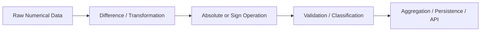

# 10- Absolute and Sign

## Overview

Absolute-value and sign operations are small but frequently useful building blocks in numerical pipelines.

NumPy provides:

```python
np.abs()
np.absolute()
np.fabs()
np.sign()
```

These operations are commonly used for:

- Error and deviation calculations.
- Distance-like comparisons.
- Threshold validation.
- Direction detection.
- Change classification.
- Data-quality checks.
- Numerical normalization.
- Batch processing.

The key engineering distinction is:

```text
absolute value
→ magnitude without direction

sign
→ direction category without magnitude
```

For backend systems, these operations often appear inside larger vectorized pipelines:



## Absolute Value

The absolute value removes the sign from a numerical value.

```python
import numpy as np

values = np.array(
    [-10.0, -2.5, 0.0, 4.0],
)

result = np.abs(values)

print(result)
# [10.   2.5  0.   4. ]
```

The mathematical transformation is:

```text
x < 0 → -x
x >= 0 → x
```

For arrays, NumPy performs this element-wise.

Typical applications include:

```text
absolute error
absolute deviation
magnitude of change
distance from a target
tolerance checks
```

## `np.absolute()` and `np.abs()`

These are equivalent interfaces:

```python
np.abs(values)
```

and:

```python
np.absolute(values)
```

Use whichever is more consistent with the codebase.

`np.absolute()` can make the operation's mathematical intent more explicit, while `np.abs()` is concise and widely used.

## Absolute Error

A common backend validation pattern is:

```python
import numpy as np

observed = np.array(
    [101.0, 98.0, 104.0],
)

expected = np.array(
    [100.0, 100.0, 100.0],
)

error = np.abs(
    observed - expected
)
```

Result:

```text
[1.0, 2.0, 4.0]
```

The sign of the difference is removed because the requirement is:

```text
How far away was the observation?
```

rather than:

```text
Was it above or below the expected value?
```

## Absolute Error with Tolerance

Absolute values are commonly combined with comparisons:

```python
within_tolerance = (
    np.abs(
        observed - expected
    )
    <= tolerance
)
```

For example:

```python
import numpy as np

observed = np.array(
    [101.0, 97.0, 105.0],
)

expected = 100.0
tolerance = 5.0

valid = np.abs(
    observed - expected
) <= tolerance

print(valid)
# [ True  True  True]
```

This pattern is useful for:

- Numerical validation.
- Sensor tolerance checks.
- Data-quality rules.
- Regression-test validation.
- Service-level measurements.

## Absolute vs Relative Error

Absolute error:

```python
absolute_error = np.abs(
    observed - expected
)
```

can be misleading when values have very different magnitudes.

Relative error can be expressed as:

```python
relative_error = np.divide(
    np.abs(observed - expected),
    np.abs(expected),
    out=np.full(
        expected.shape,
        np.nan,
        dtype=np.float64,
    ),
    where=expected != 0,
)
```

Conceptually:

```text
absolute error
----------------
expected magnitude
```

The two metrics answer different questions:

| Metric | Meaning |
|---|---|
| Absolute error | How large is the difference in original units? |
| Relative error | How large is the difference compared with the reference magnitude? |

Do not substitute one for the other without a domain reason.

## Zero Reference Values

Relative error becomes problematic when the reference value is zero:

```text
expected = 0
```

Division by zero is undefined.

Use an explicit policy:

```text
expected == 0
→
use absolute tolerance
or
apply domain-specific zero handling
```

For example:

```python
valid = np.where(
    expected == 0,
    np.abs(observed) <= tolerance,
    np.abs(
        observed - expected
    ) / np.abs(expected) <= relative_tolerance,
)
```

For production code, separating the two cases can be clearer than compressing everything into one expression.

## Absolute Value and Floating-Point Values

Absolute value does not solve floating-point precision issues.

For example:

```python
difference = np.abs(
    actual - expected
)
```

may produce a very small non-zero difference even when the mathematical values appear equal.

For floating-point comparisons, use:

```python
np.isclose()
```

when approximate equality is intended.

Absolute value is often one component of that comparison, not a complete replacement for it.

## Absolute Value and NaN

`np.abs()` preserves `NaN`:

```python
import numpy as np

values = np.array(
    [-10.0, np.nan, 20.0],
)

result = np.abs(values)

print(result)
# [10. nan 20.]
```

Absolute value cannot make an invalid value valid.

If missing values are expected, define a policy separately:

```python
finite = np.isfinite(values)
```

Do not use absolute value as an implicit cleaning step.

## Absolute Value and Infinity

Infinity remains infinite:

```python
import numpy as np

values = np.array(
    [-np.inf, -10.0, 10.0, np.inf],
)

result = np.abs(values)

print(result)
# [inf 10. 10. inf]
```

If the pipeline requires finite values, validate with:

```python
np.isfinite(values)
```

after or before the transformation as appropriate.

## Signed Integers and Minimum Values

A subtle edge case exists for fixed-width signed integers.

For a signed integer dtype, the most negative value may not have a representable positive counterpart in the same dtype.

For example:

```python
import numpy as np

values = np.array(
    [-128],
    dtype=np.int8,
)

result = np.abs(values)
```

The mathematical absolute value is:

```text
128
```

but `int8` cannot represent `128`.

The result can therefore overflow in the fixed-width dtype.

For boundary-sensitive integer processing, consider widening the dtype before applying absolute value:

```python
safe = values.astype(
    np.int16
)

result = np.abs(safe)
```

The broader lesson is:

```text
absolute value can increase the required numeric range
```

even though the operation appears simple.

## `np.fabs()`

`np.fabs()` returns the absolute value for floating-point values.

```python
import numpy as np

values = np.array(
    [-10.5, 2.25, -3.75],
)

result = np.fabs(values)
```

For ordinary backend numerical processing, `np.abs()` is generally the clearer default because it works naturally across numeric dtypes and expresses the operation directly.

Use `np.fabs()` when the floating-point-specific semantics are intentional.

## Sign Function

`np.sign()` classifies values by sign:

```python
import numpy as np

values = np.array(
    [-10.0, -0.0, 0.0, 5.0],
)

result = np.sign(values)

print(result)
# [-1.  0.  0.  1.]
```

Conceptually:

```text
negative → -1
zero     →  0
positive → +1
```

The sign operation removes magnitude and retains directional information.

## Sign for Change Direction

A common backend use case is classifying whether a metric increased or decreased:

```python
import numpy as np

current = np.array(
    [110.0, 95.0, 100.0],
)

previous = np.array(
    [100.0, 100.0, 100.0],
)

change = current - previous
direction = np.sign(change)
```

Result:

```text
[ 1. -1.  0.]
```

The interpretation is:

```text
+1 → increased
-1 → decreased
 0 → unchanged
```

This can be useful for compact categorical state generation.

## Sign and Business Categories

A numerical sign can be converted into application-level categories:

```python
import numpy as np

change = np.array(
    [20.0, -5.0, 0.0],
)

direction = np.sign(change)

labels = np.select(
    [
        direction > 0,
        direction < 0,
    ],
    [
        "increase",
        "decrease",
    ],
    default="unchanged",
)
```

This separates:

```text
numerical classification
```

from:

```text
business representation
```

which is useful at service boundaries.

## Sign Does Not Measure Magnitude

Consider:

```python
values = np.array(
    [-1.0, -1000.0, 5.0],
)
```

Both negative values produce:

```text
-1
```

with `np.sign()`.

Therefore:

```text
np.sign()
→ direction

np.abs()
→ magnitude
```

Together, they can reconstruct the original value conceptually:

```python
magnitude = np.abs(values)
direction = np.sign(values)

reconstructed = (
    magnitude * direction
)
```

For ordinary finite values, this recovers the original sign and magnitude relationship, although dtype and special-value semantics should still be considered.

## Combining Absolute Value and Sign

This combination is useful when a pipeline needs both:

```text
how much did it change?
+
which direction did it change?
```

Example:

```python
import numpy as np

change = np.array(
    [25.0, -10.0, 0.0],
)

magnitude = np.abs(change)
direction = np.sign(change)
```

Result:

```text
magnitude → [25, 10, 0]
direction → [1, -1, 0]
```

A monitoring pipeline can then store both metrics.

## Absolute Deviation from a Baseline

Suppose a service has an expected latency baseline:

```python
import numpy as np

latency = np.array(
    [95.0, 130.0, 160.0, 90.0],
)

baseline = 100.0

deviation = np.abs(
    latency - baseline
)
```

This gives:

```text
[5, 30, 60, 10]
```

The absolute deviation can then be thresholded:

```python
alert = deviation > 50.0
```

This is often more useful than using the raw values when the business rule is based on distance from a target.

## Absolute Value and Aggregation

Absolute values can be aggregated to produce useful summary statistics.

For example, mean absolute error:

```python
import numpy as np

error = predicted - actual

mae = np.mean(
    np.abs(error)
)
```

The pipeline is:

```text
prediction
   ↓
difference
   ↓
absolute value
   ↓
mean
   ↓
average error magnitude
```

This pattern is useful for batch validation and numerical regression analysis.

## Absolute Value and Maximum Error

The maximum absolute error can be calculated as:

```python
max_error = np.max(
    np.abs(
        predicted - actual
    )
)
```

For very large arrays, a more allocation-conscious approach may use a reusable buffer:

```python
error = np.empty_like(
    predicted,
)

np.subtract(
    predicted,
    actual,
    out=error,
)

np.abs(
    error,
    out=error,
)

max_error = error.max()
```

This can reduce intermediate allocations when memory pressure is measurable.

## Sign and Threshold Detection

Sign can simplify directional checks:

```python
change = current - previous

increased = np.sign(change) > 0
decreased = np.sign(change) < 0
unchanged = np.sign(change) == 0
```

For simple conditions, direct comparisons may be clearer:

```python
increased = current > previous
decreased = current < previous
unchanged = current == previous
```

Use `np.sign()` when the sign itself is useful downstream.

Do not introduce it merely to make a simple comparison more complicated.

## Absolute Value and Broadcasting

Absolute value works naturally after broadcasted arithmetic:

```python
import numpy as np

observed = np.array(
    [
        [100.0, 200.0, 300.0],
        [110.0, 190.0, 280.0],
    ],
)

baseline = np.array(
    [100.0, 200.0, 300.0],
)

absolute_error = np.abs(
    observed - baseline
)
```

Shapes:

```text
observed → (2, 3)
baseline → (3,)
result   → (2, 3)
```

This is a common pattern for per-feature error calculation.

## Absolute Value and Batch Processing

Absolute transformations are naturally batch-friendly.

```python
import numpy as np


def absolute_error_batches(
    observed: np.ndarray,
    expected: np.ndarray,
    batch_size: int,
):
    for start in range(
        0,
        observed.shape[0],
        batch_size,
    ):
        current = observed[
            start:start + batch_size
        ]

        target = expected[
            start:start + batch_size
        ]

        yield np.abs(
            current - target
        )
```

The processing model is:

```text
large dataset
    ↓
bounded batch
    ↓
vectorized difference
    ↓
absolute value
    ↓
downstream aggregation
```

This limits peak memory usage.

## Memory Considerations

A direct expression:

```python
absolute_error = np.abs(
    observed - expected
)
```

may require:

```text
difference temporary
+
absolute-error result
```

for large arrays.

If memory is constrained, reuse buffers:

```python
error = np.empty_like(
    observed,
)

np.subtract(
    observed,
    expected,
    out=error,
)

np.abs(
    error,
    out=error,
)
```

This reduces intermediate storage but increases implementation complexity.

Optimize this pattern only when profiling shows material allocation pressure.

## Sign Operations and Memory

`np.sign()` produces an output array when applied to an array:

```python
direction = np.sign(
    values
)
```

For a very large input, the output can still consume significant memory.

If the downstream operation only needs a boolean condition:

```python
positive = values > 0
```

may be simpler and more memory-efficient than:

```python
direction = np.sign(values)
positive = direction > 0
```

Choose the representation based on the actual requirement.

## Integer Dtype and Sign

For signed integers:

```python
values = np.array(
    [-5, 0, 10],
    dtype=np.int32,
)
```

`np.sign()` produces the corresponding directional values.

For unsigned integers, values cannot be negative, so the result is correspondingly restricted.

This is another reason to normalize numeric dtypes deliberately when a pipeline depends on signedness.

## Floating-Point Negative Zero

Floating-point numbers can distinguish `-0.0` from `0.0` at the representation level.

NumPy's `np.sign()` returns zero for both:

```python
import numpy as np

values = np.array(
    [-0.0, 0.0],
)

result = np.sign(values)
```

The numerical sign classification is:

```text
0
0
```

If the application needs to preserve the distinction between positive and negative zero, `np.sign()` is not sufficient as the only representation.

That is an uncommon requirement in backend applications, but it is relevant when numerical representation itself carries meaning.

## Complex Numbers

Absolute value has meaningful behavior for complex numbers:

```python
import numpy as np

values = np.array(
    [3 + 4j],
)

result = np.abs(values)

print(result)
# [5.]
```

The magnitude is calculated from the real and imaginary components.

Sign semantics for complex numbers are different and should not be treated as ordinary negative/zero/positive classification.

For the backend-oriented numerical workloads covered here, prefer explicit real-valued inputs unless complex arithmetic is part of a documented requirement.

## Input Validation

When absolute and sign operations are applied to externally supplied data, validate:

- Input shape.
- Numeric dtype.
- Expected range.
- Maximum number of elements.
- Finite-value requirements.
- Signedness where relevant.

For example:

```python
import numpy as np


def validate_numeric_input(
    values: np.ndarray,
) -> None:
    if values.ndim != 2:
        raise ValueError(
            "Expected a 2D array"
        )

    if not np.issubdtype(
        values.dtype,
        np.number,
    ):
        raise TypeError(
            "Expected numeric dtype"
        )
```

This is especially important when arrays are constructed from API or file inputs.

## Backend Example: Detect Direction and Magnitude

A monitoring worker may calculate both change direction and magnitude:

```python
import numpy as np


def summarize_change(
    current: np.ndarray,
    previous: np.ndarray,
) -> dict[str, np.ndarray]:
    change = current - previous

    return {
        "magnitude": np.abs(change),
        "direction": np.sign(change),
    }
```

The output preserves two separate semantics:

```text
magnitude
→ how much

direction
→ which way
```

This can be useful for downstream aggregation or event classification.

## Backend Example: Error Validation

A numerical processing service can calculate an error mask:

```python
import numpy as np


def within_tolerance(
    observed: np.ndarray,
    expected: np.ndarray,
    tolerance: float,
) -> np.ndarray:
    error = np.abs(
        observed - expected
    )

    return error <= tolerance
```

The function is suitable for:

```text
batch validation
+
quality checks
+
regression verification
```

The same pattern can be extended with:

```python
np.isfinite(observed)
```

when non-finite inputs must be rejected.

## PostgreSQL Considerations

Absolute values and sign logic can also be expressed in SQL:

```sql
SELECT ABS(actual - expected)
FROM measurements;
```

and:

```sql
SIGN(actual - expected)
```

When the source is already in PostgreSQL and the operation is part of a relational query, database-side execution may reduce network transfer and application memory use.

Use NumPy when the data is already represented as arrays or when the operation belongs to a larger numerical pipeline.

## Pandas Considerations

Pandas can apply NumPy's functions directly to labeled data:

```python
frame["error"] = np.abs(
    frame["actual"]
    - frame["expected"]
)

frame["direction"] = np.sign(
    frame["actual"]
    - frame["expected"]
)
```

This preserves DataFrame alignment while using NumPy's numerical operations.

Use Pandas when the column labels and tabular semantics are important.

Use NumPy directly when the data is already a dense array.

## Performance Considerations

Absolute value and sign are element-wise operations:

```text
O(N)
```

They are generally straightforward to vectorize.

Practical performance is influenced by:

- Dtype.
- Array size.
- Memory layout.
- Contiguity.
- Temporary arrays.
- Output allocation.
- Batch size.

For example:

```python
np.abs(
    observed - expected
)
```

may require more memory traffic than a reusable-buffer implementation.

For most applications, the simple vectorized expression is the correct baseline.

Optimize only after measuring.

## Common Mistakes

### Using Absolute Value When Direction Matters

`np.abs()` intentionally removes the sign.

If the direction of a change matters, preserve the original difference or calculate `np.sign()` separately.

### Using Sign When Magnitude Matters

`np.sign()` reduces every non-zero value to directional information.

It cannot replace the original magnitude.

### Using `np.sign()` for Simple Boolean Checks

If the only requirement is:

```text
is positive?
```

use:

```python
values > 0
```

rather than generating an unnecessary sign array.

### Ignoring Integer Overflow for `abs()`

The most-negative fixed-width integer may not have a representable positive counterpart in the same dtype.

### Treating NaN as Zero

Neither `abs()` nor `sign()` converts missing values into valid measurements.

### Ignoring Non-Finite Values

Infinity remains infinity after `abs()`.

### Creating Multiple Large Temporary Arrays

Expressions such as:

```python
np.abs(
    observed - expected
)
```

can create intermediates for large datasets.

### Applying Sign After Premature Rounding

Rounding can turn a very small change into zero and therefore change the sign classification.

### Pushing Exact Business Rules into Generic Numerical Helpers

For threshold or financial logic, define the intended semantics explicitly rather than assuming generic numerical operations match the business contract.

## Testing

Test absolute values:

```python
import numpy as np


def test_absolute_value():
    values = np.array(
        [-10.0, 0.0, 15.0],
    )

    result = np.abs(values)

    np.testing.assert_allclose(
        result,
        np.array([10.0, 0.0, 15.0]),
    )
```

Test sign:

```python
def test_sign():
    values = np.array(
        [-10.0, 0.0, 15.0],
    )

    result = np.sign(values)

    np.testing.assert_array_equal(
        result,
        np.array([-1.0, 0.0, 1.0]),
    )
```

Test error tolerance:

```python
def test_absolute_error():
    observed = np.array(
        [101.0, 98.0, 107.0],
    )

    expected = np.array(
        [100.0, 100.0, 100.0],
    )

    result = np.abs(
        observed - expected
    )

    np.testing.assert_allclose(
        result,
        np.array([1.0, 2.0, 7.0]),
    )
```

Also test:

- `NaN`.
- Positive and negative infinity.
- Signed integer boundaries.
- Negative zero where relevant.
- Different dtypes.
- Broadcasting.
- Large batches.
- Zero-reference relative-error cases.

## Debugging

When absolute or sign calculations look incorrect, inspect the original difference before applying the transformation:

```python
change = current - previous

print("change:", change)
print("abs:", np.abs(change))
print("sign:", np.sign(change))
```

This separates:

```text
arithmetic error
```

from:

```text
absolute/sign transformation
```

Also inspect:

```python
print("dtype:", change.dtype)
print("finite:", np.isfinite(change).all())
```

For large production batches, log compact counts rather than full arrays:

```python
print(
    {
        "positive": int(
            np.count_nonzero(change > 0)
        ),
        "negative": int(
            np.count_nonzero(change < 0)
        ),
        "zero": int(
            np.count_nonzero(change == 0)
        ),
    }
)
```

## Interview Questions

### What does `np.abs()` do?

It computes the element-wise absolute value, preserving magnitude while removing direction.

### What does `np.sign()` return?

It identifies the sign of each value, typically producing `-1`, `0`, or `1` for real-valued inputs.

### When would you use both absolute value and sign?

When the application needs both the magnitude of a change and its direction.

### Why can `np.abs()` overflow for a signed integer?

A fixed-width signed integer's minimum value may not have a representable positive counterpart in the same dtype.

### Does `np.abs()` remove `NaN`?

No. `NaN` remains `NaN`.

### Why might `values > 0` be preferable to `np.sign(values) > 0`?

The comparison directly expresses the required boolean condition and avoids allocating an intermediate sign array.

### How would you calculate mean absolute error?

Subtract the expected values from observed values, apply `np.abs()`, then calculate the mean:

```python
np.mean(np.abs(observed - expected))
```

### How would you process absolute-error calculations on data larger than RAM?

Process the data in bounded batches and aggregate the resulting errors incrementally.

### Why is the order of rounding and sign classification important?

Rounding can turn a small positive or negative difference into zero, changing the resulting sign classification.

### When should absolute/sign calculations happen in PostgreSQL?

When the source data is already relational and the calculation can be safely performed in the database before transferring data to the application.

## Key Takeaways

- `np.abs()` preserves magnitude while removing direction, whereas `np.sign()` preserves direction while discarding magnitude.
- Absolute value is useful for error and tolerance calculations, while sign is useful for classifying increases, decreases, and unchanged values.
- Fixed-width integer boundaries, `NaN`, infinity, floating-point precision, and zero-reference cases require explicit handling in production numerical pipelines.
- For large arrays, simple vectorized expressions are the baseline; optimize temporary allocations only when profiling shows meaningful CPU or memory pressure.
- Keep numerical transformations separate from business semantics: thresholding, financial rules, missing-data policies, and execution-layer choices should be explicit rather than hidden inside generic helpers.