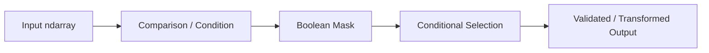

# 11- Conditional Operations

## Overview

Conditional operations allow NumPy pipelines to choose values, filter records, or derive outputs based on element-wise conditions.

The most important tools are:

```python
np.where()
np.select()
np.clip()
np.maximum()
np.minimum()
np.where(..., ...)
```

These operations are closely related to:

```text
comparison
+
boolean masking
+
broadcasting
+
vectorization
```

They are useful for:

- Data validation.
- Threshold-based transformations.
- Categorization.
- Default values.
- Missing-value handling.
- Range enforcement.
- Batch processing.
- Feature and metric transformations.

A typical conditional pipeline is:



The engineering goal is to keep conditional logic vectorized, explicit, memory-aware, and aligned with the business rule being implemented.

## Conditional Logic in NumPy

A NumPy condition normally produces a boolean array.

```python
import numpy as np

latency_ms = np.array(
    [80.0, 120.0, 450.0, 95.0],
)

slow = latency_ms > 200.0

print(slow)
# [False False  True False]
```

The boolean result can then drive a conditional transformation.

This separates:

```text
condition
```

from:

```text
selected result
```

and is one of the core patterns in NumPy data processing.

## `np.where()`

`np.where()` is useful when there are two possible outputs:

```text
condition
→ value A when true
→ value B when false
```

Example:

```python
import numpy as np

latency_ms = np.array(
    [80.0, 120.0, 450.0],
)

status = np.where(
    latency_ms > 200.0,
    "slow",
    "normal",
)

print(status)
# ['normal' 'normal' 'slow']
```

The condition and both result expressions are broadcast to compatible shapes.

## Numeric Conditional Transformation

`np.where()` is particularly useful when both branches are numerical.

```python
import numpy as np

values = np.array(
    [-10.0, 5.0, -3.0, 8.0],
)

positive_values = np.where(
    values > 0,
    values,
    0.0,
)
```

Result:

```text
[0.0, 5.0, 0.0, 8.0]
```

This expresses a conditional transformation without a Python loop.

## `np.where()` for Default Values

A common backend pattern is replacing invalid values with a fallback:

```python
import numpy as np

values = np.array(
    [10.0, np.nan, 30.0],
)

safe_values = np.where(
    np.isnan(values),
    0.0,
    values,
)
```

However, this is only correct when:

```text
NaN → 0
```

is a valid business rule.

For many systems, missing data should remain missing or be rejected.

The operation is technically simple; the semantics are not.

## `np.where()` vs Boolean Indexing

These operations solve different problems.

Use `np.where()` when you need:

```text
same-shaped output
+
conditional value selection
```

Use boolean indexing when you need:

```text
only matching elements
```

For example:

```python
filtered = values[values > 100]
```

returns only the selected values.

Whereas:

```python
result = np.where(
    values > 100,
    values,
    0,
)
```

keeps the original shape.

| Requirement | Preferred Pattern |
|---|---|
| Keep shape, choose between values | `np.where()` |
| Remove non-matching elements | Boolean indexing |
| Multiple ordered conditions | `np.select()` |
| Enforce numeric range | `np.clip()` / `minimum` / `maximum` |

## Broadcasting in Conditional Operations

Conditions and result values can broadcast.

```python
import numpy as np

records = np.array(
    [
        [10.0, 20.0, 30.0],
        [15.0, 25.0, 35.0],
    ],
)

thresholds = np.array(
    [12.0, 22.0, 32.0],
)

result = np.where(
    records > thresholds,
    records,
    thresholds,
)
```

Shapes:

```text
records    → (2, 3)
thresholds → (3,)
result     → (2, 3)
```

This is useful for per-feature defaults and thresholds.

## Multiple Conditions with `np.select()`

When there are more than two branches, nested `np.where()` expressions can become difficult to read.

```python
import numpy as np

latency_ms = np.array(
    [50.0, 150.0, 350.0],
)

conditions = [
    latency_ms < 100.0,
    latency_ms < 300.0,
]

choices = [
    "healthy",
    "warning",
]

status = np.select(
    conditions,
    choices,
    default="critical",
)
```

Result:

```text
['healthy', 'warning', 'critical']
```

The conditions are evaluated in order.

The first matching condition determines the result.

## Ordering Rules in `np.select()`

Consider:

```python
conditions = [
    values > 100,
    values > 200,
]
```

The second condition is never selected for values above `200` if the first condition already matches.

Therefore, condition ordering matters.

For classification logic:

```text
most specific / highest priority
→
less specific
→
default
```

should be intentional.

A good production practice is to document the precedence when the rules represent business policy.

## Nested `np.where()` vs `np.select()`

Nested `np.where()`:

```python
result = np.where(
    condition_a,
    value_a,
    np.where(
        condition_b,
        value_b,
        default,
    ),
)
```

can work for a small number of conditions.

For several mutually exclusive rules:

```python
result = np.select(
    [
        condition_a,
        condition_b,
        condition_c,
    ],
    [
        value_a,
        value_b,
        value_c,
    ],
    default=default,
)
```

is usually easier to review.

Do not create deeply nested conditional expressions that hide business-rule precedence.

## Boolean Masking

Conditional operations often start with masks:

```python
import numpy as np

values = np.array(
    [10.0, 20.0, 30.0, 40.0],
)

mask = (
    (values >= 20.0)
    & (values <= 35.0)
)
```

The mask can then be used for:

```python
selected = values[mask]
```

or:

```python
result = np.where(
    mask,
    values,
    0.0,
)
```

The distinction is:

```text
masking
→ identify values

conditional selection
→ construct an output from the condition
```

## Combining Conditions

Use NumPy's element-wise boolean operators:

```python
&
|
~
```

Example:

```python
valid = (
    (values >= minimum)
    & (values <= maximum)
)
```

Always parenthesize each comparison.

Do not use:

```python
(values > 10) and (values < 100)
```

because Python's `and` expects scalar truth semantics rather than element-wise array logic.

## `np.clip()`

`np.clip()` constrains values to a lower and upper bound.

```python
import numpy as np

values = np.array(
    [-10.0, 20.0, 120.0],
)

clipped = np.clip(
    values,
    0.0,
    100.0,
)

print(clipped)
# [  0.  20. 100.]
```

Conceptually:

```text
below minimum → minimum
inside range   → unchanged
above maximum  → maximum
```

This is useful for:

- Bounded metrics.
- Rate limits.
- Normalized values.
- Saturation logic.
- Input transformations.

## Clamping vs Validation

Clipping is not the same as validation.

```python
clipped = np.clip(
    values,
    0.0,
    100.0,
)
```

changes invalid inputs into valid-looking values.

That can be appropriate when the system intentionally saturates values.

It can be dangerous when out-of-range values indicate corrupted data.

For validation:

```python
valid = (
    (values >= 0.0)
    & (values <= 100.0)
)
```

preserves the fact that the input was invalid.

Production systems should choose deliberately between:

```text
reject
+
monitor
```

and:

```text
clamp
+
continue
```

## `np.minimum()` and `np.maximum()`

Conditional bounds can also be implemented with:

```python
bounded = np.maximum(
    values,
    minimum,
)

bounded = np.minimum(
    bounded,
    maximum,
)
```

This is useful when each boundary is itself an array and needs broadcasting.

For example:

```python
import numpy as np

values = np.array(
    [
        [10.0, 50.0],
        [20.0, 80.0],
    ],
)

minimum = np.array(
    [15.0, 40.0],
)

maximum = np.array(
    [18.0, 70.0],
)

bounded = np.minimum(
    np.maximum(
        values,
        minimum,
    ),
    maximum,
)
```

The bounds are applied independently to each feature.

## Conditional Arithmetic

Conditions can be combined with arithmetic transformations.

```python
import numpy as np

amounts = np.array(
    [50.0, 150.0, 250.0],
)

discounted = np.where(
    amounts >= 200.0,
    amounts * 0.90,
    amounts,
)
```

This means:

```text
amount >= 200
→ apply 10% discount

otherwise
→ keep amount unchanged
```

For production systems, business rules should remain readable enough to audit.

## Conditional Division

Division requires special handling when the denominator may be zero.

Prefer:

```python
import numpy as np

numerator = np.array(
    [10.0, 20.0, 30.0],
)

denominator = np.array(
    [2.0, 0.0, 5.0],
)

result = np.divide(
    numerator,
    denominator,
    out=np.full(
        numerator.shape,
        np.nan,
        dtype=np.float64,
    ),
    where=denominator != 0,
)
```

This differs from:

```python
np.where(
    denominator != 0,
    numerator / denominator,
    np.nan,
)
```

because the expression `numerator / denominator` may still be evaluated before `where` constructs the result.

When avoiding an invalid mathematical operation itself is important, `np.divide(..., where=...)` is the more direct approach.

## Conditional Aggregation

Conditions can be combined with reductions.

For example, count values above a threshold:

```python
import numpy as np

latency = np.array(
    [80.0, 120.0, 450.0, 300.0],
)

slow_count = np.count_nonzero(
    latency > 200.0
)
```

Or calculate a conditional sum:

```python
slow_total = np.sum(
    latency,
    where=latency > 200.0,
)
```

This can avoid explicitly constructing a filtered copy in some workflows.

## Conditional Statistics

A condition can define the population included in an aggregate.

For example:

```python
import numpy as np

values = np.array(
    [10.0, 20.0, 100.0, 200.0],
)

average_large = np.mean(
    values,
    where=values >= 100.0,
)
```

This is useful when the intended calculation is:

```text
aggregate values satisfying a condition
```

instead of:

```text
filter into a new array
+
aggregate filtered array
```

The condition should still be documented because it defines the statistical population.

## Missing Values and Conditional Logic

A common pattern is:

```python
import numpy as np

values = np.array(
    [10.0, np.nan, 30.0],
)

valid = np.isfinite(values)

result = np.where(
    valid,
    values,
    -1.0,
)
```

Whether `-1` is an appropriate fallback depends entirely on the data contract.

For numerical pipelines, a better approach is often to preserve:

```text
value
+
validity state
```

rather than encoding missingness into an arbitrary numeric sentinel.

For example:

```python
finite = np.isfinite(values)
```

can be carried alongside the numerical array.

## `np.where()` and Missing Data

Do not assume `np.where()` itself ignores invalid values.

For example:

```python
result = np.where(
    np.isnan(values),
    fallback,
    values,
)
```

constructs an output but does not define whether the fallback is statistically or operationally correct.

A better design separates:

```text
missing-data policy
```

from:

```text
conditional mechanism
```

## Conditional Operations with `NaN`

Conditions involving `NaN` can be surprising because:

```python
np.nan > 10
```

and:

```python
np.nan < 10
```

are false.

Similarly:

```python
np.nan == np.nan
```

is false.

Use:

```python
np.isnan(values)
```

or:

```python
np.isfinite(values)
```

when invalid-value detection is the actual requirement.

## Conditional Operations and Dtypes

Both branches of `np.where()` must produce a compatible output representation.

For example:

```python
import numpy as np

values = np.array(
    [10, 20, 30],
    dtype=np.int64,
)

result = np.where(
    values > 15,
    values,
    0.5,
)
```

The result must accommodate both integer and floating-point branches, so dtype promotion occurs.

When dtype matters, make the intended output type explicit.

Do not assume that adding a single floating-point fallback preserves an integer output.

## Strings and Object Dtypes

Conditional operations can produce non-numeric outputs:

```python
status = np.where(
    latency > 200,
    "slow",
    "normal",
)
```

This can be useful for compact transformations, but strings generally consume more memory and offer less efficient numerical processing than numeric or boolean representations.

When a categorical state is consumed downstream, consider whether:

```text
boolean
+
integer code
+
enum at application boundary
```

would be more appropriate than storing large arrays of strings.

## Conditional Operations and Broadcasting

Conditions, true-values, and false-values can all participate in broadcasting.

For example:

```python
import numpy as np

values = np.array(
    [
        [10.0, 20.0, 30.0],
        [40.0, 50.0, 60.0],
    ],
)

minimum = np.array(
    [15.0, 15.0, 25.0],
)

result = np.where(
    values < minimum,
    minimum,
    values,
)
```

Shapes:

```text
values   → (2, 3)
minimum  → (3,)
result   → (2, 3)
```

This is a practical pattern for per-feature lower bounds.

## Conditional Operations and Memory

Conditional operations normally produce a result array.

For example:

```python
result = np.where(
    condition,
    values,
    fallback,
)
```

requires output storage.

The condition itself may already occupy memory:

```text
condition mask
+
result array
```

For very large arrays, multiple nested conditions can increase peak memory.

Memory-aware alternatives include:

- Batch processing.
- Reusing output buffers.
- In-place operations where safe.
- Reducing before materializing large outputs.
- Moving filtering closer to the source.

Do not optimize away readable code until memory pressure is measured.

## Conditional Operations with `out=`

Some ufunc-based conditional operations can reuse output buffers.

For example, a bounded transformation can use:

```python
import numpy as np

values = np.asarray(
    values,
    dtype=np.float32,
)

result = np.empty_like(
    values,
)

np.maximum(
    values,
    0.0,
    out=result,
)
```

This is preferable to a more complex conditional implementation when the requirement is simply to enforce a lower bound.

Choose the simplest operation that expresses the actual rule.

## Backend Example: Validation and Status

A service can classify request latency:

```python
import numpy as np


def classify_latency(
    latency_ms: np.ndarray,
) -> np.ndarray:
    conditions = [
        latency_ms < 100.0,
        latency_ms < 300.0,
    ]

    choices = [
        "healthy",
        "warning",
    ]

    return np.select(
        conditions,
        choices,
        default="critical",
    )
```

The pipeline is:

```text
raw latency
   ↓
threshold comparisons
   ↓
ordered classification
   ↓
status labels
```

If these labels cross a service boundary, keep the classification contract stable and test threshold precedence explicitly.

## Backend Example: Data-Quality Rules

A batch can be validated with several independent conditions:

```python
import numpy as np


def valid_records(
    amount: np.ndarray,
    status_code: np.ndarray,
) -> np.ndarray:
    valid_amount = (
        np.isfinite(amount)
        & (amount >= 0.0)
    )

    successful = (
        status_code >= 200
    ) & (
        status_code < 300
    )

    return valid_amount & successful
```

The result is a record-level mask.

It can then be used to:

```python
valid_amounts = amount[
    valid_records(amount, status_code)
]
```

or:

```python
accepted = np.where(
    valid_records(amount, status_code),
    amount,
    0.0,
)
```

The first filters records; the second preserves shape.

## Backend Example: Normalized Bounded Output

A common pipeline is:

```text
raw numeric value
    ↓
normalize
    ↓
clamp
    ↓
classify
```

For example:

```python
import numpy as np


def normalize_score(
    values: np.ndarray,
    minimum: float,
    maximum: float,
) -> np.ndarray:
    span = maximum - minimum

    normalized = np.divide(
        values - minimum,
        span,
        out=np.zeros_like(
            values,
            dtype=np.float64,
        ),
        where=span != 0,
    )

    return np.clip(
        normalized,
        0.0,
        1.0,
    )
```

The clipping step ensures the output remains within:

```text
[0, 1]
```

This can be useful for downstream APIs or storage contracts when saturation is intentional.

## SQL Comparison

Conditional operations frequently map to SQL constructs.

For example:

```python
np.where(
    amount > 1000,
    "high",
    "normal",
)
```

corresponds conceptually to:

```sql
CASE
    WHEN amount > 1000 THEN 'high'
    ELSE 'normal'
END
```

Likewise:

```python
np.maximum(
    values,
    0,
)
```

has SQL equivalents involving `GREATEST()`.

If the source data is already in PostgreSQL, pushing the conditional logic into SQL can reduce:

```text
network transfer
+
application memory
+
application CPU
```

Use NumPy when the data is already in an array-oriented processing stage.

## Pandas Comparison

Pandas can express conditional transformations naturally:

```python
frame["status"] = np.where(
    frame["latency_ms"] > 200,
    "slow",
    "normal",
)
```

or with Pandas-native tools such as boolean indexing and `where()`.

Use NumPy when dense numerical arrays are already the abstraction.

Use Pandas when labels, grouping, and tabular semantics are central.

Avoid converting large DataFrames to NumPy solely to apply a simple conditional that Pandas already represents clearly.

## Performance Considerations

Conditional operations are generally linear in the number of elements:

```text
O(N)
```

Performance depends on:

- Number of conditions.
- Number of temporary masks.
- Output allocation.
- Dtype.
- Memory layout.
- Array size.
- CPU and memory bandwidth.

A single vectorized operation is usually a strong baseline.

However:

```python
np.select(
    [...many conditions...],
    [...many choices...],
)
```

can become memory-intensive for very large datasets because the condition arrays may coexist.

For high-volume processing:

```text
process in batches
+
reuse buffers where useful
+
reduce early
```

and benchmark the real workload.

## Avoiding Unnecessary Temporary Masks

Consider:

```python
valid = (
    (values >= lower)
    & (values <= upper)
)

result = values[valid]
```

This is clear and usually preferable.

For very large data, the mask itself consumes memory.

If the final requirement is only a count:

```python
count = np.count_nonzero(
    (values >= lower)
    & (values <= upper)
)
```

you may not need to persist the mask.

For performance-critical code, choose the representation based on what the next stage actually needs.

## Security and Reliability Considerations

Conditional operations themselves are not a security boundary, but unbounded numerical inputs can cause resource exhaustion.

For externally supplied arrays, enforce:

- Maximum payload size.
- Maximum number of elements.
- Expected dimensions.
- Numeric dtype constraints.
- Valid numerical range.
- Batch limits.

A malicious or accidental request containing millions of values can cause:

```text
large boolean masks
+
large output arrays
+
high CPU usage
+
memory exhaustion
```

Validate before expensive transformations.

## Common Mistakes

### Using `np.where()` for Filtering

If unwanted values should be removed rather than replaced, use boolean indexing.

### Using Nested `np.where()` for Complex Rule Trees

Use `np.select()` or explicit Python logic when precedence becomes difficult to read.

### Forgetting Condition Ordering

`np.select()` uses the first matching condition.

### Using `and` / `or`

Use `&` and `|` for element-wise boolean logic.

### Forgetting Parentheses

Write:

```python
(values > 10) & (values < 100)
```

not:

```python
values > 10 & values < 100
```

### Assuming `np.where()` Prevents Invalid Computation

For operations such as division, use the appropriate ufunc with `where=` when the invalid branch itself must not be evaluated.

### Treating Clipping as Validation

`np.clip()` changes values. It does not report that an input was out of range.

### Using Arbitrary Sentinel Values

Replacing invalid values with `0` or `-1` can make missing data indistinguishable from legitimate values.

### Ignoring Dtype Promotion

Mixed branch types can change the output dtype.

### Materializing Unnecessary String Arrays

String outputs may consume substantially more memory than boolean or numeric state representations.

## Testing Conditional Operations

Test binary selection:

```python
import numpy as np


def test_where():
    values = np.array(
        [10, 20, 30],
    )

    result = np.where(
        values >= 20,
        1,
        0,
    )

    np.testing.assert_array_equal(
        result,
        np.array([0, 1, 1]),
    )
```

Test ordered classification:

```python
def test_select_priority():
    values = np.array(
        [50, 150, 350],
    )

    result = np.select(
        [
            values < 100,
            values < 300,
        ],
        [
            "healthy",
            "warning",
        ],
        default="critical",
    )

    np.testing.assert_array_equal(
        result,
        np.array(
            [
                "healthy",
                "warning",
                "critical",
            ]
        ),
    )
```

Test clipping:

```python
def test_clip():
    values = np.array(
        [-10.0, 50.0, 120.0],
    )

    result = np.clip(
        values,
        0.0,
        100.0,
    )

    np.testing.assert_allclose(
        result,
        np.array(
            [0.0, 50.0, 100.0],
        ),
    )
```

Also test:

- Boundary values.
- Multiple matching conditions.
- Default branches.
- `NaN`.
- Infinity.
- Broadcasting.
- Dtype promotion.
- Empty arrays where supported.
- Large batches.
- Memory-sensitive paths.

## Debugging Conditional Logic

For complex rules, inspect intermediate masks rather than one large expression:

```python
above_minimum = values >= minimum
below_maximum = values <= maximum

valid = (
    above_minimum
    & below_maximum
)
```

Inspect counts:

```python
print(
    "above minimum:",
    np.count_nonzero(
        above_minimum
    ),
)

print(
    "below maximum:",
    np.count_nonzero(
        below_maximum
    ),
)

print(
    "valid:",
    np.count_nonzero(valid),
)
```

For classification:

```python
conditions = [
    values < 100,
    values < 300,
]

for condition in conditions:
    print(
        np.count_nonzero(condition)
    )
```

This helps identify:

- Incorrect thresholds.
- Overlapping rules.
- Unexpected ordering.
- Data-quality problems.

## Interview Questions

### What is the purpose of `np.where()`?

It selects between two possible values element-wise based on a condition while preserving a broadcast-compatible output shape.

### What is the difference between `np.where()` and boolean indexing?

`np.where()` constructs a same-shaped conditional result, while boolean indexing selects and returns only elements whose mask is true.

### When should `np.select()` be used?

When multiple ordered conditions determine the output and nested `np.where()` expressions would become difficult to maintain.

### Why does condition order matter in `np.select()`?

The first matching condition wins.

### What is `np.clip()` used for?

It constrains values to a lower and upper bound by replacing values outside the interval with the nearest boundary.

### Is clipping equivalent to validation?

No. Clipping changes invalid values; validation identifies whether values violate the expected range.

### Why should `np.divide(..., where=...)` sometimes be preferred to `np.where()` around division?

Because `np.divide()` can restrict where the actual division is performed, avoiding invalid division operations rather than merely selecting the final output.

### How do conditional operations use broadcasting?

The condition and selected values are aligned according to NumPy's broadcasting rules, allowing scalar or lower-dimensional thresholds to apply across compatible array dimensions.

### What are the main memory concerns with complex conditional expressions?

Boolean masks and result arrays consume additional memory, and several masks may coexist for multi-condition logic.

### When should conditional logic be implemented in PostgreSQL instead of NumPy?

When the source is already relational and the database can safely perform filtering or classification before transferring the data to the application.

## Key Takeaways

- NumPy conditional operations combine comparisons, boolean masks, broadcasting, and vectorized selection to transform numerical data without Python-level loops.
- Use `np.where()` for two-way same-shaped selection, `np.select()` for ordered multi-condition classification, and `np.clip()` or bounds functions for intentional value saturation.
- Distinguish conditional transformation from validation: clipping or replacing values can hide invalid input unless the behavior is explicitly part of the data contract.
- For large arrays, boolean masks and multiple conditional branches can create significant memory pressure; batch processing and reusable buffers are useful when profiling justifies them.
- Production conditional logic should define rule precedence, missing-value handling, dtype behavior, threshold semantics, and the appropriate execution layer such as NumPy, Pandas, or PostgreSQL.