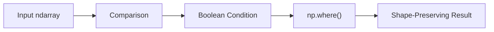

# 12- Where

## Overview

`np.where()` is NumPy's primary conditional-selection function. It evaluates an element-wise condition and chooses one value when the condition is true and another value when it is false.

The core form is:

```python
np.where(condition, x, y)
```

Conceptually:

```text
condition = True
    → choose x

condition = False
    → choose y
```

It is useful for:

- Vectorized conditional transformations.
- Threshold-based calculations.
- Default-value assignment.
- Numerical classification.
- Data-quality processing.
- Shape-preserving transformations.
- Batch processing.

`np.where()` is closely related to:

```text
comparison operations
        ↓
boolean masks
        ↓
broadcasting
        ↓
conditional output
```

A typical processing pipeline is:



The important production concerns are:

- Broadcasting.
- Result dtype.
- Output allocation.
- Missing and non-finite values.
- Complex conditions.
- Difference between selection and filtering.
- Avoiding invalid computations in branches.
- Memory usage for large arrays.

## Basic `np.where()`

Start with a simple threshold:

```python
import numpy as np

latency_ms = np.array(
    [80.0, 120.0, 450.0, 95.0],
)

status = np.where(
    latency_ms > 200.0,
    "slow",
    "normal",
)

print(status)
# ['normal' 'normal' 'slow' 'normal']
```

The condition produces:

```text
[False, False, True, False]
```

and `np.where()` selects:

```text
False → "normal"
True  → "slow"
```

The output retains the input's shape.

## What `np.where()` Produces

For:

```python
values = np.array(
    [10, 20, 30],
)

result = np.where(
    values > 15,
    values,
    0,
)
```

the result is:

```text
[ 0 20 30]
```

This differs from boolean indexing:

```python
values[values > 15]
```

which produces:

```text
[20 30]
```

The distinction is:

```text
np.where()
→ chooses values and preserves the broadcasted shape

boolean indexing
→ removes elements that do not match
```

## `np.where()` vs Filtering

Use `np.where()` when the output must remain aligned with the input.

```python
result = np.where(
    values > threshold,
    values,
    0.0,
)
```

Use boolean indexing when non-matching elements should be removed:

```python
filtered = values[
    values > threshold
]
```

| Requirement | Approach |
|---|---|
| Keep original shape | `np.where()` |
| Replace non-matching values | `np.where()` |
| Select one of two outputs | `np.where()` |
| Remove non-matching elements | Boolean indexing |
| Identify matching positions | Boolean mask |

This distinction is important in backend pipelines where positional alignment between arrays must be preserved.

## Scalar Branches

The true and false branches can be scalars.

```python
import numpy as np

values = np.array(
    [-10, 20, -5, 30],
)

result = np.where(
    values > 0,
    1,
    0,
)
```

Result:

```text
[0 1 0 1]
```

This is useful for:

- Binary indicators.
- Validity flags.
- Event markers.
- Status codes.
- Counters.

## Array Branches

The branches can also be arrays.

```python
import numpy as np

observed = np.array(
    [10.0, 20.0, 30.0],
)

fallback = np.array(
    [1.0, 2.0, 3.0],
)

result = np.where(
    observed > 15.0,
    observed,
    fallback,
)
```

Result:

```text
[ 1. 20. 30.]
```

This lets each position select between two aligned numerical arrays.

## Broadcasting

`np.where()` uses NumPy broadcasting for:

```text
condition
x
y
```

Consider:

```python
import numpy as np

records = np.array(
    [
        [10.0, 20.0, 30.0],
        [15.0, 25.0, 35.0],
    ],
)

thresholds = np.array(
    [12.0, 22.0, 32.0],
)

result = np.where(
    records > thresholds,
    records,
    thresholds,
)
```

Shapes:

```text
records    → (2, 3)
thresholds → (3,)
result     → (2, 3)
```

The threshold vector is broadcast across each row.

This pattern is useful for per-feature thresholds, limits, defaults, and calibration values.

## Shape Contract

When using `np.where()`, reason about the broadcasted shape of all three arguments.

For example:

```text
condition → (batch, features)
x         → (batch, features)
y         → (features,)
```

produces:

```text
result    → (batch, features)
```

A shape mismatch raises an error if the inputs cannot be broadcast.

Before debugging the conditional expression, inspect:

```python
print(condition.shape)
print(x.shape)
print(y.shape)
```

Shape should be treated as part of the function contract.

## Result Dtype

`np.where()` must produce one output array capable of representing both branches.

For example:

```python
import numpy as np

values = np.array(
    [10, 20, 30],
    dtype=np.int64,
)

result = np.where(
    values > 15,
    values,
    0.5,
)

print(result.dtype)
```

Because one branch is floating-point, dtype promotion occurs.

This matters in production pipelines because a seemingly small change in a fallback value can change:

```text
dtype
→ memory usage
→ downstream serialization
→ numerical behavior
```

Choose branch values deliberately.

## Same-Shaped Numeric Selection

A common pattern is selecting an adjusted value when a rule applies:

```python
import numpy as np

amount = np.array(
    [50.0, 150.0, 250.0],
)

adjusted = np.where(
    amount >= 200.0,
    amount * 0.90,
    amount,
)
```

The semantics are:

```text
amount >= 200
→ 10% reduction

otherwise
→ unchanged
```

This keeps the output shape identical to the input.

## `np.where()` for Classification

`np.where()` can create compact categorical states:

```python
import numpy as np

latency_ms = np.array(
    [80.0, 120.0, 450.0],
)

status = np.where(
    latency_ms <= 200.0,
    "healthy",
    "slow",
)
```

For a binary classification, this is usually clearer than writing a Python loop.

For more than two states, use `np.select()` instead of deeply nesting `np.where()`.

## Multiple Conditions

Two conditions can be combined using element-wise boolean operators:

```python
import numpy as np

temperature = np.array(
    [10.0, 25.0, 50.0, 65.0],
)

valid = (
    (temperature >= 15.0)
    & (temperature <= 50.0)
)

result = np.where(
    valid,
    temperature,
    np.nan,
)
```

This preserves valid values and marks out-of-range values as `NaN`.

Always parenthesize each comparison.

Use:

```python
(condition_a) & (condition_b)
```

not:

```python
condition_a and condition_b
```

because NumPy comparisons produce arrays rather than scalar booleans.

## Nested `np.where()`

For a small number of conditions, nested `np.where()` can express a binary decision tree:

```python
import numpy as np

latency_ms = np.array(
    [50.0, 150.0, 350.0],
)

status = np.where(
    latency_ms < 100.0,
    "healthy",
    np.where(
        latency_ms < 300.0,
        "warning",
        "critical",
    ),
)
```

This works, but readability decreases as the number of branches grows.

For several conditions:

```python
status = np.select(
    [
        latency_ms < 100.0,
        latency_ms < 300.0,
    ],
    [
        "healthy",
        "warning",
    ],
    default="critical",
)
```

is generally easier to maintain.

## The One-Argument Form

`np.where()` can also be called with only the condition:

```python
import numpy as np

values = np.array(
    [10, 20, 30, 40],
)

indices = np.where(
    values > 20
)

print(indices)
# (array([2, 3]),)
```

For a boolean condition, the one-argument form returns the indices where the condition is true.

It is closely related to:

```python
np.nonzero(condition)
```

For new code, use the one-argument form when you specifically want index positions and boolean indexing when you want the selected values.

## Getting Coordinates in Multidimensional Arrays

For a two-dimensional array:

```python
import numpy as np

values = np.array(
    [
        [10, 50],
        [70, 20],
        [90, 30],
    ],
)

rows, columns = np.where(
    values > 60
)

print(rows)
# [1 2]

print(columns)
# [0 0]
```

The coordinates represent:

```text
(1, 0) → 70
(2, 0) → 90
```

This is useful for locating threshold violations or specific numerical conditions.

For very large datasets, remember that the resulting index arrays consume memory proportional to the number of matches.

## `np.where()` and Missing Values

A common pattern is assigning a fallback to missing values:

```python
import numpy as np

values = np.array(
    [10.0, np.nan, 30.0],
)

result = np.where(
    np.isnan(values),
    0.0,
    values,
)
```

The result is:

```text
[10.0, 0.0, 30.0]
```

This is only correct when:

```text
missing value
→ business meaning of zero
```

is explicitly valid.

Otherwise, preserve missingness or reject the input.

A better design may be to retain the original array and a validity mask:

```python
valid = np.isfinite(values)
```

rather than encoding data-quality state into a numeric fallback.

## `np.where()` and Non-Finite Values

`np.where()` does not automatically understand:

```text
NaN
+inf
-inf
```

as invalid application data.

Use explicit predicates:

```python
finite = np.isfinite(values)

result = np.where(
    finite,
    values,
    np.nan,
)
```

or apply a domain-specific fallback.

The condition should reflect the application's definition of valid numerical input.

## Important Evaluation Behavior

`np.where()` is a selection mechanism, not a lazy branch evaluator in the same sense as Python's `if`.

Consider:

```python
result = np.where(
    denominator != 0,
    numerator / denominator,
    np.nan,
)
```

The division expression can be evaluated before `np.where()` selects the final values.

Therefore, `np.where()` should not be treated as a way to prevent invalid arithmetic from occurring.

For potentially unsafe element-wise division, use:

```python
result = np.divide(
    numerator,
    denominator,
    out=np.full(
        numerator.shape,
        np.nan,
        dtype=np.float64,
    ),
    where=denominator != 0,
)
```

This expresses the arithmetic operation and its valid domain together.

## `np.where()` and Expensive Branches

The same principle applies to expensive branch expressions.

For example:

```python
np.where(
    mask,
    expensive_operation(values),
    other_expensive_operation(values),
)
```

does not provide Python-style lazy branch evaluation simply because one branch is not selected for a particular element.

Both expressions may be computed before selection.

For expensive transformations, structure the computation differently:

```text
compute only the required subset
→ assign into output
```

or process the data in bounded batches.

## Output Buffer Patterns

`np.where()` itself returns a new result array.

When memory usage matters, an alternative is sometimes to allocate the output once and assign using boolean indexing:

```python
import numpy as np

values = np.asarray(
    values,
    dtype=np.float32,
)

result = np.empty_like(
    values
)

mask = values > 100.0

result[mask] = values[mask] * 0.9
result[~mask] = values[~mask]
```

This gives explicit control over the output buffer, but it can also create multiple intermediate selections.

The simplest `np.where()` expression is usually preferable unless memory profiling shows a real issue.

## Choosing Between `where`, `select`, and `clip`

| Requirement | Preferred Tool |
|---|---|
| Two possible outputs | `np.where()` |
| Several ordered conditions | `np.select()` |
| Find true-condition indices | `np.where(condition)` |
| Remove non-matching values | Boolean indexing |
| Restrict to numeric bounds | `np.clip()` |
| Apply lower bound only | `np.maximum()` |
| Apply upper bound only | `np.minimum()` |

Choosing the operation that matches the semantic requirement keeps numerical code easier to review.

## Conditional Replacement vs Validation

Suppose:

```python
values = np.array(
    [-10.0, 50.0, 120.0],
)
```

Conditional replacement:

```python
result = np.where(
    (values >= 0)
    & (values <= 100),
    values,
    0.0,
)
```

changes invalid values to zero.

Validation:

```python
valid = (
    (values >= 0)
    & (values <= 100)
)
```

preserves the evidence that values were invalid.

For data-quality pipelines, validation is often safer because silently changing bad data can hide upstream defects.

## Conditional Bounds

For explicit lower and upper bounds:

```python
import numpy as np

values = np.array(
    [-20.0, 50.0, 120.0],
)

bounded = np.where(
    values < 0.0,
    0.0,
    np.where(
        values > 100.0,
        100.0,
        values,
    ),
)
```

This works, but:

```python
bounded = np.clip(
    values,
    0.0,
    100.0,
)
```

is simpler and directly communicates the intent.

Use `np.where()` when the branches represent genuinely different business outcomes rather than simple numeric bounds.

## Conditional Arithmetic with Division

A robust ratio calculation can use `np.divide()`:

```python
import numpy as np

completed = np.array(
    [100.0, 50.0, 25.0],
)

total = np.array(
    [200.0, 0.0, 50.0],
)

rate = np.divide(
    completed,
    total,
    out=np.full(
        completed.shape,
        np.nan,
        dtype=np.float64,
    ),
    where=total != 0,
)
```

This is preferable to:

```python
rate = np.where(
    total != 0,
    completed / total,
    np.nan,
)
```

when avoiding the invalid division itself is part of the requirement.

## Conditional Aggregation

`np.where()` can help create a conditional contribution:

```python
import numpy as np

revenue = np.array(
    [100.0, 250.0, 50.0, 300.0],
)

premium_revenue = np.where(
    revenue >= 200.0,
    revenue,
    0.0,
)

total = premium_revenue.sum()
```

This works, but when only the aggregate is required, a masked reduction may avoid constructing a full intermediate result:

```python
total = np.sum(
    revenue,
    where=revenue >= 200.0,
)
```

The latter expresses:

```text
sum only values satisfying the condition
```

more directly.

## Backend Example: API Response Classification

A FastAPI service may classify response latency:

```python
import numpy as np


def classify_latency(
    latency_ms: np.ndarray,
) -> np.ndarray:
    return np.where(
        latency_ms <= 200.0,
        "within_sla",
        "outside_sla",
    )
```

This keeps the operation vectorized for a batch response-processing pipeline.

If the API handles one request at a time, a plain Python conditional may be simpler. NumPy provides value when the data is already represented as a numerical batch.

## Backend Example: Data-Quality State

A batch processor can mark invalid numerical measurements:

```python
import numpy as np


def valid_or_nan(
    values: np.ndarray,
    minimum: float,
    maximum: float,
) -> np.ndarray:
    valid = (
        np.isfinite(values)
        & (values >= minimum)
        & (values <= maximum)
    )

    return np.where(
        valid,
        values,
        np.nan,
    )
```

The function deliberately preserves the shape while marking invalid measurements.

Whether this is preferable to rejection depends on downstream semantics.

## Backend Example: PostgreSQL Pushdown

The same binary classification might be expressed in SQL:

```sql
SELECT
    CASE
        WHEN latency_ms <= 200
        THEN 'within_sla'
        ELSE 'outside_sla'
    END AS status
FROM request_metrics;
```

If the records already reside in PostgreSQL, calculating the condition there may avoid transferring unnecessary rows or columns into Python.

The execution-layer principle is:

```text
filter or transform close to the data source
when doing so is correct and efficient
```

Use NumPy when the data is already in an array-oriented processing stage.

## Pandas Integration

Pandas commonly uses NumPy operations for numerical conditional transformations:

```python
frame["status"] = np.where(
    frame["latency_ms"] <= 200.0,
    "within_sla",
    "outside_sla",
)
```

This is useful when the DataFrame remains the primary tabular representation.

When the operation depends heavily on:

```text
column labels
+
grouping
+
missing-data semantics
+
tabular indexing
```

Pandas may provide the better abstraction.

When the data has already been converted to dense arrays for numerical processing, NumPy is usually the natural layer.

## Performance and Memory

`np.where()` is typically linear in the number of output elements:

```text
O(N)
```

but the cost includes:

```text
condition evaluation
+
branch materialization
+
output allocation
```

For large arrays, memory may become more important than arithmetic.

For example:

```python
result = np.where(
    condition,
    values,
    fallback,
)
```

requires output storage.

A complex condition may also require temporary boolean arrays.

For high-volume workloads:

```text
bounded batches
+
simple conditions
+
early reduction
+
appropriate dtype
```

are often more important than micro-optimizing the expression syntax.

## Security and Reliability Considerations

Conditional operations can be triggered by untrusted input in API or batch-processing systems.

Validate:

- Maximum input size.
- Shape.
- Dtype.
- Numeric range.
- Number of generated elements.
- Expected broadcasting dimensions.

An unexpectedly large array can cause:

```text
large condition mask
+
large output
+
high CPU
+
memory exhaustion
```

Avoid allowing external callers to control dimensions without hard limits.

For worker systems, use bounded batch sizes so a single malformed payload cannot consume unbounded resources.

## Common Mistakes

### Using `np.where()` for Filtering

If non-matching values should disappear, use boolean indexing.

### Assuming `np.where()` Is Lazy

Branch expressions may be evaluated before selection.

This is especially important for division, logarithms, expensive functions, and other potentially invalid calculations.

### Using `and` / `or`

Use:

```python
&
|
~
```

for element-wise array conditions.

### Forgetting Parentheses

Write:

```python
(values > 10) & (values < 100)
```

rather than relying on operator precedence.

### Using Nested `where()` for Many Rules

Use `np.select()` when rule complexity grows.

### Using `where()` Instead of `clip()` for Simple Bounds

`np.clip()` expresses lower and upper bounds more directly.

### Replacing Missing Data with Arbitrary Numbers

Fallback values such as `0` can change the meaning of the dataset.

### Ignoring Dtype Promotion

Mixed branch types can produce a larger or different dtype than expected.

### Assuming Same Shape Means Same Semantics

Broadcasting can align arrays successfully while still applying a rule along an unintended dimension.

### Ignoring Memory Usage

Large masks and output arrays can significantly increase peak memory.

## Testing `np.where()`

Test basic binary selection:

```python
import numpy as np


def test_where_selection():
    values = np.array(
        [10, 20, 30],
    )

    result = np.where(
        values >= 20,
        values,
        0,
    )

    np.testing.assert_array_equal(
        result,
        np.array([0, 20, 30]),
    )
```

Test broadcasting:

```python
def test_where_broadcasting():
    values = np.array(
        [
            [10, 20],
            [30, 40],
        ],
    )

    threshold = np.array(
        [15, 25],
    )

    result = np.where(
        values >= threshold,
        values,
        threshold,
    )

    np.testing.assert_array_equal(
        result,
        np.array(
            [
                [15, 25],
                [30, 40],
            ]
        ),
    )
```

Test the one-argument form:

```python
def test_where_indices():
    values = np.array(
        [10, 20, 30],
    )

    indices = np.where(
        values > 15
    )[0]

    np.testing.assert_array_equal(
        indices,
        np.array([1, 2]),
    )
```

Also test:

- `NaN`.
- Infinity.
- Broadcasting failures.
- Dtype promotion.
- Boundary conditions.
- Multiple matching rules.
- Default branches.
- Large arrays.
- Potentially unsafe branch expressions.

## Debugging

When a `where()` result is unexpected, inspect the condition separately:

```python
mask = values > threshold

print(
    "matches:",
    np.count_nonzero(mask),
)

print(
    "shape:",
    mask.shape,
)
```

Then inspect branch shapes:

```python
print("condition:", condition.shape)
print("x:", x.shape)
print("y:", y.shape)
```

For complex conditions:

```python
first_rule = values >= minimum
second_rule = values <= maximum

valid = (
    first_rule
    & second_rule
)
```

This makes it easier to determine whether the problem is:

```text
comparison
+
broadcasting
+
selection
```

rather than `np.where()` itself.

## Interview Questions

### What does `np.where(condition, x, y)` do?

It performs element-wise conditional selection, choosing values from `x` where the condition is true and from `y` where it is false, subject to broadcasting.

### What is the difference between `np.where()` and boolean indexing?

`np.where()` constructs a result from two alternatives and preserves the broadcasted shape, while boolean indexing selects only matching elements.

### What does `np.where(condition)` return?

It returns the indices where the condition is true, as a tuple of index arrays.

### Why is `np.where()` not a true lazy `if` for array elements?

The branch expressions supplied to the function are ordinary Python/NumPy expressions and can be evaluated before `where()` performs selection.

### How should division with zero denominators be handled?

Prefer `np.divide()` with `where=` and `out=` when the invalid division itself should be avoided.

### When should `np.select()` be preferred?

When several ordered conditions determine the output and nested `np.where()` expressions would become difficult to maintain.

### Why can `np.where()` increase memory usage?

It creates an output array, and the condition may itself require one or more boolean arrays.

### How does broadcasting affect `np.where()`?

The condition and both branches are broadcast to compatible shapes, allowing scalars and lower-dimensional arrays to participate in the selection.

### When should `np.where()` be replaced with `np.clip()`?

When the business rule is simply to constrain numerical values to a lower and upper bound.

### When should conditional logic be pushed into PostgreSQL?

When the data is already relational and database-side filtering or classification can reduce data transfer and application-side resource usage.

## Key Takeaways

- `np.where()` performs element-wise conditional selection and is most useful when the output should preserve the broadcasted shape of the input data.
- Boolean indexing filters data, while `np.where()` chooses between alternative values; these are different operations with different memory and shape semantics.
- `np.where()` is not a lazy branch mechanism, so use operations such as `np.divide(..., where=...)` when invalid arithmetic must be prevented rather than merely hidden in the final output.
- Broadcasting, dtype promotion, masks, and output allocation are the main technical concerns when using `np.where()` on large numerical datasets.
- Use `np.select()` for multi-rule classification, `np.clip()` for numeric bounds, and PostgreSQL or Pandas when those layers provide a more natural execution boundary.