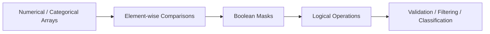

# 13- Logical Operations

## Overview

NumPy logical operations evaluate boolean conditions across arrays and are a core part of validation, filtering, classification, and data-quality pipelines.

The primary APIs are:

```python
np.logical_and()
np.logical_or()
np.logical_not()
np.logical_xor()
```

For boolean arrays, NumPy also supports element-wise operators:

```python
&
|
~
^
```

These operations are fundamental because most production numerical pipelines eventually need to express rules such as:

```text
value is finite
AND
value is within range
AND
status is successful
```

The general flow is:



The main engineering concerns are:

- Element-wise semantics.
- Python boolean operators versus NumPy operators.
- Operator precedence.
- Broadcasting.
- Boolean mask memory usage.
- `NaN` and non-finite values.
- Short-circuiting assumptions.
- Reusable validation masks.
- Performance on large arrays.

## Element-wise Logical Operations

Suppose:

```python
import numpy as np

values = np.array(
    [10.0, 20.0, 30.0, 40.0],
)

minimum = 15.0
maximum = 35.0
```

Create individual conditions:

```python
above_minimum = values >= minimum
below_maximum = values <= maximum
```

Then combine them:

```python
valid = (
    above_minimum
    & below_maximum
)
```

Result:

```text
[False, True, True, False]
```

The operations are performed independently for every array element.

## `np.logical_and()`

`np.logical_and()` performs an element-wise logical AND.

```python
import numpy as np

a = np.array(
    [True, True, False, False],
)

b = np.array(
    [True, False, True, False],
)

result = np.logical_and(
    a,
    b,
)

print(result)
# [ True False False False]
```

For numerical arrays, non-zero values are treated according to NumPy's boolean semantics:

```python
a = np.array(
    [0, 1, 2],
)

b = np.array(
    [1, 1, 0],
)

result = np.logical_and(
    a,
    b,
)
```

Result:

```text
[False, True, False]
```

For readable numerical validation code, explicit comparisons are usually preferable:

```python
(values > 0) & (values < 100)
```

rather than relying on implicit truth conversion of numeric values.

## `np.logical_or()`

`np.logical_or()` returns true when at least one condition is true.

```python
import numpy as np

is_timeout = np.array(
    [False, True, False, False],
)

is_server_error = np.array(
    [False, False, True, False],
)

failure = np.logical_or(
    is_timeout,
    is_server_error,
)
```

This expresses:

```text
timeout
OR
server error
```

A common equivalent for boolean arrays is:

```python
failure = (
    is_timeout
    | is_server_error
)
```

## `np.logical_not()`

`np.logical_not()` inverts an element-wise boolean condition.

```python
import numpy as np

valid = np.array(
    [True, False, True],
)

invalid = np.logical_not(
    valid,
)

print(invalid)
# [False  True False]
```

For boolean masks, the operator form is:

```python
invalid = ~valid
```

This is useful when a positive validation condition has already been defined and the downstream operation needs its complement.

## `np.logical_xor()`

`np.logical_xor()` returns true when exactly one operand is true.

```python
import numpy as np

a = np.array(
    [True, True, False, False],
)

b = np.array(
    [True, False, True, False],
)

result = np.logical_xor(
    a,
    b,
)

print(result)
# [False  True  True False]
```

XOR is less common in ordinary backend validation but can be useful when two mutually exclusive conditions must differ.

For boolean arrays, `^` provides element-wise XOR.

## Logical Operator Comparison

| Operation | Function | Operator for boolean arrays |
|---|---|---|
| AND | `np.logical_and()` | `&` |
| OR | `np.logical_or()` | `|` |
| NOT | `np.logical_not()` | `~` |
| XOR | `np.logical_xor()` | `^` |

The operator forms are concise and common in NumPy code.

The explicit functions are useful when:

- The operation itself is the focus.
- `out=` is useful.
- Generic ufunc-style code is being written.
- You want to avoid ambiguity around Python operator precedence.

## NumPy Operators vs Python `and`, `or`, `not`

This is one of the most important NumPy rules.

Do not write:

```python
(values > 10) and (values < 100)
```

Use:

```python
(values > 10) & (values < 100)
```

Similarly:

```python
(condition_a or condition_b)
```

should become:

```python
condition_a | condition_b
```

and:

```python
not condition
```

should become:

```python
~condition
```

Python's `and`, `or`, and `not` operate on scalar truth values. NumPy's operators perform element-wise operations on arrays.

## Why Python `and` and `or` Fail

Consider:

```python
import numpy as np

values = np.array(
    [10, 20, 30],
)

condition = values > 10
```

`condition` contains multiple boolean values:

```text
[False, True, True]
```

Python's `and` cannot reduce that array into a single truth value without ambiguity.

NumPy therefore expects:

```python
condition_a & condition_b
```

for element-wise combination.

This is a common interview and production debugging point.

## Operator Precedence

Parentheses are essential.

Use:

```python
valid = (
    (values >= minimum)
    & (values <= maximum)
)
```

Do not rely on precedence in:

```python
valid = values >= minimum & values <= maximum
```

The latter is parsed according to Python's operator precedence rules rather than the intended mathematical grouping.

A reliable rule is:

```text
parenthesize every comparison
```

before applying:

```text
&
|
```

## Combining Multiple Conditions

A realistic validation rule might look like:

```python
import numpy as np

amount = np.array(
    [100.0, -5.0, 250.0, np.nan],
)

status_code = np.array(
    [200, 200, 500, 200],
)

valid = (
    np.isfinite(amount)
    & (amount >= 0.0)
    & (status_code >= 200)
    & (status_code < 300)
)
```

This produces one boolean value per record.

The rule is:

```text
amount is finite
AND
amount >= 0
AND
status is 2xx
```

Breaking large rules into intermediate masks often improves maintainability:

```python
finite_amount = np.isfinite(
    amount
)

non_negative = amount >= 0.0

successful = (
    (status_code >= 200)
    & (status_code < 300)
)

valid = (
    finite_amount
    & non_negative
    & successful
)
```

This also makes debugging easier.

## Logical Operations with Broadcasting

Logical operations support broadcasting.

```python
import numpy as np

records = np.array(
    [
        [10.0, 20.0, 30.0],
        [15.0, 25.0, 35.0],
    ],
)

minimum = np.array(
    [5.0, 15.0, 25.0],
)

maximum = np.array(
    [12.0, 22.0, 32.0],
)

valid = (
    (records >= minimum)
    & (records <= maximum)
)
```

Shapes:

```text
records → (2, 3)
minimum → (3,)
maximum → (3,)
valid   → (2, 3)
```

This is useful for per-feature validation.

## Scalar Broadcasting

A scalar condition can be applied to every element:

```python
import numpy as np

values = np.array(
    [10.0, 20.0, 30.0],
)

valid = (
    (values >= 0.0)
    & (values <= 100.0)
)
```

Both scalar boundaries are broadcast across the array.

Broadcasting keeps validation code compact without manually creating repeated threshold arrays.

## Boolean Masks

Logical operations usually produce masks:

```python
valid = (
    (values >= lower)
    & (values <= upper)
)
```

The mask can be used for filtering:

```python
selected = values[
    valid
]
```

or:

```python
count = np.count_nonzero(
    valid
)
```

or:

```python
all_valid = np.all(valid)
```

The same mask can therefore support:

```text
filtering
+
counting
+
validation
+
aggregation
```

## `np.any()` and `np.all()`

Logical masks often need to be reduced to a scalar decision.

Use:

```python
np.any(mask)
```

when at least one element must satisfy a condition:

```python
has_invalid = np.any(
    ~valid
)
```

Use:

```python
np.all(mask)
```

when every element must satisfy it:

```python
all_valid = np.all(
    valid
)
```

The difference is important:

```text
any()
→ did at least one element match?

all()
→ did every element match?
```

## Axis-Based Logical Reductions

For multidimensional arrays:

```python
import numpy as np

valid_features = np.array(
    [
        [True, True, False],
        [True, True, True],
        [True, False, True],
    ],
)
```

Record-level validation:

```python
valid_records = np.all(
    valid_features,
    axis=1,
)
```

Result:

```text
[False, True, False]
```

This means:

```text
every feature for this record must be valid
```

Feature-level validation:

```python
valid_columns = np.all(
    valid_features,
    axis=0,
)
```

Result:

```text
[True, False, False]
```

The axis determines which dimension is being evaluated.

## Logical Reduction vs Element-wise Logic

These are different operations:

```python
valid = a & b
```

produces an array.

Whereas:

```python
all_valid = np.all(
    a & b
)
```

reduces that array to one boolean.

The pipeline is:

```text
element-wise comparison
        ↓
logical mask
        ↓
any/all reduction
        ↓
single decision
```

This pattern is common in batch validation.

## Negating Conditions

Suppose:

```python
valid = (
    np.isfinite(values)
    & (values >= 0)
)
```

The invalid mask can be derived:

```python
invalid = ~valid
```

This avoids repeating the original condition.

For example:

```python
invalid_count = np.count_nonzero(
    ~valid
)
```

This is useful in monitoring:

```text
valid records
+
invalid records
```

without calculating the rules twice.

## Logical XOR

XOR is useful when exactly one condition should hold.

For example:

```python
has_primary = np.array(
    [True, True, False, False],
)

has_fallback = np.array(
    [False, True, True, False],
)

exactly_one = (
    has_primary
    ^ has_fallback
)
```

The result identifies records where:

```text
primary exists
XOR
fallback exists
```

This can help validate mutually exclusive states.

For more complicated business rules, explicit naming and validation are often clearer than compact XOR expressions.

## Logical Operations with Numerical Arrays

Logical ufuncs can operate on numerical values by interpreting non-zero values as true and zero as false.

For example:

```python
import numpy as np

a = np.array(
    [0, 1, 2],
)

b = np.array(
    [1, 0, 3],
)

result = np.logical_and(
    a,
    b,
)
```

Result:

```text
[False, False, True]
```

However, production numerical code should usually compare explicitly:

```python
(a != 0) & (b != 0)
```

when the meaning is "non-zero".

Explicit comparisons communicate intent more clearly.

## Logical Operations with `NaN`

`NaN` is not automatically treated as "missing" by all logical operations.

For numerical validity checks, use:

```python
np.isfinite(values)
```

or:

```python
~np.isnan(values)
```

For example:

```python
valid = (
    np.isfinite(values)
    & (values >= 0)
)
```

This explicitly says:

```text
finite
AND
non-negative
```

rather than relying on comparisons against `NaN`.

## Logical Operations and Missing Data

A production data pipeline should separate:

```text
numerical value
```

from:

```text
validity state
```

For example:

```python
values = np.array(
    [10.0, np.nan, 30.0],
)

finite = np.isfinite(
    values
)

positive = values > 0

valid = (
    finite
    & positive
)
```

This is clearer than assuming:

```python
values > 0
```

alone provides complete validity semantics.

## Short-Circuiting

Python scalar expressions can short-circuit:

```python
condition_a and condition_b
```

but element-wise NumPy operations do not use Python-style short-circuiting per array element.

For:

```python
condition_a & condition_b
```

both arrays must be computed before the element-wise combination.

This matters when conditions are expensive.

For example:

```python
valid = (
    expensive_condition(values)
    & cheap_condition(values)
)
```

does not guarantee that the expensive condition is skipped where the cheap condition is false.

When computational savings matter, structure the processing deliberately rather than assuming boolean operators provide scalar-style short-circuit evaluation.

## Conditional Evaluation with Expensive Operations

Suppose:

```python
valid = (
    np.isfinite(values)
    & (
        np.log(values) < limit
    )
)
```

The logarithm may still be evaluated for invalid or non-positive values.

If the operation's domain is restricted, use an appropriate masked ufunc:

```python
log_values = np.full(
    values.shape,
    np.nan,
    dtype=np.float64,
)

np.log(
    values,
    out=log_values,
    where=values > 0,
)

valid = (
    np.isfinite(log_values)
    & (log_values < limit)
)
```

This separates:

```text
safe numerical evaluation
+
logical validation
```

and prevents invalid-domain calculations.

## Logical Operations and `where`

Logical masks often work with conditional selection:

```python
import numpy as np

values = np.array(
    [-10.0, 20.0, 30.0],
)

valid = values >= 0

result = np.where(
    valid,
    values,
    np.nan,
)
```

The workflow is:

```text
comparison
    ↓
logical mask
    ↓
conditional output
```

This pattern appears throughout numerical ETL pipelines.

## Combining More Than Two Conditions

For a complex validation rule:

```python
finite = np.isfinite(
    values
)

within_lower_bound = (
    values >= minimum
)

within_upper_bound = (
    values <= maximum
)

valid = (
    finite
    & within_lower_bound
    & within_upper_bound
)
```

This is usually more maintainable than compressing the entire rule into one expression.

Each intermediate mask has a clear meaning and can be measured independently.

## Operational Metrics from Logical Masks

Logical masks can produce useful batch metrics:

```python
valid_count = np.count_nonzero(
    valid
)

invalid_count = np.count_nonzero(
    ~valid
)

total_count = values.size

invalid_ratio = (
    invalid_count / total_count
    if total_count
    else 0.0
)
```

A worker can emit:

```text
records_processed
records_valid
records_invalid
invalid_ratio
```

without storing every individual validation result.

This is useful for:

- Data-quality monitoring.
- ETL observability.
- Kafka consumers.
- Celery workers.
- Scheduled batch jobs.

## Logical Operations in Batch Processing

For a large dataset, calculate logical masks per batch:

```python
import numpy as np


def validate_batches(
    values: np.ndarray,
    batch_size: int,
) -> tuple[int, int]:
    valid_count = 0
    invalid_count = 0

    for start in range(
        0,
        values.shape[0],
        batch_size,
    ):
        batch = values[
            start:start + batch_size
        ]

        valid = (
            np.isfinite(batch)
            & (batch >= 0.0)
        )

        valid_count += np.count_nonzero(
            valid
        )

        invalid_count += np.count_nonzero(
            ~valid
        )

    return valid_count, invalid_count
```

The complete dataset does not need to remain in memory solely to calculate validation counts.

## Memory Considerations

Boolean masks consume memory.

For a large array:

```text
input array
+
condition A
+
condition B
+
condition C
+
final mask
```

can create substantial peak memory usage.

For example:

```python
valid = (
    (values >= minimum)
    & (values <= maximum)
    & np.isfinite(values)
)
```

can involve intermediate boolean arrays.

For moderate workloads, this is usually acceptable.

For very large arrays:

- Process in batches.
- Reduce masks early when possible.
- Avoid storing masks that are used only once.
- Reuse buffers when profiling justifies it.
- Move filters toward the data source when possible.

## Boolean Mask Size

Boolean arrays are compact compared with common numeric arrays, but they still require storage proportional to the number of elements.

A dataset with hundreds of millions of elements can therefore require substantial memory just for validation masks.

The important design question is:

```text
Do I need the entire mask,
or do I only need an aggregate such as count?
```

For example:

```python
invalid_count = np.count_nonzero(
    ~(np.isfinite(values)
      & (values >= 0))
)
```

may be sufficient when the actual invalid rows do not need to be extracted.

## `out=` for Logical Ufuncs

Logical ufuncs support output buffers.

```python
import numpy as np

a = np.array(
    [True, True, False],
)

b = np.array(
    [True, False, True],
)

result = np.empty(
    a.shape,
    dtype=bool,
)

np.logical_and(
    a,
    b,
    out=result,
)
```

This can reduce repeated output allocation in high-throughput loops.

As with other buffer-based techniques, use it when memory or allocation costs justify the additional complexity.

## Backend Example: Eligibility Validation

Suppose a service determines whether records are eligible for processing:

```python
import numpy as np


def eligible_records(
    amount: np.ndarray,
    age_days: np.ndarray,
    status_code: np.ndarray,
) -> np.ndarray:
    valid_amount = (
        np.isfinite(amount)
        & (amount >= 0.0)
    )

    recent = age_days <= 30

    successful = (
        (status_code >= 200)
        & (status_code < 300)
    )

    return (
        valid_amount
        & recent
        & successful
    )
```

The final mask represents:

```text
valid amount
AND
recent record
AND
successful status
```

Each condition can be independently tested and monitored.

## Backend Example: "Any Failure" vs "All Valid"

Once a validation mask exists:

```python
valid = validate_records(...)
```

different operational decisions can be derived:

```python
all_valid = np.all(valid)
```

or:

```python
has_invalid = np.any(
    ~valid
)
```

or:

```python
invalid_count = np.count_nonzero(
    ~valid
)
```

These are different requirements:

```text
all()
→ hard pass/fail

any()
→ existence of a failure

count_nonzero()
→ magnitude of failure
```

Using the correct reduction makes the intent explicit.

## PostgreSQL Comparison

Logical filtering maps naturally to SQL:

```sql
WHERE
    amount >= 0
    AND status_code >= 200
    AND status_code < 300
```

When the data already resides in PostgreSQL, database-side filtering is often preferable because it can reduce:

```text
rows transferred
+
application memory
+
serialization
+
CPU
```

For example:


NumPy is more appropriate when the numerical arrays already exist in the application or when logical conditions are part of a larger in-memory transformation.

## Pandas Comparison

Pandas uses boolean expressions extensively:

```python
eligible = frame[
    (frame["amount"] >= 0)
    & (frame["status_code"] >= 200)
    & (frame["status_code"] < 300)
]
```

For labeled tabular data, this is often the most readable abstraction.

NumPy becomes more appropriate when:

```text
dense numerical arrays
+
array-oriented processing
+
high-volume vectorized conditions
```

are already the system's working representation.

Avoid unnecessary conversions between Pandas and NumPy just to perform simple boolean logic.

## Performance Considerations

Logical operations are generally linear:

```text
O(N)
```

but the actual cost depends on:

- Number of conditions.
- Number of temporary masks.
- Dtype.
- Memory layout.
- Array size.
- CPU and memory bandwidth.

For large arrays, the cost often comes more from reading and writing boolean buffers than from the logical operator itself.

Therefore:

```text
vectorization
+
fewer temporary arrays
+
batching
```

are more useful optimization strategies than trying to micro-optimize `&` versus `np.logical_and()`.

## Security and Reliability Considerations

Logical validation often sits at an input boundary.

For externally supplied numerical arrays, validate:

- Maximum element count.
- Shape.
- Dtype.
- Numeric range.
- Finite-value requirements.
- Batch size.

Without limits, an attacker or malformed producer could create:

```text
huge input
+
multiple boolean masks
+
large filtered output
```

and consume significant CPU and memory.

Validation should therefore happen before expensive transformations.

## Common Mistakes

### Using Python `and`, `or`, and `not`

Use:

```python
&
|
~
```

for element-wise array logic.

### Forgetting Parentheses

Always write:

```python
(values > minimum) & (values < maximum)
```

rather than relying on operator precedence.

### Assuming NumPy Logic Short-Circuits

Element-wise logical operations do not provide Python-style per-element short-circuit evaluation.

### Recomputing the Same Mask

If a validation mask is reused, compute it once:

```python
valid = ...
```

rather than repeating the entire expression.

### Treating `NaN` as an Ordinary Number

Explicitly use `np.isnan()` or `np.isfinite()` when missing or non-finite values matter.

### Confusing `all()` with `any()`

They answer different operational questions.

### Creating Too Many Large Masks

Complex validation logic can create multiple boolean arrays and increase peak memory.

### Using Implicit Numeric Truth Semantics

Although NumPy logical functions can operate on numeric arrays, explicit comparisons are generally clearer:

```python
values != 0
```

instead of relying on non-zero truthiness.

### Ignoring Broadcasting

Broadcast-compatible arrays can still encode the wrong business semantics if axis alignment is misunderstood.

### Filtering in Python After Loading Unnecessary Data

If PostgreSQL or another upstream system can safely filter the data first, pushing the condition closer to the source can reduce cost.

## Testing

Test basic logical operations:

```python
import numpy as np


def test_logical_and():
    a = np.array(
        [True, True, False],
    )

    b = np.array(
        [True, False, True],
    )

    result = a & b

    np.testing.assert_array_equal(
        result,
        np.array(
            [True, False, False],
        ),
    )
```

Test validation logic:

```python
def test_validation_mask():
    values = np.array(
        [10.0, -5.0, np.nan, 20.0],
    )

    valid = (
        np.isfinite(values)
        & (values >= 0.0)
    )

    np.testing.assert_array_equal(
        valid,
        np.array(
            [True, False, False, True],
        ),
    )
```

Test reductions:

```python
def test_logical_reductions():
    valid = np.array(
        [True, True, False],
    )

    assert np.all(valid) is False
    assert np.any(~valid) is True
    assert np.count_nonzero(~valid) == 1
```

Also test:

- Broadcasting.
- Empty arrays.
- `NaN`.
- Infinity.
- Boundary conditions.
- Multiple conditions.
- `axis`.
- Large batches.
- Dtype combinations.

## Debugging Logical Conditions

When a complex logical expression produces an unexpected result, split it into named masks:

```python
finite = np.isfinite(values)
above_min = values >= minimum
below_max = values <= maximum

valid = (
    finite
    & above_min
    & below_max
)
```

Then inspect the counts:

```python
print(
    "finite:",
    np.count_nonzero(finite),
)

print(
    "above_min:",
    np.count_nonzero(above_min),
)

print(
    "below_max:",
    np.count_nonzero(below_max),
)

print(
    "valid:",
    np.count_nonzero(valid),
)
```

This turns debugging from:

```text
one large boolean expression
```

into:

```text
individual rule diagnostics
```

which is much easier to operate in production.

## Interview Questions

### Why can't you use Python `and` with NumPy arrays?

Python's `and` expects scalar truth semantics, while NumPy comparisons generally produce arrays containing multiple boolean values.

### What operators should be used for element-wise logical operations?

Use:

```python
&
|
~
^
```

for AND, OR, NOT, and XOR.

### Why are parentheses required around comparisons?

Python operator precedence can otherwise evaluate the expression differently from the intended element-wise boolean expression.

### What is the difference between `np.logical_and()` and `&`?

Both can perform element-wise logical AND for boolean arrays, but `np.logical_and()` is the explicit NumPy ufunc form.

### What is the difference between `np.any()` and `np.all()`?

`np.any()` returns true if at least one element is true; `np.all()` returns true only if every element is true.

### How do you count invalid records?

Create an invalid boolean mask and use:

```python
np.count_nonzero(invalid)
```

### Does NumPy logical evaluation short-circuit?

No. Element-wise logical operations do not provide Python-style per-element short-circuit evaluation.

### How would you validate a dataset larger than RAM?

Process bounded batches, construct masks per batch, reduce them to counts or compact state where possible, and avoid retaining unnecessary masks.

### Why can several logical conditions consume substantial memory?

Each boolean condition can require its own mask, and combining them can create additional intermediate arrays.

### When should logical conditions be executed in PostgreSQL?

When the source data is already relational and database-side filtering can safely reduce the data transferred to the application.

## Key Takeaways

- NumPy logical operations combine element-wise conditions using `&`, `|`, `~`, `^` or the corresponding `np.logical_*` functions.
- Never use Python `and`, `or`, or `not` for element-wise NumPy array logic; parenthesize each comparison before combining masks.
- `any()`, `all()`, and `count_nonzero()` reduce boolean masks into operational decisions such as existence, complete validity, and failure counts.
- Logical expressions do not short-circuit per array element, and complex conditions can allocate several masks, so expensive computations and memory usage must be considered explicitly.
- Production validation should separate individual rules, handle `NaN` and non-finite values deliberately, enforce input limits, and push filtering to PostgreSQL or another source layer when appropriate.