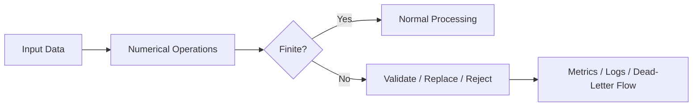
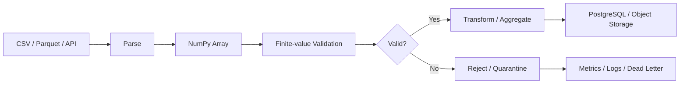

# 14- NaN and Infinity

## Overview

`NaN` and infinity are non-finite floating-point values that appear frequently in numerical data pipelines. They can originate from missing measurements, invalid arithmetic, division by zero, overflow, malformed input, or upstream systems that explicitly encode unavailable values.

NumPy provides dedicated tools for detecting, filtering, replacing, and aggregating around these values:

| Concept | Typical NumPy API |
|---|---|
| Detect `NaN` | `np.isnan()` |
| Detect positive/negative infinity | `np.isinf()` |
| Detect finite values | `np.isfinite()` |
| Detect whether values are non-finite | `~np.isfinite()` |
| Ignore `NaN` in aggregation | `np.nan*` functions |
| Replace values conditionally | `np.where()` |
| Control floating-point warnings | `np.errstate()` |

The important engineering distinction is:

```text
NaN
→ invalid or unavailable numerical result

+∞ / -∞
→ unbounded or overflowed numerical result

finite
→ ordinary representable numerical value
```

These values should be handled deliberately at data-processing boundaries rather than allowed to propagate silently through a service.



## Floating-Point Special Values

IEEE 754 floating-point arithmetic defines special values including:

- `NaN` — Not a Number.
- `+∞` — positive infinity.
- `-∞` — negative infinity.
- Positive and negative zero.

NumPy floating-point dtypes such as `float32` and `float64` can represent `NaN` and infinities.

Example:

```python
import numpy as np

values = np.array(
    [
        10.0,
        np.nan,
        np.inf,
        -np.inf,
        25.0,
    ],
    dtype=np.float64,
)
```

The array contains both valid finite values and non-finite values.

## NaN

`NaN` represents an undefined or unrepresentable numerical result.

It can appear from operations such as:

```python
import numpy as np

values = np.array(
    [0.0, 1.0],
)

result = values / values
```

The first element produces `NaN` because the operation is effectively `0 / 0`.

`NaN` is also commonly used to represent missing numerical data in processing pipelines.

## NaN Comparison Semantics

A critical property of `NaN` is that it does not compare equal to itself:

```python
import numpy as np

value = np.nan

print(value == value)
# False

print(value != value)
# True
```

Therefore, this is incorrect:

```python
values == np.nan
```

Use:

```python
np.isnan(values)
```

instead.

This behavior is an important interview and production debugging point.

## Detecting NaN

Use `np.isnan()` for explicit `NaN` detection:

```python
import numpy as np

values = np.array(
    [10.0, np.nan, 20.0],
)

mask = np.isnan(
    values
)

print(mask)
# [False  True False]
```

The result is a boolean mask that can be used for filtering or replacement.

## Detecting Infinity

Use `np.isinf()` when infinity itself is the condition of interest:

```python
import numpy as np

values = np.array(
    [10.0, np.inf, -np.inf, 20.0],
)

mask = np.isinf(
    values
)

print(mask)
# [False  True  True False]
```

This detects both:

```text
+∞
-∞
```

## Detecting All Non-Finite Values

For production validation, `np.isfinite()` is often the most useful check:

```python
import numpy as np

values = np.array(
    [10.0, np.nan, np.inf, -np.inf, 20.0],
)

finite = np.isfinite(
    values
)
```

Result:

```text
[ True False False False True]
```

The complementary mask identifies every non-finite value:

```python
non_finite = ~np.isfinite(
    values
)
```

This is often preferable when the requirement is:

```text
"Only ordinary finite numerical values are allowed."
```

## `isnan`, `isinf`, and `isfinite`

| Requirement | Preferred API |
|---|---|
| Find only `NaN` | `np.isnan()` |
| Find only infinities | `np.isinf()` |
| Accept only finite numbers | `np.isfinite()` |
| Find anything invalid/non-finite | `~np.isfinite()` |

Prefer the narrowest condition that matches the business rule.

For input validation, `np.isfinite()` is frequently the safest default because it rejects both `NaN` and infinity.

## Infinity Generation

Infinity can result from operations such as division by zero under floating-point semantics or from overflow.

For example:

```python
import numpy as np

numerator = np.array(
    [10.0, -10.0],
)

denominator = np.array(
    [0.0, 0.0],
)

result = np.divide(
    numerator,
    denominator,
)
```

Depending on the operation and floating-point error configuration, the result can contain:

```text
+∞
-∞
```

NumPy can emit floating-point warnings for such operations.

## `np.errstate()`

Use `np.errstate()` to control how floating-point errors are handled locally.

```python
import numpy as np

with np.errstate(
    divide="ignore",
    invalid="ignore",
):
    result = np.divide(
        numerator,
        denominator,
    )
```

This is useful when the occurrence of `NaN` or infinity is expected and will be handled explicitly afterward.

Do not use `errstate()` merely to hide unexpected numerical failures. Suppressing a warning does not fix the underlying data problem.

A production pattern is:

```text
perform operation
→ control expected floating-point behavior
→ explicitly inspect result
→ validate or transform
```

## Floating-Point Error Policies

NumPy supports policies such as:

```python
np.errstate(
    divide="raise",
    invalid="raise",
    over="raise",
    under="ignore",
)
```

These can turn numerical problems into exceptions when the pipeline requires strict validation.

For example:

```python
import numpy as np

with np.errstate(
    divide="raise",
    invalid="raise",
):
    result = values / denominators
```

This is appropriate for code where invalid numerical operations indicate a programming or data-integrity error.

The right policy depends on whether the condition is:

```text
expected data condition
```

or:

```text
unexpected system failure
```

## Checking Finite Values Before Processing

A common production boundary is:

```python
import numpy as np


def validate_values(
    values: np.ndarray,
) -> np.ndarray:
    if not np.all(
        np.isfinite(values)
    ):
        raise ValueError(
            "Input contains non-finite values."
        )

    return values
```

This is useful when downstream code assumes:

```text
all values are ordinary finite numbers
```

For large datasets, avoid retaining unnecessary masks if only a pass/fail result is needed.

## Reject vs Clean

There are two broad strategies for non-finite data.

### Reject

Use rejection when non-finite values indicate corrupt or invalid input:

```python
if not np.all(
    np.isfinite(values)
):
    raise ValueError(
        "Invalid numerical input."
    )
```

Typical cases:

- Financial transaction amounts.
- API request fields that must be finite.
- Configuration values.
- Physical quantities with strict validation.
- Features where non-finite data would invalidate downstream logic.

### Clean or Impute

Use transformation when missing or invalid values are part of the expected data model:

```python
cleaned = np.where(
    np.isfinite(values),
    values,
    0.0,
)
```

However, replacing every non-finite value with zero is not universally correct.

For many datasets, `NaN` means:

```text
unknown
```

not:

```text
zero
```

The replacement policy must come from the domain semantics.

## Replacing NaN

For explicit `NaN` replacement:

```python
import numpy as np

values = np.array(
    [10.0, np.nan, 20.0],
)

cleaned = np.nan_to_num(
    values,
    nan=0.0,
)
```

This converts `NaN` to the configured value.

Use it only when that replacement has a valid business meaning.

## Replacing Infinity

`np.nan_to_num()` can also replace positive and negative infinity:

```python
cleaned = np.nan_to_num(
    values,
    nan=0.0,
    posinf=1_000_000.0,
    neginf=-1_000_000.0,
)
```

This should be treated as a domain transformation, not merely a numerical cleanup trick.

For example, replacing infinity with an arbitrary large value can distort:

- Aggregations.
- Sorting.
- Threshold checks.
- Percentiles.
- Business decisions.

Use explicit bounds derived from the domain whenever possible.

## Distinguishing Missing from Invalid

A production pipeline should distinguish:

```text
missing
invalid
overflowed
unbounded
```

when those states have different meanings.

For example:

```python
values = np.array(
    [10.0, np.nan, np.inf, -np.inf],
)

missing = np.isnan(values)
infinite = np.isinf(values)
finite = np.isfinite(values)
```

This produces distinct masks.

The system can then report:

```text
missing_count
positive_infinity_count
negative_infinity_count
finite_count
```

instead of collapsing everything into one generic "bad data" category.

## Aggregations with NaN

Ordinary aggregations propagate `NaN`.

```python
import numpy as np

values = np.array(
    [10.0, np.nan, 20.0],
)

print(np.mean(values))
# nan
```

When the desired behavior is to ignore `NaN`, use the `nan*` variants:

```python
print(np.nanmean(values))
# 15.0
```

Common pairs include:

| Standard | Ignore NaN |
|---|---|
| `np.sum()` | `np.nansum()` |
| `np.mean()` | `np.nanmean()` |
| `np.median()` | `np.nanmedian()` |
| `np.min()` | `np.nanmin()` |
| `np.max()` | `np.nanmax()` |
| `np.std()` | `np.nanstd()` |
| `np.var()` | `np.nanvar()` |

These functions handle `NaN` specifically. They do not automatically treat infinity as missing.

## NaN vs Infinity in Aggregation

Consider:

```python
values = np.array(
    [10.0, np.nan, np.inf],
)
```

Then:

```python
np.nanmean(values)
```

still produces an infinite result because `np.nanmean()` ignores `NaN`, not `+∞`.

Therefore:

```python
np.nanmean(values)
```

does not mean:

```text
"mean of all finite values"
```

If only finite values are allowed, filter explicitly:

```python
finite_values = values[
    np.isfinite(values)
]

mean = (
    np.mean(finite_values)
    if finite_values.size
    else np.nan
)
```

This semantic distinction is important in production numerical processing.

## Aggregating Only Finite Values

A reusable pattern is:

```python
import numpy as np


def finite_mean(
    values: np.ndarray,
) -> float:
    finite = values[
        np.isfinite(values)
    ]

    if finite.size == 0:
        return np.nan

    return float(
        np.mean(finite)
    )
```

This defines the policy explicitly:

```text
NaN → excluded
+∞ → excluded
-∞ → excluded
finite values → included
```

For large arrays, remember that boolean indexing generally creates a new array, so this approach trades simplicity for additional memory.

## Logical Validation Pattern

A common production rule is:

```python
finite = np.isfinite(
    values
)

within_range = (
    (values >= minimum)
    & (values <= maximum)
)

valid = (
    finite
    & within_range
)
```

The order of conceptual validation is:

```text
non-finite detection
        ↓
range validation
        ↓
final validity mask
```

This keeps the data-quality contract explicit.

## Safe Division

Division is a common source of `NaN` and infinity.

Instead of:

```python
ratio = numerator / denominator
```

use a controlled operation when zero denominators are possible:

```python
import numpy as np

ratio = np.zeros_like(
    numerator,
    dtype=np.float64,
)

np.divide(
    numerator,
    denominator,
    out=ratio,
    where=denominator != 0,
)
```

This avoids calculating the invalid branch for positions where:

```python
denominator == 0
```

and lets the caller define the fallback value.

This is preferable to calculating invalid values first and cleaning them afterward.

## `np.where()` Is Not a Lazy Branch

This pattern can still evaluate the dangerous expression:

```python
ratio = np.where(
    denominator != 0,
    numerator / denominator,
    0.0,
)
```

The division expression can be evaluated before `np.where()` selects the result.

For potentially invalid arithmetic, prefer:

```python
ratio = np.zeros_like(
    numerator,
    dtype=np.float64,
)

np.divide(
    numerator,
    denominator,
    out=ratio,
    where=denominator != 0,
)
```

This is both numerically safer and more explicit.

## Preventing Overflow

Infinity can also result from floating-point overflow.

For example:

```python
import numpy as np

values = np.array(
    [1e300, 1e300],
)

with np.errstate(
    over="ignore",
):
    result = values * values
```

The result can contain:

```text
inf
```

The correct production response is not necessarily to replace the infinity. Instead determine whether:

```text
input range is invalid
```

or:

```text
the computation requires a different representation
```

or:

```text
overflow is an expected condition that must be handled.
```

Changing the dtype may increase range or precision in some cases, but dtype changes are not a universal solution.

## Integer Dtypes and Non-Finite Values

Standard NumPy integer dtypes cannot represent:

```text
NaN
+∞
-∞
```

For example:

```python
import numpy as np

values = np.array(
    [1, 2, 3],
    dtype=np.int64,
)
```

does not have a floating-point `NaN` state.

If missing numerical values are required, a floating-point representation or a separate validity mask may be appropriate.

A separate mask can preserve integer storage:

```python
values = np.array(
    [10, 20, 0],
    dtype=np.int64,
)

valid = np.array(
    [True, True, False],
)
```

This can be useful when preserving integer precision and compact storage matters.

## Dtype and Precision

Non-finite handling does not remove the normal floating-point concerns around precision.

For example:

```python
values = np.array(
    [...],
    dtype=np.float32,
)
```

and:

```python
values = np.array(
    [...],
    dtype=np.float64,
)
```

have different precision, range, and memory characteristics.

Choose the dtype according to:

```text
required range
+
required precision
+
memory constraints
+
downstream system requirements
```

Do not automatically convert everything to `float64` without considering the workload.

## Memory Considerations

Checking for non-finite values is generally linear in the number of elements:

```text
O(N)
```

but creating masks costs memory.

For example:

```python
finite = np.isfinite(values)
invalid = ~finite
```

creates two boolean arrays if both are retained.

When only the count is required:

```python
invalid_count = np.count_nonzero(
    ~np.isfinite(values)
)
```

is often simpler.

For very large arrays, process in bounded batches:

```python
invalid_count = 0

for start in range(
    0,
    values.shape[0],
    batch_size,
):
    batch = values[
        start:start + batch_size
    ]

    invalid_count += np.count_nonzero(
        ~np.isfinite(batch)
    )
```

This reduces peak working memory.

## Memory-Mapped Files

For large numerical files that do not fit comfortably into RAM, a memory-mapped array can allow bounded processing:

```python
import numpy as np

values = np.memmap(
    "metrics.dat",
    dtype=np.float64,
    mode="r",
    shape=(100_000_000,),
)

invalid_count = 0

batch_size = 1_000_000

for start in range(
    0,
    values.shape[0],
    batch_size,
):
    batch = values[
        start:start + batch_size
    ]

    invalid_count += np.count_nonzero(
        ~np.isfinite(batch)
    )
```

This is useful for large file-based processing because the application does not need to materialize the complete dataset in memory.

It is still important to choose a practical batch size and avoid assuming memory mapping eliminates all I/O costs.

## Backend Data Pipeline

A production numerical ingestion pipeline might look like:



The important design decision is to establish the numerical validity contract before expensive downstream processing.

For example:

```text
API payload
→ parse numeric fields
→ reject NaN / infinity where prohibited
→ transform
→ persist
```

or:

```text
raw dataset
→ batch validation
→ quarantine invalid records
→ process valid records
```

## FastAPI Boundary Example

If an API accepts numerical data, it is often preferable to reject invalid inputs before they reach deeper numerical processing.

Conceptually:

```python
import numpy as np


def validate_numeric_batch(
    values: np.ndarray,
) -> None:
    if not np.all(
        np.isfinite(values)
    ):
        raise ValueError(
            "Values must be finite."
        )
```

The API layer can convert this domain error into an appropriate HTTP response.

The exact validation mechanism depends on the request schema and framework, but the core rule remains:

```text
validate at the boundary
+
keep internal numerical assumptions explicit
```

## PostgreSQL Considerations

PostgreSQL commonly represents missing values with `NULL`, which is semantically different from an IEEE floating-point `NaN`.

A data pipeline should define how these states map between systems:

```text
PostgreSQL NULL
        ↓
Python missing representation
        ↓
NumPy NaN or separate validity mask
```

Do not assume the mapping is always semantically lossless.

Likewise, converting a NumPy `NaN` into a database value should follow an explicit application policy rather than relying on accidental driver behavior.

For business-critical data, define the data contract across:

```text
database
↔ API
↔ Python
↔ NumPy
```

## Pandas Relationship

Pandas provides higher-level missing-data semantics for labeled tabular data.

NumPy is usually preferable when working directly with:

```text
dense numerical arrays
+
vectorized numerical processing
+
low-level array operations
```

Pandas is often more appropriate when handling:

```text
columns
+
labels
+
mixed data types
+
tabular joins
+
grouped ETL workflows
```

For example, Pandas may manage the table while NumPy performs a numerical transformation on selected columns.

Avoid converting between Pandas and NumPy repeatedly inside tight processing loops because conversion and copying can introduce unnecessary overhead.

## Monitoring and Observability

Non-finite values are useful operational signals.

Track metrics such as:

```text
records_processed
records_with_nan
records_with_infinity
records_rejected
finite_value_ratio
```

For example:

```python
nan_count = np.count_nonzero(
    np.isnan(values)
)

infinite_count = np.count_nonzero(
    np.isinf(values)
)

invalid_count = np.count_nonzero(
    ~np.isfinite(values)
)
```

Expose these metrics through the service's normal monitoring path rather than logging every invalid element.

A sudden increase in non-finite values can indicate:

- Upstream schema changes.
- Broken ETL logic.
- Overflow.
- Division-by-zero bugs.
- Sensor or measurement failures.
- Corrupted files.
- Deployment regressions.

## Reliability Considerations

Do not silently convert invalid values into acceptable values unless that behavior is part of the data contract.

For example:

```python
np.nan_to_num(values)
```

with default behavior may transform infinities into large finite values.

That can turn a detectable failure into plausible-looking but incorrect data.

For critical pipelines, prefer:

```text
detect
→ classify
→ decide
→ transform only when explicitly permitted
```

rather than:

```text
detect
→ blindly replace
```

## Common Mistakes

### Comparing Directly Against `np.nan`

Incorrect:

```python
values == np.nan
```

Correct:

```python
np.isnan(values)
```

### Assuming `np.nanmean()` Removes Infinity

It does not. It ignores `NaN`, but infinity can still dominate the result.

### Treating Infinity as Missing

`+∞` and `-∞` may represent overflow or an actual unbounded result. They should not automatically be treated as missing data.

### Using `np.nan_to_num()` Without a Data Contract

Replacing invalid values can hide upstream defects and distort business metrics.

### Suppressing All Floating-Point Warnings

Using:

```python
with np.errstate(all="ignore"):
```

everywhere can make numerical failures invisible.

Control only the expected error conditions.

### Checking Finiteness After Expensive Processing

When possible, validate inputs before costly transformations.

### Allocating Multiple Full-Size Masks

For very large arrays, retained boolean masks can increase peak memory significantly.

### Assuming `float64` Solves Overflow

Increasing dtype size can help in some cases, but it does not eliminate invalid inputs or all numerical range problems.

### Forgetting Empty Inputs

Code such as:

```python
finite_values = values[
    np.isfinite(values)
]
```

can produce an empty array.

An aggregation strategy must define what should happen when no finite values remain.

## Performance Considerations

Non-finite detection is generally memory-bandwidth-oriented for large arrays:

```python
np.isfinite(values)
```

performs a linear scan over the data.

The main performance risks often come from:

- Multiple full-array scans.
- Temporary masks.
- Copying filtered values.
- Repeated conversions between array representations.
- Processing more data than necessary.

For example:

```python
finite = np.isfinite(values)
positive = values > 0
valid = finite & positive
```

requires multiple passes.

For many workloads this is completely acceptable. Optimization should be based on profiling and memory measurements rather than assumptions.

When processing very large inputs:

```text
batching
+
fewer retained temporaries
+
source-side filtering
+
appropriate dtype
```

often matter more than micro-optimizing the logical expression.

## Testing Non-Finite Handling

Test each special-value category explicitly:

```python
import numpy as np


def test_non_finite_detection():
    values = np.array(
        [
            10.0,
            np.nan,
            np.inf,
            -np.inf,
        ],
    )

    np.testing.assert_array_equal(
        np.isnan(values),
        np.array(
            [False, True, False, False],
        ),
    )

    np.testing.assert_array_equal(
        np.isinf(values),
        np.array(
            [False, False, True, True],
        ),
    )

    np.testing.assert_array_equal(
        np.isfinite(values),
        np.array(
            [True, False, False, False],
        ),
    )
```

Also test:

- Empty arrays.
- Very large values.
- Negative infinity.
- Division by zero.
- Overflow.
- Mixed valid and invalid records.
- Batch boundaries.
- Replacement policies.
- Aggregations after filtering.
- Dtype conversions.

## Debugging Numerical Failures

When a production calculation suddenly produces `NaN` or infinity, identify where the first non-finite value appears.

A useful diagnostic sequence is:

```python
finite = np.isfinite(values)

print(
    "total:",
    values.size,
)

print(
    "finite:",
    np.count_nonzero(finite),
)

print(
    "non_finite:",
    np.count_nonzero(~finite),
)

print(
    "nan:",
    np.count_nonzero(np.isnan(values)),
)

print(
    "infinite:",
    np.count_nonzero(np.isinf(values)),
)
```

Then inspect the operation that generated the values.

The important distinction is:

```text
symptom
→ non-finite output

cause
→ invalid input, overflow, division, domain error, or data corruption
```

Replacing the symptom without finding the cause can leave the underlying defect unresolved.

## Interview Questions

### What is the difference between `NaN` and infinity?

`NaN` represents an undefined or unavailable numerical result. Infinity represents an unbounded floating-point result such as positive or negative overflow or division-related behavior.

### Why does `NaN == NaN` return false?

That follows IEEE 754 floating-point comparison semantics. Use `np.isnan()` to detect `NaN`.

### How do you check whether all values are finite?

Use:

```python
np.all(
    np.isfinite(values)
)
```

### What is the difference between `np.isnan()` and `np.isfinite()`?

`np.isnan()` identifies only `NaN`; `np.isfinite()` identifies values that are neither `NaN` nor positive or negative infinity.

### Does `np.nanmean()` ignore infinity?

No. It ignores `NaN`, but positive or negative infinity can still affect the result.

### How would you safely divide two arrays when zero denominators are possible?

Use `np.divide()` with `out=` and `where=` rather than calculating the invalid division first and cleaning it afterward.

### Why can `np.where()` still produce divide-by-zero warnings?

Its branch expressions can be evaluated before the selected result is assembled. It is not a general lazy conditional mechanism.

### Why shouldn't every `NaN` be replaced with zero?

Because `NaN` often means unknown or missing, while zero represents an actual numerical value. Replacing one with the other can change business semantics.

### How would you process a 100-million-element array containing occasional non-finite values?

Process it in bounded batches, use `np.isfinite()` for validation, avoid unnecessary retained masks, and aggregate counts or other compact state rather than materializing additional full-size arrays where possible.

## Key Takeaways

- Use `np.isnan()`, `np.isinf()`, and especially `np.isfinite()` to explicitly detect `NaN` and infinity rather than relying on comparisons.
- `np.nan*` aggregation functions ignore `NaN`, but they do not automatically ignore positive or negative infinity.
- Treat replacement as a data-contract decision: `NaN`, infinity, missing data, overflow, and invalid input can have different meanings.
- For safe numerical pipelines, validate finite values at boundaries, use `np.divide(..., where=...)` for guarded division, and control floating-point warnings deliberately with `np.errstate()`.
- Large datasets require memory-aware handling: prefer bounded batches, avoid unnecessary masks and copies, and measure non-finite rates as part of data-quality observability.