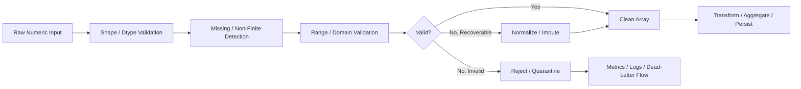
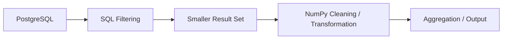

# 01- Numerical Data Cleaning

## Overview

Numerical data cleaning is the process of converting raw numeric input into a well-defined dataset that downstream code can safely process.

In backend and data-engineering systems, raw numerical data commonly contains:

- Missing values represented as `NaN`.
- Positive or negative infinity.
- Values outside business or system-defined ranges.
- Invalid sentinel values such as `-1` or `999999`.
- Unexpected dtypes or precision.
- Duplicate or malformed records.
- Extreme values caused by upstream failures or incorrect units.

NumPy is useful when the data is already represented as dense numerical arrays and the cleaning process primarily involves vectorized validation and transformation.

A robust cleaning pipeline should distinguish between **validation**, **correction**, and **rejection** rather than blindly replacing every suspicious value.



## Cleaning as a Data Contract

A production system should define what constitutes a valid numerical value before implementing cleaning logic.

For example:

```text
temperature:
    dtype     = float64
    finite    = required
    range     = -50 to 80
    missing   = allowed
    output    = float64
```

Or:

```text
transaction_amount:
    dtype     = float64
    finite    = required
    minimum   = 0
    missing   = rejected
```

This distinction matters because the same value can mean different things depending on the domain.

For example:

```text
0      → valid amount
NaN    → missing amount
-1     → invalid amount
inf    → numerical failure
```

Cleaning should encode these semantics explicitly.

## Cleaning Pipeline

A typical NumPy cleaning pipeline is:

```text
raw values
    ↓
validate shape and dtype
    ↓
detect NaN / infinity
    ↓
identify invalid ranges
    ↓
apply domain-specific correction
    ↓
remove or quarantine unrecoverable values
    ↓
return validated array + quality metrics
```

A reusable design separates detection from transformation:

```python
import numpy as np


def validate_numeric_data(
    values: np.ndarray,
) -> np.ndarray:
    if values.ndim != 1:
        raise ValueError(
            "Expected a one-dimensional array."
        )

    if not np.issubdtype(
        values.dtype,
        np.number,
    ):
        raise TypeError(
            "Expected a numeric dtype."
        )

    return values
```

The cleaning function can then operate on an input whose structural assumptions are already known.

## Missing Values

For floating-point arrays, `NaN` is a common representation of missing numerical data.

Detect it with:

```python
missing = np.isnan(values)
```

Example:

```python
import numpy as np

values = np.array(
    [10.0, np.nan, 20.0, 30.0],
)

missing = np.isnan(values)

print(missing)
# [False  True False False]
```

Do not test missing values with:

```python
values == np.nan
```

because `NaN` does not compare equal to itself.

## Non-Finite Values

A production numerical pipeline frequently needs to reject both `NaN` and infinity.

Use:

```python
finite = np.isfinite(values)
```

or:

```python
invalid = ~np.isfinite(values)
```

Example:

```python
values = np.array(
    [
        10.0,
        np.nan,
        np.inf,
        -np.inf,
    ],
)

valid = np.isfinite(values)
```

Result:

```text
[True, False, False, False]
```

When the requirement is "only finite values are allowed", `np.isfinite()` is usually the clearest validation primitive.

## Missing vs Invalid

Do not automatically treat all non-finite values as the same category.

```python
missing = np.isnan(values)
infinite = np.isinf(values)
finite = np.isfinite(values)
```

This lets the pipeline distinguish:

| Condition | Possible Meaning |
|---|---|
| `NaN` | Missing or undefined |
| `+∞` | Overflow or unbounded result |
| `-∞` | Negative overflow or unbounded result |
| Finite | Valid numerical representation |

Operational metrics can then report these categories independently.

## Handling Missing Values

There are several common policies.

| Policy | Use When |
|---|---|
| Reject | Missing data violates the input contract |
| Remove | Missing records are not needed downstream |
| Impute | A documented replacement rule exists |
| Preserve | Downstream systems understand missing values |

Never assume:

```text
missing = zero
```

because zero is an actual numerical value.

### Replacement with a Fixed Value

```python
cleaned = np.nan_to_num(
    values,
    nan=0.0,
)
```

This is appropriate only when zero has a valid domain meaning.

### Replacement with a Statistical Value

For a simple mean-based fill:

```python
finite = values[
    np.isfinite(values)
]

fill_value = (
    np.mean(finite)
    if finite.size
    else 0.0
)

cleaned = np.where(
    np.isnan(values),
    fill_value,
    values,
)
```

For production systems, the imputation policy should be domain-specific and independently tested.

## Removing Invalid Values

When invalid records should be excluded:

```python
valid = np.isfinite(values)

cleaned = values[
    valid
]
```

Boolean indexing generally creates a new array, so this approach is convenient but has a memory cost.

For large datasets, process the input in batches rather than retaining the entire cleaned copy.

## Range Validation

Finite values can still be invalid.

For example:

```python
values = np.array(
    [10.0, 20.0, 500.0, -5.0],
)

valid = (
    np.isfinite(values)
    & (values >= 0.0)
    & (values <= 100.0)
)
```

This separates:

```text
representation validity
+
domain validity
```

A value can therefore be:

```text
finite but invalid
```

which is common in production data.

## Bounds and Business Rules

Use explicit masks for domain constraints:

```python
def valid_amounts(
    values: np.ndarray,
) -> np.ndarray:
    return (
        np.isfinite(values)
        & (values >= 0.0)
        & (values <= 1_000_000.0)
    )
```

For multiple fields:

```python
valid = (
    np.isfinite(amount)
    & np.isfinite(quantity)
    & (amount >= 0.0)
    & (quantity >= 0)
)
```

Keep business rules readable rather than hiding them inside a large transformation expression.

## Sentinel Values

Legacy systems often use special ordinary numbers to represent missing data:

```text
-1
999999
0
-9999
```

These values are not inherently invalid to NumPy.

You must define the sentinel explicitly:

```python
values = np.array(
    [10.0, -1.0, 20.0],
)

missing = values == -1.0
```

Then convert it according to the data contract:

```python
cleaned = values.astype(
    np.float64,
    copy=True,
)

cleaned[missing] = np.nan
```

Do not use sentinel replacement unless the source system documents the sentinel semantics.

## Clipping Extreme Values

`np.clip()` constrains values to a specified range:

```python
clipped = np.clip(
    values,
    0.0,
    100.0,
)
```

For example:

```text
-10 → 0
50  → 50
150 → 100
```

Clipping is useful when the business rule explicitly defines saturation.

It is **not** the same as validation.

This:

```python
clipped = np.clip(values, 0, 100)
```

does not tell you whether the original input was invalid.

If invalid values must be detected, calculate the mask first:

```python
invalid = (
    (values < 0.0)
    | (values > 100.0)
)

clipped = np.clip(
    values,
    0.0,
    100.0,
)
```

This preserves observability.

## Outlier Handling

Not every extreme value is invalid.

For example:

```text
transaction = 10,000
```

may be an outlier but still be legitimate.

Do not automatically remove or clip statistically unusual values unless the domain requires it.

A production decision should distinguish:

```text
invalid
vs
unusual
vs
valid extreme
```

This is particularly important for financial, operational, and monitoring datasets.

## Standardizing Numeric Types

Cleaning can include choosing an appropriate dtype.

Inspect:

```python
print(values.dtype)
print(values.itemsize)
print(values.nbytes)
```

For example:

```python
values = np.asarray(
    raw_values,
    dtype=np.float64,
)
```

A dtype should be chosen based on:

```text
required precision
+
numeric range
+
memory constraints
+
downstream compatibility
```

Do not reduce `float64` to `float32` simply to save memory if the loss of precision is unacceptable.

Likewise, integers cannot represent `NaN` or infinity directly, so a separate validity mask or floating representation may be required when missing states must be represented.

## Copy vs View During Cleaning

Be explicit about whether the cleaning operation can modify the original array.

For example:

```python
cleaned = values.copy()
```

creates an independent array.

This is safer when the original input must remain unchanged.

In-place modification:

```python
values[missing] = 0.0
```

can be more memory-efficient but changes the original array.

The choice should be deliberate:

```text
immutable source required
→ copy

controlled buffer mutation
→ in-place operation
```

## Vectorized Cleaning

Prefer vectorized operations over Python loops.

Less suitable for large arrays:

```python
cleaned = []

for value in values:
    if np.isfinite(value) and value >= 0:
        cleaned.append(value)
```

A NumPy-oriented approach is:

```python
valid = (
    np.isfinite(values)
    & (values >= 0.0)
)

cleaned = values[
    valid
]
```

The NumPy version moves the main numerical work into compiled operations and avoids Python-level iteration for each element.

However, it may allocate a boolean mask and a filtered output array, so the memory trade-off still matters.

## Cleaning Multiple Conditions

A production cleaning function can return both the cleaned data and quality information:

```python
from dataclasses import dataclass

import numpy as np


@dataclass(frozen=True)
class CleaningResult:
    values: np.ndarray
    input_count: int
    valid_count: int
    invalid_count: int


def clean_values(
    values: np.ndarray,
) -> CleaningResult:
    values = np.asarray(
        values,
        dtype=np.float64,
    )

    valid = (
        np.isfinite(values)
        & (values >= 0.0)
        & (values <= 1_000_000.0)
    )

    cleaned = values[
        valid
    ]

    valid_count = int(
        np.count_nonzero(valid)
    )

    input_count = int(
        values.size
    )

    return CleaningResult(
        values=cleaned,
        input_count=input_count,
        valid_count=valid_count,
        invalid_count=input_count - valid_count,
    )
```

This design makes data-quality metrics part of the processing contract rather than an afterthought.

## Data Quality Metrics

Useful batch metrics include:

```text
input_count
valid_count
invalid_count
missing_count
infinite_count
out_of_range_count
invalid_ratio
```

For example:

```python
finite = np.isfinite(values)
missing = np.isnan(values)
infinite = np.isinf(values)

out_of_range = (
    finite
    & (
        (values < minimum)
        | (values > maximum)
    )
)
```

Then:

```python
metrics = {
    "input_count": int(values.size),
    "missing_count": int(np.count_nonzero(missing)),
    "infinite_count": int(np.count_nonzero(infinite)),
    "out_of_range_count": int(
        np.count_nonzero(out_of_range)
    ),
}
```

These metrics can feed Prometheus, CloudWatch, OpenTelemetry, or the application's normal metrics pipeline.

## Batch Processing

Large datasets should not be cleaned by loading every intermediate result into memory unnecessarily.

A batch-oriented pattern is:

```python
import numpy as np


def clean_in_batches(
    values: np.ndarray,
    batch_size: int,
) -> tuple[int, int]:
    valid_count = 0
    invalid_count = 0

    for start in range(
        0,
        values.shape[0],
        batch_size,
    ):
        batch = values[
            start:start + batch_size
        ]

        valid = (
            np.isfinite(batch)
            & (batch >= 0.0)
        )

        valid_count += np.count_nonzero(
            valid
        )

        invalid_count += np.count_nonzero(
            ~valid
        )

    return (
        valid_count,
        invalid_count,
    )
```

The key advantage is bounded working memory:

```text
entire dataset
    ↓
small batch
    ↓
validate
    ↓
transform / persist
    ↓
discard batch
```

This pattern is useful for:

- Large CSV or Parquet files.
- Object-storage processing.
- Kafka consumers.
- Celery jobs.
- Scheduled ETL workloads.

## Memory Efficiency

Cleaning can create several arrays:

```text
original values
+
boolean masks
+
cleaned output
+
temporary expressions
```

For large arrays, this can dominate memory usage.

For example:

```python
valid = (
    np.isfinite(values)
    & (values >= 0.0)
    & (values <= 100.0)
)
```

may involve intermediate boolean arrays.

Optimization techniques include:

- Process in batches.
- Reuse output buffers where practical.
- Avoid retaining temporary masks.
- Use an appropriate dtype.
- Avoid unnecessary conversions.
- Push filtering toward the source when possible.

Optimize only after measuring representative workloads.

## Memory-Mapped Input

For large file-backed numeric datasets, `np.memmap` can support bounded processing:

```python
import numpy as np

values = np.memmap(
    "metrics.dat",
    dtype=np.float64,
    mode="r",
    shape=(100_000_000,),
)

batch_size = 1_000_000

for start in range(
    0,
    values.shape[0],
    batch_size,
):
    batch = values[
        start:start + batch_size
    ]

    valid = (
        np.isfinite(batch)
        & (batch >= 0.0)
    )

    # Process or persist this batch.
```

Memory mapping does not make I/O free. It simply provides a useful access pattern when the dataset is too large to materialize eagerly.

## Safe Numerical Cleaning

Some numerical operations can generate invalid values during cleaning itself.

Division is a common example:

```python
ratio = np.where(
    denominator != 0,
    numerator / denominator,
    0.0,
)
```

This is not a reliable guard because the division expression may be evaluated before selection.

Use:

```python
ratio = np.zeros_like(
    numerator,
    dtype=np.float64,
)

np.divide(
    numerator,
    denominator,
    out=ratio,
    where=denominator != 0,
)
```

The general rule is:

```text
prevent invalid arithmetic
rather than generating invalid values and cleaning them afterward
```

## Handling Floating-Point Warnings

Use `np.errstate()` for expected numerical conditions:

```python
with np.errstate(
    divide="ignore",
    invalid="ignore",
    over="ignore",
):
    result = numerical_operation()
```

Do not suppress warnings globally simply because a dataset contains bad values.

A better production pattern is:

```text
perform operation
→ detect invalid result
→ classify condition
→ handle according to contract
```

This preserves observability.

## Cleaning Before Aggregation

Cleaning should generally occur before aggregation when invalid values would otherwise distort the result.

For example:

```python
values = np.array(
    [10.0, 20.0, np.nan, 30.0],
)

valid = np.isfinite(values)

mean = np.mean(
    values[valid]
)
```

Alternatively, for a policy that explicitly ignores `NaN`:

```python
mean = np.nanmean(values)
```

But remember:

```text
nanmean()
```

does not automatically exclude infinity.

When the requirement is "finite values only", use an explicit finite mask.

## SQL and Database Interaction

Cleaning should not automatically happen in NumPy if the database can safely perform the same filtering more efficiently.

For example, PostgreSQL can remove clearly invalid rows before transferring them:

```sql
SELECT amount, quantity
FROM transactions
WHERE amount >= 0
  AND quantity >= 0;
```

The resulting flow becomes:



This can reduce:

- Network transfer.
- Serialization cost.
- Application memory.
- NumPy processing cost.

Keep numerical transformations in NumPy when they provide meaningful array-processing value that is not better expressed in SQL.

## Pandas Interaction

Pandas is usually a better abstraction for:

```text
labeled columns
+
mixed tabular data
+
joins
+
grouping
+
ETL orchestration
```

NumPy is a strong fit for:

```text
dense numeric arrays
+
vectorized numerical transformations
+
memory-aware array processing
```

A common pipeline is:

```text
Pandas DataFrame
        ↓
select numeric columns
        ↓
NumPy array operation
        ↓
return / assign result
```

Avoid repeatedly converting between Pandas and NumPy inside tight loops.

## API and Service Boundaries

Numerical cleaning is especially important when consuming external inputs through:

- REST APIs.
- gRPC services.
- Kafka messages.
- Uploaded files.
- Database extracts.

An external value should not be trusted simply because it has a numeric type.

A robust boundary validates:

```text
shape
+
dtype
+
finite state
+
range
+
business constraints
```

before passing the data into performance-sensitive numerical processing.

## Security Considerations

Numerical cleaning can become a resource-exhaustion concern when input sizes are externally controlled.

For example, an attacker could submit:

```text
very large array
+
many temporary masks
+
large filtered output
```

and increase memory consumption significantly.

Apply limits before allocating large arrays:

- Maximum record count.
- Maximum payload size.
- Maximum batch size.
- Maximum dimensions.
- Reasonable numeric ranges.

Do not rely on NumPy operations themselves to enforce application-level resource limits.

## Operational Considerations

A production cleaning stage should expose enough information to answer:

```text
How many records arrived?
How many were valid?
How many were rejected?
Why were they rejected?
Did invalid rates change?
```

Avoid logging every invalid value for high-volume pipelines.

Prefer aggregated metrics and sampled diagnostics:

```text
records_processed = 10,000,000
records_invalid = 120,000
invalid_ratio = 1.2%
```

If rejected records need investigation, route them to a quarantine or dead-letter flow with enough context to reproduce the failure.

## Common Mistakes

### Replacing Every Invalid Value with Zero

This can silently convert:

```text
unknown
```

into:

```text
known zero
```

and corrupt downstream calculations.

### Treating Clipping as Validation

`np.clip()` changes data. It does not tell you whether the original values were invalid.

### Ignoring Infinity

Checking only:

```python
np.isnan(values)
```

does not detect `+∞` or `-∞`.

Use `np.isfinite()` when all non-finite values are invalid.

### Modifying the Source Array Unexpectedly

In-place cleaning changes the original buffer.

Use `.copy()` when the original data must remain unchanged.

### Creating Multiple Full-Size Copies

Large boolean masks and filtered arrays can create significant peak memory usage.

### Cleaning After Expensive Processing

Validate early when invalid input would make downstream computation meaningless or wasteful.

### Treating Outliers as Errors

An extreme value can be legitimate. Outlier detection and validity validation are different concerns.

### Hiding Numerical Warnings

Suppressing floating-point warnings without measuring or validating the resulting data can turn defects into silent corruption.

### Using Python Loops for Large Numeric Arrays

Python-level iteration adds overhead and usually prevents NumPy from providing its main vectorized execution advantages.

### Ignoring Empty Results

After filtering:

```python
cleaned = values[
    valid
]
```

the resulting array may be empty. Downstream aggregations need explicit semantics for that condition.

## Testing Strategy

Test the cleaning contract rather than only individual NumPy calls.

Example:

```python
import numpy as np


def clean(
    values: np.ndarray,
) -> np.ndarray:
    values = np.asarray(
        values,
        dtype=np.float64,
    )

    valid = (
        np.isfinite(values)
        & (values >= 0.0)
        & (values <= 100.0)
    )

    return values[valid]


def test_clean_values():
    values = np.array(
        [
            10.0,
            -5.0,
            np.nan,
            np.inf,
            50.0,
            150.0,
        ],
    )

    result = clean(values)

    np.testing.assert_array_equal(
        result,
        np.array(
            [10.0, 50.0],
        ),
    )
```

Also test:

- Empty input.
- All-invalid input.
- All-valid input.
- `NaN`.
- Positive infinity.
- Negative infinity.
- Boundary values.
- Values just outside the boundary.
- Sentinel values.
- Different dtypes.
- Large batches.
- Preservation of the original array when required.

## Interview Questions

### What is numerical data cleaning?

It is the process of validating and transforming raw numerical data so downstream processing receives values that satisfy explicit structural and domain constraints.

### How do you detect all non-finite NumPy values?

Use:

```python
~np.isfinite(values)
```

or reduce it with:

```python
np.any(~np.isfinite(values))
```

### Why is `NaN` different from a normal missing sentinel?

`NaN` has special floating-point comparison semantics and propagates through many numerical operations. A sentinel such as `-1` is an ordinary number and must be interpreted through application logic.

### Why isn't `np.nan_to_num()` always a good cleaning strategy?

It can turn invalid or unbounded values into ordinary numbers and therefore hide data-quality failures or change business semantics.

### What is the difference between validation and clipping?

Validation identifies whether a value is acceptable. Clipping changes out-of-range values to fit a configured range.

### How would you clean a dataset larger than RAM?

Process the data in bounded batches, validate and transform each batch, persist or aggregate the result, and release the batch before processing the next one.

### Why can a vectorized cleaning expression still use substantial memory?

Boolean masks, temporary expressions, and filtered outputs may each require additional memory even though the numerical operations avoid Python loops.

### When should cleaning happen in PostgreSQL instead of NumPy?

When the data is already in PostgreSQL and source-side filtering can safely reduce the amount of data transferred to the application.

### How should invalid input be handled in a backend service?

Define the data contract, validate at the service boundary, distinguish recoverable from unrecoverable conditions, and expose aggregated quality metrics for operational visibility.

## Key Takeaways

- Numerical cleaning should enforce an explicit data contract covering dtype, finite values, ranges, missing values, and business constraints.
- `np.isfinite()` and boolean masks provide the core primitives for detecting invalid numerical data, while correction policies such as imputation or clipping must be domain-specific.
- Vectorized cleaning avoids Python-level loops but can still create masks, copies, and temporary arrays, so memory usage must be considered.
- Large datasets should be cleaned in bounded batches, with invalid records counted, quarantined, or rejected according to an explicit reliability policy.
- Push simple filtering toward PostgreSQL or another upstream source when it safely reduces data transfer, while using NumPy for meaningful in-memory numerical processing.