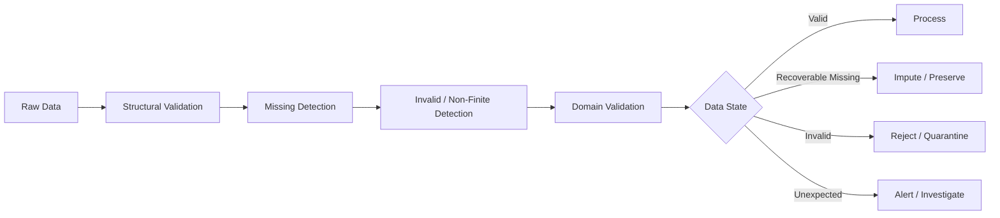
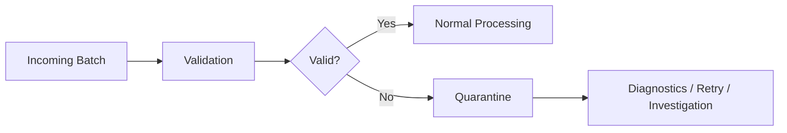

# 02- Missing and Invalid Values

## Overview

Missing and invalid numerical values are different data-quality states that should be modeled explicitly in a production processing pipeline.

For NumPy-based workloads, common cases include:

- `NaN` representing missing or undefined floating-point data.
- `+inf` and `-inf` representing overflow or unbounded numerical results.
- Sentinel values such as `-1`, `9999`, or `-9999` representing missing data in legacy systems.
- Finite values that violate domain constraints.
- Incorrect dtypes that cannot represent the required state.
- Empty or structurally invalid arrays.

The important engineering distinction is:

```text
missing
≠
invalid
≠
non-finite
≠
out-of-range
≠
unusual
```

A value should only be changed, removed, or rejected after the pipeline has established what that state means.



## Missing Values vs Invalid Values

These concepts should not be conflated.

### Missing Values

A missing value means the expected observation is unavailable.

Examples:

```text
customer age → not supplied
sensor reading → temporarily unavailable
transaction amount → not present in source record
```

For floating-point NumPy arrays, `NaN` is commonly used:

```python
import numpy as np

values = np.array(
    [10.0, np.nan, 20.0],
)

missing = np.isnan(values)
```

### Invalid Values

An invalid value exists but violates the expected data contract.

For example:

```text
age = -4
quantity = -10
percentage = 250
status-derived metric = +inf
```

The value is present, but it is not acceptable.

```python
values = np.array(
    [10.0, -4.0, 20.0],
)

invalid = values < 0.0
```

This distinction matters because missing values may be recoverable while invalid values may indicate corruption or a producer defect.

## Data-State Model

A useful production model is:

| State | Example | Typical Treatment |
|---|---|---|
| Valid | `25.0` | Process |
| Missing | `NaN` | Preserve, impute, or reject |
| Positive infinity | `inf` | Usually reject or investigate |
| Negative infinity | `-inf` | Usually reject or investigate |
| Sentinel | `-1` | Convert if documented |
| Out of range | `250` for percentage | Reject, correct, or quarantine |
| Unexpected extreme | `1e15` | Investigate before modifying |

The treatment should come from the domain contract, not from NumPy itself.

## Representing Missing Data

NumPy does not provide a universal missing-value abstraction for every dtype.

For floating-point arrays:

```python
values = np.array(
    [10.0, np.nan, 30.0],
    dtype=np.float64,
)
```

`NaN` is convenient because it can coexist with floating-point values.

For integer arrays, standard NumPy integer dtypes cannot represent `NaN` directly:

```python
values = np.array(
    [10, 20, 30],
    dtype=np.int64,
)
```

When integer precision must be preserved while missingness is still required, alternatives include:

```text
floating representation
+
separate boolean validity mask
```

For example:

```python
values = np.array(
    [10, 20, 0],
    dtype=np.int64,
)

valid = np.array(
    [True, True, False],
)
```

Here `0` is just the stored placeholder. The `valid` mask carries the actual missingness state.

## Detecting Missing Values

For floating-point arrays:

```python
missing = np.isnan(values)
```

The result is a boolean mask.

```python
values = np.array(
    [10.0, np.nan, 30.0],
)

missing = np.isnan(values)

print(missing)
# [False  True False]
```

Never detect `NaN` with:

```python
values == np.nan
```

because `NaN` does not compare equal to itself.

## Detecting Infinity

Use:

```python
infinite = np.isinf(values)
```

This identifies both:

```text
+inf
-inf
```

Example:

```python
values = np.array(
    [10.0, np.inf, -np.inf, 20.0],
)

infinite = np.isinf(values)
```

Result:

```text
[False, True, True, False]
```

## Detecting Any Non-Finite Value

When the contract requires every numeric value to be finite:

```python
finite = np.isfinite(values)
```

A non-finite mask is:

```python
non_finite = ~np.isfinite(values)
```

This captures both:

```text
NaN
+
positive infinity
+
negative infinity
```

For a simple validity check:

```python
if not np.all(
    np.isfinite(values)
):
    raise ValueError(
        "Input contains non-finite values."
    )
```

## Missing Detection vs Finite Detection

These checks answer different questions:

```python
np.isnan(values)
```

asks:

```text
"Which values are NaN?"
```

while:

```python
np.isfinite(values)
```

asks:

```text
"Which values are ordinary finite numbers?"
```

For data-quality validation, finite checks are usually more comprehensive.

## Sentinel Values

Legacy data sources may encode missing values using ordinary numbers:

```text
-1
-9999
999999
0
```

NumPy cannot infer their meaning.

For a documented sentinel:

```python
values = np.array(
    [10.0, -1.0, 20.0],
)

missing = values == -1.0
```

Then convert it explicitly:

```python
cleaned = values.copy()
cleaned[missing] = np.nan
```

This transformation should only be performed when the producer contract explicitly defines `-1` as missing.

Otherwise, a legitimate value can be destroyed.

## Sentinel Values and Dtypes

Converting an integer array to floating point may be necessary if `NaN` must be represented:

```python
values = np.array(
    [10, -1, 20],
    dtype=np.int64,
)

cleaned = values.astype(
    np.float64,
)

cleaned[
    cleaned == -1
] = np.nan
```

This introduces a memory and precision trade-off.

The correct decision depends on:

```text
range requirements
+
precision requirements
+
missing-data semantics
+
downstream representation
```

## Domain Validation

Missing-value handling is only one part of numerical validation.

Suppose a service receives percentages:

```python
values = np.array(
    [10.0, np.nan, 105.0, -2.0],
)
```

A complete validation rule might be:

```python
valid = (
    np.isfinite(values)
    & (values >= 0.0)
    & (values <= 100.0)
)
```

This differentiates:

```text
10      → valid
NaN     → missing/non-finite
105     → finite but out of range
-2      → finite but invalid
```

That distinction is useful for both business logic and observability.

## Invalid Numeric States

A practical validation pipeline can classify values into multiple categories.

```python
values = np.array(
    [
        10.0,
        np.nan,
        np.inf,
        -5.0,
        120.0,
    ],
)

missing = np.isnan(values)
infinite = np.isinf(values)

out_of_range = (
    np.isfinite(values)
    & (
        (values < 0.0)
        | (values > 100.0)
    )
)
```

Now the service can report:

```text
missing_count
infinite_count
out_of_range_count
```

instead of one undifferentiated invalid count.

## Preserve, Reject, or Impute

Every data-quality policy should choose one of three broad actions.

| Action | Use When |
|---|---|
| Preserve | Missingness itself carries useful meaning |
| Reject | The value violates a strict contract |
| Impute | A documented replacement can preserve business semantics |

### Preserve

Keep `NaN` when downstream processing understands missingness:

```python
values = np.array(
    [10.0, np.nan, 30.0],
)
```

For example, a later aggregation may use:

```python
np.nanmean(values)
```

### Reject

Reject when the system requires complete valid input:

```python
if not np.all(
    np.isfinite(values)
):
    raise ValueError(
        "All values must be finite."
    )
```

### Impute

Use a replacement only when there is a defined policy:

```python
replacement = 0.0

cleaned = np.where(
    np.isnan(values),
    replacement,
    values,
)
```

For production systems, the replacement should be derived from domain rules, not convenience.

## Why Zero Is Usually a Dangerous Default

Consider:

```text
missing revenue
```

and:

```text
revenue = 0
```

These do not mean the same thing.

Replacing:

```python
NaN → 0
```

can change:

- Totals.
- Averages.
- Ratios.
- Alert thresholds.
- Business decisions.
- Financial reports.

The correct question is:

```text
What does missing mean in this domain?
```

not:

```text
What numeric value can I use instead?
```

## Statistical Imputation

A simple mean replacement can be implemented with NumPy:

```python
finite = values[
    np.isfinite(values)
]

mean_value = (
    np.mean(finite)
    if finite.size
    else np.nan
)

cleaned = np.where(
    np.isnan(values),
    mean_value,
    values,
)
```

However, this is only appropriate when the statistical assumption is valid.

It may be a poor production policy when:

- Data is highly skewed.
- Missingness is systematic.
- Extremes carry business meaning.
- The mean is itself unstable.
- The field is financially significant.

NumPy provides the mechanics; the data contract determines whether the policy is valid.

## Filtering Invalid Values

When invalid records should be removed:

```python
valid = (
    np.isfinite(values)
    & (values >= 0.0)
)

cleaned = values[
    valid
]
```

Boolean indexing is convenient but generally creates a new array.

For large datasets:

```text
input array
+
boolean mask
+
filtered array
```

can significantly increase peak memory.

Batch processing is usually preferable when the complete dataset does not need to exist in memory.

## Missing Values in Aggregations

Standard aggregation functions can propagate `NaN`:

```python
values = np.array(
    [10.0, np.nan, 30.0],
)

result = np.mean(values)

print(result)
# nan
```

If the policy is to ignore `NaN`:

```python
result = np.nanmean(values)

print(result)
# 20.0
```

The same pattern exists for functions such as:

```python
np.nansum()
np.nanmean()
np.nanmedian()
np.nanmin()
np.nanmax()
np.nanstd()
np.nanvar()
```

These functions ignore `NaN`, not arbitrary invalid values.

## Infinity Is Not Missing

This distinction is critical:

```python
values = np.array(
    [10.0, np.nan, np.inf],
)

np.nanmean(values)
```

can still return infinity because infinity is not `NaN`.

If the requirement is:

```text
"Use only finite values."
```

filter explicitly:

```python
finite = values[
    np.isfinite(values)
]

mean = (
    np.mean(finite)
    if finite.size
    else np.nan
)
```

The semantic rule is now explicit.

## Safe Arithmetic

Invalid values can be generated during processing.

Division is a common source:

```python
numerator = np.array(
    [100.0, 50.0, 20.0],
)

denominator = np.array(
    [10.0, 0.0, 5.0],
)
```

Avoid:

```python
ratio = np.where(
    denominator != 0,
    numerator / denominator,
    0.0,
)
```

because the division expression may still be evaluated.

Use:

```python
ratio = np.zeros_like(
    numerator,
    dtype=np.float64,
)

np.divide(
    numerator,
    denominator,
    out=ratio,
    where=denominator != 0,
)
```

This prevents invalid division where the denominator is zero.

## Numerical Error Policies

Use `np.errstate()` when floating-point exceptions need local handling:

```python
with np.errstate(
    divide="raise",
    invalid="raise",
    over="raise",
):
    result = numerical_operation()
```

Possible policies include:

```text
ignore
warn
raise
call
print
```

The policy should match the expected behavior of the workload.

Suppressing warnings is not a substitute for validating results.

## Handling Overflow

A large numerical operation may produce infinity:

```python
values = np.array(
    [1e300, 1e300],
)

with np.errstate(
    over="ignore",
):
    result = values * values
```

Afterward:

```python
invalid = ~np.isfinite(result)
```

The correct response depends on the domain.

Possible actions:

```text
reject input
change representation
use a different algorithm
quarantine the record
accept as a known state
```

Replacing the infinity with an arbitrary number is usually the least reliable option.

## Separate Data and Validity State

For integer-heavy workloads, a separate validity mask can be more appropriate than converting all values to floating point.

```python
values = np.array(
    [100, 200, 0, 400],
    dtype=np.int64,
)

valid = np.array(
    [True, True, False, True],
)
```

The representation becomes:

```text
values
+
validity mask
```

This can preserve:

- Exact integer representation.
- Compact storage.
- Clear missing-state semantics.

It also requires the application to consistently propagate the mask.

## Batch-Oriented Validation

For large input:

```python
import numpy as np


def validate_batches(
    values: np.ndarray,
    batch_size: int,
) -> tuple[int, int]:
    valid_count = 0
    invalid_count = 0

    for start in range(
        0,
        values.shape[0],
        batch_size,
    ):
        batch = values[
            start:start + batch_size
        ]

        valid = (
            np.isfinite(batch)
            & (batch >= 0.0)
            & (batch <= 1_000_000.0)
        )

        valid_count += np.count_nonzero(
            valid
        )

        invalid_count += np.count_nonzero(
            ~valid
        )

    return (
        valid_count,
        invalid_count,
    )
```

This avoids retaining a full-size validity mask for the entire dataset.

The same pattern works well for:

- Kafka batch consumers.
- Celery workers.
- Scheduled ETL tasks.
- Large CSV or Parquet processing.
- Memory-constrained containers.

## Memory Considerations

Every retained mask consumes memory proportional to the number of elements.

A complex expression such as:

```python
valid = (
    np.isfinite(values)
    & (values >= minimum)
    & (values <= maximum)
)
```

may require temporary arrays while constructing the final mask.

For large datasets, distinguish between:

```text
need exact invalid rows
```

and:

```text
only need invalid count
```

If only the count is required:

```python
invalid_count = np.count_nonzero(
    ~(
        np.isfinite(values)
        & (values >= minimum)
        & (values <= maximum)
    )
)
```

can avoid retaining a named mask after the count is computed.

For very large datasets, batching is often a clearer optimization than trying to eliminate every temporary array.

## Data Quality Metrics

A production pipeline should quantify data quality.

Useful metrics include:

```text
input_records
missing_records
non_finite_records
out_of_range_records
valid_records
rejected_records
invalid_ratio
```

Example:

```python
missing = np.isnan(values)
infinite = np.isinf(values)

valid = (
    np.isfinite(values)
    & (values >= 0.0)
    & (values <= 100.0)
)

metrics = {
    "input_records": int(values.size),
    "missing_records": int(
        np.count_nonzero(missing)
    ),
    "infinite_records": int(
        np.count_nonzero(infinite)
    ),
    "valid_records": int(
        np.count_nonzero(valid)
    ),
    "invalid_records": int(
        np.count_nonzero(~valid)
    ),
}
```

These metrics can be exported through the service's monitoring infrastructure.

A sudden increase in invalid values can indicate:

- Upstream schema changes.
- Broken transformations.
- Unit changes.
- Overflow.
- Deployment regressions.
- Corrupted files.
- Producer bugs.

## Quarantine Instead of Silent Deletion

For important pipelines, invalid records often should not simply disappear.

A safer architecture is:



A quarantine flow may store:

```text
source identifier
record identifier
validation reason
processing timestamp
schema version
```

This improves recoverability and makes upstream defects easier to investigate.

## API and Message Validation

The same principles apply to external service boundaries.

For REST or gRPC payloads:

```text
request
→ schema validation
→ numerical validation
→ business validation
→ processing
```

For Kafka or Celery:

```text
message
→ parse
→ validate numeric state
→ process
→ acknowledge
```

Invalid data should not be acknowledged as successfully processed if doing so would permanently discard an input that requires remediation.

The exact retry or dead-letter policy depends on whether the failure is:

```text
transient
or
data-invalid
```

Retrying permanent invalid data indefinitely is usually a reliability problem.

## PostgreSQL Interaction

PostgreSQL uses `NULL` to represent missing data, which is conceptually different from a NumPy `NaN`.

A data pipeline should define the mapping explicitly:

```text
PostgreSQL NULL
    ↓
Python representation
    ↓
NumPy missing-value representation
```

Likewise, a NumPy `NaN` should not automatically be assumed to mean SQL `NULL`.

For important fields, define the contract for:

```text
missing
non-finite
invalid
default
```

across every system boundary.

## Pandas Interaction

Pandas provides a higher-level abstraction for missing data in labeled tabular datasets.

Use NumPy when:

```text
dense numeric arrays
+
vectorized numerical processing
+
explicit memory control
```

are the primary concern.

Use Pandas when:

```text
column labels
+
mixed dtypes
+
joins
+
grouping
+
tabular ETL
```

are central to the workflow.

A common architecture is:

```text
Pandas
→ select numeric columns
→ NumPy transformation
→ assign result back
```

Avoid repeated representation changes solely to perform simple missing-value checks.

## Performance Considerations

Missing-value detection is usually linear in the number of elements:

```text
O(N)
```

The important production costs are often:

- Full-array scans.
- Temporary masks.
- Copies created by filtering.
- Repeated conversions.
- Excessive batch sizes.

For example:

```python
missing = np.isnan(values)
finite = np.isfinite(values)
```

performs two scans over the array.

Often this is perfectly acceptable.

Optimization should be based on:

```text
realistic dataset size
+
CPU measurements
+
peak memory measurements
+
end-to-end throughput
```

rather than on assumptions about individual NumPy functions.

## Common Mistakes

### Treating Missing and Invalid as the Same State

A missing observation and an invalid observation can require completely different recovery paths.

### Comparing with `np.nan`

Incorrect:

```python
values == np.nan
```

Correct:

```python
np.isnan(values)
```

### Ignoring Infinity

`NaN` checks do not identify infinity.

Use:

```python
np.isfinite(values)
```

when all non-finite values must be rejected.

### Replacing Missing Values with Zero Without a Contract

Zero is a valid number, not a generic missing-value marker.

### Treating Sentinel Values as Universal

A value such as `-1` is only missing when the upstream schema says so.

### Silently Dropping Invalid Records

Deletion without metrics or quarantine can make data loss impossible to diagnose.

### Retrying Permanent Data Errors

Malformed or invalid data often requires rejection or dead-letter handling rather than repeated retries.

### Using `np.nanmean()` for All Invalid Data

It ignores `NaN`, but not infinity and not arbitrary out-of-range values.

### Creating Full-Size Copies Unnecessarily

Boolean indexing, dtype conversion, and cleaning transformations can all allocate additional arrays.

### Using Clipping as a Substitute for Validation

Clipping modifies the data and can hide the fact that the original record violated the contract.

## Testing

Test each data-quality state explicitly:

```python
import numpy as np


def validate(values: np.ndarray) -> np.ndarray:
    return (
        np.isfinite(values)
        & (values >= 0.0)
        & (values <= 100.0)
    )


def test_missing_and_invalid_values():
    values = np.array(
        [
            50.0,
            np.nan,
            np.inf,
            -5.0,
            105.0,
        ],
    )

    result = validate(values)

    np.testing.assert_array_equal(
        result,
        np.array(
            [True, False, False, False, False],
        ),
    )
```

Production test suites should cover:

- `NaN`.
- Positive infinity.
- Negative infinity.
- Sentinel values.
- Lower and upper boundaries.
- Values immediately outside boundaries.
- Empty arrays.
- All-invalid batches.
- All-valid batches.
- Different dtypes.
- Batch boundaries.
- Preservation of original arrays.
- Imputation behavior.
- Quarantine behavior.

## Debugging

When unexpected invalid values appear, do not inspect only the final cleaned array.

Measure each category:

```python
missing = np.isnan(values)
infinite = np.isinf(values)
finite = np.isfinite(values)

print(
    "missing:",
    np.count_nonzero(missing),
)

print(
    "infinite:",
    np.count_nonzero(infinite),
)

print(
    "finite:",
    np.count_nonzero(finite),
)
```

For domain validation:

```python
out_of_range = (
    finite
    & (
        (values < minimum)
        | (values > maximum)
    )
)

print(
    "out_of_range:",
    np.count_nonzero(out_of_range),
)
```

This turns a generic:

```text
invalid data
```

signal into actionable diagnostics.

## Interview Questions

### What is the difference between missing and invalid data?

Missing data means the expected observation is unavailable. Invalid data is present but violates structural, numerical, or domain constraints.

### How do you detect `NaN`?

Use:

```python
np.isnan(values)
```

### How do you detect all non-finite values?

Use:

```python
~np.isfinite(values)
```

which captures `NaN` and both infinities.

### Can NumPy integer arrays contain `NaN`?

Standard NumPy integer dtypes cannot represent `NaN`. Use an appropriate floating representation or a separate validity mask when missingness must be represented.

### Why shouldn't missing values always be replaced with zero?

Because zero is a legitimate numerical value and can have a completely different business meaning from missing.

### Why doesn't `np.nanmean()` solve every invalid-value problem?

It ignores `NaN`, but infinity and ordinary out-of-range values still participate in the computation.

### When is a separate validity mask preferable?

When preserving an integer or exact numeric representation is important and missingness needs to be tracked independently.

### How would you process missing and invalid values in a dataset larger than RAM?

Process bounded batches, classify values with vectorized masks, persist or aggregate results per batch, and retain only compact quality metrics or required outputs.

### How should permanent invalid messages be handled in a Kafka or Celery pipeline?

They generally should be classified separately from transient failures and routed to an appropriate reject or dead-letter path rather than retried indefinitely.

## Key Takeaways

- Missing, invalid, non-finite, sentinel, and out-of-range values are distinct states and should have explicit data-contract semantics.
- Use `np.isnan()` for `NaN`, `np.isinf()` for infinity, and `np.isfinite()` when the contract requires ordinary finite values.
- Never replace missing values with a convenient default such as zero without confirming that the replacement preserves business meaning.
- Production pipelines should classify invalid data, expose quality metrics, and use rejection, quarantine, preservation, or imputation according to an explicit policy.
- For large numerical datasets, combine vectorized validation with bounded batching and careful control of temporary masks, copies, and dtype conversions.