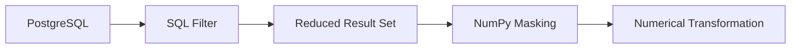

# 03- Masking

## Overview

Masking is the use of a boolean array to identify which elements of a NumPy array satisfy a condition.

A mask is one of the most important building blocks for practical numerical data processing because it connects:

```text
comparison
→ boolean mask
→ selection / validation / transformation / aggregation
```

For example:

```python
import numpy as np

values = np.array(
    [10.0, -5.0, 25.0, np.nan, 100.0],
)

valid = (
    np.isfinite(values)
    & (values >= 0.0)
    & (values <= 100.0)
)
```

The resulting mask identifies which values satisfy the complete validation rule.

Masking is used heavily for:

- Filtering numerical datasets.
- Validating API and ETL input.
- Removing missing or non-finite values.
- Selecting rows that satisfy business rules.
- Conditional transformation.
- Counting invalid records.
- Aggregating only selected values.
- Batch processing large datasets.

## Boolean Masks

A boolean mask is an array of `True` and `False` values with a shape compatible with the data being processed.

```python
import numpy as np

values = np.array(
    [10, 20, 30, 40],
)

mask = values >= 25

print(mask)
# [False False  True  True]
```

The mask has the same shape as `values`:

```text
values → [10 20 30 40]
mask   → [ F  F  T  T]
```

It can then be applied:

```python
selected = values[mask]

print(selected)
# [30 40]
```

The key idea is:

```text
mask does not contain the data
mask describes which data should participate
```

## Creating Masks from Comparisons

Most masks originate from vectorized comparisons:

```python
values > threshold
values >= threshold
values < threshold
values <= threshold
values == expected
values != excluded
```

Example:

```python
values = np.array(
    [10, 20, 30, 40],
)

above_threshold = values > 25
```

Multiple comparisons can be combined:

```python
in_range = (
    (values >= 15)
    & (values <= 35)
)
```

Parentheses should be used around each comparison when combining conditions.

## Combining Masks

Use element-wise logical operators:

```python
valid = (
    condition_a
    & condition_b
)

selected = (
    condition_a
    | condition_b
)

excluded = ~condition_a
```

For boolean arrays:

| Operation | Operator |
|---|---|
| AND | `&` |
| OR | `|` |
| NOT | `~` |
| XOR | `^` |

Do not use Python's:

```python
and
or
not
```

for element-wise NumPy masks.

## Masking for Validation

Masking is particularly useful when a numerical contract contains several constraints.

```python
import numpy as np

amount = np.array(
    [100.0, -10.0, 250.0, np.nan],
)

valid = (
    np.isfinite(amount)
    & (amount >= 0.0)
    & (amount <= 1000.0)
)
```

This expresses:

```text
finite
AND
non-negative
AND
within maximum
```

The same mask can support several operations:

```python
valid_count = np.count_nonzero(
    valid
)

invalid_count = np.count_nonzero(
    ~valid
)

cleaned = amount[
    valid
]
```

A single well-defined mask can therefore drive:

```text
validation
+
filtering
+
metrics
+
downstream processing
```

## Boolean Indexing

Boolean indexing selects elements where the mask is `True`.

```python
values = np.array(
    [10, 20, 30, 40],
)

mask = values >= 30

selected = values[
    mask
]
```

Result:

```text
[30 40]
```

For one-dimensional arrays, the result contains only matching elements.

For multidimensional arrays, boolean indexing can return a one-dimensional result depending on how the mask is applied.

This is convenient for filtering but important from a memory perspective.

### Boolean Indexing Creates a New Array

Consider:

```python
selected = values[mask]
```

The selected result is generally a new array rather than a basic-slicing view of the original data.

This means:

```text
input array
+
boolean mask
+
selected array
```

can all occupy memory simultaneously.

For large datasets, this matters.

## Masking Multidimensional Arrays

Consider:

```python
values = np.array(
    [
        [10, 20, 30],
        [40, 50, 60],
    ],
)

mask = values >= 40
```

The mask has the same shape:

```text
[
    [False, False, False],
    [ True,  True,  True],
]
```

Applying it:

```python
selected = values[
    mask
]
```

produces the matching elements:

```text
[40 50 60]
```

If the goal is to preserve row or column structure, construct a row- or column-level mask rather than masking individual elements.

## Row-Level Masking

Suppose each row represents a record:

```python
records = np.array(
    [
        [101, 25, 1000],
        [102, 17, 500],
        [103, 34, 1500],
    ],
)
```

Suppose the second column represents age and the third represents amount.

Create a row-level mask:

```python
age = records[:, 1]
amount = records[:, 2]

valid_rows = (
    (age >= 18)
    & (amount >= 0)
)
```

Then:

```python
filtered = records[
    valid_rows
]
```

This preserves complete records.

The important pattern is:

```text
column condition
→ row mask
→ select complete records
```

## Masking Along an Axis

For larger arrays, it is often useful to construct masks along a specific dimension.

```python
values = np.array(
    [
        [10, 20, 30],
        [40, 50, 60],
        [70, 80, 90],
    ],
)

row_mask = np.array(
    [True, False, True],
)

filtered_rows = values[
    row_mask,
]
```

Result:

```text
[
    [10, 20, 30],
    [70, 80, 90],
]
```

This is useful when a validation rule applies to the entire record rather than individual elements.

## Aggregating Masks

A mask can be reduced instead of used for selection.

### Count Matching Elements

```python
count = np.count_nonzero(
    mask
)
```

### Check Whether Any Match

```python
has_match = np.any(
    mask
)
```

### Check Whether All Match

```python
all_match = np.all(
    mask
)
```

These operations allow decisions without materializing a filtered dataset:

```text
mask
 ↓
count / any / all
 ↓
compact result
```

This can save memory when the actual matching values are not needed.

## Masking Non-Finite Values

A common data-cleaning mask is:

```python
finite = np.isfinite(
    values
)
```

Then:

```python
cleaned = values[
    finite
]
```

This excludes:

```text
NaN
+inf
-inf
```

If only `NaN` should be excluded:

```python
cleaned = values[
    ~np.isnan(values)
]
```

The choice should match the data contract.

## Masking Sentinel Values

Legacy systems may use values such as `-1` to represent missing data.

```python
values = np.array(
    [10, -1, 20, -1],
)

missing = values == -1
```

You can then filter:

```python
valid = values[
    ~missing
]
```

or convert the sentinel into another representation.

Do not assume a sentinel is invalid without an explicit source-system contract.

## Masking with Multiple Conditions

A realistic ETL rule might be:

```python
values = np.array(
    [10.0, -5.0, 50.0, 120.0, np.nan],
)

valid = (
    np.isfinite(values)
    & (values >= 0.0)
    & (values <= 100.0)
)

valid_values = values[
    valid
]
```

This produces:

```text
[10.0, 50.0]
```

The mask itself is a reusable representation of the data-quality rule.

## Separate Masks for Debugging

For complex validation, avoid making every rule anonymous.

Prefer:

```python
finite = np.isfinite(values)

non_negative = (
    values >= 0.0
)

within_limit = (
    values <= 100.0
)

valid = (
    finite
    & non_negative
    & within_limit
)
```

Now each rule can be measured independently:

```python
print(
    "finite:",
    np.count_nonzero(finite),
)

print(
    "non_negative:",
    np.count_nonzero(non_negative),
)

print(
    "within_limit:",
    np.count_nonzero(within_limit),
)

print(
    "valid:",
    np.count_nonzero(valid),
)
```

This is useful for debugging and production observability.

## Conditional Transformation with Masks

Masks can identify which elements should be transformed.

For example:

```python
values = np.array(
    [10.0, 20.0, 30.0],
)

mask = values > 15.0

result = values.copy()
result[mask] *= 1.10
```

This increases only values above the threshold.

The approach is useful when the operation can safely be applied in-place or on a controlled copy.

For a transformation that naturally maps to conditional selection, `np.where()` may be clearer:

```python
result = np.where(
    values > 15.0,
    values * 1.10,
    values,
)
```

## Masking vs `np.where()`

These approaches solve related but different problems.

| Requirement | Preferred approach |
|---|---|
| Select matching elements | Boolean indexing |
| Modify selected elements | Masked assignment |
| Produce one of two outputs element-wise | `np.where()` |
| Multiple ordered conditions | `np.select()` |
| Count matches | `np.count_nonzero()` |
| Check existence | `np.any()` |
| Require all values to match | `np.all()` |

For example:

```python
selected = values[
    mask
]
```

returns only selected values.

Whereas:

```python
result = np.where(
    mask,
    values,
    replacement,
)
```

preserves the original shape.

## Masked Assignment

A mask can update an array in place:

```python
values = np.array(
    [-10.0, 20.0, -5.0, 30.0],
)

values[values < 0.0] = 0.0
```

Result:

```text
[0.0, 20.0, 0.0, 30.0]
```

This can avoid allocating a second full-size output array.

However, it mutates the original array.

Use:

```python
cleaned = values.copy()
```

when the original must remain unchanged.

## Masked Assignment and Views

If `values` is itself a view into another array:

```python
subset = values[:, :2]
```

then modifying:

```python
subset[subset < 0] = 0
```

may also modify the underlying array.

Whether a slice is a view or copy matters when performing masked assignment.

For production code, know the ownership and aliasing behavior of the array before mutating it.

## Broadcasting and Masks

Masks can participate in broadcasting when their shapes are compatible.

For example:

```python
values = np.array(
    [
        [10.0, 20.0, 30.0],
        [40.0, 50.0, 60.0],
    ],
)

minimum = np.array(
    [5.0, 15.0, 25.0],
)

valid = values >= minimum
```

The `(3,)` threshold is broadcast across the rows.

This allows compact per-column validation without explicitly repeating the threshold array.

## Mask Shape Matters

A mask must have compatible dimensions for the indexing operation being performed.

A common production mistake is constructing a mask for one axis and applying it to another.

For example:

```python
row_mask = np.array(
    [True, False],
)
```

is appropriate for selecting two rows from a `(2, 3)` array.

It is not equivalent to:

```python
column_mask = np.array(
    [True, False, True],
)
```

which selects columns.

Treat shape as part of the validation contract:

```text
data.shape
mask.shape
axis semantics
```

## Masking and Broadcasting Pitfalls

Broadcasting can make an expression valid while still producing the wrong business meaning.

For example:

```python
values.shape == (100, 10)
threshold.shape == (10,)
```

means one threshold per feature.

But:

```python
threshold.shape == (100,)
```

does not represent the same concept and requires a different axis arrangement.

A successful NumPy operation is not proof that the data semantics are correct.

## Masking and Memory

A boolean mask requires additional storage.

For a large dataset:

```text
input
+
mask
+
filtered output
```

can create substantial peak memory usage.

This matters especially when:

```python
selected = values[mask]
```

creates a new array.

If you only need a count:

```python
count = np.count_nonzero(mask)
```

avoid materializing the filtered array.

If you need a transformed array:

```python
result = np.where(
    mask,
    transformed_values,
    values,
)
```

may also allocate a full-size result.

The correct approach depends on whether you need:

```text
selection
+
mutation
+
replacement
+
aggregation
```

## Processing Large Datasets

For large numerical datasets, construct and consume masks one batch at a time.

```python
import numpy as np


def count_valid_values(
    values: np.ndarray,
    batch_size: int,
) -> int:
    valid_count = 0

    for start in range(
        0,
        values.shape[0],
        batch_size,
    ):
        batch = values[
            start:start + batch_size
        ]

        valid = (
            np.isfinite(batch)
            & (batch >= 0.0)
            & (batch <= 100.0)
        )

        valid_count += np.count_nonzero(
            valid
        )

    return valid_count
```

This limits the lifetime of the mask and avoids retaining results for the entire dataset.

The same pattern is useful in:

- Celery workers.
- Kafka consumers.
- Scheduled ETL.
- File-processing services.
- Object-storage pipelines.

## Masking and Source-Side Filtering

When data originates in PostgreSQL, some filtering may be better performed in SQL.

For example:

```sql
SELECT id, amount
FROM transactions
WHERE amount >= 0
  AND amount <= 1000;
```

The architecture becomes:



This can reduce:

- Network transfer.
- Serialization.
- Python memory usage.
- Application-side processing.

NumPy remains useful for numerical conditions or transformations that belong in the application layer.

## Masking API Input

Suppose a service receives a batch of numeric values.

A validation pipeline can be:

```python
import numpy as np


def build_validity_mask(
    values: np.ndarray,
) -> np.ndarray:
    values = np.asarray(
        values,
        dtype=np.float64,
    )

    return (
        np.isfinite(values)
        & (values >= 0.0)
        & (values <= 1_000_000.0)
    )
```

The application can then decide whether to:

```text
reject the request
+
return validation errors
```

or:

```text
accept valid records
+
quarantine invalid records
```

The mask itself should not silently determine API behavior without a defined policy.

## Record-Level Validation

For structured numerical records represented as rows:

```python
records = np.array(
    [
        [101, 50.0, 2],
        [102, -1.0, 3],
        [103, 75.0, 0],
    ],
)

amount = records[:, 1]
quantity = records[:, 2]

valid_rows = (
    np.isfinite(amount)
    & (amount >= 0.0)
    & (quantity > 0)
)

clean_records = records[
    valid_rows
]
```

This is a common pattern for compact numerical datasets:

```text
extract columns
→ construct row mask
→ select complete records
```

For mixed-type records, Pandas or another tabular representation is generally more appropriate.

## Masking with Aggregation

Masks can restrict which values participate in an aggregate.

For example:

```python
values = np.array(
    [10.0, 20.0, -5.0, 30.0],
)

valid = values >= 0.0

valid_sum = np.sum(
    values,
    where=valid,
)
```

This avoids constructing a filtered array solely for the sum.

Similarly:

```python
valid_count = np.count_nonzero(
    valid
)
```

The combination can be useful in memory-sensitive batch processing.

## Masking and `where=`

Some NumPy reduction and ufunc APIs support a `where=` argument.

For example:

```python
total = np.sum(
    values,
    where=valid,
)
```

This can be preferable to:

```python
total = np.sum(
    values[valid]
)
```

when only the aggregate is needed because the latter generally creates a filtered array.

The exact availability and behavior of `where=` varies by NumPy API, so use it where the operation supports it and where it improves the memory profile.

## Masking with Non-Finite Data

Consider:

```python
values = np.array(
    [10.0, np.nan, 30.0, np.inf],
)

valid = (
    np.isfinite(values)
    & (values > 0.0)
)
```

This creates a single validity rule:

```text
finite
AND
positive
```

The same mask can then be used to:

```python
valid_values = values[valid]
```

or:

```python
valid_count = np.count_nonzero(valid)
```

or:

```python
valid_sum = np.sum(
    values,
    where=valid,
)
```

This pattern keeps the numerical contract centralized.

## Masking vs Python Loops

A Python loop:

```python
selected = []

for value in values:
    if 0 <= value <= 100:
        selected.append(value)
```

performs the condition once per element at Python level.

A vectorized approach:

```python
mask = (
    (values >= 0)
    & (values <= 100)
)

selected = values[
    mask
]
```

moves the element-wise comparison into NumPy's compiled operations.

This can significantly reduce Python interpreter overhead for large numerical arrays.

However, the vectorized approach uses temporary arrays and does not guarantee lower wall-clock time for every possible workload. Always benchmark representative data.

## Masking and Dtype Semantics

Comparisons depend on dtype behavior.

For example:

```python
values = np.array(
    [1, 2, 3],
    dtype=np.int32,
)

mask = values > 1
```

produces a boolean mask while retaining the original numerical dtype for `values`.

Masking itself does not convert the source array into booleans.

The resulting selection can have a different shape:

```python
selected = values[mask]
```

but ordinarily retains an appropriate dtype for the selected values.

## Masking and Copies

There are two different memory questions:

```text
Does the mask share memory?
Does the selected output share memory?
```

A basic slice can commonly produce a view:

```python
subset = values[1:5]
```

whereas boolean indexing generally produces a new array:

```python
subset = values[
    values > threshold
]
```

This distinction is important when:

- Mutating selected data.
- Managing large arrays.
- Debugging unexpected memory growth.
- Designing in-place processing.

## Production Validation Pattern

A robust cleaning component can separate:

```text
mask creation
+
metrics
+
action
```

For example:

```python
from dataclasses import dataclass

import numpy as np


@dataclass(frozen=True)
class ValidationResult:
    mask: np.ndarray
    valid_count: int
    invalid_count: int


def validate(
    values: np.ndarray,
) -> ValidationResult:
    mask = (
        np.isfinite(values)
        & (values >= 0.0)
        & (values <= 100.0)
    )

    valid_count = int(
        np.count_nonzero(mask)
    )

    return ValidationResult(
        mask=mask,
        valid_count=valid_count,
        invalid_count=int(values.size) - valid_count,
    )
```

This allows the caller to decide whether invalid data should be:

```text
filtered
+
rejected
+
quarantined
+
reported
```

without coupling validation logic to one specific operational response.

## Monitoring

Masks are useful for data-quality metrics.

Example:

```python
invalid = ~valid

metrics = {
    "input_count": int(values.size),
    "valid_count": int(
        np.count_nonzero(valid)
    ),
    "invalid_count": int(
        np.count_nonzero(invalid)
    ),
}
```

For production monitoring, measure rates rather than logging every invalid value:

```text
valid_ratio
invalid_ratio
missing_ratio
out_of_range_ratio
```

These can reveal upstream changes before they become service-level failures.

## Security and Resource Limits

Masking is often performed on data supplied externally.

An unbounded array can lead to:

```text
large input
+
large boolean mask
+
large filtered output
=
high memory usage
```

Service boundaries should therefore enforce:

- Maximum request size.
- Maximum record count.
- Maximum array dimensions.
- Maximum batch size.
- Numeric range constraints.

Input validation should occur before expensive transformations.

## Common Mistakes

### Using `and` Instead of `&`

Incorrect:

```python
(values > 0) and (values < 100)
```

Correct:

```python
(values > 0) & (values < 100)
```

### Forgetting Parentheses

Use:

```python
(values > 0) & (values < 100)
```

rather than relying on operator precedence.

### Assuming Boolean Indexing Returns a View

Boolean indexing generally creates a new array.

### Filtering When Only a Count Is Needed

Avoid:

```python
np.sum(values[mask])
```

when the actual values are unnecessary. Prefer an appropriate reduction with `where=` when supported.

### Mutating a View Accidentally

A slice can share memory with the original array. Masked assignment on that slice can therefore modify the source.

### Assuming a Valid Shape Means Correct Semantics

Broadcasting can produce a valid operation while applying thresholds to the wrong axis.

### Creating Too Many Masks

Retaining multiple full-size masks can increase peak memory significantly.

### Using Masks Without a Data Contract

A mask such as:

```python
values > 0
```

is only meaningful when zero and negative values have clearly defined business semantics.

### Removing Invalid Data Without Metrics

Filtering silently can make data-quality regressions invisible.

## Testing

Test masks as business rules, not merely as NumPy expressions.

```python
import numpy as np


def build_mask(
    values: np.ndarray,
) -> np.ndarray:
    return (
        np.isfinite(values)
        & (values >= 0.0)
        & (values <= 100.0)
    )


def test_build_mask():
    values = np.array(
        [
            0.0,
            50.0,
            100.0,
            -1.0,
            101.0,
            np.nan,
            np.inf,
        ],
    )

    mask = build_mask(values)

    np.testing.assert_array_equal(
        mask,
        np.array(
            [
                True,
                True,
                True,
                False,
                False,
                False,
                False,
            ],
        ),
    )
```

Also test:

- Empty arrays.
- Single-element arrays.
- Boundary values.
- Values immediately outside boundaries.
- `NaN`.
- Positive and negative infinity.
- Broadcasting.
- Row masks.
- Column masks.
- Mutation behavior.
- Large batches.

## Debugging Mask Logic

When a complex mask behaves unexpectedly, inspect each component independently:

```python
finite = np.isfinite(values)
above_min = values >= minimum
below_max = values <= maximum

print(
    "finite:",
    np.count_nonzero(finite),
)

print(
    "above_min:",
    np.count_nonzero(above_min),
)

print(
    "below_max:",
    np.count_nonzero(below_max),
)

valid = (
    finite
    & above_min
    & below_max
)

print(
    "valid:",
    np.count_nonzero(valid),
)
```

This makes it much easier to identify which rule is rejecting records.

## Interview Questions

### What is a NumPy mask?

A boolean array used to identify which elements satisfy a condition and should participate in selection, transformation, validation, or aggregation.

### What is boolean indexing?

Using a boolean mask to select elements from an array:

```python
selected = values[
    mask
]
```

### Does boolean indexing usually return a view?

No. Boolean indexing generally creates a new array.

### How do you combine multiple NumPy conditions?

Use element-wise operators:

```python
&
|
~
^
```

with parentheses around comparisons.

### When would you use `np.where()` instead of boolean indexing?

Use `np.where()` when you want to produce a result with the original shape and choose between alternative values. Use boolean indexing when you specifically want to select matching elements.

### How can masking be used without creating a filtered array?

Use reductions such as `np.count_nonzero()`, `np.any()`, `np.all()`, or supported `where=` arguments for aggregations and ufuncs.

### Why can masking increase memory usage?

The mask itself consumes memory, and boolean indexing generally creates another array containing the selected elements.

### How would you mask a large dataset efficiently?

Process bounded batches, avoid retaining unnecessary masks, reuse buffers where justified, and push cheap filtering toward the source system when appropriate.

### Why can broadcasting make masking dangerous?

A mask can be shape-compatible while still representing the wrong business semantics, such as applying per-column thresholds to the wrong axis.

### When should NumPy masking be replaced with Pandas filtering?

When the workload is primarily labeled tabular data involving columns, mixed dtypes, joins, and broader ETL operations rather than dense numerical array processing.

## Key Takeaways

- A NumPy mask is a boolean representation of which array elements satisfy a validation, filtering, or transformation rule.
- Build masks from explicit comparisons and combine them with `&`, `|`, `~`, and `^`; never use Python `and`, `or`, or `not` for element-wise array logic.
- Boolean indexing generally creates a new array, so masks and filtered outputs can increase memory usage significantly on large datasets.
- Use reductions and `where=`-style operations when only counts, validations, or aggregates are required and the actual filtered array is unnecessary.
- Treat mask shape, broadcasting, dtype, mutation, and business semantics as part of the production data-processing contract.