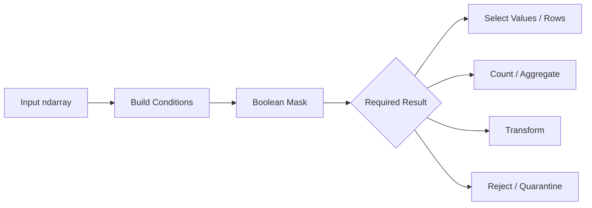
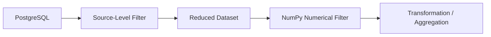

# 04- Filtering

## Overview

Filtering is the process of selecting numerical data that satisfies one or more conditions.

In NumPy, filtering is primarily built from:

```text
comparison
→ boolean mask
→ selection
```

For example:

```python
import numpy as np

values = np.array(
    [10.0, 25.0, 50.0, 120.0],
)

mask = (
    (values >= 20.0)
    & (values <= 100.0)
)

filtered = values[
    mask
]
```

Result:

```text
[25.0, 50.0]
```

Filtering is a core operation in:

- Data cleaning.
- ETL pipelines.
- Numerical validation.
- Batch processing.
- API and file ingestion.
- Aggregation.
- Outlier handling.
- Preprocessing before database writes.

The engineering goal is not merely to select values, but to make the filtering rule explicit, efficient, testable, and safe for large datasets.

## Filtering Model

A typical NumPy filtering pipeline looks like:



The same mask can therefore support different actions without duplicating the business rule.

## Boolean Filtering

The simplest form uses a comparison:

```python
values = np.array(
    [10, 20, 30, 40],
)

filtered = values[
    values >= 30
]
```

Result:

```text
[30 40]
```

The comparison creates a boolean mask:

```text
values → [10 20 30 40]
mask   → [ F  F  T  T]
```

NumPy then selects the elements corresponding to `True`.

## Range Filtering

Range filtering is common in validation:

```python
values = np.array(
    [10, 25, 50, 75, 120],
)

mask = (
    (values >= 20)
    & (values <= 100)
)

filtered = values[
    mask
]
```

Result:

```text
[25 50 75]
```

Always parenthesize individual comparisons when combining them.

Prefer:

```python
(values >= minimum) & (values <= maximum)
```

over relying on operator precedence.

## Multiple Conditions

Production filtering usually involves more than one rule.

```python
values = np.array(
    [10.0, -5.0, 50.0, np.nan, 120.0],
)

mask = (
    np.isfinite(values)
    & (values >= 0.0)
    & (values <= 100.0)
)

filtered = values[
    mask
]
```

This expresses:

```text
finite
AND
non-negative
AND
within maximum
```

For complex rules, named intermediate conditions improve maintainability:

```python
finite = np.isfinite(values)
non_negative = values >= 0.0
within_limit = values <= 100.0

mask = (
    finite
    & non_negative
    & within_limit
)
```

## OR Conditions

Use `|` for element-wise OR:

```python
values = np.array(
    [10, 25, 50, 75],
)

mask = (
    (values < 20)
    | (values > 70)
)

filtered = values[
    mask
]
```

Result:

```text
[10 75]
```

This is useful for disjoint conditions such as:

```text
priority == high
OR
priority == critical
```

or:

```text
value below lower bound
OR
value above upper bound
```

## Negating a Filter

Use `~` to invert a boolean mask:

```python
values = np.array(
    [10, 20, 30, 40],
)

excluded = values < 25

selected = values[
    ~excluded
]
```

Result:

```text
[30 40]
```

This is often clearer than rewriting the opposite condition, especially when a validation rule has already been defined.

## Filtering Multidimensional Arrays

Consider rows representing records:

```python
records = np.array(
    [
        [101, 25, 500.0],
        [102, 17, 250.0],
        [103, 35, 900.0],
    ],
)
```

Suppose:

```text
column 0 → record ID
column 1 → age
column 2 → amount
```

Construct a row-level mask:

```python
age = records[:, 1]
amount = records[:, 2]

mask = (
    (age >= 18)
    & (amount >= 0.0)
)

filtered = records[
    mask
]
```

Result:

```text
[
    [101, 25, 500.0],
    [103, 35, 900.0],
]
```

This is the preferred pattern when the unit being filtered is a complete record.

## Row Filtering vs Element Filtering

These are different operations.

For:

```python
records.shape == (1000, 5)
```

a mask with shape:

```text
(1000,)
```

can select rows.

A mask with shape:

```text
(1000, 5)
```

describes individual elements.

The distinction matters because a row-level filter preserves record structure:

```text
1000 rows × 5 columns
→ selected rows × 5 columns
```

whereas element-level boolean selection can flatten the selected values into a one-dimensional result.

Define the mask according to the logical unit being filtered.

## Filtering Columns

A boolean mask can also select columns when its shape matches the column dimension.

```python
values = np.array(
    [
        [10, 20, 30],
        [40, 50, 60],
    ],
)

column_mask = np.array(
    [True, False, True],
)

filtered = values[
    :,
    column_mask,
]
```

Result:

```text
[
    [10 30],
    [40 60],
]
```

This is useful when selecting a subset of numerical features or metrics.

## Filtering with Broadcasting

Broadcasting can make filtering concise.

```python
values = np.array(
    [
        [10.0, 20.0, 30.0],
        [40.0, 50.0, 60.0],
    ],
)

minimum = np.array(
    [5.0, 15.0, 25.0],
)

mask = values >= minimum
```

The `(3,)` threshold is broadcast across each row.

This is useful for per-column constraints:

```text
feature A >= 5
feature B >= 15
feature C >= 25
```

Broadcasting should be used deliberately. A shape-compatible operation can still encode the wrong business semantics.

## Filtering Missing and Non-Finite Values

A common filter is:

```python
mask = np.isfinite(values)
```

which removes:

```text
NaN
+inf
-inf
```

Then:

```python
cleaned = values[
    mask
]
```

If only missing `NaN` values should be removed:

```python
cleaned = values[
    ~np.isnan(values)
]
```

The difference is important because infinity is not the same state as missing data.

## Filtering Sentinel Values

Legacy systems may use ordinary values as missing markers:

```python
values = np.array(
    [10, -1, 20, -1, 30],
)

mask = values != -1

filtered = values[
    mask
]
```

The sentinel must be defined by the upstream data contract.

A legitimate `-1` should not be removed merely because it is unusual.

## Filtering and `NaN`

Comparisons with `NaN` do not behave like ordinary numerical comparisons.

For example:

```python
values = np.array(
    [10.0, np.nan, 30.0],
)

mask = values > 20.0
```

produces:

```text
[False False True]
```

If missing values should be rejected explicitly, use:

```python
mask = (
    np.isfinite(values)
    & (values > 20.0)
)
```

This makes the intended policy explicit.

## Filtering Before Aggregation

Filtering is often used to define the population included in an aggregation.

```python
values = np.array(
    [10.0, -5.0, 20.0, 30.0],
)

mask = values >= 0.0

filtered_mean = np.mean(
    values[mask]
)
```

If only the aggregate is required, avoid allocating the filtered array when the aggregation supports `where=`:

```python
filtered_mean = np.mean(
    values,
    where=mask,
)
```

This can reduce temporary memory usage.

For large arrays, the difference between:

```text
filter → allocate → aggregate
```

and:

```text
aggregate with condition
```

can become significant.

## Filtering with `np.count_nonzero()`

When only the number of matching records matters:

```python
mask = values >= 0.0

count = np.count_nonzero(
    mask
)
```

This is generally preferable to:

```python
count = values[mask].size
```

because the second form creates a filtered array that is not otherwise needed.

This distinction matters in large batch-processing jobs.

## `np.any()` and `np.all()`

Filtering conditions can also be reduced to a decision.

Use:

```python
np.any(mask)
```

to answer:

```text
"Does at least one record match?"
```

Use:

```python
np.all(mask)
```

to answer:

```text
"Do all records satisfy the condition?"
```

Example:

```python
has_invalid = np.any(
    ~mask
)

all_valid = np.all(
    mask
)
```

These operations are useful for request validation and batch-level quality gates.

## Filtering with `np.where()`

`np.where()` is appropriate when filtering logic should produce a full-size result rather than physically removing elements.

```python
values = np.array(
    [-10.0, 20.0, 30.0],
)

result = np.where(
    values >= 0.0,
    values,
    0.0,
)
```

Result:

```text
[0.0, 20.0, 30.0]
```

The shape remains unchanged.

Compare:

```python
values[values >= 0]
```

which returns only valid elements.

Therefore:

| Goal | Operation |
|---|---|
| Remove non-matching elements | Boolean indexing |
| Keep shape and replace values | `np.where()` |
| Count matches | `np.count_nonzero()` |
| Check any match | `np.any()` |
| Check all match | `np.all()` |

## Multiple Ordered Conditions

For multiple mutually exclusive output categories, `np.select()` can be clearer than deeply nested `np.where()` calls.

```python
values = np.array(
    [10, 50, 90],
)

conditions = [
    values < 25,
    values < 75,
]

choices = [
    0,
    1,
]

result = np.select(
    conditions,
    choices,
    default=2,
)
```

Result:

```text
[0 1 2]
```

The conditions are evaluated in order, and the first matching condition determines the result.

Use `np.select()` when the requirement is classification rather than pure filtering.

## Filtering vs Clipping

Filtering removes or excludes data:

```python
filtered = values[
    (values >= 0)
    & (values <= 100)
]
```

Clipping modifies values:

```python
clipped = np.clip(
    values,
    0,
    100,
)
```

These have different semantics.

```text
filter
→ preserve only values that satisfy the rule

clip
→ force values into a range
```

Do not use clipping when invalid records need to be identified and audited.

## Filtering and Copy Behavior

Boolean indexing generally creates a new array:

```python
filtered = values[
    mask
]
```

This is useful because modifying `filtered` normally does not modify the original array.

However, it also means memory usage increases.

By contrast, basic slicing:

```python
subset = values[
    100:200
]
```

commonly creates a view.

The memory and mutation semantics are therefore different.

## In-Place Filtering Alternatives

Sometimes the objective is not to create a filtered array but to modify invalid values.

For example:

```python
values = np.array(
    [-5.0, 10.0, 20.0],
)

values[values < 0.0] = 0.0
```

This avoids allocating a second full-size output array, but mutates the original.

Use this only when ownership is clear.

For shared or reusable input buffers:

```python
cleaned = values.copy()

cleaned[
    cleaned < 0.0
] = 0.0
```

is safer.

## Memory Considerations

Filtering has three common memory patterns.

### Boolean Selection

```python
filtered = values[
    mask
]
```

Potentially requires:

```text
original array
+
mask
+
filtered array
```

### In-Place Masked Assignment

```python
values[mask] = replacement
```

Can reduce output allocation but mutates the input.

### Conditional Full-Size Output

```python
result = np.where(
    mask,
    values,
    replacement,
)
```

typically creates a new output with the same logical shape.

Choose based on whether the requirement is:

```text
selection
+
mutation
+
replacement
+
preservation of source
```

## Filtering Large Datasets

For very large arrays, process data in bounded batches.

```python
import numpy as np


def count_valid_records(
    values: np.ndarray,
    batch_size: int,
) -> int:
    valid_count = 0

    for start in range(
        0,
        values.shape[0],
        batch_size,
    ):
        batch = values[
            start:start + batch_size
        ]

        mask = (
            np.isfinite(batch)
            & (batch >= 0.0)
            & (batch <= 100.0)
        )

        valid_count += np.count_nonzero(
            mask
        )

    return valid_count
```

This approach keeps working memory bounded by the batch size rather than the entire dataset.

It is useful for:

- Large file processing.
- Kafka batch consumers.
- Celery tasks.
- Scheduled data pipelines.
- Object-storage ingestion.

## Filtering with Memory-Mapped Data

For large file-backed arrays:

```python
import numpy as np

values = np.memmap(
    "metrics.dat",
    dtype=np.float64,
    mode="r",
    shape=(100_000_000,),
)

batch_size = 1_000_000

for start in range(
    0,
    values.shape[0],
    batch_size,
):
    batch = values[
        start:start + batch_size
    ]

    mask = (
        np.isfinite(batch)
        & (batch >= 0.0)
    )

    valid_batch = batch[
        mask
    ]

    # Persist or process valid_batch.
```

Memory mapping avoids requiring the entire file-backed dataset to be loaded eagerly, but the filtered output still allocates memory.

Choose a batch size based on measured memory and I/O behavior.

## Filtering and PostgreSQL

Filtering is often cheaper when performed close to the data source.

For example:

```sql
SELECT id, amount
FROM transactions
WHERE amount >= 0
  AND amount <= 1000;
```

This can reduce:

```text
database rows
→ network transfer
→ Python objects
→ NumPy array size
→ memory pressure
```

A common production architecture is:



Do not move filtering into NumPy purely because NumPy is available.

If SQL can safely eliminate unnecessary rows, source-side filtering is often preferable.

## Filtering API Input

For a numerical API payload:

```python
import numpy as np


def filter_valid_amounts(
    values: np.ndarray,
) -> np.ndarray:
    values = np.asarray(
        values,
        dtype=np.float64,
    )

    mask = (
        np.isfinite(values)
        & (values >= 0.0)
        & (values <= 1_000_000.0)
    )

    return values[
        mask
    ]
```

For a real API service, the caller must decide whether invalid entries should:

```text
be rejected
be returned as validation errors
be dropped
be quarantined
```

Do not silently drop externally supplied invalid data unless the API contract explicitly permits partial acceptance.

## Filtering Kafka or Celery Batches

For asynchronous processing, a filter can separate valid and invalid records:

```text
incoming batch
      ↓
build mask
      ↓
valid records ─────→ normal processing
      │
invalid records ───→ dead-letter / quarantine
```

This is preferable to repeatedly retrying permanently invalid records.

For high-volume systems, keep rejection metrics such as:

```text
batch_size
valid_count
invalid_count
invalid_ratio
```

and expose them through normal service observability.

## Filtering and Pandas

Pandas is often the more natural abstraction when the workload is primarily tabular:

```python
filtered = frame[
    (frame["amount"] >= 0)
    & (frame["amount"] <= 1000)
]
```

NumPy is a strong fit when:

```text
dense numerical arrays
+
vectorized computation
+
explicit memory control
```

are central to the operation.

A common architecture is:

```text
Pandas
→ extract numeric arrays
→ NumPy transformation/filter
→ assign result back
```

Avoid repeated conversions between Pandas and NumPy inside hot loops.

## Filtering vs Python Lists

Python's list comprehension:

```python
filtered = [
    value
    for value in values
    if 0 <= value <= 100
]
```

is perfectly reasonable for Python-native collections.

NumPy becomes attractive for large homogeneous numerical arrays because:

- Comparisons operate in vectorized form.
- Python-level per-element loop overhead is reduced.
- Array memory is compact and structured.
- Filtering integrates naturally with numerical operations.

NumPy does not make Python lists obsolete. The correct structure depends on the workload.

## Performance Considerations

Filtering usually requires at least one pass through the relevant data:

```text
O(N)
```

The actual cost depends on:

- Number of conditions.
- Number of temporary masks.
- Array size.
- Dtype.
- Memory layout.
- Cache behavior.
- Memory bandwidth.
- Cost of materializing filtered results.

A vectorized filter can reduce Python interpreter overhead, but it may also create:

```text
boolean mask
+
filtered copy
```

For very large workloads, memory bandwidth and allocation costs can dominate CPU arithmetic.

Measure:

```text
throughput
latency
peak RSS
allocation behavior
```

rather than comparing syntax in isolation.

## Reducing Temporary Allocations

For performance-sensitive workloads, consider whether an intermediate result is actually required.

Instead of:

```python
mask = values >= 0
count = values[mask].size
```

prefer:

```python
count = np.count_nonzero(
    values >= 0
)
```

when only the count is needed.

Similarly, for supported reductions:

```python
total = np.sum(
    values,
    where=values >= 0,
)
```

can avoid creating the selected array.

The goal is not to eliminate every temporary array blindly, but to avoid allocations whose results are immediately discarded.

## Filtering and Short-Circuiting

Do not assume NumPy boolean expressions short-circuit like scalar Python conditions.

For example:

```python
mask = (
    np.isfinite(values)
    & expensive_condition(values)
)
```

may still evaluate the expensive condition for every element.

When a computation is unsafe or expensive, consider restructuring the operation.

For unsafe arithmetic, use a ufunc's `where=` support when available:

```python
result = np.zeros_like(
    numerator,
    dtype=np.float64,
)

np.divide(
    numerator,
    denominator,
    out=result,
    where=denominator != 0,
)
```

This is preferable to evaluating an invalid expression and filtering the result afterward.

## Input Validation and Security

Filtering often processes data controlled by external systems.

Protect the service against:

- Excessively large arrays.
- Huge request payloads.
- Extreme dimensions.
- Unexpected dtypes.
- Pathological batch sizes.
- Numeric values far outside the expected domain.

Apply limits before allocating unnecessary intermediate arrays.

For example:

```text
request size
→ record-count validation
→ dtype / shape validation
→ numerical filtering
→ processing
```

Filtering is not a substitute for resource limits.

## Observability

A production filtering stage should expose enough information to explain what happened.

Useful metrics include:

```text
records_received
records_selected
records_rejected
selection_ratio
invalid_ratio
processing_time
```

For example:

```python
selected_count = np.count_nonzero(
    mask
)

rejected_count = (
    values.size
    - selected_count
)
```

Track rates over time rather than logging every rejected record.

A sudden change in `selection_ratio` can indicate:

- Upstream data changes.
- Schema changes.
- Incorrect units.
- Deployment regressions.
- New invalid input patterns.

## Common Mistakes

### Using Python `and` or `or`

Incorrect:

```python
(values > 10) and (values < 100)
```

Correct:

```python
(values > 10) & (values < 100)
```

### Forgetting Parentheses

Write:

```python
(values > 10) & (values < 100)
```

rather than depending on operator precedence.

### Filtering Before Defining the Data Contract

A filter is only correct relative to a defined business rule.

### Assuming Boolean Filtering Is Free

Boolean indexing generally creates a new array.

### Creating Filtered Arrays When Only a Count Is Needed

Use:

```python
np.count_nonzero(mask)
```

instead of materializing selected values.

### Silently Dropping Invalid API Records

Partial acceptance should be explicit in the API contract.

### Using Clipping Instead of Filtering

Clipping changes invalid values rather than identifying and excluding them.

### Ignoring `NaN` and Infinity

A numerical comparison alone may not represent the complete validity rule.

### Assuming Broadcasting Guarantees Correctness

A broadcast-compatible condition can still be applied to the wrong axis.

### Mutating Shared Arrays

Masked assignment modifies the source array and can affect other consumers when the array is shared.

## Testing

Filtering logic should be tested as a business rule.

```python
import numpy as np


def filter_values(
    values: np.ndarray,
) -> np.ndarray:
    mask = (
        np.isfinite(values)
        & (values >= 0.0)
        & (values <= 100.0)
    )

    return values[
        mask
    ]


def test_filter_values():
    values = np.array(
        [
            0.0,
            50.0,
            100.0,
            -1.0,
            101.0,
            np.nan,
            np.inf,
        ],
    )

    result = filter_values(values)

    np.testing.assert_array_equal(
        result,
        np.array(
            [0.0, 50.0, 100.0],
        ),
    )
```

Test:

- Empty input.
- All matching values.
- No matching values.
- Boundary values.
- Values immediately outside boundaries.
- `NaN`.
- Positive and negative infinity.
- Multiple conditions.
- Multidimensional arrays.
- Row and column masks.
- Broadcasting.
- Dtype behavior.
- Large batches.

## Debugging

When a filter produces an unexpected number of records, inspect each condition separately.

```python
finite = np.isfinite(values)
above_min = values >= minimum
below_max = values <= maximum

print(
    "finite:",
    np.count_nonzero(finite),
)

print(
    "above_min:",
    np.count_nonzero(above_min),
)

print(
    "below_max:",
    np.count_nonzero(below_max),
)

mask = (
    finite
    & above_min
    & below_max
)

print(
    "selected:",
    np.count_nonzero(mask),
)
```

This identifies which rule is responsible for the reduction.

## Interview Questions

### What is NumPy filtering?

Filtering uses one or more conditions to construct a boolean mask and select or process only elements that satisfy the resulting mask.

### What is the difference between masking and filtering?

A mask is the boolean representation of a condition. Filtering applies that mask to produce a selected subset or drive another operation.

### Does boolean filtering create a copy?

Boolean indexing generally creates a new array rather than a basic-slicing view.

### How do you filter a two-dimensional array by rows?

Create a one-dimensional row mask and apply it to the first axis:

```python
filtered = values[row_mask]
```

### How do you preserve the shape while conditionally changing values?

Use `np.where()` rather than boolean indexing:

```python
result = np.where(
    mask,
    new_values,
    values,
)
```

### How can you count matching records efficiently?

Use:

```python
np.count_nonzero(mask)
```

rather than creating a filtered array when the values themselves are not needed.

### How do you filter only finite values?

Use:

```python
values[np.isfinite(values)]
```

### When should filtering happen in PostgreSQL instead of NumPy?

When the data already resides in PostgreSQL and source-side filtering can safely reduce rows transferred to the application.

### Why can a vectorized filter still consume significant memory?

The boolean mask and filtered output are additional arrays, and complex conditions can introduce temporary arrays.

### How would you filter a dataset larger than RAM?

Process the input in bounded batches, filter each batch, persist or aggregate the result, and avoid retaining the entire filtered dataset unless required.

## Key Takeaways

- NumPy filtering is built around vectorized comparisons and boolean masks, allowing efficient selection of numerical values and records.
- Use `&`, `|`, and `~` with parenthesized comparisons for element-wise conditions, and distinguish row-level masks from element-level masks.
- Boolean indexing generally creates a new array, so filtering can increase memory usage through masks and selected outputs.
- When only counts or aggregates are required, prefer reductions such as `np.count_nonzero()`, `np.any()`, `np.all()`, or supported `where=` arguments instead of materializing filtered arrays.
- Production filtering should use explicit data contracts, bounded batches, source-side filtering where appropriate, and observable selection/rejection metrics.