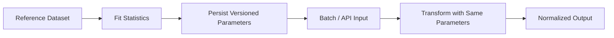
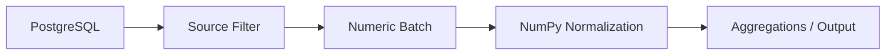

# 05- Normalization

## Overview

Normalization transforms numerical values into a consistent scale while preserving the relationships required by downstream processing.

In backend and data-engineering workloads, normalization is useful when numerical features or measurements have very different ranges:

```text
response_time → 120–5000 ms
request_count → 1–1,000,000
error_rate    → 0–1
```

Feeding these values directly into a downstream numerical operation can make some dimensions dominate purely because of their scale.

Common normalization strategies include:

| Technique | Typical Output | Primary Use |
|---|---|---|
| Min-max scaling | Fixed range such as `[0, 1]` | Known bounded feature range |
| Z-score standardization | Mean near `0`, standard deviation near `1` | Centering and scale adjustment |
| Maximum-absolute scaling | Values near `[-1, 1]` | Preserve sign and zero |
| L1-style row normalization | Row sums near `1` | Relative proportions |
| L2-style row normalization | Vector magnitude near `1` | Relative magnitude |

NumPy provides the arithmetic needed to implement these transformations directly. It does not impose a single normalization policy, so the engineering contract must define:

```text
input assumptions
+
fit statistics
+
transformation
+
output range
+
missing-value behavior
```

## Normalization vs Standardization

These terms are often used interchangeably, but they describe different transformations.

### Normalization

Normalization commonly means mapping values to a bounded or otherwise controlled scale.

For min-max normalization:

```text
x' = (x - min) / (max - min)
```

The result is typically within:

```text
[0, 1]
```

### Standardization

Standardization centers values around their mean and scales them by their standard deviation:

```text
z = (x - mean) / std
```

The result is not bounded to `[0, 1]`.

The distinction matters because the transformation determines how downstream systems should interpret the resulting values.

## Min-Max Normalization

Min-max normalization maps a numerical range to a target interval.

For `[0, 1]`:

```python
import numpy as np

values = np.array(
    [10.0, 20.0, 40.0, 50.0],
)

minimum = np.min(values)
maximum = np.max(values)

normalized = (
    (values - minimum)
    / (maximum - minimum)
)
```

Result:

```text
[0.0, 0.25, 0.75, 1.0]
```

The smallest value maps to `0` and the largest to `1`.

## Why Min-Max Normalization Exists

Min-max normalization is useful when the output needs a predictable bounded scale.

Typical backend/data-processing cases include:

- Converting measurements to a common scale.
- Normalizing operational metrics.
- Preparing numerical features for downstream processing.
- Comparing values across dimensions with known boundaries.
- Producing consistent values for APIs or file formats.

It is particularly useful when the original range has meaningful minimum and maximum values.

## General Min-Max Formula

For source range `[min, max]` and target range `[a, b]`:

```text
x' = a + ((x - min) * (b - a)) / (max - min)
```

NumPy implementation:

```python
import numpy as np


def min_max_scale(
    values: np.ndarray,
    minimum: float,
    maximum: float,
    lower: float = 0.0,
    upper: float = 1.0,
) -> np.ndarray:
    values = np.asarray(
        values,
        dtype=np.float64,
    )

    span = maximum - minimum

    if span == 0.0:
        raise ValueError(
            "Cannot normalize a zero-width range."
        )

    return (
        lower
        + (
            (values - minimum)
            * (upper - lower)
            / span
        )
    )
```

The function separates the transformation from how the minimum and maximum were obtained.

## Zero-Range Data

Normalization fails when:

```text
max == min
```

For example:

```python
values = np.array(
    [50.0, 50.0, 50.0],
)

minimum = np.min(values)
maximum = np.max(values)

span = maximum - minimum
```

Here:

```text
span = 0
```

A division by zero would produce invalid values.

The correct policy must be explicit.

Possible policies include:

| Situation | Possible Policy |
|---|---|
| Constant feature is meaningless | Drop it |
| Constant feature is valid | Map all values to a documented constant |
| Strict pipeline | Reject the feature |
| External contract | Use configured fallback |

Do not silently choose a policy just because it avoids a warning.

## Explicit Constant-Feature Handling

If a constant array should map to a fixed value:

```python
import numpy as np


def min_max_scale(
    values: np.ndarray,
) -> np.ndarray:
    values = np.asarray(
        values,
        dtype=np.float64,
    )

    minimum = np.min(values)
    maximum = np.max(values)

    if minimum == maximum:
        return np.zeros_like(
            values,
            dtype=np.float64,
        )

    return (
        (values - minimum)
        / (maximum - minimum)
    )
```

Whether zero is the correct result is a domain decision, not a mathematical requirement.

## Z-Score Standardization

Standardization uses the mean and standard deviation:

```python
import numpy as np

values = np.array(
    [10.0, 20.0, 30.0, 40.0],
)

mean = np.mean(values)
std = np.std(values)

standardized = (
    (values - mean)
    / std
)
```

The transformed data is centered around zero.

For a population standard deviation:

```python
np.std(
    values,
    ddof=0,
)
```

For a sample standard deviation:

```python
np.std(
    values,
    ddof=1,
)
```

The `ddof` choice is part of the numerical contract and should be consistent across services or pipeline stages.

## Zero-Variance Standardization

A constant array has:

```text
std = 0
```

Therefore:

```python
(values - mean) / std
```

is undefined.

Handle the case explicitly:

```python
std = np.std(values)

if std == 0.0:
    raise ValueError(
        "Cannot standardize a zero-variance array."
    )
```

For production pipelines, silently producing `NaN` or infinity from zero variance can make downstream failures difficult to diagnose.

## Per-Column Normalization

For a 2D dataset where each column represents a feature:

```python
values = np.array(
    [
        [10.0, 100.0, 0.10],
        [20.0, 200.0, 0.20],
        [30.0, 300.0, 0.30],
    ],
)
```

Calculate column-wise minimum and maximum:

```python
minimum = np.min(
    values,
    axis=0,
)

maximum = np.max(
    values,
    axis=0,
)

normalized = (
    (values - minimum)
    / (maximum - minimum)
)
```

Shapes:

```text
values   → (3, 3)
minimum  → (3,)
maximum  → (3,)
```

Broadcasting applies each feature's statistics to the corresponding column.

## Broadcasting in Normalization

Broadcasting is what makes column-wise normalization concise.

```python
minimum = np.array(
    [10.0, 100.0, 0.10],
)

maximum = np.array(
    [30.0, 300.0, 0.30],
)

normalized = (
    (values - minimum)
    / (maximum - minimum)
)
```

The `(3,)` statistics are applied independently to every row.

This avoids explicitly constructing repeated `(3, 3)` arrays.

## Normalizing Rows

Sometimes each row should be normalized independently.

For example, convert each row into proportions:

```python
values = np.array(
    [
        [2.0, 3.0, 5.0],
        [4.0, 1.0, 5.0],
    ],
)

row_totals = np.sum(
    values,
    axis=1,
    keepdims=True,
)

normalized = (
    values
    / row_totals
)
```

`keepdims=True` preserves a shape compatible with broadcasting:

```text
values       → (2, 3)
row_totals   → (2, 1)
normalized   → (2, 3)
```

Each row now represents relative proportions.

## L1-Style Row Normalization

A row can be normalized by its absolute-value sum:

```python
norm = np.sum(
    np.abs(values),
    axis=1,
    keepdims=True,
)

normalized = (
    values / norm
)
```

This is useful when the representation should preserve relative contributions while controlling the total absolute magnitude.

It requires explicit handling when the norm is zero.

## L2-Style Row Normalization

For Euclidean magnitude normalization:

```python
norm = np.linalg.norm(
    values,
    axis=1,
    keepdims=True,
)

normalized = (
    values / norm
)
```

If using this pattern in production, handle zero-norm rows before division.

For a practical numerical pipeline, the important point is that normalization defines the scale of the representation; it does not add information that was absent from the original data.

## Handling Zero Norms

Suppose a row contains only zeros:

```python
values = np.array(
    [
        [1.0, 2.0, 3.0],
        [0.0, 0.0, 0.0],
    ],
)
```

The second row has a zero norm.

Guard the operation:

```python
norm = np.linalg.norm(
    values,
    axis=1,
    keepdims=True,
)

normalized = np.zeros_like(
    values,
    dtype=np.float64,
)

np.divide(
    values,
    norm,
    out=normalized,
    where=norm != 0,
)
```

This avoids generating invalid values.

The fallback semantics for zero vectors should still be documented.

## Maximum-Absolute Scaling

Maximum-absolute scaling divides by the largest absolute value:

```python
scale = np.max(
    np.abs(values),
)

if scale == 0.0:
    raise ValueError(
        "Cannot scale an all-zero array."
    )

normalized = (
    values / scale
)
```

This preserves the sign of the values and maps the largest magnitude to approximately `1` or `-1`.

It is useful when:

```text
zero has meaningful semantics
+
positive/negative direction matters
```

## Choosing a Normalization Strategy

| Technique | Advantages | Limitations |
|---|---|---|
| Min-max | Bounded and intuitive | Sensitive to observed extremes |
| Z-score | Centers and scales by distribution | Not bounded |
| Max-absolute | Preserves sign and zero | Sensitive to largest magnitude |
| L1 row normalization | Expresses relative contribution | Zero rows need handling |
| L2 row normalization | Controls vector magnitude | Zero vectors need handling |

The correct method depends on the downstream contract.

## Outliers and Normalization

Normalization does not automatically solve outliers.

For min-max scaling:

```text
[10, 20, 30, 10000]
```

the value `10000` can compress most other normalized values toward zero.

This means:

```text
normalization
≠
outlier detection
```

A production pipeline should decide separately whether extreme values are:

```text
valid
invalid
or
requiring a separate treatment
```

Do not clip outliers simply to make normalization look numerically convenient.

## Normalization and Missing Values

Normalization should have an explicit missing-value policy.

Given:

```python
values = np.array(
    [10.0, np.nan, 30.0],
)
```

ordinary reductions can propagate `NaN`:

```python
minimum = np.min(values)
```

which may produce `NaN`.

If the policy is to calculate statistics over finite values:

```python
finite = np.isfinite(values)

minimum = np.min(
    values,
    where=finite,
    initial=np.inf,
)

maximum = np.max(
    values,
    where=finite,
    initial=-np.inf,
)
```

However, an all-invalid input still needs explicit handling before using these statistics.

A simpler approach is to filter finite values:

```python
finite_values = values[
    np.isfinite(values)
]
```

at the cost of creating a filtered array.

## Normalizing Only Finite Values

For a cleaning-oriented workflow:

```python
finite = np.isfinite(values)

finite_values = values[
    finite
]

if finite_values.size == 0:
    raise ValueError(
        "No finite values available."
    )

minimum = np.min(
    finite_values
)

maximum = np.max(
    finite_values
)
```

Then normalize the finite subset.

This approach is explicit and easy to reason about, but boolean indexing creates a new array.

For very large data, calculate statistics in batches instead of materializing the entire finite subset.

## Fit Statistics vs Transform

A critical production distinction is:

```text
fit
→ calculate statistics

transform
→ apply those statistics
```

For min-max normalization:

```text
fit:
    minimum
    maximum

transform:
    (x - minimum) / (maximum - minimum)
```

For standardization:

```text
fit:
    mean
    standard deviation

transform:
    (x - mean) / std
```

A stable pipeline should persist the statistics used for transformation when reproducibility matters.

## Why Persist Normalization Statistics

Suppose a preprocessing service computes:

```python
minimum = 10.0
maximum = 100.0
```

and stores normalized values.

If a later batch uses different statistics:

```text
minimum = 20.0
maximum = 1000.0
```

the same raw value can receive a different normalized representation.

This can produce inconsistent downstream behavior.

Production pipelines should therefore treat normalization statistics as versioned configuration or metadata.

A useful contract is:

```text
dataset version
+
feature name
+
minimum / maximum
+
mean / std
+
dtype
+
normalization method
+
timestamp
```

## Training/Inference-Style Separation

Even outside machine learning, the same principle applies to reusable data-processing pipelines.



Do not recompute transformation statistics independently for every request when consistency across requests is required.

## Normalization for Backend APIs

Suppose an API receives latency metrics:

```python
latency_ms = np.array(
    [120.0, 150.0, 300.0, 900.0],
)
```

A service may normalize them against a configured operating range:

```python
lower = 0.0
upper = 1000.0

normalized = (
    latency_ms - lower
) / (
    upper - lower
)
```

For fixed operational bounds, this can be preferable to recomputing min and max from each request because the meaning of the output remains stable:

```text
0.0 → lower bound
1.0 → upper bound
```

## Dataset-Derived vs Domain-Derived Bounds

There are two common sources of normalization statistics.

### Dataset-Derived

```python
minimum = np.min(values)
maximum = np.max(values)
```

Advantages:

- Adapts to observed data.
- Easy to implement.

Limitations:

- Statistics can change between batches.
- Outliers can distort the scale.
- A new batch may contain values outside the previous range.

### Domain-Derived

```python
minimum = 0.0
maximum = 1000.0
```

Advantages:

- Stable interpretation.
- Reproducible across batches and services.
- Easier to document as an API contract.

Limitations:

- Requires trustworthy domain limits.
- Poor bounds can waste available numeric range.

The choice should be driven by system semantics, not convenience.

## Values Outside a Fitted Range

Suppose a transform was fitted with:

```text
minimum = 0
maximum = 100
```

and a later input contains:

```text
150
```

Min-max transformation produces:

```text
1.5
```

It does not automatically clamp the value to `1.0`.

The system must decide whether to:

```text
allow extrapolated values
clip them
reject them
flag them
```

This should be part of the data-processing contract.

## Clipping After Normalization

If the output must remain bounded:

```python
normalized = np.clip(
    normalized,
    0.0,
    1.0,
)
```

This can be valid when the domain explicitly defines saturation.

However, clipping can hide distribution or upstream-data changes.

A better production pattern is often:

```python
out_of_range = (
    (values < minimum)
    | (values > maximum)
)

normalized = (
    (values - minimum)
    / (maximum - minimum)
)

normalized = np.clip(
    normalized,
    0.0,
    1.0,
)
```

Now the service can both:

```text
enforce the output range
+
measure how often inputs exceed the configured range
```

## Dtype and Precision

Normalization generally involves subtraction and division, so dtype behavior matters.

For example:

```python
values = np.array(
    [100, 200, 300],
    dtype=np.int64,
)

normalized = (
    values - values.min()
) / (
    values.max() - values.min()
)
```

The division produces floating-point output.

For explicit production behavior:

```python
values = np.asarray(
    values,
    dtype=np.float64,
)
```

when that precision is appropriate.

For large datasets, a smaller floating-point dtype may reduce memory usage, but precision and range must be validated before choosing it.

## Memory Considerations

Normalization can create several arrays:

```text
source values
+
statistics
+
intermediate subtraction
+
intermediate denominator
+
normalized output
```

For example:

```python
normalized = (
    (values - minimum)
    / (maximum - minimum)
)
```

may allocate an intermediate result for:

```python
values - minimum
```

and then produce the final output.

For most moderate-sized arrays this is acceptable.

For very large arrays:

- Process in batches.
- Reuse output buffers.
- Store compact statistics.
- Avoid unnecessary copies.
- Choose dtypes intentionally.
- Measure peak memory rather than only CPU time.

## Using `out=` for Normalization

A preallocated output buffer can reduce repeated allocations:

```python
normalized = np.empty_like(
    values,
    dtype=np.float64,
)

np.subtract(
    values,
    minimum,
    out=normalized,
)

np.divide(
    normalized,
    maximum - minimum,
    out=normalized,
)
```

This reuses the same output array for the intermediate and final result.

Use this pattern when profiling shows allocation or peak-memory pressure is significant. It is more explicit and therefore slightly more complex than a direct expression.

## Batch Normalization

When the normalization statistics are already known:

```python
import numpy as np


def normalize_batch(
    values: np.ndarray,
    minimum: float,
    maximum: float,
) -> np.ndarray:
    span = maximum - minimum

    if span == 0.0:
        raise ValueError(
            "Normalization range cannot be zero."
        )

    values = np.asarray(
        values,
        dtype=np.float64,
    )

    normalized = np.empty_like(
        values,
    )

    np.subtract(
        values,
        minimum,
        out=normalized,
    )

    np.divide(
        normalized,
        span,
        out=normalized,
    )

    return normalized
```

This works well when processing:

```text
Kafka batches
+
Celery jobs
+
large files
+
API batches
```

with a stable normalization contract.

## Normalization Statistics for Streaming Data

For streaming datasets, repeatedly calculating global min/max from every batch does not preserve a stable scale.

For example:

```text
batch 1 → min=10, max=100
batch 2 → min=20, max=500
batch 3 → min=5, max=1000
```

Normalizing each batch independently produces incomparable outputs.

For a stable pipeline, maintain or retrieve persistent statistics.

Some statistics are easier to maintain incrementally than others:

```text
count
sum
min
max
```

are straightforward to aggregate.

Mean and variance can be maintained with appropriate running statistics, but simply averaging batch standard deviations is not correct.

For normalization, the important point is to define whether statistics are:

```text
global
windowed
batch-specific
domain-configured
```

## PostgreSQL Interaction

Normalization may be performed in PostgreSQL when the required operation is straightforward SQL arithmetic and reducing data transfer is beneficial.

For example:

```sql
SELECT
    amount,
    (amount - 0.0) / 1000.0 AS normalized_amount
FROM transactions;
```

NumPy becomes more useful when normalization is part of a larger in-memory numerical transformation.

A practical pipeline may be:



Avoid moving data between PostgreSQL and NumPy solely to perform trivial arithmetic that the database can execute efficiently.

## Pandas Interaction

Pandas is usually more appropriate when normalization is part of a broader tabular transformation:

```python
frame["normalized_amount"] = (
    frame["amount"] - minimum
) / (
    maximum - minimum
)
```

NumPy becomes particularly useful when:

```text
dense arrays
+
vectorized numerical operations
+
explicit memory control
```

are required.

If a DataFrame is already the main representation, avoid unnecessary conversion to NumPy and back unless the numerical operation benefits materially from it.

## Normalization and Reproducibility

A reproducible normalization stage requires the same:

```text
algorithm
+
parameters
+
dtype policy
+
missing-value policy
```

for equivalent inputs.

Persist transformation metadata with the processed dataset or service configuration.

For example:

```python
normalization_config = {
    "method": "min_max",
    "minimum": 0.0,
    "maximum": 1000.0,
    "output_min": 0.0,
    "output_max": 1.0,
    "version": "2026-09-01",
}
```

A configuration version makes changes auditable.

## Monitoring

Normalization itself should be observable.

Useful metrics include:

```text
records_processed
records_non_finite
records_out_of_range
normalization_failures
zero_range_features
batch_processing_time
```

For domain-derived ranges, monitor:

```python
out_of_range = (
    (values < minimum)
    | (values > maximum)
)

out_of_range_count = np.count_nonzero(
    out_of_range
)
```

A sudden increase can indicate an upstream unit change or schema regression.

## Security and Resource Controls

Normalization usually operates on numerical input that may originate outside the trusted process.

Before allocating large arrays:

- Enforce payload size.
- Enforce maximum record count.
- Validate dimensionality.
- Validate numeric ranges.
- Limit batch sizes.

Do not allow an unbounded API payload to force the service to create several full-size intermediate arrays.

In containerized environments, memory limits should be treated as another defensive boundary:

```text
request limits
+
application validation
+
container memory limits
```

## Common Mistakes

### Recomputing Statistics Per Batch

If consistent output is required, independently normalizing each batch creates incompatible scales.

### Ignoring Zero Range

When:

```text
max == min
```

the normalization denominator is zero.

Handle constant data explicitly.

### Assuming Normalized Values Are Always Between 0 and 1

That is only guaranteed for values within the fitted range under standard min-max scaling. New values outside the range can produce values below `0` or above `1`.

### Treating Normalization as Outlier Handling

Normalization changes scale; it does not determine whether an extreme value is valid.

### Replacing `NaN` Automatically

Missing-value semantics should be established before computing normalization statistics.

### Using Batch Statistics for a Global Contract

Batch-specific min/max or mean/std can make otherwise equivalent records receive different transformed values.

### Ignoring Dtype

Normalization introduces floating-point operations and can have precision, range, and memory implications.

### Creating Unnecessary Copies

Repeated conversion and temporary arrays can increase peak memory significantly.

### Clipping Without Measuring Out-of-Range Inputs

Clipping can hide upstream data drift. Count out-of-range values before applying it when observability matters.

## Testing

Test the transformation and its edge cases.

```python
import numpy as np


def min_max_scale(
    values: np.ndarray,
) -> np.ndarray:
    values = np.asarray(
        values,
        dtype=np.float64,
    )

    minimum = np.min(values)
    maximum = np.max(values)

    if minimum == maximum:
        raise ValueError(
            "Cannot normalize constant input."
        )

    return (
        (values - minimum)
        / (maximum - minimum)
    )


def test_min_max_scale():
    values = np.array(
        [10.0, 20.0, 30.0],
    )

    result = min_max_scale(values)

    np.testing.assert_allclose(
        result,
        np.array(
            [0.0, 0.5, 1.0],
        ),
    )
```

Also test:

- Constant arrays.
- Empty arrays.
- `NaN`.
- Infinity.
- Negative values.
- Values outside configured ranges.
- Integer inputs.
- Float32 and float64 inputs.
- Row-wise normalization.
- Column-wise normalization.
- Batch consistency.
- Reproducibility with persisted parameters.

## Debugging

When normalized data looks incorrect, inspect the parameters before inspecting the transformed values.

```python
minimum = np.min(values)
maximum = np.max(values)

print("minimum:", minimum)
print("maximum:", maximum)

span = maximum - minimum

print("span:", span)

if span == 0:
    raise ValueError(
        "Zero normalization range."
    )
```

For configured ranges:

```python
out_of_range = (
    (values < minimum)
    | (values > maximum)
)

print(
    "out_of_range:",
    np.count_nonzero(out_of_range),
)
```

For standardization:

```python
mean = np.mean(values)
std = np.std(values)

print("mean:", mean)
print("std:", std)
```

This distinguishes:

```text
bad input
vs
bad parameters
vs
bad transformation
```

## Interview Questions

### What is normalization?

Normalization transforms numerical values to a controlled scale according to a defined mathematical rule.

### What is the difference between min-max normalization and z-score standardization?

Min-max scaling maps values to a specified range such as `[0, 1]`. Z-score standardization centers values around the mean and scales by standard deviation.

### What happens when `max == min` in min-max scaling?

The denominator becomes zero, so the transformation is undefined. The pipeline must explicitly handle constant data.

### Can min-max normalization produce values outside `[0, 1]`?

Yes. New values outside the fitted minimum and maximum can produce results below `0` or above `1` unless they are explicitly clipped.

### Why should normalization statistics sometimes be persisted?

To ensure equivalent inputs receive consistent transformations across batches, requests, services, or deployments.

### Why is per-batch normalization dangerous?

Different batches can receive different scales, making the resulting values incomparable.

### How would you normalize each column of a matrix?

Compute column-wise statistics with `axis=0` and rely on broadcasting:

```python
minimum = np.min(
    values,
    axis=0,
)

maximum = np.max(
    values,
    axis=0,
)

normalized = (
    (values - minimum)
    / (maximum - minimum)
)
```

### How should zero-variance data be handled?

Detect the zero denominator and apply a documented policy such as rejecting the feature, dropping it, or mapping it to a defined constant.

### How can normalization become memory-intensive?

Intermediate subtraction results, output arrays, dtype conversions, and retained masks can increase peak memory.

### When should normalization be performed in SQL instead of NumPy?

When the source data is already in PostgreSQL and the transformation is simple enough that executing it in the database reduces data transfer and application-side work.

## Key Takeaways

- Normalization changes numerical scale; min-max scaling, z-score standardization, and norm-based approaches solve different engineering problems.
- Treat normalization as a `fit → transform` process when consistency matters, and persist the statistics or bounds used for transformation.
- Always handle zero ranges, zero variance, missing values, non-finite values, and inputs outside fitted bounds explicitly.
- Vectorized normalization is efficient but can create temporary arrays, so dtype, memory usage, batching, and buffer reuse matter for large datasets.
- Normalization is not the same as validation or outlier handling; production pipelines should monitor invalid and out-of-range inputs separately from the scaling operation.