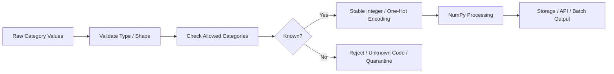

# 07- Categorical Encoding

## Overview

Categorical encoding converts discrete labels such as:

```text
"pending"
"completed"
"failed"
```

into numerical representations that NumPy can store and process efficiently.

NumPy does not provide a single high-level categorical-encoding abstraction comparable to the encoders found in dedicated machine-learning or tabular-processing libraries. Instead, NumPy provides the array and indexing primitives needed to implement common encoding strategies.

For backend and data-processing workloads, the most useful approaches are:

| Encoding | Example | Best Fit |
|---|---|---|
| Integer / ordinal encoding | `pending → 0` | Compact internal representation |
| One-hot encoding | `completed → [0, 1, 0]` | Small category sets |
| Binary indicator masks | `status == "completed"` | Filtering and validation |
| Lookup-table encoding | `customer_tier → integer ID` | Stable application mappings |
| Frequency/count encoding | `gold → 125000` | Aggregated categorical metadata |

The key engineering concern is that an encoding must preserve the intended semantics.

```text
category
    ↓
mapping / lookup
    ↓
numeric representation
    ↓
NumPy processing
    ↓
storage / aggregation / downstream service
```

Encoding is therefore a data-contract decision, not just a conversion from strings to integers.

## Why Categorical Encoding Is Needed

NumPy arrays are strongest when working with homogeneous numerical data.

A raw array of Python strings:

```python
import numpy as np

statuses = np.array(
    [
        "pending",
        "completed",
        "failed",
    ],
)
```

can represent categories, but numerical processing becomes more efficient and predictable when the categories are represented explicitly.

For example:

```text
pending   → 0
completed → 1
failed    → 2
```

allows the data to be stored as an integer array:

```python
encoded = np.array(
    [0, 1, 2],
    dtype=np.int8,
)
```

This can reduce memory usage and make categorical comparisons inexpensive.

However, integer encoding does **not** automatically mean that the numbers have ordinal meaning.

## Categorical vs Ordinal Data

Before encoding, determine whether the categories are:

### Nominal

There is no meaningful ordering:

```text
pending
completed
failed
```

Assigning:

```text
pending   → 0
completed → 1
failed    → 2
```

does not imply:

```text
failed > completed > pending
```

The integers are simply identifiers.

### Ordinal

The categories have an actual order:

```text
bronze
silver
gold
```

An intentional mapping can represent the order:

```text
bronze → 0
silver → 1
gold   → 2
```

The distinction matters because treating nominal labels as ordered values can introduce incorrect business semantics.

## Lookup-Based Integer Encoding

For a stable mapping, define the category dictionary explicitly.

```python
import numpy as np

categories = np.array(
    [
        "pending",
        "completed",
        "failed",
    ],
)

mapping = {
    "pending": 0,
    "completed": 1,
    "failed": 2,
}

statuses = np.array(
    [
        "completed",
        "pending",
        "failed",
    ],
)

encoded = np.array(
    [
        mapping[value]
        for value in statuses
    ],
    dtype=np.int8,
)
```

Result:

```text
[1, 0, 2]
```

This approach is easy to understand and works well for small controlled datasets.

For large arrays, however, a Python dictionary lookup inside a list comprehension still performs one Python-level operation per element.

## Encoding with `np.unique()`

`np.unique()` can identify distinct categories.

```python
import numpy as np

statuses = np.array(
    [
        "pending",
        "completed",
        "pending",
        "failed",
        "completed",
    ],
)

categories, inverse = np.unique(
    statuses,
    return_inverse=True,
)
```

The outputs are conceptually:

```text
categories → ["completed", "failed", "pending"]
inverse    → [2, 0, 2, 1, 0]
```

`inverse` provides an integer code for each original element.

This is useful when the mapping does not need to be manually defined.

## Important Limitation of `np.unique()`

The category order produced by `np.unique()` is deterministic for comparable values, but it may not match the business-defined category order.

For example:

```text
business order:
pending
completed
failed
```

might become:

```text
completed
failed
pending
```

depending on the ordering of the values.

Therefore:

```text
automatic encoding
≠
business-defined encoding
```

When encoded values cross service or persistence boundaries, an explicit mapping is usually safer.

## Returning Both Categories and Codes

A useful pattern is:

```python
import numpy as np


def encode_categories(
    values: np.ndarray,
) -> tuple[np.ndarray, np.ndarray]:
    categories, codes = np.unique(
        values,
        return_inverse=True,
    )

    return categories, codes
```

For:

```python
values = np.array(
    [
        "gold",
        "silver",
        "gold",
        "bronze",
    ],
)
```

the result is conceptually:

```text
categories → ["bronze", "gold", "silver"]
codes      → [1, 2, 1, 0]
```

This is useful for temporary processing when the category order itself is not part of the contract.

## Stable Application Mappings

For production systems, category identifiers often need to remain stable across:

- API requests.
- Batch jobs.
- Database records.
- Kafka messages.
- Service deployments.
- Historical datasets.

A service might define:

```python
STATUS_CODES = {
    "pending": 0,
    "completed": 1,
    "failed": 2,
}
```

Then:

```python
encoded = np.array(
    [
        STATUS_CODES["pending"],
        STATUS_CODES["completed"],
        STATUS_CODES["failed"],
    ],
    dtype=np.int8,
)
```

The mapping should be version-controlled or sourced from a stable configuration or reference table.

Do not regenerate identifiers independently in every service.

## Unknown Categories

Production inputs can contain values that were not present in the reference mapping.

For example:

```python
STATUS_CODES = {
    "pending": 0,
    "completed": 1,
    "failed": 2,
}

incoming = np.array(
    [
        "completed",
        "cancelled",
        "pending",
    ],
)
```

`"cancelled"` is unknown.

A robust pipeline should define an explicit policy:

| Unknown Category Policy | Use When |
|---|---|
| Reject | Schema is strict |
| Map to reserved code | Unknown categories are expected |
| Quarantine | Input needs investigation |
| Dynamically register | Category creation is part of the domain |

Avoid silently mapping unknown values to a valid category.

## Reserved Unknown Code

A simple strategy is to reserve one integer:

```python
STATUS_CODES = {
    "unknown": -1,
    "pending": 0,
    "completed": 1,
    "failed": 2,
}
```

Then:

```python
encoded = np.array(
    [
        STATUS_CODES.get(
            value,
            STATUS_CODES["unknown"],
        )
        for value in incoming
    ],
    dtype=np.int8,
)
```

This is useful when downstream systems can explicitly interpret `-1` as unknown.

The reserved value should be part of the data contract.

## One-Hot Encoding

One-hot encoding represents each category as a separate binary indicator.

For:

```text
pending
completed
failed
```

the encoded representation can be:

```text
pending   → [1, 0, 0]
completed → [0, 1, 0]
failed    → [0, 0, 1]
```

This avoids imposing an artificial ordering on nominal categories.

It is conceptually useful when each category needs an independent binary feature.

## One-Hot Encoding with NumPy

Suppose integer category codes are:

```python
codes = np.array(
    [0, 1, 2, 1],
)
```

and there are three categories.

A one-hot matrix can be constructed with:

```python
import numpy as np

category_count = 3

one_hot = np.eye(
    category_count,
    dtype=np.uint8,
)[codes]
```

Result:

```text
[
    [1, 0, 0],
    [0, 1, 0],
    [0, 0, 1],
    [0, 1, 0],
]
```

The output shape is:

```text
(records, categories)
```

## One-Hot Memory Cost

One-hot encoding can become expensive when the category count is large.

For:

```text
10,000,000 records
× 5,000 categories
```

a dense one-hot matrix contains:

```text
50 billion
```

elements.

Even a `uint8` representation would require enormous memory.

This makes dense one-hot encoding inappropriate for high-cardinality columns.

The engineering decision should consider:

```text
record count
×
category count
×
dtype size
```

before allocating the matrix.

## Sparse vs Dense Representation

NumPy arrays are dense.

A dense one-hot representation stores every zero explicitly:

```text
[0, 0, 0, 1, 0, 0, 0, ...]
```

When most entries are zero, this wastes memory.

For high-cardinality categorical data, consider:

- A sparse matrix representation.
- Integer IDs.
- A database lookup table.
- Pandas categorical representation.
- A downstream system designed for categorical data.

NumPy alone is not a reason to force high-cardinality data into a dense one-hot array.

## One-Hot with Explicit Mapping

For stable category order:

```python
import numpy as np

STATUS_CODES = {
    "pending": 0,
    "completed": 1,
    "failed": 2,
}

statuses = np.array(
    [
        "pending",
        "failed",
        "completed",
    ],
)

codes = np.array(
    [
        STATUS_CODES[value]
        for value in statuses
    ],
    dtype=np.int8,
)

one_hot = np.eye(
    len(STATUS_CODES),
    dtype=np.uint8,
)[codes]
```

The mapping defines the column order:

```text
column 0 → pending
column 1 → completed
column 2 → failed
```

This is important when the encoded output is stored or exchanged with another service.

## Boolean Indicator Masks

Sometimes one-hot encoding is unnecessary.

If the requirement is simply:

```text
"Which records are completed?"
```

a boolean mask is more efficient:

```python
completed = (
    statuses == "completed"
)
```

Result:

```text
[False, False, True]
```

The mask can then be used directly:

```python
completed_records = records[
    completed
]
```

or:

```python
completed_count = np.count_nonzero(
    completed
)
```

A boolean mask avoids creating a full one-hot matrix.

## When Masks Are Better Than One-Hot Encoding

Use masks when the operation is:

```text
filter
count
validate
aggregate
select
```

For example:

```python
is_failed = (
    statuses == "failed"
)

failed_count = np.count_nonzero(
    is_failed
)
```

One-hot encoding is more appropriate when downstream code genuinely needs a complete categorical indicator matrix.

Do not create one-hot representations just because they look numerically convenient.

## Ordinal Encoding

When categories have real order:

```text
bronze < silver < gold
```

an ordinal mapping can be valid:

```python
tier_codes = {
    "bronze": 0,
    "silver": 1,
    "gold": 2,
}
```

Then:

```python
tiers = np.array(
    [
        "gold",
        "bronze",
        "silver",
    ],
)

encoded = np.array(
    [
        tier_codes[value]
        for value in tiers
    ],
    dtype=np.int8,
)
```

Result:

```text
[2, 0, 1]
```

The ordering has explicit domain meaning.

This differs from nominal integer encoding, where the numbers are merely identifiers.

## Do Not Invent Ordinality

For statuses:

```text
pending
completed
failed
```

the mapping:

```text
pending = 0
completed = 1
failed = 2
```

does not automatically mean:

```text
failed is greater than completed
```

If a downstream numerical operation performs arithmetic on the codes, it may accidentally create false semantics.

For nominal categories, prefer:

- Boolean masks.
- One-hot encoding.
- Stable opaque integer identifiers.

depending on the downstream requirement.

## Category Encoding with `searchsorted()`

When a sorted category dictionary is already available, `np.searchsorted()` can map values to positions efficiently.

```python
import numpy as np

categories = np.array(
    [
        "bronze",
        "gold",
        "silver",
    ],
)

values = np.array(
    [
        "silver",
        "bronze",
        "gold",
    ],
)

codes = np.searchsorted(
    categories,
    values,
)
```

Result:

```text
[2, 0, 1]
```

The category array must be sorted according to the same ordering used by `searchsorted()`.

Unknown values require explicit validation because `searchsorted()` returns an insertion position even when the value does not exist.

For example, verify membership before accepting the code.

## Validating Search-Based Encoding

A robust pattern is:

```python
import numpy as np

categories = np.array(
    [
        "bronze",
        "gold",
        "silver",
    ],
)

values = np.array(
    [
        "silver",
        "unknown",
        "gold",
    ],
)

codes = np.searchsorted(
    categories,
    values,
)

valid = (
    codes < categories.size
)

valid &= (
    categories[
        np.minimum(
            codes,
            categories.size - 1,
        )
    ] == values
)
```

The important principle is:

```text
lookup position
≠
confirmed membership
```

The lookup result must be validated before being treated as a valid category code.

## Vectorized Membership

For small to moderate category sets, `np.isin()` can efficiently test membership:

```python
allowed = np.array(
    [
        "pending",
        "completed",
        "failed",
    ],
)

incoming = np.array(
    [
        "completed",
        "cancelled",
        "pending",
    ],
)

valid = np.isin(
    incoming,
    allowed,
)
```

Result:

```text
[True, False, True]
```

This is useful for validation before encoding.

## Encoding Pipeline

A practical production flow is:



The important sequence is:

```text
validate
→ encode
```

not:

```text
encode
→ hope the mapping was valid
```

## Database-Backed Category IDs

Many backend systems already have a natural category mapping in PostgreSQL:

```text
status
---------
id | name
1  | pending
2  | completed
3  | failed
```

In that situation, the database ID may be the correct stable encoding.

For example:

```python
status_ids = np.array(
    [1, 2, 3],
    dtype=np.int16,
)
```

This avoids maintaining duplicate mappings in application code.

The service should still distinguish:

```text
database identifier
```

from:

```text
ordinal meaning
```

An ID of `3` does not necessarily mean "greater" than an ID of `2`.

## API Payloads

APIs commonly use string categories:

```json
{
  "status": "completed"
}
```

Internally, the processing pipeline may use:

```text
completed → 2
```

A robust architecture is:

```text
external representation
        ↓
validation
        ↓
stable internal code
        ↓
NumPy processing
        ↓
explicit output mapping
```

Do not expose internal integer codes as public API semantics unless they are intentionally part of the API contract.

## Kafka and Event Processing

Categorical encoding can reduce the memory footprint of high-volume message-processing stages.

For example:

```text
Kafka event:
    status = "completed"

        ↓

validation

        ↓

status_code = 2

        ↓

NumPy batch processing
```

The mapping must remain stable across consumer versions.

Changing:

```text
completed → 2
```

to:

```text
completed → 5
```

without versioning can make historical and new data incompatible.

## Pandas Comparison

Pandas provides higher-level categorical functionality and is often a more natural abstraction for tabular categorical columns.

Use NumPy when:

```text
dense numerical representation
+
vectorized comparison / indexing
+
compact internal processing
```

is the primary requirement.

Use Pandas when:

```text
tabular data
+
column labels
+
categorical columns
+
joins
+
grouping
```

are central.

Avoid converting a DataFrame column to NumPy solely to implement basic categorical handling that Pandas already expresses cleanly.

## String vs Encoded Integer Memory

String categories can carry significant Python/object representation overhead.

An integer array such as:

```python
encoded = np.array(
    [0, 1, 2, 1],
    dtype=np.int8,
)
```

has a predictable compact element size:

```python
print(encoded.itemsize)
# 1
```

For a large dataset with a small fixed vocabulary, replacing repeated string values with compact integer codes can substantially reduce the array's storage footprint.

However, the mapping itself still needs to be maintained.

## Choosing an Integer Dtype

Choose the smallest integer dtype that safely represents every valid code.

For example:

```python
encoded = np.array(
    codes,
    dtype=np.uint8,
)
```

can represent category IDs from `0` through `255`.

For larger dictionaries:

```python
np.uint16
np.uint32
np.int16
np.int32
```

may be appropriate.

The selection should consider:

```text
maximum category ID
+
reserved unknown code
+
future category growth
+
downstream compatibility
```

Do not choose a dtype so narrowly that normal category growth causes overflow or requires breaking changes.

## Stable Mapping Versioning

Treat category mappings as versioned data contracts when they cross system boundaries.

For example:

```python
CATEGORY_SCHEMA = {
    "version": 3,
    "codes": {
        "unknown": 0,
        "pending": 1,
        "completed": 2,
        "failed": 3,
    },
}
```

A batch can then record:

```text
category_mapping_version = 3
```

This makes encoded data interpretable later.

Without version information, a historical integer code may become ambiguous after the mapping changes.

## Handling New Categories Safely

Suppose version 3 contains:

```text
pending
completed
failed
```

and version 4 adds:

```text
cancelled
```

A safe migration might use:

```text
version 3
→ unknown = 0
→ pending = 1
→ completed = 2
→ failed = 3

version 4
→ unknown = 0
→ pending = 1
→ completed = 2
→ failed = 3
→ cancelled = 4
```

Appending new codes is often safer than renumbering existing categories because historical records remain interpretable.

The exact migration strategy depends on the data contract.

## Performance Considerations

Encoding performance depends on:

- Number of records.
- Number of unique categories.
- Mapping strategy.
- String comparison cost.
- Output dtype.
- Memory layout.
- Whether categories are already encoded.

For repeated large-scale processing, converting strings to stable integer IDs once can reduce repeated string comparisons.

However, category encoding itself can require a full scan and may create an additional output array.

Benchmark the complete pipeline:

```text
parse
→ validate
→ encode
→ process
```

rather than benchmarking only the encoding call.

## Memory Considerations

Integer encoding can reduce storage, but one-hot encoding can increase it dramatically.

For example:

```text
integer encoding:
N elements

one-hot encoding:
N × K elements
```

where:

```text
N = records
K = number of categories
```

This is why integer or sparse representations are generally preferable for high-cardinality categories.

The `dtype` also matters:

```python
np.uint8
```

requires less memory per element than:

```python
np.int64
```

when the smaller range is sufficient.

## Security and Validation

Categorical inputs often originate from external APIs or messages.

Validate:

- Input type.
- Maximum string length.
- Maximum number of records.
- Allowed category set.
- Encoding version.
- Unknown-category policy.

Do not allow an attacker to send millions of unique category strings and force unbounded mapping growth.

For dynamic categories, enforce explicit limits on vocabulary size.

## Monitoring

Encoding stages should expose useful quality metrics:

```text
records_processed
known_categories
unknown_categories
encoding_failures
mapping_version
unique_category_count
```

For example:

```python
known = np.isin(
    incoming,
    categories,
)

unknown_count = np.count_nonzero(
    ~known
)
```

A spike in unknown categories can indicate:

- Upstream schema changes.
- Producer deployment changes.
- Typos or malformed input.
- Mapping-version mismatches.
- Unexpected product or business states.

## Common Mistakes

### Assuming Integer Codes Are Ordered

The mapping:

```text
pending = 0
completed = 1
failed = 2
```

does not create an ordinal relationship unless the domain explicitly defines one.

### Regenerating Mappings Independently

Using `np.unique(..., return_inverse=True)` independently on different datasets can assign different codes.

This is unsafe when encoded values must remain comparable across batches.

### Ignoring Unknown Categories

New values appear in production. Define an explicit unknown, reject, or quarantine policy.

### Using Dense One-Hot Encoding for High Cardinality

One-hot matrices grow as:

```text
records × categories
```

and can exhaust memory rapidly.

### Exposing Internal Codes as API Semantics Accidentally

Internal category IDs can change unless they are explicitly versioned and treated as public contracts.

### Using `np.searchsorted()` Without Membership Validation

It returns an insertion position even when the category does not exist.

### Choosing an Integer Dtype Without Capacity Analysis

A category mapping may eventually outgrow the selected dtype.

### Building Masks When a Stable Code Is Required

A boolean mask answers:

```text
"is this category?"
```

but does not provide a reusable categorical identifier.

### Encoding Before Validation

Unknown or malformed categories should not silently become valid numerical codes.

## Testing

Test the mapping itself and the encoded representation.

```python
import numpy as np


STATUS_CODES = {
    "unknown": 0,
    "pending": 1,
    "completed": 2,
    "failed": 3,
}


def encode_statuses(
    values: np.ndarray,
) -> np.ndarray:
    return np.array(
        [
            STATUS_CODES.get(
                value,
                STATUS_CODES["unknown"],
            )
            for value in values
        ],
        dtype=np.uint8,
    )


def test_encode_statuses():
    values = np.array(
        [
            "pending",
            "completed",
            "failed",
            "cancelled",
        ],
    )

    result = encode_statuses(values)

    np.testing.assert_array_equal(
        result,
        np.array(
            [1, 2, 3, 0],
            dtype=np.uint8,
        ),
    )
```

Also test:

- Known categories.
- Unknown categories.
- Empty inputs.
- Duplicate categories.
- Mapping stability.
- Mapping-version changes.
- Maximum category ID.
- Dtype capacity.
- One-hot output shape.
- High-cardinality behavior.
- Malformed external input.

## Debugging

When encoded data looks incorrect, inspect the mapping before inspecting the output.

```python
print(
    STATUS_CODES
)

print(
    "mapping version:",
    CATEGORY_SCHEMA["version"],
)
```

For incoming values:

```python
known = np.isin(
    values,
    np.array(
        list(STATUS_CODES)
    ),
)

print(
    "known:",
    np.count_nonzero(known),
)

print(
    "unknown:",
    np.count_nonzero(~known),
)
```

For an encoding mismatch, compare:

```text
raw category
→ expected code
→ actual code
→ mapping version
```

This often identifies configuration drift quickly.

## Interview Questions

### What is categorical encoding?

It is the conversion of discrete categories into a numerical representation suitable for storage, filtering, aggregation, or downstream numerical processing.

### Does NumPy provide a high-level categorical encoder?

NumPy provides lower-level array and indexing primitives rather than a single dedicated categorical-encoding abstraction. Functions such as `np.unique()`, `np.isin()`, and `np.searchsorted()` can support custom encoding logic.

### What is the difference between nominal and ordinal encoding?

Nominal categories have no meaningful order. Ordinal categories have a domain-defined order that can legitimately be represented by increasing codes.

### Why is `np.unique(..., return_inverse=True)` not always suitable for production category IDs?

It derives category ordering from the observed values, so different datasets can produce different code assignments.

### When is one-hot encoding appropriate?

When each category needs an independent binary representation and the category set is small enough that the resulting dense matrix is practical.

### Why is one-hot encoding problematic for high-cardinality data?

Its size grows with:

```text
number of records × number of categories
```

which can become prohibitively large.

### Why use integer encoding?

It provides compact, homogeneous numerical representation and can substantially reduce memory compared with repeated string values.

### How should unknown categories be handled?

Use an explicit policy such as rejection, quarantine, or a reserved unknown code.

### Why is mapping versioning important?

The integer code has meaning only relative to its category mapping. Versioning ensures historical encoded data remains interpretable after the vocabulary changes.

### When should categorical processing be handled by Pandas instead of NumPy?

When the data is primarily a labeled table with categorical columns, grouping, joins, and other tabular ETL operations rather than dense numerical array processing.

## Key Takeaways

- Categorical encoding converts discrete labels into compact numerical representations, but the chosen representation must preserve the category's actual semantics.
- Integer codes are compact and efficient, but they must not be interpreted as ordinal values unless the domain explicitly defines an order.
- `np.unique()` is useful for temporary encoding, while stable production mappings should be explicit and versioned when codes cross batch, service, or storage boundaries.
- Dense one-hot encoding can consume enormous amounts of memory as category cardinality grows; use masks, integer IDs, or sparse representations when appropriate.
- Production encoding should validate unknown categories, enforce vocabulary and resource limits, monitor encoding failures, and treat the mapping itself as part of the data contract.