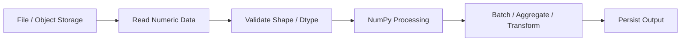
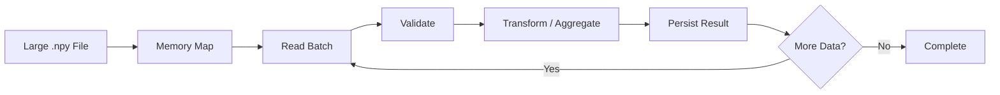
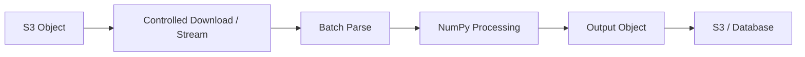

# 12- File Input Output

## Overview

NumPy provides several mechanisms for reading, writing, and processing numerical data stored on disk.

For backend and data-engineering workloads, file I/O matters because numerical pipelines commonly move data through:

```text
CSV
JSON
binary files
NumPy .npy
NumPy .npz
memory-mapped files
database exports
```

The right format depends on:

```text
schema complexity
+
dataset size
+
read/write frequency
+
interoperability
+
compression
+
random-access requirements
+
memory constraints
```

NumPy is particularly effective for dense numerical arrays and fixed-shape binary data. It is not a universal replacement for CSV parsers, Pandas, Parquet tooling, or database systems.

A practical architecture is:



## Choosing a File Format

The file format should match the workload.

| Format | Strength | Limitation | Typical Use |
|---|---|---|---|
| `.npy` | Simple, fast NumPy array storage | NumPy-oriented | Internal numerical datasets |
| `.npz` | Multiple arrays in one archive | Less suitable for general interchange | Related numerical arrays |
| CSV | Human-readable, widely interoperable | Large, slower parsing, weak schema | Simple interchange |
| JSON | Flexible and widely supported | Verbose, inefficient for dense numeric data | APIs and configuration |
| Binary fixed-layout | Compact and efficient | Schema-sensitive | High-volume numerical pipelines |
| Parquet | Columnar, compressed, cross-tool | Requires broader data tooling | Analytical/ETL pipelines |
| PostgreSQL | Queryable and transactional | Network/database overhead | Operational structured data |

A useful rule is:

```text
NumPy-native numerical storage
→ .npy / .npz

cross-system tabular analytics
→ Parquet

relational application data
→ PostgreSQL

simple external interchange
→ CSV / JSON
```

## `.npy` Files

The `.npy` format stores a single NumPy array together with the metadata required to reconstruct it.

Write:

```python
import numpy as np

values = np.array(
    [10.0, 20.0, 30.0],
    dtype=np.float64,
)

np.save(
    "data/values.npy",
    values,
)
```

Read:

```python
loaded = np.load(
    "data/values.npy",
)
```

The loaded result retains important array information such as:

```text
shape
dtype
```

This makes `.npy` useful for internal numerical pipelines where NumPy is the primary consumer.

## Why `.npy` Is Useful

Compared with CSV, `.npy` can preserve the array representation directly:

```text
dtype
+
shape
+
numeric data
```

This avoids repeatedly converting textual values back into numerical arrays.

For example:

```python
values = np.array(
    [1, 2, 3],
    dtype=np.int32,
)

np.save(
    "values.npy",
    values,
)

loaded = np.load(
    "values.npy",
)

assert loaded.dtype == values.dtype
assert loaded.shape == values.shape
```

This is particularly useful for:

- Large test fixtures.
- Internal ETL stages.
- Numerical batch artifacts.
- Benchmark datasets.
- Cached intermediate numerical results.

## `.npz` Archives

`.npz` stores multiple NumPy arrays in one archive.

```python
import numpy as np

np.savez(
    "batch.npz",
    amounts=np.array(
        [100.0, 200.0, 300.0],
    ),
    quantities=np.array(
        [1, 2, 3],
    ),
)
```

Read:

```python
data = np.load(
    "batch.npz",
)

amounts = data["amounts"]
quantities = data["quantities"]
```

This is useful when several related arrays must remain together:

```text
amounts
quantities
timestamps
status_codes
```

The archive should be treated as a logical dataset rather than an arbitrary collection of unrelated arrays.

## Compressed `.npz`

For compression:

```python
np.savez_compressed(
    "batch.npz",
    amounts=amounts,
    quantities=quantities,
)
```

Compression reduces storage size at the cost of CPU time.

This creates a trade-off:

```text
smaller disk/object-storage footprint
vs
more CPU during write/read
```

Compression is useful when storage or network transfer dominates the workload.

It may be less attractive for frequently accessed local scratch files where decompression becomes the bottleneck.

## Loading `.npy` and `.npz` Safely

When loading files from an untrusted source, consider the file's provenance and NumPy's object-array behavior.

Prefer:

```python
values = np.load(
    "values.npy",
    allow_pickle=False,
)
```

when object arrays are not required.

`allow_pickle=False` avoids loading pickled Python objects.

For external or untrusted files, do not enable pickle support casually.

## Text Files with `np.loadtxt()`

`np.loadtxt()` can load simple homogeneous numerical text files:

```python
values = np.loadtxt(
    "metrics.csv",
    delimiter=",",
    dtype=np.float64,
)
```

It works best when:

```text
fixed columns
+
numeric values
+
simple structure
```

are present.

It becomes less suitable when the file contains:

- Mixed data types.
- Complex headers.
- Missing values with custom semantics.
- Quoted strings.
- Irregular rows.
- Rich schema requirements.

In those cases, use a more appropriate CSV or tabular parser.

## `np.genfromtxt()`

`np.genfromtxt()` supports more flexible text input, including missing values.

```python
values = np.genfromtxt(
    "metrics.csv",
    delimiter=",",
    dtype=np.float64,
    missing_values="",
    filling_values=np.nan,
)
```

This can be useful for legacy numerical CSV files.

However, it is still a lower-level NumPy parser. For large production CSV ETL pipelines with richer schemas, Pandas or a dedicated high-performance CSV parser is often more appropriate.

## Writing Text with `np.savetxt()`

A NumPy array can be written to text:

```python
np.savetxt(
    "metrics.csv",
    values,
    delimiter=",",
    fmt="%.6f",
)
```

This is useful for simple numeric exports.

The trade-off is that text representation can be:

```text
larger
+
slower to parse
+
sensitive to formatting decisions
```

than binary NumPy storage.

Use it primarily when human readability or interoperability is more important than compact numerical storage.

## Text Precision

When writing floating-point data:

```python
np.savetxt(
    "metrics.csv",
    values,
    fmt="%.6f",
)
```

the format controls how values are represented.

This introduces a precision contract.

For example:

```text
internal float64
→ write six decimal places
→ information may be lost
```

Do not assume a text round-trip preserves the exact original floating-point values.

If exact numerical round-tripping matters, prefer an appropriate binary format.

## Loading and Saving Integers

NumPy preserves the dtype when writing `.npy`:

```python
values = np.array(
    [1, 2, 3],
    dtype=np.int16,
)

np.save(
    "values.npy",
    values,
)

loaded = np.load(
    "values.npy",
)

print(
    loaded.dtype
)
```

This is useful for compact storage.

For text formats, dtype information is not inherently preserved in the same way. The reader must know or infer the intended dtype.

## File Paths and Application Design

Avoid scattering file paths throughout application code:

```python
np.save(
    "/tmp/values.npy",
    values,
)
```

Instead, centralize storage configuration:

```python
from pathlib import Path

OUTPUT_DIR = Path(
    "data",
    "processed",
)

OUTPUT_DIR.mkdir(
    parents=True,
    exist_ok=True,
)

output_path = (
    OUTPUT_DIR / "values.npy"
)

np.save(
    output_path,
    values,
)
```

This improves portability between:

```text
local development
+
Docker
+
Kubernetes
+
CI
+
AWS batch workers
```

## File Lifecycle

A production numerical pipeline should make file ownership explicit:

```text
input
→ validate
→ process
→ write temporary output
→ validate output
→ publish
```

Avoid exposing partially written output as completed data.

A safer pattern is:

```text
write temporary file
        ↓
flush / close
        ↓
validate
        ↓
atomic publication
```

For local filesystems, an application can use a temporary path followed by a controlled rename.

For S3 or another object store, use object-versioning or commit-style publishing patterns appropriate to the storage system.

## Atomic File Publication

For local output:

```python
from pathlib import Path
import os
import tempfile

import numpy as np


def save_array_atomically(
    values: np.ndarray,
    output_path: Path,
) -> None:
    output_path.parent.mkdir(
        parents=True,
        exist_ok=True,
    )

    with tempfile.NamedTemporaryFile(
        dir=output_path.parent,
        suffix=".npy",
        delete=False,
    ) as temporary:
        temporary_path = Path(
            temporary.name
        )

    try:
        np.save(
            temporary_path,
            values,
        )

        os.replace(
            temporary_path,
            output_path,
        )
    finally:
        temporary_path.unlink(
            missing_ok=True,
        )
```

The important idea is that consumers should not observe an incomplete file.

The exact atomicity guarantees depend on the filesystem and deployment environment.

## Memory-Mapped Arrays

For very large `.npy` arrays, memory mapping can provide access without eagerly loading the entire dataset.

```python
values = np.load(
    "large_values.npy",
    mmap_mode="r",
)
```

Now:

```python
batch = values[
    0:1_000_000
]
```

can access only the relevant slice.

This is useful when:

```text
dataset > comfortable RAM capacity
```

and processing can be performed in chunks.

## Writable Memory Mapping

A mapped array can also be opened in writable mode:

```python
values = np.load(
    "large_values.npy",
    mmap_mode="r+",
)

values[
    0:100
] *= 1.05
```

The changes are backed by the mapped file.

Use this carefully because mutations now affect persistent data directly.

Before enabling writable mapping, define:

```text
ownership
+
concurrency
+
crash behavior
+
recovery
+
backup policy
```

## Memory Mapping and Batch Processing

A typical large-file pipeline is:



Example:

```python
import numpy as np

values = np.load(
    "large_values.npy",
    mmap_mode="r",
)

batch_size = 1_000_000

total = 0.0

for start in range(
    0,
    values.shape[0],
    batch_size,
):
    batch = values[
        start:start + batch_size
    ]

    finite = np.isfinite(
        batch
    )

    total += np.sum(
        batch,
        where=finite,
    )
```

This avoids constructing one giant working array.

## Memory Mapping Is Not Free

Memory mapping does not mean:

```text
zero I/O
```

The operating system still loads pages from storage as they are accessed.

Performance depends on:

- Storage latency.
- Access pattern.
- Sequential vs random access.
- Operating-system page cache.
- Batch size.
- Dataset layout.

Sequential slices are generally easier for the storage subsystem to handle than highly scattered access patterns.

## Large File Processing

For large numerical files, consider:

```text
file size
+
record size
+
batch size
+
dtype
+
working buffers
+
output size
```

A production worker should have an explicit memory budget.

For example:

```text
container memory limit = 2 GB
input batch            = 256 MB
temporary buffers      = 256 MB
output buffer          = 256 MB
application overhead   = remaining capacity
```

The exact values should come from measurement rather than arbitrary limits.

## File Input Validation

Never assume a file contains valid numerical data simply because it has the correct extension.

Validate:

```text
path
+
file size
+
format
+
dtype
+
shape
+
schema version
+
numeric validity
```

For `.npy`:

```python
values = np.load(
    "input.npy",
    allow_pickle=False,
)

if values.ndim != 1:
    raise ValueError(
        "Expected a one-dimensional array."
    )

if not np.issubdtype(
    values.dtype,
    np.number,
):
    raise TypeError(
        "Expected numeric data."
    )
```

Then perform value-level validation:

```python
if not np.all(
    np.isfinite(values)
):
    raise ValueError(
        "Input contains non-finite values."
    )
```

Schema validity and value validity are separate checks.

## File Size and Resource Limits

A file-processing service should not blindly load arbitrarily large files.

Check the file size before allocating memory:

```python
from pathlib import Path


path = Path(
    "input.npy"
)

size_bytes = path.stat().st_size

if size_bytes > 1_000_000_000:
    raise ValueError(
        "Input file is too large."
    )
```

This is only a coarse guard because compressed or structured formats can have different storage-to-memory relationships.

The important principle is:

```text
untrusted input
→ resource validation
→ parse
```

not:

```text
parse first
→ discover resource problem later
```

## Safe File Input in APIs

For uploaded numerical files in Django or FastAPI:

```text
HTTP upload
→ size limit
→ temporary storage
→ format validation
→ schema validation
→ numerical processing
→ persistent output
```

Do not read an unbounded upload directly into memory.

For large files, stream or stage them in controlled chunks.

The web framework should enforce request and upload limits before NumPy processing starts.

## CSV and API Pipelines

A typical ETL pipeline may look like:


NumPy should normally own the dense numerical stage rather than the entire ingestion system.

For mixed or hierarchical input:

```text
JSON
+
strings
+
nested objects
```

use a dedicated parser first.

## File Output Formats

Output format should be selected based on consumers.

For internal NumPy processing:

```python
np.save(
    "processed.npy",
    values,
)
```

For multiple related arrays:

```python
np.savez_compressed(
    "processed.npz",
    values=values,
    counts=counts,
)
```

For tabular cross-tool pipelines:

```text
Parquet
```

is often a better choice.

For human-readable interchange:

```text
CSV
```

may be appropriate.

Do not use `.npy` simply because the source code uses NumPy.

## NumPy vs Pandas for File I/O

| Task | Prefer |
|---|---|
| Single dense numerical array | NumPy |
| Several related numerical arrays | NumPy `.npz` |
| Simple numerical CSV | NumPy can work |
| Rich CSV ETL | Pandas / dedicated CSV parser |
| Mixed tabular formats | Pandas |
| Parquet | Pandas / PyArrow or similar |
| Relational query | PostgreSQL |
| Large object-storage datasets | Format-specific streaming / columnar tools |

The right abstraction depends on the file and processing requirements.

## Serialization Trade-offs

Binary NumPy formats preserve array metadata efficiently:

```text
shape
+
dtype
+
numeric data
```

Text formats provide:

```text
readability
+
broad interoperability
```

but introduce:

```text
parsing cost
+
formatting decisions
+
potential precision loss
```

Production file formats should therefore be chosen according to system boundaries rather than developer convenience.

## Compression Considerations

Compression can reduce:

```text
disk storage
+
network transfer
+
object-storage cost
```

but increases:

```text
CPU
+
latency
```

Use compression when storage or transfer is a meaningful bottleneck.

Do not compress data that is already compressed or that requires extremely low-latency repeated access without measuring the impact.

## Checksums and File Integrity

For important file-processing pipelines, integrity validation may be necessary.

A simple pattern is:

```text
write file
→ calculate checksum
→ store metadata
→ publish file
```

When reading:

```text
retrieve file
→ validate checksum
→ parse
→ process
```

Checksums can detect accidental corruption, incomplete transfers, and certain storage failures.

They do not authenticate an input unless combined with a trusted signing mechanism.

## Schema Versioning

Long-lived numerical files should be associated with schema information.

For example:

```python
metadata = {
    "schema_version": 2,
    "dtype": str(values.dtype),
    "shape": values.shape,
}
```

The metadata can be stored alongside the file:

```text
processed.npy
processed.json
```

or embedded in a higher-level container or manifest.

This helps distinguish:

```text
same filename
+
different data contract
```

from a simple data update.

## File Naming and Idempotency

Batch pipelines should use deterministic output naming when reruns must be idempotent:

```text
dataset/
    date=2026-09-13/
        batch-00001.npy
        batch-00002.npy
```

This makes it easier to:

- Detect duplicates.
- Retry failed batches.
- Reconcile completed work.
- Resume interrupted pipelines.

Avoid filenames based only on process-local state when files are produced by distributed workers.

## Temporary Files

Temporary files should be:

- Stored in controlled directories.
- Named safely.
- Removed after successful processing.
- Removed after failure.
- Excluded from production consumers.

Use Python's `tempfile` module rather than constructing temporary names manually.

This avoids collisions and reduces the risk of accidental path manipulation.

## Security Considerations

File I/O creates several security boundaries.

### Pickle Loading

Avoid:

```python
np.load(
    path,
    allow_pickle=True,
)
```

for untrusted files.

Pickled object data can execute arbitrary Python object deserialization behavior and should not be enabled casually.

Prefer:

```python
np.load(
    path,
    allow_pickle=False,
)
```

when object arrays are unnecessary.

### Path Traversal

Do not derive arbitrary filesystem paths directly from user input:

```python
path = base_dir / user_supplied_name
```

without validating the resulting path and permitted scope.

### Resource Exhaustion

Limit:

```text
file size
+
record count
+
shape
+
batch size
```

before expensive processing.

### Data Leakage

Generated intermediate files may contain sensitive data.

Apply normal storage controls:

```text
permissions
+
encryption
+
retention
+
deletion
+
access auditing
```

where required.

## AWS Object Storage

For large datasets, application workers commonly process objects stored in S3 rather than local disk.

A practical flow is:



Do not assume the entire object should be downloaded into memory.

For large files, use:

```text
streaming
+
range requests
+
temporary local staging
+
memory-mapped processing
```

where the file format and access pattern support them.

For Parquet or other columnar formats, use the format's native tooling rather than forcing the entire object through NumPy.

## Docker and Kubernetes

Containerized file processors should treat filesystem storage carefully.

Local container storage is often ephemeral.

For durable output:

```text
container
→ object storage / persistent volume
```

rather than:

```text
container filesystem
→ assume permanent storage
```

Set explicit resource limits:

```text
memory
CPU
ephemeral storage
```

so malformed or oversized input cannot exhaust the node.

## PostgreSQL Interaction

NumPy file processing often sits before or after PostgreSQL.

A practical flow is:

```text
file
→ NumPy validation
→ transformation
→ batch insert
→ PostgreSQL
```

or:

```text
PostgreSQL query
→ numerical extraction
→ NumPy processing
→ file/object output
```

Push filtering into PostgreSQL when that safely reduces data transfer.

Push dense numerical computation into NumPy when array processing provides the better execution model.

## Monitoring

A production file-processing service should expose metrics such as:

```text
files_received
files_processed
files_failed
bytes_read
bytes_written
records_processed
processing_duration
invalid_records
output_size
```

For batch systems, also monitor:

```text
batch throughput
queue depth
retry rate
dead-letter count
```

A useful diagnostic relationship is:

```text
input size
+
processing duration
+
output size
```

which can reveal unexpected changes in data volume or transformation behavior.

## Reliability and Recovery

For important file pipelines:

```text
input
→ checksum / validation
→ processing
→ temporary output
→ verification
→ publication
→ completion marker
```

A completion marker or manifest can make downstream consumption safer:

```text
batch-0001.npy
batch-0001.json
batch-0001.complete
```

Consumers should only process batches that are known to be complete.

For retries, design output operations to be idempotent.

## Common Mistakes

### Loading Huge Files Entirely into RAM

Use memory mapping or batch processing when the dataset is larger than the worker's safe memory budget.

### Treating `.npy` as a Universal Data-Exchange Format

It is primarily useful for NumPy-oriented workflows. Cross-system analytical pipelines may be better served by Parquet or another interoperable format.

### Enabling `allow_pickle=True` for Untrusted Files

Keep it disabled unless object deserialization is explicitly required and the source is trusted.

### Ignoring Floating-Point Precision When Writing Text

Formatting such as:

```python
fmt="%.6f"
```

can discard precision.

### Publishing Partially Written Files

Write temporary output and publish only after successful completion.

### Using Unbounded Uploads

Apply file-size and processing limits before NumPy allocation.

### Assuming Memory Mapping Eliminates I/O Costs

Memory-mapped access still depends on storage and operating-system page caching.

### Ignoring Schema Versioning

A `.npy` filename alone does not communicate the application-level meaning of the data.

### Reprocessing Without Idempotency

Retries can create duplicate outputs unless the pipeline has deterministic batch identity and controlled publication.

### Storing Sensitive Temporary Files Indefinitely

Temporary numerical data may contain confidential information and should follow retention and access policies.

## Testing

File I/O tests should validate both the data and its round-trip properties.

```python
import numpy as np


def test_npy_round_trip(tmp_path):
    values = np.array(
        [10.0, 20.0, 30.0],
        dtype=np.float64,
    )

    path = (
        tmp_path / "values.npy"
    )

    np.save(
        path,
        values,
    )

    loaded = np.load(
        path,
        allow_pickle=False,
    )

    np.testing.assert_array_equal(
        loaded,
        values,
    )

    assert loaded.dtype == values.dtype
    assert loaded.shape == values.shape
```

Also test:

- Empty arrays.
- Different dtypes.
- Multidimensional arrays.
- Large arrays.
- Corrupted files.
- Truncated files.
- Unexpected dtype.
- Unexpected shape.
- Invalid numerical values.
- Schema mismatches.
- Permission failures.
- Temporary-file cleanup.
- Retry and idempotency behavior.

## Benchmarking File I/O

Separate storage performance from numerical processing.

Measure:

```text
read time
parse time
processing time
write time
```

For example:

```python
import time

start = time.perf_counter()

values = np.load(
    "input.npy",
    mmap_mode="r",
)

load_time = (
    time.perf_counter()
    - start
)

start = time.perf_counter()

result = process(
    values
)

process_time = (
    time.perf_counter()
    - start
)
```

For memory-mapped data, distinguish between:

```text
mapping setup time
+
actual page-fault / storage access time
```

A benchmark that only measures `np.load(..., mmap_mode="r")` may not represent the real cost of reading the data.

## Interview Questions

### When should you use `.npy` instead of CSV?

Use `.npy` when the dataset is primarily a NumPy array and efficient NumPy-native storage and dtype/shape preservation are more important than human readability or broad interoperability.

### What is the difference between `.npy` and `.npz`?

`.npy` stores one array. `.npz` stores multiple named arrays in an archive.

### How do you process an array larger than RAM?

Use memory mapping where appropriate and process the array in bounded batches.

### Does memory mapping load the entire file into RAM?

No. It provides an array-like interface backed by the file; accessed pages are brought into memory as needed by the operating system.

### Why should `allow_pickle=False` generally be preferred for external `.npy` files?

Because object arrays can rely on Python pickle serialization. Disabling pickle avoids unnecessary object deserialization behavior for numerical-only data.

### Why can CSV round-tripping change numerical values?

Values are converted to text and later parsed back, and the chosen formatting precision can discard information.

### How would you safely process a user-uploaded NumPy file?

Validate size, file type, dtype, shape, schema, and numerical content; use controlled temporary storage; disable pickle unless explicitly required; process within memory limits; and publish output only after successful validation.

### When should filtering happen in PostgreSQL instead of NumPy?

When the source data is already in PostgreSQL and source-side filtering can significantly reduce the amount of data transferred to the application.

### What is the main advantage of `.npy` for internal numerical pipelines?

It preserves NumPy array structure, including shape and dtype, without requiring a text serialization round-trip.

### What should a production file-processing pipeline record?

At minimum, record file identity, schema/version, byte size, records processed, validation failures, processing duration, output identity, and completion status.

## Key Takeaways

- Choose file formats based on workload requirements: `.npy` for NumPy-native arrays, `.npz` for related arrays, and broader formats such as Parquet or PostgreSQL for cross-system data processing.
- Treat file input as an untrusted boundary: validate size, shape, dtype, schema, numerical values, and serialization behavior before processing.
- Use memory mapping and bounded batches for large datasets, while remembering that memory mapping still incurs storage I/O and page-cache costs.
- Publish outputs atomically or through completion markers so downstream consumers never process partially written data, and design retries to be idempotent.
- For untrusted NumPy files, keep `allow_pickle=False`, control resource usage, and treat schema, storage, and retention policies as part of the production data contract.