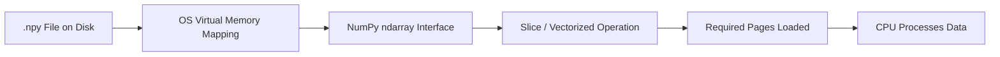
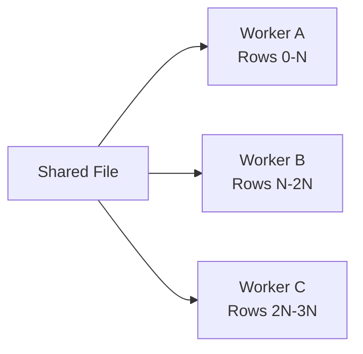
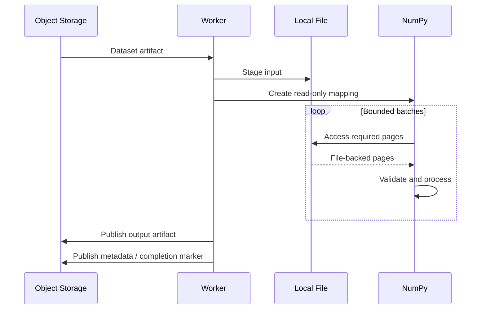

# 13- Memory Mapped Arrays

## Overview

A memory-mapped NumPy array provides an `ndarray`-like interface to data stored in a file without eagerly loading the entire array into RAM.

The core idea is:

```text
file on disk
    ↓
memory mapping
    ↓
NumPy array interface
    ↓
access only the regions needed
```

This is useful when a numerical dataset is larger than available RAM, when multiple processing stages need predictable access to the same file, or when a workload benefits from operating-system-managed paging.

Memory mapping does **not** eliminate I/O. It changes how data is brought into memory: pages are loaded on demand by the operating system instead of the application explicitly reading the complete file into a Python-managed buffer.

For backend and data-engineering systems, the main value is controlled memory usage rather than automatically making every workload faster.

## When to Use Memory-Mapped Arrays

Memory mapping is most useful when:

- The dataset is too large to comfortably fit in RAM.
- Processing can be performed in slices or batches.
- Access is mostly sequential or localized.
- The data already exists in a suitable file format.
- Multiple workers need read-only access to the same dataset.
- You need NumPy operations over a file-backed array.

Typical workloads include:

```text
large numerical ETL
batch analytics
feature preprocessing
benchmark datasets
large test fixtures
offline processing jobs
read-heavy shared datasets
```

It is less useful when:

- The complete dataset already fits comfortably in RAM.
- Access is highly random across the entire file.
- The workload repeatedly rewrites large portions of the file.
- The source format requires expensive parsing before NumPy can use it.
- A database or columnar storage engine is a better abstraction.

## How Memory Mapping Works

A normal load generally means:

```python
values = np.load(
    "large_values.npy",
)
```

The resulting array is backed by memory allocated for the loaded data.

A memory-mapped load instead uses:

```python
values = np.load(
    "large_values.npy",
    mmap_mode="r",
)
```

The file is mapped into the process address space.

Conceptually:



The operating system manages the movement of file-backed pages between storage and physical memory.

The application therefore does not need to allocate a RAM-sized buffer containing the complete dataset.

## Basic Example

Suppose a file contains a large one-dimensional array:

```python
import numpy as np

values = np.load(
    "large_values.npy",
    mmap_mode="r",
)

print(values.shape)
print(values.dtype)

batch = values[:1_000_000]
```

The mapping provides an array-like object while allowing access to a subset of the file.

The important distinction is:

```text
full load
→ materialize complete array in process memory

memory map
→ expose file-backed array and access required pages on demand
```

## `mmap_mode` Options

`np.load()` supports several memory-mapping modes for suitable `.npy` arrays.

| Mode | Behavior | Typical Use |
|---|---|---|
| `"r"` | Read-only mapping | Shared datasets, analytics |
| `"r+"` | Read/write mapping | Controlled in-place updates |
| `"w+"` | Create or overwrite and map read/write | New file-backed arrays |
| `"c"` | Copy-on-write mapping | Temporary modifications without writing them back |

Read-only mode is usually the safest default for shared processing.

```python
values = np.load(
    "large_values.npy",
    mmap_mode="r",
)
```

## Read-Only Processing

Read-only mappings are useful for concurrent workers:

```python
import numpy as np

values = np.load(
    "large_values.npy",
    mmap_mode="r",
)

batch_size = 500_000

for start in range(
    0,
    values.shape[0],
    batch_size,
):
    batch = values[
        start:start + batch_size
    ]

    result = np.mean(batch)
    print(result)
```

Each worker can independently create a read-only mapping to the same file.

The operating system may share cached file pages between processes, reducing the need for every worker to keep a separate full copy of the dataset in RAM.

This does **not** guarantee a fixed amount of physical memory usage. Actual page residency is controlled by the operating system and workload.

## Writable Memory Mapping

A writable mapping can modify the underlying file:

```python
values = np.load(
    "large_values.npy",
    mmap_mode="r+",
)

values[:100_000] *= 1.05
```

This should be treated as persistent data mutation rather than ordinary in-memory mutation.

Before using `"r+"`, establish:

```text
who owns the file
who may write
which regions may be modified
whether workers can overlap writes
how crashes are recovered
how corrupted output is restored
```

Writable mappings are much harder to reason about in distributed systems than read-only mappings.

## Copy-on-Write Mapping

With:

```python
values = np.load(
    "large_values.npy",
    mmap_mode="c",
)
```

writes modify the process's private view rather than persisting those changes back to the underlying file.

This is useful when a workload wants:

```text
shared source dataset
+
temporary local transformations
```

without modifying the source artifact.

It is particularly useful for experimentation and isolated worker transformations.

## Creating a Memory-Mapped Array

`np.memmap` can create or open a memory-mapped array directly:

```python
import numpy as np

values = np.memmap(
    "values.dat",
    dtype=np.float32,
    mode="w+",
    shape=(10_000_000,),
)

values[:] = np.arange(
    values.size,
    dtype=values.dtype,
)

values.flush()
```

This provides explicit control over:

```text
filename
dtype
shape
mode
offset
```

Unlike `.npy` memory mapping, the raw file does not automatically contain enough application-level metadata to reconstruct the array.

That means the application must know or separately store:

```text
dtype
shape
offset
endianness
schema/version
```

For production interchange, this metadata requirement is important.

## `.npy` Memory Mapping vs `np.memmap`

| Approach | Metadata | Convenience | Typical Use |
|---|---|---|---|
| `np.load(..., mmap_mode=...)` | `.npy` stores array metadata | High | Existing `.npy` datasets |
| `np.memmap(...)` | Application manages metadata | Lower | Custom file layouts and raw binary data |

Use `.npy` memory mapping when NumPy-native array persistence is sufficient.

Use `np.memmap` when you need precise control over the underlying file layout.

## Batch Processing

Memory mapping becomes especially useful when combined with bounded batches.

```python
import numpy as np


def process_large_array(
    path: str,
    batch_size: int = 1_000_000,
) -> float:
    values = np.load(
        path,
        mmap_mode="r",
    )

    total = 0.0

    for start in range(
        0,
        values.shape[0],
        batch_size,
    ):
        batch = values[
            start:start + batch_size
        ]

        finite = np.isfinite(
            batch
        )

        total += np.sum(
            batch,
            where=finite,
        )

    return total
```

The key property is that the working set is bounded by the chosen batch size rather than the complete file size.

## Choosing a Batch Size

There is no universal optimal batch size.

A larger batch can improve throughput by reducing Python-level iteration overhead, but it increases the working set.

A smaller batch reduces memory pressure but may increase:

```text
loop overhead
page faults
function-call overhead
I/O fragmentation
```

A practical tuning process is:

```text
start with a safe batch size
→ benchmark
→ observe memory
→ observe throughput
→ increase until diminishing returns
```

Benchmark on the actual deployment storage rather than assuming local SSD performance represents AWS or containerized environments.

## Sequential Access

Memory mapping works particularly well with sequential processing:

```python
for start in range(
    0,
    values.shape[0],
    batch_size,
):
    batch = values[
        start:start + batch_size
    ]

    process(batch)
```

The operating system can more effectively manage sequential page access than a workload that repeatedly jumps between distant offsets.

This does not mean random access is impossible. It means random access can generate substantially more storage activity and page churn when the working set exceeds available memory.

## Random Access

Consider:

```python
indices = np.array(
    [10, 9_000_000, 500_000, 7_000_000]
)

selected = values[indices]
```

The accesses may be spread across distant file regions.

For a workload dominated by random access, memory mapping may perform poorly because each access can require different pages to be brought into memory.

The correct engineering question is therefore not:

> Is memory mapping faster?

It is:

> Does the access pattern allow the operating system and storage layer to serve the workload efficiently?

## Views and Slices of Memory-Mapped Arrays

Slicing a memory-mapped array can produce a view over the mapped data:

```python
batch = values[
    1_000_000:2_000_000
]
```

This is useful because the slice can refer to the same underlying mapped storage rather than copying the complete batch immediately.

However, later operations can still allocate new arrays.

For example:

```python
batch = values[
    1_000_000:2_000_000
]

normalized = (
    batch - batch.mean()
)
```

The subtraction and resulting computation require additional memory.

Memory mapping therefore reduces the cost of loading the original dataset, but it does not make all downstream allocations disappear.

## Temporary Arrays Still Matter

This expression:

```python
result = (
    batch * scale
    + offset
)
```

may require temporary storage for intermediate results.

For memory-constrained workloads, consider operations that reuse an output buffer where appropriate:

```python
result = np.empty_like(
    batch
)

np.multiply(
    batch,
    scale,
    out=result,
)

np.add(
    result,
    offset,
    out=result,
)
```

This can reduce temporary allocations.

Whether the optimization is worthwhile should be determined through profiling.

## Memory-Mapped Arrays and Contiguity

Memory layout still matters.

For a contiguous array:

```python
values = np.memmap(
    "values.dat",
    dtype=np.float64,
    mode="r",
    shape=(10_000_000,),
)
```

sequential slices correspond naturally to sequential file regions.

For multidimensional data, access patterns can interact with:

```text
shape
+
strides
+
C-order / Fortran-order layout
```

An operation that accesses data along a poorly aligned axis may require substantially more memory traffic than a sequential access pattern.

This is one reason why memory layout should be considered when designing large file-backed numerical datasets.

## Shape and Dtype Are Part of the File Contract

For raw `np.memmap` files:

```python
values = np.memmap(
    "values.dat",
    dtype=np.float32,
    mode="r",
    shape=(10_000_000,),
)
```

the application must know the dtype and shape.

If the reader assumes:

```python
dtype=np.float64
```

when the producer wrote:

```python
dtype=np.float32
```

the byte interpretation is wrong.

For production systems, keep the file and metadata contract together:

```text
values.dat
values.json
```

Example metadata:

```json
{
  "schema_version": 1,
  "dtype": "float32",
  "shape": [10000000],
  "order": "C"
}
```

The metadata itself should also be validated.

## File Size Validation

For raw binary mappings, validate that the file is large enough for the expected layout.

Conceptually:

```text
required bytes
=
number of elements
× dtype item size
+
offset
```

Before mapping, verify that the actual file size is compatible with the expected layout.

This prevents malformed metadata from causing incorrect interpretation of the underlying bytes.

## Large Multidimensional Arrays

Memory-mapped arrays can represent multidimensional numerical data:

```python
values = np.memmap(
    "metrics.dat",
    dtype=np.float32,
    mode="r",
    shape=(1_000_000, 32),
)
```

A row-oriented batch:

```python
batch = values[
    100_000:150_000
]
```

is often natural when rows represent independent records.

For large matrices, access patterns should be designed around the storage order.

If the application repeatedly scans one axis while the file layout is optimized for another, performance can degrade significantly.

## Flush Semantics

For writable mappings:

```python
values = np.memmap(
    "values.dat",
    dtype=np.float64,
    mode="r+",
    shape=(1_000_000,),
)

values[:1000] *= 2

values.flush()
```

`flush()` asks NumPy to flush changes to the underlying file.

This is important when the application needs explicit synchronization points.

However, flushing is not the same as designing a fully transactional storage system.

A memory-mapped file does not provide:

```text
database transactions
+
multi-row atomicity
+
distributed locking
+
automatic recovery
```

Do not treat `memmap` as a database replacement.

## Concurrency

Read-only mappings are comparatively straightforward:

```text
Worker A ─┐
Worker B ─┼─→ same read-only file
Worker C ─┘
```

Concurrent writes are more complicated.

Avoid designs where multiple workers independently modify overlapping regions unless synchronization and ownership are explicitly defined.

A safer pattern is partitioned ownership:



Even with partitioning, define how completion and failures are tracked.

## Multiprocessing

Read-only memory mappings can be useful in multiprocessing workloads because workers can independently access the same file-backed dataset.

The operating system can maintain shared file-backed pages where appropriate.

However, measure actual memory usage and page-cache behavior.

Do not assume:

```text
one file
=
one copy in RAM
```

nor:

```text
N workers
=
N complete copies in RAM
```

Actual residency depends on access patterns and operating-system memory pressure.

## Celery and Batch Workers

A Celery workload might use:

```text
job metadata
    ↓
shared object / mounted file
    ↓
Celery worker
    ↓
read-only memory map
    ↓
batch processing
    ↓
output artifact
```

The file must be accessible from every worker that receives the task.

A local path such as:

```text
/tmp/dataset.npy
```

is not automatically shared between Kubernetes pods or independent machines.

For distributed workers, use:

```text
S3
+
shared persistent volume
+
explicit staging
```

and only memory-map after the file is locally accessible.

## Kubernetes Considerations

Memory-mapped arrays are local filesystem operations from the process's perspective.

In Kubernetes, determine where the file resides:

| Storage | Typical Behavior |
|---|---|
| Container filesystem | Ephemeral |
| `emptyDir` | Pod-local temporary storage |
| Persistent Volume | Durable/shared depending on implementation |
| S3 | Object storage, not directly equivalent to local mmap |
| EFS / network filesystem | Shared but latency characteristics differ from local SSD |

Do not assume a memory-mapped array on network storage behaves like one on local NVMe storage.

Storage latency and filesystem semantics can dominate performance.

## AWS Considerations

Object storage such as Amazon S3 does not behave like a local memory-mappable file.

A common architecture is:

```text
S3
 ↓
download/stage locally
 ↓
.npy / raw binary
 ↓
memory map
 ↓
batch processing
 ↓
write result
 ↓
S3
```

This can make sense when:

```text
file is reused repeatedly
+
local processing is substantial
```

For a single sequential pass, staging the entire object locally may not always be optimal. Streaming or specialized readers can be more appropriate.

Choose the architecture according to:

```text
object size
+
reuse count
+
network throughput
+
local disk capacity
+
processing cost
```

## Memory-Mapped Arrays vs Normal Arrays

| Characteristic | Normal `ndarray` | Memory-Mapped Array |
|---|---|---|
| Data source | RAM allocation | File-backed |
| Initial memory usage | Potentially dataset-sized | Usually lower initially |
| Large dataset support | RAM-limited | Can exceed RAM |
| Access speed | Usually RAM-speed after load | Depends on storage/cache |
| Persistence | No | Yes, when file-backed |
| Random access | RAM-oriented | Can cause page faults/I/O |
| Concurrent reads | Process-local data | Shared file-backed data possible |
| Writable semantics | In-memory | Can persist to file |

Memory mapping is therefore a memory-management technique, not a universal performance optimization.

## Memory-Mapped Arrays vs Database Storage

A memory-mapped array is appropriate when the workload is primarily:

```text
dense numerical data
+
known schema
+
array-oriented access
```

PostgreSQL is more appropriate when the workload requires:

```text
transactions
+
concurrent updates
+
secondary indexes
+
relational constraints
+
SQL queries
+
durable application state
```

Do not introduce memory mapping simply because a dataset is large. The storage abstraction should match the access pattern.

## Memory-Mapped Arrays vs Parquet

Parquet is optimized for analytical tabular data and columnar access.

Memory-mapped arrays are optimized around a fixed numerical byte layout.

Use memory mapping when:

```text
the array layout itself is important
+
the workload is numerical
+
the file is repeatedly accessed as an array
```

Use Parquet when:

```text
datasets are tabular
+
columns are selected independently
+
compression matters
+
multiple tools consume the data
```

They solve different problems.

## Performance Characteristics

The performance of a memory-mapped workload depends on several layers:

```text
NumPy operation
    ↓
array strides
    ↓
virtual memory
    ↓
page faults
    ↓
OS page cache
    ↓
filesystem
    ↓
storage device
```

A CPU-efficient NumPy expression can still perform poorly if it causes excessive storage traffic.

Likewise, a workload can appear CPU-light while being constrained by storage latency.

## Benchmarking Correctly

Do not benchmark only the mapping operation:

```python
values = np.load(
    "large_values.npy",
    mmap_mode="r",
)
```

Mapping itself can be inexpensive because pages are not necessarily read immediately.

Measure the actual data access:

```python
import time
import numpy as np

values = np.load(
    "large_values.npy",
    mmap_mode="r",
)

start = time.perf_counter()

total = 0.0

for start_index in range(
    0,
    values.shape[0],
    1_000_000,
):
    batch = values[
        start_index:start_index + 1_000_000
    ]

    total += np.sum(batch)

elapsed = (
    time.perf_counter() - start
)

print(
    f"elapsed={elapsed:.3f}s"
)
print(
    f"total={total}"
)
```

Compare against a fully loaded array under the same conditions.

Also consider:

```text
cold cache
+
warm cache
+
different batch sizes
+
different storage devices
+
different worker counts
```

## Monitoring

For production file-backed numerical workloads, monitor:

```text
processing latency
throughput
batch duration
file size
bytes processed
CPU utilization
RSS memory
container memory limits
disk utilization
disk throughput
I/O wait
failure rate
```

If the environment exposes storage metrics, correlate application latency with disk throughput and I/O wait.

This helps distinguish:

```text
CPU bottleneck
vs
memory bottleneck
vs
storage bottleneck
```

## Reliability and Recovery

Treat memory-mapped data as persistent state when writes are enabled.

For important files:

```text
source artifact
+
version / schema
+
checksum
+
backup policy
+
retention
```

For processing jobs, prefer immutable input datasets:

```text
input-v1.npy
input-v2.npy
```

over repeatedly mutating the source file.

Immutable source artifacts simplify:

- Reprocessing.
- Debugging.
- Rollbacks.
- Auditing.
- Reproducibility.

## Security Considerations

Memory mapping does not remove normal file-security requirements.

Protect:

```text
file permissions
+
filesystem paths
+
sensitive data
+
temporary files
+
metadata
```

Do not expose arbitrary user-controlled paths to `np.memmap()`.

Validate:

```text
path
+
file size
+
dtype
+
shape
+
offset
+
schema
```

before interpreting raw bytes as structured numerical data.

For `.npy` files supplied by external users, prefer:

```python
np.load(
    path,
    mmap_mode="r",
    allow_pickle=False,
)
```

when object arrays are not part of the contract.

## Common Mistakes

### Assuming Memory Mapping Means No Memory Usage

The array still consumes memory as pages are accessed, and NumPy operations can create additional arrays.

### Assuming Memory Mapping Is Always Faster

A memory-mapped workload can be slower than a fully loaded array when repeated access fits comfortably in RAM.

### Using Random Access on Huge Files Without Benchmarking

Scattered access can cause many page faults and storage operations.

### Allowing Concurrent Uncoordinated Writes

Multiple writers can create correctness problems and complicate recovery.

### Treating `memmap` as a Database

It does not provide transactions, indexes, relational constraints, or distributed concurrency control.

### Forgetting Metadata for Raw Binary Files

`np.memmap` requires the application to know the file layout.

### Mapping Network Storage Without Measurement

Network filesystem latency can make an access pattern that works well on local SSDs perform poorly.

### Mapping Arbitrary User Files

Untrusted metadata can cause incorrect interpretation or excessive resource consumption.

## Practical Production Pattern

A robust large-array processing service can use:



The important design properties are:

```text
immutable input
+
bounded processing
+
controlled local staging
+
read-only mapping
+
deterministic output
+
explicit completion
```

This is generally easier to operate than allowing workers to modify shared source files.

## Interview Questions

### What is a memory-mapped NumPy array?

It is an array-like view over file-backed data that allows the operating system to load required pages on demand instead of eagerly loading the complete dataset into application memory.

### Does a memory-mapped array use RAM?

Yes. Accessed file pages occupy physical memory, and NumPy operations may allocate additional working memory.

### Why is memory mapping useful for large datasets?

It allows applications to work with datasets larger than available RAM when the access pattern can be processed efficiently in slices or batches.

### What is the difference between `np.load(..., mmap_mode="r")` and `np.memmap()`?

The `.npy` approach uses NumPy's file format metadata, while `np.memmap()` directly maps a raw binary file and requires the application to define its dtype, shape, offset, and layout.

### Why can sequential access outperform random access?

Sequential access tends to produce more predictable page access and storage reads, while random access can cause frequent page faults and scattered I/O.

### Can multiple processes read the same memory-mapped file?

Yes. Read-only mappings are particularly suitable for shared datasets, although actual memory usage and performance depend on the access pattern and operating system.

### Why is concurrent writing more difficult?

Because the mapping does not provide application-level transactions or distributed synchronization. Overlapping writes require explicit coordination and recovery design.

### Would you use memory mapping for S3 directly?

Not as a normal local-file operation. A common design is to stage the object locally and memory-map the local file when repeated or large array-oriented access justifies the staging cost.

### When would you prefer a normal NumPy array?

When the dataset comfortably fits in memory and repeated computation benefits from RAM-resident data without the storage overhead of file-backed access.

### What should you benchmark?

Benchmark the actual access and computation, not only the mapping setup. Compare realistic batch sizes, cold/warm cache behavior, storage types, and worker counts.

## Key Takeaways

- Memory-mapped arrays provide file-backed NumPy access and are primarily a technique for controlling memory usage on large datasets.
- `np.load(..., mmap_mode="r")` is convenient for `.npy` files, while `np.memmap()` is appropriate when the application controls a raw binary layout.
- Performance depends heavily on access patterns, memory layout, page faults, filesystem behavior, and storage latency; memory mapping is not automatically faster.
- Prefer read-only, immutable inputs and bounded batch processing for production pipelines; concurrent writable mappings require explicit ownership and synchronization.
- Validate file size, dtype, shape, schema, paths, and resource limits before mapping external data, and treat file-backed arrays as storage artifacts rather than database replacements.